# Trace

## Execution trace — Schneider Electric

Started: `2026-05-10T22:27:12.097299+00:00`. Total wall time: `137.7s` across `39` recorded actions.

### Per-step time totals

| Step | Calls | Total time | Avg time |
|---|---:|---:|---:|
| `research` | 1 | 8.11s | 8109ms |
| `gap_fill` | 4 | 3.01s | 752ms |
| `retrieve` | 2 | 0.21s | 104ms |
| `generate` | 1 | 26.36s | 26365ms |
| `score` | 2 | 27.79s | 13895ms |
| `verify` | 6 | 17.00s | 2833ms |
| `enrich` | 1 | 17.23s | 17226ms |
| `meta_eval` | 1 | 12.26s | 12258ms |
| `web_verify` | 1 | 4.13s | 4126ms |
| `source_judge` | 16 | 15.03s | 939ms |
| `final_qualify` | 2 | 5.87s | 2934ms |
| `quality_signals` | 2 | 3.74s | 1870ms |

### Chronological event log

- `22:27:29.422` **[research]** `mistral-medium-2604.chat.complete` — 8109ms
   - inputs: synthesize CompanyContext for Schneider Electric | depth=medium
   - outputs: industry='French energy technology, electrification and automation multinational' verified=True conf=0.75
- `22:27:37.531` **[gap_fill]** `mistral-small-2603.chat.complete` — 913ms
   - inputs: generate gap queries | fields=['business_model', 'products', 'data_assets', 'priorities']
   - outputs: queries=4
- `22:27:46.492` **[gap_fill]** `mistral-small-2603.chat.complete` — 496ms
   - inputs: layer-2 extract field=priorities
   - outputs: items=0
- `22:27:46.495` **[gap_fill]** `mistral-small-2603.chat.complete` — 947ms
   - inputs: layer-2 extract field=data_assets
   - outputs: items=9
- `22:27:46.498` **[gap_fill]** `mistral-small-2603.chat.complete` — 653ms
   - inputs: layer-2 extract field=products
   - outputs: items=4
- `22:27:47.444` **[retrieve]** `mistral-embed.embeddings.create` — 203ms
   - inputs: company_query | industries='French energy technology, electrification and automation multinational'
   - outputs: embedded 1024-dim query vector
- `22:27:47.647` **[retrieve]** `precedent_corpus.cosine_topk` — 5ms
   - inputs: k=8 min_depth=0.4 target='Schneider Electric'
   - outputs: retrieved 8 | mmr=True | top_sim=0.802
- `22:27:49.446` **[generate]** `mistral-medium-2604.chat.complete` — 26365ms
   - inputs: iteration=0 tool_calls_used=0/0 tools=off
   - outputs: tool_calls=0 | content_chars=15566
- `22:28:16.374` **[score]** `mistral-small-2603.chat.complete` — 13462ms
   - inputs: self-consistency pass T=0.2
   - outputs: scored 8 candidates
- `22:28:16.379` **[score]** `mistral-small-2603.chat.complete` — 14328ms
   - inputs: self-consistency pass T=0.4
   - outputs: scored 8 candidates
- `22:28:30.735` **[verify]** `tavily.search` — 2008ms
   - inputs: candidate=ecostruxure-twin-optimization-agent | query='Schneider Electric Agentic Digital Twin Optimization for Eco'
   - outputs: 4 results
- `22:28:30.736` **[verify]** `tavily.search` — 2270ms
   - inputs: candidate=regulatory-compliance-document-agent | query='Schneider Electric Automated Regulatory Compliance Document '
   - outputs: 4 results
- `22:28:30.736` **[verify]** `tavily.search` — 4118ms
   - inputs: candidate=grid-resilience-agent | query='Schneider Electric Agentic Grid Resilience Planner for One D'
   - outputs: 4 results
- `22:28:33.090` **[verify]** `mistral-small-2603.chat.complete` — 2627ms
   - inputs: verdict for ecostruxure-twin-optimization-agent
   - outputs: verdict='pass'
- `22:28:33.121` **[verify]** `mistral-small-2603.chat.complete` — 1871ms
   - inputs: verdict for regulatory-compliance-document-agent
   - outputs: verdict='pass'
- `22:28:41.637` **[verify]** `mistral-small-2603.chat.complete` — 4101ms
   - inputs: verdict for grid-resilience-agent
   - outputs: verdict='pass'
- `22:28:45.741` **[enrich]** `mistral-medium-2604.chat.complete` — 17226ms
   - inputs: tier=fast parallel=False ids=['ecostruxure-twin-optimization-agent', 'regulatory-compliance-document-agent', 'grid-resilience-agent']
   - outputs: enriched 3 use cases
- `22:29:02.990` **[meta_eval]** `mistral-medium-2604.chat.complete` — 12258ms
   - inputs: reviewing 3 use cases
   - outputs: review + claims
- `22:29:15.269` **[web_verify]** `tavily.search.rescue_unsupported_claims` — 4126ms
   - inputs: company='Schneider Electric' unsupported=6 budget=12
   - outputs: rescued: verified=4 corroborated=2 of 6 attempted
- `22:29:19.397` **[source_judge]** `mistral-small-2603.judge_claim_sources` — 1843ms
   - inputs: pairs=15
   - outputs: judged 15 pairs
- `22:29:19.397` **[source_judge]** `mistral-small-2603.chat.complete` — 679ms
   - inputs: claim='Schneider Electric’s EcoStruxure platform already integrates'
   - outputs: verdict=supported
- `22:29:19.402` **[source_judge]** `mistral-small-2603.chat.complete` — 1291ms
   - inputs: claim='Schneider Electric’s EcoStruxure platform enables real-time '
   - outputs: verdict=supported
- `22:29:19.406` **[source_judge]** `mistral-small-2603.chat.complete` — 1143ms
   - inputs: claim='Schneider Electric’s proprietary assets include Square D, AP'
   - outputs: verdict=supported
- `22:29:19.412` **[source_judge]** `mistral-small-2603.chat.complete` — 1295ms
   - inputs: claim='Schneider Electric’s stated purpose is to empower all to mak'
   - outputs: verdict=supported
- `22:29:19.415` **[source_judge]** `mistral-small-2603.chat.complete` — 1314ms
   - inputs: claim='Mistral’s EU-sovereign, on-prem models fit Schneider’s indus'
   - outputs: verdict=unsupported
- `22:29:19.418` **[source_judge]** `mistral-small-2603.chat.complete` — 1359ms
   - inputs: claim='Schneider Electric operates in highly regulated industrial s'
   - outputs: verdict=supported
- `22:29:19.421` **[source_judge]** `mistral-small-2603.chat.complete` — 1168ms
   - inputs: claim='Compliance with EU Machinery Directive, IEC standards, and o'
   - outputs: verdict=unsupported
- `22:29:19.424` **[source_judge]** `mistral-small-2603.chat.complete` — 1158ms
   - inputs: claim='Schneider Electric has proprietary product data and deep dom'
   - outputs: verdict=unsupported
- `22:29:20.076` **[source_judge]** `mistral-small-2603.chat.complete` — 624ms
   - inputs: claim='Mistral’s EU-hosted models and multilingual capabilities ali'
   - outputs: verdict=supported
- `22:29:20.549` **[source_judge]** `mistral-small-2603.chat.complete` — 488ms
   - inputs: claim='Schneider’s One Digital Grid Platform already provides AI-en'
   - outputs: verdict=supported
- `22:29:20.582` **[source_judge]** `mistral-small-2603.chat.complete` — 646ms
   - inputs: claim='Schneider Electric’s One Digital Grid Platform is a core ass'
   - outputs: verdict=supported
- `22:29:20.589` **[source_judge]** `mistral-small-2603.chat.complete` — 545ms
   - inputs: claim='Grid resilience is a critical priority as electricity demand'
   - outputs: verdict=supported
- `22:29:20.693` **[source_judge]** `mistral-small-2603.chat.complete` — 482ms
   - inputs: claim='The One Digital Grid Platform’s interoperable solution accel'
   - outputs: verdict=supported
- `22:29:20.700` **[source_judge]** `mistral-small-2603.chat.complete` — 463ms
   - inputs: claim='Schneider Electric’s proprietary grid data and control syste'
   - outputs: verdict=unsupported
- `22:29:20.707` **[source_judge]** `mistral-small-2603.chat.complete` — 532ms
   - inputs: claim='Schneider Electric’s European customer base values sovereign'
   - outputs: verdict=unsupported
- `22:29:21.398` **[final_qualify]** `mistral-small-2603.chat.complete` — 4496ms
   - inputs: use_case=regulatory-compliance-document-agent unsupported=2
   - outputs: qualified 4 fields
- `22:29:21.401` **[final_qualify]** `mistral-small-2603.chat.complete` — 1372ms
   - inputs: use_case=grid-resilience-agent unsupported=2
   - outputs: qualified 4 fields
- `22:29:26.101` **[quality_signals]** `mistral-small-2603.chat.complete` — 2412ms
   - inputs: specificity grade (3 use cases)
   - outputs: scored 3 use cases
- `22:29:28.512` **[quality_signals]** `mistral-small-2603.chat.complete` — 1329ms
   - inputs: diversity grade
   - outputs: diversity=0.9

## Mermaid sequence

```mermaid
sequenceDiagram
    autonumber
    participant pipeline as pipeline
    participant mistral_medium_2604 as mistral-medium-2604
    participant mistral_small_2603 as mistral-small-2603
    participant mistral_embed as mistral-embed
    participant precedent_corpus as precedent_corpus
    participant tavily as tavily
    participant tavily_search as tavily.search
    pipeline->>mistral_medium_2604: research: chat.complete (8109ms)
    mistral_medium_2604-->>pipeline: industry='French energy technology, electrification and auto
    pipeline->>mistral_small_2603: gap_fill: chat.complete (913ms)
    mistral_small_2603-->>pipeline: queries=4
    pipeline->>mistral_small_2603: gap_fill: chat.complete (496ms)
    mistral_small_2603-->>pipeline: items=0
    pipeline->>mistral_small_2603: gap_fill: chat.complete (947ms)
    mistral_small_2603-->>pipeline: items=9
    pipeline->>mistral_small_2603: gap_fill: chat.complete (653ms)
    mistral_small_2603-->>pipeline: items=4
    pipeline->>mistral_embed: retrieve: embeddings.create (203ms)
    mistral_embed-->>pipeline: embedded 1024-dim query vector
    pipeline->>precedent_corpus: retrieve: cosine_topk (5ms)
    precedent_corpus-->>pipeline: retrieved 8 | mmr=True | top_sim=0.802
    pipeline->>mistral_medium_2604: generate: chat.complete (26365ms)
    mistral_medium_2604-->>pipeline: tool_calls=0 | content_chars=15566
    pipeline->>mistral_small_2603: score: chat.complete (13462ms)
    mistral_small_2603-->>pipeline: scored 8 candidates
    pipeline->>mistral_small_2603: score: chat.complete (14328ms)
    mistral_small_2603-->>pipeline: scored 8 candidates
    pipeline->>tavily: verify: search (2008ms)
    tavily-->>pipeline: 4 results
    pipeline->>tavily: verify: search (2270ms)
    tavily-->>pipeline: 4 results
    pipeline->>tavily: verify: search (4118ms)
    tavily-->>pipeline: 4 results
    pipeline->>mistral_small_2603: verify: chat.complete (2627ms)
    mistral_small_2603-->>pipeline: verdict='pass'
    pipeline->>mistral_small_2603: verify: chat.complete (1871ms)
    mistral_small_2603-->>pipeline: verdict='pass'
    pipeline->>mistral_small_2603: verify: chat.complete (4101ms)
    mistral_small_2603-->>pipeline: verdict='pass'
    pipeline->>mistral_medium_2604: enrich: chat.complete (17226ms)
    mistral_medium_2604-->>pipeline: enriched 3 use cases
    pipeline->>mistral_medium_2604: meta_eval: chat.complete (12258ms)
    mistral_medium_2604-->>pipeline: review + claims
    pipeline->>tavily_search: web_verify: rescue_unsupported_claims (4126ms)
    tavily_search-->>pipeline: rescued: verified=4 corroborated=2 of 6 attempted
    pipeline->>mistral_small_2603: source_judge: judge_claim_sources (1843ms)
    mistral_small_2603-->>pipeline: judged 15 pairs
    pipeline->>mistral_small_2603: source_judge: chat.complete (679ms)
    mistral_small_2603-->>pipeline: verdict=supported
    pipeline->>mistral_small_2603: source_judge: chat.complete (1291ms)
    mistral_small_2603-->>pipeline: verdict=supported
    pipeline->>mistral_small_2603: source_judge: chat.complete (1143ms)
    mistral_small_2603-->>pipeline: verdict=supported
    pipeline->>mistral_small_2603: source_judge: chat.complete (1295ms)
    mistral_small_2603-->>pipeline: verdict=supported
    pipeline->>mistral_small_2603: source_judge: chat.complete (1314ms)
    mistral_small_2603-->>pipeline: verdict=unsupported
    pipeline->>mistral_small_2603: source_judge: chat.complete (1359ms)
    mistral_small_2603-->>pipeline: verdict=supported
    pipeline->>mistral_small_2603: source_judge: chat.complete (1168ms)
    mistral_small_2603-->>pipeline: verdict=unsupported
    pipeline->>mistral_small_2603: source_judge: chat.complete (1158ms)
    mistral_small_2603-->>pipeline: verdict=unsupported
    pipeline->>mistral_small_2603: source_judge: chat.complete (624ms)
    mistral_small_2603-->>pipeline: verdict=supported
    pipeline->>mistral_small_2603: source_judge: chat.complete (488ms)
    mistral_small_2603-->>pipeline: verdict=supported
    pipeline->>mistral_small_2603: source_judge: chat.complete (646ms)
    mistral_small_2603-->>pipeline: verdict=supported
    pipeline->>mistral_small_2603: source_judge: chat.complete (545ms)
    mistral_small_2603-->>pipeline: verdict=supported
    pipeline->>mistral_small_2603: source_judge: chat.complete (482ms)
    mistral_small_2603-->>pipeline: verdict=supported
    pipeline->>mistral_small_2603: source_judge: chat.complete (463ms)
    mistral_small_2603-->>pipeline: verdict=unsupported
    pipeline->>mistral_small_2603: source_judge: chat.complete (532ms)
    mistral_small_2603-->>pipeline: verdict=unsupported
    pipeline->>mistral_small_2603: final_qualify: chat.complete (4496ms)
    mistral_small_2603-->>pipeline: qualified 4 fields
    pipeline->>mistral_small_2603: final_qualify: chat.complete (1372ms)
    mistral_small_2603-->>pipeline: qualified 4 fields
    pipeline->>mistral_small_2603: quality_signals: chat.complete (2412ms)
    mistral_small_2603-->>pipeline: scored 3 use cases
    pipeline->>mistral_small_2603: quality_signals: chat.complete (1329ms)
    mistral_small_2603-->>pipeline: diversity=0.9
```

