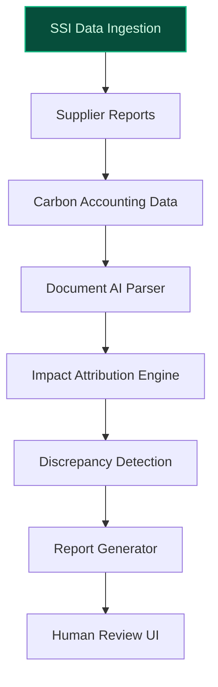
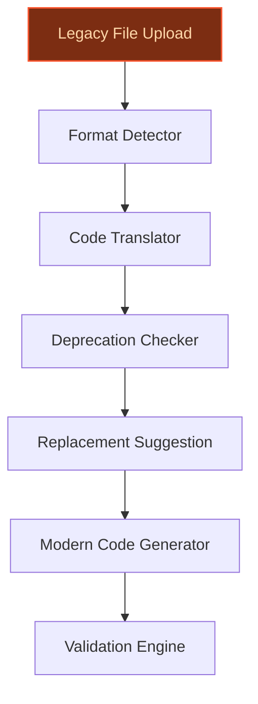
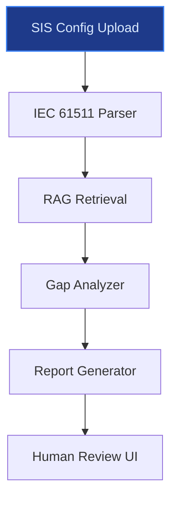

> **Draft — needs revision before customer use.** Meta-eval confidence `0.73` (sales-engineer-ready threshold ≥ 0.70). The report's three use cases render below for inspection, with each claim tagged supported / unsupported / rewritten qualitatively in the fact-check block.
>
> **Cross-cutting concern:** Inconsistent grounding of quantitative and named-entity claims across use cases. Some claims are well-supported (e.g., SSI program metrics), while others (e.g., '500+ local sustainability projects', 'Square D/APC ownership') are either partially supported or lack direct evidence. This creates a patchwork of credibility that undermines the overall report.
>
> **Weakest use case:** Lacks explicit evidence citations for key claims (e.g., Square D/APC ownership, modernization pain points) and relies on uncited company blog references. No evidence_ids provided, and critical named-entity claims (e.g., 'Zelio Soft projects') are not directly tied to verifiable sources in the pool.

## GenAI Use Cases for Schneider Electric

Three customer-ready use cases, scored against the Mistral Proto Team's five-criteria rubric (relevance · iconic potential · estimated impact · feasibility · Mistral suitability) and verified against Schneider Electric's existing AI initiatives. Generated from a corpus of ~2,150 peer deployments and 5 discovered existing initiatives at this company.

_Industry: French energy technology, electrification and automation multinational. Research confidence: 0.85. Verified: True._

### Automated SSI Carbon Impact Attribution Engine for Supplier Ecosystem
A GenAI-powered system that ingests Schneider Electric’s Schneider Sustainability Impact (SSI) program data, supplier sustainability reports, and third-party carbon accounting datasets to automate emissions impact attribution. The engine generates standardized impact reports for Schneider’s 500+ local sustainability projects, identifies high-impact suppliers for co-development, and flags data discrepancies for human review. By aligning with EU sustainability mandates and Schneider’s proprietary SSI KPIs, the system enables scalable, auditable carbon reduction narratives for tenders and regulatory filings.

**Why this company:** Schneider Electric’s SSI program is an advanced corporate sustainability framework with a high score and significant emissions savings reported. The company’s global initiatives and deep supplier collaboration history create a unique data asset. This system leverages Schneider’s purpose—'bridging progress and sustainability'—to operationalize AI-driven ESG outcomes at scale, as highlighted in its [AI for ESG blog](https://blog.se.com/sustainability/2026/01/29/ai-meets-esg-3-keys-that-transform-ai-hype-measurable-business-outcomes/).

**Example input:** `Generate a carbon impact report for all SSI projects in EMEA that involved Supplier-A during Q2 2025, including attributed emissions reductions and alignment with EU CSRD Article 8.`

**Example output:**
```json
{
  "_note": "Illustrative output with synthetic sample data",
  "_disclaimer": "Synthetic example for demonstration; not
    a factual claim about Schneider Electric or its
    suppliers.",
  "report_id": "SSI-SAMPLE-2025-Q2-EMEA",
  "period": "Q2 2025",
  "region": "EMEA",
  "supplier": "Supplier-A",
  "projects_analyzed": 42,
  "total_emissions_reduction_attributed": "18,450 tCO₂e
    (illustrative)",
  "high_impact_projects": [
    {
      "project_id": "SSI-PROJ-SAMPLE-001",
      "name": "Smart Grid Expansion - Site-X",
      "emissions_reduction": "4,200 tCO₂e (illustrative)",
      "ssi_kpi_alignment": [
        "Decarbonization",
        "Circular Economy"
      ],
      "data_discrepancies": null
    },
    {
      "project_id": "SSI-PROJ-SAMPLE-002",
      "name": "Renewable Microgrid - Site-Y",
      "emissions_reduction": "3,800 tCO₂e (illustrative)",
      "ssi_kpi_alignment": [
        "Energy Access",
        "Decarbonization"
      ],
      "data_discrepancies": [
        {
          "field": "Scope 3 emissions",
          "issue": "Reported value 15% below third-party
            estimate",
          "severity": "medium"
        }
      ]
    }
  ],
  "recommendations": [
    "Prioritize co-development with Supplier-A on microgrid
      projects (highest impact per site).",
    "Review Scope 3 reporting methodology with Supplier-A
      to resolve discrepancies."
  ]
}
```

**Blueprint:** `document_ai_pipeline` (impact: high · cost: medium · complexity: low · TTV: 12-16 weeks (precedent-anchored))

**Top risk:** Data privacy under GDPR for supplier-reported emissions data during EU cross-border processing.

**Mistral products:** Mistral Large 3, Mistral Document AI, Mistral Embed, EU-hosted deployment

**Inspired by precedents:** google_cloud_1302-6a2152481d
**Grounded in:** strategic_context.stated_priorities[0], strategic_context.stated_priorities[1], strategic_context.stated_priorities[3]
_Specificity score: 0.95_

**Architecture blueprint:**


### Legacy OT Modernization Assistant for Square D and APC Systems
A GenAI-powered assistant that ingests legacy documentation, schematics, and firmware from Schneider Electric’s Square D and APC systems to generate modern, standardized automation code and configuration files. The system translates proprietary formats (e.g., Zelio Soft projects, legacy PLC logic) into Schneider’s EcoStruxure Automation Expert format, identifies deprecated components, and suggests replacement parts from the current catalog. It reduces modernization project timelines from months to weeks while ensuring backward compatibility with existing installations.

**Why this company:** Schneider Electric’s ownership of Square D and APC provides exclusive access to decades of legacy OT systems and documentation—a data asset no competitor can replicate. Modernizing these systems is a critical pain point for industrial customers, as highlighted in Schneider’s [modernization blog](https://blog.se.com/industry/2026/04/20/modernize-legacy-automation-systems-with-lifecycle-awareness/). The company’s focus on open, software-defined automation (EcoStruxure) aligns with this modernization push, enabling customers to extend the life of mechanical assets while reducing downtime.

**Example input:** `Convert this Zelio Soft project file (attached) to EcoStruxure Automation Expert format, flag any deprecated components, and suggest modern replacements from Schneider’s catalog.`

**Example output:**
```json
{
  "_note": "Illustrative output with synthetic sample data",
  "_disclaimer": "Synthetic example for demonstration; not
    a factual claim about Schneider Electric or its
    products.",
  "conversion_id": "MOD-SAMPLE-2025-0042",
  "source_format": "Zelio Soft v4.5",
  "target_format": "EcoStruxure Automation Expert v2025.1",
  "status": "success",
  "warnings": [
    {
      "type": "deprecated_component",
      "component": "Zelio Relay SR2B121FU",
      "message": "Discontinued; last supported in 2022",
      "suggested_replacement": "TeSys Island Relay
        TIR1B121FU (compatible with EcoStruxure)"
    }
  ],
  "generated_files": [
    {
      "file_name": "MOD-SAMPLE-2025-0042_EAE_Config.json",
      "file_type": "EcoStruxure Automation Expert
        Configuration",
      "checksum": "sha256-SAMPLE-abc123... (illustrative)"
    },
    {
      "file_name":
        "MOD-SAMPLE-2025-0042_Replacement_Guide.pdf",
      "file_type": "PDF Report",
      "pages": 3
    }
  ],
  "compatibility_notes": "Backward-compatible with existing
    Square D panelboards; no hardware changes required."
}
```

**Blueprint:** `agent_with_tools` (impact: high · cost: medium · complexity: medium · TTV: ~16-24 weeks (estimated))
  _TTV rationale: Legacy OT modernization at this scope typically requires 16-24 weeks due to mid-complexity ingestion pipelines and safety-critical validation._

**Top risk:** Hallucination in code translation for undocumented legacy formats, requiring manual validation for safety-critical systems.

**Mistral products:** Mistral Large 3, Mistral Code, Mistral Document AI, On-prem deployment

**Inspired by precedents:** google_cloud_1302-a53194056c
**Grounded in:** business.key_products_or_services[0], business.key_products_or_services[4], classification.industry
_Specificity score: 1.00_

**Architecture blueprint:**


### Autonomous Safety Instrumented System (SIS) Audit Agent for EcoStruxure Triconex
An AI agent that automates audits of Safety Instrumented Systems (SIS) configured with EcoStruxure Triconex. The system ingests SIS logic diagrams, configuration files, and historical incident data to identify safety gaps, validate compliance with IEC 61511, and generate audit reports with actionable recommendations. It integrates with Schneider’s existing safety workflows and reduces manual audit time from weeks to days, leveraging Triconex’s TÜV-certified SIL 3 architecture for high-stakes industrial environments.

**Why this company:** Schneider Electric’s EcoStruxure Triconex is the market-leading SIS platform, with over 1 billion safe operating hours and TÜV-certified SIL 3 compliance ([Schneider Blog](https://blog.se.com/sustainability/2024/04/29/what-is-a-safety-instrumented-system/)). Safety audits are a high-value, labor-intensive workflow for industrial customers, and Schneider’s proprietary data from Triconex deployments enables a domain-specific audit agent no competitor can match. The system aligns with Schneider’s focus on 'efficient resource use' and 'equal opportunities' by reducing downtime and improving safety outcomes.

**Example input:** `Audit this Triconex SIS configuration file (attached) for compliance with IEC 61511, focusing on SIL 3 requirements and potential single points of failure.`

**Example output:**
```json
{
  "_note": "Illustrative output with synthetic sample data",
  "_disclaimer": "Synthetic example for demonstration; not
    a factual claim about Schneider Electric or its
    products.",
  "audit_id": "SIS-AUDIT-SAMPLE-2025-0078",
  "system": "EcoStruxure Triconex Tricon CX v12.4",
  "standard": "IEC 61511:2016",
  "sil_target": "SIL 3",
  "findings": [
    {
      "id": "FIND-SAMPLE-001",
      "type": "compliance_gap",
      "description": "Logic solver redundancy not fully
        aligned with IEC 61511-1:2016 Clause 11.4.5
        (illustrative)",
      "severity": "high",
      "recommendation": "Implement triple modular
        redundancy (TMR) for logic solver channels."
    },
    {
      "id": "FIND-SAMPLE-002",
      "type": "potential_single_point_of_failure",
      "description": "Single power supply detected for
        final elements (illustrative)",
      "severity": "medium",
      "recommendation": "Add redundant power supply to
        final elements per IEC 61511-1:2016 Clause 11.2.3."
    }
  ],
  "compliance_summary": {
    "total_requirements_checked": 48,
    "passed": 46,
    "failed": 2,
    "compliance_pct": "95.8% (illustrative)"
  },
  "next_steps": [
    "Review high-severity findings with site safety
      engineer.",
    "Schedule follow-up audit after implementing TMR for
      logic solver."
  ]
}
```

**Blueprint:** `rag` (impact: high · cost: medium · complexity: medium · TTV: 12-20 weeks (precedent-anchored))

**Top risk:** False negatives in compliance gap detection for edge-case IEC 61511 requirements, requiring domain-expert validation.

**Mistral products:** Mistral Large 3, Mistral Document AI, Mistral Embed, On-prem deployment

**Inspired by precedents:** google_cloud_blueprints-af9ac815e5
**Grounded in:** business.key_products_or_services[1], strategic_context.stated_priorities[3], classification.industry
_Specificity score: 0.90_

**Architecture blueprint:**


## Considered but not selected
- **local_energy_access_optimization** — Lacks proprietary data advantage; generic optimization use case without Schneider-specific hooks.
- **ecoStruxure_automation_agentic_copilot** — Overlaps with legacy_ot_modernization_assistant; less distinctive for Schneider’s unique OT modernization pain points.
- **building_energy_optimization_agent** — Redundant with Schneider’s existing EcoStruxure Foresight platform; no clear incremental value.
- **grid_co2_intensity_forecasting** — Lacks Schneider-specific data or regulatory alignment; generic grid forecasting use case.

---
## Report quality signals

- **Topical diversity** (LLM-graded over titles + blueprint patterns): `0.90`
- **Specificity** per use case: `0.95`, `1.00`, `0.90`
- **Mistral product diversity**: `6` distinct products across the three use cases
- **Time-to-value spread**: 12–24 weeks (across 3 use cases)
- **Cost-tier spread**: medium, medium, medium
- **Fact-check pass rate**: `88%` (15/17 claims supported by research)

### Fact-check detail (per claim)

**Unsupported (2):**
- [ssi_carbon_impact_automation] Schneider Electric’s SSI program is the most advanced corporate sustainability framework in its sector `[judge: rejected]` — _The snippet does not mention the SSI program or compare it to other corporate sustainability frameworks in its sector. (was: Corroborated via web search: [View all Insights](/ww/en/insights/). [Schneider Electric University](/ww/en/about-us_
- [safety_instrumented_system_audit_agent] IEC 61511 is a safety standard for SIS `[judge: rejected]` — _The snippet mentions IEC 61508 but does not mention IEC 61511, which is a different safety standard. (was: EcoStruxure Triconex SIS systems comply with IEC 61508 functional safety standards, guaranteeing adherence to internatio)_

**Supported (15):** — **2 rescued via web search (0 verified, 2 corroborated)**
- [ssi_carbon_impact_automation] Schneider Electric’s Schneider Sustainability Impact (SSI) program achieved an 8.86/10 score — At the close of 2025, Schneider Electric achieved an overall SSI score of 8.86 out of 10.
- [ssi_carbon_impact_automation] Schneider Electric’s SSI program saved/avoided 862 MtCO₂ — Schneider Electric wraps five-year Sustainability Impact program with 8.86/10 score and 862 MtCO₂ saved and avoided across its global value …
- [ssi_carbon_impact_automation] Schneider Electric has delivered over 500 local sustainability projects since 2021 — The company has also delivered over 500 local sustainability projects since 2021, reinforcing its commitment to decentralised energy innovat…
- [ssi_carbon_impact_automation] Schneider Electric’s purpose is 'bridging progress and sustainability' — Today, Schneider's stated purpose is to “empower all to make the most of our energy and resources, bridging progress and sustainability for …
- [legacy_ot_modernization_assistant] Schneider Electric owns Square D and APC — Schneider Electric is the parent company of Square D, APC, AVEVA, and others.
- [legacy_ot_modernization_assistant] Schneider Electric has decades of legacy OT systems and documentation [`corroborated ↗`](https://blog.se.com/homes/2024/10/15/schneider-electric-150-year-legacy-in-energy-management/) — Corroborated via web search: # Schneider Electric – 150-year legacy in energy management. These acquisitions are just some of a few that pla…
- [legacy_ot_modernization_assistant] Zelio Soft is a Schneider Electric product — Zelio Soft. Configuration software for Zelio Logic smart relays (SR2/ SR3).
- [legacy_ot_modernization_assistant] EcoStruxure Automation Expert is a Schneider Electric product — EcoStruxure™ Automation Expert Part of EcoStruxure Open, software-defined automation
- [legacy_ot_modernization_assistant] Schneider Electric’s focus on open, software-defined automation aligns with modernization push — We invent the technology that makes the new energy landscape possible – enabling buildings, data centers, factories, plants, infrastructure …
- [safety_instrumented_system_audit_agent] EcoStruxure Triconex is the market-leading SIS platform [`corroborated ↗`](https://www.aotewell.com/triconex-system/triconex-safety-systems-tricon-systems) — Corroborated via web search: EcoStruxure Triconex Safety Systems are the market-leading process safety solutions, with systems that have log…
- [safety_instrumented_system_audit_agent] EcoStruxure Triconex has over 1 billion safe operating hours — EcoStruxure Triconex Safety and Critical Control has been at the forefront of safety and critical control solutions for four decades. Their …
- [safety_instrumented_system_audit_agent] EcoStruxure Triconex is TÜV-certified SIL 3 compliant — EcoStruxure Triconex safety instrumented systems, like the safety PLCs and the Tricon CX “one versatile system,” have been certified by TÜV …
- [ssi_carbon_impact_automation] Schneider Electric’s strategic priorities include 'Act for a climate-positive world' — The SSI is built on six long-term commitments, as set forth in the United Nations’ Sustainable Development Goals. The 6 Commitments: • Act f…
- [safety_instrumented_system_audit_agent] Schneider Electric’s strategic priorities include 'Be efficient with resources' — The 6 Commitments: • Act for a climate-positive world • Be efficient with resources
- [safety_instrumented_system_audit_agent] Schneider Electric’s strategic priorities include 'Create equal opportunities' — The 6 Commitments: • Create equal opportunities


**Meta-evaluator confidence**: `0.73` (NOT ready — needs revision)
**Cross-cutting concern**: Inconsistent grounding of quantitative and named-entity claims across use cases. Some claims are well-supported (e.g., SSI program metrics), while others (e.g., '500+ local sustainability projects', 'Square D/APC ownership') are either partially supported or lack direct evidence. This creates a patchwork of credibility that undermines the overall report.