# Trace

## Execution trace — Schneider Electric

Started: `2026-05-10T22:29:29.845831+00:00`. Total wall time: `167.9s` across `43` recorded actions.

### Per-step time totals

| Step | Calls | Total time | Avg time |
|---|---:|---:|---:|
| `research` | 1 | 8.31s | 8312ms |
| `gap_fill` | 4 | 2.68s | 669ms |
| `retrieve` | 2 | 0.17s | 86ms |
| `generate` | 2 | 27.83s | 13913ms |
| `generate.web_search` | 2 | 7.94s | 3970ms |
| `score` | 2 | 25.91s | 12955ms |
| `verify` | 6 | 16.60s | 2766ms |
| `enrich` | 1 | 57.35s | 57348ms |
| `meta_eval` | 1 | 11.18s | 11175ms |
| `web_verify` | 1 | 1.95s | 1949ms |
| `source_judge` | 18 | 13.42s | 746ms |
| `final_qualify` | 1 | 1.80s | 1800ms |
| `quality_signals` | 2 | 4.35s | 2175ms |

### Chronological event log

- `22:29:30.780` **[research]** `mistral-medium-2604.chat.complete` — 8312ms
   - inputs: synthesize CompanyContext for Schneider Electric | depth=medium
   - outputs: industry='French energy technology, electrification and automation multinational' verified=True conf=0.75
- `22:29:39.096` **[gap_fill]** `mistral-small-2603.chat.complete` — 1001ms
   - inputs: generate gap queries | fields=['business_model', 'products', 'data_assets', 'priorities']
   - outputs: queries=4
- `22:29:47.873` **[gap_fill]** `mistral-small-2603.chat.complete` — 641ms
   - inputs: layer-2 extract field=priorities
   - outputs: items=6
- `22:29:47.878` **[gap_fill]** `mistral-small-2603.chat.complete` — 422ms
   - inputs: layer-2 extract field=data_assets
   - outputs: items=0
- `22:29:47.883` **[gap_fill]** `mistral-small-2603.chat.complete` — 611ms
   - inputs: layer-2 extract field=products
   - outputs: items=5
- `22:29:48.515` **[retrieve]** `mistral-embed.embeddings.create` — 167ms
   - inputs: company_query | industries='French energy technology, electrification and automation multinational'
   - outputs: embedded 1024-dim query vector
- `22:29:48.682` **[retrieve]** `precedent_corpus.cosine_topk` — 5ms
   - inputs: k=8 min_depth=0.4 target='Schneider Electric'
   - outputs: retrieved 8 | mmr=True | top_sim=0.786
- `22:29:50.518` **[generate]** `mistral-medium-2604.chat.complete` — 1751ms
   - inputs: iteration=0 tool_calls_used=0/2 tools=on
   - outputs: tool_calls=4 | content_chars=0
- `22:29:52.280` **[generate.web_search]** `tavily.search` — 4055ms
   - inputs: query='Schneider Electric EcoStruxure Automation Expert AI features 2025'
   - outputs: 2 raw results
- `22:29:57.151` **[generate.web_search]** `tavily.search` — 3885ms
   - inputs: query='Schneider Electric sustainability initiatives 2025 SSI program details'
   - outputs: 2 raw results
- `22:30:11.251` **[generate]** `mistral-medium-2604.chat.complete` — 26076ms
   - inputs: iteration=1 tool_calls_used=2/2 tools=off
   - outputs: tool_calls=0 | content_chars=16993
- `22:30:37.645` **[score]** `mistral-small-2603.chat.complete` — 13912ms
   - inputs: self-consistency pass T=0.2
   - outputs: scored 8 candidates
- `22:30:37.655` **[score]** `mistral-small-2603.chat.complete` — 11998ms
   - inputs: self-consistency pass T=0.4
   - outputs: scored 8 candidates
- `22:30:51.588` **[verify]** `tavily.search` — 2104ms
   - inputs: candidate=ssi_carbon_impact_automation | query='Schneider Electric Automated SSI Carbon Impact Attribution E'
   - outputs: 4 results
- `22:30:51.588` **[verify]** `tavily.search` — 2238ms
   - inputs: candidate=legacy_ot_modernization_assistant | query='Schneider Electric Legacy OT Modernization Assistant for Squ'
   - outputs: 4 results
- `22:30:51.589` **[verify]** `tavily.search` — 2047ms
   - inputs: candidate=safety_instrumented_system_audit_agent | query='Schneider Electric Autonomous Safety Instrumented System (SI'
   - outputs: 4 results
- `22:30:53.924` **[verify]** `mistral-small-2603.chat.complete` — 3594ms
   - inputs: verdict for ssi_carbon_impact_automation
   - outputs: verdict='pass'
- `22:30:54.396` **[verify]** `mistral-small-2603.chat.complete` — 4206ms
   - inputs: verdict for safety_instrumented_system_audit_agent
   - outputs: verdict='pass'
- `22:30:55.112` **[verify]** `mistral-small-2603.chat.complete` — 2407ms
   - inputs: verdict for legacy_ot_modernization_assistant
   - outputs: verdict='pass'
- `22:30:58.607` **[enrich]** `mistral-large-2512.chat.complete` — 57348ms
   - inputs: tier=standard parallel=False ids=['ssi_carbon_impact_automation', 'legacy_ot_modernization_assistant', 'safety_instrumented_system_audit_agent']
   - outputs: enriched 3 use cases
- `22:31:55.985` **[meta_eval]** `mistral-medium-2604.chat.complete` — 11175ms
   - inputs: reviewing 3 use cases
   - outputs: review + claims
- `22:32:07.179` **[web_verify]** `tavily.search.rescue_unsupported_claims` — 1949ms
   - inputs: company='Schneider Electric' unsupported=3 budget=12
   - outputs: rescued: verified=0 corroborated=3 of 3 attempted
- `22:32:09.131` **[source_judge]** `mistral-small-2603.judge_claim_sources` — 1828ms
   - inputs: pairs=17
   - outputs: judged 17 pairs
- `22:32:09.131` **[source_judge]** `mistral-small-2603.chat.complete` — 666ms
   - inputs: claim='Schneider Electric’s Schneider Sustainability Impact (SSI) p'
   - outputs: verdict=supported
- `22:32:09.136` **[source_judge]** `mistral-small-2603.chat.complete` — 676ms
   - inputs: claim='Schneider Electric’s SSI program saved/avoided 862 MtCO₂'
   - outputs: verdict=supported
- `22:32:09.140` **[source_judge]** `mistral-small-2603.chat.complete` — 761ms
   - inputs: claim='Schneider Electric has delivered over 500 local sustainabili'
   - outputs: verdict=supported
- `22:32:09.143` **[source_judge]** `mistral-small-2603.chat.complete` — 827ms
   - inputs: claim='Schneider Electric’s SSI program is the most advanced corpor'
   - outputs: verdict=unsupported
- `22:32:09.147` **[source_judge]** `mistral-small-2603.chat.complete` — 657ms
   - inputs: claim="Schneider Electric’s purpose is 'bridging progress and susta"
   - outputs: verdict=supported
- `22:32:09.152` **[source_judge]** `mistral-small-2603.chat.complete` — 651ms
   - inputs: claim='Schneider Electric owns Square D and APC'
   - outputs: verdict=supported
- `22:32:09.156` **[source_judge]** `mistral-small-2603.chat.complete` — 752ms
   - inputs: claim='Schneider Electric has decades of legacy OT systems and docu'
   - outputs: verdict=supported
- `22:32:09.160` **[source_judge]** `mistral-small-2603.chat.complete` — 692ms
   - inputs: claim='Zelio Soft is a Schneider Electric product'
   - outputs: verdict=supported
- `22:32:09.798` **[source_judge]** `mistral-small-2603.chat.complete` — 492ms
   - inputs: claim='EcoStruxure Automation Expert is a Schneider Electric produc'
   - outputs: verdict=supported
- `22:32:09.804` **[source_judge]** `mistral-small-2603.chat.complete` — 782ms
   - inputs: claim='Schneider Electric’s focus on open, software-defined automat'
   - outputs: verdict=supported
- `22:32:09.807` **[source_judge]** `mistral-small-2603.chat.complete` — 617ms
   - inputs: claim='EcoStruxure Triconex is the market-leading SIS platform'
   - outputs: verdict=supported
- `22:32:09.813` **[source_judge]** `mistral-small-2603.chat.complete` — 602ms
   - inputs: claim='EcoStruxure Triconex has over 1 billion safe operating hours'
   - outputs: verdict=supported
- `22:32:09.851` **[source_judge]** `mistral-small-2603.chat.complete` — 607ms
   - inputs: claim='EcoStruxure Triconex is TÜV-certified SIL 3 compliant'
   - outputs: verdict=supported
- `22:32:09.900` **[source_judge]** `mistral-small-2603.chat.complete` — 931ms
   - inputs: claim='IEC 61511 is a safety standard for SIS'
   - outputs: verdict=unsupported
- `22:32:09.908` **[source_judge]** `mistral-small-2603.chat.complete` — 557ms
   - inputs: claim="Schneider Electric’s strategic priorities include 'Act for a"
   - outputs: verdict=supported
- `22:32:09.971` **[source_judge]** `mistral-small-2603.chat.complete` — 657ms
   - inputs: claim="Schneider Electric’s strategic priorities include 'Be effici"
   - outputs: verdict=supported
- `22:32:10.290` **[source_judge]** `mistral-small-2603.chat.complete` — 669ms
   - inputs: claim="Schneider Electric’s strategic priorities include 'Create eq"
   - outputs: verdict=supported
- `22:32:11.133` **[final_qualify]** `mistral-small-2603.chat.complete` — 1800ms
   - inputs: use_case=ssi_carbon_impact_automation unsupported=1
   - outputs: qualified 4 fields
- `22:32:13.379` **[quality_signals]** `mistral-small-2603.chat.complete` — 3086ms
   - inputs: specificity grade (3 use cases)
   - outputs: scored 3 use cases
- `22:32:16.466` **[quality_signals]** `mistral-small-2603.chat.complete` — 1264ms
   - inputs: diversity grade
   - outputs: diversity=0.9

## Mermaid sequence

```mermaid
sequenceDiagram
    autonumber
    participant pipeline as pipeline
    participant mistral_medium_2604 as mistral-medium-2604
    participant mistral_small_2603 as mistral-small-2603
    participant mistral_embed as mistral-embed
    participant precedent_corpus as precedent_corpus
    participant tavily as tavily
    participant mistral_large_2512 as mistral-large-2512
    participant tavily_search as tavily.search
    pipeline->>mistral_medium_2604: research: chat.complete (8312ms)
    mistral_medium_2604-->>pipeline: industry='French energy technology, electrification and auto
    pipeline->>mistral_small_2603: gap_fill: chat.complete (1001ms)
    mistral_small_2603-->>pipeline: queries=4
    pipeline->>mistral_small_2603: gap_fill: chat.complete (641ms)
    mistral_small_2603-->>pipeline: items=6
    pipeline->>mistral_small_2603: gap_fill: chat.complete (422ms)
    mistral_small_2603-->>pipeline: items=0
    pipeline->>mistral_small_2603: gap_fill: chat.complete (611ms)
    mistral_small_2603-->>pipeline: items=5
    pipeline->>mistral_embed: retrieve: embeddings.create (167ms)
    mistral_embed-->>pipeline: embedded 1024-dim query vector
    pipeline->>precedent_corpus: retrieve: cosine_topk (5ms)
    precedent_corpus-->>pipeline: retrieved 8 | mmr=True | top_sim=0.786
    pipeline->>mistral_medium_2604: generate: chat.complete (1751ms)
    mistral_medium_2604-->>pipeline: tool_calls=4 | content_chars=0
    pipeline->>tavily: generate.web_search: search (4055ms)
    tavily-->>pipeline: 2 raw results
    pipeline->>tavily: generate.web_search: search (3885ms)
    tavily-->>pipeline: 2 raw results
    pipeline->>mistral_medium_2604: generate: chat.complete (26076ms)
    mistral_medium_2604-->>pipeline: tool_calls=0 | content_chars=16993
    pipeline->>mistral_small_2603: score: chat.complete (13912ms)
    mistral_small_2603-->>pipeline: scored 8 candidates
    pipeline->>mistral_small_2603: score: chat.complete (11998ms)
    mistral_small_2603-->>pipeline: scored 8 candidates
    pipeline->>tavily: verify: search (2104ms)
    tavily-->>pipeline: 4 results
    pipeline->>tavily: verify: search (2238ms)
    tavily-->>pipeline: 4 results
    pipeline->>tavily: verify: search (2047ms)
    tavily-->>pipeline: 4 results
    pipeline->>mistral_small_2603: verify: chat.complete (3594ms)
    mistral_small_2603-->>pipeline: verdict='pass'
    pipeline->>mistral_small_2603: verify: chat.complete (4206ms)
    mistral_small_2603-->>pipeline: verdict='pass'
    pipeline->>mistral_small_2603: verify: chat.complete (2407ms)
    mistral_small_2603-->>pipeline: verdict='pass'
    pipeline->>mistral_large_2512: enrich: chat.complete (57348ms)
    mistral_large_2512-->>pipeline: enriched 3 use cases
    pipeline->>mistral_medium_2604: meta_eval: chat.complete (11175ms)
    mistral_medium_2604-->>pipeline: review + claims
    pipeline->>tavily_search: web_verify: rescue_unsupported_claims (1949ms)
    tavily_search-->>pipeline: rescued: verified=0 corroborated=3 of 3 attempted
    pipeline->>mistral_small_2603: source_judge: judge_claim_sources (1828ms)
    mistral_small_2603-->>pipeline: judged 17 pairs
    pipeline->>mistral_small_2603: source_judge: chat.complete (666ms)
    mistral_small_2603-->>pipeline: verdict=supported
    pipeline->>mistral_small_2603: source_judge: chat.complete (676ms)
    mistral_small_2603-->>pipeline: verdict=supported
    pipeline->>mistral_small_2603: source_judge: chat.complete (761ms)
    mistral_small_2603-->>pipeline: verdict=supported
    pipeline->>mistral_small_2603: source_judge: chat.complete (827ms)
    mistral_small_2603-->>pipeline: verdict=unsupported
    pipeline->>mistral_small_2603: source_judge: chat.complete (657ms)
    mistral_small_2603-->>pipeline: verdict=supported
    pipeline->>mistral_small_2603: source_judge: chat.complete (651ms)
    mistral_small_2603-->>pipeline: verdict=supported
    pipeline->>mistral_small_2603: source_judge: chat.complete (752ms)
    mistral_small_2603-->>pipeline: verdict=supported
    pipeline->>mistral_small_2603: source_judge: chat.complete (692ms)
    mistral_small_2603-->>pipeline: verdict=supported
    pipeline->>mistral_small_2603: source_judge: chat.complete (492ms)
    mistral_small_2603-->>pipeline: verdict=supported
    pipeline->>mistral_small_2603: source_judge: chat.complete (782ms)
    mistral_small_2603-->>pipeline: verdict=supported
    pipeline->>mistral_small_2603: source_judge: chat.complete (617ms)
    mistral_small_2603-->>pipeline: verdict=supported
    pipeline->>mistral_small_2603: source_judge: chat.complete (602ms)
    mistral_small_2603-->>pipeline: verdict=supported
    pipeline->>mistral_small_2603: source_judge: chat.complete (607ms)
    mistral_small_2603-->>pipeline: verdict=supported
    pipeline->>mistral_small_2603: source_judge: chat.complete (931ms)
    mistral_small_2603-->>pipeline: verdict=unsupported
    pipeline->>mistral_small_2603: source_judge: chat.complete (557ms)
    mistral_small_2603-->>pipeline: verdict=supported
    pipeline->>mistral_small_2603: source_judge: chat.complete (657ms)
    mistral_small_2603-->>pipeline: verdict=supported
    pipeline->>mistral_small_2603: source_judge: chat.complete (669ms)
    mistral_small_2603-->>pipeline: verdict=supported
    pipeline->>mistral_small_2603: final_qualify: chat.complete (1800ms)
    mistral_small_2603-->>pipeline: qualified 4 fields
    pipeline->>mistral_small_2603: quality_signals: chat.complete (3086ms)
    mistral_small_2603-->>pipeline: scored 3 use cases
    pipeline->>mistral_small_2603: quality_signals: chat.complete (1264ms)
    mistral_small_2603-->>pipeline: diversity=0.9
```

