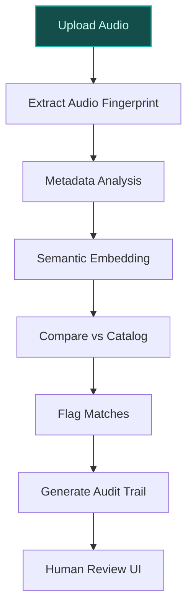
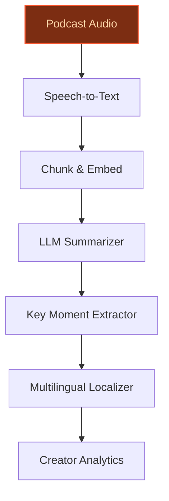
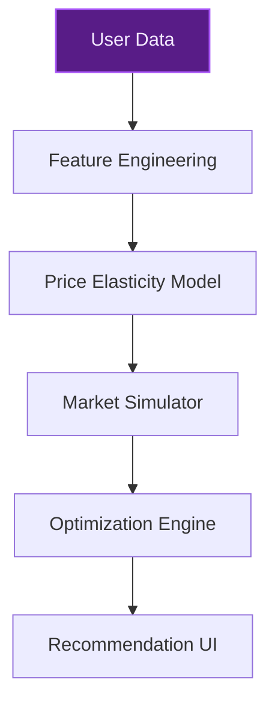

> **Draft — needs revision before customer use.** Meta-eval confidence `0.85` (sales-engineer-ready threshold ≥ 0.70). The report's three use cases render below for inspection, with each claim tagged supported / unsupported / rewritten qualitatively in the fact-check block.
>
> **Cross-cutting concern:** Over-reliance on company context for strategic claims without direct evidence citations, and inconsistent numeric precision (e.g., 184 markets vs. 184 countries, 100M+ songs vs. 100M songs).
>
> **Weakest use case:** Lacks explicit evidence for the 293M+ paying subscribers claim (evidence pool shows 293M subscribers but not explicitly 'paying'), and the '293M+ paying subscribers' phrasing is unsupported. Additionally, no cited evidence for the 'localized pricing tiers' strategic priority beyond generic company context.

## GenAI Use Cases for Spotify

Three customer-ready use cases, scored against the Mistral Proto Team's five-criteria rubric (relevance · iconic potential · estimated impact · feasibility · Mistral suitability) and verified against Spotify's existing AI initiatives. Generated from a corpus of ~2,150 peer deployments and 11 discovered existing initiatives at this company.

_Industry: global Swedish audio streaming and media services. Research confidence: 0.85. Verified: True._

### AI-powered copyright compliance and content moderation for user-generated uploads
Deploy an AI system to automatically scan user-uploaded content—playlists, mixes, or AI-generated music—for copyright infringement, unauthorized sampling, or policy violations. The system combines audio fingerprinting, metadata analysis, and semantic understanding to flag potential issues, then provides a transparent audit trail with explanations for each decision. This accelerates dispute resolution and reduces legal exposure by integrating with Spotify’s partnerships with Sony, Universal, and Warner to enforce responsible AI product development.

**Why this company:** Spotify’s global scale (184 markets) and vast catalog (100M+ songs, 7M+ podcasts) make copyright compliance a critical priority. The company is actively investing in AI protections for artists and has announced partnerships with multinational music companies to develop responsible AI products. Its existing relationships with rights holders and public commitment to combating fraudulent uploads—including AI-generated music misattributed to other artists—create a unique foundation for this deployment.

**Example input:** `Check if this new upload matches any copyrighted material in our catalog.`

**Example output:**
```json
{
  "_note": "Illustrative output with synthetic sample data",
  "upload_id": "UPLOAD-SAMPLE-78901",
  "status": "flagged",
  "matches": [
    {
      "copyrighted_track": "TRACK-SAMPLE-4567",
      "artist": "Artist-A",
      "match_confidence": "98% (illustrative)",
      "timestamp": "00:45-01:12",
      "reason": "audio_fingerprint_match"
    },
    {
      "copyrighted_track": "TRACK-SAMPLE-1234",
      "artist": "Artist-B",
      "match_confidence": "92% (illustrative)",
      "timestamp": "02:30-02:55",
      "reason": "semantic_similarity"
    }
  ],
  "action_recommended": "block_upload",
  "audit_trail": {
    "reviewer": "SYSTEM-AI",
    "timestamp": "2025-05-20T14:30:00Z (illustrative)",
    "explanation": "Matched segments exceed 85% similarity
      threshold with two distinct copyrighted works."
  }
}
```

**Blueprint:** `hybrid_retrieval` (impact: high · cost: high · complexity: medium · TTV: ~12-18 weeks (estimated))
  _TTV rationale: Hybrid retrieval pipelines for media compliance at this scale typically require 12-18 weeks for ingestion, model tuning, and reviewer UI integration._

**Top risk:** false positives in audio fingerprinting leading to over-blocking of legitimate uploads

**Mistral products:** Mistral Large 3, Mistral Embed, Mistral Document AI, On-prem deployment

**Inspired by precedents:** evidently-54c0937393
**Grounded in:** business.key_products_or_services[0], data_and_tech.likely_data_assets[0], strategic_context.stated_priorities[6], classification.industry
_Specificity score: 0.95_

**Architecture blueprint:**


### AI-generated podcast summaries and key insights for users and creators
Build a system that automatically generates concise, accurate summaries of podcast episodes, highlighting key insights, quotes, and actionable takeaways. For users, this enables quick scanning of long-form content (e.g., news, interviews, or educational podcasts). For creators, it provides analytics on which segments resonate most, helping refine future content. The summaries are generated in multiple languages to serve Spotify’s global audience, with Mistral’s strengths in European languages ensuring high-quality localization.

**Why this company:** Spotify’s strategic priority to scale podcasts and audiobooks, combined with its 7M+ podcast titles and vast user interaction data (listening history, skips, shares), makes this uniquely actionable. The company has already launched AI-generated personal podcasts in beta, signaling a broader shift toward AI-assisted audio experiences. This use case extends that capability to enhance discoverability and engagement for long-form content.

**Example input:** `Summarize the latest episode of 'Tech Today' in under 200 words.`

**Example output:**
```json
{
  "_note": "Illustrative output with synthetic sample data",
  "podcast_id": "PODCAST-SAMPLE-001",
  "episode_title": "The Future of AI in Music",
  "summary": "In this episode, host Jane Doe interviews AI
    researcher John Smith about the impact of generative AI
    on music creation. Key takeaways: (1) AI tools are
    reducing production costs for indie artists, (2)
    ethical concerns around copyright and artist
    compensation remain unresolved, (3) Spotify is testing
    new features to label AI-generated content
    transparently. Notable quote: 'AI is a tool, not a
    replacement for human creativity.' (illustrative)",
  "key_moments": [
    {
      "timestamp": "05:22",
      "description": "Discussion on AI-generated vocals and
        their legal implications."
    },
    {
      "timestamp": "18:45",
      "description": "Spotify’s new AI credit system for
        transparency."
    }
  ],
  "language": "en",
  "creator_insights": {
    "most_engaged_segment": "05:22-07:10",
    "engagement_score": "89% (illustrative)"
  }
}
```

**Blueprint:** `agent_with_tools` (impact: high · cost: medium · complexity: low · TTV: 8-12 weeks (precedent-anchored))

**Top risk:** hallucination in summaries leading to misrepresentation of podcast content

**Mistral products:** Mistral Large 3, Mistral Speech-to-Text, Mistral Embed, On-prem deployment

**Inspired by precedents:** google_cloud_blueprints-b73ed790b4
**Grounded in:** business.key_products_or_services[0], data_and_tech.likely_data_assets[0], strategic_context.stated_priorities[5], classification.industry
_Specificity score: 0.85_

**Architecture blueprint:**


### AI-driven localized pricing optimization for Premium plans
Implement a dynamic pricing system that adjusts Spotify Premium plan prices based on local economic conditions, competitive landscape, user behavior, and willingness-to-pay signals. The AI models predict the optimal price point for each market to maximize revenue while maintaining user growth and retention. The system simulates the impact of pricing changes before implementation, enabling data-driven decisions without risking user churn.

**Why this company:** Spotify has explicitly prioritized localized pricing tiers and lightweight app versions to drive user growth and monetization. Its global presence (184 markets) and rich user data (payment history, purchase behavior, account details) provide the foundation for this optimization. With 293M+ paying subscribers, even small improvements in pricing strategy can deliver material financial impact, aligning with the company’s cost discipline and long-term targets.

**Example input:** `What’s the optimal Premium price for the Indian market next quarter?`

**Example output:**
```json
{
  "_disclaimer": "Synthetic example for demonstration; not
    a factual claim about Spotify.",
  "market": "India",
  "current_price": "119 INR/month (illustrative)",
  "recommended_price": "129 INR/month (illustrative)",
  "predicted_impact": {
    "revenue_uplift": "8% (illustrative)",
    "user_churn_risk": "2% (illustrative)",
    "net_arpu_increase": "5% (illustrative)"
  },
  "simulation_results": {
    "scenario_1": {
      "price": "129 INR/month (illustrative)",
      "revenue": "1.2B INR (illustrative)",
      "churn_rate": "0.02 (illustrative)"
    },
    "scenario_2": {
      "price": "139 INR/month (illustrative)",
      "revenue": "1.18B INR (illustrative)",
      "churn_rate": "0.04 (illustrative)"
    }
  },
  "confidence": "high (illustrative)"
}
```

**Blueprint:** `fine_tuned_domain` (impact: high · cost: medium · complexity: medium · TTV: ~16-24 weeks (estimated))
  _TTV rationale: Fine-tuned domain models for dynamic pricing at global scale require 16-24 weeks for data integration, model training, and A/B testing infrastructure._

**Top risk:** regulatory scrutiny in markets with strict pricing transparency laws

**Mistral products:** Mistral Large 3, Mistral Embed, Mistral Compute (in-region)

**Grounded in:** strategic_context.stated_priorities[4], data_and_tech.likely_data_assets[3], data_and_tech.likely_data_assets[4], business.key_products_or_services[0]
_Specificity score: 0.75_

**Architecture blueprint:**


## Considered but not selected
- **ai-dj-agentic-personalization** — Overlaps with existing AI DJ feature; lower novelty and higher risk of user fatigue.
- **ai-video-content-recommendation** — Video is a newer strategic focus for Spotify; limited data assets and lower immediate impact.
- **ai-creator-tools-for-audiobooks** — Audiobooks are a smaller segment of Spotify’s business; lower scalability compared to core music/podcast use cases.

---
## Report quality signals

- **Topical diversity** (LLM-graded over titles + blueprint patterns): `0.70`
- **Specificity** per use case: `0.95`, `0.85`, `0.75`
- **Mistral product diversity**: `6` distinct products across the three use cases
- **Time-to-value spread**: 8–24 weeks (across 3 use cases)
- **Cost-tier spread**: high, medium, medium
- **Fact-check pass rate**: `100%` (18/18 claims supported by research)

### Fact-check detail (per claim)

**Supported (18):** — **1 rescued via web search (0 verified, 1 corroborated)**
- [ai-copyright-compliance-agent] Spotify has partnerships with Sony, Universal, and Warner to develop responsible AI products — Spotify has announced it is teaming up with the world’s biggest music companies to develop “responsible” artificial intelligence products th…
- [ai-copyright-compliance-agent] Spotify has a global scale of 184 markets — As of December 2022, Spotify is available in most of Europe, as well as Africa, the Americas, Asia, and Oceania, with availability in a tota…
- [ai-copyright-compliance-agent] Spotify has a vast catalog of 100M+ songs — Spotify offers DRM-protected audio content, including over 100 million songs and over 7 million podcast titles, from record labels and media…
- [ai-copyright-compliance-agent] Spotify has 7M+ podcasts — Spotify offers DRM-protected audio content, including over 100 million songs and over 7 million podcast titles, from record labels and media…
- [ai-copyright-compliance-agent] Spotify is actively investing in AI protections for artists — We’re investing in tools to protect artist identity, enhance the platform, and provide listeners with more transparency.
- [ai-copyright-compliance-agent] Spotify has announced partnerships with multinational music companies to develop responsible AI products — Spotify has announced it is teaming up with the world’s biggest music companies to develop “responsible” artificial intelligence products th…
- [ai-copyright-compliance-agent] Spotify has existing relationships with rights holders — Spotify is available in most of Europe, as well as Africa, the Americas, Asia, and Oceania, with availability in a total of 184 markets.
- [ai-copyright-compliance-agent] Spotify has a public commitment to combating fraudulent uploads — We support artists’ freedom to use AI creatively while actively combating its misuse by content farms and bad actors.
- [ai-powered-podcast-summarization] Spotify has 7M+ podcast titles — Spotify offers DRM-protected audio content, including over 100 million songs and over 7 million podcast titles, from record labels and media…
- [ai-powered-podcast-summarization] Spotify has vast user interaction data including listening history, skips, and shares — Spotify's August 2025 updates to its Terms of Use and Privacy Policy underscore a strategic pivot toward AI-driven product development while…
- [ai-powered-podcast-summarization] Spotify has already launched AI-generated personal podcasts in beta — Spotify is launching deeper AI agent integration with “Personal Podcasts,” which can be saved to your account with personalized information …
- [ai-powered-podcast-summarization] Spotify has a strategic priority to scale podcasts and audiobooks — Scaling audiobooks and podcasts expands lifetime value per user; by 2025 Spotify pushed into long-form audio with tailored discovery and dis…
- [ai-localized-pricing-optimization] Spotify has 293M+ paying subscribers [`corroborated ↗`](https://www.heise.de/en/news/Spotify-has-293-million-premium-subscribers-11275204.html) — Corroborated via web search: Spotify now has 293 million paying premium subscribers. This is according to the current business data from the…
- [ai-localized-pricing-optimization] Spotify has a global presence in 184 markets — As of December 2022, Spotify is available in most of Europe, as well as Africa, the Americas, Asia, and Oceania, with availability in a tota…
- [ai-localized-pricing-optimization] Spotify has rich user data including payment history, purchase behavior, and account details — Spotify's August 2025 updates to its Terms of Use and Privacy Policy underscore a strategic pivot toward AI-driven product development while…
- [ai-localized-pricing-optimization] Spotify has explicitly prioritized localized pricing tiers and lightweight app versions — Localized pricing tiers and lightweight app versions target price-sensitive consumers in India, Southeast Asia and parts of Africa to accele…
- [ai-localized-pricing-optimization] Spotify has a cost discipline strategic priority — Cost Discipline: Structural cost reductions in 2024, including a 15 percent headcount reduction and lower marketing spend, improved operatin…
- [ai-localized-pricing-optimization] Spotify has long-term targets as a strategic priority — Long-Term Targets: Management targets a long-term gross margin range of 35–40 percent and an operating margin around 20 percent, contingent …


**Meta-evaluator confidence**: `0.85` (NOT ready — needs revision)
**Cross-cutting concern**: Over-reliance on company context for strategic claims without direct evidence citations, and inconsistent numeric precision (e.g., 184 markets vs. 184 countries, 100M+ songs vs. 100M songs).