# Trace

## Execution trace — Spotify

Started: `2026-05-10T22:37:55.825188+00:00`. Total wall time: `108.0s` across `40` recorded actions.

### Per-step time totals

| Step | Calls | Total time | Avg time |
|---|---:|---:|---:|
| `research` | 1 | 10.57s | 10572ms |
| `gap_fill` | 4 | 3.08s | 770ms |
| `retrieve` | 2 | 0.19s | 95ms |
| `generate` | 1 | 22.26s | 22263ms |
| `score` | 2 | 23.66s | 11828ms |
| `verify` | 6 | 19.51s | 3252ms |
| `enrich` | 1 | 14.66s | 14658ms |
| `meta_eval` | 1 | 11.82s | 11825ms |
| `web_verify` | 1 | 1.39s | 1387ms |
| `source_judge` | 19 | 12.80s | 674ms |
| `quality_signals` | 2 | 3.97s | 1983ms |

### Chronological event log

- `22:38:04.260` **[research]** `mistral-medium-2604.chat.complete` — 10572ms
   - inputs: synthesize CompanyContext for Spotify | depth=medium
   - outputs: industry='global Swedish audio streaming and media services' verified=True conf=0.75
- `22:38:14.834` **[gap_fill]** `mistral-small-2603.chat.complete` — 1141ms
   - inputs: generate gap queries | fields=['geography', 'business_model', 'products', 'data_assets', 'priorities']
   - outputs: queries=5
- `22:38:22.661` **[gap_fill]** `mistral-small-2603.chat.complete` — 717ms
   - inputs: layer-2 extract field=priorities
   - outputs: items=8
- `22:38:22.667` **[gap_fill]** `mistral-small-2603.chat.complete` — 662ms
   - inputs: layer-2 extract field=data_assets
   - outputs: items=6
- `22:38:22.671` **[gap_fill]** `mistral-small-2603.chat.complete` — 559ms
   - inputs: layer-2 extract field=products
   - outputs: items=6
- `22:38:23.382` **[retrieve]** `mistral-embed.embeddings.create` — 185ms
   - inputs: company_query | industries='global Swedish audio streaming and media services'
   - outputs: embedded 1024-dim query vector
- `22:38:23.567` **[retrieve]** `precedent_corpus.cosine_topk` — 4ms
   - inputs: k=8 min_depth=0.4 target='Spotify'
   - outputs: retrieved 8 | mmr=True | top_sim=0.807
- `22:38:25.384` **[generate]** `mistral-medium-2604.chat.complete` — 22263ms
   - inputs: iteration=0 tool_calls_used=0/0 tools=off
   - outputs: tool_calls=0 | content_chars=16223
- `22:38:47.934` **[score]** `mistral-small-2603.chat.complete` — 11425ms
   - inputs: self-consistency pass T=0.2
   - outputs: scored 8 candidates
- `22:38:47.939` **[score]** `mistral-small-2603.chat.complete` — 12230ms
   - inputs: self-consistency pass T=0.4
   - outputs: scored 8 candidates
- `22:39:00.205` **[verify]** `tavily.search` — 1999ms
   - inputs: candidate=ai-copyright-compliance-agent | query='Spotify AI-powered copyright compliance and content moderati'
   - outputs: 4 results
- `22:39:00.205` **[verify]** `tavily.search` — 2087ms
   - inputs: candidate=ai-powered-podcast-summarization | query='Spotify AI-generated podcast summaries and key insights for '
   - outputs: 4 results
- `22:39:00.206` **[verify]** `tavily.search` — 2085ms
   - inputs: candidate=ai-dj-agentic-personalization | query='Spotify Agentic AI DJ with dynamic, context-aware playlist c'
   - outputs: 4 results
- `22:39:02.742` **[verify]** `mistral-small-2603.chat.complete` — 4984ms
   - inputs: verdict for ai-dj-agentic-personalization
   - outputs: verdict='confirmed_existing'
- `22:39:02.754` **[verify]** `mistral-small-2603.chat.complete` — 3973ms
   - inputs: verdict for ai-powered-podcast-summarization
   - outputs: verdict='pass'
- `22:39:03.073` **[verify]** `mistral-small-2603.chat.complete` — 4382ms
   - inputs: verdict for ai-copyright-compliance-agent
   - outputs: verdict='pass'
- `22:39:07.730` **[enrich]** `mistral-medium-2604.chat.complete` — 14658ms
   - inputs: tier=fast parallel=False ids=['ai-copyright-compliance-agent', 'ai-powered-podcast-summarization', 'ai-localized-pricing-optimization']
   - outputs: enriched 3 use cases
- `22:39:22.419` **[meta_eval]** `mistral-medium-2604.chat.complete` — 11825ms
   - inputs: reviewing 3 use cases
   - outputs: review + claims
- `22:39:34.268` **[web_verify]** `tavily.search.rescue_unsupported_claims` — 1387ms
   - inputs: company='Spotify' unsupported=1 budget=12
   - outputs: rescued: verified=0 corroborated=1 of 1 attempted
- `22:39:35.658` **[source_judge]** `mistral-small-2603.judge_claim_sources` — 1896ms
   - inputs: pairs=18
   - outputs: judged 18 pairs
- `22:39:35.659` **[source_judge]** `mistral-small-2603.chat.complete` — 610ms
   - inputs: claim='Spotify has partnerships with Sony, Universal, and Warner to'
   - outputs: verdict=supported
- `22:39:35.663` **[source_judge]** `mistral-small-2603.chat.complete` — 607ms
   - inputs: claim='Spotify has a global scale of 184 markets'
   - outputs: verdict=supported
- `22:39:35.666` **[source_judge]** `mistral-small-2603.chat.complete` — 603ms
   - inputs: claim='Spotify has a vast catalog of 100M+ songs'
   - outputs: verdict=supported
- `22:39:35.670` **[source_judge]** `mistral-small-2603.chat.complete` — 600ms
   - inputs: claim='Spotify has 7M+ podcasts'
   - outputs: verdict=supported
- `22:39:35.677` **[source_judge]** `mistral-small-2603.chat.complete` — 625ms
   - inputs: claim='Spotify is actively investing in AI protections for artists'
   - outputs: verdict=supported
- `22:39:35.680` **[source_judge]** `mistral-small-2603.chat.complete` — 610ms
   - inputs: claim='Spotify has announced partnerships with multinational music '
   - outputs: verdict=supported
- `22:39:35.683` **[source_judge]** `mistral-small-2603.chat.complete` — 614ms
   - inputs: claim='Spotify has existing relationships with rights holders'
   - outputs: verdict=supported
- `22:39:35.686` **[source_judge]** `mistral-small-2603.chat.complete` — 647ms
   - inputs: claim='Spotify has a public commitment to combating fraudulent uplo'
   - outputs: verdict=supported
- `22:39:36.270` **[source_judge]** `mistral-small-2603.chat.complete` — 486ms
   - inputs: claim='Spotify has 7M+ podcast titles'
   - outputs: verdict=supported
- `22:39:36.275` **[source_judge]** `mistral-small-2603.chat.complete` — 568ms
   - inputs: claim='Spotify has vast user interaction data including listening h'
   - outputs: verdict=supported
- `22:39:36.279` **[source_judge]** `mistral-small-2603.chat.complete` — 664ms
   - inputs: claim='Spotify has already launched AI-generated personal podcasts '
   - outputs: verdict=supported
- `22:39:36.284` **[source_judge]** `mistral-small-2603.chat.complete` — 674ms
   - inputs: claim='Spotify has a strategic priority to scale podcasts and audio'
   - outputs: verdict=supported
- `22:39:36.290` **[source_judge]** `mistral-small-2603.chat.complete` — 516ms
   - inputs: claim='Spotify has 293M+ paying subscribers'
   - outputs: verdict=supported
- `22:39:36.298` **[source_judge]** `mistral-small-2603.chat.complete` — 600ms
   - inputs: claim='Spotify has a global presence in 184 markets'
   - outputs: verdict=supported
- `22:39:36.302` **[source_judge]** `mistral-small-2603.chat.complete` — 644ms
   - inputs: claim='Spotify has rich user data including payment history, purcha'
   - outputs: verdict=supported
- `22:39:36.333` **[source_judge]** `mistral-small-2603.chat.complete` — 495ms
   - inputs: claim='Spotify has explicitly prioritized localized pricing tiers a'
   - outputs: verdict=supported
- `22:39:36.756` **[source_judge]** `mistral-small-2603.chat.complete` — 594ms
   - inputs: claim='Spotify has a cost discipline strategic priority'
   - outputs: verdict=supported
- `22:39:36.806` **[source_judge]** `mistral-small-2603.chat.complete` — 747ms
   - inputs: claim='Spotify has long-term targets as a strategic priority'
   - outputs: verdict=supported
- `22:39:39.867` **[quality_signals]** `mistral-small-2603.chat.complete` — 2582ms
   - inputs: specificity grade (3 use cases)
   - outputs: scored 3 use cases
- `22:39:42.448` **[quality_signals]** `mistral-small-2603.chat.complete` — 1384ms
   - inputs: diversity grade
   - outputs: diversity=0.7

## Mermaid sequence

```mermaid
sequenceDiagram
    autonumber
    participant pipeline as pipeline
    participant mistral_medium_2604 as mistral-medium-2604
    participant mistral_small_2603 as mistral-small-2603
    participant mistral_embed as mistral-embed
    participant precedent_corpus as precedent_corpus
    participant tavily as tavily
    participant tavily_search as tavily.search
    pipeline->>mistral_medium_2604: research: chat.complete (10572ms)
    mistral_medium_2604-->>pipeline: industry='global Swedish audio streaming and media services'
    pipeline->>mistral_small_2603: gap_fill: chat.complete (1141ms)
    mistral_small_2603-->>pipeline: queries=5
    pipeline->>mistral_small_2603: gap_fill: chat.complete (717ms)
    mistral_small_2603-->>pipeline: items=8
    pipeline->>mistral_small_2603: gap_fill: chat.complete (662ms)
    mistral_small_2603-->>pipeline: items=6
    pipeline->>mistral_small_2603: gap_fill: chat.complete (559ms)
    mistral_small_2603-->>pipeline: items=6
    pipeline->>mistral_embed: retrieve: embeddings.create (185ms)
    mistral_embed-->>pipeline: embedded 1024-dim query vector
    pipeline->>precedent_corpus: retrieve: cosine_topk (4ms)
    precedent_corpus-->>pipeline: retrieved 8 | mmr=True | top_sim=0.807
    pipeline->>mistral_medium_2604: generate: chat.complete (22263ms)
    mistral_medium_2604-->>pipeline: tool_calls=0 | content_chars=16223
    pipeline->>mistral_small_2603: score: chat.complete (11425ms)
    mistral_small_2603-->>pipeline: scored 8 candidates
    pipeline->>mistral_small_2603: score: chat.complete (12230ms)
    mistral_small_2603-->>pipeline: scored 8 candidates
    pipeline->>tavily: verify: search (1999ms)
    tavily-->>pipeline: 4 results
    pipeline->>tavily: verify: search (2087ms)
    tavily-->>pipeline: 4 results
    pipeline->>tavily: verify: search (2085ms)
    tavily-->>pipeline: 4 results
    pipeline->>mistral_small_2603: verify: chat.complete (4984ms)
    mistral_small_2603-->>pipeline: verdict='confirmed_existing'
    pipeline->>mistral_small_2603: verify: chat.complete (3973ms)
    mistral_small_2603-->>pipeline: verdict='pass'
    pipeline->>mistral_small_2603: verify: chat.complete (4382ms)
    mistral_small_2603-->>pipeline: verdict='pass'
    pipeline->>mistral_medium_2604: enrich: chat.complete (14658ms)
    mistral_medium_2604-->>pipeline: enriched 3 use cases
    pipeline->>mistral_medium_2604: meta_eval: chat.complete (11825ms)
    mistral_medium_2604-->>pipeline: review + claims
    pipeline->>tavily_search: web_verify: rescue_unsupported_claims (1387ms)
    tavily_search-->>pipeline: rescued: verified=0 corroborated=1 of 1 attempted
    pipeline->>mistral_small_2603: source_judge: judge_claim_sources (1896ms)
    mistral_small_2603-->>pipeline: judged 18 pairs
    pipeline->>mistral_small_2603: source_judge: chat.complete (610ms)
    mistral_small_2603-->>pipeline: verdict=supported
    pipeline->>mistral_small_2603: source_judge: chat.complete (607ms)
    mistral_small_2603-->>pipeline: verdict=supported
    pipeline->>mistral_small_2603: source_judge: chat.complete (603ms)
    mistral_small_2603-->>pipeline: verdict=supported
    pipeline->>mistral_small_2603: source_judge: chat.complete (600ms)
    mistral_small_2603-->>pipeline: verdict=supported
    pipeline->>mistral_small_2603: source_judge: chat.complete (625ms)
    mistral_small_2603-->>pipeline: verdict=supported
    pipeline->>mistral_small_2603: source_judge: chat.complete (610ms)
    mistral_small_2603-->>pipeline: verdict=supported
    pipeline->>mistral_small_2603: source_judge: chat.complete (614ms)
    mistral_small_2603-->>pipeline: verdict=supported
    pipeline->>mistral_small_2603: source_judge: chat.complete (647ms)
    mistral_small_2603-->>pipeline: verdict=supported
    pipeline->>mistral_small_2603: source_judge: chat.complete (486ms)
    mistral_small_2603-->>pipeline: verdict=supported
    pipeline->>mistral_small_2603: source_judge: chat.complete (568ms)
    mistral_small_2603-->>pipeline: verdict=supported
    pipeline->>mistral_small_2603: source_judge: chat.complete (664ms)
    mistral_small_2603-->>pipeline: verdict=supported
    pipeline->>mistral_small_2603: source_judge: chat.complete (674ms)
    mistral_small_2603-->>pipeline: verdict=supported
    pipeline->>mistral_small_2603: source_judge: chat.complete (516ms)
    mistral_small_2603-->>pipeline: verdict=supported
    pipeline->>mistral_small_2603: source_judge: chat.complete (600ms)
    mistral_small_2603-->>pipeline: verdict=supported
    pipeline->>mistral_small_2603: source_judge: chat.complete (644ms)
    mistral_small_2603-->>pipeline: verdict=supported
    pipeline->>mistral_small_2603: source_judge: chat.complete (495ms)
    mistral_small_2603-->>pipeline: verdict=supported
    pipeline->>mistral_small_2603: source_judge: chat.complete (594ms)
    mistral_small_2603-->>pipeline: verdict=supported
    pipeline->>mistral_small_2603: source_judge: chat.complete (747ms)
    mistral_small_2603-->>pipeline: verdict=supported
    pipeline->>mistral_small_2603: quality_signals: chat.complete (2582ms)
    mistral_small_2603-->>pipeline: scored 3 use cases
    pipeline->>mistral_small_2603: quality_signals: chat.complete (1384ms)
    mistral_small_2603-->>pipeline: diversity=0.7
```

