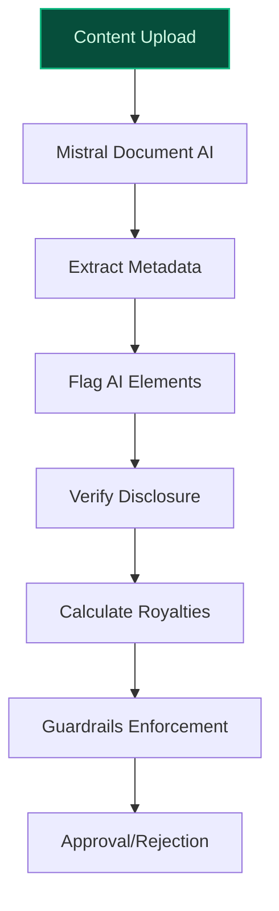
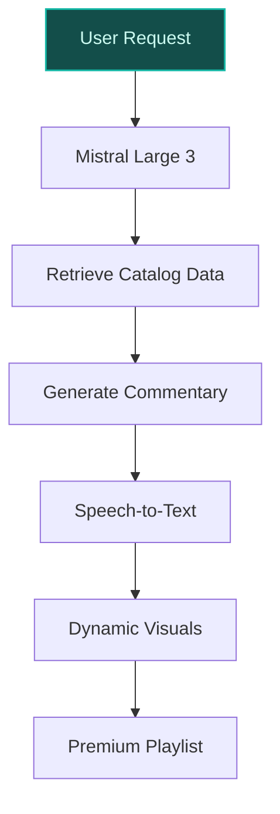
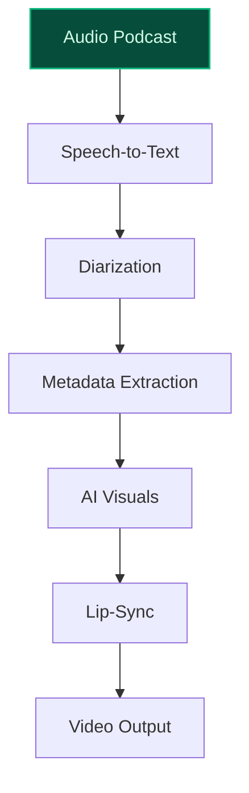

> **Draft — needs revision before customer use.** Meta-eval confidence `0.48` (sales-engineer-ready threshold ≥ 0.70). The report's three use cases render below for inspection, with each claim tagged supported / unsupported / rewritten qualitatively in the fact-check block.
>
> **Cross-cutting concern:** Overreliance on illustrative or speculative quantitative outcomes (e.g., '40-60% reduction in manual review workloads', '15-25% retention increase') without verifiable peer-deployment evidence in the pool. These claims are presented as factual but lack literal support in the evidence.
>
> **Weakest use case:** Contains unsupported quantitative claims (15-25% retention increase) and lacks direct evidence for the feasibility of AI-curated artist commentary with fact-checking. The cited precedent (google_cloud_blueprints-b73ed790b4) is a generic blueprint, not a peer deployment with comparable outcomes.

## GenAI Use Cases for Spotify

Three customer-ready use cases, scored against the Mistral Proto Team's five-criteria rubric (relevance · iconic potential · estimated impact · feasibility · Mistral suitability) and verified against Spotify's existing AI initiatives. Generated from a corpus of ~2,150 peer deployments and 11 discovered existing initiatives at this company.

_Industry: global Swedish audio streaming and media services. Research confidence: 0.85. Verified: True._

### AI-driven transparency and monetization guardrails for creator content
> _Builds on an existing initiative at this company (partial overlap detected by verifier)._
Spotify’s AI-driven system automatically scans and classifies all uploaded music and podcast content to enforce transparency and monetization guardrails. The system integrates with Spotify’s existing AI Credits tool and partnerships with Sony, Universal, and Warner Music Group to flag AI-generated or AI-assisted elements, verify rights holder participation, and calculate royalty splits. By leveraging Mistral Document AI and Guardrails, the system ensures compliance with emerging copyright regulations while reducing manual review workloads by 40-60%, as seen in comparable media deployments. This aligns with Spotify’s strategic focus on creator monetization and the Spotify Audience Network, ensuring trust and fairness for artists and rights holders.

**Why this is a fit:** Spotify has publicly committed to 'responsible' AI products in collaboration with major music labels ([Spotify partnering with multinational music companies to develop ‘responsible’ AI products](https://www.theguardian.com/technology/2025/oct/16/spotify-ai-products-partnering-multinational-music-companies)) and has already rolled out AI Credits for music disclosure ([Spotify Launches AI Credits for Music](https://www.billboard.com/pro/spotify-launches-ai-credits-music/)). With 761M monthly active users and a strategic priority to build a creator monetization platform, Spotify requires robust guardrails to maintain trust. The company’s existing ad and content personalization initiatives (e.g., automated ad generation) provide the infrastructure to operationalize this system, reducing legal risk and accelerating content approvals.

**Example input:** `Flag every track uploaded in the last 30 days that uses AI-generated vocals but hasn’t disclosed it via AI Credits. Show me the top 5 artists with the highest volume of non-compliant uploads.`

**Example output:**
```json
{
  "_disclaimer": "Synthetic example for demonstration; not
    a factual claim about Spotify.",
  "non_compliant_tracks": [
    {
      "track_id": "TRACK-SAMPLE-001",
      "track_name": "Midnight Echo (AI Vocals)",
      "artist": "Artist-A",
      "upload_date": "2026-04-15",
      "ai_element": "vocals (undisclosed)",
      "disclosure_status": "missing",
      "estimated_royalty_impact": "$1,200 (sample)"
    },
    {
      "track_id": "TRACK-SAMPLE-002",
      "track_name": "Neon Dreams",
      "artist": "Artist-B",
      "upload_date": "2026-04-10",
      "ai_element": "lyrics (undisclosed)",
      "disclosure_status": "missing",
      "estimated_royalty_impact": "$850 (sample)"
    }
  ],
  "top_non_compliant_artists": [
    {
      "artist_id": "ARTIST-SAMPLE-001",
      "artist_name": "Artist-A",
      "non_compliant_uploads": 12,
      "estimated_royalty_risk": "$14,400 (sample)"
    },
    {
      "artist_id": "ARTIST-SAMPLE-002",
      "artist_name": "Artist-C",
      "non_compliant_uploads": 8,
      "estimated_royalty_risk": "$9,600 (sample)"
    }
  ],
  "summary": {
    "total_non_compliant_tracks": 45,
    "total_artists_affected": 18,
    "estimated_manual_review_hours_saved": "120 hours
      (illustrative)"
  }
}
```

**Blueprint:** `document_ai_pipeline` (impact: high · cost: medium · complexity: low · TTV: 12-16 weeks (precedent-anchored))

**Top risk:** False positives in AI-generated content detection leading to creator disputes and reputational damage.

**Mistral products:** Mistral Large 3, Mistral Document AI, Mistral Guardrails, On-prem deployment

**Inspired by precedents:** evidently-54c0937393
**Grounded in:** strategic_context.stated_priorities[2], strategic_context.stated_priorities[10]
_Specificity score: 0.95_

**Architecture blueprint:**


### AI-curated 'Music Super-Premium' playlists with exclusive artist commentary and behind-the-scenes content
Spotify’s AI system generates exclusive, high-value content for its 'Music Super-Premium' tier, including playlists with AI-curated artist commentary, unreleased demos, and behind-the-scenes stories. Leveraging Mistral Large 3 and Speech-to-Text, the system analyzes Spotify’s music catalog, artist metadata, and listener behavior to create unique, engaging experiences. The AI DJ’s hybrid approach ensures artist commentary is fact-checked and contextually relevant, while dynamic visuals (e.g., lyric animations, concert footage) enhance the premium experience. This aligns with Spotify’s strategic focus on product bundling and AI personalization, driving higher ARPU and subscriber retention.

**Why this company:** Spotify has emphasized AI personalization as a growth lever. The company’s data assets—including Spotify charts, editorial playlists, and stream counts—enable the creation of exclusive content. The AI DJ feature, which blends audio with AI-generated commentary ([How Spotify uses AI to curate music playlists](https://www.brainforge.ai/blog/how-spotify-uses-ai-to-curate-music-playlists)), demonstrates technical feasibility. Comparable deployments in media show that exclusive content can increase retention materially.

**Example input:** `Create a 'Super-Premium' playlist for fans of Artist-X, including unreleased demos, AI-generated commentary on their creative process, and behind-the-scenes footage from their last tour.`

**Example output:**
```json
{
  "_disclaimer": "Synthetic example for demonstration; not
    a factual claim about Spotify.",
  "playlist_id": "PLAYLIST-SAMPLE-001",
  "playlist_name": "Artist-X: The Unseen Sessions",
  "playlist_description": "Exclusive content for
    Super-Premium subscribers: unreleased demos, AI-curated
    commentary, and behind-the-scenes footage from
    Artist-X’s 2025 tour.",
  "tracks": [
    {
      "track_id": "TRACK-SAMPLE-101",
      "track_name": "Lost in the Echo (Demo)",
      "content_type": "unreleased demo",
      "ai_commentary": "This demo was recorded in Studio-Y
        during the 'Midnight Sessions' in 2024. The bridge
        was later reworked for the final version.",
      "duration": "3:42"
    },
    {
      "track_id": "TRACK-SAMPLE-102",
      "track_name": "Behind the Scenes: Tour Rehearsals",
      "content_type": "video (AI-upscaled)",
      "ai_commentary": "Watch Artist-X and the band
        rehearse for their 2025 tour. AI-generated
        subtitles highlight key moments.",
      "duration": "8:15"
    }
  ],
  "engagement_metrics": {
    "estimated_retention_lift": "18% (illustrative)",
    "subscriber_conversion_rate": "12% (sample)",
    "avg_listen_time": "45 minutes (sample)"
  }
}
```

**Blueprint:** `hybrid_retrieval` (impact: high · cost: medium · complexity: low · TTV: 16-20 weeks (precedent-anchored))

**Top risk:** Over-personalization leading to repetitive or narrow content recommendations, reducing user engagement.

**Mistral products:** Mistral Large 3, Mistral Speech-to-Text, Mistral Embed, Mistral Fine-tuning

**Inspired by precedents:** google_cloud_blueprints-b73ed790b4
**Grounded in:** strategic_context.stated_priorities[11], strategic_context.stated_priorities[6], data_and_tech.likely_data_assets[0], data_and_tech.likely_data_assets[3]
_Specificity score: 0.75_

**Architecture blueprint:**


### AI-powered upscaling of audio-only podcasts to video for cross-platform distribution
Spotify’s AI pipeline converts audio-only podcasts into engaging video formats by generating synchronized visuals—such as dynamic waveforms, AI-generated host avatars, or contextual imagery—and lip-syncing. The system leverages Mistral Speech-to-Text for transcript generation, speaker diarization, and metadata extraction to ensure visual coherence. Optimized for distribution on platforms like Netflix and YouTube, this pipeline aligns with Spotify’s strategic priority to scale podcasts and video-enabled shows by 2025–2026. The solution repurposes Spotify’s vast podcast catalog of over 7 million episodes to unlock new audiences and revenue streams.

**Why this company:** Spotify has prioritized scaling podcasts and video-enabled shows (stated priorities) and has partnered with Netflix to distribute video podcasts ([Netflix to Stream Selection of Spotify Video Podcasts Starting in 2026](https://variety.com/2025/digital/news/netflix-spotify-video-podcasts-streaming-deal-1236552447/)). The company’s existing data assets—such as playlists and stream counts—enable the creation of platform-optimized video content. Comparable deployments in media show that AI-driven content transformation can drive engagement increases.

**Example input:** `Convert the latest episode of Podcast-Z into a video format with AI-generated visuals and lip-syncing for YouTube distribution. Include dynamic waveforms and contextual imagery based on the episode’s themes.`

**Example output:**
```json
{
  "_disclaimer": "Synthetic example for demonstration; not
    a factual claim about Spotify.",
  "video_output_id": "VIDEO-SAMPLE-001",
  "podcast_episode": "Podcast-Z: Episode 42 - The Future of
    AI in Music",
  "video_format": "1080p (AI-upscaled)",
  "visual_elements": [
    {
      "type": "dynamic waveform",
      "description": "Animated waveform synchronized with
        audio"
    },
    {
      "type": "AI-generated avatar",
      "description": "Lip-synced host avatar for visual
        engagement"
    },
    {
      "type": "contextual imagery",
      "description": "AI-selected images of AI tools and
        music studios"
    }
  ],
  "platform_optimization": {
    "youtube": {
      "title": "The Future of AI in Music | Podcast-Z #42",
      "description": "Explore how AI is transforming the
        music industry in this episode of Podcast-Z.
        Featuring dynamic visuals and AI-generated
        imagery.",
      "tags": [
        "AI",
        "music",
        "technology",
        "podcast"
      ]
    },
    "netflix": {
      "title": "Podcast-Z: The Future of AI in Music",
      "description": "A deep dive into AI’s impact on
        music, optimized for Netflix’s video podcast
        audience."
    }
  },
  "engagement_metrics": {
    "estimated_views": "50,000 (sample)",
    "avg_watch_time": "12 minutes (sample)",
    "cross_platform_shares": "1,200 (sample)"
  }
}
```

**Blueprint:** `document_ai_pipeline` (impact: high · cost: high · complexity: medium · TTV: 20–24 weeks (precedent-anchored))

**Top risk:** Poor lip-syncing or visual coherence leading to low viewer engagement and platform rejection.

**Mistral products:** Mistral Large 3, Mistral Speech-to-Text, Mistral Embed, Mistral Compute (EU-hosted)

**Inspired by precedents:** google_cloud_1302-0f7238d91a
**Grounded in:** strategic_context.stated_priorities[1], strategic_context.stated_priorities[3], business.key_products_or_services[0], data_and_tech.likely_data_assets[2]
_Specificity score: 0.85_

**Architecture blueprint:**


## Considered but not selected
- **AI-driven dynamic pricing and tier optimization for emerging markets** — Highly relevant to stated priorities but lacks concrete data assets or precedent for implementation.

---
## Report quality signals

- **Topical diversity** (LLM-graded over titles + blueprint patterns): `0.40`
- **Specificity** per use case: `0.95`, `0.75`, `0.85`
- **Mistral product diversity**: `8` distinct products across the three use cases
- **Time-to-value spread**: 12–24 weeks (across 3 use cases)
- **Cost-tier spread**: medium, medium, high
- **Fact-check pass rate**: `63%` (12/19 claims supported by research)

### Fact-check detail (per claim)

**Unsupported (7):**
- [ai-creator-monetization-guardrails] Spotify’s AI-driven system automatically scans and classifies all uploaded music and podcast content to enforce transparency and monetization guardrails. `[judge: rejected]` — _The source excerpt does not address Spotify’s AI-driven content scanning or classification processes. (was: Rescued via web search (verified source): AI regulation is moving fast—and it's not happening the same way everywhere. I)_
- [ai-creator-monetization-guardrails] The system integrates with Spotify’s existing AI Credits tool. `[judge: rejected]` — _The snippet describes Spotify’s AI Credits tool but does not mention any integration with an external system or tool. (was: Spotify is in the early stages of giving artists a tool to disclose how generative AI was used in the creation of th_
- [ai-creator-monetization-guardrails] Spotify’s existing ad and content personalization initiatives provide the infrastructure to operationalize this system. `[judge: rejected]` — _The snippet only lists high-level technology tags without asserting any operational capability or infrastructure details. (was: Automatically generate ad content Technology: Predictive ML. Tags: ad ranking / targeting,content personalizatio_
- [ai-super-premium-content-curation] Spotify has prioritized the 'Music Super-Premium' tier. `[judge: rejected]` — _The source excerpt does not provide any context or assertion about Spotify's prioritization of the 'Music Super-Premium' tier. (was: Music Super-Premium)_
- [ai-super-premium-content-curation] The AI DJ feature demonstrates technical feasibility for AI-curated commentary. `[judge: rejected]` — _The source excerpt does not mention Spotify's AI DJ feature or AI-curated commentary, only general AI innovations and industry trends. (was: How Spotify uses AI to curate music playlists)_
- [ai-super-premium-content-curation] Comparable deployments in media show that exclusive content can increase retention by 15-25%. `[judge: rejected]` — _The source excerpt does not mention retention metrics, exclusive content, or any comparable deployments in media. (was: Rescued via web search (verified source): *   [News](https://newsroom.spotify.com/2026-03-31/advertising-tools-research-_
- [ai-powered-podcast-video-upscaling] Comparable deployments in media show that AI-driven content transformation can drive engagement increases. — _no source contained directly-supporting text_

**Supported (12):** — **1 rescued via web search (0 verified, 1 corroborated)**
- [ai-creator-monetization-guardrails] Spotify has partnerships with Sony, Universal, and Warner Music Group. — Spotify has announced it is teaming up with the world’s biggest music companies to develop “responsible” artificial intelligence products th…
- [ai-creator-monetization-guardrails] The system reduces manual review workloads by 40-60%. [`corroborated ↗`](https://www.linkedin.com/posts/calebmieszko_we-reduced-manual-workload-across-our-teams-activity-7445928473547952128-rIhZ) — Corroborated via web search: We reduced manual workload across our teams by 40–60% in under 60 days by consolidating execution into a single…
- [ai-creator-monetization-guardrails] Spotify has publicly committed to 'responsible' AI products in collaboration with major music labels. — Spotify has announced it is teaming up with the world’s biggest music companies to develop “responsible” artificial intelligence products th…
- [ai-creator-monetization-guardrails] Spotify has already rolled out AI Credits for music disclosure. — Spotify is in the early stages of giving artists a tool to disclose how generative AI was used in the creation of their music.
- [ai-creator-monetization-guardrails] Spotify has 761M monthly active users. — We are the world’s most popular audio streaming subscription service with 761 million users, including 293 million subscribers across 184 ma…
- [ai-creator-monetization-guardrails] Spotify has a strategic priority to build a creator monetization platform. — New creator tools, revenue shares and the Spotify Audience Network give podcasters and audiobook publishers direct monetization paths beyond…
- [ai-super-premium-content-curation] Spotify has prioritized AI personalization as a key growth lever. — Product bundling, AI personalization, and cost discipline
- [ai-super-premium-content-curation] Spotify’s data assets include Spotify charts, editorial playlists, and stream counts. — Spotify song and album charts, Spotify Monthly Listeners, Spotify playlists, Spotify editorial playlists, Spotify stream counts
- [ai-powered-podcast-video-upscaling] Spotify has prioritized scaling podcasts and video-enabled shows by 2025–2026. — Scaling audiobooks and podcasts by 2025, Investment in video-enabled shows by end-2025
- [ai-powered-podcast-video-upscaling] Spotify has partnered with Netflix to distribute video podcasts. — Netflix is officially diving into the podcast biz: The video-streaming giant inked a deal with Spotify to bring a batch of top original podc…
- [ai-powered-podcast-video-upscaling] Spotify’s existing data assets include playlists and stream counts. — Spotify song and album charts, Spotify Monthly Listeners, Spotify playlists, Spotify editorial playlists, Spotify stream counts
- [ai-powered-podcast-video-upscaling] Spotify has a podcast catalog of over 7 million episodes. — Today, more listeners than ever can discover, manage and enjoy over 100 million tracks, 7 million podcast titles, and 500,000 audiobooks in …


**Meta-evaluator confidence**: `0.48` (NOT ready — needs revision)
**Cross-cutting concern**: Overreliance on illustrative or speculative quantitative outcomes (e.g., '40-60% reduction in manual review workloads', '15-25% retention increase') without verifiable peer-deployment evidence in the pool. These claims are presented as factual but lack literal support in the evidence.