# Trace

## Execution trace — Spotify

Started: `2026-05-10T22:39:43.837168+00:00`. Total wall time: `169.7s` across `47` recorded actions.

### Per-step time totals

| Step | Calls | Total time | Avg time |
|---|---:|---:|---:|
| `research` | 1 | 12.72s | 12719ms |
| `gap_fill` | 4 | 8.42s | 2104ms |
| `retrieve` | 2 | 0.47s | 235ms |
| `generate` | 2 | 28.93s | 14463ms |
| `generate.web_search` | 2 | 5.53s | 2767ms |
| `score` | 2 | 23.98s | 11988ms |
| `verify` | 6 | 17.69s | 2949ms |
| `enrich` | 1 | 54.06s | 54064ms |
| `polish` | 3 | 6.93s | 2310ms |
| `meta_eval` | 1 | 11.91s | 11911ms |
| `web_verify` | 1 | 6.53s | 6527ms |
| `source_judge` | 19 | 15.35s | 808ms |
| `final_qualify` | 1 | 1.61s | 1606ms |
| `quality_signals` | 2 | 4.18s | 2092ms |

### Chronological event log

- `22:39:44.864` **[research]** `mistral-medium-2604.chat.complete` — 12719ms
   - inputs: synthesize CompanyContext for Spotify | depth=medium
   - outputs: industry='global Swedish audio streaming and media services' verified=True conf=0.75
- `22:39:57.587` **[gap_fill]** `mistral-small-2603.chat.complete` — 1028ms
   - inputs: generate gap queries | fields=['geography', 'business_model', 'products', 'data_assets', 'priorities']
   - outputs: queries=5
- `22:40:05.732` **[gap_fill]** `mistral-small-2603.chat.complete` — 5983ms
   - inputs: layer-2 extract field=priorities
   - outputs: items=15
- `22:40:05.737` **[gap_fill]** `mistral-small-2603.chat.complete` — 752ms
   - inputs: layer-2 extract field=data_assets
   - outputs: items=6
- `22:40:05.745` **[gap_fill]** `mistral-small-2603.chat.complete` — 653ms
   - inputs: layer-2 extract field=products
   - outputs: items=6
- `22:40:11.719` **[retrieve]** `mistral-embed.embeddings.create` — 465ms
   - inputs: company_query | industries='global Swedish audio streaming and media services'
   - outputs: embedded 1024-dim query vector
- `22:40:12.184` **[retrieve]** `precedent_corpus.cosine_topk` — 4ms
   - inputs: k=8 min_depth=0.4 target='Spotify'
   - outputs: retrieved 8 | mmr=True | top_sim=0.798
- `22:40:13.721` **[generate]** `mistral-medium-2604.chat.complete` — 1928ms
   - inputs: iteration=0 tool_calls_used=0/2 tools=on
   - outputs: tool_calls=4 | content_chars=0
- `22:40:15.670` **[generate.web_search]** `tavily.search` — 2480ms
   - inputs: query='Spotify AI DJ feature user engagement metrics 2026'
   - outputs: 2 raw results
- `22:40:18.636` **[generate.web_search]** `tavily.search` — 3053ms
   - inputs: query='Spotify podcast video expansion 2025 2026 partnerships'
   - outputs: 2 raw results
- `22:40:22.153` **[generate]** `mistral-medium-2604.chat.complete` — 26998ms
   - inputs: iteration=1 tool_calls_used=2/2 tools=off
   - outputs: tool_calls=0 | content_chars=17517
- `22:40:49.509` **[score]** `mistral-small-2603.chat.complete` — 11131ms
   - inputs: self-consistency pass T=0.2
   - outputs: scored 8 candidates
- `22:40:49.516` **[score]** `mistral-small-2603.chat.complete` — 12845ms
   - inputs: self-consistency pass T=0.4
   - outputs: scored 8 candidates
- `22:41:02.402` **[verify]** `tavily.search` — 2423ms
   - inputs: candidate=ai-creator-monetization-guardrails | query='Spotify AI-driven transparency and monetization guardrails f'
   - outputs: 4 results
- `22:41:02.402` **[verify]** `tavily.search` — 2275ms
   - inputs: candidate=ai-dj-contextual-commentary-expansion | query='Spotify AI DJ with real-time contextual commentary for live '
   - outputs: 4 results
- `22:41:02.402` **[verify]** `tavily.search` — 2476ms
   - inputs: candidate=ai-super-premium-content-curation | query="Spotify AI-curated 'Music Super-Premium' playlists with excl"
   - outputs: 4 results
- `22:41:05.118` **[verify]** `mistral-small-2603.chat.complete` — 3750ms
   - inputs: verdict for ai-dj-contextual-commentary-expansion
   - outputs: verdict='confirmed_existing'
- `22:41:05.775` **[verify]** `mistral-small-2603.chat.complete` — 2863ms
   - inputs: verdict for ai-super-premium-content-curation
   - outputs: verdict='pass'
- `22:41:06.086` **[verify]** `mistral-small-2603.chat.complete` — 3905ms
   - inputs: verdict for ai-creator-monetization-guardrails
   - outputs: verdict='partial_overlap'
- `22:41:09.997` **[enrich]** `mistral-large-2512.chat.complete` — 54064ms
   - inputs: tier=standard parallel=False ids=['ai-creator-monetization-guardrails', 'ai-super-premium-content-curation', 'ai-powered-podcast-video-upscaling']
   - outputs: enriched 3 use cases
- `22:42:04.090` **[polish]** `mistral-small-2603.chat.complete` — 2503ms
   - inputs: use_case=ai-creator-monetization-guardrails unanchored=True opaque_ev=False
   - outputs: polished 5 fields
- `22:42:04.095` **[polish]** `mistral-small-2603.chat.complete` — 1898ms
   - inputs: use_case=ai-super-premium-content-curation unanchored=True opaque_ev=False
   - outputs: polished 5 fields
- `22:42:04.098` **[polish]** `mistral-small-2603.chat.complete` — 2529ms
   - inputs: use_case=ai-powered-podcast-video-upscaling unanchored=True opaque_ev=False
   - outputs: polished 5 fields
- `22:42:06.632` **[meta_eval]** `mistral-medium-2604.chat.complete` — 11911ms
   - inputs: reviewing 3 use cases
   - outputs: review + claims
- `22:42:18.566` **[web_verify]** `tavily.search.rescue_unsupported_claims` — 6527ms
   - inputs: company='Spotify' unsupported=4 budget=12
   - outputs: rescued: verified=2 corroborated=1 of 4 attempted
- `22:42:25.094` **[source_judge]** `mistral-small-2603.judge_claim_sources` — 1942ms
   - inputs: pairs=18
   - outputs: judged 18 pairs
- `22:42:25.094` **[source_judge]** `mistral-small-2603.chat.complete` — 662ms
   - inputs: claim='Spotify’s AI-driven system automatically scans and classifie'
   - outputs: verdict=unsupported
- `22:42:25.098` **[source_judge]** `mistral-small-2603.chat.complete` — 1369ms
   - inputs: claim='The system integrates with Spotify’s existing AI Credits too'
   - outputs: verdict=unsupported
- `22:42:25.104` **[source_judge]** `mistral-small-2603.chat.complete` — 1299ms
   - inputs: claim='Spotify has partnerships with Sony, Universal, and Warner Mu'
   - outputs: verdict=supported
- `22:42:25.107` **[source_judge]** `mistral-small-2603.chat.complete` — 626ms
   - inputs: claim='The system reduces manual review workloads by 40-60%.'
   - outputs: verdict=supported
- `22:42:25.110` **[source_judge]** `mistral-small-2603.chat.complete` — 653ms
   - inputs: claim="Spotify has publicly committed to 'responsible' AI products "
   - outputs: verdict=supported
- `22:42:25.113` **[source_judge]** `mistral-small-2603.chat.complete` — 1260ms
   - inputs: claim='Spotify has already rolled out AI Credits for music disclosu'
   - outputs: verdict=supported
- `22:42:25.116` **[source_judge]** `mistral-small-2603.chat.complete` — 824ms
   - inputs: claim='Spotify has 761M monthly active users.'
   - outputs: verdict=supported
- `22:42:25.119` **[source_judge]** `mistral-small-2603.chat.complete` — 920ms
   - inputs: claim='Spotify has a strategic priority to build a creator monetiza'
   - outputs: verdict=supported
- `22:42:25.734` **[source_judge]** `mistral-small-2603.chat.complete` — 629ms
   - inputs: claim='Spotify’s existing ad and content personalization initiative'
   - outputs: verdict=unsupported
- `22:42:25.756` **[source_judge]** `mistral-small-2603.chat.complete` — 601ms
   - inputs: claim="Spotify has prioritized the 'Music Super-Premium' tier."
   - outputs: verdict=unsupported
- `22:42:25.763` **[source_judge]** `mistral-small-2603.chat.complete` — 600ms
   - inputs: claim='Spotify has prioritized AI personalization as a key growth l'
   - outputs: verdict=supported
- `22:42:25.940` **[source_judge]** `mistral-small-2603.chat.complete` — 564ms
   - inputs: claim='Spotify’s data assets include Spotify charts, editorial play'
   - outputs: verdict=supported
- `22:42:26.039` **[source_judge]** `mistral-small-2603.chat.complete` — 618ms
   - inputs: claim='The AI DJ feature demonstrates technical feasibility for AI-'
   - outputs: verdict=unsupported
- `22:42:26.357` **[source_judge]** `mistral-small-2603.chat.complete` — 662ms
   - inputs: claim='Comparable deployments in media show that exclusive content '
   - outputs: verdict=unsupported
- `22:42:26.363` **[source_judge]** `mistral-small-2603.chat.complete` — 485ms
   - inputs: claim='Spotify has prioritized scaling podcasts and video-enabled s'
   - outputs: verdict=supported
- `22:42:26.367` **[source_judge]** `mistral-small-2603.chat.complete` — 669ms
   - inputs: claim='Spotify has partnered with Netflix to distribute video podca'
   - outputs: verdict=supported
- `22:42:26.373` **[source_judge]** `mistral-small-2603.chat.complete` — 482ms
   - inputs: claim='Spotify’s existing data assets include playlists and stream '
   - outputs: verdict=supported
- `22:42:26.403` **[source_judge]** `mistral-small-2603.chat.complete` — 487ms
   - inputs: claim='Spotify has a podcast catalog of over 7 million episodes.'
   - outputs: verdict=supported
- `22:42:27.095` **[final_qualify]** `mistral-small-2603.chat.complete` — 1606ms
   - inputs: use_case=ai-super-premium-content-curation unsupported=1
   - outputs: qualified 4 fields
- `22:42:29.332` **[quality_signals]** `mistral-small-2603.chat.complete` — 2938ms
   - inputs: specificity grade (3 use cases)
   - outputs: scored 3 use cases
- `22:42:32.271` **[quality_signals]** `mistral-small-2603.chat.complete` — 1245ms
   - inputs: diversity grade
   - outputs: diversity=0.4

## Mermaid sequence

```mermaid
sequenceDiagram
    autonumber
    participant pipeline as pipeline
    participant mistral_medium_2604 as mistral-medium-2604
    participant mistral_small_2603 as mistral-small-2603
    participant mistral_embed as mistral-embed
    participant precedent_corpus as precedent_corpus
    participant tavily as tavily
    participant mistral_large_2512 as mistral-large-2512
    participant tavily_search as tavily.search
    pipeline->>mistral_medium_2604: research: chat.complete (12719ms)
    mistral_medium_2604-->>pipeline: industry='global Swedish audio streaming and media services'
    pipeline->>mistral_small_2603: gap_fill: chat.complete (1028ms)
    mistral_small_2603-->>pipeline: queries=5
    pipeline->>mistral_small_2603: gap_fill: chat.complete (5983ms)
    mistral_small_2603-->>pipeline: items=15
    pipeline->>mistral_small_2603: gap_fill: chat.complete (752ms)
    mistral_small_2603-->>pipeline: items=6
    pipeline->>mistral_small_2603: gap_fill: chat.complete (653ms)
    mistral_small_2603-->>pipeline: items=6
    pipeline->>mistral_embed: retrieve: embeddings.create (465ms)
    mistral_embed-->>pipeline: embedded 1024-dim query vector
    pipeline->>precedent_corpus: retrieve: cosine_topk (4ms)
    precedent_corpus-->>pipeline: retrieved 8 | mmr=True | top_sim=0.798
    pipeline->>mistral_medium_2604: generate: chat.complete (1928ms)
    mistral_medium_2604-->>pipeline: tool_calls=4 | content_chars=0
    pipeline->>tavily: generate.web_search: search (2480ms)
    tavily-->>pipeline: 2 raw results
    pipeline->>tavily: generate.web_search: search (3053ms)
    tavily-->>pipeline: 2 raw results
    pipeline->>mistral_medium_2604: generate: chat.complete (26998ms)
    mistral_medium_2604-->>pipeline: tool_calls=0 | content_chars=17517
    pipeline->>mistral_small_2603: score: chat.complete (11131ms)
    mistral_small_2603-->>pipeline: scored 8 candidates
    pipeline->>mistral_small_2603: score: chat.complete (12845ms)
    mistral_small_2603-->>pipeline: scored 8 candidates
    pipeline->>tavily: verify: search (2423ms)
    tavily-->>pipeline: 4 results
    pipeline->>tavily: verify: search (2275ms)
    tavily-->>pipeline: 4 results
    pipeline->>tavily: verify: search (2476ms)
    tavily-->>pipeline: 4 results
    pipeline->>mistral_small_2603: verify: chat.complete (3750ms)
    mistral_small_2603-->>pipeline: verdict='confirmed_existing'
    pipeline->>mistral_small_2603: verify: chat.complete (2863ms)
    mistral_small_2603-->>pipeline: verdict='pass'
    pipeline->>mistral_small_2603: verify: chat.complete (3905ms)
    mistral_small_2603-->>pipeline: verdict='partial_overlap'
    pipeline->>mistral_large_2512: enrich: chat.complete (54064ms)
    mistral_large_2512-->>pipeline: enriched 3 use cases
    pipeline->>mistral_small_2603: polish: chat.complete (2503ms)
    mistral_small_2603-->>pipeline: polished 5 fields
    pipeline->>mistral_small_2603: polish: chat.complete (1898ms)
    mistral_small_2603-->>pipeline: polished 5 fields
    pipeline->>mistral_small_2603: polish: chat.complete (2529ms)
    mistral_small_2603-->>pipeline: polished 5 fields
    pipeline->>mistral_medium_2604: meta_eval: chat.complete (11911ms)
    mistral_medium_2604-->>pipeline: review + claims
    pipeline->>tavily_search: web_verify: rescue_unsupported_claims (6527ms)
    tavily_search-->>pipeline: rescued: verified=2 corroborated=1 of 4 attempted
    pipeline->>mistral_small_2603: source_judge: judge_claim_sources (1942ms)
    mistral_small_2603-->>pipeline: judged 18 pairs
    pipeline->>mistral_small_2603: source_judge: chat.complete (662ms)
    mistral_small_2603-->>pipeline: verdict=unsupported
    pipeline->>mistral_small_2603: source_judge: chat.complete (1369ms)
    mistral_small_2603-->>pipeline: verdict=unsupported
    pipeline->>mistral_small_2603: source_judge: chat.complete (1299ms)
    mistral_small_2603-->>pipeline: verdict=supported
    pipeline->>mistral_small_2603: source_judge: chat.complete (626ms)
    mistral_small_2603-->>pipeline: verdict=supported
    pipeline->>mistral_small_2603: source_judge: chat.complete (653ms)
    mistral_small_2603-->>pipeline: verdict=supported
    pipeline->>mistral_small_2603: source_judge: chat.complete (1260ms)
    mistral_small_2603-->>pipeline: verdict=supported
    pipeline->>mistral_small_2603: source_judge: chat.complete (824ms)
    mistral_small_2603-->>pipeline: verdict=supported
    pipeline->>mistral_small_2603: source_judge: chat.complete (920ms)
    mistral_small_2603-->>pipeline: verdict=supported
    pipeline->>mistral_small_2603: source_judge: chat.complete (629ms)
    mistral_small_2603-->>pipeline: verdict=unsupported
    pipeline->>mistral_small_2603: source_judge: chat.complete (601ms)
    mistral_small_2603-->>pipeline: verdict=unsupported
    pipeline->>mistral_small_2603: source_judge: chat.complete (600ms)
    mistral_small_2603-->>pipeline: verdict=supported
    pipeline->>mistral_small_2603: source_judge: chat.complete (564ms)
    mistral_small_2603-->>pipeline: verdict=supported
    pipeline->>mistral_small_2603: source_judge: chat.complete (618ms)
    mistral_small_2603-->>pipeline: verdict=unsupported
    pipeline->>mistral_small_2603: source_judge: chat.complete (662ms)
    mistral_small_2603-->>pipeline: verdict=unsupported
    pipeline->>mistral_small_2603: source_judge: chat.complete (485ms)
    mistral_small_2603-->>pipeline: verdict=supported
    pipeline->>mistral_small_2603: source_judge: chat.complete (669ms)
    mistral_small_2603-->>pipeline: verdict=supported
    pipeline->>mistral_small_2603: source_judge: chat.complete (482ms)
    mistral_small_2603-->>pipeline: verdict=supported
    pipeline->>mistral_small_2603: source_judge: chat.complete (487ms)
    mistral_small_2603-->>pipeline: verdict=supported
    pipeline->>mistral_small_2603: final_qualify: chat.complete (1606ms)
    mistral_small_2603-->>pipeline: qualified 4 fields
    pipeline->>mistral_small_2603: quality_signals: chat.complete (2938ms)
    mistral_small_2603-->>pipeline: scored 3 use cases
    pipeline->>mistral_small_2603: quality_signals: chat.complete (1245ms)
    mistral_small_2603-->>pipeline: diversity=0.4
```

