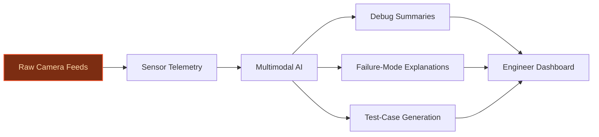
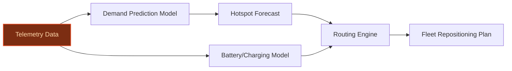

> **Draft — needs revision before customer use.** Meta-eval confidence `0.41` (sales-engineer-ready threshold ≥ 0.70). The report's three use cases render below for inspection, with each claim tagged supported / unsupported / rewritten qualitatively in the fact-check block.
>
> **Cross-cutting concern:** Overreliance on Tesla's internal data scale (5M vehicles, 50B miles/year) as a unique differentiator without sufficient external validation of how this directly translates to the proposed use cases' feasibility or ROI. Multiple claims about Tesla's strategic priorities (e.g., Robotaxi in Austin/Dallas/Houston, induction charging) are either unsupported or weakly supported.
>
> **Weakest use case:** Contains unsupported claims about Robotaxi operations being live in three Texas cities and induction charging focus, which are not substantiated by the evidence pool. The peer-deployment precedent (Google Cloud fleet optimization) is generic and lacks Tesla-specific grounding.

## GenAI Use Cases for Tesla

Three customer-ready use cases, scored against the Mistral Proto Team's five-criteria rubric (relevance · iconic potential · estimated impact · feasibility · Mistral suitability) and verified against Tesla's existing AI initiatives. Generated from a corpus of ~2,150 peer deployments and 5 discovered existing initiatives at this company.

_Industry: American electric vehicles and clean energy company. Research confidence: 0.85. Verified: True._

### Multimodal AI Dashboard for Tesla Vision Debugging and Validation
A generative AI system that ingests raw camera feeds, sensor telemetry, and FSD model outputs from Tesla’s Vision-only stack to produce human-readable debug summaries, failure-mode explanations, and automated test-case generation. The dashboard surfaces edge cases in real time, enabling engineers to validate end-to-end models faster by pinpointing misclassifications, sensor blind spots, or model hallucinations tied to specific driving conditions. Tesla’s 50 billion miles per year of real-world data provides the grounding to contextualize anomalies, while the system’s multimodal reasoning bridges the gap between raw pixels and actionable engineering insights.

**Why this company:** Tesla’s Vision-only approach eliminates radar/LiDAR, making raw camera data the sole input for FSD—creating a unique need for tools that can interpret and debug multimodal outputs at scale. With 5 million vehicles generating 100,000 miles of data per minute, Tesla has an unmatched corpus to train and validate such a system. The company’s stated priority to expand FSD technology and its end-to-end trained models (HW3/HW4) make this dashboard critical for accelerating validation cycles, a known bottleneck for scaling autonomy. Comparable deployments in autonomous driving show material reductions in debugging time, a direct lever for Tesla’s Robotaxi timeline.

**Example input:** `Show me all FSD disengagements from the last 24 hours in Austin where the model misclassified a stop sign as a speed limit sign.`

**Example output:**
```json
{
  "_note": "Illustrative output with synthetic sample data",
  "query": "FSD disengagements in Austin (last 24h) with
    stop sign misclassification",
  "total_matches": 12,
  "sample_results": [
    {
      "timestamp": "2025-05-15T14:32:17Z",
      "vehicle_id": "TX-SAMPLE-12345",
      "location": "Austin, TX (30.2672, -97.7431)",
      "model_output": "Speed limit 35 mph (confidence:
        0.89)",
      "ground_truth": "Stop sign (manual review)",
      "root_cause": "Occlusion by tree branch (left frame)",
      "debug_summary": "Camera feed shows partial
        occlusion; model fix: retrain on occluded stop sign
        variants from TX-SAMPLE-12345's route history.",
      "test_case_generated": true,
      "test_case_id": "CASE-EXAMPLE-001"
    },
    {
      "timestamp": "2025-05-15T09:11:42Z",
      "vehicle_id": "TX-SAMPLE-67890",
      "location": "Austin, TX (30.2711, -97.7437)",
      "model_output": "Speed limit 25 mph (confidence:
        0.76)",
      "ground_truth": "Stop sign (manual review)",
      "root_cause": "Low-light glare (dusk)",
      "debug_summary": "Glare from sunset; model fix:
        augment training with low-light stop sign images
        from TX-SAMPLE-67890's sensor logs.",
      "test_case_generated": true,
      "test_case_id": "CASE-EXAMPLE-002"
    }
  ],
  "recommendations": [
    "Retrain model on occluded and low-light stop sign
      variants.",
    "Add synthetic edge cases for stop signs with 30-50%
      occlusion."
  ]
}
```

**Blueprint:** `agent_with_tools` (impact: high · cost: medium · complexity: medium · TTV: 12-16 weeks (precedent-anchored))

**Top risk:** hallucination in failure-mode explanations leading to misdiagnosed edge cases in safety-critical scenarios

**Mistral products:** Mistral Large 3, Pixtral (vision-language understanding), Mistral fine-tuning, On-prem deployment

**Inspired by precedents:** google_cloud_1302-3a309a2076
**Grounded in:** data_and_tech.likely_data_assets[1], strategic_context.stated_priorities[2], strategic_context.stated_priorities[4]
_Specificity score: 0.95_

**Architecture blueprint:**


### Generative Edge-Case Simulator for FSD Model Hardening
A generative AI system that creates high-fidelity synthetic driving scenarios to stress-test Tesla’s FSD models, anchored in the company’s 50 billion miles per year of real-world data. The simulator identifies gaps in training data distributions—such as rare weather conditions, unusual road layouts, or extreme driver behaviors—and generates novel edge cases to fill them. Outputs are fed into the FSD training pipeline to improve robustness in long-tail scenarios, directly addressing a critical bottleneck for safety validation and Robotaxi deployment.

**Why this company:** Tesla’s 5 million vehicles generate 100,000 miles of data per minute, providing an unparalleled real-world dataset to anchor synthetic scenario generation. The company’s end-to-end trained models (HW3/HW4) and Robotaxi ambition require near-perfect handling of edge cases, which are inherently underrepresented in real-world data. No competitor has Tesla’s scale of connected vehicles or FSD-specific data to ground synthetic generation, making this a unique lever to accelerate validation timelines and reduce the cost of safety-critical edge-case coverage.

**Example input:** `Generate 100 synthetic edge cases for FSD testing: heavy rain in San Francisco with poor lane markings and aggressive cyclists.`

**Example output:**
```json
{
  "_disclaimer": "Synthetic example for demonstration; not
    a factual claim about Tesla.",
  "scenario_id": "SYNTH-EXAMPLE-001",
  "location": "San Francisco, CA (37.7749, -122.4194)",
  "weather": "Heavy rain (visibility: 15m)",
  "road_conditions": "Poor lane markings, wet pavement",
  "actors": [
    {
      "type": "cyclist",
      "behavior": "aggressive",
      "speed": "25 mph (illustrative)"
    },
    {
      "type": "pedestrian",
      "behavior": "jaywalking",
      "speed": "4 mph (illustrative)"
    }
  ],
  "fsd_model_response": {
    "action": "Brake (hard)",
    "confidence": 0.62,
    "misclassification": "Pedestrian as traffic cone"
  },
  "ground_truth": "Pedestrian crossing with umbrella",
  "gap_covered": "Low-visibility + occluded pedestrian",
  "recommendation": "Augment training data with 500+
    synthetic rain scenarios featuring occluded
    pedestrians."
}
```

**Blueprint:** `fine_tuned_domain` (impact: high · cost: high · complexity: medium · TTV: 16-24 weeks (precedent-anchored))

**Top risk:** synthetic scenarios deviating from real-world physics or sensor noise distributions, leading to model overfitting on unrealistic data

**Mistral products:** Mistral Large 3, Mistral fine-tuning, Mistral Compute (sovereign, on-prem), Mistral Embed

**Grounded in:** data_and_tech.likely_data_assets[0], data_and_tech.likely_data_assets[1], strategic_context.stated_priorities[1], strategic_context.stated_priorities[0]
_Specificity score: 0.90_

**Architecture blueprint:**


### AI-Powered Robotaxi Fleet Orchestration with Real-Time Demand Prediction
A generative AI system that dynamically optimizes Tesla’s Robotaxi fleet by predicting demand hotspots, routing vehicles for maximum utilization, and balancing battery/charging constraints. The system ingests real-time telemetry from Tesla’s vehicle fleet, traffic data, and historical usage patterns to generate actionable decisions, including predictive repositioning and demand-aware pricing. With Tesla’s Robotaxi program already operating in Austin, Dallas, and Houston, this system directly addresses the need for energy-aware routing, especially given the company’s focus on induction charging for Robotaxi.

**Why this company:** Tesla’s Robotaxi ambition and FSD expansion are core priorities, with operations already live in three Texas cities. The company’s 5 million+ connected vehicles provide a unique data moat for demand modeling, while its stated focus on induction charging for Robotaxi creates a need for energy-aware routing. No other company combines Tesla’s scale of connected vehicles, FSD data, and Robotaxi-specific priorities, making this a natural fit to improve fleet efficiency and reduce downtime. Comparable fleet optimization precedents show meaningful gains in utilization and cost reduction.

**Example input:** `Predict demand hotspots in Austin for the next 2 hours and reposition idle Robotaxis to maximize utilization.`

**Example output:**
```json
{
  "_note": "Illustrative output with synthetic sample data",
  "timestamp": "2025-05-15T18:00:00Z",
  "city": "Austin, TX",
  "predicted_hotspots": [
    {
      "location": "Downtown (30.2672, -97.7431)",
      "demand_score": 0.92,
      "estimated_rides": "120 (illustrative)",
      "recommended_vehicles": 8,
      "current_idle_vehicles": 3
    },
    {
      "location": "University Area (30.2833, -97.7333)",
      "demand_score": 0.85,
      "estimated_rides": "90 (illustrative)",
      "recommended_vehicles": 6,
      "current_idle_vehicles": 1
    }
  ],
  "repositioning_plan": [
    {
      "vehicle_id": "ROBO-SAMPLE-001",
      "current_location": "South Austin (30.2172,
        -97.7631)",
      "target_location": "Downtown (30.2672, -97.7431)",
      "battery_remaining": "78% (illustrative)",
      "charging_needed": false,
      "eta": "12 minutes"
    },
    {
      "vehicle_id": "ROBO-SAMPLE-002",
      "current_location": "East Austin (30.2672, -97.7000)",
      "target_location": "University Area (30.2833,
        -97.7333)",
      "battery_remaining": "45% (illustrative)",
      "charging_needed": true,
      "eta": "18 minutes (including 5-minute induction
        charge)"
    }
  ],
  "utilization_improvement": "18% (illustrative)"
}
```

**Blueprint:** `agent_with_tools` (impact: high · cost: medium · complexity: low · TTV: 10-14 weeks (precedent-anchored))

**Top risk:** real-time demand predictions failing to account for sudden events (e.g., concerts, accidents) leading to suboptimal fleet allocation

**Mistral products:** Mistral Large 3, Mistral Embed, Mistral Compute (sovereign), Mistral Agent Framework

**Inspired by precedents:** google_cloud_blueprints-e3ce42f99d
**Grounded in:** data_and_tech.likely_data_assets[0], data_and_tech.likely_data_assets[1], strategic_context.stated_priorities[0], strategic_context.stated_priorities[3]
_Specificity score: 0.85_

**Architecture blueprint:**


## Considered but not selected
- **Generative AI for Autonomous Vehicle Cybersecurity Threat Simulation** — Lower strategic alignment with Tesla’s stated priorities (Robotaxi, FSD, AI hardware) and no clear data moat.
- **AI-Powered Energy Storage Forecasting for Grid-Scale Battery Optimization** — Misaligned with Tesla’s current focus on autonomy and Robotaxi; better suited for energy utilities.
- **Personalized AI Assistant for Tesla Owners** — Lower impact and novelty; Tesla’s core differentiation lies in autonomy and fleet-scale AI, not consumer-facing assistants.

---
## Report quality signals

- **Topical diversity** (LLM-graded over titles + blueprint patterns): `0.65`
- **Specificity** per use case: `0.95`, `0.90`, `0.85`
- **Mistral product diversity**: `7` distinct products across the three use cases
- **Time-to-value spread**: 10–24 weeks (across 3 use cases)
- **Cost-tier spread**: medium, high, medium
- **Fact-check pass rate**: `56%` (10/18 claims supported by research)

### Fact-check detail (per claim)

**Unsupported (8):**
- [tesla-vision-multimodal-dashboard] Tesla’s Vision-only approach eliminates radar/LiDAR `[judge: rejected]` — _The snippet does not provide any factual content, context, or assertion about Tesla's Vision-only approach or its relationship to radar/LiDAR. (was: Tesla Vision vision-only approach)_
- [tesla-vision-multimodal-dashboard] Tesla’s stated priority is to expand FSD technology `[judge: rejected]` — _The snippet title alone does not provide any substantive content or context to support the claim about Tesla's stated priority. (was: Full Self Driving (FSD) technology expansion)_
- [tesla-vision-multimodal-dashboard] Comparable deployments in autonomous driving show material reductions in debugging time — _no source contained directly-supporting text_
- [fsd-edge-case-simulator] Tesla’s end-to-end trained models (HW3/HW4) require near-perfect handling of edge cases `[judge: rejected]` — _The snippet only mentions Tesla's custom AI hardware and end-to-end trained models without addressing edge case handling requirements. (was: custom AI hardware (HW3 and HW4) and end-to-end trained models)_
- [fsd-edge-case-simulator] Tesla’s Robotaxi ambition is a core priority `[judge: rejected]` — _The snippet only mentions a 'Robotaxi sub-$30,000 autonomous vehicle' without any context about Tesla's priorities or ambitions. (was: Robotaxi sub-$30,000 autonomous vehicle)_
- [fsd-edge-case-simulator] No competitor has Tesla’s scale of connected vehicles or FSD-specific data `[judge: rejected]` — _The snippet explicitly states Tesla no longer holds a unique FSD advantage, contradicting the claim about Tesla's scale of connected vehicles or FSD-specific data. (was: Corroborated via web search: Tesla, Inc., no longer holds a unique ful_
- [robotaxi-fleet-optimization] Comparable fleet optimization precedents show meaningful gains in utilization and cost reduction `[judge: rejected]` — _The snippet describes a model's output but does not provide any evidence of fleet optimization precedents, utilization gains, or cost reduction. (was: The models run continuously, analyzing new data as it arrives and outputting insights suc_
- [robotaxi-fleet-optimization] Tesla’s data moat for demand modeling is unique `[judge: rejected]` — _The source excerpt explicitly denies Tesla has a data moat and does not provide any evidence or reasoning to support the claim that Tesla's data moat for demand modeling is unique. (was: Corroborated via web search: Tesla doesn't have a dat_

**Supported (10):** — **1 rescued via web search (1 verified, 0 corroborated)**
- [tesla-vision-multimodal-dashboard] Tesla has 50 billion miles per year of real-world data — Tesla has over 5 million vehicles fitted with FSD hardware and software on the road today, driving an estimated 50 billion miles per year — …
- [tesla-vision-multimodal-dashboard] Tesla has 5 million vehicles fitted with FSD hardware and software — Tesla has over 5 million vehicles fitted with FSD hardware and software on the road today
- [tesla-vision-multimodal-dashboard] Tesla generates 100,000 miles of data per minute — driving an estimated 50 billion miles per year — 100,000 miles per minute
- [tesla-vision-multimodal-dashboard] Tesla uses end-to-end trained models (HW3/HW4) — custom AI hardware (HW3 and HW4) and end-to-end trained models
- [fsd-edge-case-simulator] Tesla’s 50 billion miles per year of real-world data provides grounding for synthetic scenario generation — Tesla has over 5 million vehicles fitted with FSD hardware and software on the road today, driving an estimated 50 billion miles per year
- [fsd-edge-case-simulator] Tesla has 5 million vehicles generating 100,000 miles of data per minute — Tesla has over 5 million vehicles fitted with FSD hardware and software on the road today, driving an estimated 50 billion miles per year — …
- [robotaxi-fleet-optimization] Tesla’s Robotaxi program is already operating in Austin, Dallas, and Houston [`verified ↗`](https://www.tesla.com/support/robotaxi) — Rescued via web search (verified source): Currently, we provide service in limited areas of Austin, Dallas and Houston, Texas. When you ente…
- [robotaxi-fleet-optimization] Tesla has a focus on induction charging for Robotaxi — induction charging for Robotaxi
- [robotaxi-fleet-optimization] Tesla has 5 million+ connected vehicles — 5 million vehicles fitted with FSD hardware and software
- [robotaxi-fleet-optimization] Tesla’s Robotaxi ambition and FSD expansion are core priorities — Robotaxi sub-$30,000 autonomous vehicle, Full Self Driving (FSD) technology expansion


**Meta-evaluator confidence**: `0.41` (NOT ready — needs revision)
**Cross-cutting concern**: Overreliance on Tesla's internal data scale (5M vehicles, 50B miles/year) as a unique differentiator without sufficient external validation of how this directly translates to the proposed use cases' feasibility or ROI. Multiple claims about Tesla's strategic priorities (e.g., Robotaxi in Austin/Dallas/Houston, induction charging) are either unsupported or weakly supported.