# Trace

## Execution trace — Tesla

Started: `2026-05-10T22:02:34.656708+00:00`. Total wall time: `127.5s` across `39` recorded actions.

### Per-step time totals

| Step | Calls | Total time | Avg time |
|---|---:|---:|---:|
| `research` | 1 | 8.93s | 8928ms |
| `gap_fill` | 4 | 3.17s | 792ms |
| `retrieve` | 2 | 0.69s | 343ms |
| `generate` | 1 | 20.85s | 20846ms |
| `score` | 2 | 21.55s | 10775ms |
| `verify` | 6 | 24.28s | 4046ms |
| `enrich` | 1 | 18.48s | 18479ms |
| `meta_eval` | 1 | 10.44s | 10444ms |
| `web_verify` | 1 | 5.32s | 5316ms |
| `source_judge` | 18 | 12.21s | 678ms |
| `quality_signals` | 2 | 3.69s | 1847ms |

### Chronological event log

- `22:02:50.383` **[research]** `mistral-medium-2604.chat.complete` — 8928ms
   - inputs: synthesize CompanyContext for Tesla | depth=medium
   - outputs: industry='American electric vehicles and clean energy company' verified=True conf=0.75
- `22:02:59.315` **[gap_fill]** `mistral-small-2603.chat.complete` — 1061ms
   - inputs: generate gap queries | fields=['business_model', 'products', 'data_assets', 'priorities']
   - outputs: queries=4
- `22:03:05.792` **[gap_fill]** `mistral-small-2603.chat.complete` — 853ms
   - inputs: layer-2 extract field=priorities
   - outputs: items=6
- `22:03:05.798` **[gap_fill]** `mistral-small-2603.chat.complete` — 846ms
   - inputs: layer-2 extract field=data_assets
   - outputs: items=5
- `22:03:05.807` **[gap_fill]** `mistral-small-2603.chat.complete` — 409ms
   - inputs: layer-2 extract field=products
   - outputs: items=2
- `22:03:06.647` **[retrieve]** `mistral-embed.embeddings.create` — 226ms
   - inputs: company_query | industries='American electric vehicles and clean energy company'
   - outputs: embedded 1024-dim query vector
- `22:03:06.873` **[retrieve]** `precedent_corpus.cosine_topk` — 460ms
   - inputs: k=8 min_depth=0.4 target='Tesla'
   - outputs: retrieved 8 | mmr=True | top_sim=0.830
- `22:03:08.649` **[generate]** `mistral-medium-2604.chat.complete` — 20846ms
   - inputs: iteration=0 tool_calls_used=0/0 tools=off
   - outputs: tool_calls=0 | content_chars=13852
- `22:03:30.145` **[score]** `mistral-small-2603.chat.complete` — 10247ms
   - inputs: self-consistency pass T=0.2
   - outputs: scored 8 candidates
- `22:03:30.150` **[score]** `mistral-small-2603.chat.complete` — 11304ms
   - inputs: self-consistency pass T=0.4
   - outputs: scored 8 candidates
- `22:03:41.491` **[verify]** `tavily.search` — 2018ms
   - inputs: candidate=tesla-vision-multimodal-dashboard | query='Tesla Multimodal AI Dashboard for Tesla Vision Debugging and'
   - outputs: 4 results
- `22:03:41.492` **[verify]** `tavily.search` — 2835ms
   - inputs: candidate=fsd-edge-case-simulator | query='Tesla Generative Edge-Case Simulator for FSD Model Hardening'
   - outputs: 4 results
- `22:03:41.492` **[verify]** `tavily.search` — 2020ms
   - inputs: candidate=robotaxi-fleet-optimization | query='Tesla AI-Powered Robotaxi Fleet Orchestration with Real-Time'
   - outputs: 4 results
- `22:03:44.076` **[verify]** `mistral-small-2603.chat.complete` — 13343ms
   - inputs: verdict for tesla-vision-multimodal-dashboard
   - outputs: verdict='pass'
- `22:03:57.411` **[verify]** `mistral-small-2603.chat.complete` — 2481ms
   - inputs: verdict for robotaxi-fleet-optimization
   - outputs: verdict='pass'
- `22:03:57.419` **[verify]** `mistral-small-2603.chat.complete` — 1577ms
   - inputs: verdict for fsd-edge-case-simulator
   - outputs: verdict='pass'
- `22:03:59.898` **[enrich]** `mistral-medium-2604.chat.complete` — 18479ms
   - inputs: tier=fast parallel=False ids=['tesla-vision-multimodal-dashboard', 'fsd-edge-case-simulator', 'robotaxi-fleet-optimization']
   - outputs: enriched 3 use cases
- `22:04:18.407` **[meta_eval]** `mistral-medium-2604.chat.complete` — 10444ms
   - inputs: reviewing 3 use cases
   - outputs: review + claims
- `22:04:28.874` **[web_verify]** `tavily.search.rescue_unsupported_claims` — 5316ms
   - inputs: company='Tesla' unsupported=4 budget=12
   - outputs: rescued: verified=1 corroborated=2 of 4 attempted
- `22:04:34.191` **[source_judge]** `mistral-small-2603.judge_claim_sources` — 1686ms
   - inputs: pairs=17
   - outputs: judged 17 pairs
- `22:04:34.191` **[source_judge]** `mistral-small-2603.chat.complete` — 735ms
   - inputs: claim='Tesla’s Vision-only approach eliminates radar/LiDAR'
   - outputs: verdict=unsupported
- `22:04:34.195` **[source_judge]** `mistral-small-2603.chat.complete` — 638ms
   - inputs: claim='Tesla has 50 billion miles per year of real-world data'
   - outputs: verdict=supported
- `22:04:34.200` **[source_judge]** `mistral-small-2603.chat.complete` — 598ms
   - inputs: claim='Tesla has 5 million vehicles fitted with FSD hardware and so'
   - outputs: verdict=supported
- `22:04:34.203` **[source_judge]** `mistral-small-2603.chat.complete` — 640ms
   - inputs: claim='Tesla generates 100,000 miles of data per minute'
   - outputs: verdict=supported
- `22:04:34.205` **[source_judge]** `mistral-small-2603.chat.complete` — 650ms
   - inputs: claim='Tesla’s stated priority is to expand FSD technology'
   - outputs: verdict=unsupported
- `22:04:34.207` **[source_judge]** `mistral-small-2603.chat.complete` — 640ms
   - inputs: claim='Tesla uses end-to-end trained models (HW3/HW4)'
   - outputs: verdict=supported
- `22:04:34.211` **[source_judge]** `mistral-small-2603.chat.complete` — 706ms
   - inputs: claim='Tesla’s 50 billion miles per year of real-world data provide'
   - outputs: verdict=supported
- `22:04:34.213` **[source_judge]** `mistral-small-2603.chat.complete` — 684ms
   - inputs: claim='Tesla has 5 million vehicles generating 100,000 miles of dat'
   - outputs: verdict=supported
- `22:04:34.798` **[source_judge]** `mistral-small-2603.chat.complete` — 550ms
   - inputs: claim='Tesla’s end-to-end trained models (HW3/HW4) require near-per'
   - outputs: verdict=unsupported
- `22:04:34.833` **[source_judge]** `mistral-small-2603.chat.complete` — 748ms
   - inputs: claim='Tesla’s Robotaxi ambition is a core priority'
   - outputs: verdict=unsupported
- `22:04:34.843` **[source_judge]** `mistral-small-2603.chat.complete` — 613ms
   - inputs: claim='No competitor has Tesla’s scale of connected vehicles or FSD'
   - outputs: verdict=unsupported
- `22:04:34.848` **[source_judge]** `mistral-small-2603.chat.complete` — 567ms
   - inputs: claim='Tesla’s Robotaxi program is already operating in Austin, Dal'
   - outputs: verdict=supported
- `22:04:34.854` **[source_judge]** `mistral-small-2603.chat.complete` — 407ms
   - inputs: claim='Tesla has a focus on induction charging for Robotaxi'
   - outputs: verdict=supported
- `22:04:34.897` **[source_judge]** `mistral-small-2603.chat.complete` — 569ms
   - inputs: claim='Tesla has 5 million+ connected vehicles'
   - outputs: verdict=supported
- `22:04:34.917` **[source_judge]** `mistral-small-2603.chat.complete` — 507ms
   - inputs: claim='Tesla’s Robotaxi ambition and FSD expansion are core priorit'
   - outputs: verdict=supported
- `22:04:34.926` **[source_judge]** `mistral-small-2603.chat.complete` — 659ms
   - inputs: claim='Comparable fleet optimization precedents show meaningful gai'
   - outputs: verdict=unsupported
- `22:04:35.262` **[source_judge]** `mistral-small-2603.chat.complete` — 615ms
   - inputs: claim='Tesla’s data moat for demand modeling is unique'
   - outputs: verdict=unsupported
- `22:04:38.489` **[quality_signals]** `mistral-small-2603.chat.complete` — 2405ms
   - inputs: specificity grade (3 use cases)
   - outputs: scored 3 use cases
- `22:04:40.894` **[quality_signals]** `mistral-small-2603.chat.complete` — 1290ms
   - inputs: diversity grade
   - outputs: diversity=0.65

## Mermaid sequence

```mermaid
sequenceDiagram
    autonumber
    participant pipeline as pipeline
    participant mistral_medium_2604 as mistral-medium-2604
    participant mistral_small_2603 as mistral-small-2603
    participant mistral_embed as mistral-embed
    participant precedent_corpus as precedent_corpus
    participant tavily as tavily
    participant tavily_search as tavily.search
    pipeline->>mistral_medium_2604: research: chat.complete (8928ms)
    mistral_medium_2604-->>pipeline: industry='American electric vehicles and clean energy compan
    pipeline->>mistral_small_2603: gap_fill: chat.complete (1061ms)
    mistral_small_2603-->>pipeline: queries=4
    pipeline->>mistral_small_2603: gap_fill: chat.complete (853ms)
    mistral_small_2603-->>pipeline: items=6
    pipeline->>mistral_small_2603: gap_fill: chat.complete (846ms)
    mistral_small_2603-->>pipeline: items=5
    pipeline->>mistral_small_2603: gap_fill: chat.complete (409ms)
    mistral_small_2603-->>pipeline: items=2
    pipeline->>mistral_embed: retrieve: embeddings.create (226ms)
    mistral_embed-->>pipeline: embedded 1024-dim query vector
    pipeline->>precedent_corpus: retrieve: cosine_topk (460ms)
    precedent_corpus-->>pipeline: retrieved 8 | mmr=True | top_sim=0.830
    pipeline->>mistral_medium_2604: generate: chat.complete (20846ms)
    mistral_medium_2604-->>pipeline: tool_calls=0 | content_chars=13852
    pipeline->>mistral_small_2603: score: chat.complete (10247ms)
    mistral_small_2603-->>pipeline: scored 8 candidates
    pipeline->>mistral_small_2603: score: chat.complete (11304ms)
    mistral_small_2603-->>pipeline: scored 8 candidates
    pipeline->>tavily: verify: search (2018ms)
    tavily-->>pipeline: 4 results
    pipeline->>tavily: verify: search (2835ms)
    tavily-->>pipeline: 4 results
    pipeline->>tavily: verify: search (2020ms)
    tavily-->>pipeline: 4 results
    pipeline->>mistral_small_2603: verify: chat.complete (13343ms)
    mistral_small_2603-->>pipeline: verdict='pass'
    pipeline->>mistral_small_2603: verify: chat.complete (2481ms)
    mistral_small_2603-->>pipeline: verdict='pass'
    pipeline->>mistral_small_2603: verify: chat.complete (1577ms)
    mistral_small_2603-->>pipeline: verdict='pass'
    pipeline->>mistral_medium_2604: enrich: chat.complete (18479ms)
    mistral_medium_2604-->>pipeline: enriched 3 use cases
    pipeline->>mistral_medium_2604: meta_eval: chat.complete (10444ms)
    mistral_medium_2604-->>pipeline: review + claims
    pipeline->>tavily_search: web_verify: rescue_unsupported_claims (5316ms)
    tavily_search-->>pipeline: rescued: verified=1 corroborated=2 of 4 attempted
    pipeline->>mistral_small_2603: source_judge: judge_claim_sources (1686ms)
    mistral_small_2603-->>pipeline: judged 17 pairs
    pipeline->>mistral_small_2603: source_judge: chat.complete (735ms)
    mistral_small_2603-->>pipeline: verdict=unsupported
    pipeline->>mistral_small_2603: source_judge: chat.complete (638ms)
    mistral_small_2603-->>pipeline: verdict=supported
    pipeline->>mistral_small_2603: source_judge: chat.complete (598ms)
    mistral_small_2603-->>pipeline: verdict=supported
    pipeline->>mistral_small_2603: source_judge: chat.complete (640ms)
    mistral_small_2603-->>pipeline: verdict=supported
    pipeline->>mistral_small_2603: source_judge: chat.complete (650ms)
    mistral_small_2603-->>pipeline: verdict=unsupported
    pipeline->>mistral_small_2603: source_judge: chat.complete (640ms)
    mistral_small_2603-->>pipeline: verdict=supported
    pipeline->>mistral_small_2603: source_judge: chat.complete (706ms)
    mistral_small_2603-->>pipeline: verdict=supported
    pipeline->>mistral_small_2603: source_judge: chat.complete (684ms)
    mistral_small_2603-->>pipeline: verdict=supported
    pipeline->>mistral_small_2603: source_judge: chat.complete (550ms)
    mistral_small_2603-->>pipeline: verdict=unsupported
    pipeline->>mistral_small_2603: source_judge: chat.complete (748ms)
    mistral_small_2603-->>pipeline: verdict=unsupported
    pipeline->>mistral_small_2603: source_judge: chat.complete (613ms)
    mistral_small_2603-->>pipeline: verdict=unsupported
    pipeline->>mistral_small_2603: source_judge: chat.complete (567ms)
    mistral_small_2603-->>pipeline: verdict=supported
    pipeline->>mistral_small_2603: source_judge: chat.complete (407ms)
    mistral_small_2603-->>pipeline: verdict=supported
    pipeline->>mistral_small_2603: source_judge: chat.complete (569ms)
    mistral_small_2603-->>pipeline: verdict=supported
    pipeline->>mistral_small_2603: source_judge: chat.complete (507ms)
    mistral_small_2603-->>pipeline: verdict=supported
    pipeline->>mistral_small_2603: source_judge: chat.complete (659ms)
    mistral_small_2603-->>pipeline: verdict=unsupported
    pipeline->>mistral_small_2603: source_judge: chat.complete (615ms)
    mistral_small_2603-->>pipeline: verdict=unsupported
    pipeline->>mistral_small_2603: quality_signals: chat.complete (2405ms)
    mistral_small_2603-->>pipeline: scored 3 use cases
    pipeline->>mistral_small_2603: quality_signals: chat.complete (1290ms)
    mistral_small_2603-->>pipeline: diversity=0.65
```

