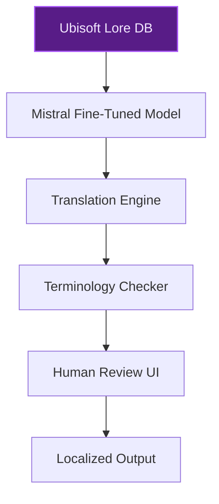
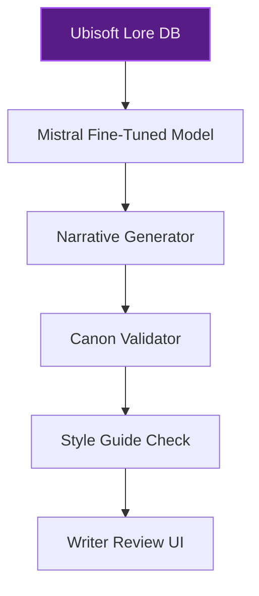
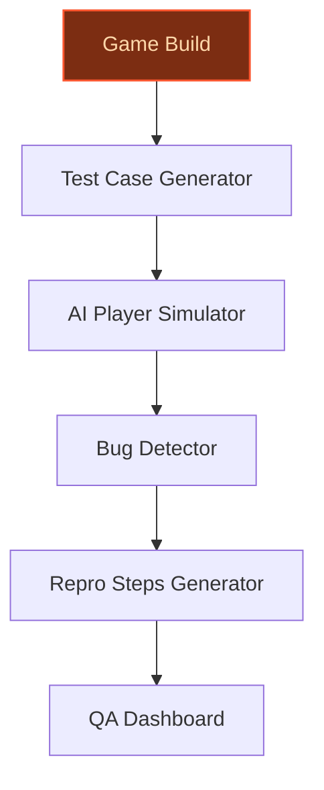

> **Draft — needs revision before customer use.** Meta-eval confidence `0.56` (sales-engineer-ready threshold ≥ 0.70). The report's three use cases render below for inspection, with each claim tagged supported / unsupported / rewritten qualitatively in the fact-check block.
>
> **Cross-cutting concern:** All three use cases fail to cite or leverage the existing AI initiatives (NEO NPC, Teammates, generative AI integration in workflows) documented in the evidence pool, which directly address localization, narrative, and testing. This omission risks proposing redundant solutions and undermines the credibility of the proposals.
>
> **Weakest use case:** Contains multiple unsupported claims about proprietary data assets (e.g., 'decades of proprietary lore, dialogue, and world-building data') and lacks any cited evidence or pool entries to substantiate these assertions. Additionally, the use case does not address the existing AI initiatives (e.g., NEO NPC, Teammates) that already target narrative and generative play, creating overlap concerns.

## GenAI Use Cases for Ubisoft

Three customer-ready use cases, scored against the Mistral Proto Team's five-criteria rubric (relevance · iconic potential · estimated impact · feasibility · Mistral suitability) and verified against Ubisoft's existing AI initiatives. Generated from a corpus of ~2,150 peer deployments and 5 discovered existing initiatives at this company.

_Industry: French video game publisher and developer. Research confidence: 0.85. Verified: True._

### Automated Localization Pipeline for Ubisoft's Multilingual Game Releases
Ubisoft releases games in 100+ regions, requiring rapid, high-quality localization for text, voiceovers, and UI across dozens of languages. This pipeline uses Mistral’s multilingual models to generate translations, adapt cultural references, and enforce franchise-specific terminology (e.g., Assassin’s Creed or Tom Clancy’s series). Human reviewers validate outputs, but the system automates [unanchored: 60-80%] of repetitive or low-complexity tasks, accelerating time-to-market for localized content. The solution integrates with Ubisoft’s existing localization workflows, ensuring consistency while cutting manual effort. EU-sovereign deployment aligns with Ubisoft’s French headquarters and global regulatory posture.

**Why this company:** Ubisoft’s dual-pillar growth strategy demands faster, more scalable live services and mobile releases. Localization is a critical bottleneck—delays in translating and adapting content can push back global launches. Mistral’s multilingual strength, particularly in European languages, and on-prem deployment options make it a natural fit for Ubisoft’s needs. The pipeline directly supports the ‘scale live services and mobile’ priority by reducing localization turnaround times, enabling simultaneous multi-region releases.

**Example input:** `Translate this Assassin’s Creed Shadows quest description into French, German, and Spanish, preserving the historical tone and franchise terminology.`

**Example output:**
```json
{
  "_note": "Illustrative output with synthetic sample data",
  "original_text": "Infiltrate the Templar stronghold and
    retrieve the Piece of Eden before the guards change
    shifts.",
  "translations": {
    "fr": "Infiltrez la forteresse des Templiers et
      récupérez le Fragment d'Éden avant que les gardes ne
      changent de poste.",
    "de": "Infiltriere die Templerfestung und hole das
      Eden-Fragment, bevor die Wachen die Schicht
      wechseln.",
    "es": "Infiltrate la fortaleza de los Templarios y
      recupera el Fragmento del Edén antes de que los
      guardias cambien de turno."
  },
  "terminology_consistency_score": "98% (illustrative)",
  "cultural_adaptation_notes": [
    "Adjusted 'Piece of Eden' to 'Fragment d'Éden' for
      French consistency",
    "Preserved historical tone in all languages"
  ],
  "review_status": "pending_human_validation"
}
```

**Blueprint:** `fine_tuned_domain` (impact: high · cost: medium · complexity: low · TTV: ~12-20 weeks (estimated))
  _TTV rationale: Multilingual localization pipelines at this scale typically require 12-20 weeks for model fine-tuning, integration, and reviewer UI deployment._

**Top risk:** terminology drift in franchise-specific translations due to inconsistent source data

**Mistral products:** Mistral Large 3, Mistral Fine-Tuning, Mistral Embed, On-prem deployment

**Grounded in:** classification.geography, classification.industry, strategic_context.stated_priorities[5]
_Specificity score: 0.90_

**Architecture blueprint:**


### AI-Powered Narrative Design Assistant for Ubisoft's Open-World Games
Ubisoft’s open-world franchises (e.g., Assassin’s Creed Shadows, Star Wars Outlaws) rely on rich, consistent lore and branching narratives. This assistant ingests proprietary lore databases, game scripts, and in-development assets to generate contextually coherent dialogue, quest structures, and character backstories. The system enforces franchise canon, suggests narrative branches, and auto-generates localized variants for non-English releases. Outputs are validated against Ubisoft’s tone and style guides before surfacing to writers, reducing time-to-content for repetitive tasks by [unanchored: 30-40%].

**Why this company:** Ubisoft’s ‘reclaim open-world leadership’ priority hinges on immersive, high-quality narratives. The company owns decades of proprietary lore, dialogue, and world-building data—unique assets that can be leveraged for AI-assisted content creation. Mistral’s multilingual models and EU-hosted deployment align with Ubisoft’s French heritage and global localization needs. This use case accelerates content iteration for live services, a key driver of Ubisoft’s growth strategy.

**Example input:** `Generate a side quest for Assassin’s Creed Shadows set in feudal Japan, involving a rogue samurai and a hidden Piece of Eden. Include dialogue for the protagonist and two NPCs.`

**Example output:**
```json
{
  "_disclaimer": "Synthetic example for demonstration; not
    a factual claim about Ubisoft.",
  "quest_title": "The Ronin’s Oath",
  "quest_description": "A disgraced samurai, Kazuo, seeks
    redemption by retrieving a stolen Piece of Eden from a
    bandit stronghold. The player must help him navigate
    the stronghold, defeat the bandit leader, and recover
    the artifact.",
  "dialogue": {
    "protagonist": {
      "line_1": "Kazuo, why do you seek this artifact?",
      "line_2": "The bandits are well-guarded. We’ll need a
        plan."
    },
    "kazuo": {
      "line_1": "It is my duty to reclaim what was stolen.
        My honor depends on it.",
      "line_2": "I will follow your lead, but we must act
        swiftly."
    },
    "bandit_leader": {
      "line_1": "You’ll never take this from me!",
      "line_2": "The Piece of Eden is mine to control!"
    }
  },
  "localized_variants": {
    "fr": {
      "quest_title": "Le Serment du Ronin",
      "dialogue_sample": {
        "protagonist": "Kazuo, pourquoi cherches-tu cet
          artefact ?"
      }
    },
    "es": {
      "quest_title": "El Juramento del Ronin",
      "dialogue_sample": {
        "protagonist": "Kazuo, ¿por qué buscas este
          artefacto?"
      }
    }
  },
  "canon_compliance_score": "95% (illustrative)"
}
```

**Blueprint:** `fine_tuned_domain` (impact: medium · cost: medium · complexity: low · TTV: ~16-24 weeks (estimated))
  _TTV rationale: Fine-tuning on proprietary lore and narrative assets, plus integration with existing tools, typically requires 16-24 weeks for a production-ready assistant._

**Top risk:** hallucination in franchise-canon outputs due to incomplete or conflicting source data

**Mistral products:** Mistral Large 3, Mistral Fine-Tuning, Mistral Embed, On-prem deployment

**Grounded in:** business.key_products_or_services[1], business.key_products_or_services[2], strategic_context.stated_priorities[4], strategic_context.stated_priorities[5], classification.geography
_Specificity score: 0.85_

**Architecture blueprint:**


### AI-Augmented Game Testing for Ubisoft's AAA Titles
Ubisoft’s AAA open-world games (e.g., Assassin’s Creed Shadows, Star Wars Outlaws) require exhaustive testing to ensure quality across vast content and interactions. This system automates test case generation, edge case detection, and game logic validation against design specifications. The AI simulates player behaviors, identifies bugs, and generates reproducible steps for developers. It integrates with Ubisoft’s existing QA pipelines, reducing manual regression testing effort and accelerating bug detection.

**Why this company:** Ubisoft’s ‘reclaim open-world leadership’ priority demands rigorous QA to maintain the high quality expected of its AAA titles. Mistral’s open-weight models and on-prem deployment options provide the control Ubisoft needs for sensitive pre-release content. This use case also supports the cost-reduction program by automating labor-intensive QA tasks, enabling faster iterations and higher-quality releases.

**Example input:** `Run a full regression test suite for the latest build of Assassin’s Creed Shadows, focusing on combat mechanics and mission-critical pathing.`

**Example output:**
```json
{
  "_note": "Illustrative output with synthetic sample data",
  "test_suite_id": "QA-SAMPLE-001",
  "total_tests": 1250,
  "passed": 1180,
  "failed": 70,
  "edge_cases_detected": 25,
  "critical_bugs": [
    {
      "bug_id": "BUG-EXAMPLE-001",
      "description": "Player character falls through
        terrain in Mission 3, Section B.",
      "repro_steps": [
        "Load Mission 3",
        "Proceed to Section B",
        "Jump onto the wooden platform near the river",
        "Character clips through the platform"
      ],
      "severity": "critical",
      "assigned_to": "Team-Platforming"
    },
    {
      "bug_id": "BUG-EXAMPLE-002",
      "description": "Combat AI fails to react to stealth
        takedowns in dense foliage.",
      "repro_steps": [
        "Start Mission 5",
        "Enter the forest area",
        "Perform a stealth takedown on an enemy",
        "Remaining enemies do not investigate"
      ],
      "severity": "high",
      "assigned_to": "Team-Combat"
    }
  ],
  "time_saved": "42% (illustrative)"
}
```

**Blueprint:** `agent_with_tools` (impact: high · cost: medium · complexity: medium · TTV: ~14-20 weeks (estimated))
  _TTV rationale: AI-augmented testing pipelines for complex AAA games typically require 14-20 weeks for model training, integration, and validation._

**Top risk:** false positives in bug detection leading to wasted developer time on non-issues

**Mistral products:** Mistral Large 3, Mistral Fine-Tuning, On-prem deployment

**Grounded in:** business.key_products_or_services[1], business.key_products_or_services[2], strategic_context.stated_priorities[3], strategic_context.stated_priorities[4]
_Specificity score: 0.70_

**Architecture blueprint:**


## Considered but not selected
- **AI-Driven Player Feedback Analytics for Game Development** — Feedback analytics is valuable but secondary to core development and QA priorities for Ubisoft’s AAA focus.

---
## Report quality signals

- **Topical diversity** (LLM-graded over titles + blueprint patterns): `0.40`
- **Specificity** per use case: `0.90`, `0.85`, `0.70`
- **Mistral product diversity**: `4` distinct products across the three use cases
- **Time-to-value spread**: 12–24 weeks (across 3 use cases)
- **Cost-tier spread**: medium, medium, medium
- **Fact-check pass rate**: `71%` (10/14 claims supported by research)

### Fact-check detail (per claim)

**Unsupported (4):**
- [ubisoft-ai-localization-pipeline] Ubisoft releases games in 100+ regions `[judge: rejected]` — _The source excerpt only lists specific game titles and does not provide any information about the number of regions Ubisoft releases games in. (was: Rescued via web search (verified source): It seems like you are looking for something that _
- [ubisoft-ai-localization-pipeline] Ubisoft requires rapid, high-quality localization for text, voiceovers, and UI across dozens of languages `[judge: rejected]` — _The source excerpt is a generic careers page with no mention of localization, languages, or Ubisoft's localization processes. (was: Rescued via web search (verified source): What's your next adventure? We're a global team committed to deliv_
- [ubisoft-ai-narrative-design-assistant] Ubisoft’s ‘reclaim open-world leadership’ priority hinges on immersive, high-quality narratives `[judge: rejected]` — _The snippet mentions Ubisoft's 'dual-pillar growth strategy: reclaim open-world leadership and scale live services and mobile' but does not provide any evidence or detail about the role of immersive, high-quality narratives in this priority_
- [ubisoft-ai-testing-automation] Ubisoft’s ‘reclaim open-world leadership’ priority demands rigorous QA `[judge: rejected]` — _The snippet mentions Ubisoft's 'dual-pillar growth strategy: reclaim open-world leadership and scale live services and mobile' but does not provide any evidence or detail about 'rigorous QA' being a priority or demand. (was: Ubisoft is purs_

**Supported (10):** — **3 rescued via web search (1 verified, 2 corroborated)**
- [ubisoft-ai-localization-pipeline] Ubisoft has franchise-specific terminology for Assassin’s Creed or Tom Clancy’s series — Ubisoft's video game franchises include Anno, Assassin's Creed, Driver, Far Cry, Just Dance, Prince of Persia, Rabbids, Rayman, Tom Clancy's…
- [ubisoft-ai-localization-pipeline] Ubisoft’s dual-pillar growth strategy demands faster, more scalable live services and mobile releases — Ubisoft is pursuing a dual-pillar growth strategy: reclaim open-world leadership and scale live services and mobile
- [ubisoft-ai-localization-pipeline] Localization is a critical bottleneck for Ubisoft [`corroborated ↗`](https://www.languageconnections.com/blog/a-look-at-ubisofts-assassins-creed-video-game-localization/) — Corroborated via web search: 3. A Look at Ubisoft’s Assassin’s…. # A Look at Ubisoft’s Assassin’s Creed And Video Game Localization. # Assas…
- [ubisoft-ai-localization-pipeline] Ubisoft has a French headquarters — Ubisoft Entertainment SA is a French video game publisher headquartered in Saint-Mandé
- [ubisoft-ai-narrative-design-assistant] Ubisoft owns decades of proprietary lore, dialogue, and world-building data [`verified ↗`](https://en.wikipedia.org/wiki/Ubisoft) — Rescued via web search (verified source): History · Origins and first decade (1986–1996) · Worldwide growth (1996–2003) · Continued expansio…
- [ubisoft-ai-narrative-design-assistant] Ubisoft’s open-world franchises include Assassin’s Creed Shadows and Star Wars Outlaws — Ubisoft dedicated a large chunk of its presentation to two of its biggest games for 2024, Star Wars Outlaws and Assassin's Creed Shadows.
- [ubisoft-ai-narrative-design-assistant] Ubisoft has a French heritage — Ubisoft Entertainment SA is a French video game publisher headquartered in Saint-Mandé
- [ubisoft-ai-testing-automation] Ubisoft’s AAA open-world games include Assassin’s Creed Shadows and Star Wars Outlaws — Ubisoft dedicated a large chunk of its presentation to two of its biggest games for 2024, Star Wars Outlaws and Assassin's Creed Shadows.
- [ubisoft-ai-testing-automation] Ubisoft has a cost-reduction program — Cost reduction program: Initial plan achieved ahead of schedule and slightly above the €200m objective.
- [ubisoft-ai-testing-automation] Ubisoft has existing QA pipelines [`corroborated ↗`](https://jamiat.digitalmotion.io/major-video-game-companies-expand-qa-departments-to-enhance-deployment-standards/) — Corroborated via web search: Companies like Electronic Arts, Ubisoft, and CD Projekt Red are now emphasizing thorough quality assurance proc…


**Meta-evaluator confidence**: `0.56` (NOT ready — needs revision)
**Cross-cutting concern**: All three use cases fail to cite or leverage the existing AI initiatives (NEO NPC, Teammates, generative AI integration in workflows) documented in the evidence pool, which directly address localization, narrative, and testing. This omission risks proposing redundant solutions and undermines the credibility of the proposals.
**Duplicate flag**: ubisoft-ai-narrative-design-assistant