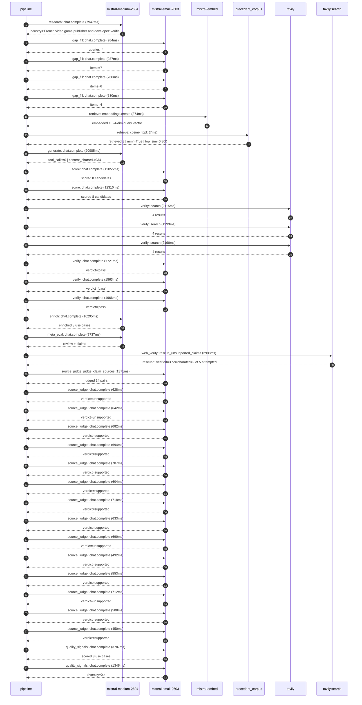

# Trace

## Execution trace — Ubisoft

Started: `2026-05-10T22:42:33.523517+00:00`. Total wall time: `108.6s` across `36` recorded actions.

### Per-step time totals

| Step | Calls | Total time | Avg time |
|---|---:|---:|---:|
| `research` | 1 | 7.95s | 7947ms |
| `gap_fill` | 4 | 3.32s | 830ms |
| `retrieve` | 2 | 0.38s | 191ms |
| `generate` | 1 | 20.99s | 20985ms |
| `score` | 2 | 25.17s | 12583ms |
| `verify` | 6 | 11.55s | 1925ms |
| `enrich` | 1 | 16.29s | 16295ms |
| `meta_eval` | 1 | 8.74s | 8737ms |
| `web_verify` | 1 | 2.99s | 2988ms |
| `source_judge` | 15 | 10.09s | 672ms |
| `quality_signals` | 2 | 5.13s | 2566ms |

### Chronological event log

- `22:42:46.156` **[research]** `mistral-medium-2604.chat.complete` — 7947ms
   - inputs: synthesize CompanyContext for Ubisoft | depth=medium
   - outputs: industry='French video game publisher and developer' verified=True conf=0.75
- `22:42:54.106` **[gap_fill]** `mistral-small-2603.chat.complete` — 984ms
   - inputs: generate gap queries | fields=['business_model', 'products', 'data_assets', 'priorities']
   - outputs: queries=4
- `22:43:02.803` **[gap_fill]** `mistral-small-2603.chat.complete` — 937ms
   - inputs: layer-2 extract field=priorities
   - outputs: items=7
- `22:43:02.810` **[gap_fill]** `mistral-small-2603.chat.complete` — 768ms
   - inputs: layer-2 extract field=data_assets
   - outputs: items=6
- `22:43:02.814` **[gap_fill]** `mistral-small-2603.chat.complete` — 630ms
   - inputs: layer-2 extract field=products
   - outputs: items=4
- `22:43:03.742` **[retrieve]** `mistral-embed.embeddings.create` — 374ms
   - inputs: company_query | industries='French video game publisher and developer'
   - outputs: embedded 1024-dim query vector
- `22:43:04.116` **[retrieve]** `precedent_corpus.cosine_topk` — 7ms
   - inputs: k=8 min_depth=0.4 target='Ubisoft'
   - outputs: retrieved 8 | mmr=True | top_sim=0.800
- `22:43:05.744` **[generate]** `mistral-medium-2604.chat.complete` — 20985ms
   - inputs: iteration=0 tool_calls_used=0/0 tools=off
   - outputs: tool_calls=0 | content_chars=14934
- `22:43:27.047` **[score]** `mistral-small-2603.chat.complete` — 12855ms
   - inputs: self-consistency pass T=0.2
   - outputs: scored 8 candidates
- `22:43:27.053` **[score]** `mistral-small-2603.chat.complete` — 12310ms
   - inputs: self-consistency pass T=0.4
   - outputs: scored 8 candidates
- `22:43:39.934` **[verify]** `tavily.search` — 2115ms
   - inputs: candidate=ubisoft-ai-localization-pipeline | query="Ubisoft Automated Localization Pipeline for Ubisoft's Multil"
   - outputs: 4 results
- `22:43:39.935` **[verify]** `tavily.search` — 1993ms
   - inputs: candidate=ubisoft-ai-narrative-design-assistant | query="Ubisoft AI-Powered Narrative Design Assistant for Ubisoft's "
   - outputs: 4 results
- `22:43:39.935` **[verify]** `tavily.search` — 2190ms
   - inputs: candidate=ubisoft-ai-testing-automation | query="Ubisoft AI-Augmented Game Testing for Ubisoft's AAA Titles M"
   - outputs: 4 results
- `22:43:42.221` **[verify]** `mistral-small-2603.chat.complete` — 1721ms
   - inputs: verdict for ubisoft-ai-testing-automation
   - outputs: verdict='pass'
- `22:43:42.255` **[verify]** `mistral-small-2603.chat.complete` — 1563ms
   - inputs: verdict for ubisoft-ai-localization-pipeline
   - outputs: verdict='pass'
- `22:43:42.646` **[verify]** `mistral-small-2603.chat.complete` — 1966ms
   - inputs: verdict for ubisoft-ai-narrative-design-assistant
   - outputs: verdict='pass'
- `22:43:44.614` **[enrich]** `mistral-medium-2604.chat.complete` — 16295ms
   - inputs: tier=fast parallel=False ids=['ubisoft-ai-localization-pipeline', 'ubisoft-ai-narrative-design-assistant', 'ubisoft-ai-testing-automation']
   - outputs: enriched 3 use cases
- `22:44:00.933` **[meta_eval]** `mistral-medium-2604.chat.complete` — 8737ms
   - inputs: reviewing 3 use cases
   - outputs: review + claims
- `22:44:09.689` **[web_verify]** `tavily.search.rescue_unsupported_claims` — 2988ms
   - inputs: company='Ubisoft' unsupported=5 budget=12
   - outputs: rescued: verified=3 corroborated=2 of 5 attempted
- `22:44:12.681` **[source_judge]** `mistral-small-2603.judge_claim_sources` — 1371ms
   - inputs: pairs=14
   - outputs: judged 14 pairs
- `22:44:12.681` **[source_judge]** `mistral-small-2603.chat.complete` — 628ms
   - inputs: claim='Ubisoft releases games in 100+ regions'
   - outputs: verdict=unsupported
- `22:44:12.685` **[source_judge]** `mistral-small-2603.chat.complete` — 642ms
   - inputs: claim='Ubisoft requires rapid, high-quality localization for text, '
   - outputs: verdict=unsupported
- `22:44:12.689` **[source_judge]** `mistral-small-2603.chat.complete` — 682ms
   - inputs: claim='Ubisoft has franchise-specific terminology for Assassin’s Cr'
   - outputs: verdict=supported
- `22:44:12.694` **[source_judge]** `mistral-small-2603.chat.complete` — 694ms
   - inputs: claim='Ubisoft’s dual-pillar growth strategy demands faster, more s'
   - outputs: verdict=supported
- `22:44:12.697` **[source_judge]** `mistral-small-2603.chat.complete` — 707ms
   - inputs: claim='Localization is a critical bottleneck for Ubisoft'
   - outputs: verdict=supported
- `22:44:12.701` **[source_judge]** `mistral-small-2603.chat.complete` — 604ms
   - inputs: claim='Ubisoft has a French headquarters'
   - outputs: verdict=supported
- `22:44:12.703` **[source_judge]** `mistral-small-2603.chat.complete` — 718ms
   - inputs: claim='Ubisoft owns decades of proprietary lore, dialogue, and worl'
   - outputs: verdict=supported
- `22:44:12.706` **[source_judge]** `mistral-small-2603.chat.complete` — 633ms
   - inputs: claim='Ubisoft’s open-world franchises include Assassin’s Creed Sha'
   - outputs: verdict=supported
- `22:44:13.304` **[source_judge]** `mistral-small-2603.chat.complete` — 690ms
   - inputs: claim='Ubisoft’s ‘reclaim open-world leadership’ priority hinges on'
   - outputs: verdict=unsupported
- `22:44:13.309` **[source_judge]** `mistral-small-2603.chat.complete` — 492ms
   - inputs: claim='Ubisoft has a French heritage'
   - outputs: verdict=supported
- `22:44:13.326` **[source_judge]** `mistral-small-2603.chat.complete` — 553ms
   - inputs: claim='Ubisoft’s AAA open-world games include Assassin’s Creed Shad'
   - outputs: verdict=supported
- `22:44:13.340` **[source_judge]** `mistral-small-2603.chat.complete` — 712ms
   - inputs: claim='Ubisoft’s ‘reclaim open-world leadership’ priority demands r'
   - outputs: verdict=unsupported
- `22:44:13.371` **[source_judge]** `mistral-small-2603.chat.complete` — 508ms
   - inputs: claim='Ubisoft has a cost-reduction program'
   - outputs: verdict=supported
- `22:44:13.388` **[source_judge]** `mistral-small-2603.chat.complete` — 450ms
   - inputs: claim='Ubisoft has existing QA pipelines'
   - outputs: verdict=supported
- `22:44:16.986` **[quality_signals]** `mistral-small-2603.chat.complete` — 3787ms
   - inputs: specificity grade (3 use cases)
   - outputs: scored 3 use cases
- `22:44:20.773` **[quality_signals]** `mistral-small-2603.chat.complete` — 1346ms
   - inputs: diversity grade
   - outputs: diversity=0.4

## Mermaid sequence

