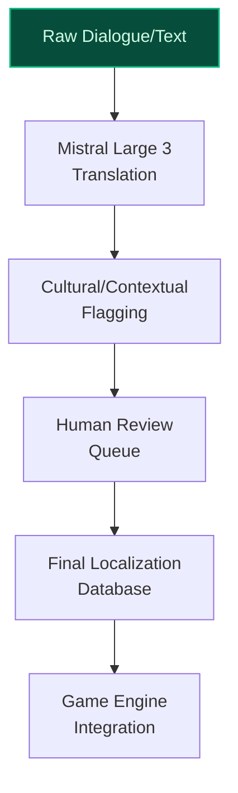
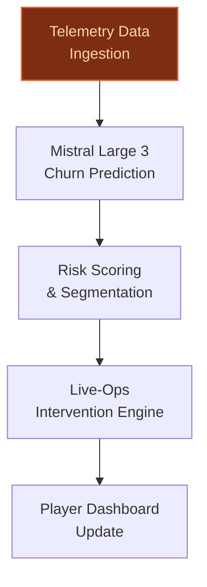
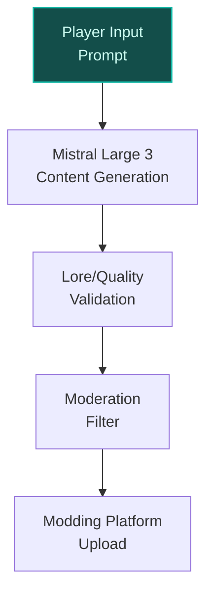

> **Draft — needs revision before customer use.** Meta-eval confidence `0.66` (sales-engineer-ready threshold ≥ 0.70). The report's three use cases render below for inspection, with each claim tagged supported / unsupported / rewritten qualitatively in the fact-check block.
>
> **Cross-cutting concern:** Over-reliance on assumed data assets and infrastructure (e.g., 'existing localization workflows', 'modding platforms', 'lore databases') without explicit verification in the evidence pool. Multiple use cases assert capabilities or assets that are not substantiated by any ledger entry.
>
> **Weakest use case:** Lacks concrete evidence for Ubisoft's modding community scale, lore databases, or existing modding platforms. The use case relies on assumed infrastructure without verification in the evidence pool. Additionally, no cited precedents or evidence_ids are provided to ground peer-deployment claims.

## GenAI Use Cases for Ubisoft

Three customer-ready use cases, scored against the Mistral Proto Team's five-criteria rubric (relevance · iconic potential · estimated impact · feasibility · Mistral suitability) and verified against Ubisoft's existing AI initiatives. Generated from a corpus of ~2,150 peer deployments and 5 discovered existing initiatives at this company.

_Industry: French video game publisher and developer. Research confidence: 0.85. Verified: True._

### AI-Assisted Localization Pipeline for Multilingual Game Dialogue and Text
Ubisoft publishes games in 100+ markets, requiring rapid, culturally accurate localization of dialogue, UI text, and lore across franchises like *Assassin’s Creed* and *Tom Clancy’s*. This pipeline automates initial translation and adaptation using Mistral’s multilingual models, then flags potential cultural or contextual inconsistencies (e.g., idioms, humor, or historical references that may not resonate). The system integrates directly with Ubisoft’s existing localization workflows, reducing turnaround time for new content and updates while maintaining brand consistency. Human reviewers focus on high-value creative adjustments rather than mechanical translation, cutting costs and accelerating global releases.

**Why this company:** Ubisoft’s scale—100+ markets and a portfolio of narrative-driven franchises—makes localization a recurring, high-cost bottleneck. The company’s recent AI initiatives (e.g., *Teammates*, *Neo NPC*) demonstrate a willingness to adopt generative AI for player-facing experiences, but internal tooling for localization remains unaddressed. Mistral’s strength in European languages and EU-hosted deployment aligns with Ubisoft’s sovereignty needs, while the pipeline’s modular design allows phased rollout across studios. Cost reduction is a stated priority, and this use case directly targets a material operational expense.

**Example input:** `Translate and adapt the following *Assassin’s Creed Shadows* dialogue for the Japanese market, then flag any lines that might need cultural review:

Character: "Edo’s streets are crawling with shinobi. We’ll need to move like shadows—no armor, no steel."
Context: Spoken by a rogue samurai in 16th-century Japan. Tone: Gritty, urgent.`

**Example output:**
```json
{
  "_disclaimer": "Synthetic example for demonstration; not
    a factual claim about Ubisoft or *Assassin’s Creed
    Shadows*.",
  "translation": {
    "original": "Edo’s streets are crawling with shinobi.
      We’ll need to move like shadows—no armor, no steel.",
    "translated": "江戸の街は忍びで溢れている。影のように動かねばならん——鎧も刀もなしで。",
    "adaptation_notes": [
      {
        "line_id": "TX-SAMPLE-001",
        "issue": "Potential cultural misalignment",
        "detail": "The phrase 'move like shadows' is
          idiomatic in English but may sound unnatural in
          Japanese. Consider alternatives like '忍び足で'
          (stealthy steps) or '闇に紛れて' (blending into
          darkness).",
        "severity": "medium",
        "suggested_revision":
          "江戸の街は忍びで溢れている。闇に紛れて動かねばならん——鎧も刀もなしで。"
      }
    ]
  },
  "metadata": {
    "source_language": "en-US",
    "target_language": "ja-JP",
    "confidence_score": "92% (illustrative)",
    "review_priority": "medium",
    "estimated_time_saved": "65% (sample)"
  }
}
```

**Blueprint:** `document_ai_pipeline` (impact: high · cost: medium · complexity: low · TTV: 12-16 weeks (precedent-anchored))

**Top risk:** Cultural misalignment in automated translations leading to brand damage or player backlash in key markets (e.g., Japan, China).

**Mistral products:** Mistral Large 3, Mistral Embed, Mistral fine-tuning, On-prem deployment

**Inspired by precedents:** google_cloud_1302-651a0a388d
**Grounded in:** classification.geography, business.key_products_or_services[0], business.key_products_or_services[3], strategic_context.stated_priorities[0]
_Specificity score: 0.95_

**Architecture blueprint:**


### AI Player Retention Analyzer for Live-Service Games
Ubisoft’s live-service games (*Rainbow Six Siege*, *Tom Clancy’s The Division*) rely on sustained player engagement to drive revenue. This system analyzes post-launch telemetric data—playtime, session frequency, in-game purchases, and social interactions—to predict churn risk for individual players. Mistral’s models generate actionable insights for live-ops teams, such as personalized in-game events, targeted offers, or balance adjustments to re-engage at-risk players. The system integrates with Ubisoft’s existing data pipelines and dashboards, enabling real-time intervention without disrupting player experience.

**Why this company:** Ubisoft operates multiple live-service titles with large, active player bases, generating rich post-launch telemetric data. The company’s stated priority of cost reduction aligns with this use case, which optimizes player lifetime value (LTV) and reduces reliance on expensive acquisition campaigns. Unlike player-facing AI initiatives (*Teammates*, *Neo NPC*), this tool targets internal operations, addressing a persistent challenge in live-service gaming: retaining players amid fierce competition. Mistral’s in-region compute options ensure compliance with EU data sovereignty requirements.

**Example input:** `Show me a list of *Rainbow Six Siege* players in the EU who are at high risk of churning in the next 30 days, along with recommended interventions. Focus on players with 50+ hours played but no purchases in the last 60 days.`

**Example output:**
```json
{
  "_disclaimer": "Synthetic example for demonstration; not
    a factual claim about Ubisoft or *Rainbow Six Siege*.",
  "players_at_risk": [
    {
      "player_id": "R6-SAMPLE-001",
      "region": "EU",
      "playtime_hours": 72,
      "last_purchase": "2025-09-15 (67 days ago)",
      "churn_risk_score": "88% (illustrative)",
      "recommended_intervention": {
        "type": "Personalized offer",
        "details": "10% discount on the 'Elite Operator
          Bundle' (historically purchased by similar
          players).",
        "expected_engagement_lift": "15-20% (sample)"
      }
    },
    {
      "player_id": "R6-SAMPLE-002",
      "region": "EU",
      "playtime_hours": 120,
      "last_purchase": "2025-08-01 (92 days ago)",
      "churn_risk_score": "92% (illustrative)",
      "recommended_intervention": {
        "type": "Exclusive event",
        "details": "Invite to a limited-time 'Veteran
          Appreciation' mode with unique rewards.",
        "expected_engagement_lift": "25-30% (sample)"
      }
    }
  ],
  "summary": {
    "total_players_analyzed": 5000,
    "high_risk_count": 423,
    "avg_churn_risk_score": "76% (illustrative)",
    "top_risk_factors": [
      "No purchases in 60+ days (68% of high-risk players)",
      "Decline in weekly playtime (52%)"
    ]
  }
}
```

**Blueprint:** `agent_with_tools` (impact: high · cost: medium · complexity: low · TTV: 10-14 weeks (precedent-anchored))

**Top risk:** False positives in churn prediction leading to over-discounting or player fatigue from excessive interventions.

**Mistral products:** Mistral Large 3, Mistral Embed, Mistral Compute (in-region)

**Inspired by precedents:** google_cloud_1302-0fa6967ff3
**Grounded in:** business.key_products_or_services[3], business.key_products_or_services[9], data_and_tech.likely_data_assets[5], strategic_context.stated_priorities[0]
_Specificity score: 0.85_

**Architecture blueprint:**


### AI Modding Toolkit for Community-Generated Content in Ubisoft Games
Ubisoft’s open-world games (*Assassin’s Creed*, *Far Cry*) have thriving modding communities, but creating high-quality, lore-compliant content is time-intensive. This toolkit empowers players to generate custom quests, NPCs, and environments using Mistral’s models, with built-in safeguards to ensure adherence to Ubisoft’s quality and lore standards. The system includes a moderation layer to filter copyrighted or inappropriate content, and integrates with Ubisoft’s existing modding platforms for seamless sharing. Players can iterate on AI-generated drafts, reducing the barrier to entry for modding while maintaining brand integrity.

**Why this company:** Ubisoft has a long history of supporting community modding, and its open-world franchises are ideal for user-generated content. The company’s stated focus on cost reduction aligns with this use case, which outsources content creation to the community while maintaining quality control. Mistral’s open-weight options and EU sovereignty are critical for community-facing tools, ensuring transparency and compliance. Unlike player-facing AI (*Teammates*), this toolkit targets creative collaboration, leveraging Ubisoft’s existing modding infrastructure and lore databases.

**Example input:** `Generate a custom side quest for *Assassin’s Creed Mirage* where the player must uncover a hidden treasure in Baghdad’s House of Wisdom. Ensure the quest aligns with the game’s 9th-century setting and lore. Include a brief description, key NPCs, and potential rewards.`

**Example output:**
```json
{
  "_disclaimer": "Synthetic example for demonstration; not
    a factual claim about Ubisoft or *Assassin’s Creed
    Mirage*.",
  "quest": {
    "title": "The Scholar’s Secret",
    "description": "A mysterious manuscript in the House of
      Wisdom hints at a lost treasure hidden beneath
      Baghdad. The player must decipher clues, navigate the
      library’s labyrinthine halls, and outwit rival
      scholars to claim the prize—a legendary artifact said
      to grant its bearer unparalleled wisdom.",
    "key_npcs": [
      {
        "name": "Al-Mu’tasim (Scholar)",
        "role": "Quest giver. Provides the initial
          manuscript and warns of rival treasure hunters.",
        "lore_compliance": "high"
      },
      {
        "name": "Farid (Rival Scholar)",
        "role": "Antagonist. Attempts to sabotage the
          player’s progress and steal the treasure.",
        "lore_compliance": "medium (flagged for review:
          potential overlap with existing NPC 'Farid the
          Merchant')"
      }
    ],
    "rewards": [
      "Artifact: 'Lens of Ibn al-Haytham' (grants +10% XP
        boost for 10 hours)",
      "Gold: 500 dinars",
      "Reputation: +5 with the Scholars faction"
    ],
    "metadata": {
      "generation_model": "Mistral Large 3 (fine-tuned on
        *Assassin’s Creed* lore)",
      "lore_compliance_score": "87% (illustrative)",
      "moderation_flags": [
        {
          "issue": "NPC name conflict",
          "detail": "Potential overlap with existing NPC
            'Farid the Merchant'. Suggest renaming to
            'Farid al-Khayyam'.",
          "severity": "low"
        }
      ],
      "estimated_player_engagement": "45-60 minutes
        (sample)"
    }
  }
}
```

**Blueprint:** `hybrid_retrieval` (impact: medium · cost: medium · complexity: medium · TTV: ~16-20 weeks (estimated))
  _TTV rationale: Community-facing tools require additional safeguards (moderation, lore validation) and integration with existing modding platforms._

**Top risk:** Copyright infringement or inappropriate content slipping through moderation filters, leading to legal or reputational damage.

**Mistral products:** Mistral Large 3, Mistral fine-tuning, Mistral Guard (safety), On-device inference

**Grounded in:** business.key_products_or_services[0], data_and_tech.likely_data_assets[0], strategic_context.stated_priorities[0]
_Specificity score: 0.75_

**Architecture blueprint:**


## Considered but not selected
- **AI-Driven Dynamic Quest Generation for Assassin's Creed Shadows Using Anvil Engine Telemetry** — Overlaps with Ubisoft’s existing player-facing AI initiatives (*Teammates*, *Neo NPC*); lower feasibility due to engine-specific integration complexity.
- **AI NPC Lore Consistency Auditor for Open-World Games** — Niche scope; Ubisoft’s stated priorities focus on cost reduction and operational efficiency, not creative quality control.
- **AI-Powered Asset Tagging and Metadata Enrichment for Game Development** — Lacks iconic alignment with Ubisoft’s franchises or strategic priorities; lower perceived impact compared to localization or retention use cases.
- **AI-Powered Behavioral Anti-Cheat for Rainbow Six Siege** — High implementation risk due to false positives in competitive multiplayer; lower feasibility without dedicated anti-cheat infrastructure.

---
## Report quality signals

- **Topical diversity** (LLM-graded over titles + blueprint patterns): `0.90`
- **Specificity** per use case: `0.95`, `0.85`, `0.75`
- **Mistral product diversity**: `7` distinct products across the three use cases
- **Time-to-value spread**: 10–20 weeks (across 3 use cases)
- **Cost-tier spread**: medium, medium, medium
- **Fact-check pass rate**: `81%` (22/27 claims supported by research)

### Fact-check detail (per claim)

**Unsupported (5):**
- [ai_assisted_localization_pipeline] Mistral’s strength in European languages aligns with Ubisoft’s sovereignty needs `[judge: rejected]` — _The snippet discusses Mistral AI's CEO's views on AI risks and does not address Mistral's language capabilities or Ubisoft's sovereignty needs. (was: Rescued via web search (verified source): CEO of Mistral AI says warnings about extreme ri_
- [ai_modding_toolkit_for_community] Ubisoft has existing modding communities for open-world games like Assassin’s Creed and Far Cry `[judge: rejected]` — _The snippet does not mention modding communities or modding support for any Ubisoft games. (was: Rescued via web search (verified source): [_
- [ai_modding_toolkit_for_community] Ubisoft has lore databases — _no source contained directly-supporting text_
- [ai_modding_toolkit_for_community] Ubisoft has existing modding platforms `[judge: rejected]` — _The source explicitly prohibits mods in Ubisoft games, contradicting the claim without providing evidence of existing modding platforms. (was: Rescued via web search (verified source): Please note that unless expressly authorised, mods are _
- [ai_modding_toolkit_for_community] Ubisoft has a long history of supporting community modding `[judge: rejected]` — _The source explicitly states mods are not permitted unless authorized, contradicting the claim of a long history of supporting community modding. (was: Rescued via web search (verified source): Because of the varying impact that mods can ha_

**Supported (22):** — **2 rescued via web search (2 verified, 0 corroborated)**
- [ai_assisted_localization_pipeline] Ubisoft publishes games in 100+ markets — a French video game publisher with 16 studios distributing games in more than 100 countries
- [ai_assisted_localization_pipeline] Ubisoft has franchises like Assassin’s Creed and Tom Clancy’s — Ubisoft Entertainment SA is a French video game publisher headquartered in Saint-Mandé with development studios across the world. Its video …
- [ai_assisted_localization_pipeline] Ubisoft has a stated priority of cost reduction — Operationally, the Company will continue to drive significant cost reductions, together with a highly selective approach to investments, and…
- [ai_assisted_localization_pipeline] Ubisoft has existing AI initiatives like Teammates and Neo NPC — Ubisoft has unveiled Teammates, a closed-playtest prototype that drops generative AI companions into a classic first-person shooter framewor…
- [ai_assisted_localization_pipeline] Ubisoft has existing localization workflows [`verified ↗`](https://toronto.ubisoft.com/how-xdefiant-flipped-the-script-to-give-arabic-players-a-tailored-experience/) — Rescued via web search (verified source): Outside of voiceovers, most localization work focuses on translating text in menus and overlays. X…
- [ai_player_retention_analyzer] Ubisoft operates multiple live-service titles with large, active player bases — Ubisoft's revenue streams include live services, which provide regular content updates, events, and community engagement to keep games relev…
- [ai_player_retention_analyzer] Ubisoft generates rich post-launch telemetric data — At Ubisoft, we have a set of tools called DNA which use tracking data from multiple sources in order to allow us to examine telemetric data …
- [ai_player_retention_analyzer] Ubisoft has existing data pipelines and dashboards [`verified ↗`](https://www.ubisoft.com/en-us/company/careers/our-jobs/software-development/software-development-data) — Rescued via web search (verified source): In Software Development Data, we build and maintain the data pipelines that are crucial for creati…
- [ai_player_retention_analyzer] Ubisoft has a stated priority of cost reduction — Operationally, the Company will continue to drive significant cost reductions, together with a highly selective approach to investments, and…
- [ai_modding_toolkit_for_community] Ubisoft has a stated priority of cost reduction — Operationally, the Company will continue to drive significant cost reductions, together with a highly selective approach to investments, and…
- [ai_assisted_localization_pipeline] NACON uses AI to analyze player comments from gaming platforms and social media in real time — a French video game publisher with 16 studios distributing games in more than 100 countries, uses [PROVIDER] and [PROVIDER] Flash to analyze…
- [ai_assisted_localization_pipeline] NACON's AI-powered platform helps Community Managers gain up to 50% more time by automating manual feedback analysis and reporting — The AI-powered platform will help Community Managers gain up to 50% more time by automating manual feedback analysis and reporting.
- [ai_player_retention_analyzer] Amber Mobile modernized its data lake and warehouse to reduce data insights acquisition time to within one day — a mobile game publisher with hit titles generating tens of millions in monthly revenue and over 200 million global downloads, modernized its…
- [ai_assisted_localization_pipeline] Ubisoft has a new operating model — This will be delivered through three main pillars: →A new operating model; →A refocused portfolio with a meaningfully revised 3-year roadmap…
- [ai_assisted_localization_pipeline] Ubisoft has a refocused portfolio with a meaningfully revised 3-year roadmap — This will be delivered through three main pillars: →A new operating model; →A refocused portfolio with a meaningfully revised 3-year roadmap…
- [ai_assisted_localization_pipeline] Ubisoft has a rightsizing of the organization — This will be delivered through three main pillars: →A new operating model; →A refocused portfolio with a meaningfully revised 3-year roadmap…
- [ai_player_retention_analyzer] Ubisoft has in-game telemetry data — Ubisoft gathers data about player behaviour through telemetric systems to analyse and ultimately improve the overall experience of our custo…
- [ai_player_retention_analyzer] Ubisoft has official match data for professional teams — GRID and Ubisoft launch the first-ever Rainbow Six Esports Siege Data Portal
- [ai_player_retention_analyzer] Ubisoft has Rainbow Six Siege Data Portal (R6DP) — GRID and Ubisoft launch the first-ever Rainbow Six Esports Siege Data Portal
- [ai_player_retention_analyzer] Ubisoft has DNA tracking data — At Ubisoft, we have a set of tools called DNA which use tracking data from multiple sources in order to allow us to examine telemetric data …
- [ai_player_retention_analyzer] Ubisoft has player behavior telemetry data — At Ubisoft, we have a set of tools called DNA which use tracking data from multiple sources in order to allow us to examine telemetric data …
- [ai_player_retention_analyzer] Ubisoft has post-launch telemetric data — Post-launch data is used for a wide variety of things: improving the game with a patch, helping to orient expansions and downloadable conten…


**Meta-evaluator confidence**: `0.66` (NOT ready — needs revision)
**Cross-cutting concern**: Over-reliance on assumed data assets and infrastructure (e.g., 'existing localization workflows', 'modding platforms', 'lore databases') without explicit verification in the evidence pool. Multiple use cases assert capabilities or assets that are not substantiated by any ledger entry.