# Trace

## Execution trace — Ubisoft

Started: `2026-05-10T22:44:22.124369+00:00`. Total wall time: `158.7s` across `52` recorded actions.

### Per-step time totals

| Step | Calls | Total time | Avg time |
|---|---:|---:|---:|
| `research` | 1 | 7.96s | 7955ms |
| `gap_fill` | 4 | 3.46s | 866ms |
| `retrieve` | 2 | 0.19s | 97ms |
| `generate` | 2 | 24.71s | 12357ms |
| `generate.web_search` | 2 | 3.70s | 1851ms |
| `score` | 2 | 27.11s | 13556ms |
| `verify` | 6 | 11.91s | 1984ms |
| `enrich` | 1 | 58.09s | 58090ms |
| `meta_eval` | 1 | 15.29s | 15286ms |
| `web_verify` | 1 | 3.39s | 3391ms |
| `source_judge` | 27 | 28.62s | 1060ms |
| `final_qualify` | 1 | 1.52s | 1521ms |
| `quality_signals` | 2 | 3.88s | 1941ms |

### Chronological event log

- `22:44:23.046` **[research]** `mistral-medium-2604.chat.complete` — 7955ms
   - inputs: synthesize CompanyContext for Ubisoft | depth=medium
   - outputs: industry='French video game publisher and developer' verified=True conf=0.75
- `22:44:31.003` **[gap_fill]** `mistral-small-2603.chat.complete` — 918ms
   - inputs: generate gap queries | fields=['business_model', 'products', 'data_assets', 'priorities']
   - outputs: queries=4
- `22:44:36.427` **[gap_fill]** `mistral-small-2603.chat.complete` — 600ms
   - inputs: layer-2 extract field=priorities
   - outputs: items=5
- `22:44:36.430` **[gap_fill]** `mistral-small-2603.chat.complete` — 701ms
   - inputs: layer-2 extract field=data_assets
   - outputs: items=6
- `22:44:36.433` **[gap_fill]** `mistral-small-2603.chat.complete` — 1244ms
   - inputs: layer-2 extract field=products
   - outputs: items=15
- `22:44:37.680` **[retrieve]** `mistral-embed.embeddings.create` — 188ms
   - inputs: company_query | industries='French video game publisher and developer'
   - outputs: embedded 1024-dim query vector
- `22:44:37.868` **[retrieve]** `precedent_corpus.cosine_topk` — 6ms
   - inputs: k=8 min_depth=0.4 target='Ubisoft'
   - outputs: retrieved 8 | mmr=True | top_sim=0.807
- `22:44:39.682` **[generate]** `mistral-medium-2604.chat.complete` — 1640ms
   - inputs: iteration=0 tool_calls_used=0/2 tools=on
   - outputs: tool_calls=4 | content_chars=0
- `22:44:41.337` **[generate.web_search]** `tavily.search` — 1925ms
   - inputs: query='Ubisoft Snowdrop engine AI tools 2025'
   - outputs: 2 raw results
- `22:44:45.115` **[generate.web_search]** `tavily.search` — 1776ms
   - inputs: query="Ubisoft Assassin's Creed Shadows AI features"
   - outputs: 2 raw results
- `22:44:48.967` **[generate]** `mistral-medium-2604.chat.complete` — 23075ms
   - inputs: iteration=1 tool_calls_used=2/2 tools=off
   - outputs: tool_calls=0 | content_chars=16157
- `22:45:12.355` **[score]** `mistral-small-2603.chat.complete` — 13380ms
   - inputs: self-consistency pass T=0.2
   - outputs: scored 8 candidates
- `22:45:12.359` **[score]** `mistral-small-2603.chat.complete` — 13732ms
   - inputs: self-consistency pass T=0.4
   - outputs: scored 8 candidates
- `22:45:26.127` **[verify]** `tavily.search` — 2269ms
   - inputs: candidate=ai_assisted_localization_pipeline | query='Ubisoft AI-Assisted Localization Pipeline for Multilingual G'
   - outputs: 4 results
- `22:45:26.127` **[verify]** `tavily.search` — 2108ms
   - inputs: candidate=ai_player_retention_analyzer | query='Ubisoft AI Player Retention Analyzer for Live-Service Games '
   - outputs: 4 results
- `22:45:26.127` **[verify]** `tavily.search` — 2193ms
   - inputs: candidate=ai_modding_toolkit_for_community | query='Ubisoft AI Modding Toolkit for Community-Generated Content i'
   - outputs: 4 results
- `22:45:28.627` **[verify]** `mistral-small-2603.chat.complete` — 1863ms
   - inputs: verdict for ai_modding_toolkit_for_community
   - outputs: verdict='pass'
- `22:45:29.009` **[verify]** `mistral-small-2603.chat.complete` — 1534ms
   - inputs: verdict for ai_assisted_localization_pipeline
   - outputs: verdict='pass'
- `22:45:29.021` **[verify]** `mistral-small-2603.chat.complete` — 1941ms
   - inputs: verdict for ai_player_retention_analyzer
   - outputs: verdict='pass'
- `22:45:30.964` **[enrich]** `mistral-large-2512.chat.complete` — 58090ms
   - inputs: tier=standard parallel=False ids=['ai_assisted_localization_pipeline', 'ai_player_retention_analyzer', 'ai_modding_toolkit_for_community']
   - outputs: enriched 3 use cases
- `22:46:29.078` **[meta_eval]** `mistral-medium-2604.chat.complete` — 15286ms
   - inputs: reviewing 3 use cases
   - outputs: review + claims
- `22:46:44.385` **[web_verify]** `tavily.search.rescue_unsupported_claims` — 3391ms
   - inputs: company='Ubisoft' unsupported=7 budget=12
   - outputs: rescued: verified=6 corroborated=0 of 7 attempted
- `22:46:47.777` **[source_judge]** `mistral-small-2603.judge_claim_sources` — 6772ms
   - inputs: pairs=26
   - outputs: judged 26 pairs
- `22:46:47.778` **[source_judge]** `mistral-small-2603.chat.complete` — 616ms
   - inputs: claim='Ubisoft publishes games in 100+ markets'
   - outputs: verdict=supported
- `22:46:47.782` **[source_judge]** `mistral-small-2603.chat.complete` — 718ms
   - inputs: claim='Ubisoft has franchises like Assassin’s Creed and Tom Clancy’'
   - outputs: verdict=supported
- `22:46:47.785` **[source_judge]** `mistral-small-2603.chat.complete` — 829ms
   - inputs: claim='Ubisoft has a stated priority of cost reduction'
   - outputs: verdict=supported
- `22:46:47.790` **[source_judge]** `mistral-small-2603.chat.complete` — 1116ms
   - inputs: claim='Ubisoft has existing AI initiatives like Teammates and Neo N'
   - outputs: verdict=supported
- `22:46:47.793` **[source_judge]** `mistral-small-2603.chat.complete` — 708ms
   - inputs: claim='Ubisoft has existing localization workflows'
   - outputs: verdict=supported
- `22:46:47.795` **[source_judge]** `mistral-small-2603.chat.complete` — 714ms
   - inputs: claim='Mistral’s strength in European languages aligns with Ubisoft'
   - outputs: verdict=unsupported
- `22:46:47.798` **[source_judge]** `mistral-small-2603.chat.complete` — 767ms
   - inputs: claim='Ubisoft operates multiple live-service titles with large, ac'
   - outputs: verdict=supported
- `22:46:47.800` **[source_judge]** `mistral-small-2603.chat.complete` — 732ms
   - inputs: claim='Ubisoft generates rich post-launch telemetric data'
   - outputs: verdict=supported
- `22:46:48.394` **[source_judge]** `mistral-small-2603.chat.complete` — 669ms
   - inputs: claim='Ubisoft has existing data pipelines and dashboards'
   - outputs: verdict=supported
- `22:46:48.501` **[source_judge]** `mistral-small-2603.chat.complete` — 747ms
   - inputs: claim='Ubisoft has a stated priority of cost reduction'
   - outputs: verdict=supported
- `22:46:48.506` **[source_judge]** `mistral-small-2603.chat.complete` — 568ms
   - inputs: claim='Ubisoft has existing modding communities for open-world game'
   - outputs: verdict=unsupported
- `22:46:48.509` **[source_judge]** `mistral-small-2603.chat.complete` — 612ms
   - inputs: claim='Ubisoft has existing modding platforms'
   - outputs: verdict=unsupported
- `22:46:48.532` **[source_judge]** `mistral-small-2603.chat.complete` — 824ms
   - inputs: claim='Ubisoft has a stated priority of cost reduction'
   - outputs: verdict=supported
- `22:46:48.565` **[source_judge]** `mistral-small-2603.chat.complete` — 560ms
   - inputs: claim='Ubisoft has a long history of supporting community modding'
   - outputs: verdict=unsupported
- `22:46:48.615` **[source_judge]** `mistral-small-2603.chat.complete` — 510ms
   - inputs: claim='NACON uses AI to analyze player comments from gaming platfor'
   - outputs: verdict=supported
- `22:46:48.907` **[source_judge]** `mistral-small-2603.chat.complete` — 480ms
   - inputs: claim="NACON's AI-powered platform helps Community Managers gain up"
   - outputs: verdict=supported
- `22:46:49.063` **[source_judge]** `mistral-small-2603.chat.complete` — 5486ms
   - inputs: claim='Amber Mobile modernized its data lake and warehouse to reduc'
   - outputs: verdict=supported
- `22:46:49.074` **[source_judge]** `mistral-small-2603.chat.complete` — 529ms
   - inputs: claim='Ubisoft has a new operating model'
   - outputs: verdict=supported
- `22:46:49.121` **[source_judge]** `mistral-small-2603.chat.complete` — 579ms
   - inputs: claim='Ubisoft has a refocused portfolio with a meaningfully revise'
   - outputs: verdict=supported
- `22:46:49.125` **[source_judge]** `mistral-small-2603.chat.complete` — 569ms
   - inputs: claim='Ubisoft has a rightsizing of the organization'
   - outputs: verdict=supported
- `22:46:49.128` **[source_judge]** `mistral-small-2603.chat.complete` — 557ms
   - inputs: claim='Ubisoft has in-game telemetry data'
   - outputs: verdict=supported
- `22:46:49.248` **[source_judge]** `mistral-small-2603.chat.complete` — 582ms
   - inputs: claim='Ubisoft has official match data for professional teams'
   - outputs: verdict=supported
- `22:46:49.356` **[source_judge]** `mistral-small-2603.chat.complete` — 653ms
   - inputs: claim='Ubisoft has Rainbow Six Siege Data Portal (R6DP)'
   - outputs: verdict=supported
- `22:46:49.387` **[source_judge]** `mistral-small-2603.chat.complete` — 637ms
   - inputs: claim='Ubisoft has DNA tracking data'
   - outputs: verdict=supported
- `22:46:49.603` **[source_judge]** `mistral-small-2603.chat.complete` — 499ms
   - inputs: claim='Ubisoft has player behavior telemetry data'
   - outputs: verdict=supported
- `22:46:49.685` **[source_judge]** `mistral-small-2603.chat.complete` — 585ms
   - inputs: claim='Ubisoft has post-launch telemetric data'
   - outputs: verdict=supported
- `22:46:54.551` **[final_qualify]** `mistral-small-2603.chat.complete` — 1521ms
   - inputs: use_case=ai_modding_toolkit_for_community unsupported=1
   - outputs: qualified 4 fields
- `22:46:56.922` **[quality_signals]** `mistral-small-2603.chat.complete` — 2476ms
   - inputs: specificity grade (3 use cases)
   - outputs: scored 3 use cases
- `22:46:59.399` **[quality_signals]** `mistral-small-2603.chat.complete` — 1406ms
   - inputs: diversity grade
   - outputs: diversity=0.9

## Mermaid sequence

```mermaid
sequenceDiagram
    autonumber
    participant pipeline as pipeline
    participant mistral_medium_2604 as mistral-medium-2604
    participant mistral_small_2603 as mistral-small-2603
    participant mistral_embed as mistral-embed
    participant precedent_corpus as precedent_corpus
    participant tavily as tavily
    participant mistral_large_2512 as mistral-large-2512
    participant tavily_search as tavily.search
    pipeline->>mistral_medium_2604: research: chat.complete (7955ms)
    mistral_medium_2604-->>pipeline: industry='French video game publisher and developer' verifie
    pipeline->>mistral_small_2603: gap_fill: chat.complete (918ms)
    mistral_small_2603-->>pipeline: queries=4
    pipeline->>mistral_small_2603: gap_fill: chat.complete (600ms)
    mistral_small_2603-->>pipeline: items=5
    pipeline->>mistral_small_2603: gap_fill: chat.complete (701ms)
    mistral_small_2603-->>pipeline: items=6
    pipeline->>mistral_small_2603: gap_fill: chat.complete (1244ms)
    mistral_small_2603-->>pipeline: items=15
    pipeline->>mistral_embed: retrieve: embeddings.create (188ms)
    mistral_embed-->>pipeline: embedded 1024-dim query vector
    pipeline->>precedent_corpus: retrieve: cosine_topk (6ms)
    precedent_corpus-->>pipeline: retrieved 8 | mmr=True | top_sim=0.807
    pipeline->>mistral_medium_2604: generate: chat.complete (1640ms)
    mistral_medium_2604-->>pipeline: tool_calls=4 | content_chars=0
    pipeline->>tavily: generate.web_search: search (1925ms)
    tavily-->>pipeline: 2 raw results
    pipeline->>tavily: generate.web_search: search (1776ms)
    tavily-->>pipeline: 2 raw results
    pipeline->>mistral_medium_2604: generate: chat.complete (23075ms)
    mistral_medium_2604-->>pipeline: tool_calls=0 | content_chars=16157
    pipeline->>mistral_small_2603: score: chat.complete (13380ms)
    mistral_small_2603-->>pipeline: scored 8 candidates
    pipeline->>mistral_small_2603: score: chat.complete (13732ms)
    mistral_small_2603-->>pipeline: scored 8 candidates
    pipeline->>tavily: verify: search (2269ms)
    tavily-->>pipeline: 4 results
    pipeline->>tavily: verify: search (2108ms)
    tavily-->>pipeline: 4 results
    pipeline->>tavily: verify: search (2193ms)
    tavily-->>pipeline: 4 results
    pipeline->>mistral_small_2603: verify: chat.complete (1863ms)
    mistral_small_2603-->>pipeline: verdict='pass'
    pipeline->>mistral_small_2603: verify: chat.complete (1534ms)
    mistral_small_2603-->>pipeline: verdict='pass'
    pipeline->>mistral_small_2603: verify: chat.complete (1941ms)
    mistral_small_2603-->>pipeline: verdict='pass'
    pipeline->>mistral_large_2512: enrich: chat.complete (58090ms)
    mistral_large_2512-->>pipeline: enriched 3 use cases
    pipeline->>mistral_medium_2604: meta_eval: chat.complete (15286ms)
    mistral_medium_2604-->>pipeline: review + claims
    pipeline->>tavily_search: web_verify: rescue_unsupported_claims (3391ms)
    tavily_search-->>pipeline: rescued: verified=6 corroborated=0 of 7 attempted
    pipeline->>mistral_small_2603: source_judge: judge_claim_sources (6772ms)
    mistral_small_2603-->>pipeline: judged 26 pairs
    pipeline->>mistral_small_2603: source_judge: chat.complete (616ms)
    mistral_small_2603-->>pipeline: verdict=supported
    pipeline->>mistral_small_2603: source_judge: chat.complete (718ms)
    mistral_small_2603-->>pipeline: verdict=supported
    pipeline->>mistral_small_2603: source_judge: chat.complete (829ms)
    mistral_small_2603-->>pipeline: verdict=supported
    pipeline->>mistral_small_2603: source_judge: chat.complete (1116ms)
    mistral_small_2603-->>pipeline: verdict=supported
    pipeline->>mistral_small_2603: source_judge: chat.complete (708ms)
    mistral_small_2603-->>pipeline: verdict=supported
    pipeline->>mistral_small_2603: source_judge: chat.complete (714ms)
    mistral_small_2603-->>pipeline: verdict=unsupported
    pipeline->>mistral_small_2603: source_judge: chat.complete (767ms)
    mistral_small_2603-->>pipeline: verdict=supported
    pipeline->>mistral_small_2603: source_judge: chat.complete (732ms)
    mistral_small_2603-->>pipeline: verdict=supported
    pipeline->>mistral_small_2603: source_judge: chat.complete (669ms)
    mistral_small_2603-->>pipeline: verdict=supported
    pipeline->>mistral_small_2603: source_judge: chat.complete (747ms)
    mistral_small_2603-->>pipeline: verdict=supported
    pipeline->>mistral_small_2603: source_judge: chat.complete (568ms)
    mistral_small_2603-->>pipeline: verdict=unsupported
    pipeline->>mistral_small_2603: source_judge: chat.complete (612ms)
    mistral_small_2603-->>pipeline: verdict=unsupported
    pipeline->>mistral_small_2603: source_judge: chat.complete (824ms)
    mistral_small_2603-->>pipeline: verdict=supported
    pipeline->>mistral_small_2603: source_judge: chat.complete (560ms)
    mistral_small_2603-->>pipeline: verdict=unsupported
    pipeline->>mistral_small_2603: source_judge: chat.complete (510ms)
    mistral_small_2603-->>pipeline: verdict=supported
    pipeline->>mistral_small_2603: source_judge: chat.complete (480ms)
    mistral_small_2603-->>pipeline: verdict=supported
    pipeline->>mistral_small_2603: source_judge: chat.complete (5486ms)
    mistral_small_2603-->>pipeline: verdict=supported
    pipeline->>mistral_small_2603: source_judge: chat.complete (529ms)
    mistral_small_2603-->>pipeline: verdict=supported
    pipeline->>mistral_small_2603: source_judge: chat.complete (579ms)
    mistral_small_2603-->>pipeline: verdict=supported
    pipeline->>mistral_small_2603: source_judge: chat.complete (569ms)
    mistral_small_2603-->>pipeline: verdict=supported
    pipeline->>mistral_small_2603: source_judge: chat.complete (557ms)
    mistral_small_2603-->>pipeline: verdict=supported
    pipeline->>mistral_small_2603: source_judge: chat.complete (582ms)
    mistral_small_2603-->>pipeline: verdict=supported
    pipeline->>mistral_small_2603: source_judge: chat.complete (653ms)
    mistral_small_2603-->>pipeline: verdict=supported
    pipeline->>mistral_small_2603: source_judge: chat.complete (637ms)
    mistral_small_2603-->>pipeline: verdict=supported
    pipeline->>mistral_small_2603: source_judge: chat.complete (499ms)
    mistral_small_2603-->>pipeline: verdict=supported
    pipeline->>mistral_small_2603: source_judge: chat.complete (585ms)
    mistral_small_2603-->>pipeline: verdict=supported
    pipeline->>mistral_small_2603: final_qualify: chat.complete (1521ms)
    mistral_small_2603-->>pipeline: qualified 4 fields
    pipeline->>mistral_small_2603: quality_signals: chat.complete (2476ms)
    mistral_small_2603-->>pipeline: scored 3 use cases
    pipeline->>mistral_small_2603: quality_signals: chat.complete (1406ms)
    mistral_small_2603-->>pipeline: diversity=0.9
```

