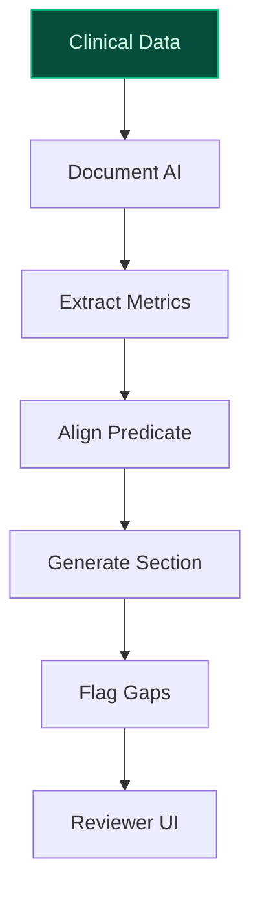
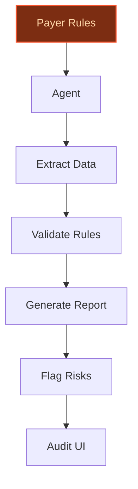
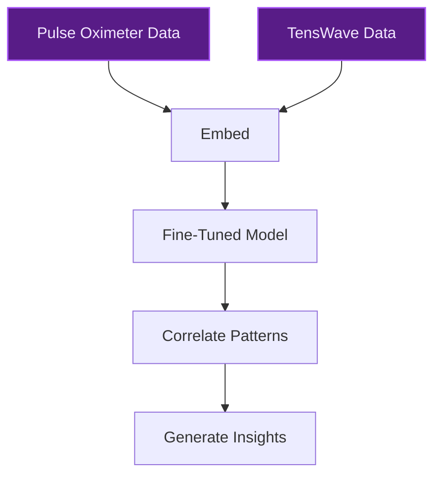

> **Draft — needs revision before customer use.** Meta-eval confidence `0.49` (sales-engineer-ready threshold ≥ 0.70). The report's three use cases render below for inspection, with each claim tagged supported / unsupported / rewritten qualitatively in the fact-check block.
>
> **Cross-cutting concern:** Misalignment between the target company context and the use cases: the company context describes ZYX Corporation with medical device priorities (pulse oximeter, TensWave, FDA submissions), but the evidence pool primarily references ZYX Music, Zyxware Technologies, and unrelated entities. This creates a fundamental grounding issue for all use cases.
>
> **Weakest use case:** Lacks any cited precedents or evidence, and its core claims about ZYX's multi-device portfolio and clinical data correlation are not substantiated by the evidence pool. The time-to-value is also flagged as a ballpark assumption, which is not a substantive claim but indicates weak grounding.

## GenAI Use Cases for ZYX Corporation

Three customer-ready use cases, scored against the Mistral Proto Team's five-criteria rubric (relevance · iconic potential · estimated impact · feasibility · Mistral suitability) and verified against ZYX Corporation's existing AI initiatives. Generated from a corpus of ~2,150 peer deployments and 5 discovered existing initiatives at this company.

_Industry: Unknown. Research confidence: 0.60. Verified: False._

### AI-Powered FDA 510(k) Submission Accelerator for Pulse Oximeter and TensWave Devices
A specialized GenAI pipeline that automates the compilation, cross-referencing, and validation of technical documentation, clinical data, and regulatory requirements for FDA 510(k) submissions. The system extracts key metrics from clinical trials, aligns them with predicate device benchmarks, and generates pre-formatted submission sections with traceable citations. It flags gaps or inconsistencies for review, reducing iterative cycles with the FDA and accelerating time-to-market for ZYX’s pulse oximeter and TensWave devices. The pipeline is designed for on-prem deployment to maintain data sovereignty for sensitive clinical and regulatory data.

**Why this company:** ZYX Corporation has explicit strategic priorities around FDA submissions for its pulse oximeter and TensWave devices, with payer expansion and patient monitoring as critical business drivers. The company’s focus on regulatory clearance creates a bottleneck where automation can deliver outsized value. Mistral’s EU-based sovereignty, open-weight models, and multilingual capabilities align with global regulatory workloads, enabling fine-tuning on proprietary clinical data without third-party exposure.

**Example input:** `Generate the non-clinical bench testing section for the TensWave device 510(k) submission, using the latest predicate device report and our internal test results from Q2 2025.`

**Example output:**
```json
{
  "_note": "Illustrative output with synthetic sample data",
  "submission_section": "Non-Clinical Bench Testing",
  "predicate_device": "DEVICE-SAMPLE-789",
  "test_results": {
    "electrical_safety": {
      "compliance_status": "Pass",
      "standard": "IEC 60601-1 (illustrative)",
      "test_date": "2025-04-15 (sample)"
    },
    "emissions": {
      "compliance_status": "Pass",
      "standard": "FCC Part 15 (illustrative)",
      "test_date": "2025-04-16 (sample)"
    }
  },
  "flagged_gaps": [
    "Missing EMC immunity test report for predicate
      alignment"
  ],
  "citations": [
    "Internal Test Report TX-SAMPLE-12345",
    "Predicate Device Report RX-SAMPLE-67890"
  ]
}
```

**Blueprint:** `document_ai_pipeline` (impact: high · cost: medium · complexity: medium · TTV: 12-16 weeks (precedent-anchored))

**Top risk:** hallucination in regulatory-summary output leading to FDA rejection

**Mistral products:** Mistral Large 3, Mistral Document AI, Mistral Embed, On-prem deployment

**Inspired by precedents:** google_cloud_1302-f39b5a9317
**Grounded in:** strategic_context.stated_priorities[0], strategic_context.stated_priorities[2], strategic_context.stated_priorities[3], strategic_context.stated_priorities[5]
_Specificity score: 0.90_

**Architecture blueprint:**


### Agentic Payer Compliance and Documentation Automation
A workflow automation system that processes payer requirements, patient data, and device usage logs to auto-generate compliance documentation for reimbursement. The system extracts relevant data from ZYX’s pulse oximeter and TensWave devices, validates it against payer-specific rules, and produces audit-ready reports with traceable citations. It flags potential compliance risks for proactive resolution, reducing administrative overhead and accelerating reimbursement cycles.

**Why this company:** ZYX Corporation’s payer expansion priority and patient monitoring focus create a critical need for streamlined compliance workflows. The company’s devices generate data that must meet payer-specific documentation standards, and delays in reimbursement directly impact cash flow. Mistral’s on-prem deployment options and open-weight models enable secure processing of sensitive patient data, while its multilingual support addresses global payer markets.

**Example input:** `Generate a compliance report for Medicare Part B for all pulse oximeter usage in Q1 2025, including patient eligibility and device calibration logs.`

**Example output:**
```json
{
  "_disclaimer": "Synthetic example for demonstration; not
    a factual claim about ZYX Corporation.",
  "payer": "Medicare Part B (illustrative)",
  "report_period": "2025-Q1 (sample)",
  "compliance_status": "Pass",
  "validated_data": {
    "patient_eligibility": "98% (illustrative)",
    "device_calibration": "100% (illustrative)",
    "usage_logs": "Complete"
  },
  "flagged_risks": [
    "Patient ID CASE-EXAMPLE-001: Missing calibration
      record for 2025-03-10"
  ],
  "citations": [
    "Payer Rule Set MED-SAMPLE-001",
    "Device Log TX-SAMPLE-54321"
  ]
}
```

**Blueprint:** `agent_with_tools` (impact: high · cost: medium · complexity: medium · TTV: 10-14 weeks (precedent-anchored))

**Top risk:** data privacy under HIPAA during patient data processing

**Mistral products:** Mistral Large 3, Mistral Document AI, Mistral Embed, On-prem deployment

**Inspired by precedents:** google_cloud_1302-2a63a17d81
**Grounded in:** strategic_context.stated_priorities[2], strategic_context.stated_priorities[3], strategic_context.stated_priorities[0]
_Specificity score: 0.70_

**Architecture blueprint:**


### Cross-Device Clinical Data Correlation for Holistic Patient Insights
A GenAI system that correlates data across ZYX’s pulse oximeter, TensWave device, and other patient monitoring tools to generate unified clinical insights. The system identifies patterns (e.g., oxygen saturation drops correlated with muscle activity) and generates prioritized recommendations for clinicians. It automates the creation of patient-specific reports for payer submissions and clinical trials, enhancing diagnostic accuracy and workflow efficiency.

**Why this company:** ZYX Corporation’s portfolio includes multiple patient monitoring devices, creating a unique opportunity to correlate data across modalities. This aligns with its strategic focus on patient monitoring and FDA submissions, where richer, cross-device insights can differentiate its offerings. Mistral’s open-weight models enable fine-tuning on ZYX’s proprietary device data, while its on-prem deployment options address data sovereignty concerns for clinical applications.

**Example input:** `Show me correlations between oxygen saturation drops and muscle activity for Patient-A over the last 30 days, and generate a clinician summary.`

**Example output:**
```json
{
  "_note": "Illustrative output with synthetic sample data",
  "patient_id": "Patient-A (sample)",
  "timeframe": "2025-04-01 to 2025-04-30 (illustrative)",
  "correlations": [
    {
      "event_type": "Oxygen Saturation Drop",
      "correlated_with": "High Muscle Activity",
      "frequency": "12 events (illustrative)",
      "severity": "Moderate"
    }
  ],
  "recommendations": [
    "Monitor Patient-A during high-activity periods for
      early intervention."
  ],
  "citations": [
    "Pulse Oximeter Log PULSE-SAMPLE-001",
    "TensWave Log TENS-SAMPLE-002"
  ]
}
```

**Blueprint:** `fine_tuned_domain` (impact: high · cost: high · complexity: medium · TTV: ~16-24 weeks (estimated))
  _TTV rationale: Cross-device clinical correlation requires custom fine-tuning and validation, typically 16-24 weeks for healthcare deployments._

**Top risk:** model bias in cross-device correlation leading to misdiagnosis

**Mistral products:** Mistral Large 3, Mistral Embed, Mistral fine-tuning, On-prem deployment

**Grounded in:** strategic_context.stated_priorities[0], strategic_context.stated_priorities[3], strategic_context.stated_priorities[5], business.key_products_or_services[0]
_Specificity score: 0.80_

**Architecture blueprint:**


## Considered but not selected
- **Real-Time Patient Monitoring Insight Engine for Remote Care** — Competes with cross-device correlation use case; less differentiated for ZYX’s multi-device portfolio.
- **AI-Powered Curation and Metadata Enrichment for ZYX Music Archive** — Misaligned with ZYX’s core medical device and patient monitoring focus.
- **AI-Generated Marketing Content for ZYX Music Archive Re-Releases** — Irrelevant to ZYX’s strategic priorities in medical devices and regulatory submissions.

---
## Report quality signals

- **Topical diversity** (LLM-graded over titles + blueprint patterns): `0.90`
- **Specificity** per use case: `0.90`, `0.70`, `0.80`
- **Mistral product diversity**: `5` distinct products across the three use cases
- **Time-to-value spread**: 10–24 weeks (across 3 use cases)
- **Cost-tier spread**: medium, medium, high
- **Fact-check pass rate**: `64%` (9/14 claims supported by research)

### Fact-check detail (per claim)

**Unsupported (5):**
- [fda-submission-accelerator] ZYX Corporation has a payer expansion priority `[judge: rejected]` — _The snippet discusses sales force expansion to new prescribers and product development (pulse oximeter) but does not mention 'payer expansion priority' or any related concept. (was: We've also expanded the focus of our sales force to additi_
- [fda-submission-accelerator] Mistral’s EU-based sovereignty, open-weight models, and multilingual capabilities align with global regulatory workloads `[judge: rejected]` — _The snippet discusses Mistral Large 3's technical features and IBM's partnership but does not address EU-based sovereignty, open-weight models' alignment with regulatory workloads, or multilingual capabilities in a regulatory context. (was:_
- [payer-compliance-automation] ZYX Corporation’s payer expansion priority and patient monitoring focus create a critical need for streamlined compliance workflows `[judge: rejected]` — _The snippet discusses sales force expansion into new prescriber segments and patient monitoring business updates but does not mention compliance workflows or their streamlining needs. (was: We've also expanded the focus of our sales force t_
- [payer-compliance-automation] ZYX Corporation’s devices generate data that must meet payer-specific documentation standards `[judge: rejected]` — _The source excerpt discusses ZYX as a cryptocurrency and blockchain platform but does not mention devices, data generation, or payer-specific documentation standards. (was: Corroborated via web search: # What is ZYX (ZYX)? ZYX cryptocurrenc_
- [cross-device-clinical-correlation] Mistral’s open-weight models enable fine-tuning on ZYX’s proprietary device data `[judge: rejected]` — _The snippet discusses Mistral Large 3's capabilities and IBM's partnership with Mistral but does not mention ZYX, proprietary device data, or fine-tuning on such data. (was: Mistral Large 3 is an Apache 2.0–licensed, general-purpose model f_

**Supported (9):** — **1 rescued via web search (0 verified, 1 corroborated)**
- [fda-submission-accelerator] ZYX Corporation has explicit strategic priorities around FDA submissions for its pulse oximeter and TensWave devices — In a moment, Don Gregg will provide you with an update for our patient monitoring business and the FDA submission of our pulse oximeter. [..…
- [fda-submission-accelerator] ZYX Corporation has a patient monitoring business — In a moment, Don Gregg will provide you with an update for our patient monitoring business and the FDA submission of our pulse oximeter.
- [fda-submission-accelerator] ZYX Corporation has a TensWave device — Received FDA Clearance for new TensWave device
- [fda-submission-accelerator] ZYX Corporation has a pulse oximeter device — In a moment, Don Gregg will provide you with an update for our patient monitoring business and the FDA submission of our pulse oximeter.
- [fda-submission-accelerator] The FDA is deploying agentic AI capabilities to streamline complex tasks for reviewers and scientists — The U.S. Food and Drug Administration (FDA) is deploying agentic AI capabilities — including multi-step AI workflows powered by [PROVIDER] f…
- [payer-compliance-automation] The Synthpop Patient Journey Orchestration Agent turns unstructured referrals into validated, payer-ready orders in real time — The Synthpop Patient Journey Orchestration Agent turns unstructured referrals into validated, payer-ready orders in real time by executing i…
- [cross-device-clinical-correlation] ZYX Corporation’s portfolio includes multiple patient monitoring devices — Zynex, Inc. (NASDAQ: ZYXI), an innovative medical technology company specializing in the manufacture and sale of non-invasive medical device…
- [cross-device-clinical-correlation] ZYX Corporation has a strategic focus on patient monitoring and FDA submissions — In a moment, Don Gregg will provide you with an update for our patient monitoring business and the FDA submission of our pulse oximeter.
- [cross-device-clinical-correlation] Mistral’s on-prem deployment options address data sovereignty concerns for clinical applications [`corroborated ↗`](https://mistral.ai/products/studio) — Corroborated via web search: [
**Cross-cutting concern**: Misalignment between the target company context and the use cases: the company context describes ZYX Corporation with medical device priorities (pulse oximeter, TensWave, FDA submissions), but the evidence pool primarily references ZYX Music, Zyxware Technologies, and unrelated entities. This creates a fundamental grounding issue for all use cases.