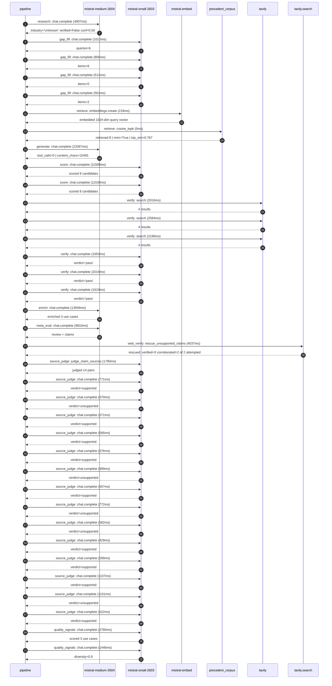

# Trace

## Execution trace — ZYX Corporation

Started: `2026-05-10T23:06:54.421698+00:00`. Total wall time: `105.1s` across `36` recorded actions.

### Per-step time totals

| Step | Calls | Total time | Avg time |
|---|---:|---:|---:|
| `research` | 1 | 4.91s | 4907ms |
| `gap_fill` | 4 | 2.89s | 723ms |
| `retrieve` | 2 | 0.22s | 112ms |
| `generate` | 1 | 22.07s | 22067ms |
| `score` | 2 | 23.12s | 11560ms |
| `verify` | 6 | 12.08s | 2014ms |
| `enrich` | 1 | 13.95s | 13946ms |
| `meta_eval` | 1 | 9.81s | 9810ms |
| `web_verify` | 1 | 4.04s | 4037ms |
| `source_judge` | 15 | 12.01s | 801ms |
| `quality_signals` | 2 | 4.23s | 2113ms |

### Chronological event log

- `23:07:08.383` **[research]** `mistral-medium-2604.chat.complete` — 4907ms
   - inputs: synthesize CompanyContext for ZYX Corporation | depth=medium
   - outputs: industry='Unknown' verified=False conf=0.50
- `23:07:13.292` **[gap_fill]** `mistral-small-2603.chat.complete` — 1012ms
   - inputs: generate gap queries | fields=['industry', 'geography', 'business_model', 'products', 'data_assets', 'priorities']
   - outputs: queries=6
- `23:07:21.530` **[gap_fill]** `mistral-small-2603.chat.complete` — 806ms
   - inputs: layer-2 extract field=priorities
   - outputs: items=6
- `23:07:21.536` **[gap_fill]** `mistral-small-2603.chat.complete` — 512ms
   - inputs: layer-2 extract field=data_assets
   - outputs: items=0
- `23:07:21.540` **[gap_fill]** `mistral-small-2603.chat.complete` — 561ms
   - inputs: layer-2 extract field=products
   - outputs: items=2
- `23:07:22.338` **[retrieve]** `mistral-embed.embeddings.create` — 218ms
   - inputs: company_query | industries='Unknown'
   - outputs: embedded 1024-dim query vector
- `23:07:22.556` **[retrieve]** `precedent_corpus.cosine_topk` — 5ms
   - inputs: k=8 min_depth=0.4 target='ZYX Corporation'
   - outputs: retrieved 8 | mmr=True | top_sim=0.767
- `23:07:24.341` **[generate]** `mistral-medium-2604.chat.complete` — 22067ms
   - inputs: iteration=0 tool_calls_used=0/0 tools=off
   - outputs: tool_calls=0 | content_chars=15455
- `23:07:46.818` **[score]** `mistral-small-2603.chat.complete` — 11589ms
   - inputs: self-consistency pass T=0.2
   - outputs: scored 8 candidates
- `23:07:46.820` **[score]** `mistral-small-2603.chat.complete` — 11530ms
   - inputs: self-consistency pass T=0.4
   - outputs: scored 8 candidates
- `23:07:58.431` **[verify]** `tavily.search` — 2016ms
   - inputs: candidate=fda-submission-accelerator | query='ZYX Corporation AI-Powered FDA 510(k) Submission Accelerator'
   - outputs: 4 results
- `23:07:58.431` **[verify]** `tavily.search` — 2584ms
   - inputs: candidate=payer-compliance-automation | query='ZYX Corporation Agentic Payer Compliance and Documentation A'
   - outputs: 4 results
- `23:07:58.431` **[verify]** `tavily.search` — 2196ms
   - inputs: candidate=cross-device-clinical-correlation | query='ZYX Corporation Cross-Device Clinical Data Correlation for H'
   - outputs: 4 results
- `23:08:01.125` **[verify]** `mistral-small-2603.chat.complete` — 1653ms
   - inputs: verdict for cross-device-clinical-correlation
   - outputs: verdict='pass'
- `23:08:01.129` **[verify]** `mistral-small-2603.chat.complete` — 2015ms
   - inputs: verdict for fda-submission-accelerator
   - outputs: verdict='pass'
- `23:08:01.382` **[verify]** `mistral-small-2603.chat.complete` — 1619ms
   - inputs: verdict for payer-compliance-automation
   - outputs: verdict='pass'
- `23:08:03.147` **[enrich]** `mistral-medium-2604.chat.complete` — 13946ms
   - inputs: tier=fast parallel=False ids=['fda-submission-accelerator', 'payer-compliance-automation', 'cross-device-clinical-correlation']
   - outputs: enriched 3 use cases
- `23:08:17.113` **[meta_eval]** `mistral-medium-2604.chat.complete` — 9810ms
   - inputs: reviewing 3 use cases
   - outputs: review + claims
- `23:08:26.943` **[web_verify]** `tavily.search.rescue_unsupported_claims` — 4037ms
   - inputs: company='ZYX Corporation' unsupported=2 budget=12
   - outputs: rescued: verified=0 corroborated=2 of 2 attempted
- `23:08:30.982` **[source_judge]** `mistral-small-2603.judge_claim_sources` — 1790ms
   - inputs: pairs=14
   - outputs: judged 14 pairs
- `23:08:30.982` **[source_judge]** `mistral-small-2603.chat.complete` — 771ms
   - inputs: claim='ZYX Corporation has explicit strategic priorities around FDA'
   - outputs: verdict=supported
- `23:08:30.985` **[source_judge]** `mistral-small-2603.chat.complete` — 670ms
   - inputs: claim='ZYX Corporation has a payer expansion priority'
   - outputs: verdict=unsupported
- `23:08:30.988` **[source_judge]** `mistral-small-2603.chat.complete` — 671ms
   - inputs: claim='ZYX Corporation has a patient monitoring business'
   - outputs: verdict=supported
- `23:08:30.993` **[source_judge]** `mistral-small-2603.chat.complete` — 666ms
   - inputs: claim='ZYX Corporation has a TensWave device'
   - outputs: verdict=supported
- `23:08:30.995` **[source_judge]** `mistral-small-2603.chat.complete` — 676ms
   - inputs: claim='ZYX Corporation has a pulse oximeter device'
   - outputs: verdict=supported
- `23:08:30.998` **[source_judge]** `mistral-small-2603.chat.complete` — 899ms
   - inputs: claim='Mistral’s EU-based sovereignty, open-weight models, and mult'
   - outputs: verdict=unsupported
- `23:08:31.001` **[source_judge]** `mistral-small-2603.chat.complete` — 657ms
   - inputs: claim='The FDA is deploying agentic AI capabilities to streamline c'
   - outputs: verdict=supported
- `23:08:31.004` **[source_judge]** `mistral-small-2603.chat.complete` — 772ms
   - inputs: claim='ZYX Corporation’s payer expansion priority and patient monit'
   - outputs: verdict=unsupported
- `23:08:31.655` **[source_judge]** `mistral-small-2603.chat.complete` — 582ms
   - inputs: claim='ZYX Corporation’s devices generate data that must meet payer'
   - outputs: verdict=unsupported
- `23:08:31.659` **[source_judge]** `mistral-small-2603.chat.complete` — 429ms
   - inputs: claim='The Synthpop Patient Journey Orchestration Agent turns unstr'
   - outputs: verdict=supported
- `23:08:31.661` **[source_judge]** `mistral-small-2603.chat.complete` — 599ms
   - inputs: claim='ZYX Corporation’s portfolio includes multiple patient monito'
   - outputs: verdict=supported
- `23:08:31.663` **[source_judge]** `mistral-small-2603.chat.complete` — 1107ms
   - inputs: claim='ZYX Corporation has a strategic focus on patient monitoring '
   - outputs: verdict=supported
- `23:08:31.671` **[source_judge]** `mistral-small-2603.chat.complete` — 1101ms
   - inputs: claim='Mistral’s open-weight models enable fine-tuning on ZYX’s pro'
   - outputs: verdict=unsupported
- `23:08:31.753` **[source_judge]** `mistral-small-2603.chat.complete` — 622ms
   - inputs: claim='Mistral’s on-prem deployment options address data sovereignt'
   - outputs: verdict=supported
- `23:08:35.313` **[quality_signals]** `mistral-small-2603.chat.complete` — 2780ms
   - inputs: specificity grade (3 use cases)
   - outputs: scored 3 use cases
- `23:08:38.093` **[quality_signals]** `mistral-small-2603.chat.complete` — 1446ms
   - inputs: diversity grade
   - outputs: diversity=0.9

## Mermaid sequence

