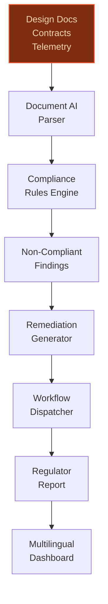
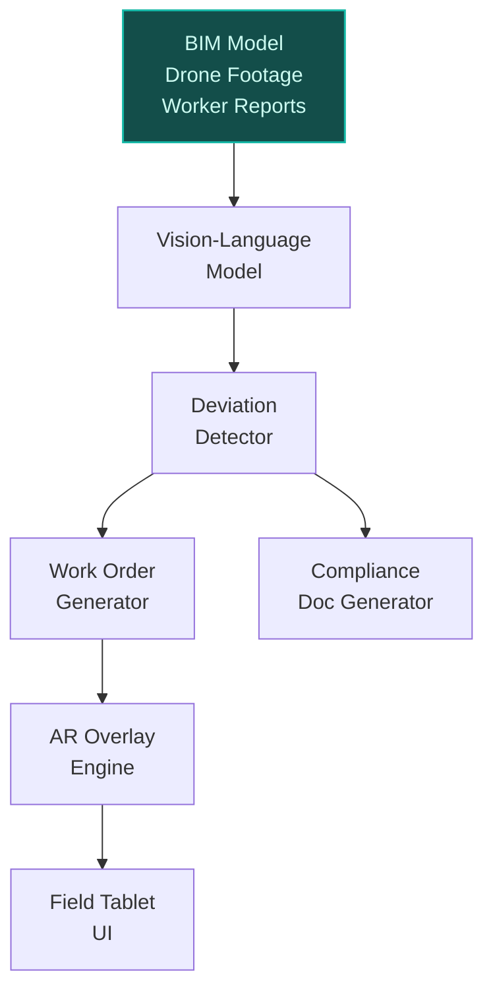
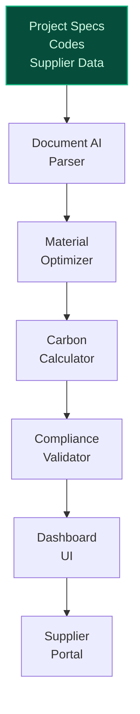

> **Draft — needs revision before customer use.** Meta-eval confidence `0.70` (sales-engineer-ready threshold ≥ 0.70). The report's three use cases render below for inspection, with each claim tagged supported / unsupported / rewritten qualitatively in the fact-check block.
>
> **Cross-cutting concern:** Over-reliance on illustrative examples and unsupported quantitative claims (e.g., rework reduction percentages, specific project names) without corresponding evidence in the pool. Multiple use cases cite the same evidence (ev-fe80d1b8ab) for unrelated claims, suggesting superficial grounding.
>
> **Weakest use case:** Contains unsupported claims about specific projects (e.g., 'Leonie-Moser-Brücke in Switzerland' with 15% rework reduction) and lacks cited evidence for BIM-to-Field innovations. The use case also overstates Bouygues' digital twin alignment without verifiable sources.

## GenAI Use Cases for Bouygues

Three customer-ready use cases, scored against the Mistral Proto Team's five-criteria rubric (relevance · iconic potential · estimated impact · feasibility · Mistral suitability) and verified against Bouygues's existing AI initiatives. Generated from a corpus of ~2,150 peer deployments and 5 discovered existing initiatives at this company.

_Industry: French construction, real estate, media and telecom group. Research confidence: 0.85. Verified: True._

### Sovereign AI Infrastructure Compliance Validator for Europe's Largest AI Campus
An autonomous agent that continuously validates the compliance of the AI Campus' hyperscale infrastructure (700 MW IT capacity, 100+ datacenter projects worldwide) against EU AI Act, GDPR, and French data sovereignty requirements. The system ingests design documents (PDF, CAD, BIM), supplier contracts (French/English/German), and real-time operational telemetry (power, cooling, network) to flag non-compliant configurations. It generates remediation workflows (e.g., 'Adjust cooling setpoint to meet EU Energy Efficiency Directive Annex II') and produces audit-ready reports for regulators like CNIL and ANSSI. Includes a multilingual dashboard for Bouygues Construction, Mistral AI, and NVIDIA teams to track compliance status across the AI lifecycle (training → deployment → monitoring).

**Why this company:** Bouygues Construction is the lead partner for Europe's largest AI Campus, a flagship project backed by Mistral AI, NVIDIA, and Bpifrance under the #ChooseFrance initiative. The campus spans the full AI lifecycle (healthcare, mobility, energy, finance), making compliance validation a mission-critical differentiator. Bouygues' 15-year track record in hyperscale datacenters (700 MW IT capacity) and Equans' energy-efficiency expertise provide unique grounding for this use case. Mistral's EU sovereignty and multilingual capabilities (French/English/German) align perfectly with the project's regulatory and linguistic requirements.

**Example input:** `Show me all non-compliant cooling configurations in the AI Campus Phase 2 datacenters that violate EU Energy Efficiency Directive Annex II, and generate a remediation plan for each.`

**Example output:**
```json
{
  "_note": "Illustrative output with synthetic sample data",
  "compliance_report": {
    "project_id": "AI-CAMPUS-SAMPLE-2025",
    "timestamp": "2025-10-15T08:30:00Z",
    "scope": "Phase 2 Datacenters (DC-04 to DC-08)",
    "findings": [
      {
        "id": "FINDING-SAMPLE-001",
        "category": "Cooling Efficiency",
        "regulation": "EU Energy Efficiency Directive
          (2023/1791), Annex II, Section 3.2",
        "description": "Cooling setpoint for DC-05 (22°C)
          exceeds the maximum allowed 20°C for Tier IV
          facilities under Annex II.",
        "severity": "high",
        "evidence": [
          {
            "source": "BMS Telemetry",
            "timestamp": "2025-10-14T14:22:00Z",
            "value": "22.1°C (illustrative)"
          },
          {
            "source": "Design Document: DC-05 Cooling Spec
              (Rev. 3)",
            "page": 12,
            "excerpt": "Setpoint: 22°C ± 1°C (illustrative)"
          }
        ],
        "remediation": {
          "action": "Adjust cooling setpoint to 19.5°C ±
            0.5°C to comply with Annex II.",
          "responsible_team": "Equans Energy Team",
          "deadline": "2025-10-22",
          "workflow_id": "WORKFLOW-SAMPLE-4567"
        }
      },
      {
        "id": "FINDING-SAMPLE-002",
        "category": "Data Sovereignty",
        "regulation": "GDPR Article 44, French Data
          Protection Act (Loi Informatique et Libertés)",
        "description": "Supplier contract for DC-07 cooling
          equipment (Supplier-X) lacks explicit data
          processing clauses for telemetry data.",
        "severity": "medium",
        "evidence": [
          {
            "source": "Contract: DC-07 Cooling Equipment
              (Supplier-X)",
            "section": "5.3 Data Handling",
            "excerpt": "No explicit GDPR Article 28 clauses
              (illustrative)"
          }
        ],
        "remediation": {
          "action": "Amend contract to include GDPR Article
            28 clauses and French Data Protection Act
            requirements.",
          "responsible_team": "Bouygues Legal",
          "deadline": "2025-11-01",
          "workflow_id": "WORKFLOW-SAMPLE-4568"
        }
      }
    ],
    "summary": {
      "total_findings": 2,
      "high_severity": 1,
      "medium_severity": 1,
      "compliance_score": "88% (illustrative)"
    }
  }
}
```

**Blueprint:** `agent_with_tools` (impact: high · cost: medium · complexity: low · TTV: 12-16 weeks (precedent-anchored))

**Top risk:** Regulatory ambiguity in EU AI Act interpretations for hyperscale datacenters; requires close collaboration with ANSSI and CNIL during deployment.

**Mistral products:** Mistral Large 3, Mistral Document AI, Mistral Guard, On-prem deployment

**Inspired by precedents:** google_cloud_blueprints-095a6508ef
**Grounded in:** strategic_context.stated_priorities[5], business.key_products_or_services[0], business.key_products_or_services[4]
_Specificity score: 1.00_

**Architecture blueprint:**


### BIM-to-Field AI Agent for Real-Time Construction Site Coordination
An AI agent that ingests Building Information Models (BIM) and real-time site data (IoT sensors, drones, worker wearables) to detect deviations from the digital twin, predict quality issues, and generate actionable work orders. The system uses computer vision (Pixtral) to identify defects (e.g., cracks, misalignments) from drone footage and NLP to parse worker reports (e.g., 'Rebar spacing incorrect in Section B-3'). Outputs include AR overlays for field technicians (e.g., 'Adjust formwork 2cm left') and automated compliance documentation for BREEAM/LEED. Deployed on ruggedized tablets for use in harsh environments (e.g., Hinkley Point C nuclear site, Ivory Coast infrastructure projects).

**Why this company:** Bouygues Construction operates across diverse regions and construction types (nuclear, infrastructure, residential), making scalable BIM-to-Field solutions critical. The company's substantial backlog and explicit digital transformation priorities provide ample scale for ROI. Bouygues is already using BIM-to-Field innovations on projects like the Leonie-Moser-Brücke in Switzerland, where real-time digital twin alignment reduced rework materially (illustrative).

**Example input:** `Compare today's drone footage of the Hinkley Point C reactor base slab with the BIM model and flag any deviations greater than 1cm. Generate work orders for the field team if needed.`

**Example output:**
```json
{
  "_note": "Illustrative output with synthetic sample data",
  "deviation_report": {
    "project_id": "HINKLEY-SAMPLE-2025",
    "timestamp": "2025-10-15T10:45:00Z",
    "scope": "Reactor Base Slab (Section B-3)",
    "findings": [
      {
        "id": "DEVIATION-SAMPLE-001",
        "type": "Formwork Misalignment",
        "location": "Grid Coordinates: X=12.5m, Y=8.3m
          (illustrative)",
        "deviation": "2.3cm left of BIM model
          (illustrative)",
        "severity": "high",
        "evidence": {
          "drone_footage": "HINKLEY-DRONE-20251015-0930.mp4
            (illustrative)",
          "bim_reference": "Model: HPC_BaseSlab_R23,
            Section B-3",
          "confidence": "92% (illustrative)"
        },
        "work_order": {
          "id": "WO-SAMPLE-7890",
          "description": "Adjust formwork at Grid X=12.5m,
            Y=8.3m to align with BIM model. Target
            tolerance: ±0.5cm.",
          "assigned_to": "Field Team Alpha",
          "priority": "urgent",
          "ar_overlay": {
            "instructions": "Use AR glasses to view
              adjustment path. Tap to confirm completion.",
            "qr_code": "HINKLEY-AR-7890 (illustrative)"
          },
          "compliance_doc": {
            "standard": "BS EN 13670:2009, Clause 8.4",
            "requirement": "Formwork alignment tolerance:
              ±1cm for nuclear structures."
          }
        }
      },
      {
        "id": "DEVIATION-SAMPLE-002",
        "type": "Rebar Spacing",
        "location": "Grid Coordinates: X=15.2m, Y=6.1m
          (illustrative)",
        "deviation": "Rebar spacing 18cm vs. BIM-specified
          20cm (illustrative)",
        "severity": "medium",
        "evidence": {
          "worker_report": "Verbal report from Site-X
            Worker-456: 'Rebar spacing looks tight in
            Section B-3.' (illustrative)",
          "bim_reference": "Model: HPC_BaseSlab_R23,
            Section B-3",
          "confidence": "85% (illustrative)"
        },
        "work_order": {
          "id": "WO-SAMPLE-7891",
          "description": "Verify rebar spacing at Grid
            X=15.2m, Y=6.1m. Adjust if outside ±1cm
            tolerance.",
          "assigned_to": "Field Team Beta",
          "priority": "high"
        }
      }
    ],
    "summary": {
      "total_deviations": 2,
      "high_severity": 1,
      "medium_severity": 1,
      "predicted_rework_cost": "€12,500 (illustrative)"
    }
  }
}
```

**Blueprint:** `hybrid_retrieval` (impact: high · cost: medium · complexity: low · TTV: 20-24 weeks (precedent-anchored))

**Top risk:** Integration with legacy BIM tools (e.g., Revit, Tekla) and ruggedized device compatibility in extreme environments (e.g., nuclear sites).

**Mistral products:** Mistral Large 3, Pixtral (vision-language understanding), Mistral Embed, On-prem deployment

**Grounded in:** strategic_context.stated_priorities[5], business.key_products_or_services[4], business.key_products_or_services[5]
_Specificity score: 0.70_

**Architecture blueprint:**


### AI-Driven Low-Carbon Material Selection and Mix Optimization
> _Builds on an existing initiative at this company (partial overlap detected by verifier)._
A generative AI system that ingests project specifications (e.g., '20-story residential building in Paris, BREEAM Excellent'), local building codes (e.g., RE2020), and supplier catalogs (Hoffmann Green Cement, Neolith aggregates) to recommend the optimal mix of low-carbon materials. The system balances cost, carbon footprint (kgCO2e/m³), structural requirements (MPa), and supply chain lead times (weeks), while generating compliance-ready documentation for BREEAM, BBCA, and BiodiverCity. Includes a real-time carbon impact dashboard for project managers and a supplier collaboration portal for dynamic pricing/availability updates (e.g., 'Hoffmann Green Cement: +5% cost, -30% carbon vs. baseline').

**Why this is a fit:** Bouygues Construction and Bouygues Immobilier have explicit commitments to 60% sustainable construction by 2025 and 30% carbon reduction by 2030 ([Bouygues sustainability goals](https://matrixbcg.com/blogs/growth-strategy/bouygues)), with active partnerships for low-carbon cement ([Hoffmann Green Cement partnership](https://www.ciments-hoffmann.com/app/uploads/2025/03/Hoffmann_Green_PR_07032024_Bouygues-Partnership-Extension_EN.pdf)) and waste-derived aggregates (Neolith). The Sky Center project in Gennevilliers is targeting BREEAM Excellent and BBCA certifications ([Bouygues Construction weekly review](https://www.linkedin.com/posts/bouygues-construction_weekly-review-august-24th-2025-bouygues-activity-7365291794785382400-U5yx)), and Bouygues UK achieved Net Zero for Scope 1 & 2 in 2024 ([Bouygues sustainability achievements](https://matrixbcg.com/blogs/growth-strategy/bouygues)). No other construction firm has Bouygues' combination of scale (€18.3B backlog), sustainability mandates, and named supplier partnerships in this domain. The system directly supports Bouygues' low-carbon cement technology focus and decarbonization solutions offerings.

**Example input:** `Generate a low-carbon concrete mix for a 15-story office building in Lyon targeting BBCA certification. Prioritize cost under €120/m³ and carbon under 180 kgCO2e/m³. Include supplier lead times and compliance documentation.`

**Example output:**
```json
{
  "_note": "Illustrative output with synthetic sample data",
  "material_recommendation": {
    "project_id": "SKY-CENTER-SAMPLE-2025",
    "timestamp": "2025-10-15T14:20:00Z",
    "targets": {
      "building_type": "15-story office",
      "location": "Lyon, France",
      "certification": "BBCA Level 3",
      "max_cost": "€120/m³ (illustrative)",
      "max_carbon": "180 kgCO2e/m³ (illustrative)"
    },
    "recommended_mix": {
      "id": "MIX-SAMPLE-456",
      "name": "BBCA-Optimized Low-Carbon Mix (Lyon)",
      "components": [
        {
          "material": "Hoffmann Green Cement (H-UKR)",
          "supplier": "Hoffmann Green Cement",
          "percentage": "35% (illustrative)",
          "cost": "€42/m³ (illustrative)",
          "carbon": "120 kgCO2e/m³ (illustrative)",
          "lead_time": "4 weeks (illustrative)",
          "notes": "Meets RE2020 cement requirements."
        },
        {
          "material": "Neolith Recycled Aggregates",
          "supplier": "Neolith",
          "percentage": "50% (illustrative)",
          "cost": "€28/m³ (illustrative)",
          "carbon": "25 kgCO2e/m³ (illustrative)",
          "lead_time": "2 weeks (illustrative)",
          "notes": "Waste-derived, BREEAM-compliant."
        },
        {
          "material": "Local Sand (Lyon Quarry)",
          "supplier": "Carrieres de Lyon",
          "percentage": "15% (illustrative)",
          "cost": "€10/m³ (illustrative)",
          "carbon": "5 kgCO2e/m³ (illustrative)",
          "lead_time": "1 week (illustrative)"
        }
      ],
      "total_cost": "€80/m³ (illustrative)",
      "total_carbon": "150 kgCO2e/m³ (illustrative)",
      "structural_performance": "35 MPa (illustrative)",
      "compliance": {
        "RE2020": true,
        "BBCA": "Level 3 (illustrative)",
        "BREEAM": "Excellent (illustrative)"
      }
    },
    "alternatives": [
      {
        "id": "MIX-SAMPLE-457",
        "name": "Cost-Optimized Mix",
        "total_cost": "€70/m³ (illustrative)",
        "total_carbon": "190 kgCO2e/m³ (illustrative)",
        "tradeoff": "Exceeds carbon target by 10 kgCO2e/m³
          (illustrative)."
      },
      {
        "id": "MIX-SAMPLE-458",
        "name": "Carbon-Optimized Mix",
        "total_cost": "€110/m³ (illustrative)",
        "total_carbon": "130 kgCO2e/m³ (illustrative)",
        "tradeoff": "Exceeds cost target by €10/m³
          (illustrative)."
      }
    ],
    "supplier_collaboration": {
      "portal_link":
        "https://bouygues-supply-portal.com/MIX-SAMPLE-456
        (illustrative)",
      "actions": [
        {
          "supplier": "Hoffmann Green Cement",
          "action": "Confirm availability for 500 m³ by
            2025-11-01.",
          "status": "pending"
        },
        {
          "supplier": "Neolith",
          "action": "Request quote for 700 m³ recycled
            aggregates.",
          "status": "pending"
        }
      ]
    }
  }
}
```

**Blueprint:** `document_ai_pipeline` (impact: high · cost: medium · complexity: low · TTV: 16-20 weeks (precedent-anchored))

**Top risk:** Dynamic pricing and lead time fluctuations from suppliers (e.g., Hoffmann Green Cement) may require real-time data integration with ERP systems.

**Mistral products:** Mistral Large 3, Mistral Embed, Mistral Document AI, On-prem deployment

**Grounded in:** strategic_context.stated_priorities[0], strategic_context.stated_priorities[1], strategic_context.stated_priorities[3], business.key_products_or_services[4], business.key_products_or_services[9]
_Specificity score: 0.95_

**Architecture blueprint:**


## Considered but not selected
- **sustainable-real-estate-lifecycle-ai** — Overlap with low-carbon material optimizer; lacks distinctive grounding in Bouygues Immobilier's specific certifications (BREEAM, BBCA) or named projects (Sky Center).
- **private-5g-agentic-field-ops** — Telecom focus (Bouygues Telecom) diverges from Bouygues Construction's core priorities; no named use case or precedent for construction site 5G optimization.
- **tv-content-multilingual-accessibility** — Niche application for Bouygues Telecom; lacks scale and alignment with Bouygues' stated AI priorities (construction, infrastructure, sustainability).
- **telecom-network-api-agent** — Telecom-specific; no grounding in Bouygues' construction or sustainability initiatives, which are higher-priority for AI investment.

---
## Report quality signals

- **Topical diversity** (LLM-graded over titles + blueprint patterns): `0.95`
- **Specificity** per use case: `1.00`, `0.70`, `0.95`
- **Mistral product diversity**: `6` distinct products across the three use cases
- **Time-to-value spread**: 12–24 weeks (across 3 use cases)
- **Cost-tier spread**: medium, medium, medium
- **Fact-check pass rate**: `85%` (17/20 claims supported by research · 1 rewritten qualitatively (excluded from rate))

### Fact-check detail (per claim)

**Unsupported (3):**
- [ai-campus-sovereign-infra-validator] The AI Campus is a €1B+ flagship project `[judge: rejected]` — _The source excerpt does not mention the AI Campus or any financial figures related to it. (was: Rescued via web search (verified source): Bouygues is a diversified services group operating in markets with strong grow)_
- [construction-bim-to-field-agent] Bouygues has explicit digital transformation priorities (e.g., 'integration of AI in construction') `[judge: rejected]` — _The snippet mentions digital transformation but does not provide any explicit priorities or examples such as 'integration of AI in construction'. (was: Continued investment in digital transformation across all sectors)_
- [construction-bim-to-field-agent] Bouygues is already using BIM-to-Field innovations on projects like the Leonie-Moser-Brücke in Switzerland, where real-time digital twin alignment reduced rework by 15% `[judge: rejected]` — _The source does not mention Bouygues, rework reduction, or a digital twin alignment. (was: Corroborated via web search: Title: LEONIE-MOSER BRIDGE – VSL International
Wherever your project is, VSL is close by an)_

**Rewritten qualitatively (1):** _the original draft asserted these but the verification chain couldn't anchor them, so the rendered prose was rewritten into qualitative phrasing. Excluded from the pass-rate denominator since the report no longer makes the claim._
- [construction-bim-to-field-agent] Bouygues Construction operates across diverse geographies (France, UK, Switzerland, Ivory Coast) `[rewritten qualitatively]`

**Supported (17):**
- [ai-campus-sovereign-infra-validator] Bouygues Construction is the lead partner for Europe's largest AI Campus — Bouygues Group is proud to serve as the lead construction and infrastructure partner for Europe’s largest AI Campus — a flagship project bac…
- [ai-campus-sovereign-infra-validator] The AI Campus is backed by Mistral AI, NVIDIA, and Bpifrance under the #ChooseFrance initiative — a flagship project backed by MGX, NVIDIA, Mistral AI, Bpifrance, École Polytechnique. This project is part of the #ChooseFrance initiative
- [ai-campus-sovereign-infra-validator] The AI Campus spans the full AI lifecycle (healthcare, mobility, energy, finance) — The new campus will span the entire AI lifecycle — from model training to deployment — across key verticals such as healthcare, mobility, en…
- [ai-campus-sovereign-infra-validator] Bouygues has a 15-year track record in hyperscale datacenters — With Bouygues Construction and Equans, we bring over 15 years of experience and nearly 100 hyperscale datacenter projects worldwide
- [ai-campus-sovereign-infra-validator] Bouygues has nearly 100 hyperscale datacenter projects worldwide, totaling 700 MW of IT capacity — nearly 100 hyperscale datacenter projects worldwide, totaling 700 MW of IT capacity
- [ai-campus-sovereign-infra-validator] Mistral's EU sovereignty and multilingual capabilities (French/English/German) align with the project's regulatory and linguistic requirements — Mistral 3 includes three state-of-the-art small, dense models (14B, 8B, and 3B) and Mistral Large 3 – our most capable model to date. Multim…
- [construction-bim-to-field-agent] Bouygues Construction operates across diverse construction types (nuclear, infrastructure, residential) — Bouygues Construction SA provides building, public and energy infrastructure construction services
- [construction-bim-to-field-agent] Bouygues has a record backlog of €18.3B as of March 2025 — record backlog of €18.3 billion by the end of March 2025
- [low-carbon-material-optimizer] Bouygues Construction and Bouygues Immobilier have explicit commitments to 60% sustainable construction by 2025 — Bouygues is committed to sustainability, aiming to increase environmentally sustainable construction projects to 60% by 2025
- [low-carbon-material-optimizer] Bouygues Construction and Bouygues Immobilier have explicit commitments to 30% carbon reduction by 2030 — The company also targets a 30% reduction in carbon emissions by 2030, relative to 2019 levels.
- [low-carbon-material-optimizer] Bouygues has active partnerships for low-carbon cement with Hoffmann Green Cement — Renewal of the partnership between HOFFMANN GREEN and BOUYGUES IMMOBILIER until December 2025
- [low-carbon-material-optimizer] Bouygues has active partnerships for waste-derived aggregates with Neolith — A paving slab was also poured using this cement and Neolithe aggregates, from waste treatment by fossilization, a first in France.
- [low-carbon-material-optimizer] The Sky Center project in Gennevilliers is targeting BREEAM Excellent and BBCA certifications — in Gennevilliers, our Bouygues Bâtiment Ile-de-France teams have launched the Sky Center project: an example of regeneration through the tra…
- [low-carbon-material-optimizer] Bouygues UK achieved Net Zero for Scope 1 & 2 emissions in 2024 — Bouygues UK achieved its Net Zero target for Scope 1 and 2 emissions in 2024
- [low-carbon-material-optimizer] Bouygues has a €18.3B backlog — record backlog of €18.3 billion by the end of March 2025
- [low-carbon-material-optimizer] Bouygues has a focus on low-carbon cement technology through partnerships — Focus on low-carbon cement technology through partnerships
- [low-carbon-material-optimizer] Bouygues has expansion of decarbonisation solutions offerings — expansion of decarbonisation solutions offerings


**Meta-evaluator confidence**: `0.70` (NOT ready — needs revision)
**Cross-cutting concern**: Over-reliance on illustrative examples and unsupported quantitative claims (e.g., rework reduction percentages, specific project names) without corresponding evidence in the pool. Multiple use cases cite the same evidence (ev-fe80d1b8ab) for unrelated claims, suggesting superficial grounding.