# Trace

## Execution trace — Bouygues

Started: `2026-05-11T00:50:36.402525+00:00`. Total wall time: `248.3s` across `50` recorded actions.

### Per-step time totals

| Step | Calls | Total time | Avg time |
|---|---:|---:|---:|
| `research` | 1 | 8.01s | 8007ms |
| `gap_fill` | 4 | 4.76s | 1189ms |
| `retrieve` | 2 | 0.18s | 91ms |
| `generate` | 2 | 27.58s | 13791ms |
| `generate.web_search` | 2 | 9.66s | 4832ms |
| `score` | 2 | 28.07s | 14036ms |
| `verify` | 6 | 17.52s | 2921ms |
| `enrich` | 1 | 117.60s | 117596ms |
| `polish` | 2 | 6.26s | 3128ms |
| `meta_eval` | 1 | 12.94s | 12943ms |
| `web_verify` | 1 | 3.55s | 3553ms |
| `source_judge` | 22 | 59.12s | 2687ms |
| `final_qualify` | 2 | 3.50s | 1751ms |
| `quality_signals` | 2 | 4.35s | 2173ms |

### Chronological event log

- `00:50:39.093` **[research]** `mistral-medium-2604.chat.complete` — 8007ms
   - inputs: synthesize CompanyContext for Bouygues | depth=medium
   - outputs: industry='French construction, real estate, media and telecom group' verified=True conf=0.75
- `00:50:47.103` **[gap_fill]** `mistral-small-2603.chat.complete` — 976ms
   - inputs: generate gap queries | fields=['business_model', 'products', 'data_assets', 'priorities']
   - outputs: queries=4
- `00:50:54.893` **[gap_fill]** `mistral-small-2603.chat.complete` — 1612ms
   - inputs: layer-2 extract field=priorities
   - outputs: items=13
- `00:50:54.897` **[gap_fill]** `mistral-small-2603.chat.complete` — 455ms
   - inputs: layer-2 extract field=data_assets
   - outputs: items=0
- `00:50:54.901` **[gap_fill]** `mistral-small-2603.chat.complete` — 1712ms
   - inputs: layer-2 extract field=products
   - outputs: items=20
- `00:50:56.615` **[retrieve]** `mistral-embed.embeddings.create` — 177ms
   - inputs: company_query | industries='French construction, real estate, media and telecom group'
   - outputs: embedded 1024-dim query vector
- `00:50:56.792` **[retrieve]** `precedent_corpus.cosine_topk` — 5ms
   - inputs: k=8 min_depth=0.4 target='Bouygues'
   - outputs: retrieved 8 | mmr=True | top_sim=0.750
- `00:50:58.616` **[generate]** `mistral-medium-2604.chat.complete` — 1939ms
   - inputs: iteration=0 tool_calls_used=0/2 tools=on
   - outputs: tool_calls=4 | content_chars=0
- `00:51:00.573` **[generate.web_search]** `tavily.search` — 6535ms
   - inputs: query='Bouygues Construction low-carbon cement partnerships 2024 2025'
   - outputs: 2 raw results
- `00:51:07.949` **[generate.web_search]** `tavily.search` — 3128ms
   - inputs: query='Bouygues Telecom 5G private network enterprise use cases 2024 2025'
   - outputs: 2 raw results
- `00:51:12.365` **[generate]** `mistral-medium-2604.chat.complete` — 25644ms
   - inputs: iteration=1 tool_calls_used=2/2 tools=off
   - outputs: tool_calls=0 | content_chars=17493
- `00:51:38.353` **[score]** `mistral-small-2603.chat.complete` — 13616ms
   - inputs: self-consistency pass T=0.2
   - outputs: scored 8 candidates
- `00:51:38.357` **[score]** `mistral-small-2603.chat.complete` — 14455ms
   - inputs: self-consistency pass T=0.4
   - outputs: scored 8 candidates
- `00:51:52.852` **[verify]** `tavily.search` — 2319ms
   - inputs: candidate=ai-campus-sovereign-infra-validator | query='Bouygues Sovereign AI infrastructure compliance validator fo'
   - outputs: 4 results
- `00:51:52.853` **[verify]** `tavily.search` — 3527ms
   - inputs: candidate=construction-bim-to-field-agent | query='Bouygues BIM-to-Field AI agent for real-time construction si'
   - outputs: 4 results
- `00:51:52.853` **[verify]** `tavily.search` — 2173ms
   - inputs: candidate=low-carbon-material-optimizer | query='Bouygues AI-driven low-carbon material selection and mix opt'
   - outputs: 4 results
- `00:51:55.172` **[verify]** `mistral-small-2603.chat.complete` — 3797ms
   - inputs: verdict for low-carbon-material-optimizer
   - outputs: verdict='partial_overlap'
- `00:51:56.100` **[verify]** `mistral-small-2603.chat.complete` — 4053ms
   - inputs: verdict for ai-campus-sovereign-infra-validator
   - outputs: verdict='pass'
- `00:51:56.895` **[verify]** `mistral-small-2603.chat.complete` — 1654ms
   - inputs: verdict for construction-bim-to-field-agent
   - outputs: verdict='pass'
- `00:52:00.158` **[enrich]** `mistral-large-2512.chat.complete` — 117596ms
   - inputs: tier=standard parallel=False ids=['ai-campus-sovereign-infra-validator', 'construction-bim-to-field-agent', 'low-carbon-material-optimizer']
   - outputs: enriched 3 use cases
- `00:53:57.782` **[polish]** `mistral-medium-2604.chat.complete` — 2582ms
   - inputs: use_case=construction-bim-to-field-agent unanchored=True opaque_ev=False
   - outputs: polished 5 fields
- `00:53:57.788` **[polish]** `mistral-medium-2604.chat.complete` — 3674ms
   - inputs: use_case=low-carbon-material-optimizer unanchored=True opaque_ev=False
   - outputs: polished 5 fields
- `00:54:01.464` **[meta_eval]** `mistral-medium-2604.chat.complete` — 12943ms
   - inputs: reviewing 3 use cases
   - outputs: review + claims
- `00:54:14.432` **[web_verify]** `tavily.search.rescue_unsupported_claims` — 3553ms
   - inputs: company='Bouygues' unsupported=2 budget=12
   - outputs: rescued: verified=1 corroborated=1 of 2 attempted
- `00:54:17.988` **[source_judge]** `mistral-small-2603.judge_claim_sources` — 20131ms
   - inputs: pairs=21
   - outputs: judged 21 pairs
- `00:54:17.989` **[source_judge]** `mistral-small-2603.chat.complete` — 749ms
   - inputs: claim="Bouygues Construction is the lead partner for Europe's large"
   - outputs: verdict=supported
- `00:54:17.994` **[source_judge]** `mistral-small-2603.chat.complete` — 558ms
   - inputs: claim='The AI Campus is a €1B+ flagship project'
   - outputs: verdict=unsupported
- `00:54:17.998` **[source_judge]** `mistral-small-2603.chat.complete` — 661ms
   - inputs: claim='The AI Campus is backed by Mistral AI, NVIDIA, and Bpifrance'
   - outputs: verdict=supported
- `00:54:18.002` **[source_judge]** `mistral-small-2603.chat.complete` ❌ — 20118ms
   - inputs: claim='The AI Campus spans the full AI lifecycle (healthcare, mobil'
   - error: `ReadTimeout`
- `00:54:18.005` **[source_judge]** `mistral-small-2603.chat.complete` — 1352ms
   - inputs: claim='Bouygues has a 15-year track record in hyperscale datacenter'
   - outputs: verdict=supported
- `00:54:18.011` **[source_judge]** `mistral-small-2603.chat.complete` — 658ms
   - inputs: claim='Bouygues has nearly 100 hyperscale datacenter projects world'
   - outputs: verdict=supported
- `00:54:18.014` **[source_judge]** `mistral-small-2603.chat.complete` — 1172ms
   - inputs: claim="Mistral's EU sovereignty and multilingual capabilities (Fren"
   - outputs: verdict=supported
- `00:54:18.017` **[source_judge]** `mistral-small-2603.chat.complete` — 1188ms
   - inputs: claim='Bouygues Construction operates across diverse geographies (F'
   - outputs: verdict=unsupported
- `00:54:18.552` **[source_judge]** `mistral-small-2603.chat.complete` — 970ms
   - inputs: claim='Bouygues Construction operates across diverse construction t'
   - outputs: verdict=supported
- `00:54:18.659` **[source_judge]** `mistral-small-2603.chat.complete` — 467ms
   - inputs: claim='Bouygues has a record backlog of €18.3B as of March 2025'
   - outputs: verdict=supported
- `00:54:18.669` **[source_judge]** `mistral-small-2603.chat.complete` — 550ms
   - inputs: claim='Bouygues has explicit digital transformation priorities (e.g'
   - outputs: verdict=unsupported
- `00:54:18.737` **[source_judge]** `mistral-small-2603.chat.complete` — 524ms
   - inputs: claim='Bouygues is already using BIM-to-Field innovations on projec'
   - outputs: verdict=unsupported
- `00:54:19.126` **[source_judge]** `mistral-small-2603.chat.complete` — 544ms
   - inputs: claim='Bouygues Construction and Bouygues Immobilier have explicit '
   - outputs: verdict=supported
- `00:54:19.187` **[source_judge]** `mistral-small-2603.chat.complete` — 524ms
   - inputs: claim='Bouygues Construction and Bouygues Immobilier have explicit '
   - outputs: verdict=supported
- `00:54:19.205` **[source_judge]** `mistral-small-2603.chat.complete` — 567ms
   - inputs: claim='Bouygues has active partnerships for low-carbon cement with '
   - outputs: verdict=supported
- `00:54:19.219` **[source_judge]** `mistral-small-2603.chat.complete` — 816ms
   - inputs: claim='Bouygues has active partnerships for waste-derived aggregate'
   - outputs: verdict=supported
- `00:54:19.261` **[source_judge]** `mistral-small-2603.chat.complete` — 608ms
   - inputs: claim='The Sky Center project in Gennevilliers is targeting BREEAM '
   - outputs: verdict=supported
- `00:54:19.356` **[source_judge]** `mistral-small-2603.chat.complete` — 5587ms
   - inputs: claim='Bouygues UK achieved Net Zero for Scope 1 & 2 emissions in 2'
   - outputs: verdict=supported
- `00:54:19.521` **[source_judge]** `mistral-small-2603.chat.complete` — 513ms
   - inputs: claim='Bouygues has a €18.3B backlog'
   - outputs: verdict=supported
- `00:54:19.670` **[source_judge]** `mistral-small-2603.chat.complete` — 416ms
   - inputs: claim='Bouygues has a focus on low-carbon cement technology through'
   - outputs: verdict=supported
- `00:54:19.710` **[source_judge]** `mistral-small-2603.chat.complete` — 448ms
   - inputs: claim='Bouygues has expansion of decarbonisation solutions offering'
   - outputs: verdict=supported
- `00:54:38.122` **[final_qualify]** `mistral-small-2603.chat.complete` — 1845ms
   - inputs: use_case=ai-campus-sovereign-infra-validator unsupported=1
   - outputs: qualified 4 fields
- `00:54:38.127` **[final_qualify]** `mistral-small-2603.chat.complete` — 1656ms
   - inputs: use_case=construction-bim-to-field-agent unsupported=1
   - outputs: qualified 4 fields
- `00:54:40.344` **[quality_signals]** `mistral-small-2603.chat.complete` — 3006ms
   - inputs: specificity grade (3 use cases)
   - outputs: scored 3 use cases
- `00:54:43.350` **[quality_signals]** `mistral-small-2603.chat.complete` — 1340ms
   - inputs: diversity grade
   - outputs: diversity=0.95

## Mermaid sequence

```mermaid
sequenceDiagram
    autonumber
    participant pipeline as pipeline
    participant mistral_medium_2604 as mistral-medium-2604
    participant mistral_small_2603 as mistral-small-2603
    participant mistral_embed as mistral-embed
    participant precedent_corpus as precedent_corpus
    participant tavily as tavily
    participant mistral_large_2512 as mistral-large-2512
    participant tavily_search as tavily.search
    pipeline->>mistral_medium_2604: research: chat.complete (8007ms)
    mistral_medium_2604-->>pipeline: industry='French construction, real estate, media and teleco
    pipeline->>mistral_small_2603: gap_fill: chat.complete (976ms)
    mistral_small_2603-->>pipeline: queries=4
    pipeline->>mistral_small_2603: gap_fill: chat.complete (1612ms)
    mistral_small_2603-->>pipeline: items=13
    pipeline->>mistral_small_2603: gap_fill: chat.complete (455ms)
    mistral_small_2603-->>pipeline: items=0
    pipeline->>mistral_small_2603: gap_fill: chat.complete (1712ms)
    mistral_small_2603-->>pipeline: items=20
    pipeline->>mistral_embed: retrieve: embeddings.create (177ms)
    mistral_embed-->>pipeline: embedded 1024-dim query vector
    pipeline->>precedent_corpus: retrieve: cosine_topk (5ms)
    precedent_corpus-->>pipeline: retrieved 8 | mmr=True | top_sim=0.750
    pipeline->>mistral_medium_2604: generate: chat.complete (1939ms)
    mistral_medium_2604-->>pipeline: tool_calls=4 | content_chars=0
    pipeline->>tavily: generate.web_search: search (6535ms)
    tavily-->>pipeline: 2 raw results
    pipeline->>tavily: generate.web_search: search (3128ms)
    tavily-->>pipeline: 2 raw results
    pipeline->>mistral_medium_2604: generate: chat.complete (25644ms)
    mistral_medium_2604-->>pipeline: tool_calls=0 | content_chars=17493
    pipeline->>mistral_small_2603: score: chat.complete (13616ms)
    mistral_small_2603-->>pipeline: scored 8 candidates
    pipeline->>mistral_small_2603: score: chat.complete (14455ms)
    mistral_small_2603-->>pipeline: scored 8 candidates
    pipeline->>tavily: verify: search (2319ms)
    tavily-->>pipeline: 4 results
    pipeline->>tavily: verify: search (3527ms)
    tavily-->>pipeline: 4 results
    pipeline->>tavily: verify: search (2173ms)
    tavily-->>pipeline: 4 results
    pipeline->>mistral_small_2603: verify: chat.complete (3797ms)
    mistral_small_2603-->>pipeline: verdict='partial_overlap'
    pipeline->>mistral_small_2603: verify: chat.complete (4053ms)
    mistral_small_2603-->>pipeline: verdict='pass'
    pipeline->>mistral_small_2603: verify: chat.complete (1654ms)
    mistral_small_2603-->>pipeline: verdict='pass'
    pipeline->>mistral_large_2512: enrich: chat.complete (117596ms)
    mistral_large_2512-->>pipeline: enriched 3 use cases
    pipeline->>mistral_medium_2604: polish: chat.complete (2582ms)
    mistral_medium_2604-->>pipeline: polished 5 fields
    pipeline->>mistral_medium_2604: polish: chat.complete (3674ms)
    mistral_medium_2604-->>pipeline: polished 5 fields
    pipeline->>mistral_medium_2604: meta_eval: chat.complete (12943ms)
    mistral_medium_2604-->>pipeline: review + claims
    pipeline->>tavily_search: web_verify: rescue_unsupported_claims (3553ms)
    tavily_search-->>pipeline: rescued: verified=1 corroborated=1 of 2 attempted
    pipeline->>mistral_small_2603: source_judge: judge_claim_sources (20131ms)
    mistral_small_2603-->>pipeline: judged 21 pairs
    pipeline->>mistral_small_2603: source_judge: chat.complete (749ms)
    mistral_small_2603-->>pipeline: verdict=supported
    pipeline->>mistral_small_2603: source_judge: chat.complete (558ms)
    mistral_small_2603-->>pipeline: verdict=unsupported
    pipeline->>mistral_small_2603: source_judge: chat.complete (661ms)
    mistral_small_2603-->>pipeline: verdict=supported
    pipeline->>mistral_small_2603: source_judge: chat.complete (20118ms) ERR
    pipeline->>mistral_small_2603: source_judge: chat.complete (1352ms)
    mistral_small_2603-->>pipeline: verdict=supported
    pipeline->>mistral_small_2603: source_judge: chat.complete (658ms)
    mistral_small_2603-->>pipeline: verdict=supported
    pipeline->>mistral_small_2603: source_judge: chat.complete (1172ms)
    mistral_small_2603-->>pipeline: verdict=supported
    pipeline->>mistral_small_2603: source_judge: chat.complete (1188ms)
    mistral_small_2603-->>pipeline: verdict=unsupported
    pipeline->>mistral_small_2603: source_judge: chat.complete (970ms)
    mistral_small_2603-->>pipeline: verdict=supported
    pipeline->>mistral_small_2603: source_judge: chat.complete (467ms)
    mistral_small_2603-->>pipeline: verdict=supported
    pipeline->>mistral_small_2603: source_judge: chat.complete (550ms)
    mistral_small_2603-->>pipeline: verdict=unsupported
    pipeline->>mistral_small_2603: source_judge: chat.complete (524ms)
    mistral_small_2603-->>pipeline: verdict=unsupported
    pipeline->>mistral_small_2603: source_judge: chat.complete (544ms)
    mistral_small_2603-->>pipeline: verdict=supported
    pipeline->>mistral_small_2603: source_judge: chat.complete (524ms)
    mistral_small_2603-->>pipeline: verdict=supported
    pipeline->>mistral_small_2603: source_judge: chat.complete (567ms)
    mistral_small_2603-->>pipeline: verdict=supported
    pipeline->>mistral_small_2603: source_judge: chat.complete (816ms)
    mistral_small_2603-->>pipeline: verdict=supported
    pipeline->>mistral_small_2603: source_judge: chat.complete (608ms)
    mistral_small_2603-->>pipeline: verdict=supported
    pipeline->>mistral_small_2603: source_judge: chat.complete (5587ms)
    mistral_small_2603-->>pipeline: verdict=supported
    pipeline->>mistral_small_2603: source_judge: chat.complete (513ms)
    mistral_small_2603-->>pipeline: verdict=supported
    pipeline->>mistral_small_2603: source_judge: chat.complete (416ms)
    mistral_small_2603-->>pipeline: verdict=supported
    pipeline->>mistral_small_2603: source_judge: chat.complete (448ms)
    mistral_small_2603-->>pipeline: verdict=supported
    pipeline->>mistral_small_2603: final_qualify: chat.complete (1845ms)
    mistral_small_2603-->>pipeline: qualified 4 fields
    pipeline->>mistral_small_2603: final_qualify: chat.complete (1656ms)
    mistral_small_2603-->>pipeline: qualified 4 fields
    pipeline->>mistral_small_2603: quality_signals: chat.complete (3006ms)
    mistral_small_2603-->>pipeline: scored 3 use cases
    pipeline->>mistral_small_2603: quality_signals: chat.complete (1340ms)
    mistral_small_2603-->>pipeline: diversity=0.95
```

