# Trace

## Execution trace — Hermes

Started: `2026-05-11T00:47:10.744018+00:00`. Total wall time: `205.7s` across `41` recorded actions.

### Per-step time totals

| Step | Calls | Total time | Avg time |
|---|---:|---:|---:|
| `research` | 1 | 8.22s | 8219ms |
| `gap_fill` | 4 | 4.29s | 1073ms |
| `retrieve` | 2 | 0.20s | 98ms |
| `generate` | 2 | 23.22s | 11609ms |
| `generate.web_search` | 2 | 8.26s | 4132ms |
| `score` | 2 | 23.61s | 11805ms |
| `verify` | 6 | 14.63s | 2438ms |
| `enrich` | 1 | 92.01s | 92006ms |
| `polish` | 2 | 6.28s | 3141ms |
| `meta_eval` | 1 | 12.30s | 12298ms |
| `web_verify` | 1 | 9.62s | 9625ms |
| `source_judge` | 15 | 10.08s | 672ms |
| `quality_signals` | 2 | 4.10s | 2052ms |

### Chronological event log

- `00:47:13.264` **[research]** `mistral-medium-2604.chat.complete` — 8219ms
   - inputs: synthesize CompanyContext for Hermes | depth=medium
   - outputs: industry='Unknown' verified=True conf=0.75
- `00:47:21.486` **[gap_fill]** `mistral-small-2603.chat.complete` — 1225ms
   - inputs: generate gap queries | fields=['industry', 'geography', 'business_model', 'products', 'data_assets', 'priorities']
   - outputs: queries=6
- `00:47:33.411` **[gap_fill]** `mistral-small-2603.chat.complete` — 722ms
   - inputs: layer-2 extract field=priorities
   - outputs: items=6
- `00:47:33.416` **[gap_fill]** `mistral-small-2603.chat.complete` — 453ms
   - inputs: layer-2 extract field=data_assets
   - outputs: items=0
- `00:47:33.420` **[gap_fill]** `mistral-small-2603.chat.complete` — 1890ms
   - inputs: layer-2 extract field=products
   - outputs: items=14
- `00:47:35.314` **[retrieve]** `mistral-embed.embeddings.create` — 183ms
   - inputs: company_query | industries='Unknown'
   - outputs: embedded 1024-dim query vector
- `00:47:35.496` **[retrieve]** `precedent_corpus.cosine_topk` — 13ms
   - inputs: k=8 min_depth=0.4 target='Hermes'
   - outputs: retrieved 8 | mmr=True | top_sim=0.762
- `00:47:37.316` **[generate]** `mistral-medium-2604.chat.complete` — 1810ms
   - inputs: iteration=0 tool_calls_used=0/2 tools=on
   - outputs: tool_calls=3 | content_chars=0
- `00:47:39.146` **[generate.web_search]** `tavily.search` — 4732ms
   - inputs: query='Hermès luxury brand AI governance committee 2025'
   - outputs: 2 raw results
- `00:47:45.381` **[generate.web_search]** `tavily.search` — 3533ms
   - inputs: query='Hermès sustainability 100% renewable electricity 2025 operations'
   - outputs: 2 raw results
- `00:47:49.530` **[generate]** `mistral-medium-2604.chat.complete` — 21409ms
   - inputs: iteration=1 tool_calls_used=2/2 tools=off
   - outputs: tool_calls=0 | content_chars=14886
- `00:48:11.243` **[score]** `mistral-small-2603.chat.complete` — 11130ms
   - inputs: self-consistency pass T=0.2
   - outputs: scored 8 candidates
- `00:48:11.256` **[score]** `mistral-small-2603.chat.complete` — 12480ms
   - inputs: self-consistency pass T=0.4
   - outputs: scored 8 candidates
- `00:48:23.771` **[verify]** `tavily.search` — 2356ms
   - inputs: candidate=hermes_artisan_knowledge_preservation | query='Hermes Multilingual artisan knowledge preservation and retri'
   - outputs: 4 results
- `00:48:23.771` **[verify]** `tavily.search` — 2715ms
   - inputs: candidate=hermes_ip_protection_monitoring | query='Hermes AI-driven intellectual property and brand integrity m'
   - outputs: 4 results
- `00:48:23.771` **[verify]** `tavily.search` — 2895ms
   - inputs: candidate=hermes_client_experience_insights | query='Hermes Multilingual client experience and sentiment analysis'
   - outputs: 4 results
- `00:48:26.852` **[verify]** `mistral-small-2603.chat.complete` — 1736ms
   - inputs: verdict for hermes_artisan_knowledge_preservation
   - outputs: verdict='pass'
- `00:48:27.492` **[verify]** `mistral-small-2603.chat.complete` — 1722ms
   - inputs: verdict for hermes_ip_protection_monitoring
   - outputs: verdict='pass'
- `00:48:27.540` **[verify]** `mistral-small-2603.chat.complete` — 3200ms
   - inputs: verdict for hermes_client_experience_insights
   - outputs: verdict='pass'
- `00:48:30.745` **[enrich]** `mistral-large-2512.chat.complete` — 92006ms
   - inputs: tier=standard parallel=False ids=['hermes_artisan_knowledge_preservation', 'hermes_ip_protection_monitoring', 'hermes_client_experience_insights']
   - outputs: enriched 3 use cases
- `00:50:02.789` **[polish]** `mistral-medium-2604.chat.complete` — 3314ms
   - inputs: use_case=hermes_artisan_knowledge_preservation unanchored=True opaque_ev=True
   - outputs: polished 5 fields
- `00:50:02.795` **[polish]** `mistral-medium-2604.chat.complete` — 2969ms
   - inputs: use_case=hermes_ip_protection_monitoring unanchored=False opaque_ev=True
   - outputs: polished 5 fields
- `00:50:06.107` **[meta_eval]** `mistral-medium-2604.chat.complete` — 12298ms
   - inputs: reviewing 3 use cases
   - outputs: review + claims
- `00:50:18.424` **[web_verify]** `tavily.search.rescue_unsupported_claims` — 9625ms
   - inputs: company='Hermes' unsupported=6 budget=12
   - outputs: rescued: verified=2 corroborated=1 of 6 attempted
- `00:50:28.051` **[source_judge]** `mistral-small-2603.judge_claim_sources` — 1303ms
   - inputs: pairs=14
   - outputs: judged 14 pairs
- `00:50:28.051` **[source_judge]** `mistral-small-2603.chat.complete` — 630ms
   - inputs: claim='Hermès has explicitly committed to keeping creative and arti'
   - outputs: verdict=supported
- `00:50:28.065` **[source_judge]** `mistral-small-2603.chat.complete` — 718ms
   - inputs: claim='Hermès has 4,300+ artisans across 140+ markets'
   - outputs: verdict=unsupported
- `00:50:28.068` **[source_judge]** `mistral-small-2603.chat.complete` — 726ms
   - inputs: claim='Hermès’ stated priorities include preserving heritage while '
   - outputs: verdict=supported
- `00:50:28.072` **[source_judge]** `mistral-small-2603.chat.complete` — 658ms
   - inputs: claim='Hermès’ brand value hinges on exclusivity and creative integ'
   - outputs: verdict=supported
- `00:50:28.075` **[source_judge]** `mistral-small-2603.chat.complete` — 591ms
   - inputs: claim='Hermès has proprietary design archives including 1,200+ scar'
   - outputs: verdict=unsupported
- `00:50:28.078` **[source_judge]** `mistral-small-2603.chat.complete` — 687ms
   - inputs: claim='Hermès monitors 140+ markets'
   - outputs: verdict=unsupported
- `00:50:28.082` **[source_judge]** `mistral-small-2603.chat.complete` — 631ms
   - inputs: claim='Hermès’ financial resilience is driven by its high-net-worth'
   - outputs: verdict=supported
- `00:50:28.085` **[source_judge]** `mistral-small-2603.chat.complete` — 722ms
   - inputs: claim='Hermès revenues are up 9% YoY in 2025'
   - outputs: verdict=supported
- `00:50:28.666` **[source_judge]** `mistral-small-2603.chat.complete` — 564ms
   - inputs: claim='Hermès aligns with digital innovation priority'
   - outputs: verdict=supported
- `00:50:28.681` **[source_judge]** `mistral-small-2603.chat.complete` — 669ms
   - inputs: claim='Hermès has a multilingual footprint'
   - outputs: verdict=unsupported
- `00:50:28.713` **[source_judge]** `mistral-small-2603.chat.complete` — 518ms
   - inputs: claim='Hermès’ stated priorities include sustainability, climate ac'
   - outputs: verdict=supported
- `00:50:28.730` **[source_judge]** `mistral-small-2603.chat.complete` — 511ms
   - inputs: claim='Hermès targets 100% renewable electricity for its operations'
   - outputs: verdict=supported
- `00:50:28.765` **[source_judge]** `mistral-small-2603.chat.complete` — 584ms
   - inputs: claim='Hermès has an Artificial Intelligence Governance Committee e'
   - outputs: verdict=supported
- `00:50:28.783` **[source_judge]** `mistral-small-2603.chat.complete` — 570ms
   - inputs: claim='Hermès’ current use of AI is limited, focused on IT, supply '
   - outputs: verdict=supported
- `00:50:32.296` **[quality_signals]** `mistral-small-2603.chat.complete` — 2694ms
   - inputs: specificity grade (3 use cases)
   - outputs: scored 3 use cases
- `00:50:34.991` **[quality_signals]** `mistral-small-2603.chat.complete` — 1409ms
   - inputs: diversity grade
   - outputs: diversity=0.95

## Mermaid sequence

```mermaid
sequenceDiagram
    autonumber
    participant pipeline as pipeline
    participant mistral_medium_2604 as mistral-medium-2604
    participant mistral_small_2603 as mistral-small-2603
    participant mistral_embed as mistral-embed
    participant precedent_corpus as precedent_corpus
    participant tavily as tavily
    participant mistral_large_2512 as mistral-large-2512
    participant tavily_search as tavily.search
    pipeline->>mistral_medium_2604: research: chat.complete (8219ms)
    mistral_medium_2604-->>pipeline: industry='Unknown' verified=True conf=0.75
    pipeline->>mistral_small_2603: gap_fill: chat.complete (1225ms)
    mistral_small_2603-->>pipeline: queries=6
    pipeline->>mistral_small_2603: gap_fill: chat.complete (722ms)
    mistral_small_2603-->>pipeline: items=6
    pipeline->>mistral_small_2603: gap_fill: chat.complete (453ms)
    mistral_small_2603-->>pipeline: items=0
    pipeline->>mistral_small_2603: gap_fill: chat.complete (1890ms)
    mistral_small_2603-->>pipeline: items=14
    pipeline->>mistral_embed: retrieve: embeddings.create (183ms)
    mistral_embed-->>pipeline: embedded 1024-dim query vector
    pipeline->>precedent_corpus: retrieve: cosine_topk (13ms)
    precedent_corpus-->>pipeline: retrieved 8 | mmr=True | top_sim=0.762
    pipeline->>mistral_medium_2604: generate: chat.complete (1810ms)
    mistral_medium_2604-->>pipeline: tool_calls=3 | content_chars=0
    pipeline->>tavily: generate.web_search: search (4732ms)
    tavily-->>pipeline: 2 raw results
    pipeline->>tavily: generate.web_search: search (3533ms)
    tavily-->>pipeline: 2 raw results
    pipeline->>mistral_medium_2604: generate: chat.complete (21409ms)
    mistral_medium_2604-->>pipeline: tool_calls=0 | content_chars=14886
    pipeline->>mistral_small_2603: score: chat.complete (11130ms)
    mistral_small_2603-->>pipeline: scored 8 candidates
    pipeline->>mistral_small_2603: score: chat.complete (12480ms)
    mistral_small_2603-->>pipeline: scored 8 candidates
    pipeline->>tavily: verify: search (2356ms)
    tavily-->>pipeline: 4 results
    pipeline->>tavily: verify: search (2715ms)
    tavily-->>pipeline: 4 results
    pipeline->>tavily: verify: search (2895ms)
    tavily-->>pipeline: 4 results
    pipeline->>mistral_small_2603: verify: chat.complete (1736ms)
    mistral_small_2603-->>pipeline: verdict='pass'
    pipeline->>mistral_small_2603: verify: chat.complete (1722ms)
    mistral_small_2603-->>pipeline: verdict='pass'
    pipeline->>mistral_small_2603: verify: chat.complete (3200ms)
    mistral_small_2603-->>pipeline: verdict='pass'
    pipeline->>mistral_large_2512: enrich: chat.complete (92006ms)
    mistral_large_2512-->>pipeline: enriched 3 use cases
    pipeline->>mistral_medium_2604: polish: chat.complete (3314ms)
    mistral_medium_2604-->>pipeline: polished 5 fields
    pipeline->>mistral_medium_2604: polish: chat.complete (2969ms)
    mistral_medium_2604-->>pipeline: polished 5 fields
    pipeline->>mistral_medium_2604: meta_eval: chat.complete (12298ms)
    mistral_medium_2604-->>pipeline: review + claims
    pipeline->>tavily_search: web_verify: rescue_unsupported_claims (9625ms)
    tavily_search-->>pipeline: rescued: verified=2 corroborated=1 of 6 attempted
    pipeline->>mistral_small_2603: source_judge: judge_claim_sources (1303ms)
    mistral_small_2603-->>pipeline: judged 14 pairs
    pipeline->>mistral_small_2603: source_judge: chat.complete (630ms)
    mistral_small_2603-->>pipeline: verdict=supported
    pipeline->>mistral_small_2603: source_judge: chat.complete (718ms)
    mistral_small_2603-->>pipeline: verdict=unsupported
    pipeline->>mistral_small_2603: source_judge: chat.complete (726ms)
    mistral_small_2603-->>pipeline: verdict=supported
    pipeline->>mistral_small_2603: source_judge: chat.complete (658ms)
    mistral_small_2603-->>pipeline: verdict=supported
    pipeline->>mistral_small_2603: source_judge: chat.complete (591ms)
    mistral_small_2603-->>pipeline: verdict=unsupported
    pipeline->>mistral_small_2603: source_judge: chat.complete (687ms)
    mistral_small_2603-->>pipeline: verdict=unsupported
    pipeline->>mistral_small_2603: source_judge: chat.complete (631ms)
    mistral_small_2603-->>pipeline: verdict=supported
    pipeline->>mistral_small_2603: source_judge: chat.complete (722ms)
    mistral_small_2603-->>pipeline: verdict=supported
    pipeline->>mistral_small_2603: source_judge: chat.complete (564ms)
    mistral_small_2603-->>pipeline: verdict=supported
    pipeline->>mistral_small_2603: source_judge: chat.complete (669ms)
    mistral_small_2603-->>pipeline: verdict=unsupported
    pipeline->>mistral_small_2603: source_judge: chat.complete (518ms)
    mistral_small_2603-->>pipeline: verdict=supported
    pipeline->>mistral_small_2603: source_judge: chat.complete (511ms)
    mistral_small_2603-->>pipeline: verdict=supported
    pipeline->>mistral_small_2603: source_judge: chat.complete (584ms)
    mistral_small_2603-->>pipeline: verdict=supported
    pipeline->>mistral_small_2603: source_judge: chat.complete (570ms)
    mistral_small_2603-->>pipeline: verdict=supported
    pipeline->>mistral_small_2603: quality_signals: chat.complete (2694ms)
    mistral_small_2603-->>pipeline: scored 3 use cases
    pipeline->>mistral_small_2603: quality_signals: chat.complete (1409ms)
    mistral_small_2603-->>pipeline: diversity=0.95
```

