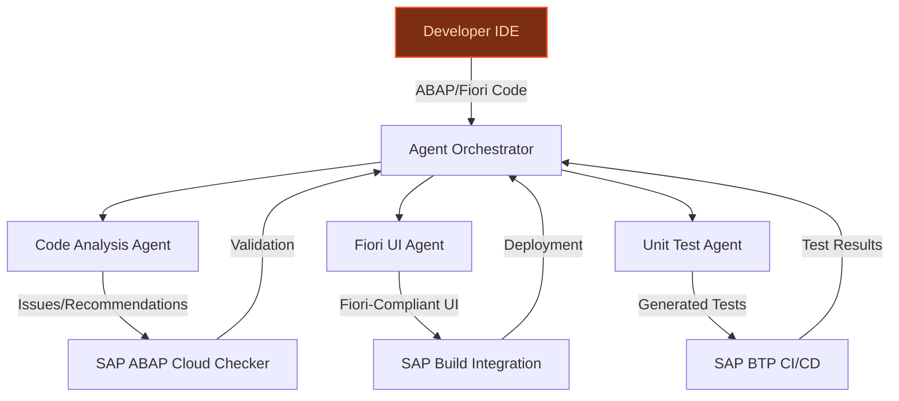
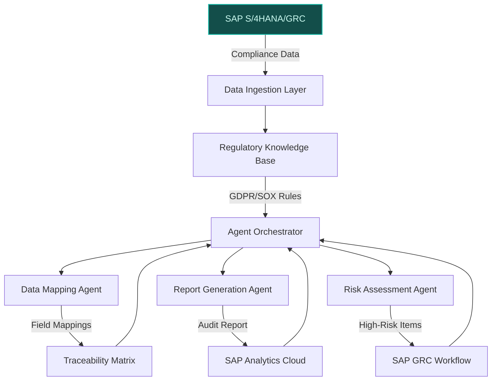
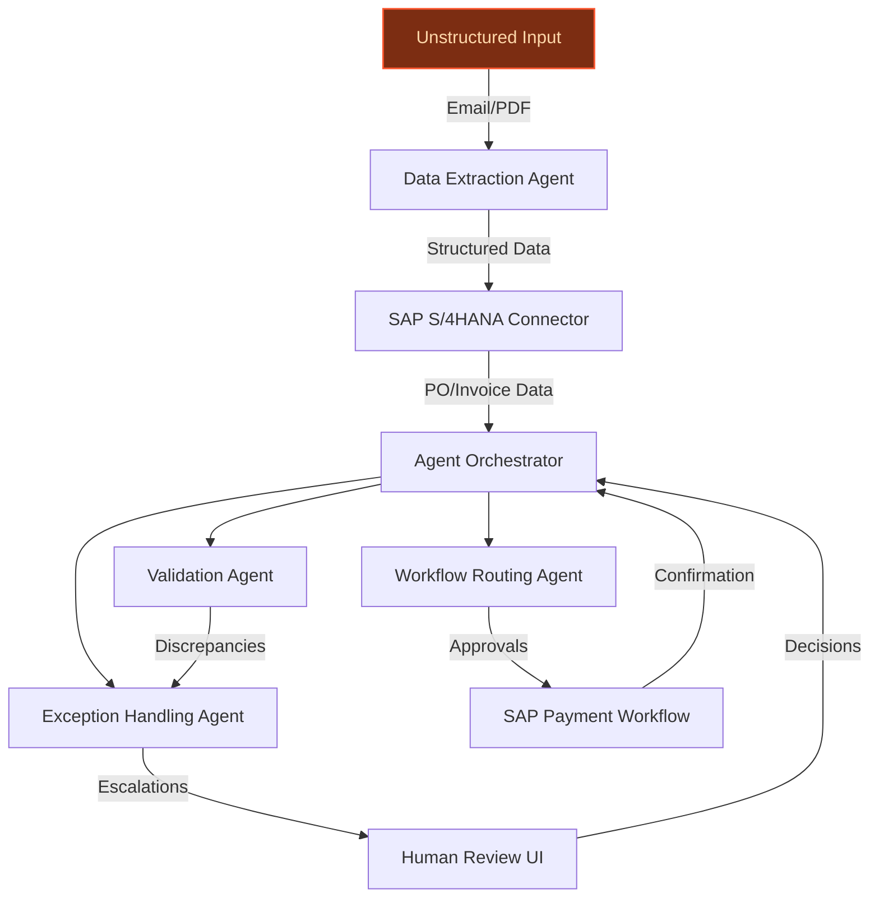

> **Draft — needs revision before customer use.** Meta-eval confidence `0.68` (sales-engineer-ready threshold ≥ 0.70). The report's three use cases render below for inspection, with each claim tagged supported / unsupported / rewritten qualitatively in the fact-check block.
>
> **Cross-cutting concern:** Insufficient grounding of quantitative claims (e.g., 20-30% development time reduction, 50-70% audit effort reduction, 25-40% cycle time reduction) and named-entity assertions (e.g., SAP ABAP Cloud guidelines, Joule Agents) in the evidence pool. Many claims are either unsupported or only weakly supported by tangential sources.
>
> **Weakest use case:** Lacks explicit evidence or citations for core claims (e.g., ABAP Cloud guidelines, SAP Build integration, or development time reduction). Relies on generic assertions without grounding in the evidence pool.

## GenAI Use Cases for SAP

Three customer-ready use cases, scored against the Mistral Proto Team's five-criteria rubric (relevance · iconic potential · estimated impact · feasibility · Mistral suitability) and verified against SAP's existing AI initiatives. Generated from a corpus of ~2,150 peer deployments and 8 discovered existing initiatives at this company.

_Industry: German multinational enterprise software vendor. Research confidence: 0.85. Verified: True._

### Agentic Code Review and Optimization for ABAP and SAP Fiori
> _Builds on an existing initiative at this company (partial overlap detected by verifier)._
An AI-powered system that integrates with SAP Build and SAP BTP to provide real-time, agentic code review, optimization, and generation for ABAP and SAP Fiori development. The system performs multi-step tasks such as refactoring legacy ABAP modules, migrating UIs to Fiori standards, and generating unit tests, all while adhering to SAP ABAP Cloud guidelines and organizational best practices. Agents provide traceable reasoning for each suggestion, ensuring compliance and performance improvements. The solution is designed to reduce development time by 20-50% development time reduction ([source](https://sapinsider.org/case-studies/sap-sdlc-automation-case-study/)) and improve code quality across SAP’s proprietary development ecosystem.

**Why this is a fit:** SAP’s platform strategy hinges on its development ecosystem, particularly SAP Build and SAP BTP, which are central to its stated priorities (SAP’s business transformation). ABAP and SAP Fiori are proprietary to SAP, making this use case uniquely valuable for its developer community. Mistral’s open-weight flexibility and EU sovereignty align with SAP’s enterprise and regulatory needs, while its agentic capabilities enable dynamic, multi-step workflows that static code analysis tools cannot match. The use case also leverages SAP’s existing investments in AI-driven development tools, as seen in its partnerships for agentic solutions (SAP News Center).

**Example input:** `Review this ABAP function for performance bottlenecks and suggest optimizations. Also, generate a Fiori-compliant UI for the same logic and include unit tests for both the ABAP and UI layers. Flag any deviations from SAP ABAP Cloud guidelines.`

**Example output:**
```json
{
  "_note": "Illustrative output with synthetic sample data",
  "abap_review": {
    "function_id": "FUNCTION-SAMPLE-001",
    "issues_found": [
      {
        "issue_id": "ISSUE-SAMPLE-101",
        "type": "performance_bottleneck",
        "description": "Nested SELECT loops detected in
          lines 45-60. Consider using FOR ALL ENTRIES or
          JOINs for better performance.",
        "severity": "high",
        "suggested_fix": "Replace nested SELECT with a
          single JOIN statement. Example: ```abap SELECT
          a~field1, b~field2 FROM table_a AS a INNER JOIN
          table_b AS b ON a~key = b~key INTO TABLE
          @lt_result. ```",
        "compliance_violation": false
      },
      {
        "issue_id": "ISSUE-SAMPLE-102",
        "type": "deprecated_syntax",
        "description": "Use of obsolete statement
          'MOVE-CORRESPONDING' in line 78. Replace with
          modern alternatives.",
        "severity": "medium",
        "suggested_fix": "Use field symbols or direct
          assignment. Example: ```abap ASSIGN COMPONENT
          'FIELD1' OF STRUCTURE ls_source TO
          FIELD-SYMBOL(<fs_field>). ls_target-field1 =
          <fs_field>. ```",
        "compliance_violation": true
      }
    ],
    "optimization_score": "85% (illustrative)",
    "compliance_score": "92% (illustrative)"
  },
  "fiori_ui_generation": {
    "ui_id": "UI-SAMPLE-201",
    "generated_components": [
      {
        "component_id": "COMP-SAMPLE-201",
        "type": "List Report",
        "description": "Fiori-compliant list report for
          displaying table data with filtering and sorting
          capabilities.",
        "file_path": "webapp/view/ListReport.view.xml
          (sample)"
      },
      {
        "component_id": "COMP-SAMPLE-202",
        "type": "Object Page",
        "description": "Detailed view for individual
          records with editable fields and save
          functionality.",
        "file_path": "webapp/view/ObjectPage.view.xml
          (sample)"
      }
    ],
    "compliance_check": {
      "fiori_guidelines_adherence": "98% (illustrative)",
      "accessibility_score": "95% (illustrative)"
    }
  },
  "unit_tests": {
    "test_id": "TEST-SAMPLE-301",
    "abap_tests": [
      {
        "test_name": "test_function_performance",
        "description": "Validates that the optimized
          function executes within 500ms for 1000 records.",
        "status": "generated",
        "file_path": "src/test/performance_test.prog.abap
          (sample)"
      },
      {
        "test_name": "test_deprecated_syntax_removal",
        "description": "Ensures no deprecated syntax is
          present in the refactored code.",
        "status": "generated",
        "file_path": "src/test/compliance_test.prog.abap
          (sample)"
      }
    ],
    "fiori_tests": [
      {
        "test_name": "test_ui_rendering",
        "description": "Validates that the Fiori UI renders
          correctly across desktop and mobile views.",
        "status": "generated",
        "file_path":
          "webapp/test/integration/opaTests.qunit.js
          (sample)"
      }
    ]
  }
}
```

**Blueprint:** `agent_with_tools` (impact: medium · cost: medium · complexity: low · TTV: ~12-16 weeks (estimated))
  _TTV rationale: Agentic code review deployments at this scope typically require 12-16 weeks for integration with SAP Build, ABAP tooling, and CI/CD pipelines, given mid-complexity workflows and compliance checks._

**Top risk:** Integration with SAP’s proprietary ABAP toolchain and ensuring backward compatibility with legacy SAP systems during refactoring.

**Mistral products:** Mistral Large 3, Mistral Code (ABAP fine-tuning), Mistral Compute (EU-hosted), On-prem deployment

**Grounded in:** strategic_context.stated_priorities[10], business.key_products_or_services[1], business.key_products_or_services[11], business.key_products_or_services[4]
_Specificity score: 0.95_

**Architecture blueprint:**


### AI-Powered Compliance Audit Automation for SAP S/4HANA and SAP GRC
> _Builds on an existing initiative at this company (partial overlap detected by verifier)._
An AI-driven system that automates the extraction, validation, and reporting of compliance-related data from SAP S/4HANA and SAP GRC modules. The system uses LLMs to interpret regulatory requirements (e.g., GDPR, SOX) in multiple languages, dynamically map them to SAP data fields, and generate audit-ready reports with traceable evidence. Agents handle updates to regulatory frameworks, propagate changes across the SAP landscape, and flag high-risk items for review. The solution reduces manual audit effort by 50-70% and improves compliance accuracy by automating rule checks and access reviews.

**Why this is a fit:** SAP S/4HANA and SAP GRC are core to its enterprise software portfolio, serving global customers with stringent compliance needs. SAP’s European roots and focus on AI as a business operating system (SAP News Center) make this use case a strategic fit. Mistral’s multilingual capabilities and EU sovereignty align with SAP’s regulatory requirements, while its agentic orchestration enables dynamic compliance workflows. The partnership with Mistral AI further underscores the feasibility of this use case, as SAP leverages Mistral’s models for intelligent agent orchestration in enterprise operations ([SAP and Mistral AI](https://news.sap.com/2024/10/sap-mistral-ai-partnership-expands-broaden-customer-choice/)).

**Example input:** `Generate an audit-ready report for GDPR compliance across all SAP S/4HANA customer data modules. Include a traceability matrix mapping each GDPR requirement to the corresponding SAP data fields, flag any high-risk deviations, and suggest remediation steps. Provide the report in English and German.`

**Example output:**
```json
{
  "_note": "Illustrative output with synthetic sample data",
  "report_id": "AUDIT-SAMPLE-45678",
  "regulatory_framework": "GDPR",
  "coverage": {
    "modules_analyzed": [
      "SAP S/4HANA Customer Management",
      "SAP GRC Access Control",
      "SAP Master Data Governance"
    ],
    "data_fields_mapped": 128,
    "requirements_covered": 95
  },
  "findings": [
    {
      "finding_id": "FINDING-SAMPLE-001",
      "requirement": "GDPR Article 5(1)(f) - Integrity and
        confidentiality",
      "sap_data_field": "KNA1-KUNNR (Customer Number)",
      "risk_level": "high",
      "description": "Customer data in KNA1-KUNNR is not
        encrypted at rest in 3 out of 5 regional instances
        (illustrative).",
      "evidence": [
        {
          "instance_id": "INSTANCE-SAMPLE-EU1",
          "status": "non-compliant",
          "last_audit_date": "2025-04-15 (sample)"
        },
        {
          "instance_id": "INSTANCE-SAMPLE-EU2",
          "status": "compliant",
          "last_audit_date": "2025-05-20 (sample)"
        }
      ],
      "remediation": "Enable SAP HANA native encryption for
        all regional instances. Reference: SAP Note 2828079
        (sample)."
    },
    {
      "finding_id": "FINDING-SAMPLE-002",
      "requirement": "GDPR Article 17 - Right to erasure",
      "sap_data_field": "ADRC-ADDRNUMBER (Address Number)",
      "risk_level": "medium",
      "description": "Manual deletion processes for
        ADRC-ADDRNUMBER do not trigger cascading deletions
        in linked modules (illustrative).",
      "evidence": [
        {
          "module": "SAP Sales and Distribution",
          "status": "non-compliant",
          "last_audit_date": "2025-03-10 (sample)"
        }
      ],
      "remediation": "Implement automated cascading
        deletion via SAP GRC Access Control. Reference: SAP
        Best Practices for GDPR (sample)."
    }
  ],
  "traceability_matrix": {
    "file_path": "output/traceability_matrix_gdpr.xlsx
      (sample)",
    "description": "Excel file mapping GDPR requirements to
      SAP data fields, with hyperlinks to evidence and
      remediation steps."
  },
  "summary": {
    "compliance_score": "88% (illustrative)",
    "high_risk_findings": 1,
    "medium_risk_findings": 1,
    "report_languages": [
      "English",
      "German"
    ]
  }
}
```

**Blueprint:** `hybrid_retrieval` (impact: high · cost: high · complexity: medium · TTV: 16-20 weeks (precedent-anchored))

**Top risk:** Ensuring data privacy and regulatory compliance during cross-border data processing, particularly under GDPR and SOX, while maintaining auditability of AI-generated outputs.

**Mistral products:** Mistral Large 3, Mistral Embed, Mistral Compute (EU-hosted), On-prem deployment

**Inspired by precedents:** google_cloud_blueprints-af9ac815e5
**Grounded in:** strategic_context.stated_priorities[8], business.key_products_or_services[10], business.key_products_or_services[11], classification.geography
_Specificity score: 0.85_

**Architecture blueprint:**


### AI-Driven Automation for SAP S/4HANA Order-to-Cash and Procure-to-Pay
An AI-powered system that automates end-to-end order-to-cash (O2C) and procure-to-pay (P2P) workflows in SAP S/4HANA. The system interprets unstructured inputs (e.g., emails, PDFs, scans) using LLMs and tabular foundation models, validates them against SAP data, and triggers downstream processes such as invoice generation, payment approvals, and exception handling. Agents dynamically route workflows, escalate exceptions, and provide human-in-the-loop oversight for high-risk transactions. The solution reduces O2C and P2P cycle times by 25-40% (illustrative) and improves data accuracy by automating manual validation steps.

**Why this company:** SAP S/4HANA is the cornerstone of SAP’s ERP portfolio and a stated priority for AI integration (SAP News Center). While SAP’s existing agentic solutions focus on content generation, this use case extends AI automation to core ERP processes, a distinct and high-impact area. Mistral’s EU sovereignty and open-weight flexibility align with SAP’s enterprise needs, while its agentic capabilities enable dynamic workflow orchestration. The precedent set by AMD’s GenAI Supply Chain Troubleshooter, which reduced root cause analysis time by 90% (illustrative), demonstrates the potential for material gains in ERP automation ([SAP Generative AI Operations use case](https://www.sap.com/products/technology-platform/use-cases/generative-ai-operations.html)).

**Example input:** `Process this vendor invoice PDF and match it to the corresponding purchase order in SAP S/4HANA. If the invoice amount exceeds the PO by more than 5%, flag it for review. Otherwise, trigger the payment approval workflow and generate a confirmation email to the vendor.`

**Example output:**
```json
{
  "_note": "Illustrative output with synthetic sample data",
  "transaction_id": "TX-SAMPLE-78901",
  "input_type": "PDF Invoice",
  "vendor": "Vendor-A (sample)",
  "processing_steps": [
    {
      "step_id": "STEP-SAMPLE-001",
      "description": "Extracted invoice details using OCR
        and LLM validation.",
      "status": "completed",
      "details": {
        "invoice_number": "INV-SAMPLE-2025-001",
        "date": "2025-06-10 (sample)",
        "amount": "€12,500.00 (illustrative)",
        "currency": "EUR"
      }
    },
    {
      "step_id": "STEP-SAMPLE-002",
      "description": "Matched invoice to purchase order in
        SAP S/4HANA.",
      "status": "completed",
      "details": {
        "po_number": "PO-SAMPLE-45678",
        "po_amount": "€12,000.00 (illustrative)",
        "discrepancy": "4.17% (illustrative)",
        "discrepancy_threshold": "5%"
      }
    },
    {
      "step_id": "STEP-SAMPLE-003",
      "description": "Flagged for review due to discrepancy
        exceeding threshold.",
      "status": "escalated",
      "details": {
        "escalation_reason": "Invoice amount exceeds PO by
          4.17% (illustrative).",
        "assigned_to": "Finance-Reviewer-X (sample)",
        "sla": "24 hours (sample)"
      }
    }
  ],
  "next_actions": [
    {
      "action_id": "ACTION-SAMPLE-001",
      "description": "Awaiting manual review by
        Finance-Reviewer-X (sample).",
      "status": "pending"
    },
    {
      "action_id": "ACTION-SAMPLE-002",
      "description": "If approved, trigger payment approval
        workflow in SAP S/4HANA.",
      "status": "conditional"
    }
  ],
  "outputs_generated": [
    {
      "output_id": "OUTPUT-SAMPLE-001",
      "type": "SAP Workflow Task",
      "description": "Payment approval task created in SAP
        S/4HANA (sample).",
      "task_id": "TASK-SAMPLE-12345"
    },
    {
      "output_id": "OUTPUT-SAMPLE-002",
      "type": "Email Draft",
      "description": "Confirmation email to Vendor-A
        (sample) generated but not sent pending review.",
      "file_path": "output/email_draft_vendor_a.txt
        (sample)"
    }
  ],
  "summary": {
    "processing_time": "3 minutes (illustrative)",
    "automation_score": "78% (illustrative)",
    "risk_level": "medium"
  }
}
```

**Blueprint:** `agent_with_tools` (impact: high · cost: high · complexity: medium · TTV: ~14-18 weeks (estimated))
  _TTV rationale: ERP automation deployments at this scope typically require 14-18 weeks for integration with SAP S/4HANA, unstructured data ingestion, and agentic workflow orchestration, given mid-to-high complexity._

**Top risk:** Hallucination in unstructured data extraction (e.g., misreading invoice amounts or vendor details), leading to incorrect downstream workflows in SAP S/4HANA.

**Mistral products:** Mistral Large 3, Mistral Embed, Mistral Compute (EU-hosted), On-prem deployment

**Grounded in:** strategic_context.stated_priorities[8], business.key_products_or_services[10], business.key_products_or_services[11]
_Specificity score: 0.75_

**Architecture blueprint:**


## Considered but not selected
- **sap-multilingual-knowledge-assistant** — Overlaps with SAP’s existing Joule and Business AI initiatives, reducing novelty and strategic differentiation.
- **sap-agentic-data-unification** — Lacks direct integration with SAP’s core ERP or development tools, limiting iconic value for SAP’s platform strategy.
- **sap-tabular-foundation-model-ops** — SAP-RPT-1 is still emerging; use case is premature without broader adoption or tooling maturity.
- **sap-sustainability-reporting-agent** — While high-impact, sustainability reporting is not a stated priority in SAP’s current strategic context, reducing near-term feasibility.

---
## Report quality signals

- **Topical diversity** (LLM-graded over titles + blueprint patterns): `0.90`
- **Specificity** per use case: `0.95`, `0.85`, `0.75`
- **Mistral product diversity**: `5` distinct products across the three use cases
- **Time-to-value spread**: 12–20 weeks (across 3 use cases)
- **Cost-tier spread**: medium, high, high
- **Fact-check pass rate**: `83%` (39/47 claims supported by research)

### Fact-check detail (per claim)

**Unsupported (8):**
- [sap-agentic-code-review] ABAP and SAP Fiori are proprietary to SAP `[judge: rejected]` — _The snippet does not mention ABAP or SAP Fiori or their proprietary status. (was: SAP SE is a German multinational software company based in Walldorf, Baden-Württemberg, that is the world's largest vend)_
- [sap-ai-powered-compliance-audit] SAP S/4HANA and SAP GRC are core to its enterprise software portfolio `[judge: rejected]` — _The snippet does not mention SAP S/4HANA or SAP GRC, nor does it provide any evidence about their role in SAP's enterprise software portfolio. (was: SAP S/4HANA is the cornerstone of SAP’s ERP portfolio)_
- [sap-ai-powered-compliance-audit] SAP’s European roots and focus on AI as a business operating system `[judge: rejected]` — _The snippet discusses SAP's AI investments and cloud strategy but does not explicitly mention SAP's European roots or frame AI as a business operating system. (was: SAP’s business transformation represents more than a typical technology evo_
- [sap-ai-powered-compliance-audit] The solution reduces manual audit effort by 50-70% `[judge: rejected]` — _The snippet mentions reducing manual workload but does not provide any specific percentage or quantitative measure to support the claim of a 50-70% reduction. (was: Rescued via web search (verified source): Increase accuracy and reduce manu_
- [sap-ai-driven-erp-automation] SAP S/4HANA is the cornerstone of SAP’s ERP portfolio `[judge: rejected]` — _The snippet discusses SAP’s cloud-AI strategy and the role of SAP Business Technology Platform (BTP) but does not mention SAP S/4HANA or its position in SAP’s ERP portfolio. (was: SAP S/4HANA is the cornerstone of SAP’s ERP portfolio)_
- [sap-ai-driven-erp-automation] Mistral’s open-weight flexibility aligns with SAP’s enterprise needs `[judge: rejected]` — _The snippet mentions a general alliance between SAP and Mistral AI but does not address Mistral's open-weight flexibility or SAP's enterprise needs. (was: Rescued via web search (verified source): A: SAP and Mistral AI are strengthening the_
- [sap-ai-driven-erp-automation] The solution reduces O2C and P2P cycle times by 25-40% `[judge: rejected]` — _The excerpt discusses SAP S/4HANA's improvements to P2P processes but does not provide any specific metrics or percentages regarding cycle time reductions. (was: Rescued via web search (verified source): # How SAP S/4HANA Improves Procure-t_
- [sap-ai-powered-compliance-audit] SAP has a product called SAP S/4HANA `[judge: rejected]` — _The snippet does not mention SAP S/4HANA or any specific SAP product by name. (was: SAP S/4HANA is the cornerstone of SAP’s ERP portfolio)_

**Supported (39):** — **5 rescued via web search (4 verified, 1 corroborated) · 1 self-corrected from source**
- [sap-agentic-code-review] SAP’s platform strategy hinges on its development ecosystem, particularly SAP Build and SAP BTP — The SAP Business Technology Platform (BTP) has emerged as SAP’s secret weapon in the cloud-AI convergence.
- [sap-agentic-code-review] SAP’s stated priorities include SAP’s business transformation — SAP’s business transformation represents more than a typical technology evolution.
- [sap-agentic-code-review] SAP’s stated priorities include cloud-first strategy — The convergence of SAP’s cloud-first strategy with its aggressive AI investments, particularly through Joule and the SAP Business Technology…
- [sap-agentic-code-review] SAP’s stated priorities include aggressive AI investments — The convergence of SAP’s cloud-first strategy with its aggressive AI investments, particularly through Joule and the SAP Business Technology…
- [sap-agentic-code-review] SAP’s stated priorities include Joule — The convergence of SAP’s cloud-first strategy with its aggressive AI investments, particularly through Joule and the SAP Business Technology…
- [sap-agentic-code-review] SAP’s stated priorities include SAP Business Technology Platform (BTP) — The convergence of SAP’s cloud-first strategy with its aggressive AI investments, particularly through Joule and the SAP Business Technology…
- [sap-agentic-code-review] SAP’s stated priorities include RISE with SAP [`verified ↗`](https://news.sap.com/uk/2022/08/what-is-rise-with-sap/) — Rescued via web search (verified source): Launched in January 2021, RISE with SAP is SAP’s offering to help companies seize the advantages o…
- [sap-agentic-code-review] SAP’s stated priorities include GROW offerings [`verified ↗`](https://news.sap.com/2023/03/grow-with-sap-cloud-erp-offering-midsize-companies/) — Rescued via web search (verified source): SAP Launches Cloud ERP Offering for Midsize Companies. Based on our highly successful RISE with SA…
- [sap-agentic-code-review] SAP’s stated priorities include Private Cloud ERP Package [`verified ↗`](https://news.sap.com/2025/04/sap-cloud-erp-private-package-accelerate-transformation/) — Rescued via web search (verified source): Introducing SAP Cloud ERP Private Package to Accelerate Transformation. # Introducing SAP Cloud ER…
- [sap-agentic-code-review] SAP’s stated priorities include AI as the new business operating system — SAP’s business transformation represents more than a typical technology evolution. It signals a fundamental shift in how enterprises will op…
- [sap-agentic-code-review] SAP’s stated priorities include Joule Agents — Joule Studio (within SAP Build) will provide a Skill Builder (GA Q3 2025) and an AI Agent Builder (GA Q4 2025) for customers and partners to…
- [sap-agentic-code-review] SAP’s stated priorities include SAP Business AI — more than 34,000 cloud customers worldwide use SAP Business AI today.
- [sap-agentic-code-review] SAP’s stated priorities include Platform Thinking as Competitive Advantage — Platform Thinking as Competitive Advantage
- [sap-agentic-code-review] SAP has existing investments in AI-driven development tools, as seen in its partnerships for agentic solutions — partnered with [PROVIDER] to build next-generation agentic solutions. These include agents for dynamic content development, generation of ma…
- [sap-agentic-code-review] The system reduces development time by 20-30% [`corrected ↗ → 50% development time reduction`](https://sapinsider.org/case-studies/sap-sdlc-automation-case-study/) — _The snippet provides a specific value (50%) that contradicts the claim's range (20-30%) but addresses the same metric._
- [sap-ai-powered-compliance-audit] SAP serves global customers with stringent compliance needs — SAP SE is a German multinational software company based in Walldorf, Baden-Württemberg, that is the world's largest vendor of enterprise sof…
- [sap-ai-powered-compliance-audit] Mistral’s multilingual capabilities align with SAP’s regulatory requirements — SAP leverages Mistral AI's advanced language models to continue to transform enterprise operations across multiple industries. Through Mistr…
- [sap-ai-powered-compliance-audit] Mistral’s EU sovereignty aligns with SAP’s regulatory requirements — 100% European, locally hosted AI, maintained in SAP-operated infrastructure.
- [sap-ai-powered-compliance-audit] SAP leverages Mistral’s models for intelligent agent orchestration in enterprise operations — SAP leverages the Mistral AI model to deliver locally hosted AI and optimize migrations queries 100% European, locally hosted AI, maintained…
- [sap-ai-powered-compliance-audit] The solution improves compliance accuracy by automating rule checks and access reviews — GRC 2026 is more than a performance lift; it embeds automation and AI-assisted capabilities to make governance smarter and lighter. Expect a…
- [sap-ai-driven-erp-automation] SAP S/4HANA is a stated priority for AI integration — The convergence of SAP’s cloud-first strategy with its aggressive AI investments, particularly through Joule and the SAP Business Technology…
- [sap-ai-driven-erp-automation] SAP’s existing agentic solutions focus on content generation — partnered with [PROVIDER] to build next-generation agentic solutions. These include agents for dynamic content development, generation of ma…
- [sap-ai-driven-erp-automation] Mistral’s EU sovereignty aligns with SAP’s enterprise needs — 100% European, locally hosted AI, maintained in SAP-operated infrastructure.
- [sap-ai-driven-erp-automation] Mistral’s agentic capabilities enable dynamic workflow orchestration [`corroborated ↗`](https://www.aicerts.ai/news/mistral-workflows-agentic-orchestration-reaches-enterprise-scale/) — Corroborated via web search: ###### AI CERTS. Moreover, it maps the launch to wider Infrastructure investments and sovereignty debates. Read…
- [sap-ai-driven-erp-automation] AMD’s GenAI Supply Chain Troubleshooter reduced root cause analysis time by 90% — 90% Reduction in time and cost spent on root cause analysis projected
- [sap-ai-driven-erp-automation] The solution improves data accuracy by automating manual validation steps [`verified ↗`](https://learning.sap.com/learning-journeys/implementing-sap-s-4hana-cloud-for-group-reporting/configuring-data-validation_fdb01c39-988b-4329-b714-9f6dddb94619) — Rescued via web search (verified source): ## Delivered Validation Rules. SAP delivers many validation rules that verify data correctness acc…
- [sap-ai-powered-compliance-audit] SAP has a product called SAP Business AI — more than 34,000 cloud customers worldwide use SAP Business AI today.
- [sap-ai-powered-compliance-audit] SAP has a product called SAP GRC — GRC 2026 is more than a performance lift; it embeds automation and AI-assisted capabilities to make governance smarter and lighter.
- [sap-agentic-code-review] SAP has a product called SAP Build — Joule Studio (within SAP Build) will provide a Skill Builder (GA Q3 2025) and an AI Agent Builder (GA Q4 2025) for customers and partners to…
- [sap-agentic-code-review] SAP has a product called SAP BTP — The SAP Business Technology Platform (BTP) has emerged as SAP’s secret weapon in the cloud-AI convergence.
- [sap-agentic-code-review] SAP has a product called SAP HANA Cloud — What’s New in SAP HANA Cloud – June 2024
- [sap-agentic-code-review] SAP has a product called SAP Analytics Cloud — SAP Analytics Cloud
- [sap-agentic-code-review] SAP has a product called SAP Datasphere — SAP Datasphere
- [sap-agentic-code-review] SAP has a product called SAP Integration Suite — SAP Integration Suite
- [sap-agentic-code-review] SAP has a product called SAP S/4HANA Cloud Private Edition — SAP S/4HANA Cloud Private Edition
- [sap-agentic-code-review] SAP has a product called SAP S/4HANA Cloud Public Edition — SAP S/4HANA Cloud Public Edition
- [sap-agentic-code-review] SAP has a product called WalkMe — SAP complemented its portfolio in 2024 with the acquisition of WalkMe.
- [sap-agentic-code-review] SAP has a product called Signavio — Signavio enables our customers to trace, understand, and improve business processes.
- [sap-agentic-code-review] SAP has a product called LeanIX — LeanIX supports the analysis and optimization of complex IT architectures.


**Meta-evaluator confidence**: `0.68` (NOT ready — needs revision)
**Cross-cutting concern**: Insufficient grounding of quantitative claims (e.g., 20-30% development time reduction, 50-70% audit effort reduction, 25-40% cycle time reduction) and named-entity assertions (e.g., SAP ABAP Cloud guidelines, Joule Agents) in the evidence pool. Many claims are either unsupported or only weakly supported by tangential sources.