# Trace

## Execution trace — SAP

Started: `2026-05-11T00:54:44.696255+00:00`. Total wall time: `213.1s` across `75` recorded actions.

### Per-step time totals

| Step | Calls | Total time | Avg time |
|---|---:|---:|---:|
| `research` | 1 | 10.62s | 10622ms |
| `gap_fill` | 4 | 3.13s | 782ms |
| `retrieve` | 2 | 0.51s | 253ms |
| `generate` | 2 | 24.38s | 12189ms |
| `generate.web_search` | 2 | 5.65s | 2823ms |
| `score` | 2 | 28.97s | 14487ms |
| `verify` | 6 | 20.72s | 3453ms |
| `enrich` | 1 | 76.46s | 76462ms |
| `polish` | 3 | 8.45s | 2818ms |
| `meta_eval` | 1 | 21.39s | 21391ms |
| `web_verify` | 1 | 3.59s | 3592ms |
| `source_judge` | 48 | 76.31s | 1590ms |
| `quality_signals` | 2 | 3.97s | 1987ms |

### Chronological event log

- `00:54:45.203` **[research]** `mistral-medium-2604.chat.complete` — 10622ms
   - inputs: synthesize CompanyContext for SAP | depth=medium
   - outputs: industry='German multinational enterprise software vendor' verified=True conf=0.75
- `00:54:55.827` **[gap_fill]** `mistral-small-2603.chat.complete` — 907ms
   - inputs: generate gap queries | fields=['business_model', 'products', 'data_assets', 'priorities']
   - outputs: queries=4
- `00:55:04.274` **[gap_fill]** `mistral-small-2603.chat.complete` — 853ms
   - inputs: layer-2 extract field=priorities
   - outputs: items=12
- `00:55:04.280` **[gap_fill]** `mistral-small-2603.chat.complete` — 496ms
   - inputs: layer-2 extract field=data_assets
   - outputs: items=0
- `00:55:04.283` **[gap_fill]** `mistral-small-2603.chat.complete` — 872ms
   - inputs: layer-2 extract field=products
   - outputs: items=13
- `00:55:05.156` **[retrieve]** `mistral-embed.embeddings.create` — 502ms
   - inputs: company_query | industries='German multinational enterprise software vendor'
   - outputs: embedded 1024-dim query vector
- `00:55:05.658` **[retrieve]** `precedent_corpus.cosine_topk` — 5ms
   - inputs: k=8 min_depth=0.4 target='SAP'
   - outputs: retrieved 8 | mmr=True | top_sim=0.802
- `00:55:07.159` **[generate]** `mistral-medium-2604.chat.complete` — 1974ms
   - inputs: iteration=0 tool_calls_used=0/2 tools=on
   - outputs: tool_calls=4 | content_chars=0
- `00:55:09.152` **[generate.web_search]** `tavily.search` — 2276ms
   - inputs: query='SAP Dremio acquisition 2026 agentic AI data lakehouse'
   - outputs: 2 raw results
- `00:55:11.782` **[generate.web_search]** `tavily.search` — 3371ms
   - inputs: query='SAP Prior Labs acquisition 2026 tabular foundation models'
   - outputs: 2 raw results
- `00:55:17.746` **[generate]** `mistral-medium-2604.chat.complete` — 22404ms
   - inputs: iteration=1 tool_calls_used=2/2 tools=off
   - outputs: tool_calls=0 | content_chars=15962
- `00:55:40.452` **[score]** `mistral-small-2603.chat.complete` — 15018ms
   - inputs: self-consistency pass T=0.2
   - outputs: scored 8 candidates
- `00:55:40.459` **[score]** `mistral-small-2603.chat.complete` — 13956ms
   - inputs: self-consistency pass T=0.4
   - outputs: scored 8 candidates
- `00:55:55.502` **[verify]** `tavily.search` — 2216ms
   - inputs: candidate=sap-agentic-code-review | query='SAP Agentic code review and optimization for ABAP and SAP Fi'
   - outputs: 4 results
- `00:55:55.502` **[verify]** `tavily.search` — 2350ms
   - inputs: candidate=sap-ai-powered-compliance-audit | query='SAP AI-powered compliance audit automation for SAP S/4HANA a'
   - outputs: 4 results
- `00:55:55.502` **[verify]** `tavily.search` — 2128ms
   - inputs: candidate=sap-multilingual-knowledge-assistant | query='SAP Multilingual knowledge assistant for SAP internal and cu'
   - outputs: 4 results
- `00:55:58.075` **[verify]** `mistral-small-2603.chat.complete` — 3705ms
   - inputs: verdict for sap-multilingual-knowledge-assistant
   - outputs: verdict='confirmed_existing'
- `00:55:58.158` **[verify]** `mistral-small-2603.chat.complete` — 4876ms
   - inputs: verdict for sap-agentic-code-review
   - outputs: verdict='partial_overlap'
- `00:55:59.168` **[verify]** `mistral-small-2603.chat.complete` — 5444ms
   - inputs: verdict for sap-ai-powered-compliance-audit
   - outputs: verdict='partial_overlap'
- `00:56:04.616` **[enrich]** `mistral-large-2512.chat.complete` — 76462ms
   - inputs: tier=standard parallel=False ids=['sap-agentic-code-review', 'sap-ai-powered-compliance-audit', 'sap-ai-driven-erp-automation']
   - outputs: enriched 3 use cases
- `00:57:21.108` **[polish]** `mistral-medium-2604.chat.complete` — 2775ms
   - inputs: use_case=sap-agentic-code-review unanchored=True opaque_ev=False
   - outputs: polished 5 fields
- `00:57:21.113` **[polish]** `mistral-medium-2604.chat.complete` — 2860ms
   - inputs: use_case=sap-ai-powered-compliance-audit unanchored=True opaque_ev=False
   - outputs: polished 5 fields
- `00:57:21.118` **[polish]** `mistral-medium-2604.chat.complete` — 2819ms
   - inputs: use_case=sap-ai-driven-erp-automation unanchored=True opaque_ev=False
   - outputs: polished 5 fields
- `00:57:23.977` **[meta_eval]** `mistral-medium-2604.chat.complete` — 21391ms
   - inputs: reviewing 3 use cases
   - outputs: review + claims
- `00:57:45.387` **[web_verify]** `tavily.search.rescue_unsupported_claims` — 3592ms
   - inputs: company='SAP' unsupported=9 budget=12
   - outputs: rescued: verified=8 corroborated=1 of 9 attempted
- `00:57:48.981` **[source_judge]** `mistral-small-2603.judge_claim_sources` — 22597ms
   - inputs: pairs=47
   - outputs: judged 47 pairs
- `00:57:48.981` **[source_judge]** `mistral-small-2603.chat.complete` — 1008ms
   - inputs: claim='SAP’s platform strategy hinges on its development ecosystem,'
   - outputs: verdict=supported
- `00:57:48.984` **[source_judge]** `mistral-small-2603.chat.complete` — 773ms
   - inputs: claim='ABAP and SAP Fiori are proprietary to SAP'
   - outputs: verdict=unsupported
- `00:57:48.989` **[source_judge]** `mistral-small-2603.chat.complete` — 656ms
   - inputs: claim='SAP’s stated priorities include SAP’s business transformatio'
   - outputs: verdict=supported
- `00:57:48.991` **[source_judge]** `mistral-small-2603.chat.complete` — 567ms
   - inputs: claim='SAP’s stated priorities include cloud-first strategy'
   - outputs: verdict=supported
- `00:57:48.993` **[source_judge]** `mistral-small-2603.chat.complete` — 765ms
   - inputs: claim='SAP’s stated priorities include aggressive AI investments'
   - outputs: verdict=supported
- `00:57:48.995` **[source_judge]** `mistral-small-2603.chat.complete` — 757ms
   - inputs: claim='SAP’s stated priorities include Joule'
   - outputs: verdict=supported
- `00:57:48.998` **[source_judge]** `mistral-small-2603.chat.complete` — 835ms
   - inputs: claim='SAP’s stated priorities include SAP Business Technology Plat'
   - outputs: verdict=supported
- `00:57:49.003` **[source_judge]** `mistral-small-2603.chat.complete` — 770ms
   - inputs: claim='SAP’s stated priorities include RISE with SAP'
   - outputs: verdict=supported
- `00:57:49.558` **[source_judge]** `mistral-small-2603.chat.complete` — 467ms
   - inputs: claim='SAP’s stated priorities include GROW offerings'
   - outputs: verdict=supported
- `00:57:49.645` **[source_judge]** `mistral-small-2603.chat.complete` — 625ms
   - inputs: claim='SAP’s stated priorities include Private Cloud ERP Package'
   - outputs: verdict=supported
- `00:57:49.752` **[source_judge]** `mistral-small-2603.chat.complete` — 655ms
   - inputs: claim='SAP’s stated priorities include AI as the new business opera'
   - outputs: verdict=supported
- `00:57:49.758` **[source_judge]** `mistral-small-2603.chat.complete` — 599ms
   - inputs: claim='SAP’s stated priorities include Joule Agents'
   - outputs: verdict=supported
- `00:57:49.762` **[source_judge]** `mistral-small-2603.chat.complete` — 649ms
   - inputs: claim='SAP’s stated priorities include SAP Business AI'
   - outputs: verdict=supported
- `00:57:49.773` **[source_judge]** `mistral-small-2603.chat.complete` — 638ms
   - inputs: claim='SAP’s stated priorities include Platform Thinking as Competi'
   - outputs: verdict=supported
- `00:57:49.833` **[source_judge]** `mistral-small-2603.chat.complete` — 529ms
   - inputs: claim='SAP has existing investments in AI-driven development tools,'
   - outputs: verdict=supported
- `00:57:49.989` **[source_judge]** `mistral-small-2603.chat.complete` — 684ms
   - inputs: claim='The system reduces development time by 20-30%'
   - outputs: verdict=corrected
- `00:57:50.026` **[source_judge]** `mistral-small-2603.chat.complete` — 622ms
   - inputs: claim='SAP S/4HANA and SAP GRC are core to its enterprise software '
   - outputs: verdict=unsupported
- `00:57:50.270` **[source_judge]** `mistral-small-2603.chat.complete` — 611ms
   - inputs: claim='SAP serves global customers with stringent compliance needs'
   - outputs: verdict=supported
- `00:57:50.357` **[source_judge]** `mistral-small-2603.chat.complete` — 629ms
   - inputs: claim='SAP’s European roots and focus on AI as a business operating'
   - outputs: verdict=unsupported
- `00:57:50.361` **[source_judge]** `mistral-small-2603.chat.complete` — 618ms
   - inputs: claim='Mistral’s multilingual capabilities align with SAP’s regulat'
   - outputs: verdict=supported
- `00:57:50.407` **[source_judge]** `mistral-small-2603.chat.complete` — 5726ms
   - inputs: claim='Mistral’s EU sovereignty aligns with SAP’s regulatory requir'
   - outputs: verdict=supported
- `00:57:50.412` **[source_judge]** `mistral-small-2603.chat.complete` — 501ms
   - inputs: claim='SAP leverages Mistral’s models for intelligent agent orchest'
   - outputs: verdict=supported
- `00:57:50.414` **[source_judge]** `mistral-small-2603.chat.complete` — 655ms
   - inputs: claim='The solution reduces manual audit effort by 50-70%'
   - outputs: verdict=unsupported
- `00:57:50.648` **[source_judge]** `mistral-small-2603.chat.complete` — 600ms
   - inputs: claim='The solution improves compliance accuracy by automating rule'
   - outputs: verdict=supported
- `00:57:50.673` **[source_judge]** `mistral-small-2603.chat.complete` — 620ms
   - inputs: claim='SAP S/4HANA is the cornerstone of SAP’s ERP portfolio'
   - outputs: verdict=unsupported
- `00:57:50.882` **[source_judge]** `mistral-small-2603.chat.complete` — 1079ms
   - inputs: claim='SAP S/4HANA is a stated priority for AI integration'
   - outputs: verdict=supported
- `00:57:50.913` **[source_judge]** `mistral-small-2603.chat.complete` — 466ms
   - inputs: claim='SAP’s existing agentic solutions focus on content generation'
   - outputs: verdict=supported
- `00:57:50.979` **[source_judge]** `mistral-small-2603.chat.complete` — 611ms
   - inputs: claim='Mistral’s EU sovereignty aligns with SAP’s enterprise needs'
   - outputs: verdict=supported
- `00:57:50.986` **[source_judge]** `mistral-small-2603.chat.complete` — 580ms
   - inputs: claim='Mistral’s open-weight flexibility aligns with SAP’s enterpri'
   - outputs: verdict=unsupported
- `00:57:51.070` **[source_judge]** `mistral-small-2603.chat.complete` — 631ms
   - inputs: claim='Mistral’s agentic capabilities enable dynamic workflow orche'
   - outputs: verdict=supported
- `00:57:51.249` **[source_judge]** `mistral-small-2603.chat.complete` — 787ms
   - inputs: claim='AMD’s GenAI Supply Chain Troubleshooter reduced root cause a'
   - outputs: verdict=supported
- `00:57:51.293` **[source_judge]** `mistral-small-2603.chat.complete` — 599ms
   - inputs: claim='The solution reduces O2C and P2P cycle times by 25-40%'
   - outputs: verdict=unsupported
- `00:57:51.379` **[source_judge]** `mistral-small-2603.chat.complete` — 469ms
   - inputs: claim='The solution improves data accuracy by automating manual val'
   - outputs: verdict=supported
- `00:57:51.566` **[source_judge]** `mistral-small-2603.chat.complete` ❌ — 20011ms
   - inputs: claim='SAP has a product called SAP Business AI'
   - error: `ReadTimeout`
- `00:57:51.590` **[source_judge]** `mistral-small-2603.chat.complete` — 498ms
   - inputs: claim='SAP has a product called SAP S/4HANA'
   - outputs: verdict=unsupported
- `00:57:51.701` **[source_judge]** `mistral-small-2603.chat.complete` — 715ms
   - inputs: claim='SAP has a product called SAP GRC'
   - outputs: verdict=supported
- `00:57:51.847` **[source_judge]** `mistral-small-2603.chat.complete` — 506ms
   - inputs: claim='SAP has a product called SAP Build'
   - outputs: verdict=supported
- `00:57:51.893` **[source_judge]** `mistral-small-2603.chat.complete` — 527ms
   - inputs: claim='SAP has a product called SAP BTP'
   - outputs: verdict=supported
- `00:57:51.961` **[source_judge]** `mistral-small-2603.chat.complete` — 515ms
   - inputs: claim='SAP has a product called SAP HANA Cloud'
   - outputs: verdict=supported
- `00:57:52.036` **[source_judge]** `mistral-small-2603.chat.complete` — 484ms
   - inputs: claim='SAP has a product called SAP Analytics Cloud'
   - outputs: verdict=supported
- `00:57:52.088` **[source_judge]** `mistral-small-2603.chat.complete` — 515ms
   - inputs: claim='SAP has a product called SAP Datasphere'
   - outputs: verdict=supported
- `00:57:52.354` **[source_judge]** `mistral-small-2603.chat.complete` — 541ms
   - inputs: claim='SAP has a product called SAP Integration Suite'
   - outputs: verdict=supported
- `00:57:52.416` **[source_judge]** `mistral-small-2603.chat.complete` — 557ms
   - inputs: claim='SAP has a product called SAP S/4HANA Cloud Private Edition'
   - outputs: verdict=supported
- `00:57:52.420` **[source_judge]** `mistral-small-2603.chat.complete` — 522ms
   - inputs: claim='SAP has a product called SAP S/4HANA Cloud Public Edition'
   - outputs: verdict=supported
- `00:57:52.476` **[source_judge]** `mistral-small-2603.chat.complete` — 546ms
   - inputs: claim='SAP has a product called WalkMe'
   - outputs: verdict=supported
- `00:57:52.520` **[source_judge]** `mistral-small-2603.chat.complete` — 502ms
   - inputs: claim='SAP has a product called Signavio'
   - outputs: verdict=supported
- `00:57:52.604` **[source_judge]** `mistral-small-2603.chat.complete` — 496ms
   - inputs: claim='SAP has a product called LeanIX'
   - outputs: verdict=supported
- `00:58:13.869` **[quality_signals]** `mistral-small-2603.chat.complete` — 2465ms
   - inputs: specificity grade (3 use cases)
   - outputs: scored 3 use cases
- `00:58:16.334` **[quality_signals]** `mistral-small-2603.chat.complete` — 1510ms
   - inputs: diversity grade
   - outputs: diversity=0.9

## Mermaid sequence

```mermaid
sequenceDiagram
    autonumber
    participant pipeline as pipeline
    participant mistral_medium_2604 as mistral-medium-2604
    participant mistral_small_2603 as mistral-small-2603
    participant mistral_embed as mistral-embed
    participant precedent_corpus as precedent_corpus
    participant tavily as tavily
    participant mistral_large_2512 as mistral-large-2512
    participant tavily_search as tavily.search
    pipeline->>mistral_medium_2604: research: chat.complete (10622ms)
    mistral_medium_2604-->>pipeline: industry='German multinational enterprise software vendor' v
    pipeline->>mistral_small_2603: gap_fill: chat.complete (907ms)
    mistral_small_2603-->>pipeline: queries=4
    pipeline->>mistral_small_2603: gap_fill: chat.complete (853ms)
    mistral_small_2603-->>pipeline: items=12
    pipeline->>mistral_small_2603: gap_fill: chat.complete (496ms)
    mistral_small_2603-->>pipeline: items=0
    pipeline->>mistral_small_2603: gap_fill: chat.complete (872ms)
    mistral_small_2603-->>pipeline: items=13
    pipeline->>mistral_embed: retrieve: embeddings.create (502ms)
    mistral_embed-->>pipeline: embedded 1024-dim query vector
    pipeline->>precedent_corpus: retrieve: cosine_topk (5ms)
    precedent_corpus-->>pipeline: retrieved 8 | mmr=True | top_sim=0.802
    pipeline->>mistral_medium_2604: generate: chat.complete (1974ms)
    mistral_medium_2604-->>pipeline: tool_calls=4 | content_chars=0
    pipeline->>tavily: generate.web_search: search (2276ms)
    tavily-->>pipeline: 2 raw results
    pipeline->>tavily: generate.web_search: search (3371ms)
    tavily-->>pipeline: 2 raw results
    pipeline->>mistral_medium_2604: generate: chat.complete (22404ms)
    mistral_medium_2604-->>pipeline: tool_calls=0 | content_chars=15962
    pipeline->>mistral_small_2603: score: chat.complete (15018ms)
    mistral_small_2603-->>pipeline: scored 8 candidates
    pipeline->>mistral_small_2603: score: chat.complete (13956ms)
    mistral_small_2603-->>pipeline: scored 8 candidates
    pipeline->>tavily: verify: search (2216ms)
    tavily-->>pipeline: 4 results
    pipeline->>tavily: verify: search (2350ms)
    tavily-->>pipeline: 4 results
    pipeline->>tavily: verify: search (2128ms)
    tavily-->>pipeline: 4 results
    pipeline->>mistral_small_2603: verify: chat.complete (3705ms)
    mistral_small_2603-->>pipeline: verdict='confirmed_existing'
    pipeline->>mistral_small_2603: verify: chat.complete (4876ms)
    mistral_small_2603-->>pipeline: verdict='partial_overlap'
    pipeline->>mistral_small_2603: verify: chat.complete (5444ms)
    mistral_small_2603-->>pipeline: verdict='partial_overlap'
    pipeline->>mistral_large_2512: enrich: chat.complete (76462ms)
    mistral_large_2512-->>pipeline: enriched 3 use cases
    pipeline->>mistral_medium_2604: polish: chat.complete (2775ms)
    mistral_medium_2604-->>pipeline: polished 5 fields
    pipeline->>mistral_medium_2604: polish: chat.complete (2860ms)
    mistral_medium_2604-->>pipeline: polished 5 fields
    pipeline->>mistral_medium_2604: polish: chat.complete (2819ms)
    mistral_medium_2604-->>pipeline: polished 5 fields
    pipeline->>mistral_medium_2604: meta_eval: chat.complete (21391ms)
    mistral_medium_2604-->>pipeline: review + claims
    pipeline->>tavily_search: web_verify: rescue_unsupported_claims (3592ms)
    tavily_search-->>pipeline: rescued: verified=8 corroborated=1 of 9 attempted
    pipeline->>mistral_small_2603: source_judge: judge_claim_sources (22597ms)
    mistral_small_2603-->>pipeline: judged 47 pairs
    pipeline->>mistral_small_2603: source_judge: chat.complete (1008ms)
    mistral_small_2603-->>pipeline: verdict=supported
    pipeline->>mistral_small_2603: source_judge: chat.complete (773ms)
    mistral_small_2603-->>pipeline: verdict=unsupported
    pipeline->>mistral_small_2603: source_judge: chat.complete (656ms)
    mistral_small_2603-->>pipeline: verdict=supported
    pipeline->>mistral_small_2603: source_judge: chat.complete (567ms)
    mistral_small_2603-->>pipeline: verdict=supported
    pipeline->>mistral_small_2603: source_judge: chat.complete (765ms)
    mistral_small_2603-->>pipeline: verdict=supported
    pipeline->>mistral_small_2603: source_judge: chat.complete (757ms)
    mistral_small_2603-->>pipeline: verdict=supported
    pipeline->>mistral_small_2603: source_judge: chat.complete (835ms)
    mistral_small_2603-->>pipeline: verdict=supported
    pipeline->>mistral_small_2603: source_judge: chat.complete (770ms)
    mistral_small_2603-->>pipeline: verdict=supported
    pipeline->>mistral_small_2603: source_judge: chat.complete (467ms)
    mistral_small_2603-->>pipeline: verdict=supported
    pipeline->>mistral_small_2603: source_judge: chat.complete (625ms)
    mistral_small_2603-->>pipeline: verdict=supported
    pipeline->>mistral_small_2603: source_judge: chat.complete (655ms)
    mistral_small_2603-->>pipeline: verdict=supported
    pipeline->>mistral_small_2603: source_judge: chat.complete (599ms)
    mistral_small_2603-->>pipeline: verdict=supported
    pipeline->>mistral_small_2603: source_judge: chat.complete (649ms)
    mistral_small_2603-->>pipeline: verdict=supported
    pipeline->>mistral_small_2603: source_judge: chat.complete (638ms)
    mistral_small_2603-->>pipeline: verdict=supported
    pipeline->>mistral_small_2603: source_judge: chat.complete (529ms)
    mistral_small_2603-->>pipeline: verdict=supported
    pipeline->>mistral_small_2603: source_judge: chat.complete (684ms)
    mistral_small_2603-->>pipeline: verdict=corrected
    pipeline->>mistral_small_2603: source_judge: chat.complete (622ms)
    mistral_small_2603-->>pipeline: verdict=unsupported
    pipeline->>mistral_small_2603: source_judge: chat.complete (611ms)
    mistral_small_2603-->>pipeline: verdict=supported
    pipeline->>mistral_small_2603: source_judge: chat.complete (629ms)
    mistral_small_2603-->>pipeline: verdict=unsupported
    pipeline->>mistral_small_2603: source_judge: chat.complete (618ms)
    mistral_small_2603-->>pipeline: verdict=supported
    pipeline->>mistral_small_2603: source_judge: chat.complete (5726ms)
    mistral_small_2603-->>pipeline: verdict=supported
    pipeline->>mistral_small_2603: source_judge: chat.complete (501ms)
    mistral_small_2603-->>pipeline: verdict=supported
    pipeline->>mistral_small_2603: source_judge: chat.complete (655ms)
    mistral_small_2603-->>pipeline: verdict=unsupported
    pipeline->>mistral_small_2603: source_judge: chat.complete (600ms)
    mistral_small_2603-->>pipeline: verdict=supported
    pipeline->>mistral_small_2603: source_judge: chat.complete (620ms)
    mistral_small_2603-->>pipeline: verdict=unsupported
    pipeline->>mistral_small_2603: source_judge: chat.complete (1079ms)
    mistral_small_2603-->>pipeline: verdict=supported
    pipeline->>mistral_small_2603: source_judge: chat.complete (466ms)
    mistral_small_2603-->>pipeline: verdict=supported
    pipeline->>mistral_small_2603: source_judge: chat.complete (611ms)
    mistral_small_2603-->>pipeline: verdict=supported
    pipeline->>mistral_small_2603: source_judge: chat.complete (580ms)
    mistral_small_2603-->>pipeline: verdict=unsupported
    pipeline->>mistral_small_2603: source_judge: chat.complete (631ms)
    mistral_small_2603-->>pipeline: verdict=supported
    pipeline->>mistral_small_2603: source_judge: chat.complete (787ms)
    mistral_small_2603-->>pipeline: verdict=supported
    pipeline->>mistral_small_2603: source_judge: chat.complete (599ms)
    mistral_small_2603-->>pipeline: verdict=unsupported
    pipeline->>mistral_small_2603: source_judge: chat.complete (469ms)
    mistral_small_2603-->>pipeline: verdict=supported
    pipeline->>mistral_small_2603: source_judge: chat.complete (20011ms) ERR
    pipeline->>mistral_small_2603: source_judge: chat.complete (498ms)
    mistral_small_2603-->>pipeline: verdict=unsupported
    pipeline->>mistral_small_2603: source_judge: chat.complete (715ms)
    mistral_small_2603-->>pipeline: verdict=supported
    pipeline->>mistral_small_2603: source_judge: chat.complete (506ms)
    mistral_small_2603-->>pipeline: verdict=supported
    pipeline->>mistral_small_2603: source_judge: chat.complete (527ms)
    mistral_small_2603-->>pipeline: verdict=supported
    pipeline->>mistral_small_2603: source_judge: chat.complete (515ms)
    mistral_small_2603-->>pipeline: verdict=supported
    pipeline->>mistral_small_2603: source_judge: chat.complete (484ms)
    mistral_small_2603-->>pipeline: verdict=supported
    pipeline->>mistral_small_2603: source_judge: chat.complete (515ms)
    mistral_small_2603-->>pipeline: verdict=supported
    pipeline->>mistral_small_2603: source_judge: chat.complete (541ms)
    mistral_small_2603-->>pipeline: verdict=supported
    pipeline->>mistral_small_2603: source_judge: chat.complete (557ms)
    mistral_small_2603-->>pipeline: verdict=supported
    pipeline->>mistral_small_2603: source_judge: chat.complete (522ms)
    mistral_small_2603-->>pipeline: verdict=supported
    pipeline->>mistral_small_2603: source_judge: chat.complete (546ms)
    mistral_small_2603-->>pipeline: verdict=supported
    pipeline->>mistral_small_2603: source_judge: chat.complete (502ms)
    mistral_small_2603-->>pipeline: verdict=supported
    pipeline->>mistral_small_2603: source_judge: chat.complete (496ms)
    mistral_small_2603-->>pipeline: verdict=supported
    pipeline->>mistral_small_2603: quality_signals: chat.complete (2465ms)
    mistral_small_2603-->>pipeline: scored 3 use cases
    pipeline->>mistral_small_2603: quality_signals: chat.complete (1510ms)
    mistral_small_2603-->>pipeline: diversity=0.9
```

