# Trace

## Execution trace — Spotify

Started: `2026-05-11T00:44:14.355290+00:00`. Total wall time: `176.4s` across `46` recorded actions.

### Per-step time totals

| Step | Calls | Total time | Avg time |
|---|---:|---:|---:|
| `research` | 1 | 13.21s | 13207ms |
| `gap_fill` | 4 | 3.41s | 854ms |
| `retrieve` | 2 | 0.94s | 472ms |
| `generate` | 2 | 28.50s | 14249ms |
| `generate.web_search` | 2 | 10.29s | 5143ms |
| `score` | 2 | 24.80s | 12401ms |
| `verify` | 6 | 18.87s | 3146ms |
| `enrich` | 1 | 61.85s | 61849ms |
| `polish` | 3 | 7.98s | 2661ms |
| `meta_eval` | 1 | 10.96s | 10965ms |
| `web_verify` | 1 | 3.70s | 3698ms |
| `source_judge` | 19 | 13.69s | 720ms |
| `quality_signals` | 2 | 4.04s | 2020ms |

### Chronological event log

- `00:44:17.257` **[research]** `mistral-medium-2604.chat.complete` — 13207ms
   - inputs: synthesize CompanyContext for Spotify | depth=medium
   - outputs: industry='global Swedish audio streaming and music services' verified=True conf=0.75
- `00:44:30.466` **[gap_fill]** `mistral-small-2603.chat.complete` — 1007ms
   - inputs: generate gap queries | fields=['geography', 'business_model', 'products', 'data_assets', 'priorities']
   - outputs: queries=5
- `00:44:39.752` **[gap_fill]** `mistral-small-2603.chat.complete` — 1153ms
   - inputs: layer-2 extract field=priorities
   - outputs: items=12
- `00:44:39.757` **[gap_fill]** `mistral-small-2603.chat.complete` — 713ms
   - inputs: layer-2 extract field=data_assets
   - outputs: items=6
- `00:44:39.760` **[gap_fill]** `mistral-small-2603.chat.complete` — 541ms
   - inputs: layer-2 extract field=products
   - outputs: items=6
- `00:44:40.907` **[retrieve]** `mistral-embed.embeddings.create` — 608ms
   - inputs: company_query | industries='global Swedish audio streaming and music services'
   - outputs: embedded 1024-dim query vector
- `00:44:41.515` **[retrieve]** `precedent_corpus.cosine_topk` — 337ms
   - inputs: k=8 min_depth=0.4 target='Spotify'
   - outputs: retrieved 8 | mmr=True | top_sim=0.778
- `00:44:42.911` **[generate]** `mistral-medium-2604.chat.complete` — 1778ms
   - inputs: iteration=0 tool_calls_used=0/2 tools=on
   - outputs: tool_calls=4 | content_chars=0
- `00:44:44.709` **[generate.web_search]** `tavily.search` — 6761ms
   - inputs: query='Spotify AI DJ Spanish-speaking users official announcement'
   - outputs: 2 raw results
- `00:44:51.623` **[generate.web_search]** `tavily.search` — 3525ms
   - inputs: query='Spotify AI Playlist Beta US Ireland New Zealand Canada official announcement'
   - outputs: 2 raw results
- `00:44:56.534` **[generate]** `mistral-medium-2604.chat.complete` — 26721ms
   - inputs: iteration=1 tool_calls_used=2/2 tools=off
   - outputs: tool_calls=0 | content_chars=19022
- `00:45:23.555` **[score]** `mistral-small-2603.chat.complete` — 12087ms
   - inputs: self-consistency pass T=0.2
   - outputs: scored 8 candidates
- `00:45:23.566` **[score]** `mistral-small-2603.chat.complete` — 12715ms
   - inputs: self-consistency pass T=0.4
   - outputs: scored 8 candidates
- `00:45:36.313` **[verify]** `tavily.search` — 2081ms
   - inputs: candidate=multilingual-ai-dj-expansion | query='Spotify Multilingual AI DJ with Real-Time Personalized Comme'
   - outputs: 4 results
- `00:45:36.314` **[verify]** `tavily.search` — 2189ms
   - inputs: candidate=ad-exchange-ai-creative-optimization | query='Spotify AI-Powered Dynamic Creative Optimization for Spotify'
   - outputs: 4 results
- `00:45:36.314` **[verify]** `tavily.search` — 1793ms
   - inputs: candidate=audiobook-personalization-engine | query='Spotify AI-Powered Personalized Audiobook Recommendations wi'
   - outputs: 4 results
- `00:45:38.390` **[verify]** `mistral-small-2603.chat.complete` — 4202ms
   - inputs: verdict for audiobook-personalization-engine
   - outputs: verdict='confirmed_existing'
- `00:45:38.540` **[verify]** `mistral-small-2603.chat.complete` — 4565ms
   - inputs: verdict for multilingual-ai-dj-expansion
   - outputs: verdict='confirmed_existing'
- `00:45:39.046` **[verify]** `mistral-small-2603.chat.complete` — 4045ms
   - inputs: verdict for ad-exchange-ai-creative-optimization
   - outputs: verdict='confirmed_existing'
- `00:45:43.109` **[enrich]** `mistral-large-2512.chat.complete` — 61849ms
   - inputs: tier=standard parallel=False ids=['ai-agent-podcast-production', 'ai-playlist-beta-multimodal', 'ai-powered-music-video-curation']
   - outputs: enriched 3 use cases
- `00:46:44.994` **[polish]** `mistral-medium-2604.chat.complete` — 2623ms
   - inputs: use_case=ai-agent-podcast-production unanchored=True opaque_ev=False
   - outputs: polished 5 fields
- `00:46:44.998` **[polish]** `mistral-medium-2604.chat.complete` — 2738ms
   - inputs: use_case=ai-playlist-beta-multimodal unanchored=True opaque_ev=False
   - outputs: polished 5 fields
- `00:46:45.030` **[polish]** `mistral-medium-2604.chat.complete` — 2621ms
   - inputs: use_case=ai-powered-music-video-curation unanchored=True opaque_ev=False
   - outputs: polished 5 fields
- `00:46:47.740` **[meta_eval]** `mistral-medium-2604.chat.complete` — 10965ms
   - inputs: reviewing 3 use cases
   - outputs: review + claims
- `00:46:58.720` **[web_verify]** `tavily.search.rescue_unsupported_claims` — 3698ms
   - inputs: company='Spotify' unsupported=4 budget=12
   - outputs: rescued: verified=4 corroborated=0 of 4 attempted
- `00:47:02.422` **[source_judge]** `mistral-small-2603.judge_claim_sources` — 1797ms
   - inputs: pairs=18
   - outputs: judged 18 pairs
- `00:47:02.422` **[source_judge]** `mistral-small-2603.chat.complete` — 772ms
   - inputs: claim='Spotify hosts over 7 million podcast titles'
   - outputs: verdict=supported
- `00:47:02.430` **[source_judge]** `mistral-small-2603.chat.complete` — 675ms
   - inputs: claim='Spotify is a global leader in podcast distribution'
   - outputs: verdict=supported
- `00:47:02.434` **[source_judge]** `mistral-small-2603.chat.complete` — 661ms
   - inputs: claim='Spotify has play counts for podcasts as a data asset'
   - outputs: verdict=supported
- `00:47:02.438` **[source_judge]** `mistral-small-2603.chat.complete` — 699ms
   - inputs: claim='Spotify has listening patterns for individual users as a dat'
   - outputs: verdict=supported
- `00:47:02.443` **[source_judge]** `mistral-small-2603.chat.complete` — 762ms
   - inputs: claim='Spotify has European roots'
   - outputs: verdict=supported
- `00:47:02.447` **[source_judge]** `mistral-small-2603.chat.complete` — 737ms
   - inputs: claim='Spotify’s AI Playlist Beta is currently available in the US,'
   - outputs: verdict=supported
- `00:47:02.450` **[source_judge]** `mistral-small-2603.chat.complete` — 740ms
   - inputs: claim='Spotify has listening patterns as a data asset'
   - outputs: verdict=supported
- `00:47:02.453` **[source_judge]** `mistral-small-2603.chat.complete` — 678ms
   - inputs: claim='Spotify has audio characteristics of songs as a data asset'
   - outputs: verdict=supported
- `00:47:03.096` **[source_judge]** `mistral-small-2603.chat.complete` — 534ms
   - inputs: claim='Spotify has expanded Music Videos to 85 new markets'
   - outputs: verdict=supported
- `00:47:03.105` **[source_judge]** `mistral-small-2603.chat.complete` — 514ms
   - inputs: claim='Spotify has play counts for audio content as a data asset'
   - outputs: verdict=supported
- `00:47:03.131` **[source_judge]** `mistral-small-2603.chat.complete` — 576ms
   - inputs: claim='Spotify has listening patterns as a data asset'
   - outputs: verdict=supported
- `00:47:03.137` **[source_judge]** `mistral-small-2603.chat.complete` — 525ms
   - inputs: claim='Personalized video recommendations typically drive 20-35% up'
   - outputs: verdict=unsupported
- `00:47:03.184` **[source_judge]** `mistral-small-2603.chat.complete` — 843ms
   - inputs: claim='Spotify’s strategic focus on podcasts is evidenced by its 7M'
   - outputs: verdict=supported
- `00:47:03.190` **[source_judge]** `mistral-small-2603.chat.complete` — 695ms
   - inputs: claim='Spotify’s AI Playlist Beta expansion aligns with its strateg'
   - outputs: verdict=supported
- `00:47:03.195` **[source_judge]** `mistral-small-2603.chat.complete` — 670ms
   - inputs: claim='Spotify’s expansion into video content is a strategic priori'
   - outputs: verdict=unsupported
- `00:47:03.205` **[source_judge]** `mistral-small-2603.chat.complete` — 655ms
   - inputs: claim='Spotify’s goal is to compete with YouTube and Apple by offer'
   - outputs: verdict=unsupported
- `00:47:03.620` **[source_judge]** `mistral-small-2603.chat.complete` — 599ms
   - inputs: claim='Multimodal inputs reduce friction for users who prefer voice'
   - outputs: verdict=unsupported
- `00:47:03.630` **[source_judge]** `mistral-small-2603.chat.complete` — 557ms
   - inputs: claim='Potentially increasing engagement by 15-25% (illustrative, b'
   - outputs: verdict=unsupported
- `00:47:06.696` **[quality_signals]** `mistral-small-2603.chat.complete` — 2773ms
   - inputs: specificity grade (3 use cases)
   - outputs: scored 3 use cases
- `00:47:09.469` **[quality_signals]** `mistral-small-2603.chat.complete` — 1268ms
   - inputs: diversity grade
   - outputs: diversity=0.7

## Mermaid sequence

```mermaid
sequenceDiagram
    autonumber
    participant pipeline as pipeline
    participant mistral_medium_2604 as mistral-medium-2604
    participant mistral_small_2603 as mistral-small-2603
    participant mistral_embed as mistral-embed
    participant precedent_corpus as precedent_corpus
    participant tavily as tavily
    participant mistral_large_2512 as mistral-large-2512
    participant tavily_search as tavily.search
    pipeline->>mistral_medium_2604: research: chat.complete (13207ms)
    mistral_medium_2604-->>pipeline: industry='global Swedish audio streaming and music services'
    pipeline->>mistral_small_2603: gap_fill: chat.complete (1007ms)
    mistral_small_2603-->>pipeline: queries=5
    pipeline->>mistral_small_2603: gap_fill: chat.complete (1153ms)
    mistral_small_2603-->>pipeline: items=12
    pipeline->>mistral_small_2603: gap_fill: chat.complete (713ms)
    mistral_small_2603-->>pipeline: items=6
    pipeline->>mistral_small_2603: gap_fill: chat.complete (541ms)
    mistral_small_2603-->>pipeline: items=6
    pipeline->>mistral_embed: retrieve: embeddings.create (608ms)
    mistral_embed-->>pipeline: embedded 1024-dim query vector
    pipeline->>precedent_corpus: retrieve: cosine_topk (337ms)
    precedent_corpus-->>pipeline: retrieved 8 | mmr=True | top_sim=0.778
    pipeline->>mistral_medium_2604: generate: chat.complete (1778ms)
    mistral_medium_2604-->>pipeline: tool_calls=4 | content_chars=0
    pipeline->>tavily: generate.web_search: search (6761ms)
    tavily-->>pipeline: 2 raw results
    pipeline->>tavily: generate.web_search: search (3525ms)
    tavily-->>pipeline: 2 raw results
    pipeline->>mistral_medium_2604: generate: chat.complete (26721ms)
    mistral_medium_2604-->>pipeline: tool_calls=0 | content_chars=19022
    pipeline->>mistral_small_2603: score: chat.complete (12087ms)
    mistral_small_2603-->>pipeline: scored 8 candidates
    pipeline->>mistral_small_2603: score: chat.complete (12715ms)
    mistral_small_2603-->>pipeline: scored 8 candidates
    pipeline->>tavily: verify: search (2081ms)
    tavily-->>pipeline: 4 results
    pipeline->>tavily: verify: search (2189ms)
    tavily-->>pipeline: 4 results
    pipeline->>tavily: verify: search (1793ms)
    tavily-->>pipeline: 4 results
    pipeline->>mistral_small_2603: verify: chat.complete (4202ms)
    mistral_small_2603-->>pipeline: verdict='confirmed_existing'
    pipeline->>mistral_small_2603: verify: chat.complete (4565ms)
    mistral_small_2603-->>pipeline: verdict='confirmed_existing'
    pipeline->>mistral_small_2603: verify: chat.complete (4045ms)
    mistral_small_2603-->>pipeline: verdict='confirmed_existing'
    pipeline->>mistral_large_2512: enrich: chat.complete (61849ms)
    mistral_large_2512-->>pipeline: enriched 3 use cases
    pipeline->>mistral_medium_2604: polish: chat.complete (2623ms)
    mistral_medium_2604-->>pipeline: polished 5 fields
    pipeline->>mistral_medium_2604: polish: chat.complete (2738ms)
    mistral_medium_2604-->>pipeline: polished 5 fields
    pipeline->>mistral_medium_2604: polish: chat.complete (2621ms)
    mistral_medium_2604-->>pipeline: polished 5 fields
    pipeline->>mistral_medium_2604: meta_eval: chat.complete (10965ms)
    mistral_medium_2604-->>pipeline: review + claims
    pipeline->>tavily_search: web_verify: rescue_unsupported_claims (3698ms)
    tavily_search-->>pipeline: rescued: verified=4 corroborated=0 of 4 attempted
    pipeline->>mistral_small_2603: source_judge: judge_claim_sources (1797ms)
    mistral_small_2603-->>pipeline: judged 18 pairs
    pipeline->>mistral_small_2603: source_judge: chat.complete (772ms)
    mistral_small_2603-->>pipeline: verdict=supported
    pipeline->>mistral_small_2603: source_judge: chat.complete (675ms)
    mistral_small_2603-->>pipeline: verdict=supported
    pipeline->>mistral_small_2603: source_judge: chat.complete (661ms)
    mistral_small_2603-->>pipeline: verdict=supported
    pipeline->>mistral_small_2603: source_judge: chat.complete (699ms)
    mistral_small_2603-->>pipeline: verdict=supported
    pipeline->>mistral_small_2603: source_judge: chat.complete (762ms)
    mistral_small_2603-->>pipeline: verdict=supported
    pipeline->>mistral_small_2603: source_judge: chat.complete (737ms)
    mistral_small_2603-->>pipeline: verdict=supported
    pipeline->>mistral_small_2603: source_judge: chat.complete (740ms)
    mistral_small_2603-->>pipeline: verdict=supported
    pipeline->>mistral_small_2603: source_judge: chat.complete (678ms)
    mistral_small_2603-->>pipeline: verdict=supported
    pipeline->>mistral_small_2603: source_judge: chat.complete (534ms)
    mistral_small_2603-->>pipeline: verdict=supported
    pipeline->>mistral_small_2603: source_judge: chat.complete (514ms)
    mistral_small_2603-->>pipeline: verdict=supported
    pipeline->>mistral_small_2603: source_judge: chat.complete (576ms)
    mistral_small_2603-->>pipeline: verdict=supported
    pipeline->>mistral_small_2603: source_judge: chat.complete (525ms)
    mistral_small_2603-->>pipeline: verdict=unsupported
    pipeline->>mistral_small_2603: source_judge: chat.complete (843ms)
    mistral_small_2603-->>pipeline: verdict=supported
    pipeline->>mistral_small_2603: source_judge: chat.complete (695ms)
    mistral_small_2603-->>pipeline: verdict=supported
    pipeline->>mistral_small_2603: source_judge: chat.complete (670ms)
    mistral_small_2603-->>pipeline: verdict=unsupported
    pipeline->>mistral_small_2603: source_judge: chat.complete (655ms)
    mistral_small_2603-->>pipeline: verdict=unsupported
    pipeline->>mistral_small_2603: source_judge: chat.complete (599ms)
    mistral_small_2603-->>pipeline: verdict=unsupported
    pipeline->>mistral_small_2603: source_judge: chat.complete (557ms)
    mistral_small_2603-->>pipeline: verdict=unsupported
    pipeline->>mistral_small_2603: quality_signals: chat.complete (2773ms)
    mistral_small_2603-->>pipeline: scored 3 use cases
    pipeline->>mistral_small_2603: quality_signals: chat.complete (1268ms)
    mistral_small_2603-->>pipeline: diversity=0.7
```

