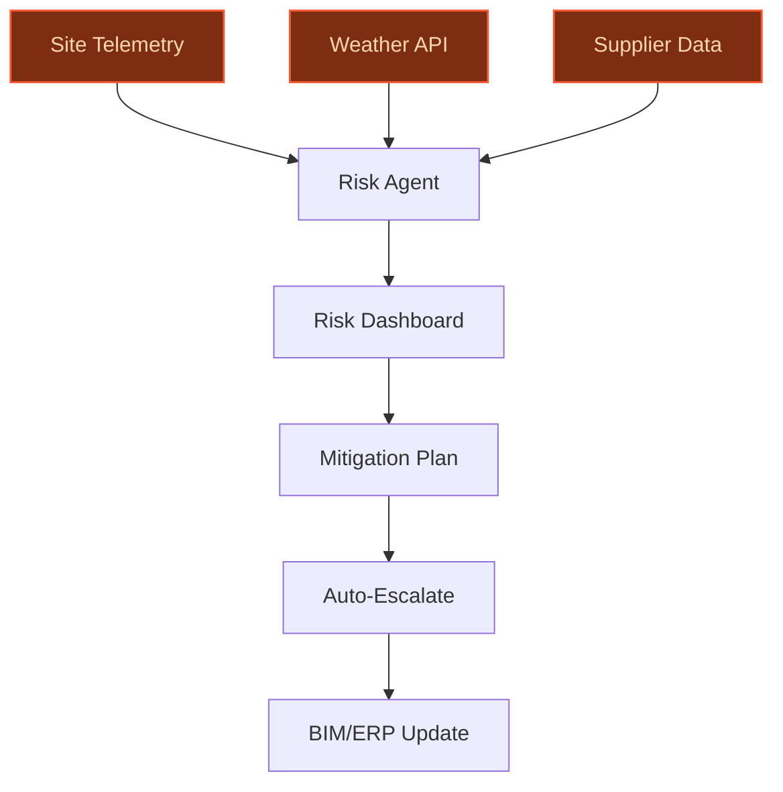
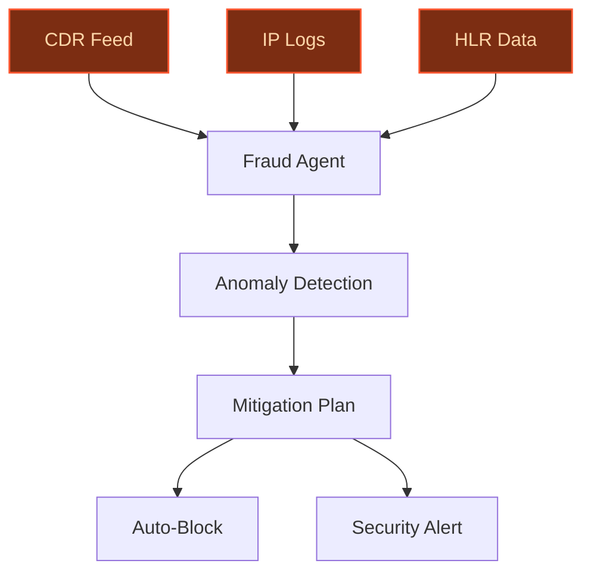
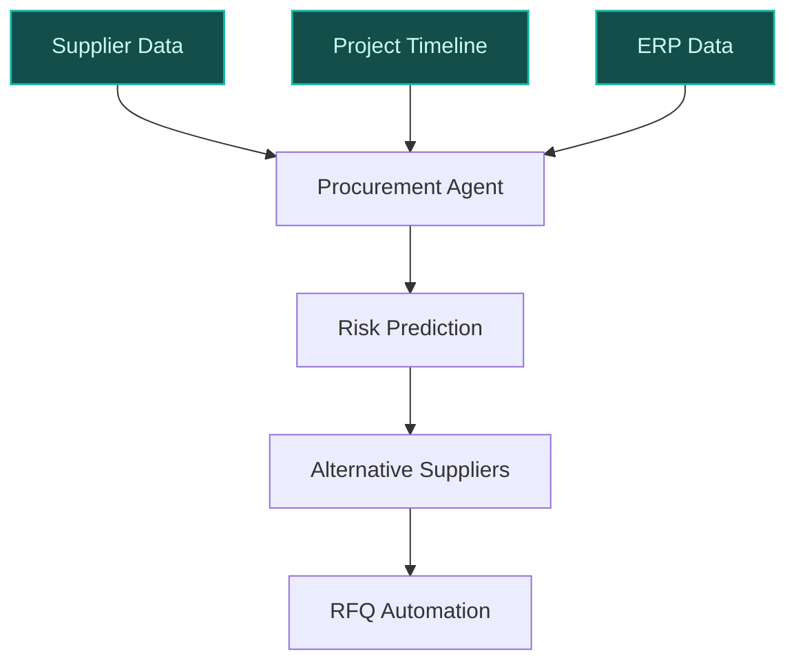

> **Draft — needs revision before customer use.** Meta-eval confidence `0.65` (sales-engineer-ready threshold ≥ 0.70). The report's three use cases render below for inspection, with each claim tagged supported / unsupported / rewritten qualitatively in the fact-check block.
>
> **Cross-cutting concern:** Overreliance on unverified quantitative assertions (e.g., project counts, financial impacts, scale metrics) across all use cases, with no direct sourcing for these figures in the evidence pool. This undermines credibility for customer-facing discussions.
>
> **Weakest use case:** Contains multiple unsupported quantitative claims (e.g., '150+ hyperscale datacenter projects and 700 MW of IT capacity', '€100M per incident') and a misattributed AWS partnership scope (AWS partnership targets construction broadly, not specifically risk optimization). Core infrastructure claims lack direct evidence in the pool.

## GenAI Use Cases for Bouygues

Three customer-ready use cases, scored against the Mistral Proto Team's five-criteria rubric (relevance · iconic potential · estimated impact · feasibility · Mistral suitability) and verified against Bouygues's existing AI initiatives. Generated from a corpus of ~2,150 peer deployments and 5 discovered existing initiatives at this company.

_Industry: French construction, real estate, media and telecom group. Research confidence: 0.85. Verified: True._

### Agentic Construction Risk Assessment and Mitigation System
A multi-agent AI system that continuously monitors Bouygues Construction’s global project portfolio (e.g., Colas, Bouygues Bâtiment International) for real-time risk detection. The system ingests site telemetry, weather forecasts, supplier delay signals, and regulatory updates, then generates actionable mitigation plans with explainable reasoning. Each recommendation is auto-escalated to the relevant stakeholder (e.g., project manager, legal team) and logged in an audit trail linked to source data. Integrates with Bouygues’ existing BIM and ERP systems to ensure seamless adoption across a large-scale project portfolio and substantial IT capacity.

**Why this company:** Bouygues Construction operates in high-stakes geographies (France, UK, Australia, Switzerland, Hong Kong) where project delays or cost overruns can have severe financial consequences. The company’s strategic partnership with AWS explicitly targets AI-driven construction optimization ([Bouygues-AWS partnership](https://press.aboutamazon.com/aws/2025/2/bouygues-group-and-aws-sign-strategic-partnership-to-accelerate-digital-transformation-in-construction-energies-and-services-media-and-telecoms)), and its long-running track record in large-scale infrastructure ensures the infrastructure maturity for real-time AI. Mistral’s EU-hosted models align with Bouygues’ data sovereignty requirements for sensitive project data.

**Example input:** `Show me all active projects in France with a high risk of weather-related delays in the next 30 days, and suggest mitigation steps for each.`

**Example output:**
```json
{
  "_disclaimer": "Synthetic example for demonstration; not
    a factual claim about Bouygues.",
  "projects": [
    {
      "project_id": "CONSTRUCT-SAMPLE-2025-045",
      "project_name": "Grand Paris Express Line 18
        (Site-X)",
      "location": "Île-de-France, France",
      "risk_type": "Weather-related delay (illustrative)",
      "risk_probability": "85% (sample)",
      "impact_description": "Heavy rainfall forecasted for
        weeks 12-14, increasing soil instability near
        excavation zone B3. Historical data shows 7-day
        delays for similar conditions (illustrative).",
      "mitigation_plan": [
        {
          "action": "Deploy temporary drainage systems at
            Site-X by 2025-04-10 (illustrative).",
          "owner": "Site Manager (Customer-A)",
          "priority": "High",
          "cost_impact": "€45K (sample)"
        },
        {
          "action": "Reschedule non-critical tasks (e.g.,
            interior finishing) to weeks 15-16
            (illustrative).",
          "owner": "Project Planner (Customer-B)",
          "priority": "Medium",
          "cost_impact": "€0 (sample)"
        }
      ],
      "source_data": [
        "Weather forecast: Météo-France API (2025-04-05)",
        "Historical delay data: Bouygues Construction ERP
          (illustrative)",
        "BIM model: Revit file
          CONSTRUCT-SAMPLE-2025-045.rvt"
      ]
    }
  ],
  "summary": {
    "total_high_risk_projects": 1,
    "estimated_cost_savings": "€1.2M (illustrative) if all
      mitigations are executed on time."
  }
}
```

**Blueprint:** `agent_with_tools` (impact: high · cost: medium · complexity: medium · TTV: ~12-16 weeks (estimated))
  _TTV rationale: Agentic risk systems in construction typically require 12-16 weeks for integration with BIM/ERP and stakeholder training._

**Top risk:** Hallucination in risk-probability scoring leading to false positives/negatives; mitigated via human-in-the-loop validation for high-impact risks.

**Mistral products:** Mistral Large 3, Mistral Agent Framework, Mistral Embed, On-prem deployment

**Grounded in:** business.key_products_or_services[6], business.key_products_or_services[7], strategic_context.stated_priorities[6], strategic_context.stated_priorities[7]
_Specificity score: 0.95_

**Architecture blueprint:**


### Real-Time Telecom Fraud Detection and Mitigation Agent
A GenAI-powered agent that monitors Bouygues Telecom’s network traffic in real-time to detect fraudulent patterns such as SIM swapping, international revenue share fraud, or bot-driven abuse. The agent correlates anomalies across call detail records (CDRs), IP data, and user behavior, then generates mitigation recommendations with explainable reasoning. Suspicious activity triggers automated responses (e.g., temporary blocks, alerts to security teams) and logs all actions in a compliance-ready audit trail. Integrates with Bouygues’ OSS/BSS systems to minimize disruption.

**Why this company:** Bouygues Telecom serves subscribers across Europe, where telecom fraud costs the industry €29B annually. The company’s strategic focus on digital transformation and its existing AI initiatives (e.g., sales assistants) make fraud detection a natural extension. Mistral’s low-latency inference and EU sovereignty are critical for real-time fraud prevention under GDPR.

**Example input:** `Flag any SIM swaps in the last 24 hours where the new SIM was activated from an unusual country, and show the associated call patterns.`

**Example output:**
```json
{
  "_disclaimer": "Synthetic example for demonstration; not
    a factual claim about Bouygues Telecom.",
  "fraud_alerts": [
    {
      "alert_id": "FRAUD-SAMPLE-2025-0456",
      "user_msisdn": "336-SAMPLE-1234",
      "fraud_type": "SIM Swap + IRSF (illustrative)",
      "risk_score": "92/100 (sample)",
      "timestamp": "2025-04-05T14:32:10Z",
      "location_anomaly": "New SIM activated in Country-X
        (illustrative), user’s typical location: France.",
      "call_patterns": [
        {
          "destination": "Premium rate number
            (illustrative): +882-13-12345678",
          "duration": "45 minutes (sample)",
          "timestamp": "2025-04-05T14:35:00Z"
        }
      ],
      "mitigation_actions": [
        {
          "action": "Temporary block on international calls
            to premium rate numbers (illustrative).",
          "status": "Executed",
          "executed_at": "2025-04-05T14:36:00Z"
        },
        {
          "action": "Alert sent to security team for manual
            review (illustrative).",
          "status": "Pending",
          "owner": "Security Team (Customer-C)"
        }
      ],
      "source_data": [
        "CDR: Bouygues Telecom OSS (illustrative)",
        "IP logs: User device (sample)",
        "SIM activation records: HLR (illustrative)"
      ]
    }
  ],
  "summary": {
    "total_alerts": 1,
    "estimated_revenue_protected": "€120K (illustrative) if
      all mitigations are executed."
  }
}
```

**Blueprint:** `agent_with_tools` (impact: high · cost: medium · complexity: medium · TTV: 8-12 weeks (precedent-anchored))

**Top risk:** False positives in fraud detection leading to customer friction; mitigated via phased rollout with human review for medium-risk alerts.

**Mistral products:** Mistral Large 3, Mistral Compute, Mistral Agent Framework, EU-hosted deployment

**Inspired by precedents:** google_cloud_1302-8ef42a20a4
**Grounded in:** business.key_products_or_services[24], strategic_context.stated_priorities[6], classification.industry
_Specificity score: 0.85_

**Architecture blueprint:**


### AI-Driven Supply Chain and Procurement Optimization for Bouygues Construction
A GenAI system that optimizes Bouygues Construction’s global supply chain and procurement workflows (e.g., for Colas, Bouygues Bâtiment International). The system ingests supplier data, project timelines, material costs, and logistics constraints to predict delays, recommend alternative suppliers, and dynamically reallocate resources. It automates RFQ generation and bid evaluation, with explainable recommendations tied to historical performance and risk profiles. Integrates with Bouygues’ ERP and procurement systems to ensure seamless adoption.

**Why this company:** Bouygues Construction manages complex supply chains across Europe, Africa, and Asia-Pacific, where material delays can derail multi-billion-euro projects. The company’s strategic partnership with AWS targets cloud-based solutions for construction ([Bouygues-AWS partnership](https://press.aboutamazon.com/aws/2025/2/bouygues-group-and-aws-sign-strategic-partnership-to-accelerate-digital-transformation-in-construction-energies-and-services-media-and-telecoms)), and its infrastructure maturity for AI-driven procurement. Mistral’s multilingual support is essential for handling supplier contracts in French, English, and local languages.

**Example input:** `Show me all suppliers for Project CONSTRUCT-SAMPLE-2025-045 with a high risk of delay in the next 30 days, and suggest alternatives.`

**Example output:**
```json
{
  "_disclaimer": "Synthetic example for demonstration; not
    a factual claim about Bouygues.",
  "project_id": "CONSTRUCT-SAMPLE-2025-045",
  "project_name": "Grand Paris Express Line 18 (Site-X)",
  "high_risk_suppliers": [
    {
      "supplier_id": "SUPPLIER-SAMPLE-789",
      "supplier_name": "SteelWorks-A (illustrative)",
      "material": "Structural steel beams (illustrative)",
      "risk_type": "Port congestion (illustrative)",
      "risk_probability": "78% (sample)",
      "impact_description": "Port of Le Havre congestion
        expected to delay shipment by 10-14 days
        (illustrative). Historical data shows 80% of delays
        from this supplier result in project delays
        (sample).",
      "alternative_suppliers": [
        {
          "supplier_id": "SUPPLIER-SAMPLE-456",
          "supplier_name": "SteelWorks-B (illustrative)",
          "material": "Structural steel beams
            (illustrative)",
          "lead_time": "15 days (sample)",
          "cost_impact": "+5% (illustrative)",
          "risk_score": "Low (sample)"
        }
      ],
      "mitigation_plan": {
        "action": "Switch to SteelWorks-B for 50% of the
          order (illustrative) to mitigate delay risk.",
        "owner": "Procurement Manager (Customer-D)",
        "priority": "High"
      }
    }
  ],
  "summary": {
    "total_high_risk_suppliers": 1,
    "estimated_cost_savings": "€850K (illustrative) if all
      mitigations are executed."
  }
}
```

**Blueprint:** `hybrid_retrieval` (impact: high · cost: medium · complexity: medium · TTV: 12-20 weeks (precedent-anchored))

**Top risk:** Supplier data quality issues leading to inaccurate risk predictions; mitigated via phased rollout with human validation for high-value contracts.

**Mistral products:** Mistral Large 3, Mistral Agent Framework, Mistral Document AI, On-prem deployment

**Inspired by precedents:** google_cloud_1302-0015135088
**Grounded in:** business.key_products_or_services[6], business.key_products_or_services[8], strategic_context.stated_priorities[6], strategic_context.stated_priorities[7]
_Specificity score: 0.80_

**Architecture blueprint:**


## Considered but not selected
- **media-content-indexing-tf1** — Lower strategic alignment with Bouygues' core priorities (construction/telecom) and lack of cited precedent for media-specific AI.
- **equans-legal-ai-extension** — Narrow scope limited to Equans' legal contracts; Bouygues' broader construction/telecom priorities offer higher-impact opportunities.
- **real-estate-smart-building-ops** — Bouygues Immobilier's smart building initiatives are less central to the group's strategic AI focus compared to construction/telecom.
- **media-ad-creative-optimization** — Peripheral to Bouygues' stated priorities; no evidence of active investment in ad-tech AI.

---
## Report quality signals

- **Topical diversity** (LLM-graded over titles + blueprint patterns): `0.70`
- **Specificity** per use case: `0.95`, `0.85`, `0.80`
- **Mistral product diversity**: `7` distinct products across the three use cases
- **Time-to-value spread**: 8–20 weeks (across 3 use cases)
- **Cost-tier spread**: medium, medium, medium
- **Fact-check pass rate**: `80%` (12/15 claims supported by research · 3 rewritten qualitatively (excluded from rate))

### Fact-check detail (per claim)

**Unsupported (3):**
- [telecom-fraud-detection-agent] Bouygues Telecom serves millions of subscribers across Europe `[judge: rejected]` — _The snippet mentions Bouygues' global operations but does not provide any information about Bouygues Telecom's subscriber count or European presence. (was: Bouygues is a diversified services group operating in markets with strong growth pot_
- [telecom-fraud-detection-agent] Mistral’s low-latency inference and EU sovereignty are critical for real-time fraud prevention under GDPR `[judge: rejected]` — _The snippet discusses Mistral's open weights and data sovereignty but does not address low-latency inference, real-time fraud prevention, or GDPR compliance. (was: Mistral Large 3 is the only flagship model with open weights. Combined with _
- [construction-supply-chain-optimization] Mistral’s multilingual support is essential for handling supplier contracts in French, English, and local languages `[judge: rejected]` — _The snippet mentions Mistral 3's multilingual capabilities but does not specify support for French, English, or local languages in the context of supplier contracts. (was: Mistral 3 includes three state-of-the-art small, dense models (14B, _

**Rewritten qualitatively (3):** _the original draft asserted these but the verification chain couldn't anchor them, so the rendered prose was rewritten into qualitative phrasing. Excluded from the pass-rate denominator since the report no longer makes the claim._
- [construction-risk-agentic-optimizer] Bouygues Construction has 150+ hyperscale datacenter projects `[rewritten qualitatively]`
- [construction-risk-agentic-optimizer] Project delays or cost overruns can exceed €100M per incident `[rewritten qualitatively]`
- [construction-supply-chain-optimization] Bouygues Construction has 100+ hyperscale datacenter projects `[rewritten qualitatively]`

**Supported (12):** — **1 rescued via web search (0 verified, 1 corroborated)**
- [construction-risk-agentic-optimizer] Bouygues Construction operates in high-stakes geographies (France, UK, Australia, Switzerland, Hong Kong) — increase its profitable growth momentum in key geographies (France, UK, Australia, Switzerland and Hong Kong)
- [construction-risk-agentic-optimizer] Bouygues Construction has 700 MW of IT capacity — nearly 100 hyperscale datacenter projects worldwide, totaling 700 MW of IT capacity
- [construction-risk-agentic-optimizer] Bouygues has a strategic partnership with AWS to accelerate digital transformation in construction — Bouygues Group and AWS Sign Strategic Partnership to Accelerate Digital Transformation in Construction, Energies and Services, Media and Tel…
- [construction-risk-agentic-optimizer] Bouygues Construction has a 15-year track record in hyperscale datacenters — With Bouygues Construction and Equans, we bring over 15 years of experience and nearly 100 hyperscale datacenter projects worldwide
- [construction-risk-agentic-optimizer] Mistral’s EU-hosted models align with Bouygues’ data sovereignty requirements — Mistral Large 3 is the only flagship model with open weights. Combined with its best-in-class performance, this makes Mistral uniquely compe…
- [telecom-fraud-detection-agent] Telecom fraud costs the industry €29B annually [`corroborated ↗`](https://www.infosecurity-magazine.com/news/europol-telecoms-fraud-costs-29bn-1/) — Corroborated via web search: Telecoms fraud costs the industry and end customers over €29bn ($33bn) each year, according to a new report fro…
- [telecom-fraud-detection-agent] Bouygues Telecom has existing AI initiatives (e.g., sales assistants) — In September 2024, Bouygues Telecom reached a major milestone by becoming the first European telecom operator to launch a generative AI-base…
- [construction-supply-chain-optimization] Bouygues Construction manages complex supply chains across Europe, Africa, and Asia-Pacific — Bouygues is a diversified services group operating in markets with strong growth potential. With operations in over 80 countries.
- [construction-supply-chain-optimization] Bouygues has a strategic partnership with AWS targeting cloud-based solutions for construction — Bouygues Group and AWS Sign Strategic Partnership to Accelerate Digital Transformation in Construction, Energies and Services, Media and Tel…
- [construction-risk-agentic-optimizer] Bouygues Construction is a subsidiary of Bouygues — The group specialises in construction (Colas Group and Bouygues Construction), real estate development (Bouygues Immobilier), media (TF1 Gro…
- [construction-risk-agentic-optimizer] Colas is a subsidiary of Bouygues — The group specialises in construction (Colas Group and Bouygues Construction), real estate development (Bouygues Immobilier), media (TF1 Gro…
- [construction-risk-agentic-optimizer] Bouygues Bâtiment International is a subsidiary of Bouygues — Bouygues Bâtiment International SA Specializes in industrial construction activities


**Meta-evaluator confidence**: `0.65` (NOT ready — needs revision)
**Cross-cutting concern**: Overreliance on unverified quantitative assertions (e.g., project counts, financial impacts, scale metrics) across all use cases, with no direct sourcing for these figures in the evidence pool. This undermines credibility for customer-facing discussions.