# Trace

## Execution trace — Bouygues

Started: `2026-05-11T01:11:36.533538+00:00`. Total wall time: `162.9s` across `48` recorded actions.

### Per-step time totals

| Step | Calls | Total time | Avg time |
|---|---:|---:|---:|
| `research` | 1 | 8.46s | 8457ms |
| `gap_fill` | 4 | 7.19s | 1798ms |
| `retrieve` | 2 | 0.26s | 132ms |
| `generate` | 2 | 26.06s | 13028ms |
| `generate.web_search` | 2 | 4.69s | 2347ms |
| `score` | 2 | 24.88s | 12441ms |
| `verify` | 6 | 15.20s | 2534ms |
| `enrich` | 1 | 57.79s | 57793ms |
| `polish` | 2 | 4.30s | 2148ms |
| `meta_eval` | 1 | 11.69s | 11692ms |
| `web_verify` | 1 | 2.63s | 2626ms |
| `source_judge` | 19 | 23.47s | 1235ms |
| `final_qualify` | 3 | 4.82s | 1605ms |
| `quality_signals` | 2 | 3.80s | 1898ms |

### Chronological event log

- `01:11:38.203` **[research]** `mistral-medium-2604.chat.complete` — 8457ms
   - inputs: synthesize CompanyContext for Bouygues | depth=medium
   - outputs: industry='French construction, real estate, media and telecom group' verified=True conf=0.75
- `01:11:46.661` **[gap_fill]** `mistral-small-2603.chat.complete` — 921ms
   - inputs: generate gap queries | fields=['business_model', 'products', 'data_assets', 'priorities']
   - outputs: queries=4
- `01:11:52.691` **[gap_fill]** `mistral-small-2603.chat.complete` — 2219ms
   - inputs: layer-2 extract field=priorities
   - outputs: items=8
- `01:11:52.695` **[gap_fill]** `mistral-small-2603.chat.complete` — 1163ms
   - inputs: layer-2 extract field=data_assets
   - outputs: items=0
- `01:11:52.698` **[gap_fill]** `mistral-small-2603.chat.complete` — 2889ms
   - inputs: layer-2 extract field=products
   - outputs: items=34
- `01:11:55.589` **[retrieve]** `mistral-embed.embeddings.create` — 261ms
   - inputs: company_query | industries='French construction, real estate, media and telecom group'
   - outputs: embedded 1024-dim query vector
- `01:11:55.850` **[retrieve]** `precedent_corpus.cosine_topk` — 3ms
   - inputs: k=8 min_depth=0.4 target='Bouygues'
   - outputs: retrieved 8 | mmr=True | top_sim=0.758
- `01:11:57.591` **[generate]** `mistral-medium-2604.chat.complete` — 1742ms
   - inputs: iteration=0 tool_calls_used=0/2 tools=on
   - outputs: tool_calls=4 | content_chars=0
- `01:11:59.348` **[generate.web_search]** `tavily.search` — 2494ms
   - inputs: query='Bouygues Construction digital transformation projects 2024 2025'
   - outputs: 2 raw results
- `01:12:03.424` **[generate.web_search]** `tavily.search` — 2201ms
   - inputs: query='Bouygues Telecom cloud adoption and AI initiatives 2024 2025'
   - outputs: 2 raw results
- `01:12:08.709` **[generate]** `mistral-medium-2604.chat.complete` — 24314ms
   - inputs: iteration=1 tool_calls_used=2/2 tools=off
   - outputs: tool_calls=0 | content_chars=16803
- `01:12:33.236` **[score]** `mistral-small-2603.chat.complete` — 13054ms
   - inputs: self-consistency pass T=0.2
   - outputs: scored 8 candidates
- `01:12:33.246` **[score]** `mistral-small-2603.chat.complete` — 11828ms
   - inputs: self-consistency pass T=0.4
   - outputs: scored 8 candidates
- `01:12:46.319` **[verify]** `tavily.search` — 2301ms
   - inputs: candidate=construction-risk-agentic-optimizer | query='Bouygues Agentic Construction Risk Assessment and Mitigation'
   - outputs: 4 results
- `01:12:46.319` **[verify]** `tavily.search` — 2141ms
   - inputs: candidate=telecom-fraud-detection-agent | query='Bouygues Real-Time Telecom Fraud Detection and Mitigation Ag'
   - outputs: 4 results
- `01:12:46.319` **[verify]** `tavily.search` — 2430ms
   - inputs: candidate=construction-supply-chain-optimization | query='Bouygues AI-Driven Supply Chain and Procurement Optimization'
   - outputs: 4 results
- `01:12:48.577` **[verify]** `mistral-small-2603.chat.complete` — 1538ms
   - inputs: verdict for telecom-fraud-detection-agent
   - outputs: verdict='pass'
- `01:12:48.900` **[verify]** `mistral-small-2603.chat.complete` — 3003ms
   - inputs: verdict for construction-risk-agentic-optimizer
   - outputs: verdict='pass'
- `01:12:49.479` **[verify]** `mistral-small-2603.chat.complete` — 3792ms
   - inputs: verdict for construction-supply-chain-optimization
   - outputs: verdict='pass'
- `01:12:53.273` **[enrich]** `mistral-large-2512.chat.complete` — 57793ms
   - inputs: tier=standard parallel=False ids=['construction-risk-agentic-optimizer', 'telecom-fraud-detection-agent', 'construction-supply-chain-optimization']
   - outputs: enriched 3 use cases
- `01:13:51.087` **[polish]** `mistral-small-2603.chat.complete` — 2150ms
   - inputs: use_case=construction-risk-agentic-optimizer unanchored=True opaque_ev=False
   - outputs: polished 5 fields
- `01:13:51.092` **[polish]** `mistral-small-2603.chat.complete` — 2145ms
   - inputs: use_case=telecom-fraud-detection-agent unanchored=True opaque_ev=False
   - outputs: polished 5 fields
- `01:13:53.239` **[meta_eval]** `mistral-medium-2604.chat.complete` — 11692ms
   - inputs: reviewing 3 use cases
   - outputs: review + claims
- `01:14:04.945` **[web_verify]** `tavily.search.rescue_unsupported_claims` — 2626ms
   - inputs: company='Bouygues' unsupported=4 budget=12
   - outputs: rescued: verified=3 corroborated=1 of 4 attempted
- `01:14:07.573` **[source_judge]** `mistral-small-2603.judge_claim_sources` — 5752ms
   - inputs: pairs=18
   - outputs: judged 18 pairs
- `01:14:07.573` **[source_judge]** `mistral-small-2603.chat.complete` — 617ms
   - inputs: claim='Bouygues Construction operates in high-stakes geographies (F'
   - outputs: verdict=supported
- `01:14:07.575` **[source_judge]** `mistral-small-2603.chat.complete` — 1001ms
   - inputs: claim='Bouygues Construction has 150+ hyperscale datacenter project'
   - outputs: verdict=unsupported
- `01:14:07.578` **[source_judge]** `mistral-small-2603.chat.complete` — 751ms
   - inputs: claim='Bouygues Construction has 700 MW of IT capacity'
   - outputs: verdict=supported
- `01:14:07.583` **[source_judge]** `mistral-small-2603.chat.complete` — 837ms
   - inputs: claim='Project delays or cost overruns can exceed €100M per inciden'
   - outputs: verdict=unsupported
- `01:14:07.585` **[source_judge]** `mistral-small-2603.chat.complete` — 5739ms
   - inputs: claim='Bouygues has a strategic partnership with AWS to accelerate '
   - outputs: verdict=supported
- `01:14:07.588` **[source_judge]** `mistral-small-2603.chat.complete` — 842ms
   - inputs: claim='Bouygues Construction has a 15-year track record in hypersca'
   - outputs: verdict=supported
- `01:14:07.590` **[source_judge]** `mistral-small-2603.chat.complete` — 879ms
   - inputs: claim='Mistral’s EU-hosted models align with Bouygues’ data soverei'
   - outputs: verdict=supported
- `01:14:07.593` **[source_judge]** `mistral-small-2603.chat.complete` — 845ms
   - inputs: claim='Bouygues Telecom serves millions of subscribers across Europ'
   - outputs: verdict=unsupported
- `01:14:08.190` **[source_judge]** `mistral-small-2603.chat.complete` — 578ms
   - inputs: claim='Telecom fraud costs the industry €29B annually'
   - outputs: verdict=supported
- `01:14:08.329` **[source_judge]** `mistral-small-2603.chat.complete` — 576ms
   - inputs: claim='Bouygues Telecom has existing AI initiatives (e.g., sales as'
   - outputs: verdict=supported
- `01:14:08.420` **[source_judge]** `mistral-small-2603.chat.complete` — 722ms
   - inputs: claim='Mistral’s low-latency inference and EU sovereignty are criti'
   - outputs: verdict=unsupported
- `01:14:08.430` **[source_judge]** `mistral-small-2603.chat.complete` — 578ms
   - inputs: claim='Bouygues Construction manages complex supply chains across E'
   - outputs: verdict=supported
- `01:14:08.438` **[source_judge]** `mistral-small-2603.chat.complete` — 707ms
   - inputs: claim='Bouygues Construction has 100+ hyperscale datacenter project'
   - outputs: verdict=unsupported
- `01:14:08.470` **[source_judge]** `mistral-small-2603.chat.complete` — 673ms
   - inputs: claim='Bouygues has a strategic partnership with AWS targeting clou'
   - outputs: verdict=supported
- `01:14:08.576` **[source_judge]** `mistral-small-2603.chat.complete` — 644ms
   - inputs: claim='Mistral’s multilingual support is essential for handling sup'
   - outputs: verdict=unsupported
- `01:14:08.768` **[source_judge]** `mistral-small-2603.chat.complete` — 523ms
   - inputs: claim='Bouygues Construction is a subsidiary of Bouygues'
   - outputs: verdict=supported
- `01:14:08.905` **[source_judge]** `mistral-small-2603.chat.complete` — 543ms
   - inputs: claim='Colas is a subsidiary of Bouygues'
   - outputs: verdict=supported
- `01:14:09.008` **[source_judge]** `mistral-small-2603.chat.complete` — 660ms
   - inputs: claim='Bouygues Bâtiment International is a subsidiary of Bouygues'
   - outputs: verdict=supported
- `01:14:13.325` **[final_qualify]** `mistral-small-2603.chat.complete` — 1815ms
   - inputs: use_case=construction-risk-agentic-optimizer unsupported=2
   - outputs: qualified 4 fields
- `01:14:13.329` **[final_qualify]** `mistral-small-2603.chat.complete` — 1362ms
   - inputs: use_case=telecom-fraud-detection-agent unsupported=1
   - outputs: qualified 4 fields
- `01:14:13.331` **[final_qualify]** `mistral-small-2603.chat.complete` — 1639ms
   - inputs: use_case=construction-supply-chain-optimization unsupported=1
   - outputs: qualified 4 fields
- `01:14:15.601` **[quality_signals]** `mistral-small-2603.chat.complete` — 2363ms
   - inputs: specificity grade (3 use cases)
   - outputs: scored 3 use cases
- `01:14:17.963` **[quality_signals]** `mistral-small-2603.chat.complete` — 1433ms
   - inputs: diversity grade
   - outputs: diversity=0.7

## Mermaid sequence

```mermaid
sequenceDiagram
    autonumber
    participant pipeline as pipeline
    participant mistral_medium_2604 as mistral-medium-2604
    participant mistral_small_2603 as mistral-small-2603
    participant mistral_embed as mistral-embed
    participant precedent_corpus as precedent_corpus
    participant tavily as tavily
    participant mistral_large_2512 as mistral-large-2512
    participant tavily_search as tavily.search
    pipeline->>mistral_medium_2604: research: chat.complete (8457ms)
    mistral_medium_2604-->>pipeline: industry='French construction, real estate, media and teleco
    pipeline->>mistral_small_2603: gap_fill: chat.complete (921ms)
    mistral_small_2603-->>pipeline: queries=4
    pipeline->>mistral_small_2603: gap_fill: chat.complete (2219ms)
    mistral_small_2603-->>pipeline: items=8
    pipeline->>mistral_small_2603: gap_fill: chat.complete (1163ms)
    mistral_small_2603-->>pipeline: items=0
    pipeline->>mistral_small_2603: gap_fill: chat.complete (2889ms)
    mistral_small_2603-->>pipeline: items=34
    pipeline->>mistral_embed: retrieve: embeddings.create (261ms)
    mistral_embed-->>pipeline: embedded 1024-dim query vector
    pipeline->>precedent_corpus: retrieve: cosine_topk (3ms)
    precedent_corpus-->>pipeline: retrieved 8 | mmr=True | top_sim=0.758
    pipeline->>mistral_medium_2604: generate: chat.complete (1742ms)
    mistral_medium_2604-->>pipeline: tool_calls=4 | content_chars=0
    pipeline->>tavily: generate.web_search: search (2494ms)
    tavily-->>pipeline: 2 raw results
    pipeline->>tavily: generate.web_search: search (2201ms)
    tavily-->>pipeline: 2 raw results
    pipeline->>mistral_medium_2604: generate: chat.complete (24314ms)
    mistral_medium_2604-->>pipeline: tool_calls=0 | content_chars=16803
    pipeline->>mistral_small_2603: score: chat.complete (13054ms)
    mistral_small_2603-->>pipeline: scored 8 candidates
    pipeline->>mistral_small_2603: score: chat.complete (11828ms)
    mistral_small_2603-->>pipeline: scored 8 candidates
    pipeline->>tavily: verify: search (2301ms)
    tavily-->>pipeline: 4 results
    pipeline->>tavily: verify: search (2141ms)
    tavily-->>pipeline: 4 results
    pipeline->>tavily: verify: search (2430ms)
    tavily-->>pipeline: 4 results
    pipeline->>mistral_small_2603: verify: chat.complete (1538ms)
    mistral_small_2603-->>pipeline: verdict='pass'
    pipeline->>mistral_small_2603: verify: chat.complete (3003ms)
    mistral_small_2603-->>pipeline: verdict='pass'
    pipeline->>mistral_small_2603: verify: chat.complete (3792ms)
    mistral_small_2603-->>pipeline: verdict='pass'
    pipeline->>mistral_large_2512: enrich: chat.complete (57793ms)
    mistral_large_2512-->>pipeline: enriched 3 use cases
    pipeline->>mistral_small_2603: polish: chat.complete (2150ms)
    mistral_small_2603-->>pipeline: polished 5 fields
    pipeline->>mistral_small_2603: polish: chat.complete (2145ms)
    mistral_small_2603-->>pipeline: polished 5 fields
    pipeline->>mistral_medium_2604: meta_eval: chat.complete (11692ms)
    mistral_medium_2604-->>pipeline: review + claims
    pipeline->>tavily_search: web_verify: rescue_unsupported_claims (2626ms)
    tavily_search-->>pipeline: rescued: verified=3 corroborated=1 of 4 attempted
    pipeline->>mistral_small_2603: source_judge: judge_claim_sources (5752ms)
    mistral_small_2603-->>pipeline: judged 18 pairs
    pipeline->>mistral_small_2603: source_judge: chat.complete (617ms)
    mistral_small_2603-->>pipeline: verdict=supported
    pipeline->>mistral_small_2603: source_judge: chat.complete (1001ms)
    mistral_small_2603-->>pipeline: verdict=unsupported
    pipeline->>mistral_small_2603: source_judge: chat.complete (751ms)
    mistral_small_2603-->>pipeline: verdict=supported
    pipeline->>mistral_small_2603: source_judge: chat.complete (837ms)
    mistral_small_2603-->>pipeline: verdict=unsupported
    pipeline->>mistral_small_2603: source_judge: chat.complete (5739ms)
    mistral_small_2603-->>pipeline: verdict=supported
    pipeline->>mistral_small_2603: source_judge: chat.complete (842ms)
    mistral_small_2603-->>pipeline: verdict=supported
    pipeline->>mistral_small_2603: source_judge: chat.complete (879ms)
    mistral_small_2603-->>pipeline: verdict=supported
    pipeline->>mistral_small_2603: source_judge: chat.complete (845ms)
    mistral_small_2603-->>pipeline: verdict=unsupported
    pipeline->>mistral_small_2603: source_judge: chat.complete (578ms)
    mistral_small_2603-->>pipeline: verdict=supported
    pipeline->>mistral_small_2603: source_judge: chat.complete (576ms)
    mistral_small_2603-->>pipeline: verdict=supported
    pipeline->>mistral_small_2603: source_judge: chat.complete (722ms)
    mistral_small_2603-->>pipeline: verdict=unsupported
    pipeline->>mistral_small_2603: source_judge: chat.complete (578ms)
    mistral_small_2603-->>pipeline: verdict=supported
    pipeline->>mistral_small_2603: source_judge: chat.complete (707ms)
    mistral_small_2603-->>pipeline: verdict=unsupported
    pipeline->>mistral_small_2603: source_judge: chat.complete (673ms)
    mistral_small_2603-->>pipeline: verdict=supported
    pipeline->>mistral_small_2603: source_judge: chat.complete (644ms)
    mistral_small_2603-->>pipeline: verdict=unsupported
    pipeline->>mistral_small_2603: source_judge: chat.complete (523ms)
    mistral_small_2603-->>pipeline: verdict=supported
    pipeline->>mistral_small_2603: source_judge: chat.complete (543ms)
    mistral_small_2603-->>pipeline: verdict=supported
    pipeline->>mistral_small_2603: source_judge: chat.complete (660ms)
    mistral_small_2603-->>pipeline: verdict=supported
    pipeline->>mistral_small_2603: final_qualify: chat.complete (1815ms)
    mistral_small_2603-->>pipeline: qualified 4 fields
    pipeline->>mistral_small_2603: final_qualify: chat.complete (1362ms)
    mistral_small_2603-->>pipeline: qualified 4 fields
    pipeline->>mistral_small_2603: final_qualify: chat.complete (1639ms)
    mistral_small_2603-->>pipeline: qualified 4 fields
    pipeline->>mistral_small_2603: quality_signals: chat.complete (2363ms)
    mistral_small_2603-->>pipeline: scored 3 use cases
    pipeline->>mistral_small_2603: quality_signals: chat.complete (1433ms)
    mistral_small_2603-->>pipeline: diversity=0.7
```

