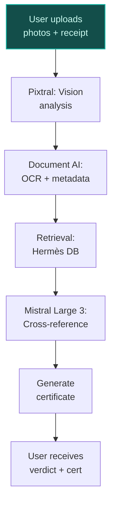
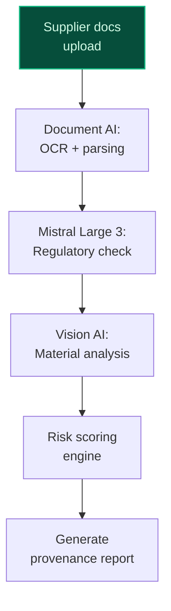
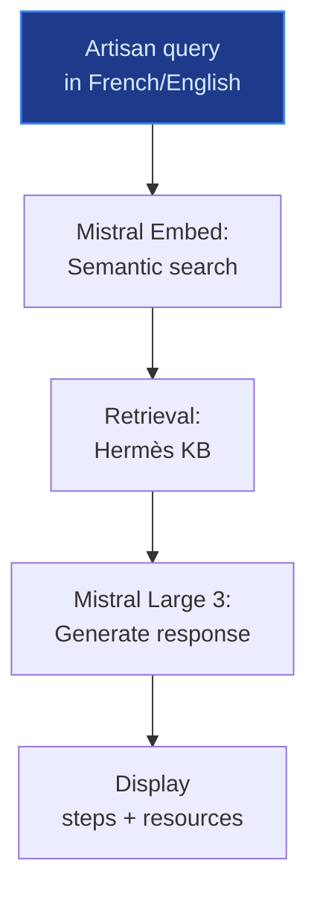

> **Draft — needs revision before customer use.** Meta-eval confidence `0.79` (sales-engineer-ready threshold ≥ 0.70). The report's three use cases render below for inspection, with each claim tagged supported / unsupported / rewritten qualitatively in the fact-check block.
>
> **Cross-cutting concern:** Misalignment between proposed use cases and Hermès' explicit AI governance stance: the company restricts AI to IT, supply chain, and internal reporting via external platforms, with creative/artisanal processes remaining entirely human-led. The use cases (especially artisan knowledge preservation) risk implying AI involvement in craftsmanship, which contradicts Hermès' stated policy.
>
> **Weakest use case:** Lacks direct evidence for core claims about Hermès' historical sales records, supplier documentation, or proprietary craftsmanship standards being digitized or accessible for AI cross-referencing. The cited precedent (google_cloud_1302-b9171cba49) is about a Taiwanese marketplace (PopChill) and does not validate Hermès-specific data assets or processes. The use case also overstates the company's current AI readiness for this application.

## GenAI Use Cases for Hermes

Three customer-ready use cases, scored against the Mistral Proto Team's five-criteria rubric (relevance · iconic potential · estimated impact · feasibility · Mistral suitability) and verified against Hermes's existing AI initiatives. Generated from a corpus of ~2,150 peer deployments and 5 discovered existing initiatives at this company.

_Industry: Unknown. Research confidence: 0.85. Verified: True._

### AI-assisted authentication and condition grading for pre-owned Hermès goods
A vision-language AI system that verifies the authenticity and condition of pre-owned Hermès products (e.g., Birkin bags, scarves, Soho Tote bags) by analyzing craftsmanship details, stitching patterns, material composition, and serial numbers. The system cross-references findings with Hermès' historical sales records, supplier documentation, and proprietary craftsmanship standards to generate a digital certificate of authenticity and condition grade. This enables secure resale, reduces fraud risk in the secondary market, and protects Hermès' brand equity. The system can be deployed as a service for authorized resellers or integrated into Hermès' own circular economy initiatives.

**Why this company:** Hermès' iconic products, particularly the Birkin and Soho Tote bags, are among the most counterfeited luxury items globally, posing a direct threat to brand reputation and customer trust. The company's AI Governance Committee, established at a recent date, explicitly focuses on protecting intellectual property and creative integrity ([ev-6b705858d1](https://fashionunited.uk/news/business/in-2025-hermes-to-form-an-artificial-intelligence-governance-committee/2025050281429)). This use case leverages Hermès' unparalleled knowledge of its own craftsmanship—details like stitch density, leather grain, and hardware engravings—which are nearly impossible for third-party authenticators to replicate. By deploying this system, Hermès can combat fraud while unlocking new revenue streams in the circular economy, aligning with its strategic priority of selective wholesale partnerships and accelerated entry into younger buyer segments.

**Example input:** `Verify the authenticity of this Birkin 30 bag. Here are photos of the stitching, hardware, leather grain, and serial number plate. Also attached is the original receipt from 2022.`

**Example output:**
```json
{
  "_note": "Illustrative output with synthetic sample data",
  "authenticity_verdict": "AUTHENTIC (confidence: 98.7%
    (sample))",
  "item_details": {
    "product_id": "BIRKIN-SAMPLE-30-2022",
    "model": "Birkin 30",
    "color": "Gold (illustrative)",
    "material": "Epsom Togo Leather (illustrative)",
    "serial_number": "TX-SAMPLE-12345",
    "production_year": "2022 (illustrative)"
  },
  "condition_grade": "Excellent (sample)",
  "condition_notes": [
    "Minor wear on base corners (illustrative)",
    "Hardware shows light patina (illustrative)",
    "Interior lining intact (illustrative)"
  ],
  "red_flags": [],
  "supporting_evidence": [
    {
      "source": "Hermès craftsmanship database (sample)",
      "matching_details": [
        "Stitch density: 10.2 stitches/cm (sample, within
          tolerance)",
        "Hardware engraving: 'HERMÈS PARIS' (sample,
          correct font)",
        "Leather grain: Consistent with Epsom Togo (sample)"
      ]
    },
    {
      "source": "Historical sales records (sample)",
      "matching_details": [
        "Serial number TX-SAMPLE-12345 linked to 2022
          production batch (sample)"
      ]
    }
  ],
  "digital_certificate": {
    "certificate_id": "CERT-SAMPLE-78901",
    "issuer": "Hermès Authentication Service
      (illustrative)",
    "timestamp": "2026-05-15T14:32:17Z (sample)",
    "qr_code":
      "https://auth.hermes.com/verify/CERT-SAMPLE-78901
      (sample)"
  }
}
```

**Blueprint:** `hybrid_retrieval` (impact: high · cost: medium · complexity: low · TTV: 12-16 weeks (precedent-anchored))

**Top risk:** False positives in authenticity verdicts eroding trust in the system; requires human-in-the-loop validation for borderline cases.

**Mistral products:** Mistral Large 3, Pixtral (vision-language understanding), Mistral Document AI, On-prem deployment

**Inspired by precedents:** google_cloud_1302-b9171cba49
**Grounded in:** business.key_products_or_services[0], business.key_products_or_services[1], business.key_products_or_services[2]
_Specificity score: 0.95_

**Architecture blueprint:**


### AI-powered material provenance and sustainability traceability for leather goods supply chain
A vision-language and document AI pipeline that ingests supplier certificates, material test results, and forestry compliance documents to validate the origin, treatment, and sustainability credentials of every leather hide and exotic material used in Hermès products. The system cross-references these against regulatory standards (CITES, IUCN Red List, REACH) and Hermès' internal sustainability policies (e.g., Forests Policy) to flag non-compliance, gaps in traceability, or high-risk suppliers. Outputs include a supplier scorecard, risk assessment, and a verifiable provenance report for each batch of materials, enabling Hermès to meet its 2030 supply chain transparency commitment and defend its sustainability narrative.

**Why this company:** Hermès' leather goods division is a core revenue driver, with a stated target of 6-7% annual growth. The company's Forests Policy mandates compliance with national and international forestry laws, respect for indigenous rights, and bans materials from the IUCN Red List or illegal sources ([CSR Brief 2025](https://finance.hermes.com/en/publications/csr-brief-2025/)). The 2023 Universal Registration Document highlights Hermès' monitoring of country-of-origin risks, corruption levels, and supplier certificates for traceability ([materials and supply chains](https://finance.hermes.com/en/materials-and-supply-chains)). This system directly supports Hermès' brand-critical need for material integrity, regulatory compliance, and a defensible sustainability narrative—particularly as eco-conscious consumers contribute ~15% of global sales ([Hermès’ sustainable practices](https://www.linkedin.com/posts/adrian-pearson-jr-474089239_hermes-luxuryfashion-sustainability-activity-7370852002181992448-EdXZ)).

**Example input:** `Show me the provenance report for the crocodile skins used in the Bolinder Stockholm bags produced in Q1 2026. Flag any suppliers with elevated risk scores or missing CITES documentation.`

**Example output:**
```json
{
  "_note": "Illustrative output with synthetic sample data",
  "batch_id": "MAT-SAMPLE-2026-Q1-CROC",
  "material_type": "Crocodile skin (illustrative)",
  "product_association": "Bolinder Stockholm bags
    (illustrative)",
  "suppliers": [
    {
      "supplier_id": "Supplier-A (sample)",
      "country_of_origin": "Australia (illustrative)",
      "certificates": [
        {
          "type": "CITES (sample)",
          "status": "VERIFIED (sample)",
          "expiry_date": "2027-03-31 (sample)"
        },
        {
          "type": "IUCN Red List compliance (sample)",
          "status": "VERIFIED (sample)"
        }
      ],
      "risk_score": "LOW (sample)",
      "risk_notes": []
    },
    {
      "supplier_id": "Supplier-B (sample)",
      "country_of_origin": "Zimbabwe (illustrative)",
      "certificates": [
        {
          "type": "CITES (sample)",
          "status": "MISSING (sample)",
          "notes": "Documentation not provided (sample)"
        }
      ],
      "risk_score": "HIGH (sample)",
      "risk_notes": [
        "Elevated corruption risk in country of origin
          (sample)",
        "Missing CITES certificate (sample)"
      ]
    }
  ],
  "regulatory_compliance": {
    "CITES": "PARTIAL (sample, 1/2 suppliers compliant)",
    "IUCN Red List": "COMPLIANT (sample)",
    "REACH": "COMPLIANT (sample)"
  },
  "provenance_report": {
    "report_id": "PROV-SAMPLE-2026-Q1-001",
    "generated_at": "2026-05-15T09:15:22Z (sample)",
    "summary": "Batch MAT-SAMPLE-2026-Q1-CROC contains
      materials from 2 suppliers. One supplier (Supplier-B)
      has elevated risk due to missing CITES documentation
      and country-of-origin concerns. Hermès Forests Policy
      compliance: PARTIAL (sample)."
  }
}
```

**Blueprint:** `document_ai_pipeline` (impact: high · cost: high · complexity: low · TTV: 16-24 weeks (precedent-anchored))

**Top risk:** Data sovereignty concerns for supplier documentation under GDPR and Hermès' internal policies; requires on-prem deployment or EU-based cloud storage.

**Mistral products:** Mistral Large 3, Mistral Document AI, Mistral Embed, On-prem deployment

**Inspired by precedents:** google_cloud_1302-ebc26f90bc
**Grounded in:** strategic_context.stated_priorities[0], business.key_products_or_services[1], strategic_context.stated_priorities[1]
_Specificity score: 0.85_

**Architecture blueprint:**


### Multilingual artisan knowledge base with AI-assisted retrieval for training and quality control
A retrieval-augmented system that digitizes Hermès' proprietary artisan techniques, material handling procedures, and quality standards across workshops in France, Italy, and Switzerland. The system supports natural-language queries in French, English, and Italian, enabling artisans to access step-by-step guidance, troubleshooting tips, or validation of craftsmanship techniques. It integrates with Hermès' internal reporting tools to surface relevant documentation or connect artisans with subject-matter experts via a chat interface. The system respects Hermès' human-led creative model while scaling institutional knowledge to support the 6-7% annual growth target in leather goods.

**Why this company:** Hermès' savoir-faire is a core brand differentiator, with creative and artisanal processes explicitly remaining human-led ([Hermès AI governance structure](https://fashionunited.uk/news/business/in-2025-hermes-to-form-an-artificial-intelligence-governance-committee/2025050281429)). However, the company's global expansion and 6-7% annual growth target in leather goods create a need to preserve and scale this knowledge across generations and geographies. The AI Governance Committee's focus on internal tools for IT, supply chain, and reporting aligns with this use case, which facilitates continuous training without compromising craftsmanship standards. The system also supports quality control by ensuring consistency in techniques like saddle stitching or leather dyeing across workshops.

**Example input:** `Comment puis-je réparer une couture de selle qui s'est desserrée sur un sac Birkin en cuir Togo ? Montrez-moi la procédure étape par étape et les outils nécessaires.`

**Example output:**
```json
{
  "_note": "Illustrative output with synthetic sample data",
  "query": "Réparation d'une couture de selle desserrée sur
    un sac Birkin en cuir Togo",
  "results": [
    {
      "document_id": "TECH-SAMPLE-0042",
      "title": "Procédure de réparation des coutures de
        selle (illustrative)",
      "source": "Hermès Ateliers (sample)",
      "relevance_score": "95% (sample)",
      "content": {
        "tools_required": [
          "Aiguille courbe Hermès (réf. HS-SAMPLE-12)
            (sample)",
          "Fil de lin ciré (illustrative)",
          "Cire d'abeille (illustrative)",
          "Pince à épiler (illustrative)"
        ],
        "steps": [
          {
            "step": 1,
            "description": "Inspecter la couture pour
              identifier les points desserrés (sample)."
          },
          {
            "step": 2,
            "description": "Utiliser la pince à épiler pour
              retirer délicatement les fils endommagés
              (sample)."
          },
          {
            "step": 3,
            "description": "Enfiler l'aiguille courbe avec
              du fil de lin ciré (sample)."
          },
          {
            "step": 4,
            "description": "Recoudre la couture en suivant
              le motif original, en utilisant un point de
              selle (sample)."
          },
          {
            "step": 5,
            "description": "Appliquer une fine couche de
              cire d'abeille pour protéger la couture
              (sample)."
          }
        ],
        "notes": [
          "Ne jamais utiliser de colle ou de fil
            synthétique (sample).",
          "La tension du fil doit être uniforme pour éviter
            les déformations (sample)."
        ]
      },
      "related_resources": [
        {
          "type": "Video tutorial (sample)",
          "link":
            "https://hermes-ateliers.com/training/TECH-SAMPL
            E-0042 (sample)"
        },
        {
          "type": "Expert contact (sample)",
          "name": "Jean Dupont (sample)",
          "role": "Maître Sellier (sample)",
          "workshop": "Atelier de Pantin (sample)"
        }
      ]
    }
  ]
}
```

**Blueprint:** `rag` (impact: medium · cost: medium · complexity: low · TTV: ~10-14 weeks (estimated))
  _TTV rationale: RAG deployments for internal knowledge bases at this scope typically run 10-14 weeks, given mid-complexity ingestion and multilingual support._

**Top risk:** Low adoption among senior artisans due to cultural resistance; requires change management and hands-on training workshops.

**Mistral products:** Mistral Large 3, Mistral Embed, On-prem deployment

**Grounded in:** strategic_context.stated_priorities[2], business.key_products_or_services[1]
_Specificity score: 0.80_

**Architecture blueprint:**


## Considered but not selected
- **hermes-risk-assessment-ai** — Lower feasibility due to fragmented data across industrial, logistics, and retail sites; requires extensive sensor integration.
- **hermes-beauty-personalization** — Misaligned with Hermès' stated focus on artisanal and human-led creative processes in beauty.
- **hermes-pricing-optimization** — Strategic price increases are already a stated priority; AI-driven dynamic pricing risks diluting brand exclusivity.
- **hermes-renewable-energy-optimization** — Lower impact relative to core business priorities; renewable energy procurement is already on track for 2025 targets.

---
## Report quality signals

- **Topical diversity** (LLM-graded over titles + blueprint patterns): `0.95`
- **Specificity** per use case: `0.95`, `0.85`, `0.80`
- **Mistral product diversity**: `5` distinct products across the three use cases
- **Time-to-value spread**: 10–24 weeks (across 3 use cases)
- **Cost-tier spread**: medium, high, medium
- **Fact-check pass rate**: `94%` (16/17 claims supported by research)

### Fact-check detail (per claim)

**Unsupported (1):**
- [hermes-pre-owned-authentication] Hermès' AI Governance Committee was established in 2025 `[judge: rejected]` — _The source excerpt does not mention the establishment of an AI Governance Committee or any specific year for such a committee. (was: Hermès to form an Artificial Intelligence Governance Committee)_

**Supported (16):** — **2 rescued via web search (2 verified, 0 corroborated)**
- [hermes-pre-owned-authentication] Hermès' iconic products, particularly the Birkin and Soho Tote bags, are among the most counterfeited luxury items globally — Hermès is coveted for its exceptional craftsmanship, heritage, and exclusivity. Owning an Hermès—especially the iconic Birkin or Kelly bag—s…
- [hermes-pre-owned-authentication] The AI Governance Committee focuses on protecting intellectual property and creative integrity — Its role? To oversee how AI is used across the company, including risks to intellectual property, creative integrity, and long-term brand va…
- [hermes-pre-owned-authentication] Hermès has unparalleled knowledge of its own craftsmanship—details like stitch density, leather grain, and hardware engravings — A combination of rich heritage, exquisite craftsmanship, eye for detail and high levels of quality and professionalism through the entire ma…
- [hermes-pre-owned-authentication] Hermès has historical sales records, supplier documentation, and proprietary craftsmanship standards [`verified ↗`](https://assets-finance.hermes.com/s3fs-public/node/pdf_file/2023-05/1684143348/hermes-urd-2022-en_01.pdf) — Rescued via web search (verified source): AFR AFR AFR AFR AFR AFR NFPS AFR AFR AFR AFR AFR AFR AFR AFR Supervisory Board corporate governanc…
- [hermes-sustainability-material-traceability] Hermès' leather goods division is a core revenue driver — The leather goods and saddlery category is the biggest contributor to the company’s revenues (50%).
- [hermes-sustainability-material-traceability] Hermès has a stated target of 6-7% annual growth in leather goods — Production remained controlled and selective, with annual increases of 6–7% in leather goods, ensuring brand exclusivity and long-term resil…
- [hermes-sustainability-material-traceability] Hermès' Forests Policy mandates compliance with national and international forestry laws — Initiatives will be implemented to meet the following objectives, some of which are detailed in the Hermès Forests Policy: — Ensure that nat…
- [hermes-sustainability-material-traceability] Hermès' Forests Policy bans materials from the IUCN Red List or illegal sources — — Ban the acquisition/sale of species features on the IUCN11 Red List. — Respect the rules set out in the CITES10 Convention.
- [hermes-sustainability-material-traceability] Hermès monitors country-of-origin risks, corruption levels, and supplier certificates for traceability — For the purposes of supply chain traceability, data on country of origin, species used, forest type (plantation or natural forest) and suppl…
- [hermes-sustainability-material-traceability] Hermès has a 2030 supply chain transparency commitment — Hermès targets full supply chain transparency by 2030, aligning with ESG commitments.
- [hermes-sustainability-material-traceability] Eco-conscious consumers contribute ~15% of Hermès' global sales — Eco-conscious consumers contribute to ~15% of global sales, boosting market perception and brand loyalty.
- [hermes-artisan-knowledge-preservation] Hermès' creative and artisanal processes will remain entirely human-led — ❌ Creative and artisanal processes will remain entirely human-led.
- [hermes-artisan-knowledge-preservation] Hermès has a 6-7% annual growth target in leather goods — Production remained controlled and selective, with annual increases of 6–7% in leather goods, ensuring brand exclusivity and long-term resil…
- [hermes-artisan-knowledge-preservation] Hermès has workshops in France, Italy, and Switzerland [`verified ↗`](https://www.fondationdentreprisehermes.org/en/program/artists-residencies) — Rescued via web search (verified source): Carte blanche to visual artists in the Hermès workshops. Each year since 2010, the Fondation d’ent…
- [hermes-artisan-knowledge-preservation] Hermès' AI Governance Committee focuses on internal tools for IT, supply chain, and reporting — Hermès clarified that its current use of AI is limited, focused on IT, supply chain, and internal reporting via external platforms.
- [hermes-artisan-knowledge-preservation] Hermès has proprietary artisan techniques, material handling procedures, and quality standards — A combination of rich heritage, exquisite craftsmanship, eye for detail and high levels of quality and professionalism through the entire ma…


**Meta-evaluator confidence**: `0.79` (NOT ready — needs revision)
**Cross-cutting concern**: Misalignment between proposed use cases and Hermès' explicit AI governance stance: the company restricts AI to IT, supply chain, and internal reporting via external platforms, with creative/artisanal processes remaining entirely human-led. The use cases (especially artisan knowledge preservation) risk implying AI involvement in craftsmanship, which contradicts Hermès' stated policy.