# Trace

## Execution trace — Hermes

Started: `2026-05-11T01:08:34.759768+00:00`. Total wall time: `181.8s` across `45` recorded actions.

### Per-step time totals

| Step | Calls | Total time | Avg time |
|---|---:|---:|---:|
| `research` | 1 | 6.56s | 6561ms |
| `gap_fill` | 4 | 3.16s | 790ms |
| `retrieve` | 2 | 0.20s | 101ms |
| `generate` | 2 | 24.05s | 12027ms |
| `generate.web_search` | 2 | 6.15s | 3075ms |
| `score` | 2 | 24.68s | 12340ms |
| `verify` | 6 | 16.51s | 2751ms |
| `enrich` | 1 | 66.25s | 66254ms |
| `polish` | 2 | 5.42s | 2708ms |
| `meta_eval` | 1 | 11.96s | 11964ms |
| `web_verify` | 1 | 2.60s | 2599ms |
| `source_judge` | 18 | 50.09s | 2783ms |
| `final_qualify` | 1 | 2.01s | 2007ms |
| `quality_signals` | 2 | 3.99s | 1996ms |

### Chronological event log

- `01:08:35.729` **[research]** `mistral-medium-2604.chat.complete` — 6561ms
   - inputs: synthesize CompanyContext for Hermes | depth=medium
   - outputs: industry='Unknown' verified=True conf=0.75
- `01:08:42.291` **[gap_fill]** `mistral-small-2603.chat.complete` — 1179ms
   - inputs: generate gap queries | fields=['industry', 'geography', 'business_model', 'products', 'data_assets', 'priorities']
   - outputs: queries=6
- `01:08:49.922` **[gap_fill]** `mistral-small-2603.chat.complete` — 890ms
   - inputs: layer-2 extract field=priorities
   - outputs: items=6
- `01:08:49.927` **[gap_fill]** `mistral-small-2603.chat.complete` — 426ms
   - inputs: layer-2 extract field=data_assets
   - outputs: items=0
- `01:08:49.931` **[gap_fill]** `mistral-small-2603.chat.complete` — 663ms
   - inputs: layer-2 extract field=products
   - outputs: items=5
- `01:08:50.814` **[retrieve]** `mistral-embed.embeddings.create` — 198ms
   - inputs: company_query | industries='Unknown'
   - outputs: embedded 1024-dim query vector
- `01:08:51.012` **[retrieve]** `precedent_corpus.cosine_topk` — 4ms
   - inputs: k=8 min_depth=0.4 target='Hermes'
   - outputs: retrieved 8 | mmr=True | top_sim=0.763
- `01:08:52.816` **[generate]** `mistral-medium-2604.chat.complete` — 1812ms
   - inputs: iteration=0 tool_calls_used=0/2 tools=on
   - outputs: tool_calls=4 | content_chars=0
- `01:08:54.646` **[generate.web_search]** `tavily.search` — 2033ms
   - inputs: query='Hermès luxury brand sustainability initiatives 2025'
   - outputs: 2 raw results
- `01:08:58.194` **[generate.web_search]** `tavily.search` — 4117ms
   - inputs: query='Hermès AI governance committee 2025 official announcement'
   - outputs: 2 raw results
- `01:09:03.256` **[generate]** `mistral-medium-2604.chat.complete` — 22241ms
   - inputs: iteration=1 tool_calls_used=2/2 tools=off
   - outputs: tool_calls=0 | content_chars=15828
- `01:09:25.720` **[score]** `mistral-small-2603.chat.complete` — 11946ms
   - inputs: self-consistency pass T=0.2
   - outputs: scored 8 candidates
- `01:09:25.727` **[score]** `mistral-small-2603.chat.complete` — 12734ms
   - inputs: self-consistency pass T=0.4
   - outputs: scored 8 candidates
- `01:09:38.498` **[verify]** `tavily.search` — 3350ms
   - inputs: candidate=hermes-pre-owned-authentication | query='Hermes AI-assisted authentication and condition grading for '
   - outputs: 4 results
- `01:09:38.499` **[verify]** `tavily.search` — 3135ms
   - inputs: candidate=hermes-sustainability-material-traceability | query='Hermes AI-powered material provenance and sustainability tra'
   - outputs: 4 results
- `01:09:38.499` **[verify]** `tavily.search` — 2458ms
   - inputs: candidate=hermes-artisan-knowledge-preservation | query='Hermes Multilingual artisan knowledge base with AI-assisted '
   - outputs: 4 results
- `01:09:41.492` **[verify]** `mistral-small-2603.chat.complete` — 1738ms
   - inputs: verdict for hermes-artisan-knowledge-preservation
   - outputs: verdict='pass'
- `01:09:42.031` **[verify]** `mistral-small-2603.chat.complete` — 3903ms
   - inputs: verdict for hermes-sustainability-material-traceability
   - outputs: verdict='pass'
- `01:09:42.988` **[verify]** `mistral-small-2603.chat.complete` — 1925ms
   - inputs: verdict for hermes-pre-owned-authentication
   - outputs: verdict='pass'
- `01:09:45.937` **[enrich]** `mistral-large-2512.chat.complete` — 66254ms
   - inputs: tier=standard parallel=False ids=['hermes-pre-owned-authentication', 'hermes-sustainability-material-traceability', 'hermes-artisan-knowledge-preservation']
   - outputs: enriched 3 use cases
- `01:10:52.223` **[polish]** `mistral-small-2603.chat.complete` — 3403ms
   - inputs: use_case=hermes-sustainability-material-traceability unanchored=True opaque_ev=False
   - outputs: polished 5 fields
- `01:10:52.227` **[polish]** `mistral-small-2603.chat.complete` — 2013ms
   - inputs: use_case=hermes-artisan-knowledge-preservation unanchored=True opaque_ev=False
   - outputs: polished 5 fields
- `01:10:55.628` **[meta_eval]** `mistral-medium-2604.chat.complete` — 11964ms
   - inputs: reviewing 3 use cases
   - outputs: review + claims
- `01:11:07.613` **[web_verify]** `tavily.search.rescue_unsupported_claims` — 2599ms
   - inputs: company='Hermes' unsupported=2 budget=12
   - outputs: rescued: verified=2 corroborated=0 of 2 attempted
- `01:11:10.215` **[source_judge]** `mistral-small-2603.judge_claim_sources` — 20039ms
   - inputs: pairs=17
   - outputs: judged 17 pairs
- `01:11:10.215` **[source_judge]** `mistral-small-2603.chat.complete` ❌ — 20038ms
   - inputs: claim="Hermès' iconic products, particularly the Birkin and Soho To"
   - error: `ReadTimeout`
- `01:11:10.221` **[source_judge]** `mistral-small-2603.chat.complete` — 656ms
   - inputs: claim="Hermès' AI Governance Committee was established in 2025"
   - outputs: verdict=unsupported
- `01:11:10.226` **[source_judge]** `mistral-small-2603.chat.complete` — 658ms
   - inputs: claim='The AI Governance Committee focuses on protecting intellectu'
   - outputs: verdict=supported
- `01:11:10.233` **[source_judge]** `mistral-small-2603.chat.complete` — 848ms
   - inputs: claim='Hermès has unparalleled knowledge of its own craftsmanship—d'
   - outputs: verdict=supported
- `01:11:10.236` **[source_judge]** `mistral-small-2603.chat.complete` — 854ms
   - inputs: claim='Hermès has historical sales records, supplier documentation,'
   - outputs: verdict=supported
- `01:11:10.239` **[source_judge]** `mistral-small-2603.chat.complete` — 704ms
   - inputs: claim="Hermès' leather goods division is a core revenue driver"
   - outputs: verdict=supported
- `01:11:10.241` **[source_judge]** `mistral-small-2603.chat.complete` — 630ms
   - inputs: claim='Hermès has a stated target of 6-7% annual growth in leather '
   - outputs: verdict=supported
- `01:11:10.244` **[source_judge]** `mistral-small-2603.chat.complete` — 704ms
   - inputs: claim="Hermès' Forests Policy mandates compliance with national and"
   - outputs: verdict=supported
- `01:11:10.872` **[source_judge]** `mistral-small-2603.chat.complete` — 533ms
   - inputs: claim="Hermès' Forests Policy bans materials from the IUCN Red List"
   - outputs: verdict=supported
- `01:11:10.878` **[source_judge]** `mistral-small-2603.chat.complete` — 481ms
   - inputs: claim='Hermès monitors country-of-origin risks, corruption levels, '
   - outputs: verdict=supported
- `01:11:10.884` **[source_judge]** `mistral-small-2603.chat.complete` — 467ms
   - inputs: claim='Hermès has a 2030 supply chain transparency commitment'
   - outputs: verdict=supported
- `01:11:10.942` **[source_judge]** `mistral-small-2603.chat.complete` — 527ms
   - inputs: claim="Eco-conscious consumers contribute ~15% of Hermès' global sa"
   - outputs: verdict=supported
- `01:11:10.949` **[source_judge]** `mistral-small-2603.chat.complete` — 487ms
   - inputs: claim="Hermès' creative and artisanal processes will remain entirel"
   - outputs: verdict=supported
- `01:11:11.081` **[source_judge]** `mistral-small-2603.chat.complete` — 468ms
   - inputs: claim='Hermès has a 6-7% annual growth target in leather goods'
   - outputs: verdict=supported
- `01:11:11.089` **[source_judge]** `mistral-small-2603.chat.complete` — 719ms
   - inputs: claim='Hermès has workshops in France, Italy, and Switzerland'
   - outputs: verdict=supported
- `01:11:11.352` **[source_judge]** `mistral-small-2603.chat.complete` — 565ms
   - inputs: claim="Hermès' AI Governance Committee focuses on internal tools fo"
   - outputs: verdict=supported
- `01:11:11.359` **[source_judge]** `mistral-small-2603.chat.complete` — 714ms
   - inputs: claim='Hermès has proprietary artisan techniques, material handling'
   - outputs: verdict=supported
- `01:11:30.254` **[final_qualify]** `mistral-small-2603.chat.complete` — 2007ms
   - inputs: use_case=hermes-pre-owned-authentication unsupported=1
   - outputs: qualified 4 fields
- `01:11:32.537` **[quality_signals]** `mistral-small-2603.chat.complete` — 2642ms
   - inputs: specificity grade (3 use cases)
   - outputs: scored 3 use cases
- `01:11:35.179` **[quality_signals]** `mistral-small-2603.chat.complete` — 1349ms
   - inputs: diversity grade
   - outputs: diversity=0.95

## Mermaid sequence

```mermaid
sequenceDiagram
    autonumber
    participant pipeline as pipeline
    participant mistral_medium_2604 as mistral-medium-2604
    participant mistral_small_2603 as mistral-small-2603
    participant mistral_embed as mistral-embed
    participant precedent_corpus as precedent_corpus
    participant tavily as tavily
    participant mistral_large_2512 as mistral-large-2512
    participant tavily_search as tavily.search
    pipeline->>mistral_medium_2604: research: chat.complete (6561ms)
    mistral_medium_2604-->>pipeline: industry='Unknown' verified=True conf=0.75
    pipeline->>mistral_small_2603: gap_fill: chat.complete (1179ms)
    mistral_small_2603-->>pipeline: queries=6
    pipeline->>mistral_small_2603: gap_fill: chat.complete (890ms)
    mistral_small_2603-->>pipeline: items=6
    pipeline->>mistral_small_2603: gap_fill: chat.complete (426ms)
    mistral_small_2603-->>pipeline: items=0
    pipeline->>mistral_small_2603: gap_fill: chat.complete (663ms)
    mistral_small_2603-->>pipeline: items=5
    pipeline->>mistral_embed: retrieve: embeddings.create (198ms)
    mistral_embed-->>pipeline: embedded 1024-dim query vector
    pipeline->>precedent_corpus: retrieve: cosine_topk (4ms)
    precedent_corpus-->>pipeline: retrieved 8 | mmr=True | top_sim=0.763
    pipeline->>mistral_medium_2604: generate: chat.complete (1812ms)
    mistral_medium_2604-->>pipeline: tool_calls=4 | content_chars=0
    pipeline->>tavily: generate.web_search: search (2033ms)
    tavily-->>pipeline: 2 raw results
    pipeline->>tavily: generate.web_search: search (4117ms)
    tavily-->>pipeline: 2 raw results
    pipeline->>mistral_medium_2604: generate: chat.complete (22241ms)
    mistral_medium_2604-->>pipeline: tool_calls=0 | content_chars=15828
    pipeline->>mistral_small_2603: score: chat.complete (11946ms)
    mistral_small_2603-->>pipeline: scored 8 candidates
    pipeline->>mistral_small_2603: score: chat.complete (12734ms)
    mistral_small_2603-->>pipeline: scored 8 candidates
    pipeline->>tavily: verify: search (3350ms)
    tavily-->>pipeline: 4 results
    pipeline->>tavily: verify: search (3135ms)
    tavily-->>pipeline: 4 results
    pipeline->>tavily: verify: search (2458ms)
    tavily-->>pipeline: 4 results
    pipeline->>mistral_small_2603: verify: chat.complete (1738ms)
    mistral_small_2603-->>pipeline: verdict='pass'
    pipeline->>mistral_small_2603: verify: chat.complete (3903ms)
    mistral_small_2603-->>pipeline: verdict='pass'
    pipeline->>mistral_small_2603: verify: chat.complete (1925ms)
    mistral_small_2603-->>pipeline: verdict='pass'
    pipeline->>mistral_large_2512: enrich: chat.complete (66254ms)
    mistral_large_2512-->>pipeline: enriched 3 use cases
    pipeline->>mistral_small_2603: polish: chat.complete (3403ms)
    mistral_small_2603-->>pipeline: polished 5 fields
    pipeline->>mistral_small_2603: polish: chat.complete (2013ms)
    mistral_small_2603-->>pipeline: polished 5 fields
    pipeline->>mistral_medium_2604: meta_eval: chat.complete (11964ms)
    mistral_medium_2604-->>pipeline: review + claims
    pipeline->>tavily_search: web_verify: rescue_unsupported_claims (2599ms)
    tavily_search-->>pipeline: rescued: verified=2 corroborated=0 of 2 attempted
    pipeline->>mistral_small_2603: source_judge: judge_claim_sources (20039ms)
    mistral_small_2603-->>pipeline: judged 17 pairs
    pipeline->>mistral_small_2603: source_judge: chat.complete (20038ms) ERR
    pipeline->>mistral_small_2603: source_judge: chat.complete (656ms)
    mistral_small_2603-->>pipeline: verdict=unsupported
    pipeline->>mistral_small_2603: source_judge: chat.complete (658ms)
    mistral_small_2603-->>pipeline: verdict=supported
    pipeline->>mistral_small_2603: source_judge: chat.complete (848ms)
    mistral_small_2603-->>pipeline: verdict=supported
    pipeline->>mistral_small_2603: source_judge: chat.complete (854ms)
    mistral_small_2603-->>pipeline: verdict=supported
    pipeline->>mistral_small_2603: source_judge: chat.complete (704ms)
    mistral_small_2603-->>pipeline: verdict=supported
    pipeline->>mistral_small_2603: source_judge: chat.complete (630ms)
    mistral_small_2603-->>pipeline: verdict=supported
    pipeline->>mistral_small_2603: source_judge: chat.complete (704ms)
    mistral_small_2603-->>pipeline: verdict=supported
    pipeline->>mistral_small_2603: source_judge: chat.complete (533ms)
    mistral_small_2603-->>pipeline: verdict=supported
    pipeline->>mistral_small_2603: source_judge: chat.complete (481ms)
    mistral_small_2603-->>pipeline: verdict=supported
    pipeline->>mistral_small_2603: source_judge: chat.complete (467ms)
    mistral_small_2603-->>pipeline: verdict=supported
    pipeline->>mistral_small_2603: source_judge: chat.complete (527ms)
    mistral_small_2603-->>pipeline: verdict=supported
    pipeline->>mistral_small_2603: source_judge: chat.complete (487ms)
    mistral_small_2603-->>pipeline: verdict=supported
    pipeline->>mistral_small_2603: source_judge: chat.complete (468ms)
    mistral_small_2603-->>pipeline: verdict=supported
    pipeline->>mistral_small_2603: source_judge: chat.complete (719ms)
    mistral_small_2603-->>pipeline: verdict=supported
    pipeline->>mistral_small_2603: source_judge: chat.complete (565ms)
    mistral_small_2603-->>pipeline: verdict=supported
    pipeline->>mistral_small_2603: source_judge: chat.complete (714ms)
    mistral_small_2603-->>pipeline: verdict=supported
    pipeline->>mistral_small_2603: final_qualify: chat.complete (2007ms)
    mistral_small_2603-->>pipeline: qualified 4 fields
    pipeline->>mistral_small_2603: quality_signals: chat.complete (2642ms)
    mistral_small_2603-->>pipeline: scored 3 use cases
    pipeline->>mistral_small_2603: quality_signals: chat.complete (1349ms)
    mistral_small_2603-->>pipeline: diversity=0.95
```

