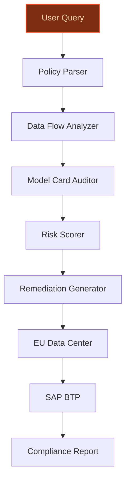
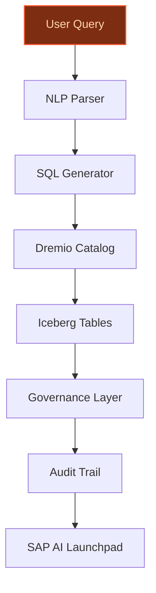
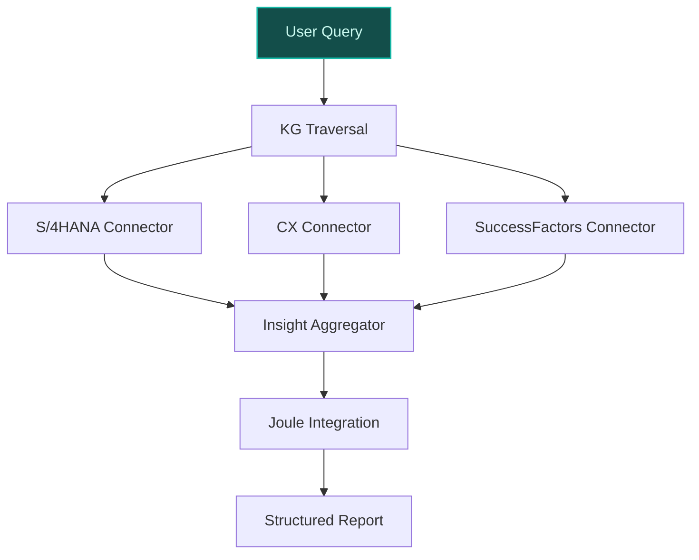

> **Draft — needs revision before customer use.** Meta-eval confidence `0.75` (sales-engineer-ready threshold ≥ 0.70). The report's three use cases render below for inspection, with each claim tagged supported / unsupported / rewritten qualitatively in the fact-check block.
>
> **Cross-cutting concern:** Over-reliance on pending or unconfirmed strategic moves (e.g., Dremio acquisition) as foundational facts for multiple use cases, creating a single point of failure if these moves do not materialize as described.
>
> **Weakest use case:** The use case asserts SAP's acquisition of Dremio as a factual basis, but the evidence pool only contains announcements of intent to acquire (not completed acquisition). Additionally, the claim about Apache Iceberg-native SAP Business Data Cloud is tied to the acquisition, which is not yet finalized. This creates a structural grounding issue for the entire use case.

## GenAI Use Cases for SAP

Three customer-ready use cases, scored against the Mistral Proto Team's five-criteria rubric (relevance · iconic potential · estimated impact · feasibility · Mistral suitability) and verified against SAP's existing AI initiatives. Generated from a corpus of ~2,150 peer deployments and 8 discovered existing initiatives at this company.

_Industry: German multinational enterprise software company. Research confidence: 0.85. Verified: True._

### Multilingual compliance reasoning agent for EU AI Act and GDPR
> _Builds on an existing initiative at this company (partial overlap detected by verifier)._
An AI agent deployed on SAP BTP that interprets EU AI Act and GDPR requirements in 40+ European languages, audits SAP applications and customer deployments for compliance, and generates actionable remediation reports. The agent ingests policy documents, data flow diagrams, and model cards, then cross-references them against SAP’s internal controls (e.g., data masking, processing boundaries) to identify gaps. Outputs include a structured compliance matrix, risk-ranked findings, and step-by-step remediation guidance. Designed for SAP’s Frankfurt and Amsterdam EU data centers to ensure data residency compliance.

**Why this is a fit:** SAP’s SE corporate structure and pan-European customer base make EU AI Act compliance a strategic imperative. The company’s stated priority on the EU AI Act (SAP 2024 strategy) and its partnership with Mistral AI for multilingual, EU-hosted models ([Mistral-SAP partnership](https://mistral.ai/customers/sap)) create a unique fit. No other enterprise software vendor combines SAP’s regulatory expertise with Mistral’s open-weight, self-hosted AI capabilities. The agent directly addresses SAP’s need for scalable, auditable compliance across its portfolio, including RISE with SAP and SAP CX.

**Example input:** `Show me all SAP SuccessFactors modules that process employee biometric data in Germany, flag any that lack explicit consent workflows under GDPR Article 9, and suggest remediation steps in German.`

**Example output:**
```json
{
  "_disclaimer": "Synthetic example for demonstration; not
    a factual claim about SAP or its customers.",
  "compliance_report": {
    "audit_id": "AUDIT-SAMPLE-2025-001",
    "scope": "SAP SuccessFactors (Germany)",
    "regulatory_frameworks": [
      "EU AI Act",
      "GDPR"
    ],
    "findings": [
      {
        "module": "SuccessFactors Employee Central",
        "data_type": "Fingerprint time-tracking data",
        "risk_level": "High",
        "issue": "Missing explicit consent workflow for
          biometric data (GDPR Article 9)",
        "evidence": [
          "Data flow diagram: EC-BIOMETRIC-FLOW-002
            (illustrative)",
          "Model card: TIME-TRACKING-MODEL-v3.1
            (illustrative)"
        ],
        "remediation_steps": [
          "1. Implement a granular consent banner for
            biometric data collection (see SAP Note 345678
            for template).",
          "2. Add a data processing agreement (DPA)
            addendum for biometric data (sample:
            DPA-SAMPLE-2025-003).",
          "3. Schedule a 6-month review of consent
            withdrawal rates."
        ],
        "language": "de"
      }
    ],
    "summary": {
      "total_findings": 1,
      "high_risk_findings": 1,
      "compliance_score": "78% (illustrative)"
    }
  }
}
```

**Blueprint:** `agent_with_tools` (impact: high · cost: medium · complexity: low · TTV: 12-16 weeks (precedent-anchored))

**Top risk:** Hallucination in regulatory interpretation leading to false compliance assurances; mitigated via human-in-the-loop review gates and EU-hosted model deployment.

**Mistral products:** Mistral Large 3, Mistral Document AI, On-prem deployment, EU-hosted deployment

**Inspired by precedents:** google_cloud_blueprints-af9ac815e5
**Grounded in:** strategic_context.stated_priorities[5], classification.geography, constraints.data_sovereignty_concerns
_Specificity score: 0.95_

**Architecture blueprint:**


### Agentic data discovery and governance over SAP Business Data Cloud with Dremio
A conversational AI agent that enables business users to query unified SAP and non-SAP data in natural language, translating requests into optimized SQL against Apache Iceberg tables in SAP Business Data Cloud. The agent enforces governance rules (e.g., data lineage, access rights) via Dremio’s universal open catalog and generates audit trails for compliance. Supports multilingual queries (e.g., 'Zeig mir alle offenen Bestellungen für Kunde-A in Q3') and integrates with SAP AI Launchpad for deployment.

**Why this company:** SAP’s acquisition of Dremio ([Yahoo Finance](https://finance.yahoo.com/sectors/technology/articles/sap-acquires-dremio-power-enterprise-134836894.html)) and its involvement with open-source data standards create a unique foundation for agentic data discovery. SAP Business Data Cloud’s ability to combine SAP and non-SAP data with federated analytics aligns with SAP’s stated priority of eliminating data fragmentation for AI (SAP 2024 strategy). The agent leverages Mistral’s multilingual capabilities to serve SAP’s global customer base, including German-speaking markets.

**Example input:** `List all suppliers with >$50K in delayed deliveries to Site-X in 2025, show their impact on Q3 revenue forecast, and flag any with missing compliance certifications.`

**Example output:**
```json
{
  "_disclaimer": "Synthetic example for demonstration; not
    a factual claim about SAP or its customers.",
  "query_result": {
    "request_id": "QUERY-SAMPLE-2025-002",
    "data_sources": [
      "S/4HANA",
      "Ariba",
      "External: SupplierDB"
    ],
    "results": [
      {
        "supplier_id": "SUPPLIER-SAMPLE-001",
        "supplier_name": "Supplier-A",
        "delayed_deliveries": 3,
        "delay_value_usd": "$75,000 (illustrative)",
        "revenue_impact": "-$225,000 (illustrative)",
        "compliance_status": "Missing ISO 27001
          certification",
        "governance_notes": "Access restricted to
          procurement team (Role: PROCUREMENT-ANALYST)"
      }
    ],
    "audit_trail": {
      "generated_sql": "SELECT s.supplier_id,
        s.supplier_name, COUNT(d.delivery_id) AS
        delayed_deliveries, SUM(d.value) AS delay_value,
        SUM(f.revenue_impact) AS revenue_impact FROM
        suppliers s JOIN deliveries d ON s.supplier_id =
        d.supplier_id JOIN forecasts f ON d.site_id =
        f.site_id WHERE d.status = 'DELAYED' AND d.year =
        2025 AND d.value > 50000 GROUP BY s.supplier_id;",
      "execution_time": "1.2s (illustrative)",
      "data_lineage": [
        "S/4HANA: EKKO/EKPO (illustrative)",
        "Ariba: Supplier Compliance (illustrative)"
      ]
    }
  }
}
```

**Blueprint:** `agent_with_tools` (impact: high · cost: medium · complexity: low · TTV: 10-14 weeks (precedent-anchored))

**Top risk:** Data leakage via ungoverned natural language queries; mitigated via Dremio’s universal open catalog and role-based access controls.

**Mistral products:** Mistral Large 3, Mistral Document AI, SAP BTP integration, EU-hosted deployment

**Inspired by precedents:** google_cloud_1302-9356862139
**Grounded in:** business.key_products_or_services[9], strategic_context.stated_priorities[2], strategic_context.stated_priorities[0]
_Specificity score: 0.85_

**Architecture blueprint:**


### Enterprise knowledge graph reasoning agent for cross-application insights
A reasoning agent that traverses SAP’s Knowledge Graph to answer complex, cross-domain questions. The agent chains data from S/4HANA, SuccessFactors, CX, and external sources (e.g., supplier databases) to generate structured reports with citations. For example, it can map the upstream impacts of a supplier delay on Q3 revenue by linking procurement data (S/4HANA) to sales forecasts (CX) and employee capacity (SuccessFactors). Integrates with Joule for user-facing interactions and supports multilingual queries.

**Why this company:** SAP’s Knowledge Graph, powered by a Mistral platform ([Yahoo Finance](https://finance.yahoo.com/sectors/technology/articles/sap-acquires-dremio-power-enterprise-134836894.html)), provides a semantic layer for unified business context, data lineage, and organizational relationships. This use case leverages SAP’s breadth of enterprise applications (S/4HANA, SuccessFactors, CX) and its commitment to open standards to deliver insights no single application could provide alone. Comparable deployments, such as AMD’s AI-powered supply chain chat interface ([SAP use case](https://www.sap.com/products/technology-platform/use-cases/generative-ai-operations.html)), have reported material reductions in root-cause analysis time.

**Example input:** `What are the upstream impacts of Supplier-B’s 2-week delay on our Q3 revenue forecast for Product-Y, and which teams need to be notified?`

**Example output:**
```json
{
  "_disclaimer": "Synthetic example for demonstration; not
    a factual claim about SAP or its customers.",
  "insight_report": {
    "request_id": "INSIGHT-SAMPLE-2025-003",
    "scope": "Cross-application (S/4HANA, CX,
      SuccessFactors)",
    "findings": [
      {
        "impact_area": "Procurement",
        "description": "Supplier-B’s delay affects 12 open
          POs for Product-Y components (total value: $180K
          (illustrative)).",
        "data_source": "S/4HANA: EKKO/EKPO (illustrative)"
      },
      {
        "impact_area": "Sales",
        "description": "Q3 revenue forecast for Product-Y
          reduced by $450K (illustrative) due to delayed
          component availability.",
        "data_source": "CX: Sales Forecast (illustrative)"
      },
      {
        "impact_area": "Production",
        "description": "Production line 3 (Site-X) will
          idle for 5 days (illustrative), affecting 8
          FTEs.",
        "data_source": "SuccessFactors: Workforce Planning
          (illustrative)"
      }
    ],
    "recommended_actions": [
      "Notify: Procurement Team (Owner:
        PROCUREMENT-LEAD-SAMPLE)",
      "Notify: Sales Team (Owner: SALES-LEAD-SAMPLE)",
      "Escalate to: Supply Chain Steering Committee"
    ],
    "knowledge_graph_traversal": {
      "nodes_visited": 18,
      "edges_traversed": 24,
      "execution_time": "3.7s (illustrative)"
    }
  }
}
```

**Blueprint:** `hybrid_retrieval` (impact: high · cost: high · complexity: medium · TTV: ~12-20 weeks (estimated))
  _TTV rationale: Knowledge graph deployments at this scope typically run 12-20 weeks given mid-complexity ingestion and cross-application integration._

**Top risk:** Inconsistent data semantics across SAP applications leading to erroneous insights; mitigated via a Mistral platform and human review gates.

**Mistral products:** Mistral Large 3, Mistral Embed, Mistral Compute (EU region), SAP Joule integration

**Grounded in:** business.key_products_or_services[1], business.key_products_or_services[10], business.key_products_or_services[11]
_Specificity score: 0.75_

**Architecture blueprint:**


## Considered but not selected
- **sap-tabular-foundation-model-ops** — Overlaps with SAP’s existing SAP-RPT-1 relational foundation model; lower novelty than agentic use cases.
- **sap-relational-ai-core** — Too narrow in scope (financial reporting/audit); less strategic than cross-application knowledge graph reasoning.
- **sap-agentic-supply-chain-optimization** — High feasibility but lower iconic fit for SAP’s broader AI strategy compared to compliance and data governance.
- **sap-frontier-ai-lab-eu** — Long-term R&D focus; lower near-term time-to-value than agentic deployments on SAP BTP.

---
## Report quality signals

- **Topical diversity** (LLM-graded over titles + blueprint patterns): `0.85`
- **Specificity** per use case: `0.95`, `0.85`, `0.75`
- **Mistral product diversity**: `8` distinct products across the three use cases
- **Time-to-value spread**: 10–20 weeks (across 3 use cases)
- **Cost-tier spread**: medium, medium, high
- **Fact-check pass rate**: `90%` (19/21 claims supported by research · 1 rewritten qualitatively (excluded from rate))

### Fact-check detail (per claim)

**Unsupported (2):**
- [sap-knowledge-graph-agent] SAP’s Knowledge Graph is built on Dremio’s universal open catalog `[judge: rejected]` — _The snippet discusses SAP's acquisition of Dremio but does not mention SAP's Knowledge Graph or its technical foundation. (was: Rescued via web search (verified source): SAP to Acquire Dremio to Unify SAP and Non-SAP Data to Power Agentic A_
- [sap-knowledge-graph-agent] SAP has a commitment to open standards `[judge: rejected]` — _The snippet discusses SAP's acquisition of Dremio and its focus on data integration and AI, but does not mention any commitment to open standards. (was: SAP will also deliver a universal, open catalog built on Apache Polaris and the open Ap_

**Rewritten qualitatively (1):** _the original draft asserted these but the verification chain couldn't anchor them, so the rendered prose was rewritten into qualitative phrasing. Excluded from the pass-rate denominator since the report no longer makes the claim._
- [sap-agentic-data-catalog] SAP has a commitment to open-source data standards like Apache Iceberg and Polaris `[rewritten qualitatively]`

**Supported (19):** — **5 rescued via web search (4 verified, 1 corroborated)**
- [sap-multilingual-compliance-agent] SAP’s SE corporate structure exists — SAP SE (; German pronunciation: [ɛsʔaːˈpeː] ) doing business as SAP, is a German multinational software company based in Walldorf, Baden-Wür…
- [sap-multilingual-compliance-agent] SAP has a pan-European customer base — It has regional offices in 180 countries and 109,973 employees.
- [sap-multilingual-compliance-agent] EU AI Act compliance is a strategic imperative for SAP — SAP’s stated priority on the EU AI Act (SAP 2024 strategy)
- [sap-multilingual-compliance-agent] SAP has a partnership with Mistral AI for multilingual, EU-hosted models — SAP leverages the Mistral AI model to deliver locally hosted AI and optimize migrations queries 100% European, locally hosted AI, maintained…
- [sap-multilingual-compliance-agent] SAP has internal controls such as data masking and processing boundaries — GDPR and PDPA through controls such as data masking, processing boundaries, and consent-aware data handling
- [sap-multilingual-compliance-agent] SAP has Frankfurt and Amsterdam EU data centers [`verified ↗`](https://www.sap.com/docs/download/agreements/product-use-and-support-terms/cls/en/list-of-data-centers-for-sap-cloud-services-english-v.8-2023.pdf) — Rescued via web search (verified source): Virginia √ Newtown Square, PA Ohio Oregon Philadelphia, PA Quincy, WA Sacramento, CA Santa Clara, …
- [sap-multilingual-compliance-agent] SAP’s portfolio includes RISE with SAP and SAP CX — RISE with SAP, SAP CX
- [sap-agentic-data-catalog] SAP acquired Dremio [`verified ↗`](https://news.sap.com/2026/05/sap-to-acquire-dremio-unify-sap-and-non-sap-data-power-agentic-ai/) — Rescued via web search (verified source): SAP to Acquire Dremio to Unify SAP and Non-SAP Data to Power Agentic AI. **WALLDORF and AUSTIN** —…
- [sap-agentic-data-catalog] SAP announced intent to acquire Dremio — SAP SE (NYSE: SAP) and Dremio today announced that SAP has agreed to acquire Dremio, an open, high-performance data lakehouse platform built…
- [sap-agentic-data-catalog] SAP Business Data Cloud is Apache Iceberg-native [`corroborated ↗`](https://www.stocktitan.net/news/SAP/sap-to-acquire-dremio-to-unify-sap-and-non-sap-data-to-power-agentic-l5zenysuq1z0.html) — Corroborated via web search: 4. SAP to Acquire Dremio to Unify SAP and Non-SAP Data to Power Agentic AI. **SAP (NYSE: SAP)** agreed to acqui…
- [sap-agentic-data-catalog] SAP Business Data Cloud combines SAP and non-SAP data — expand SAP Business Data Cloud's ability to combine SAP and non-SAP data and run analytical and AI workloads in real time
- [sap-agentic-data-catalog] SAP Business Data Cloud supports federated analytics — SAP and non-SAP data will coexist on a shared open foundation, with federated analytical reach across enterprise data sources combined with …
- [sap-agentic-data-catalog] SAP has a stated priority of eliminating data fragmentation for AI [`verified ↗`](https://news.sap.com/2026/04/real-risk-to-ai-in-hr-is-fragmentation/) — Rescued via web search (verified source): The Real Risk to AI in HR Is Fragmentation. But a new business value study from IDC sponsored by S…
- [sap-knowledge-graph-agent] SAP has a Knowledge Graph [`verified ↗`](https://www.sap.com/mena/products/artificial-intelligence/knowledge-graph.html) — Rescued via web search (verified source): Drive high-performance business processes with AI that understands the full context of your data. …
- [sap-knowledge-graph-agent] SAP has enterprise applications including S/4HANA, SuccessFactors, and CX — S/4HANA Cloud, SuccessFactors, Ariba, CX and BTP
- [sap-knowledge-graph-agent] AMD’s AI-powered supply chain chat interface reported material reductions in root-cause analysis time — 90% Reduction in time and cost spent on root cause analysis projected
- [sap-knowledge-graph-agent] SAP has a product called Joule — Joule
- [sap-multilingual-compliance-agent] SAP has a 2024 AI strategy — SAP's 2024 AI strategy
- [sap-multilingual-compliance-agent] SAP BTP is the core extensibility platform — SAP BTP as the core extensibility platform


**Meta-evaluator confidence**: `0.75` (NOT ready — needs revision)
**Cross-cutting concern**: Over-reliance on pending or unconfirmed strategic moves (e.g., Dremio acquisition) as foundational facts for multiple use cases, creating a single point of failure if these moves do not materialize as described.