# Trace

## Execution trace — SAP

Started: `2026-05-11T01:14:19.400350+00:00`. Total wall time: `153.7s` across `49` recorded actions.

### Per-step time totals

| Step | Calls | Total time | Avg time |
|---|---:|---:|---:|
| `research` | 1 | 10.39s | 10394ms |
| `gap_fill` | 4 | 2.96s | 741ms |
| `retrieve` | 2 | 0.29s | 145ms |
| `generate` | 2 | 25.66s | 12831ms |
| `generate.web_search` | 2 | 2.73s | 1363ms |
| `score` | 2 | 24.69s | 12345ms |
| `verify` | 6 | 19.74s | 3290ms |
| `enrich` | 1 | 56.20s | 56196ms |
| `meta_eval` | 1 | 11.28s | 11284ms |
| `web_verify` | 1 | 3.00s | 3004ms |
| `source_judge` | 23 | 16.85s | 733ms |
| `final_qualify` | 2 | 3.42s | 1709ms |
| `quality_signals` | 2 | 4.35s | 2175ms |

### Chronological event log

- `01:14:19.834` **[research]** `mistral-medium-2604.chat.complete` — 10394ms
   - inputs: synthesize CompanyContext for SAP | depth=medium
   - outputs: industry='German multinational enterprise software company' verified=True conf=0.75
- `01:14:30.234` **[gap_fill]** `mistral-small-2603.chat.complete` — 1046ms
   - inputs: generate gap queries | fields=['business_model', 'products', 'data_assets', 'priorities']
   - outputs: queries=4
- `01:14:37.476` **[gap_fill]** `mistral-small-2603.chat.complete` — 731ms
   - inputs: layer-2 extract field=priorities
   - outputs: items=6
- `01:14:37.481` **[gap_fill]** `mistral-small-2603.chat.complete` — 493ms
   - inputs: layer-2 extract field=data_assets
   - outputs: items=0
- `01:14:37.484` **[gap_fill]** `mistral-small-2603.chat.complete` — 695ms
   - inputs: layer-2 extract field=products
   - outputs: items=12
- `01:14:38.209` **[retrieve]** `mistral-embed.embeddings.create` — 286ms
   - inputs: company_query | industries='German multinational enterprise software company'
   - outputs: embedded 1024-dim query vector
- `01:14:38.495` **[retrieve]** `precedent_corpus.cosine_topk` — 5ms
   - inputs: k=8 min_depth=0.4 target='SAP'
   - outputs: retrieved 8 | mmr=True | top_sim=0.810
- `01:14:40.211` **[generate]** `mistral-medium-2604.chat.complete` — 2241ms
   - inputs: iteration=0 tool_calls_used=0/2 tools=on
   - outputs: tool_calls=4 | content_chars=0
- `01:14:42.468` **[generate.web_search]** `tavily.search` — 2329ms
   - inputs: query='SAP Dremio acquisition 2026 details'
   - outputs: 2 raw results
- `01:14:45.690` **[generate.web_search]** `tavily.search` — 397ms
   - inputs: query='SAP Prior Labs acquisition 2026 tabular foundation models'
   - outputs: 2 raw results
- `01:14:49.468` **[generate]** `mistral-medium-2604.chat.complete` — 23420ms
   - inputs: iteration=1 tool_calls_used=2/2 tools=off
   - outputs: tool_calls=0 | content_chars=15632
- `01:15:13.253` **[score]** `mistral-small-2603.chat.complete` — 12663ms
   - inputs: self-consistency pass T=0.2
   - outputs: scored 8 candidates
- `01:15:13.257` **[score]** `mistral-small-2603.chat.complete` — 12026ms
   - inputs: self-consistency pass T=0.4
   - outputs: scored 8 candidates
- `01:15:25.951` **[verify]** `tavily.search` — 2270ms
   - inputs: candidate=sap-tabular-foundation-model-ops | query='SAP Tabular Foundation Model (TFM)-powered enterprise proces'
   - outputs: 4 results
- `01:15:25.952` **[verify]** `tavily.search` — 1956ms
   - inputs: candidate=sap-relational-ai-core | query='SAP SAP-RPT-1-powered relational reasoning for financial rep'
   - outputs: 4 results
- `01:15:25.952` **[verify]** `tavily.search` — 2089ms
   - inputs: candidate=sap-multilingual-compliance-agent | query='SAP Multilingual compliance reasoning agent for EU AI Act an'
   - outputs: 4 results
- `01:15:28.449` **[verify]** `mistral-small-2603.chat.complete` — 3966ms
   - inputs: verdict for sap-multilingual-compliance-agent
   - outputs: verdict='partial_overlap'
- `01:15:28.700` **[verify]** `mistral-small-2603.chat.complete` — 5093ms
   - inputs: verdict for sap-relational-ai-core
   - outputs: verdict='confirmed_existing'
- `01:15:29.295` **[verify]** `mistral-small-2603.chat.complete` — 4363ms
   - inputs: verdict for sap-tabular-foundation-model-ops
   - outputs: verdict='confirmed_existing'
- `01:15:33.798` **[enrich]** `mistral-large-2512.chat.complete` — 56196ms
   - inputs: tier=standard parallel=False ids=['sap-multilingual-compliance-agent', 'sap-agentic-data-catalog', 'sap-knowledge-graph-agent']
   - outputs: enriched 3 use cases
- `01:16:30.026` **[meta_eval]** `mistral-medium-2604.chat.complete` — 11284ms
   - inputs: reviewing 3 use cases
   - outputs: review + claims
- `01:16:41.325` **[web_verify]** `tavily.search.rescue_unsupported_claims` — 3004ms
   - inputs: company='SAP' unsupported=6 budget=12
   - outputs: rescued: verified=5 corroborated=1 of 6 attempted
- `01:16:44.332` **[source_judge]** `mistral-small-2603.judge_claim_sources` — 2113ms
   - inputs: pairs=22
   - outputs: judged 22 pairs
- `01:16:44.332` **[source_judge]** `mistral-small-2603.chat.complete` — 1378ms
   - inputs: claim='SAP’s SE corporate structure exists'
   - outputs: verdict=supported
- `01:16:44.336` **[source_judge]** `mistral-small-2603.chat.complete` — 741ms
   - inputs: claim='SAP has a pan-European customer base'
   - outputs: verdict=supported
- `01:16:44.347` **[source_judge]** `mistral-small-2603.chat.complete` — 528ms
   - inputs: claim='EU AI Act compliance is a strategic imperative for SAP'
   - outputs: verdict=supported
- `01:16:44.350` **[source_judge]** `mistral-small-2603.chat.complete` — 572ms
   - inputs: claim='SAP has a partnership with Mistral AI for multilingual, EU-h'
   - outputs: verdict=supported
- `01:16:44.352` **[source_judge]** `mistral-small-2603.chat.complete` — 754ms
   - inputs: claim='SAP has internal controls such as data masking and processin'
   - outputs: verdict=supported
- `01:16:44.354` **[source_judge]** `mistral-small-2603.chat.complete` — 610ms
   - inputs: claim='SAP has Frankfurt and Amsterdam EU data centers'
   - outputs: verdict=supported
- `01:16:44.357` **[source_judge]** `mistral-small-2603.chat.complete` — 532ms
   - inputs: claim='SAP’s portfolio includes RISE with SAP and SAP CX'
   - outputs: verdict=supported
- `01:16:44.360` **[source_judge]** `mistral-small-2603.chat.complete` — 509ms
   - inputs: claim='SAP acquired Dremio'
   - outputs: verdict=supported
- `01:16:44.870` **[source_judge]** `mistral-small-2603.chat.complete` — 740ms
   - inputs: claim='SAP announced intent to acquire Dremio'
   - outputs: verdict=supported
- `01:16:44.875` **[source_judge]** `mistral-small-2603.chat.complete` — 734ms
   - inputs: claim='SAP Business Data Cloud is Apache Iceberg-native'
   - outputs: verdict=supported
- `01:16:44.889` **[source_judge]** `mistral-small-2603.chat.complete` — 659ms
   - inputs: claim='SAP Business Data Cloud combines SAP and non-SAP data'
   - outputs: verdict=supported
- `01:16:44.922` **[source_judge]** `mistral-small-2603.chat.complete` — 694ms
   - inputs: claim='SAP Business Data Cloud supports federated analytics'
   - outputs: verdict=supported
- `01:16:44.964` **[source_judge]** `mistral-small-2603.chat.complete` — 642ms
   - inputs: claim='SAP has a commitment to open-source data standards like Apac'
   - outputs: verdict=unsupported
- `01:16:45.077` **[source_judge]** `mistral-small-2603.chat.complete` — 703ms
   - inputs: claim='SAP has a stated priority of eliminating data fragmentation '
   - outputs: verdict=supported
- `01:16:45.106` **[source_judge]** `mistral-small-2603.chat.complete` — 557ms
   - inputs: claim='SAP’s Knowledge Graph is built on Dremio’s universal open ca'
   - outputs: verdict=unsupported
- `01:16:45.548` **[source_judge]** `mistral-small-2603.chat.complete` — 623ms
   - inputs: claim='SAP has a Knowledge Graph'
   - outputs: verdict=supported
- `01:16:45.607` **[source_judge]** `mistral-small-2603.chat.complete` — 598ms
   - inputs: claim='SAP has enterprise applications including S/4HANA, SuccessFa'
   - outputs: verdict=supported
- `01:16:45.610` **[source_judge]** `mistral-small-2603.chat.complete` — 634ms
   - inputs: claim='SAP has a commitment to open standards'
   - outputs: verdict=unsupported
- `01:16:45.613` **[source_judge]** `mistral-small-2603.chat.complete` — 629ms
   - inputs: claim='AMD’s AI-powered supply chain chat interface reported materi'
   - outputs: verdict=supported
- `01:16:45.617` **[source_judge]** `mistral-small-2603.chat.complete` — 595ms
   - inputs: claim='SAP has a product called Joule'
   - outputs: verdict=supported
- `01:16:45.663` **[source_judge]** `mistral-small-2603.chat.complete` — 566ms
   - inputs: claim='SAP has a 2024 AI strategy'
   - outputs: verdict=supported
- `01:16:45.710` **[source_judge]** `mistral-small-2603.chat.complete` — 735ms
   - inputs: claim='SAP BTP is the core extensibility platform'
   - outputs: verdict=supported
- `01:16:46.447` **[final_qualify]** `mistral-small-2603.chat.complete` — 1669ms
   - inputs: use_case=sap-agentic-data-catalog unsupported=1
   - outputs: qualified 4 fields
- `01:16:46.451` **[final_qualify]** `mistral-small-2603.chat.complete` — 1749ms
   - inputs: use_case=sap-knowledge-graph-agent unsupported=1
   - outputs: qualified 4 fields
- `01:16:48.754` **[quality_signals]** `mistral-small-2603.chat.complete` — 2913ms
   - inputs: specificity grade (3 use cases)
   - outputs: scored 3 use cases
- `01:16:51.667` **[quality_signals]** `mistral-small-2603.chat.complete` — 1437ms
   - inputs: diversity grade
   - outputs: diversity=0.85

## Mermaid sequence

```mermaid
sequenceDiagram
    autonumber
    participant pipeline as pipeline
    participant mistral_medium_2604 as mistral-medium-2604
    participant mistral_small_2603 as mistral-small-2603
    participant mistral_embed as mistral-embed
    participant precedent_corpus as precedent_corpus
    participant tavily as tavily
    participant mistral_large_2512 as mistral-large-2512
    participant tavily_search as tavily.search
    pipeline->>mistral_medium_2604: research: chat.complete (10394ms)
    mistral_medium_2604-->>pipeline: industry='German multinational enterprise software company' 
    pipeline->>mistral_small_2603: gap_fill: chat.complete (1046ms)
    mistral_small_2603-->>pipeline: queries=4
    pipeline->>mistral_small_2603: gap_fill: chat.complete (731ms)
    mistral_small_2603-->>pipeline: items=6
    pipeline->>mistral_small_2603: gap_fill: chat.complete (493ms)
    mistral_small_2603-->>pipeline: items=0
    pipeline->>mistral_small_2603: gap_fill: chat.complete (695ms)
    mistral_small_2603-->>pipeline: items=12
    pipeline->>mistral_embed: retrieve: embeddings.create (286ms)
    mistral_embed-->>pipeline: embedded 1024-dim query vector
    pipeline->>precedent_corpus: retrieve: cosine_topk (5ms)
    precedent_corpus-->>pipeline: retrieved 8 | mmr=True | top_sim=0.810
    pipeline->>mistral_medium_2604: generate: chat.complete (2241ms)
    mistral_medium_2604-->>pipeline: tool_calls=4 | content_chars=0
    pipeline->>tavily: generate.web_search: search (2329ms)
    tavily-->>pipeline: 2 raw results
    pipeline->>tavily: generate.web_search: search (397ms)
    tavily-->>pipeline: 2 raw results
    pipeline->>mistral_medium_2604: generate: chat.complete (23420ms)
    mistral_medium_2604-->>pipeline: tool_calls=0 | content_chars=15632
    pipeline->>mistral_small_2603: score: chat.complete (12663ms)
    mistral_small_2603-->>pipeline: scored 8 candidates
    pipeline->>mistral_small_2603: score: chat.complete (12026ms)
    mistral_small_2603-->>pipeline: scored 8 candidates
    pipeline->>tavily: verify: search (2270ms)
    tavily-->>pipeline: 4 results
    pipeline->>tavily: verify: search (1956ms)
    tavily-->>pipeline: 4 results
    pipeline->>tavily: verify: search (2089ms)
    tavily-->>pipeline: 4 results
    pipeline->>mistral_small_2603: verify: chat.complete (3966ms)
    mistral_small_2603-->>pipeline: verdict='partial_overlap'
    pipeline->>mistral_small_2603: verify: chat.complete (5093ms)
    mistral_small_2603-->>pipeline: verdict='confirmed_existing'
    pipeline->>mistral_small_2603: verify: chat.complete (4363ms)
    mistral_small_2603-->>pipeline: verdict='confirmed_existing'
    pipeline->>mistral_large_2512: enrich: chat.complete (56196ms)
    mistral_large_2512-->>pipeline: enriched 3 use cases
    pipeline->>mistral_medium_2604: meta_eval: chat.complete (11284ms)
    mistral_medium_2604-->>pipeline: review + claims
    pipeline->>tavily_search: web_verify: rescue_unsupported_claims (3004ms)
    tavily_search-->>pipeline: rescued: verified=5 corroborated=1 of 6 attempted
    pipeline->>mistral_small_2603: source_judge: judge_claim_sources (2113ms)
    mistral_small_2603-->>pipeline: judged 22 pairs
    pipeline->>mistral_small_2603: source_judge: chat.complete (1378ms)
    mistral_small_2603-->>pipeline: verdict=supported
    pipeline->>mistral_small_2603: source_judge: chat.complete (741ms)
    mistral_small_2603-->>pipeline: verdict=supported
    pipeline->>mistral_small_2603: source_judge: chat.complete (528ms)
    mistral_small_2603-->>pipeline: verdict=supported
    pipeline->>mistral_small_2603: source_judge: chat.complete (572ms)
    mistral_small_2603-->>pipeline: verdict=supported
    pipeline->>mistral_small_2603: source_judge: chat.complete (754ms)
    mistral_small_2603-->>pipeline: verdict=supported
    pipeline->>mistral_small_2603: source_judge: chat.complete (610ms)
    mistral_small_2603-->>pipeline: verdict=supported
    pipeline->>mistral_small_2603: source_judge: chat.complete (532ms)
    mistral_small_2603-->>pipeline: verdict=supported
    pipeline->>mistral_small_2603: source_judge: chat.complete (509ms)
    mistral_small_2603-->>pipeline: verdict=supported
    pipeline->>mistral_small_2603: source_judge: chat.complete (740ms)
    mistral_small_2603-->>pipeline: verdict=supported
    pipeline->>mistral_small_2603: source_judge: chat.complete (734ms)
    mistral_small_2603-->>pipeline: verdict=supported
    pipeline->>mistral_small_2603: source_judge: chat.complete (659ms)
    mistral_small_2603-->>pipeline: verdict=supported
    pipeline->>mistral_small_2603: source_judge: chat.complete (694ms)
    mistral_small_2603-->>pipeline: verdict=supported
    pipeline->>mistral_small_2603: source_judge: chat.complete (642ms)
    mistral_small_2603-->>pipeline: verdict=unsupported
    pipeline->>mistral_small_2603: source_judge: chat.complete (703ms)
    mistral_small_2603-->>pipeline: verdict=supported
    pipeline->>mistral_small_2603: source_judge: chat.complete (557ms)
    mistral_small_2603-->>pipeline: verdict=unsupported
    pipeline->>mistral_small_2603: source_judge: chat.complete (623ms)
    mistral_small_2603-->>pipeline: verdict=supported
    pipeline->>mistral_small_2603: source_judge: chat.complete (598ms)
    mistral_small_2603-->>pipeline: verdict=supported
    pipeline->>mistral_small_2603: source_judge: chat.complete (634ms)
    mistral_small_2603-->>pipeline: verdict=unsupported
    pipeline->>mistral_small_2603: source_judge: chat.complete (629ms)
    mistral_small_2603-->>pipeline: verdict=supported
    pipeline->>mistral_small_2603: source_judge: chat.complete (595ms)
    mistral_small_2603-->>pipeline: verdict=supported
    pipeline->>mistral_small_2603: source_judge: chat.complete (566ms)
    mistral_small_2603-->>pipeline: verdict=supported
    pipeline->>mistral_small_2603: source_judge: chat.complete (735ms)
    mistral_small_2603-->>pipeline: verdict=supported
    pipeline->>mistral_small_2603: final_qualify: chat.complete (1669ms)
    mistral_small_2603-->>pipeline: qualified 4 fields
    pipeline->>mistral_small_2603: final_qualify: chat.complete (1749ms)
    mistral_small_2603-->>pipeline: qualified 4 fields
    pipeline->>mistral_small_2603: quality_signals: chat.complete (2913ms)
    mistral_small_2603-->>pipeline: scored 3 use cases
    pipeline->>mistral_small_2603: quality_signals: chat.complete (1437ms)
    mistral_small_2603-->>pipeline: diversity=0.85
```

