# Trace

## Execution trace — Spotify

Started: `2026-05-11T01:05:39.694155+00:00`. Total wall time: `175.1s` across `49` recorded actions.

### Per-step time totals

| Step | Calls | Total time | Avg time |
|---|---:|---:|---:|
| `research` | 1 | 11.31s | 11310ms |
| `gap_fill` | 4 | 2.69s | 671ms |
| `retrieve` | 2 | 0.51s | 254ms |
| `generate` | 2 | 25.01s | 12506ms |
| `generate.web_search` | 2 | 7.82s | 3911ms |
| `score` | 2 | 24.44s | 12218ms |
| `verify` | 6 | 16.45s | 2742ms |
| `enrich` | 1 | 61.54s | 61543ms |
| `polish` | 3 | 7.05s | 2350ms |
| `meta_eval` | 1 | 11.67s | 11675ms |
| `web_verify` | 1 | 3.23s | 3226ms |
| `source_judge` | 21 | 22.68s | 1080ms |
| `final_qualify` | 1 | 1.58s | 1578ms |
| `quality_signals` | 2 | 3.77s | 1887ms |

### Chronological event log

- `01:05:45.317` **[research]** `mistral-medium-2604.chat.complete` — 11310ms
   - inputs: synthesize CompanyContext for Spotify | depth=medium
   - outputs: industry='Swedish audio streaming and media services' verified=True conf=0.75
- `01:05:56.628` **[gap_fill]** `mistral-small-2603.chat.complete` — 1119ms
   - inputs: generate gap queries | fields=['geography', 'business_model', 'products', 'data_assets', 'priorities']
   - outputs: queries=5
- `01:06:05.554` **[gap_fill]** `mistral-small-2603.chat.complete` — 383ms
   - inputs: layer-2 extract field=priorities
   - outputs: items=0
- `01:06:05.557` **[gap_fill]** `mistral-small-2603.chat.complete` — 692ms
   - inputs: layer-2 extract field=data_assets
   - outputs: items=7
- `01:06:05.560` **[gap_fill]** `mistral-small-2603.chat.complete` — 491ms
   - inputs: layer-2 extract field=products
   - outputs: items=6
- `01:06:06.252` **[retrieve]** `mistral-embed.embeddings.create` — 186ms
   - inputs: company_query | industries='Swedish audio streaming and media services'
   - outputs: embedded 1024-dim query vector
- `01:06:06.438` **[retrieve]** `precedent_corpus.cosine_topk` — 323ms
   - inputs: k=8 min_depth=0.4 target='Spotify'
   - outputs: retrieved 8 | mmr=True | top_sim=0.780
- `01:06:08.254` **[generate]** `mistral-medium-2604.chat.complete` — 1936ms
   - inputs: iteration=0 tool_calls_used=0/2 tools=on
   - outputs: tool_calls=4 | content_chars=0
- `01:06:10.205` **[generate.web_search]** `tavily.search` — 4023ms
   - inputs: query='Spotify AI DJ feature details and user adoption 2026'
   - outputs: 2 raw results
- `01:06:14.787` **[generate.web_search]** `tavily.search` — 3798ms
   - inputs: query='Spotify partnership with Peloton and workout content integration 2026'
   - outputs: 2 raw results
- `01:06:20.550` **[generate]** `mistral-medium-2604.chat.complete` — 23077ms
   - inputs: iteration=1 tool_calls_used=2/2 tools=off
   - outputs: tool_calls=0 | content_chars=16222
- `01:06:43.923` **[score]** `mistral-small-2603.chat.complete` — 11248ms
   - inputs: self-consistency pass T=0.2
   - outputs: scored 8 candidates
- `01:06:43.930` **[score]** `mistral-small-2603.chat.complete` — 13187ms
   - inputs: self-consistency pass T=0.4
   - outputs: scored 8 candidates
- `01:06:57.139` **[verify]** `tavily.search` — 2120ms
   - inputs: candidate=ai_dj_multilingual_expansion | query='Spotify Multilingual AI DJ with real-time cultural context a'
   - outputs: 4 results
- `01:06:57.139` **[verify]** `tavily.search` — 2140ms
   - inputs: candidate=ai_artist_royalty_transparency | query='Spotify AI-powered royalty transparency and dispute resoluti'
   - outputs: 4 results
- `01:06:57.139` **[verify]** `tavily.search` — 1895ms
   - inputs: candidate=ai_generated_workout_soundtracks | query='Spotify AI-generated workout soundtracks with Peloton class '
   - outputs: 4 results
- `01:06:59.475` **[verify]** `mistral-small-2603.chat.complete` — 3974ms
   - inputs: verdict for ai_generated_workout_soundtracks
   - outputs: verdict='pass'
- `01:06:59.541` **[verify]** `mistral-small-2603.chat.complete` — 4503ms
   - inputs: verdict for ai_dj_multilingual_expansion
   - outputs: verdict='confirmed_existing'
- `01:06:59.917` **[verify]** `mistral-small-2603.chat.complete` — 1822ms
   - inputs: verdict for ai_artist_royalty_transparency
   - outputs: verdict='pass'
- `01:07:04.048` **[enrich]** `mistral-large-2512.chat.complete` — 61543ms
   - inputs: tier=standard parallel=False ids=['ai_artist_royalty_transparency', 'ai_generated_workout_soundtracks', 'ai_ad_creative_optimization']
   - outputs: enriched 3 use cases
- `01:08:05.625` **[polish]** `mistral-small-2603.chat.complete` — 2192ms
   - inputs: use_case=ai_artist_royalty_transparency unanchored=True opaque_ev=False
   - outputs: polished 5 fields
- `01:08:05.663` **[polish]** `mistral-small-2603.chat.complete` — 2616ms
   - inputs: use_case=ai_generated_workout_soundtracks unanchored=True opaque_ev=False
   - outputs: polished 5 fields
- `01:08:05.666` **[polish]** `mistral-small-2603.chat.complete` — 2241ms
   - inputs: use_case=ai_ad_creative_optimization unanchored=True opaque_ev=False
   - outputs: polished 5 fields
- `01:08:08.281` **[meta_eval]** `mistral-medium-2604.chat.complete` — 11675ms
   - inputs: reviewing 3 use cases
   - outputs: review + claims
- `01:08:19.980` **[web_verify]** `tavily.search.rescue_unsupported_claims` — 3226ms
   - inputs: company='Spotify' unsupported=7 budget=12
   - outputs: rescued: verified=4 corroborated=2 of 7 attempted
- `01:08:23.207` **[source_judge]** `mistral-small-2603.judge_claim_sources` — 5530ms
   - inputs: pairs=20
   - outputs: judged 20 pairs
- `01:08:23.208` **[source_judge]** `mistral-small-2603.chat.complete` — 611ms
   - inputs: claim='Spotify has faced persistent criticism over its royalty mode'
   - outputs: verdict=unsupported
- `01:08:23.210` **[source_judge]** `mistral-small-2603.chat.complete` — 777ms
   - inputs: claim='Spotify has a proprietary listening history data asset'
   - outputs: verdict=unsupported
- `01:08:23.216` **[source_judge]** `mistral-small-2603.chat.complete` — 5521ms
   - inputs: claim='Spotify has in-app actions data asset'
   - outputs: verdict=supported
- `01:08:23.218` **[source_judge]** `mistral-small-2603.chat.complete` — 706ms
   - inputs: claim='Spotify has payment data asset'
   - outputs: verdict=unsupported
- `01:08:23.221` **[source_judge]** `mistral-small-2603.chat.complete` — 690ms
   - inputs: claim='Spotify has a stated commitment to transparency for creators'
   - outputs: verdict=supported
- `01:08:23.225` **[source_judge]** `mistral-small-2603.chat.complete` — 659ms
   - inputs: claim='Spotify has partnerships with Sony, Universal, and Warner to'
   - outputs: verdict=supported
- `01:08:23.228` **[source_judge]** `mistral-small-2603.chat.complete` — 597ms
   - inputs: claim='The system reduces manual review time by 40-60%'
   - outputs: verdict=unsupported
- `01:08:23.232` **[source_judge]** `mistral-small-2603.chat.complete` — 725ms
   - inputs: claim='Spotify’s 2026 partnership with Peloton brought 1,400+ class'
   - outputs: verdict=supported
- `01:08:23.819` **[source_judge]** `mistral-small-2603.chat.complete` — 534ms
   - inputs: claim='Spotify has a 2026 partnership with Peloton'
   - outputs: verdict=supported
- `01:08:23.825` **[source_judge]** `mistral-small-2603.chat.complete` — 532ms
   - inputs: claim='Spotify has 293M Premium subscribers'
   - outputs: verdict=supported
- `01:08:23.883` **[source_judge]** `mistral-small-2603.chat.complete` — 498ms
   - inputs: claim='Spotify has a 100M+ track catalog'
   - outputs: verdict=supported
- `01:08:23.911` **[source_judge]** `mistral-small-2603.chat.complete` — 556ms
   - inputs: claim='A/B testing shows 22% higher workout completion rates for us'
   - outputs: verdict=unsupported
- `01:08:23.923` **[source_judge]** `mistral-small-2603.chat.complete` — 602ms
   - inputs: claim='Peloton has 1,400+ ad-free classes'
   - outputs: verdict=unsupported
- `01:08:23.958` **[source_judge]** `mistral-small-2603.chat.complete` — 645ms
   - inputs: claim='Spotify already uses predictive ML to generate ad content'
   - outputs: verdict=unsupported
- `01:08:23.987` **[source_judge]** `mistral-small-2603.chat.complete` — 613ms
   - inputs: claim='Spotify already uses predictive ML to target in-app messagin'
   - outputs: verdict=supported
- `01:08:24.352` **[source_judge]** `mistral-small-2603.chat.complete` — 527ms
   - inputs: claim='Spotify has 293M Premium subscribers'
   - outputs: verdict=supported
- `01:08:24.358` **[source_judge]** `mistral-small-2603.chat.complete` — 633ms
   - inputs: claim='Spotify has 468M ad-supported users'
   - outputs: verdict=unsupported
- `01:08:24.381` **[source_judge]** `mistral-small-2603.chat.complete` — 531ms
   - inputs: claim='Spotify has 761M monthly active users'
   - outputs: verdict=supported
- `01:08:24.467` **[source_judge]** `mistral-small-2603.chat.complete` — 531ms
   - inputs: claim='The system achieves 25-35% higher click-through rates for dy'
   - outputs: verdict=unsupported
- `01:08:24.526` **[source_judge]** `mistral-small-2603.chat.complete` — 665ms
   - inputs: claim='Comparable deployments in media report 20-40% improvements i'
   - outputs: verdict=unsupported
- `01:08:28.740` **[final_qualify]** `mistral-small-2603.chat.complete` — 1578ms
   - inputs: use_case=ai_ad_creative_optimization unsupported=1
   - outputs: qualified 4 fields
- `01:08:30.979` **[quality_signals]** `mistral-small-2603.chat.complete` — 2601ms
   - inputs: specificity grade (3 use cases)
   - outputs: scored 3 use cases
- `01:08:33.579` **[quality_signals]** `mistral-small-2603.chat.complete` — 1174ms
   - inputs: diversity grade
   - outputs: diversity=0.7

## Mermaid sequence

```mermaid
sequenceDiagram
    autonumber
    participant pipeline as pipeline
    participant mistral_medium_2604 as mistral-medium-2604
    participant mistral_small_2603 as mistral-small-2603
    participant mistral_embed as mistral-embed
    participant precedent_corpus as precedent_corpus
    participant tavily as tavily
    participant mistral_large_2512 as mistral-large-2512
    participant tavily_search as tavily.search
    pipeline->>mistral_medium_2604: research: chat.complete (11310ms)
    mistral_medium_2604-->>pipeline: industry='Swedish audio streaming and media services' verifi
    pipeline->>mistral_small_2603: gap_fill: chat.complete (1119ms)
    mistral_small_2603-->>pipeline: queries=5
    pipeline->>mistral_small_2603: gap_fill: chat.complete (383ms)
    mistral_small_2603-->>pipeline: items=0
    pipeline->>mistral_small_2603: gap_fill: chat.complete (692ms)
    mistral_small_2603-->>pipeline: items=7
    pipeline->>mistral_small_2603: gap_fill: chat.complete (491ms)
    mistral_small_2603-->>pipeline: items=6
    pipeline->>mistral_embed: retrieve: embeddings.create (186ms)
    mistral_embed-->>pipeline: embedded 1024-dim query vector
    pipeline->>precedent_corpus: retrieve: cosine_topk (323ms)
    precedent_corpus-->>pipeline: retrieved 8 | mmr=True | top_sim=0.780
    pipeline->>mistral_medium_2604: generate: chat.complete (1936ms)
    mistral_medium_2604-->>pipeline: tool_calls=4 | content_chars=0
    pipeline->>tavily: generate.web_search: search (4023ms)
    tavily-->>pipeline: 2 raw results
    pipeline->>tavily: generate.web_search: search (3798ms)
    tavily-->>pipeline: 2 raw results
    pipeline->>mistral_medium_2604: generate: chat.complete (23077ms)
    mistral_medium_2604-->>pipeline: tool_calls=0 | content_chars=16222
    pipeline->>mistral_small_2603: score: chat.complete (11248ms)
    mistral_small_2603-->>pipeline: scored 8 candidates
    pipeline->>mistral_small_2603: score: chat.complete (13187ms)
    mistral_small_2603-->>pipeline: scored 8 candidates
    pipeline->>tavily: verify: search (2120ms)
    tavily-->>pipeline: 4 results
    pipeline->>tavily: verify: search (2140ms)
    tavily-->>pipeline: 4 results
    pipeline->>tavily: verify: search (1895ms)
    tavily-->>pipeline: 4 results
    pipeline->>mistral_small_2603: verify: chat.complete (3974ms)
    mistral_small_2603-->>pipeline: verdict='pass'
    pipeline->>mistral_small_2603: verify: chat.complete (4503ms)
    mistral_small_2603-->>pipeline: verdict='confirmed_existing'
    pipeline->>mistral_small_2603: verify: chat.complete (1822ms)
    mistral_small_2603-->>pipeline: verdict='pass'
    pipeline->>mistral_large_2512: enrich: chat.complete (61543ms)
    mistral_large_2512-->>pipeline: enriched 3 use cases
    pipeline->>mistral_small_2603: polish: chat.complete (2192ms)
    mistral_small_2603-->>pipeline: polished 5 fields
    pipeline->>mistral_small_2603: polish: chat.complete (2616ms)
    mistral_small_2603-->>pipeline: polished 5 fields
    pipeline->>mistral_small_2603: polish: chat.complete (2241ms)
    mistral_small_2603-->>pipeline: polished 5 fields
    pipeline->>mistral_medium_2604: meta_eval: chat.complete (11675ms)
    mistral_medium_2604-->>pipeline: review + claims
    pipeline->>tavily_search: web_verify: rescue_unsupported_claims (3226ms)
    tavily_search-->>pipeline: rescued: verified=4 corroborated=2 of 7 attempted
    pipeline->>mistral_small_2603: source_judge: judge_claim_sources (5530ms)
    mistral_small_2603-->>pipeline: judged 20 pairs
    pipeline->>mistral_small_2603: source_judge: chat.complete (611ms)
    mistral_small_2603-->>pipeline: verdict=unsupported
    pipeline->>mistral_small_2603: source_judge: chat.complete (777ms)
    mistral_small_2603-->>pipeline: verdict=unsupported
    pipeline->>mistral_small_2603: source_judge: chat.complete (5521ms)
    mistral_small_2603-->>pipeline: verdict=supported
    pipeline->>mistral_small_2603: source_judge: chat.complete (706ms)
    mistral_small_2603-->>pipeline: verdict=unsupported
    pipeline->>mistral_small_2603: source_judge: chat.complete (690ms)
    mistral_small_2603-->>pipeline: verdict=supported
    pipeline->>mistral_small_2603: source_judge: chat.complete (659ms)
    mistral_small_2603-->>pipeline: verdict=supported
    pipeline->>mistral_small_2603: source_judge: chat.complete (597ms)
    mistral_small_2603-->>pipeline: verdict=unsupported
    pipeline->>mistral_small_2603: source_judge: chat.complete (725ms)
    mistral_small_2603-->>pipeline: verdict=supported
    pipeline->>mistral_small_2603: source_judge: chat.complete (534ms)
    mistral_small_2603-->>pipeline: verdict=supported
    pipeline->>mistral_small_2603: source_judge: chat.complete (532ms)
    mistral_small_2603-->>pipeline: verdict=supported
    pipeline->>mistral_small_2603: source_judge: chat.complete (498ms)
    mistral_small_2603-->>pipeline: verdict=supported
    pipeline->>mistral_small_2603: source_judge: chat.complete (556ms)
    mistral_small_2603-->>pipeline: verdict=unsupported
    pipeline->>mistral_small_2603: source_judge: chat.complete (602ms)
    mistral_small_2603-->>pipeline: verdict=unsupported
    pipeline->>mistral_small_2603: source_judge: chat.complete (645ms)
    mistral_small_2603-->>pipeline: verdict=unsupported
    pipeline->>mistral_small_2603: source_judge: chat.complete (613ms)
    mistral_small_2603-->>pipeline: verdict=supported
    pipeline->>mistral_small_2603: source_judge: chat.complete (527ms)
    mistral_small_2603-->>pipeline: verdict=supported
    pipeline->>mistral_small_2603: source_judge: chat.complete (633ms)
    mistral_small_2603-->>pipeline: verdict=unsupported
    pipeline->>mistral_small_2603: source_judge: chat.complete (531ms)
    mistral_small_2603-->>pipeline: verdict=supported
    pipeline->>mistral_small_2603: source_judge: chat.complete (531ms)
    mistral_small_2603-->>pipeline: verdict=unsupported
    pipeline->>mistral_small_2603: source_judge: chat.complete (665ms)
    mistral_small_2603-->>pipeline: verdict=unsupported
    pipeline->>mistral_small_2603: final_qualify: chat.complete (1578ms)
    mistral_small_2603-->>pipeline: qualified 4 fields
    pipeline->>mistral_small_2603: quality_signals: chat.complete (2601ms)
    mistral_small_2603-->>pipeline: scored 3 use cases
    pipeline->>mistral_small_2603: quality_signals: chat.complete (1174ms)
    mistral_small_2603-->>pipeline: diversity=0.7
```

