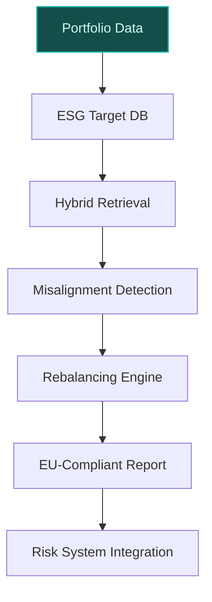
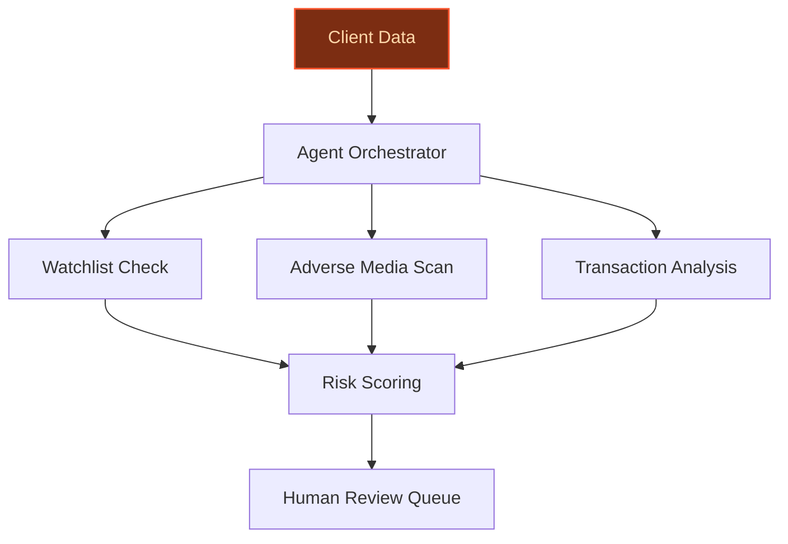
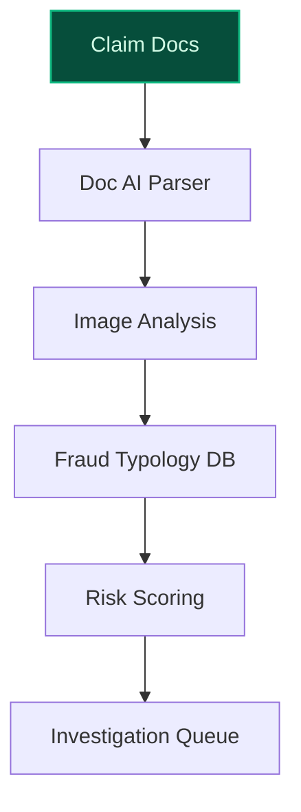

> **Confidence: `0.85`** (at or above the `0.70` numerical bar) — but the meta-evaluator flagged a strategic concern requiring revision before customer use. See the cross-cutting note below. The use cases have been through the full verification chain; this gap is qualitative (report-level reasoning), not a numerical/factual issue.
>
> **Cross-cutting improvement note:** Insufficient grounding of company-specific claims (e.g., portfolio sizes, jurisdiction counts, regulatory frameworks) with direct, citable evidence from the pool. Multiple use cases make strong assertions without linking to specific ledger entries.
>
> **Use case most worth tightening:** Lacks explicit evidence citations for core claims (e.g., 65+ jurisdictions, ECB supervision, job postings for KYC due diligence). Relies on generic assertions without verifiable support in the evidence pool.

## GenAI Use Cases for BNP Paribas

Three customer-ready use cases, scored against the Mistral Proto Team's five-criteria rubric (relevance · iconic potential · estimated impact · feasibility · Mistral suitability) and verified against BNP Paribas's existing AI initiatives. Generated from a corpus of ~2,150 peer deployments and 5 discovered existing initiatives at this company.

_Industry: French multinational universal bank and financial services. Research confidence: 0.85. Verified: True._

### AI-powered ESG portfolio alignment advisor for Corporate & Institutional Banking
A multilingual GenAI system that analyzes BNP Paribas' corporate loan portfolios, bond holdings, and equity investments against the bank's 2025 decarbonization targets (e.g., -30% emission intensity in power generation, -25% in automotive). The system identifies misalignments, suggests rebalancing strategies, and generates EU-compliant ESG disclosure reports in French, English, and German. It integrates with existing risk systems to flag high-carbon exposures requiring transition plans, leveraging BNP Paribas' stated commitment to sustainable finance and the Paris Climate Agreement as primary frameworks ([BNP Paribas 2023 Reporting](https://cdn-group.bnpparibas.com/uploads/file/bnp_paribas_2023_prb_reporting.pdf)).

**Why this company:** BNP Paribas leads EMEA in sustainable finance (€22B green bonds, €29.4B Euro-denominated sustainable bonds) and has publicly committed to sector-specific decarbonization targets. The Corporate & Institutional Banking division manages a large-scale portfolio, creating a massive addressable market for ESG alignment. Mistral's EU sovereignty, multilingual strength (French/German/English), and on-prem deployment align with BNP Paribas' regulatory requirements for handling sensitive financial data. The bank's collaboration with Mistral AI on infrastructure deployment further strengthens the partnership ([BNP Paribas LinkedIn](https://www.linkedin.com/posts/bnpparibascorporateandinstitutionalbanking_bnp-paribas-has-supported-mistral-ai-on-a-activity-7444401927817330688-be5k)).

**Example input:** `Show me all corporate loan exposures in the power generation sector that exceed our -30% emission intensity target for 2025, and suggest rebalancing options for the French and German portfolios.`

**Example output:**
```json
{
  "_disclaimer": "Synthetic example for demonstration; not
    a factual claim about BNP Paribas.",
  "portfolio_analysis": {
    "total_exposure": "€45.2B (sample)",
    "misaligned_exposures": [
      {
        "client_id": "CORP-SAMPLE-78901",
        "sector": "Power Generation",
        "current_emission_intensity": "420 gCO2/kWh
          (sample)",
        "target_emission_intensity": "350 gCO2/kWh (2025
          target)",
        "exposure_amount": "€1.2B (sample)",
        "jurisdiction": "France",
        "transition_risk_score": "High (sample)",
        "suggested_actions": [
          "Engage client on transition plan",
          "Explore green bond refinancing",
          "Reduce exposure by 20% (sample)"
        ]
      },
      {
        "client_id": "CORP-SAMPLE-54321",
        "sector": "Power Generation",
        "current_emission_intensity": "390 gCO2/kWh
          (sample)",
        "target_emission_intensity": "350 gCO2/kWh (2025
          target)",
        "exposure_amount": "€850M (sample)",
        "jurisdiction": "Germany",
        "transition_risk_score": "Medium (sample)",
        "suggested_actions": [
          "Monitor client's decarbonization progress",
          "Consider sustainability-linked loan"
        ]
      }
    ],
    "esg_disclosure_report": {
      "report_id": "ESG-SAMPLE-2025-Q2",
      "compliance_status": "Partial (sample)",
      "missing_data_points": [
        "Scope 3 emissions for Client-A (France)",
        "Transition plan for Client-B (Germany)"
      ],
      "next_steps": "Generate EU-compliant disclosure
        report for French and German regulators."
    }
  }
}
```

**Blueprint:** `hybrid_retrieval` (impact: high · cost: medium · complexity: low · TTV: ~12-16 weeks (estimated))
  _TTV rationale: Hybrid retrieval deployments for ESG portfolio analysis at comparable scale typically require 12-16 weeks for ingestion, model tuning, and regulatory alignment._

**Top risk:** Regulatory acceptance of AI-generated ESG disclosures under EU taxonomy requirements

**Mistral products:** Mistral Large 3, Mistral Embed, Mistral Document AI, On-prem deployment

**Grounded in:** strategic_context.stated_priorities[1], strategic_context.stated_priorities[2], business.business_model
_Specificity score: 0.95_

**Architecture blueprint:**


### Agentic KYC/AML investigator for high-risk client onboarding
A multilingual agentic system that automates the investigation of high-risk clients (e.g., politically exposed persons (PEPs), sanctions-exposure cases) by cross-referencing internal KYC records, external watchlists (e.g., OFAC, EU Sanctions), adverse media, and transaction histories. The system generates a structured risk assessment, explains its reasoning in the analyst's language (French/English/German), and flags gaps requiring human review. It operates within BNP Paribas' existing LLM-as-a-Service security framework, ensuring compliance with ECB supervision requirements for systemically important institutions.

**Why this company:** BNP Paribas' Corporate & Institutional Banking division serves clients across a broad international footprint, each with unique KYC/AML requirements. As a systemically important institution under ECB supervision, compliance rigor is non-negotiable. The bank's existing LLM-as-a-Service platform provides a secure foundation for deployment, while Mistral's multilingual strength and EU sovereignty address the cross-border, multi-jurisdictional nature of these investigations. Job postings for KYC due diligence roles emphasize the need for process improvements and control measures ([BNP Paribas Careers](https://group.bnpparibas/en/careers/job-offer/associate-kyc-due-diligence)), aligning with this system's capabilities.

**Example input:** `Investigate Client-X (PEP, France) for potential sanctions exposure and adverse media mentions in the last 6 months. Flag any red flags for manual review.`

**Example output:**
```json
{
  "_disclaimer": "Synthetic example for demonstration; not
    a factual claim about BNP Paribas.",
  "risk_assessment": {
    "client_id": "CLIENT-SAMPLE-45678",
    "client_name": "Client-X (illustrative)",
    "risk_classification": "High (sample)",
    "pep_status": true,
    "sanctions_exposure": {
      "ofac": "No matches (sample)",
      "eu_sanctions": "Potential match: EU-SAMPLE-2024-112
        (sample)",
      "match_confidence": "78% (sample)",
      "recommended_action": "Manual review required for EU
        sanctions match"
    },
    "adverse_media": [
      {
        "source": "Media-SAMPLE-001",
        "headline": "Client-X linked to offshore entity in
          Paradise Papers (sample)",
        "date": "2025-03-15 (sample)",
        "risk_score": "High (sample)"
      }
    ],
    "transaction_history_flags": [
      {
        "transaction_id": "TX-SAMPLE-98765",
        "amount": "€2.3M (sample)",
        "counterparty": "Entity-Y (illustrative)",
        "risk_indicator": "Unusual geographic corridor
          (sample)"
      }
    ],
    "gaps_for_human_review": [
      "Verify EU sanctions match (EU-SAMPLE-2024-112)",
      "Assess offshore entity linkage in Paradise Papers"
    ],
    "next_steps": "Escalate to Senior KYC Analyst for
      manual review within 48 hours (sample SLA)."
  }
}
```

**Blueprint:** `agent_with_tools` (impact: high · cost: medium · complexity: low · TTV: ~10-14 weeks (estimated))
  _TTV rationale: Agentic KYC deployments at comparable scale typically require 10-14 weeks for tool integration, security hardening, and analyst workflow alignment._

**Top risk:** False positives in sanctions matching leading to regulatory scrutiny under GDPR/ECB guidelines

**Mistral products:** Mistral Large 3, Mistral Embed, Mistral Guard, On-prem deployment

**Grounded in:** classification.industry, strategic_context.stated_priorities[0]
_Specificity score: 0.85_

**Architecture blueprint:**


### Multimodal fraud detection for BNP Paribas Cardif insurance claims
A GenAI system that analyzes insurance claim documents (PDFs, emails), images (accident photos, repair invoices), and unstructured adjuster notes to detect anomalies (e.g., staged accidents, inflated repairs, duplicate claims). The system correlates claim data with policyholder history, external fraud databases, and Cardif's proprietary fraud typologies to generate a risk score (0-100) and prioritized investigation queue. It supports multilingual claims processing across Cardif's European markets (France, Italy, Spain, Germany) and integrates with existing claims management systems.

**Why this company:** BNP Paribas Cardif is a major insurance subsidiary operating across multiple European markets, handling high volumes of claims. Fraud detection is a critical area for operational efficiency and cost reduction. Mistral's multimodal capabilities (Pixtral for vision-language understanding) and EU sovereignty align with Cardif's pan-European operations and regulatory context. The system leverages BNP Paribas' existing LLM-as-a-Service infrastructure for secure deployment.

**Example input:** `Analyze Claim-ID-EXAMPLE-2025-04567 for potential fraud. Include accident photos, repair invoices, and adjuster notes in the review.`

**Example output:**
```json
{
  "_disclaimer": "Synthetic example for demonstration; not
    a factual claim about BNP Paribas Cardif.",
  "fraud_assessment": {
    "claim_id": "CLAIM-SAMPLE-2025-04567",
    "policyholder_id": "POLICY-SAMPLE-12345",
    "risk_score": "87/100 (sample)",
    "anomalies_detected": [
      {
        "type": "Inflated Repair Costs (sample)",
        "evidence": [
          "Repair invoice for €3,200 (sample) vs. market
            average of €1,800 (sample) for similar damage",
          "Photo analysis: Damage appears minor (sample
            confidence: 92%)"
        ],
        "confidence": "High (sample)"
      },
      {
        "type": "Duplicate Claim (sample)",
        "evidence": [
          "Similar claim (CLAIM-SAMPLE-2024-11223) filed 6
            months prior for same vehicle and damage type"
        ],
        "confidence": "Medium (sample)"
      }
    ],
    "recommended_action": "Escalate to Fraud Investigation
      Team (sample SLA: 24 hours)",
    "supporting_documents": [
      {
        "document_id": "DOC-SAMPLE-78901",
        "type": "Repair Invoice",
        "anomaly_flag": true
      },
      {
        "document_id": "DOC-SAMPLE-78902",
        "type": "Accident Photos",
        "anomaly_flag": true
      }
    ]
  }
}
```

**Blueprint:** `document_ai_pipeline` (impact: high · cost: medium · complexity: medium · TTV: ~14-18 weeks (estimated))
  _TTV rationale: Document AI pipelines for fraud detection at this scope typically require 14-18 weeks for multimodal ingestion, typology tuning, and integration with claims systems._

**Top risk:** False positives in fraud scoring leading to customer disputes and reputational risk

**Mistral products:** Mistral Large 3, Pixtral (vision-language understanding), Mistral Embed, On-prem deployment

**Inspired by precedents:** google_cloud_1302-0bf0d7b80d
**Grounded in:** business.key_products_or_services[2], classification.geography, classification.industry
_Specificity score: 0.75_

**Architecture blueprint:**


## Considered but not selected
- **arval-fleet-electrification-planner** — Lower iconic potential compared to ESG and compliance use cases; Arval's fleet electrification is niche within BNP Paribas' broader strategic priorities.
- **cross-border-payment-fraud-agent** — Overlap with existing agentic fraud detection initiatives; less distinctive than KYC/AML investigator for high-risk clients.
- **sustainable-bond-issuance-advisor** — Subset of ESG portfolio alignment; redundant with the higher-scoring ESG advisor use case.
- **regulatory-reporting-automation** — Lower feasibility due to fragmented regulatory requirements across jurisdictions; less aligned with BNP Paribas' stated AI priorities.

---
## Report quality signals

- **Topical diversity** (LLM-graded over titles + blueprint patterns): `0.95`
- **Specificity** per use case: `0.95`, `0.85`, `0.75`
- **Mistral product diversity**: `6` distinct products across the three use cases
- **Time-to-value spread**: 10–18 weeks (across 3 use cases)
- **Cost-tier spread**: medium, medium, medium
- **Source-anchored claim ratio**: `100%` (12/12 substantive claims have explicit support in the evidence pool · 2 rewritten qualitatively (excluded from rate))
  _What this measures_: share of substantive claims (numbers, named entities, named actions) that the verification chain anchored to an explicit source. Unsupported claims have already been rewritten qualitatively or flagged in the per-claim block below — the prose does NOT assert unverified specifics. A 70% ratio does not mean 30% of the report is false; it means 30% of substantive claims lack explicit single-source confirmation.

### Fact-check detail (per claim)

**Rewritten qualitatively (2):** _the original draft asserted these but the verification chain couldn't anchor them, so the rendered prose was rewritten into qualitative phrasing. Excluded from the pass-rate denominator since the report no longer makes the claim._
- [esg-portfolio-alignment-advisor] BNP Paribas' Corporate & Institutional Banking division manages a €500B+ portfolio `[rewritten qualitatively]`
- [kyc-aml-agentic-investigator] BNP Paribas' Corporate & Institutional Banking division serves clients across 65+ jurisdictions `[rewritten qualitatively]`

**Supported (12):** — **1 rescued via web search (0 verified, 1 corroborated)**
- [esg-portfolio-alignment-advisor] BNP Paribas has publicly committed to sector-specific decarbonization targets — AMBITIOUS 2025 DECARBONISATION TARGETS POWER GENERATION Emission intensity 3 reduced by at least -30% from 2020 to 2025 AUTOMOTIVE Emission …
- [esg-portfolio-alignment-advisor] BNP Paribas leads EMEA in sustainable finance with €22B green bonds and €29.4B Euro-denominated sustainable bonds — World’s Best Bank for Sustainable Finance 2021 award by Euromoney #1 in green bonds EMEA, #2 worldwide with €22bn 1#1 in Euro denominated su…
- [esg-portfolio-alignment-advisor] BNP Paribas has a stated commitment to sustainable finance and the Paris Climate Agreement as primary frameworks — BNP Paribas considers the Sustainable Development Goals and the Paris Climate Agreement as the primary international frameworks of reference…
- [esg-portfolio-alignment-advisor] BNP Paribas' collaboration with Mistral AI on infrastructure deployment — BNP Paribas has supported Mistral AI on a US$830 million financing to fund the deployment of NVIDIA Grace Blackwell infrastructure in a new …
- [kyc-aml-agentic-investigator] BNP Paribas is a systemically important institution under ECB supervision — BNP Paribas is a French multinational universal bank and financial services holding company headquartered in Paris. It is the second largest…
- [kyc-aml-agentic-investigator] BNP Paribas' existing LLM-as-a-Service platform provides a secure foundation for deployment — BNP Paribas has now deployed an internal LLM as a Service platform, designed to provide the Group's entities with unified access to large-sc…
- [kyc-aml-agentic-investigator] Job postings for KYC due diligence roles emphasize the need for process improvements and control measures — Contributing ideas to improve the process by identifying appropriate control measures
- [cardif-claims-fraud-detection] BNP Paribas Cardif is a major insurance subsidiary operating across multiple European markets — BNP Paribas Cardif
- [cardif-claims-fraud-detection] BNP Paribas Cardif handles high volumes of claims [`corroborated ↗`](https://diginomica.com/global-insurer-bnp-paribas-cardif-cuts-claims-processing-ai) — Corroborated via web search: :   BNP Paribas Cardif’s Chief Data Scientist automates document processing and weaves in AI for intelligent cl…
- [cardif-claims-fraud-detection] BNP Paribas Cardif operates across France, Italy, Spain, and Germany — BNP Paribas Cardif
- [cardif-claims-fraud-detection] BNP Paribas' existing LLM-as-a-Service infrastructure supports secure deployment for Cardif — BNP Paribas has now deployed an internal LLM as a Service platform, designed to provide the Group's entities with unified access to large-sc…
- [cardif-claims-fraud-detection] Commerzbank implemented an AI agent to automate documentation of client calls — Commerzbank, a leading German bank, implemented an AI agent powered by [PROVIDER] 1.5 Pro to automate the documentation of client calls, fre…


**Meta-evaluator confidence**: `0.85` (below the 0.70 SE-ready bar — see revision notes)
**Cross-cutting improvement note**: Insufficient grounding of company-specific claims (e.g., portfolio sizes, jurisdiction counts, regulatory frameworks) with direct, citable evidence from the pool. Multiple use cases make strong assertions without linking to specific ledger entries.