# Trace

## Execution trace — BNP Paribas

Started: `2026-05-11T01:48:02.856546+00:00`. Total wall time: `156.8s` across `41` recorded actions.

### Per-step time totals

| Step | Calls | Total time | Avg time |
|---|---:|---:|---:|
| `research` | 1 | 8.46s | 8463ms |
| `gap_fill` | 4 | 2.60s | 650ms |
| `retrieve` | 2 | 0.22s | 111ms |
| `generate` | 2 | 23.38s | 11692ms |
| `generate.web_search` | 2 | 7.04s | 3521ms |
| `score` | 2 | 24.52s | 12261ms |
| `verify` | 6 | 21.54s | 3591ms |
| `enrich` | 1 | 56.89s | 56888ms |
| `meta_eval` | 1 | 10.52s | 10516ms |
| `web_verify` | 1 | 1.89s | 1887ms |
| `source_judge` | 15 | 14.09s | 940ms |
| `final_qualify` | 2 | 3.76s | 1880ms |
| `quality_signals` | 2 | 4.91s | 2454ms |

### Chronological event log

- `01:48:05.705` **[research]** `mistral-medium-2604.chat.complete` — 8463ms
   - inputs: synthesize CompanyContext for BNP Paribas | depth=medium
   - outputs: industry='French multinational universal bank and financial services' verified=True conf=0.75
- `01:48:14.171` **[gap_fill]** `mistral-small-2603.chat.complete` — 821ms
   - inputs: generate gap queries | fields=['business_model', 'products', 'data_assets', 'priorities']
   - outputs: queries=4
- `01:48:23.002` **[gap_fill]** `mistral-small-2603.chat.complete` — 701ms
   - inputs: layer-2 extract field=priorities
   - outputs: items=6
- `01:48:23.007` **[gap_fill]** `mistral-small-2603.chat.complete` — 444ms
   - inputs: layer-2 extract field=data_assets
   - outputs: items=0
- `01:48:23.010` **[gap_fill]** `mistral-small-2603.chat.complete` — 632ms
   - inputs: layer-2 extract field=products
   - outputs: items=7
- `01:48:23.705` **[retrieve]** `mistral-embed.embeddings.create` — 218ms
   - inputs: company_query | industries='French multinational universal bank and financial services'
   - outputs: embedded 1024-dim query vector
- `01:48:23.923` **[retrieve]** `precedent_corpus.cosine_topk` — 5ms
   - inputs: k=8 min_depth=0.4 target='BNP Paribas'
   - outputs: retrieved 8 | mmr=True | top_sim=0.769
- `01:48:25.706` **[generate]** `mistral-medium-2604.chat.complete` — 1802ms
   - inputs: iteration=0 tool_calls_used=0/2 tools=on
   - outputs: tool_calls=4 | content_chars=0
- `01:48:27.530` **[generate.web_search]** `tavily.search` — 4016ms
   - inputs: query='BNP Paribas 2025 strategic plan sustainable finance initiatives'
   - outputs: 2 raw results
- `01:48:31.576` **[generate.web_search]** `tavily.search` — 3027ms
   - inputs: query='BNP Paribas Arval Cardif Fortis key products and services'
   - outputs: 2 raw results
- `01:48:35.098` **[generate]** `mistral-medium-2604.chat.complete` — 21582ms
   - inputs: iteration=1 tool_calls_used=2/2 tools=off
   - outputs: tool_calls=0 | content_chars=15414
- `01:48:56.994` **[score]** `mistral-small-2603.chat.complete` — 11800ms
   - inputs: self-consistency pass T=0.2
   - outputs: scored 8 candidates
- `01:48:57.007` **[score]** `mistral-small-2603.chat.complete` — 12722ms
   - inputs: self-consistency pass T=0.4
   - outputs: scored 8 candidates
- `01:49:09.764` **[verify]** `tavily.search` — 4408ms
   - inputs: candidate=esg-portfolio-alignment-advisor | query='BNP Paribas AI-powered ESG portfolio alignment advisor for C'
   - outputs: 4 results
- `01:49:09.764` **[verify]** `tavily.search` — 1976ms
   - inputs: candidate=arval-fleet-electrification-planner | query='BNP Paribas AI-driven fleet electrification and mobility opt'
   - outputs: 4 results
- `01:49:09.765` **[verify]** `tavily.search` — 2235ms
   - inputs: candidate=kyc-aml-agentic-investigator | query='BNP Paribas Agentic KYC/AML investigator for high-risk clien'
   - outputs: 4 results
- `01:49:11.919` **[verify]** `mistral-small-2603.chat.complete` — 4903ms
   - inputs: verdict for arval-fleet-electrification-planner
   - outputs: verdict='confirmed_existing'
- `01:49:13.416` **[verify]** `mistral-small-2603.chat.complete` — 3374ms
   - inputs: verdict for kyc-aml-agentic-investigator
   - outputs: verdict='pass'
- `01:49:15.012` **[verify]** `mistral-small-2603.chat.complete` — 4648ms
   - inputs: verdict for esg-portfolio-alignment-advisor
   - outputs: verdict='pass'
- `01:49:19.664` **[enrich]** `mistral-large-2512.chat.complete` — 56888ms
   - inputs: tier=standard parallel=False ids=['esg-portfolio-alignment-advisor', 'kyc-aml-agentic-investigator', 'cardif-claims-fraud-detection']
   - outputs: enriched 3 use cases
- `01:50:16.572` **[meta_eval]** `mistral-medium-2604.chat.complete` — 10516ms
   - inputs: reviewing 3 use cases
   - outputs: review + claims
- `01:50:27.110` **[web_verify]** `tavily.search.rescue_unsupported_claims` — 1887ms
   - inputs: company='BNP Paribas' unsupported=2 budget=12
   - outputs: rescued: verified=1 corroborated=1 of 2 attempted
- `01:50:29.002` **[source_judge]** `mistral-small-2603.judge_claim_sources` — 2993ms
   - inputs: pairs=14
   - outputs: judged 14 pairs
- `01:50:29.002` **[source_judge]** `mistral-small-2603.chat.complete` — 699ms
   - inputs: claim="BNP Paribas' Corporate & Institutional Banking division mana"
   - outputs: verdict=unsupported
- `01:50:29.011` **[source_judge]** `mistral-small-2603.chat.complete` — 852ms
   - inputs: claim='BNP Paribas has publicly committed to sector-specific decarb'
   - outputs: verdict=supported
- `01:50:29.014` **[source_judge]** `mistral-small-2603.chat.complete` — 858ms
   - inputs: claim='BNP Paribas leads EMEA in sustainable finance with €22B gree'
   - outputs: verdict=supported
- `01:50:29.017` **[source_judge]** `mistral-small-2603.chat.complete` — 841ms
   - inputs: claim='BNP Paribas has a stated commitment to sustainable finance a'
   - outputs: verdict=supported
- `01:50:29.020` **[source_judge]** `mistral-small-2603.chat.complete` — 784ms
   - inputs: claim="BNP Paribas' collaboration with Mistral AI on infrastructure"
   - outputs: verdict=supported
- `01:50:29.022` **[source_judge]** `mistral-small-2603.chat.complete` — 701ms
   - inputs: claim="BNP Paribas' Corporate & Institutional Banking division serv"
   - outputs: verdict=unsupported
- `01:50:29.025` **[source_judge]** `mistral-small-2603.chat.complete` — 785ms
   - inputs: claim='BNP Paribas is a systemically important institution under EC'
   - outputs: verdict=supported
- `01:50:29.027` **[source_judge]** `mistral-small-2603.chat.complete` — 895ms
   - inputs: claim="BNP Paribas' existing LLM-as-a-Service platform provides a s"
   - outputs: verdict=supported
- `01:50:29.701` **[source_judge]** `mistral-small-2603.chat.complete` — 528ms
   - inputs: claim='Job postings for KYC due diligence roles emphasize the need '
   - outputs: verdict=supported
- `01:50:29.723` **[source_judge]** `mistral-small-2603.chat.complete` — 543ms
   - inputs: claim='BNP Paribas Cardif is a major insurance subsidiary operating'
   - outputs: verdict=supported
- `01:50:29.804` **[source_judge]** `mistral-small-2603.chat.complete` — 568ms
   - inputs: claim='BNP Paribas Cardif handles high volumes of claims'
   - outputs: verdict=supported
- `01:50:29.809` **[source_judge]** `mistral-small-2603.chat.complete` — 476ms
   - inputs: claim='BNP Paribas Cardif operates across France, Italy, Spain, and'
   - outputs: verdict=supported
- `01:50:29.859` **[source_judge]** `mistral-small-2603.chat.complete` — 2136ms
   - inputs: claim="BNP Paribas' existing LLM-as-a-Service infrastructure suppor"
   - outputs: verdict=supported
- `01:50:29.864` **[source_judge]** `mistral-small-2603.chat.complete` — 432ms
   - inputs: claim='Commerzbank implemented an AI agent to automate documentatio'
   - outputs: verdict=supported
- `01:50:31.996` **[final_qualify]** `mistral-small-2603.chat.complete` — 2092ms
   - inputs: use_case=esg-portfolio-alignment-advisor unsupported=1
   - outputs: qualified 4 fields
- `01:50:32.000` **[final_qualify]** `mistral-small-2603.chat.complete` — 1667ms
   - inputs: use_case=kyc-aml-agentic-investigator unsupported=1
   - outputs: qualified 4 fields
- `01:50:34.774` **[quality_signals]** `mistral-small-2603.chat.complete` — 3643ms
   - inputs: specificity grade (3 use cases)
   - outputs: scored 3 use cases
- `01:50:38.417` **[quality_signals]** `mistral-small-2603.chat.complete` — 1265ms
   - inputs: diversity grade
   - outputs: diversity=0.95

## Mermaid sequence

```mermaid
sequenceDiagram
    autonumber
    participant pipeline as pipeline
    participant mistral_medium_2604 as mistral-medium-2604
    participant mistral_small_2603 as mistral-small-2603
    participant mistral_embed as mistral-embed
    participant precedent_corpus as precedent_corpus
    participant tavily as tavily
    participant mistral_large_2512 as mistral-large-2512
    participant tavily_search as tavily.search
    pipeline->>mistral_medium_2604: research: chat.complete (8463ms)
    mistral_medium_2604-->>pipeline: industry='French multinational universal bank and financial 
    pipeline->>mistral_small_2603: gap_fill: chat.complete (821ms)
    mistral_small_2603-->>pipeline: queries=4
    pipeline->>mistral_small_2603: gap_fill: chat.complete (701ms)
    mistral_small_2603-->>pipeline: items=6
    pipeline->>mistral_small_2603: gap_fill: chat.complete (444ms)
    mistral_small_2603-->>pipeline: items=0
    pipeline->>mistral_small_2603: gap_fill: chat.complete (632ms)
    mistral_small_2603-->>pipeline: items=7
    pipeline->>mistral_embed: retrieve: embeddings.create (218ms)
    mistral_embed-->>pipeline: embedded 1024-dim query vector
    pipeline->>precedent_corpus: retrieve: cosine_topk (5ms)
    precedent_corpus-->>pipeline: retrieved 8 | mmr=True | top_sim=0.769
    pipeline->>mistral_medium_2604: generate: chat.complete (1802ms)
    mistral_medium_2604-->>pipeline: tool_calls=4 | content_chars=0
    pipeline->>tavily: generate.web_search: search (4016ms)
    tavily-->>pipeline: 2 raw results
    pipeline->>tavily: generate.web_search: search (3027ms)
    tavily-->>pipeline: 2 raw results
    pipeline->>mistral_medium_2604: generate: chat.complete (21582ms)
    mistral_medium_2604-->>pipeline: tool_calls=0 | content_chars=15414
    pipeline->>mistral_small_2603: score: chat.complete (11800ms)
    mistral_small_2603-->>pipeline: scored 8 candidates
    pipeline->>mistral_small_2603: score: chat.complete (12722ms)
    mistral_small_2603-->>pipeline: scored 8 candidates
    pipeline->>tavily: verify: search (4408ms)
    tavily-->>pipeline: 4 results
    pipeline->>tavily: verify: search (1976ms)
    tavily-->>pipeline: 4 results
    pipeline->>tavily: verify: search (2235ms)
    tavily-->>pipeline: 4 results
    pipeline->>mistral_small_2603: verify: chat.complete (4903ms)
    mistral_small_2603-->>pipeline: verdict='confirmed_existing'
    pipeline->>mistral_small_2603: verify: chat.complete (3374ms)
    mistral_small_2603-->>pipeline: verdict='pass'
    pipeline->>mistral_small_2603: verify: chat.complete (4648ms)
    mistral_small_2603-->>pipeline: verdict='pass'
    pipeline->>mistral_large_2512: enrich: chat.complete (56888ms)
    mistral_large_2512-->>pipeline: enriched 3 use cases
    pipeline->>mistral_medium_2604: meta_eval: chat.complete (10516ms)
    mistral_medium_2604-->>pipeline: review + claims
    pipeline->>tavily_search: web_verify: rescue_unsupported_claims (1887ms)
    tavily_search-->>pipeline: rescued: verified=1 corroborated=1 of 2 attempted
    pipeline->>mistral_small_2603: source_judge: judge_claim_sources (2993ms)
    mistral_small_2603-->>pipeline: judged 14 pairs
    pipeline->>mistral_small_2603: source_judge: chat.complete (699ms)
    mistral_small_2603-->>pipeline: verdict=unsupported
    pipeline->>mistral_small_2603: source_judge: chat.complete (852ms)
    mistral_small_2603-->>pipeline: verdict=supported
    pipeline->>mistral_small_2603: source_judge: chat.complete (858ms)
    mistral_small_2603-->>pipeline: verdict=supported
    pipeline->>mistral_small_2603: source_judge: chat.complete (841ms)
    mistral_small_2603-->>pipeline: verdict=supported
    pipeline->>mistral_small_2603: source_judge: chat.complete (784ms)
    mistral_small_2603-->>pipeline: verdict=supported
    pipeline->>mistral_small_2603: source_judge: chat.complete (701ms)
    mistral_small_2603-->>pipeline: verdict=unsupported
    pipeline->>mistral_small_2603: source_judge: chat.complete (785ms)
    mistral_small_2603-->>pipeline: verdict=supported
    pipeline->>mistral_small_2603: source_judge: chat.complete (895ms)
    mistral_small_2603-->>pipeline: verdict=supported
    pipeline->>mistral_small_2603: source_judge: chat.complete (528ms)
    mistral_small_2603-->>pipeline: verdict=supported
    pipeline->>mistral_small_2603: source_judge: chat.complete (543ms)
    mistral_small_2603-->>pipeline: verdict=supported
    pipeline->>mistral_small_2603: source_judge: chat.complete (568ms)
    mistral_small_2603-->>pipeline: verdict=supported
    pipeline->>mistral_small_2603: source_judge: chat.complete (476ms)
    mistral_small_2603-->>pipeline: verdict=supported
    pipeline->>mistral_small_2603: source_judge: chat.complete (2136ms)
    mistral_small_2603-->>pipeline: verdict=supported
    pipeline->>mistral_small_2603: source_judge: chat.complete (432ms)
    mistral_small_2603-->>pipeline: verdict=supported
    pipeline->>mistral_small_2603: final_qualify: chat.complete (2092ms)
    mistral_small_2603-->>pipeline: qualified 4 fields
    pipeline->>mistral_small_2603: final_qualify: chat.complete (1667ms)
    mistral_small_2603-->>pipeline: qualified 4 fields
    pipeline->>mistral_small_2603: quality_signals: chat.complete (3643ms)
    mistral_small_2603-->>pipeline: scored 3 use cases
    pipeline->>mistral_small_2603: quality_signals: chat.complete (1265ms)
    mistral_small_2603-->>pipeline: diversity=0.95
```

