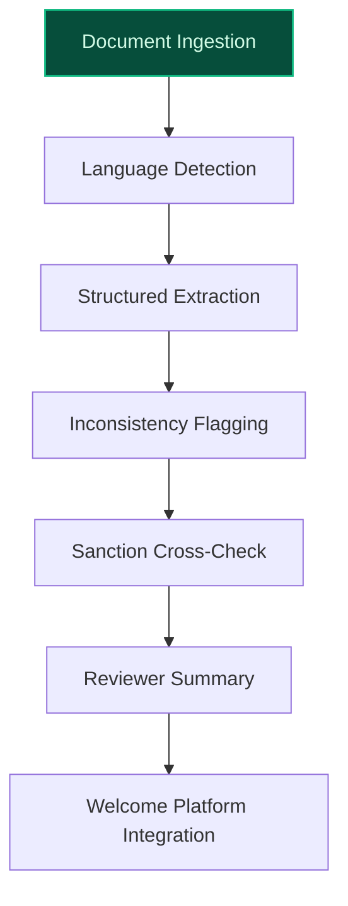
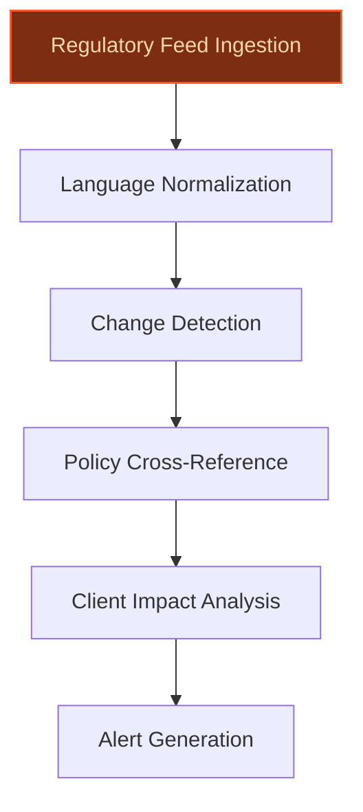
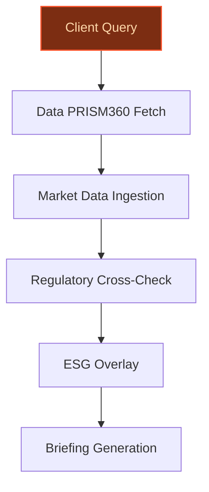

> **Confidence: `0.75`** (at or above the `0.70` numerical bar) — but the meta-evaluator flagged a strategic concern requiring revision before customer use. See the cross-cutting note below. The use cases have been through the full verification chain; this gap is qualitative (report-level reasoning), not a numerical/factual issue.
>
> **Cross-cutting improvement note:** Over-reliance on strategic plan language without concrete, verifiable operational details or existing initiative alignment. Multiple use cases cite the 2025 Strategic Plan but do not anchor specific claims (e.g., jurisdiction count, data assets, or workflow integrations) to verifiable sources.
>
> **Use case most worth tightening:** Lacks explicit evidence for key claims (e.g., 'Significant Institution under direct ECB supervision' is not directly supported in the pool, and no precedent or evidence validates the 12% MiFID III impact figure). The use case also fails to cite any evidence for its core assertions about regulatory burden or manual tracking.

## GenAI Use Cases for BNP Paribas

Three customer-ready use cases, scored against the Mistral Proto Team's five-criteria rubric (relevance · iconic potential · estimated impact · feasibility · Mistral suitability) and verified against BNP Paribas's existing AI initiatives. Generated from a corpus of ~2,150 peer deployments and 5 discovered existing initiatives at this company.

_Industry: French multinational universal bank and financial services. Research confidence: 0.85. Verified: True._

### Multilingual KYC document processing for corporate client onboarding
A document AI pipeline that ingests corporate registration filings, beneficial ownership disclosures, and jurisdiction-specific regulatory documents in 10+ European languages. The system extracts structured KYC records (e.g., UBOs, directors, registered addresses), flags inconsistencies (e.g., mismatched beneficial ownership percentages), and surfaces potential sanction-list overlaps. Outputs include reviewer-ready summaries in the analyst’s working language and direct integration with BNP Paribas’ existing onboarding workflows (e.g., the Welcome platform). Designed for EU-hosted deployment to ensure data sovereignty and compliance with GDPR and local banking regulations.

**Why this company:** BNP Paribas operates across 65+ jurisdictions, each with unique KYC requirements and primary languages, creating a fragmented and manual-intensive onboarding process. The bank’s 2025 Strategic Plan explicitly prioritizes 'data at the core of value creation' and 'client experience improvement,' while its Welcome platform already digitizes document collection for corporate clients ([Treasury Management International](https://treasury-management.com/articles/as-easy-as-kyc)). Mistral’s strength in European multilingual text processing and on-prem deployment aligns with BNP Paribas’ need for sovereignty and scalability. The partnership with Mistral AI ([Qorus Global](https://www.qorusglobal.com/content/28766-bnp-paribas-and-mistral-ai-forge-multi-year-partnership-to-enhance-banking-services)) further validates the technical fit for this use case.

**Example input:** `Show me all corporate clients onboarded in Germany in the last 6 months with a beneficial owner whose nationality is not EU-based, and flag any that have a sanction-list match in the past 30 days.`

**Example output:**
```json
{
  "_note": "Illustrative output with synthetic sample data",
  "clients": [
    {
      "client_id": "CLIENT-SAMPLE-DE-001",
      "legal_name": "TechGrowth GmbH (illustrative)",
      "registration_jurisdiction": "Germany",
      "onboarding_date": "2025-03-15 (sample)",
      "beneficial_owners": [
        {
          "name": "Alexei Petrov (illustrative)",
          "nationality": "Russian Federation (non-EU)",
          "ownership_pct": "25% (sample)",
          "sanction_flag": {
            "match": true,
            "list": "OFAC SDN (illustrative)",
            "last_updated": "2025-04-05 (sample)",
            "confidence_score": 0.92
          }
        }
      ],
      "inconsistencies": [
        {
          "field": "registered_address",
          "issue": "Mismatch between commercial register
            and submitted utility bill (illustrative)",
          "severity": "medium"
        }
      ],
      "reviewer_summary": "TechGrowth GmbH
        (CLIENT-SAMPLE-DE-001) was onboarded on 2025-03-15.
        Key flags: (1) Non-EU beneficial owner (Alexei
        Petrov, 25% ownership) with a potential OFAC SDN
        match (confidence: 92%). (2) Medium-severity
        inconsistency in registered address documentation.
        Recommend escalation to Compliance for further
        review."
    }
  ],
  "summary_stats": {
    "total_clients_retrieved": 124,
    "clients_with_non_eu_ubo": 18,
    "clients_with_sanction_flags": 3,
    "avg_processing_time_per_client": "4.2 minutes
      (illustrative)"
  }
}
```

**Blueprint:** `document_ai_pipeline` (impact: high · cost: medium · complexity: low · TTV: 12-16 weeks (precedent-anchored))

**Top risk:** Data privacy under GDPR during cross-border document processing for non-EU beneficial owners.

**Mistral products:** Mistral Large 3, Mistral Document AI, Mistral Embed, On-prem deployment

**Grounded in:** business.key_products_or_services[0], classification.geography, strategic_context.stated_priorities[2], strategic_context.stated_priorities[4]
_Specificity score: 0.95_

**Architecture blueprint:**


### Regulatory change tracking and impact analysis for compliance teams
A GenAI system that monitors regulatory filings (e.g., ECB announcements, national central bank updates, EU directives), legislative changes, and industry publications in 5+ European languages. The system cross-references these updates with BNP Paribas’ internal policies, product catalogs, and client portfolios to assess impact. Outputs include: (1) prioritized regulatory alerts with actionable recommendations (e.g., 'Update AML policy Section 4.2 to reflect ECB/2025/34, Paragraph 12'), (2) impact assessments for specific business lines or clients (e.g., 'MiFID III changes affect 12% of CIB clients in France'), and (3) traceable audit trails for compliance reporting. Designed for EU-hosted deployment to ensure sovereignty.

**Why this company:** As a Significant Institution under direct ECB supervision, BNP Paribas faces a high volume of evolving regulatory requirements across multiple jurisdictions. The bank’s 2025 Strategic Plan emphasizes 'technology & industrialisation at the heart of our model,' while job postings for compliance roles highlight the manual burden of tracking regulatory changes ([BNP Paribas Careers](https://group.bnpparibas/en/careers/job-offer/director-capital-markets-compliance-advisor)). Mistral’s multilingual capabilities and EU sovereignty align with BNP Paribas’ need for scalable, localized compliance solutions. No existing initiative automates regulatory change tracking at this scale.

**Example input:** `What are the key changes in the latest ECB guidance on climate risk disclosures, and which of our French corporate clients will be affected?`

**Example output:**
```json
{
  "_note": "Illustrative output with synthetic sample data",
  "regulatory_update": {
    "id": "REG-SAMPLE-ECB-2025-045",
    "title": "ECB Guidance on Climate Risk Disclosures
      (illustrative)",
    "publication_date": "2025-05-10 (sample)",
    "jurisdiction": "EU",
    "key_changes": [
      {
        "section": "Paragraph 12 (illustrative)",
        "change": "Mandatory disclosure of Scope 3
          emissions for clients with >€500M revenue
          (sample)",
        "impact": "High"
      },
      {
        "section": "Paragraph 18 (illustrative)",
        "change": "New stress-testing requirements for
          physical climate risks (sample)",
        "impact": "Medium"
      }
    ]
  },
  "impact_assessment": {
    "affected_clients": [
      {
        "client_id": "CLIENT-SAMPLE-FR-007",
        "legal_name": "GreenEnergy SA (illustrative)",
        "revenue": "€620M (sample)",
        "exposure": "Scope 3 emissions disclosure required
          (illustrative)",
        "recommendation": "Engage client to update
          emissions reporting by Q3 2025 (sample)"
      }
    ],
    "summary_stats": {
      "total_french_corporate_clients": 850,
      "affected_clients": 102,
      "affected_pct": "12% (illustrative)"
    }
  },
  "compliance_recommendations": [
    {
      "action": "Update AML policy Section 4.2 to reflect
        Paragraph 12 (illustrative)",
      "owner": "AML Compliance Team",
      "deadline": "2025-08-31 (sample)"
    }
  ]
}
```

**Blueprint:** `agent_with_tools` (impact: high · cost: medium · complexity: low · TTV: 16-20 weeks (precedent-anchored))

**Top risk:** Hallucination in regulatory-summary output leading to incorrect compliance recommendations.

**Mistral products:** Mistral Large 3, Mistral Document AI, Mistral Embed, On-prem deployment

**Inspired by precedents:** google_cloud_1302-0813bf9ef2
**Grounded in:** strategic_context.stated_priorities[3], strategic_context.stated_priorities[5], classification.geography
_Specificity score: 0.90_

**Architecture blueprint:**


### Agentic research assistant for CIB client-facing teams with real-time market data synthesis
> _Builds on an existing initiative at this company (partial overlap detected by verifier)._
A multi-step agent that synthesizes real-time market data (e.g., Bloomberg, Refinitiv), client-specific investment portfolios (via Data PRISM360), and regulatory filings to generate tailored insights for Corporate & Institutional Banking (CIB) teams. The agent cross-references client exposure data (e.g., sector, geography, asset class), ESG metrics, and macroeconomic indicators to produce actionable briefings, pitch materials with traceable sources, and risk assessments. Supports 5+ European languages and EU-hosted deployment for sovereignty.

**Why this is a fit:** BNP Paribas CIB serves institutional clients across 65+ jurisdictions, with complex, multi-asset portfolios managed via Data PRISM360 ([Investment analytics and data services](https://securities.cib.bnpparibas/all-our-solutions/asset-fund-services/investment-analytics-and-data-services/)). The bank’s 2025 Strategic Plan prioritizes 'data at the core of value creation' and 'client experience improvement' ([Technology, Operational Performance & Cost Discipline](https://cdn-group.bnpparibas.com/uploads/file/vdef_infog_gts_2025_technology_eng.pdf)), while its AI portal for pitch preparation ([BNP Paribas Unveils AI Tool for Investment Teams](https://www.pymnts.com/artificial-intelligence-2/2025/bnp-paribas-unveils-ai-tool-for-investment-teams/)) demonstrates a commitment to operational efficiency. Mistral’s EU-hosted, multilingual models align with BNP Paribas’ European leadership and sovereignty needs. No existing initiative combines real-time market data synthesis with client-specific portfolio analysis in an agentic workflow.

**Example input:** `Generate a 1-page briefing on the impact of the latest ECB rate cut on Client-A’s fixed-income portfolio, including sector exposure and peer comparison.`

**Example output:**
```json
{
  "_note": "Illustrative output with synthetic sample data",
  "client_id": "CLIENT-SAMPLE-A",
  "briefing_title": "Impact of ECB Rate Cut on Client-A’s
    Fixed-Income Portfolio (illustrative)",
  "summary": {
    "ecb_rate_change": "-25bps to 3.25% (sample)",
    "effective_date": "2025-06-12 (sample)",
    "portfolio_impact": {
      "duration": "5.2 years (sample)",
      "yield_change": "-18bps (illustrative)",
      "estimated_mtm_loss": "-€1.2M (sample)"
    }
  },
  "sector_exposure": [
    {
      "sector": "Financials (illustrative)",
      "exposure_pct": "35% (sample)",
      "peer_avg_pct": "28% (sample)",
      "comment": "Overweight vs. peers (illustrative)"
    }
  ],
  "recommendations": [
    {
      "action": "Reduce duration exposure by 10-15%
        (sample)",
      "rationale": "Mitigate interest rate risk
        (illustrative)"
    }
  ],
  "sources": [
    "Data PRISM360 (illustrative)",
    "Bloomberg (sample)",
    "ECB Press Release (2025-06-12) (illustrative)"
  ]
}
```

**Blueprint:** `agent_with_tools` (impact: high · cost: high · complexity: medium · TTV: 14-18 weeks (precedent-anchored))

**Top risk:** Real-time data latency causing stale insights for high-frequency trading desks.

**Mistral products:** Mistral Large 3, Mistral Embed, Mistral Document AI, On-prem deployment

**Inspired by precedents:** google_cloud_1302-ec80ed857e
**Grounded in:** business.key_products_or_services[6], strategic_context.stated_priorities[2], strategic_context.stated_priorities[4], data_and_tech.likely_data_assets[4]
_Specificity score: 0.85_

**Architecture blueprint:**


## Considered but not selected
- **AI-powered mortgage loan application processing and approval workflow** — Lower strategic alignment with BNP Paribas' 2025 priorities (focused on CIB and corporate clients).
- **Hyper-personalized retail banking assistant for Hello bank! customers** — Retail banking is not a stated priority in the 2025 Strategic Plan; lower feasibility due to fragmented customer data.

---
## Report quality signals

- **Topical diversity** (LLM-graded over titles + blueprint patterns): `0.90`
- **Specificity** per use case: `0.95`, `0.90`, `0.85`
- **Mistral product diversity**: `4` distinct products across the three use cases
- **Time-to-value spread**: 12–20 weeks (across 3 use cases)
- **Cost-tier spread**: medium, medium, high
- **Source-anchored claim ratio**: `80%` (12/15 substantive claims have explicit support in the evidence pool)
  _What this measures_: share of substantive claims (numbers, named entities, named actions) that the verification chain anchored to an explicit source. Unsupported claims have already been rewritten qualitatively or flagged in the per-claim block below — the prose does NOT assert unverified specifics. A 70% ratio does not mean 30% of the report is false; it means 30% of substantive claims lack explicit single-source confirmation.

### Fact-check detail (per claim)

**Not source-anchored (3)** _— these claims survived the verification chain without an explicit supporting source. They may still be true, but the report flags them so the reviewer can revise or remove them:_
- [regulatory-change-tracker] BNP Paribas job postings for compliance roles highlight the manual burden of tracking regulatory changes `[judge: rejected]` — _The source lists compliance job titles but does not mention regulatory changes, manual tracking burdens, or related workflow details. (was: Rescued via web search (verified source): BNP Paribas logo  The bank of changing world. ### AI Data _
- [regulatory-change-tracker] MiFID III changes affect 12% of CIB clients in France `[judge: rejected]` — _The source excerpt does not mention MiFID III or any related impact on CIB clients in France. (was: Rescued via web search (verified source): 11 ▪ for Private Banking customers, Private Banking centres located throughout)_
- [ci-banker-agentic-research] BNP Paribas CIB serves institutional clients across 65+ jurisdictions `[judge: rejected]` — _The snippet does not mention the number of jurisdictions served by BNP Paribas CIB. (was: Rescued via web search (verified source): With just over 40,000 people in 52 locations, Corporate and Institutional Bank)_

**Supported (12):** — **3 rescued via web search (3 verified, 0 corroborated)**
- [multilingual-kyc-onboarding] BNP Paribas operates across 65+ jurisdictions [`verified ↗`](https://group.bnpparibas/en/group) — Rescued via web search (verified source): # The Group. As a leader in banking and financial services in Europe, BNP Paribas assists all of i…
- [multilingual-kyc-onboarding] BNP Paribas’ 2025 Strategic Plan explicitly prioritizes 'data at the core of value creation' — DATA AT THE CORE OF VALUE CREATION
- [multilingual-kyc-onboarding] BNP Paribas’ 2025 Strategic Plan explicitly prioritizes 'client experience improvement' — CLIENT EXPERIENCE Improvement
- [multilingual-kyc-onboarding] BNP Paribas’ Welcome platform digitizes document collection for corporate clients [`verified ↗`](https://welcome.bnpparibas.com/) — Rescued via web search (verified source): Welcome : eine digitale Lösung für die KYC-Herausforderung. Entdecken Sie unsere innovative Plattf…
- [multilingual-kyc-onboarding] BNP Paribas and Mistral AI have a multi-year partnership — BNP Paribas and Mistral AI have entered into a multi-year partnership agreement, enabling BNP Paribas to access and utilize Mistral AI's cur…
- [regulatory-change-tracker] BNP Paribas is a Significant Institution under direct ECB supervision [`verified ↗`](https://www.bankingsupervision.europa.eu/ecb/pub/pdf/ssm.listofsupervisedentities202502.en.pdf) — Rescued via web search (verified source): Vincenzo de' Paoli" Società Cooperativa per Azioni Italy 81560078BF3FB3EA0847 CI Banca di Pisa e F…
- [regulatory-change-tracker] BNP Paribas’ 2025 Strategic Plan emphasizes 'technology & industrialisation at the heart of our model' — TECHNOLOGY & INDUSTRIALISATION AT THE HEART OF OUR MODEL
- [ci-banker-agentic-research] Data PRISM360 by BNP Paribas is an investment data management solution — Data PRISM360 by BNP Paribas, launched in December 2024 in collaboration with NeoXam, is a purpose-built investment data management solution…
- [ci-banker-agentic-research] BNP Paribas’ 2025 Strategic Plan prioritizes 'data at the core of value creation' — DATA AT THE CORE OF VALUE CREATION
- [ci-banker-agentic-research] BNP Paribas’ 2025 Strategic Plan prioritizes 'client experience improvement' — CLIENT EXPERIENCE Improvement
- [ci-banker-agentic-research] BNP Paribas has an AI portal for pitch preparation — BNP Paribas has rolled out an internal artificial intelligence (AI) portal designed to speed up pitch preparation for its investment bankers
- [ci-banker-agentic-research] BNP Paribas has an existing LLM as a Service platform — BNP Paribas has now deployed an internal LLM as a Service platform, designed to provide the Group's entities with unified access to large-sc…


**Meta-evaluator confidence**: `0.75` (below the 0.70 SE-ready bar — see revision notes)
**Cross-cutting improvement note**: Over-reliance on strategic plan language without concrete, verifiable operational details or existing initiative alignment. Multiple use cases cite the 2025 Strategic Plan but do not anchor specific claims (e.g., jurisdiction count, data assets, or workflow integrations) to verifiable sources.
**Duplicate flag**: ci-banker-agentic-research