# Trace

## Execution trace — BNP Paribas

Started: `2026-05-11T01:50:39.689170+00:00`. Total wall time: `164.2s` across `41` recorded actions.

### Per-step time totals

| Step | Calls | Total time | Avg time |
|---|---:|---:|---:|
| `research` | 1 | 8.45s | 8455ms |
| `gap_fill` | 4 | 2.89s | 722ms |
| `retrieve` | 2 | 0.21s | 107ms |
| `generate` | 2 | 24.06s | 12029ms |
| `generate.web_search` | 2 | 7.82s | 3911ms |
| `score` | 2 | 23.85s | 11925ms |
| `verify` | 6 | 18.25s | 3041ms |
| `enrich` | 1 | 55.22s | 55219ms |
| `polish` | 1 | 3.23s | 3226ms |
| `meta_eval` | 1 | 9.66s | 9658ms |
| `web_verify` | 1 | 3.06s | 3059ms |
| `source_judge` | 16 | 11.42s | 714ms |
| `quality_signals` | 2 | 4.59s | 2295ms |

### Chronological event log

- `01:50:40.722` **[research]** `mistral-medium-2604.chat.complete` — 8455ms
   - inputs: synthesize CompanyContext for BNP Paribas | depth=medium
   - outputs: industry='French multinational universal bank and financial services' verified=True conf=0.75
- `01:50:49.185` **[gap_fill]** `mistral-small-2603.chat.complete` — 912ms
   - inputs: generate gap queries | fields=['business_model', 'products', 'data_assets', 'priorities']
   - outputs: queries=4
- `01:50:54.770` **[gap_fill]** `mistral-small-2603.chat.complete` — 700ms
   - inputs: layer-2 extract field=priorities
   - outputs: items=6
- `01:50:54.772` **[gap_fill]** `mistral-small-2603.chat.complete` — 613ms
   - inputs: layer-2 extract field=data_assets
   - outputs: items=6
- `01:50:54.776` **[gap_fill]** `mistral-small-2603.chat.complete` — 665ms
   - inputs: layer-2 extract field=products
   - outputs: items=7
- `01:50:55.473` **[retrieve]** `mistral-embed.embeddings.create` — 209ms
   - inputs: company_query | industries='French multinational universal bank and financial services'
   - outputs: embedded 1024-dim query vector
- `01:50:55.682` **[retrieve]** `precedent_corpus.cosine_topk` — 6ms
   - inputs: k=8 min_depth=0.4 target='BNP Paribas'
   - outputs: retrieved 8 | mmr=True | top_sim=0.803
- `01:50:57.476` **[generate]** `mistral-medium-2604.chat.complete` — 1936ms
   - inputs: iteration=0 tool_calls_used=0/2 tools=on
   - outputs: tool_calls=4 | content_chars=0
- `01:50:59.433` **[generate.web_search]** `tavily.search` — 3828ms
   - inputs: query='BNP Paribas 2025 Strategic Plan data and AI priorities'
   - outputs: 2 raw results
- `01:51:03.386` **[generate.web_search]** `tavily.search` — 3995ms
   - inputs: query='BNP Paribas PRISM360 data platform details'
   - outputs: 2 raw results
- `01:51:20.406` **[generate]** `mistral-medium-2604.chat.complete` — 22123ms
   - inputs: iteration=1 tool_calls_used=2/2 tools=off
   - outputs: tool_calls=0 | content_chars=16182
- `01:51:42.861` **[score]** `mistral-small-2603.chat.complete` — 10411ms
   - inputs: self-consistency pass T=0.2
   - outputs: scored 8 candidates
- `01:51:42.866` **[score]** `mistral-small-2603.chat.complete` — 13440ms
   - inputs: self-consistency pass T=0.4
   - outputs: scored 8 candidates
- `01:51:56.338` **[verify]** `tavily.search` — 2225ms
   - inputs: candidate=multilingual-kyc-onboarding | query='BNP Paribas Multilingual KYC document processing for corpora'
   - outputs: 4 results
- `01:51:56.339` **[verify]** `tavily.search` — 1990ms
   - inputs: candidate=regulatory-change-tracker | query='BNP Paribas Regulatory change tracking and impact analysis f'
   - outputs: 4 results
- `01:51:56.339` **[verify]** `tavily.search` — 2242ms
   - inputs: candidate=ci-banker-agentic-research | query='BNP Paribas Agentic research assistant for CIB client-facing'
   - outputs: 4 results
- `01:51:58.763` **[verify]** `mistral-small-2603.chat.complete` — 3683ms
   - inputs: verdict for regulatory-change-tracker
   - outputs: verdict='pass'
- `01:51:59.378` **[verify]** `mistral-small-2603.chat.complete` — 3754ms
   - inputs: verdict for ci-banker-agentic-research
   - outputs: verdict='partial_overlap'
- `01:51:59.392` **[verify]** `mistral-small-2603.chat.complete` — 4352ms
   - inputs: verdict for multilingual-kyc-onboarding
   - outputs: verdict='pass'
- `01:52:03.746` **[enrich]** `mistral-large-2512.chat.complete` — 55219ms
   - inputs: tier=standard parallel=False ids=['multilingual-kyc-onboarding', 'regulatory-change-tracker', 'ci-banker-agentic-research']
   - outputs: enriched 3 use cases
- `01:52:58.996` **[polish]** `mistral-small-2603.chat.complete` — 3226ms
   - inputs: use_case=ci-banker-agentic-research unanchored=True opaque_ev=False
   - outputs: polished 5 fields
- `01:53:02.227` **[meta_eval]** `mistral-medium-2604.chat.complete` — 9658ms
   - inputs: reviewing 3 use cases
   - outputs: review + claims
- `01:53:11.903` **[web_verify]** `tavily.search.rescue_unsupported_claims` — 3059ms
   - inputs: company='BNP Paribas' unsupported=6 budget=12
   - outputs: rescued: verified=6 corroborated=0 of 6 attempted
- `01:53:14.966` **[source_judge]** `mistral-small-2603.judge_claim_sources` — 1424ms
   - inputs: pairs=15
   - outputs: judged 15 pairs
- `01:53:14.966` **[source_judge]** `mistral-small-2603.chat.complete` — 691ms
   - inputs: claim='BNP Paribas operates across 65+ jurisdictions'
   - outputs: verdict=supported
- `01:53:14.973` **[source_judge]** `mistral-small-2603.chat.complete` — 760ms
   - inputs: claim="BNP Paribas’ 2025 Strategic Plan explicitly prioritizes 'dat"
   - outputs: verdict=supported
- `01:53:14.977` **[source_judge]** `mistral-small-2603.chat.complete` — 879ms
   - inputs: claim="BNP Paribas’ 2025 Strategic Plan explicitly prioritizes 'cli"
   - outputs: verdict=supported
- `01:53:14.985` **[source_judge]** `mistral-small-2603.chat.complete` — 697ms
   - inputs: claim='BNP Paribas’ Welcome platform digitizes document collection '
   - outputs: verdict=supported
- `01:53:14.988` **[source_judge]** `mistral-small-2603.chat.complete` — 660ms
   - inputs: claim='BNP Paribas and Mistral AI have a multi-year partnership'
   - outputs: verdict=supported
- `01:53:14.991` **[source_judge]** `mistral-small-2603.chat.complete` — 669ms
   - inputs: claim='BNP Paribas is a Significant Institution under direct ECB su'
   - outputs: verdict=supported
- `01:53:14.995` **[source_judge]** `mistral-small-2603.chat.complete` — 761ms
   - inputs: claim="BNP Paribas’ 2025 Strategic Plan emphasizes 'technology & in"
   - outputs: verdict=supported
- `01:53:14.998` **[source_judge]** `mistral-small-2603.chat.complete` — 750ms
   - inputs: claim='BNP Paribas job postings for compliance roles highlight the '
   - outputs: verdict=unsupported
- `01:53:15.648` **[source_judge]** `mistral-small-2603.chat.complete` — 692ms
   - inputs: claim='MiFID III changes affect 12% of CIB clients in France'
   - outputs: verdict=unsupported
- `01:53:15.657` **[source_judge]** `mistral-small-2603.chat.complete` — 456ms
   - inputs: claim='BNP Paribas CIB serves institutional clients across 65+ juri'
   - outputs: verdict=unsupported
- `01:53:15.661` **[source_judge]** `mistral-small-2603.chat.complete` — 552ms
   - inputs: claim='Data PRISM360 by BNP Paribas is an investment data managemen'
   - outputs: verdict=supported
- `01:53:15.681` **[source_judge]** `mistral-small-2603.chat.complete` — 609ms
   - inputs: claim="BNP Paribas’ 2025 Strategic Plan prioritizes 'data at the co"
   - outputs: verdict=supported
- `01:53:15.733` **[source_judge]** `mistral-small-2603.chat.complete` — 658ms
   - inputs: claim="BNP Paribas’ 2025 Strategic Plan prioritizes 'client experie"
   - outputs: verdict=supported
- `01:53:15.748` **[source_judge]** `mistral-small-2603.chat.complete` — 595ms
   - inputs: claim='BNP Paribas has an AI portal for pitch preparation'
   - outputs: verdict=supported
- `01:53:15.755` **[source_judge]** `mistral-small-2603.chat.complete` — 572ms
   - inputs: claim='BNP Paribas has an existing LLM as a Service platform'
   - outputs: verdict=supported
- `01:53:19.253` **[quality_signals]** `mistral-small-2603.chat.complete` — 3239ms
   - inputs: specificity grade (3 use cases)
   - outputs: scored 3 use cases
- `01:53:22.492` **[quality_signals]** `mistral-small-2603.chat.complete` — 1351ms
   - inputs: diversity grade
   - outputs: diversity=0.9

## Mermaid sequence

```mermaid
sequenceDiagram
    autonumber
    participant pipeline as pipeline
    participant mistral_medium_2604 as mistral-medium-2604
    participant mistral_small_2603 as mistral-small-2603
    participant mistral_embed as mistral-embed
    participant precedent_corpus as precedent_corpus
    participant tavily as tavily
    participant mistral_large_2512 as mistral-large-2512
    participant tavily_search as tavily.search
    pipeline->>mistral_medium_2604: research: chat.complete (8455ms)
    mistral_medium_2604-->>pipeline: industry='French multinational universal bank and financial 
    pipeline->>mistral_small_2603: gap_fill: chat.complete (912ms)
    mistral_small_2603-->>pipeline: queries=4
    pipeline->>mistral_small_2603: gap_fill: chat.complete (700ms)
    mistral_small_2603-->>pipeline: items=6
    pipeline->>mistral_small_2603: gap_fill: chat.complete (613ms)
    mistral_small_2603-->>pipeline: items=6
    pipeline->>mistral_small_2603: gap_fill: chat.complete (665ms)
    mistral_small_2603-->>pipeline: items=7
    pipeline->>mistral_embed: retrieve: embeddings.create (209ms)
    mistral_embed-->>pipeline: embedded 1024-dim query vector
    pipeline->>precedent_corpus: retrieve: cosine_topk (6ms)
    precedent_corpus-->>pipeline: retrieved 8 | mmr=True | top_sim=0.803
    pipeline->>mistral_medium_2604: generate: chat.complete (1936ms)
    mistral_medium_2604-->>pipeline: tool_calls=4 | content_chars=0
    pipeline->>tavily: generate.web_search: search (3828ms)
    tavily-->>pipeline: 2 raw results
    pipeline->>tavily: generate.web_search: search (3995ms)
    tavily-->>pipeline: 2 raw results
    pipeline->>mistral_medium_2604: generate: chat.complete (22123ms)
    mistral_medium_2604-->>pipeline: tool_calls=0 | content_chars=16182
    pipeline->>mistral_small_2603: score: chat.complete (10411ms)
    mistral_small_2603-->>pipeline: scored 8 candidates
    pipeline->>mistral_small_2603: score: chat.complete (13440ms)
    mistral_small_2603-->>pipeline: scored 8 candidates
    pipeline->>tavily: verify: search (2225ms)
    tavily-->>pipeline: 4 results
    pipeline->>tavily: verify: search (1990ms)
    tavily-->>pipeline: 4 results
    pipeline->>tavily: verify: search (2242ms)
    tavily-->>pipeline: 4 results
    pipeline->>mistral_small_2603: verify: chat.complete (3683ms)
    mistral_small_2603-->>pipeline: verdict='pass'
    pipeline->>mistral_small_2603: verify: chat.complete (3754ms)
    mistral_small_2603-->>pipeline: verdict='partial_overlap'
    pipeline->>mistral_small_2603: verify: chat.complete (4352ms)
    mistral_small_2603-->>pipeline: verdict='pass'
    pipeline->>mistral_large_2512: enrich: chat.complete (55219ms)
    mistral_large_2512-->>pipeline: enriched 3 use cases
    pipeline->>mistral_small_2603: polish: chat.complete (3226ms)
    mistral_small_2603-->>pipeline: polished 5 fields
    pipeline->>mistral_medium_2604: meta_eval: chat.complete (9658ms)
    mistral_medium_2604-->>pipeline: review + claims
    pipeline->>tavily_search: web_verify: rescue_unsupported_claims (3059ms)
    tavily_search-->>pipeline: rescued: verified=6 corroborated=0 of 6 attempted
    pipeline->>mistral_small_2603: source_judge: judge_claim_sources (1424ms)
    mistral_small_2603-->>pipeline: judged 15 pairs
    pipeline->>mistral_small_2603: source_judge: chat.complete (691ms)
    mistral_small_2603-->>pipeline: verdict=supported
    pipeline->>mistral_small_2603: source_judge: chat.complete (760ms)
    mistral_small_2603-->>pipeline: verdict=supported
    pipeline->>mistral_small_2603: source_judge: chat.complete (879ms)
    mistral_small_2603-->>pipeline: verdict=supported
    pipeline->>mistral_small_2603: source_judge: chat.complete (697ms)
    mistral_small_2603-->>pipeline: verdict=supported
    pipeline->>mistral_small_2603: source_judge: chat.complete (660ms)
    mistral_small_2603-->>pipeline: verdict=supported
    pipeline->>mistral_small_2603: source_judge: chat.complete (669ms)
    mistral_small_2603-->>pipeline: verdict=supported
    pipeline->>mistral_small_2603: source_judge: chat.complete (761ms)
    mistral_small_2603-->>pipeline: verdict=supported
    pipeline->>mistral_small_2603: source_judge: chat.complete (750ms)
    mistral_small_2603-->>pipeline: verdict=unsupported
    pipeline->>mistral_small_2603: source_judge: chat.complete (692ms)
    mistral_small_2603-->>pipeline: verdict=unsupported
    pipeline->>mistral_small_2603: source_judge: chat.complete (456ms)
    mistral_small_2603-->>pipeline: verdict=unsupported
    pipeline->>mistral_small_2603: source_judge: chat.complete (552ms)
    mistral_small_2603-->>pipeline: verdict=supported
    pipeline->>mistral_small_2603: source_judge: chat.complete (609ms)
    mistral_small_2603-->>pipeline: verdict=supported
    pipeline->>mistral_small_2603: source_judge: chat.complete (658ms)
    mistral_small_2603-->>pipeline: verdict=supported
    pipeline->>mistral_small_2603: source_judge: chat.complete (595ms)
    mistral_small_2603-->>pipeline: verdict=supported
    pipeline->>mistral_small_2603: source_judge: chat.complete (572ms)
    mistral_small_2603-->>pipeline: verdict=supported
    pipeline->>mistral_small_2603: quality_signals: chat.complete (3239ms)
    mistral_small_2603-->>pipeline: scored 3 use cases
    pipeline->>mistral_small_2603: quality_signals: chat.complete (1351ms)
    mistral_small_2603-->>pipeline: diversity=0.9
```

