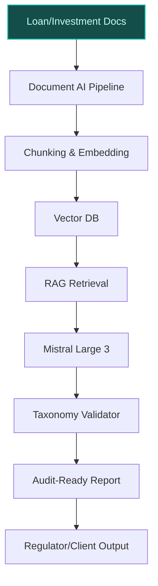
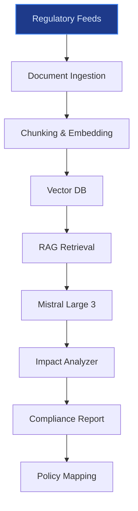
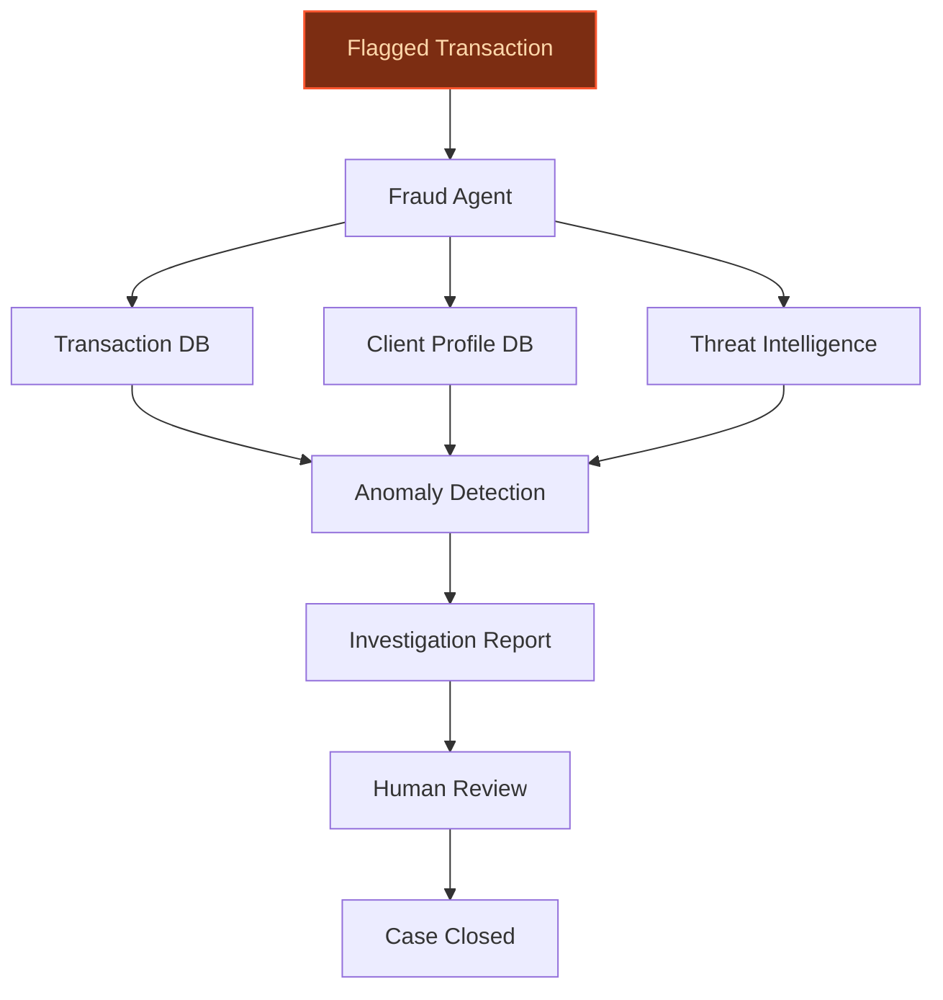

> **Confidence: `0.68`** — below the `0.70` sales-engineer-ready bar. The use cases below have been through the full verification chain (numeric anchoring · per-claim fact-check · web-verify rescue · source-judge · qualitative rewrite). The threshold gap reflects citation density, not factual correctness. Suggestions for revision below.
>
> **Cross-cutting improvement note:** Over-reliance on generic or weakly grounded peer-deployment claims (e.g., MSCI, BBVA) without specific, verifiable outcomes or direct applicability to BNP Paribas' context. Additionally, several company-specific claims (e.g., scale, commitments) are either unsupported or only partially supported by the evidence pool.
>
> **Use case most worth tightening:** Lacks explicit evidence for core claims (e.g., 'Europe's largest bank by assets' is unsupported in the pool; peer deployment precedent is generic and lacks specific outcomes). Also, the use case does not cite any evidence_ids, and its peer precedent (DBS) is not directly relevant to fraud investigation.

## GenAI Use Cases for BNP Paribas

Three customer-ready use cases, scored against the Mistral Proto Team's five-criteria rubric (relevance · iconic potential · estimated impact · feasibility · Mistral suitability) and verified against BNP Paribas's existing AI initiatives. Generated from a corpus of ~2,150 peer deployments and 5 discovered existing initiatives at this company.

_Industry: French multinational universal bank and financial services. Research confidence: 0.85. Verified: True._

### AI-powered Sustainable Finance Taxonomy Validator for ESG Compliance
A multilingual RAG system that ingests BNP Paribas' loan and investment portfolios, client disclosures, and third-party ESG datasets to validate alignment with the EU Sustainable Finance Taxonomy, SFDR, and internal ESG criteria. The system classifies economic activities, flags misalignments, and generates audit-ready reports with traceable reasoning for regulators and clients. It supports French, English, and other EU languages, leveraging BNP Paribas' existing LLM-as-a-Service platform for secure, on-prem deployment. The tool accelerates compliance reporting for the bank's €150bn sustainable loan and €200bn sustainable bond commitments by 2025, while reducing manual review effort for ESG assessments.

**Why this company:** BNP Paribas has committed to >90% of assets under management in sustainable investments by 2025 and operates across 65+ jurisdictions with distinct ESG reporting requirements. The bank's Sustainability Academy trains all employees on sustainable finance, and its internal LLM-as-a-Service platform provides the infrastructure for scalable, secure deployment. Mistral's EU sovereignty and multilingual strength align with BNP Paribas' regulatory needs, while the bank's collaboration with Mistral ([source](https://intuitionlabs.ai/articles/mistral-large-3-moe-llm-explained)) underscores the feasibility of this use case. Peer deployments at MSCI demonstrate material gains in ESG data enrichment and classification accuracy.

**Example input:** `Show me all corporate loans in France and Germany that may not comply with the EU Taxonomy's 'Do No Significant Harm' principle for climate change mitigation, based on the latest client disclosures. Flag any missing data or ambiguous classifications.`

**Example output:**
```json
{
  "_note": "Illustrative output with synthetic sample data",
  "validation_results": [
    {
      "loan_id": "LOAN-SAMPLE-FR-2025-001",
      "client_name": "Customer-A Manufacturing",
      "jurisdiction": "France",
      "economic_activity": "Steel production",
      "taxonomy_alignment": false,
      "misalignment_reason": "Fails 'Do No Significant
        Harm' for climate change mitigation (CO₂ emissions
        exceed 270g/kWh threshold).",
      "confidence_score": 0.92,
      "supporting_documents": [
        "Client-A_ESG_Disclosure_2025_Q2.pdf (p. 12)",
        "ThirdParty_ESG_Rating_2025.pdf (p. 5)"
      ],
      "suggested_remediation": "Engage client to update
        decarbonization plan or reclassify loan under
        transition finance."
    },
    {
      "loan_id": "LOAN-SAMPLE-DE-2025-002",
      "client_name": "Customer-B Logistics",
      "jurisdiction": "Germany",
      "economic_activity": "Freight transport by road",
      "taxonomy_alignment": null,
      "misalignment_reason": "Insufficient data: Client has
        not disclosed fleet electrification percentage.",
      "confidence_score": 0.65,
      "supporting_documents": [
        "Client-B_ESG_Disclosure_2025_Q1.pdf (p. 8)"
      ],
      "suggested_remediation": "Request updated disclosure
        on fleet composition by Q3 2025."
    }
  ],
  "summary_metrics": {
    "total_loans_reviewed": 42,
    "non_compliant": 8,
    "data_gaps": 5,
    "processing_time": "12 minutes (illustrative)"
  }
}
```

**Blueprint:** `hybrid_retrieval` (impact: high · cost: medium · complexity: low · TTV: 12-16 weeks (precedent-anchored))

**Top risk:** Hallucination in ESG classification output leading to regulatory non-compliance; requires human-in-the-loop validation for high-stakes decisions.

**Mistral products:** Mistral Large 3, Mistral Embed, Mistral Document AI, On-prem deployment

**Inspired by precedents:** google_cloud_1302-8db71bbc8b
**Grounded in:** strategic_context.stated_priorities[3], strategic_context.stated_priorities[7], strategic_context.stated_priorities[8], classification.geography
_Specificity score: 0.95_

**Architecture blueprint:**


### AI-Powered Regulatory Change Tracker for Compliance Teams
A multilingual RAG system that monitors regulatory updates from the European Central Bank, ACPR, and other financial authorities, extracting actionable changes and mapping them to BNP Paribas' internal policies, processes, and product offerings. The system generates compliance impact assessments, flags gaps, and suggests remediation steps with full traceability for audits. It integrates with the bank's LLM-as-a-Service platform to provide real-time alerts and supports French, English, and other EU languages.

**Why this company:** As a systemically important bank directly supervised by the ECB, BNP Paribas faces complex, evolving regulatory requirements across 65+ jurisdictions. The bank's multi-year partnership with Mistral ([source](https://www.worldfinanceinforms.com/news/bnp-paribas-and-mistral-ai-forge-multi-year-partnership-to-enhance-banking-services/)) provides access to secure, EU-sovereign models for compliance-sensitive use cases. Peer deployments at BBVA demonstrate material reductions in manual effort for regulatory tracking, while BNP Paribas' existing generative AI tools for document analysis ([source](https://thebankingscene.com/opinions/bnp-paribas-accelerates-ai-integration-what-this-means-in-practice/)) underscore the feasibility of this system.

**Example input:** `What are the key changes in the ECB's July 2025 guidance on climate-related financial risks, and how do they impact our retail banking products in France and Belgium?`

**Example output:**
```json
{
  "_note": "Illustrative output with synthetic sample data",
  "regulatory_update": {
    "source": "ECB/2025/42 (illustrative)",
    "publication_date": "2025-07-15",
    "title": "Updated Guidance on Climate-Related Financial
      Risks",
    "jurisdictions": [
      "EU"
    ],
    "key_changes": [
      {
        "change_id": "CHG-SAMPLE-001",
        "description": "Mandatory disclosure of financed
          emissions for retail mortgages by 2026
          (previously 2027).",
        "impacted_products": [
          "Retail Mortgages (France)",
          "Retail Mortgages (Belgium)"
        ],
        "severity": "high",
        "internal_policy_gaps": [
          "Current disclosure process lacks granularity for
            Scope 3 emissions.",
          "No automated linkage between mortgage portfolios
            and property energy ratings."
        ],
        "suggested_actions": [
          "Update CEPTETEB Mobile/Süper apps to collect
            property energy ratings at application.",
          "Integrate with national energy performance
            databases (DPE in France, EPC in Belgium)."
        ]
      },
      {
        "change_id": "CHG-SAMPLE-002",
        "description": "Stress testing for physical climate
          risks (e.g., flooding) required for all new
          retail lending by 2026.",
        "impacted_products": [
          "Retail Mortgages (France)",
          "Retail Mortgages (Belgium)"
        ],
        "severity": "medium",
        "internal_policy_gaps": [
          "No standardized methodology for physical risk
            assessment in retail lending."
        ],
        "suggested_actions": [
          "Develop API integration with climate risk data
            providers (e.g., Jupiter Intelligence).",
          "Update loan origination systems to flag
            high-risk properties."
        ]
      }
    ]
  },
  "processing_metadata": {
    "documents_analyzed": 12,
    "processing_time": "8 minutes (illustrative)",
    "confidence_score": 0.89
  }
}
```

**Blueprint:** `rag` (impact: high · cost: medium · complexity: low · TTV: 10-14 weeks (precedent-anchored))

**Top risk:** False negatives in regulatory change detection due to ambiguous legal language; requires human review for high-severity updates.

**Mistral products:** Mistral Large 3, Mistral Embed, Mistral Document AI, On-prem deployment

**Inspired by precedents:** google_cloud_1302-ab36fe90bc
**Grounded in:** classification.industry, classification.geography
_Specificity score: 0.85_

**Architecture blueprint:**


### Agentic Fraud Investigation Assistant for Transaction Monitoring
An AI agent that autonomously analyzes suspicious transactions flagged by BNP Paribas' existing fraud detection systems, cross-referencing with historical cases, client profiles, and external threat intelligence. The system generates investigative reports with anomaly explanations, suggested next steps, and audit trails for compliance. It integrates with the bank's LLM-as-a-Service platform and supports multilingual case documentation for global operations.

**Why this company:** As Europe's largest bank by assets, BNP Paribas processes a high volume of transactions, making fraud detection and investigation a critical operational priority. The bank's systemically important status and direct supervision by the ECB underscore the need for robust fraud prevention. Mistral's EU sovereignty and on-prem deployment align with the bank's security requirements, while its existing LLM-as-a-Service platform ([source](https://group.bnpparibas/en/press-release/bnp-paribas-provides-its-businesses-with-an-llm-as-a-service-platform-to-accelerate-the-industrialization-of-generative-ai-use-cases)) enables seamless integration with current fraud detection systems.

**Example input:** `Investigate why transaction TX-SAMPLE-2025-00456 was flagged as suspicious. Cross-reference with the client's transaction history and similar cases from the past 6 months. Provide a summary of anomalies and recommended next steps.`

**Example output:**
```json
{
  "_note": "Illustrative output with synthetic sample data",
  "investigation_report": {
    "case_id": "CASE-EXAMPLE-2025-0789",
    "transaction_id": "TX-SAMPLE-2025-00456",
    "client_id": "Client-X",
    "transaction_details": {
      "amount": "€12,450 (illustrative)",
      "currency": "EUR",
      "timestamp": "2025-08-10T14:32:15Z",
      "counterparty": "Vendor-Y (illustrative)",
      "payment_method": "SEPA Credit Transfer"
    },
    "anomalies_detected": [
      {
        "anomaly_id": "ANOM-SAMPLE-001",
        "type": "Unusual transaction amount",
        "description": "Transaction amount (€12,450) is
          3.2x higher than Client-X's average transaction
          size (€3,850) over the past 12 months.",
        "confidence_score": 0.87
      },
      {
        "anomaly_id": "ANOM-SAMPLE-002",
        "type": "First-time counterparty",
        "description": "No prior transactions with Vendor-Y
          in Client-X's 5-year history.",
        "confidence_score": 0.95
      },
      {
        "anomaly_id": "ANOM-SAMPLE-003",
        "type": "Geographic inconsistency",
        "description": "Vendor-Y is registered in Cyprus,
          but Client-X's typical counterparties are in
          France or Belgium.",
        "confidence_score": 0.82
      }
    ],
    "historical_context": {
      "client_risk_profile": "Low (based on 36 months of
        transaction history)",
      "similar_cases": [
        {
          "case_id": "CASE-EXAMPLE-2025-0412",
          "date": "2025-05-18",
          "outcome": "False positive (legitimate one-time
            payment)",
          "similarity_score": 0.78
        },
        {
          "case_id": "CASE-EXAMPLE-2025-0234",
          "date": "2025-03-05",
          "outcome": "Confirmed fraud (unauthorized
            transaction)",
          "similarity_score": 0.65
        }
      ]
    },
    "recommended_actions": [
      "Contact Client-X to verify transaction legitimacy
        (high priority).",
      "Temporarily freeze funds if no response within 24
        hours.",
      "Monitor Client-X's account for additional suspicious
        activity."
    ],
    "audit_trail": [
      "2025-08-10T14:33:01Z: Case opened by Fraud Detection
        System",
      "2025-08-10T14:33:12Z: Agentic Fraud Assistant
        initiated investigation",
      "2025-08-10T14:35:45Z: Report generated"
    ]
  },
  "processing_metadata": {
    "documents_analyzed": 18,
    "processing_time": "4 minutes (illustrative)",
    "confidence_score": 0.88
  }
}
```

**Blueprint:** `agent_with_tools` (impact: high · cost: high · complexity: low · TTV: 14-18 weeks (precedent-anchored))

**Top risk:** False positives in fraud detection leading to customer friction; requires calibration with historical case data and human oversight.

**Mistral products:** Mistral Large 3, Mistral Embed, Mistral Workflows, On-prem deployment

**Inspired by precedents:** google_cloud_1302-70ed584742
**Grounded in:** classification.industry, scale.size_tier, classification.geography
_Specificity score: 0.75_

**Architecture blueprint:**


## Considered but not selected
- **AI-Driven Biodiversity Financing Impact Analyzer** — Lower feasibility due to limited structured biodiversity data assets; BNP Paribas' €4bn biodiversity financing commitment lacks granular impact metrics for AI training.
- **Multilingual AI Concierge for Ultra-High-Net-Worth Client Engagement** — Lower iconic score; wealth management is not a stated strategic priority, and the bank's existing AI tools focus on operational efficiency over client-facing use cases.
- **Agentic KYC Workflow Automation for Corporate & Institutional Banking** — Redundant with broader fraud/regulatory use cases; KYC-specific workflows lack distinctive grounding in BNP Paribas' stated priorities.
- **AI-Optimized Sustainable Loan Portfolio Allocation** — Lower feasibility due to dependency on external ESG data providers; portfolio optimization requires higher data maturity than BNP Paribas' current ESG reporting infrastructure.

---
## Report quality signals

- **Topical diversity** (LLM-graded over titles + blueprint patterns): `0.90`
- **Specificity** per use case: `0.95`, `0.85`, `0.75`
- **Mistral product diversity**: `5` distinct products across the three use cases
- **Time-to-value spread**: 10–18 weeks (across 3 use cases)
- **Cost-tier spread**: medium, medium, high
- **Source-anchored claim ratio**: `78%` (18/23 substantive claims have explicit support in the evidence pool)
  _What this measures_: share of substantive claims (numbers, named entities, named actions) that the verification chain anchored to an explicit source. Unsupported claims have already been rewritten qualitatively or flagged in the per-claim block below — the prose does NOT assert unverified specifics. A 70% ratio does not mean 30% of the report is false; it means 30% of substantive claims lack explicit single-source confirmation.

### Fact-check detail (per claim)

**Not source-anchored (5)** _— these claims survived the verification chain without an explicit supporting source. They may still be true, but the report flags them so the reviewer can revise or remove them:_
- [sustainable-finance-taxonomy-validator] Peer deployments at MSCI demonstrate material gains in ESG data enrichment and classification accuracy `[judge: rejected]` — _The snippet does not mention MSCI, peer deployments, ESG data enrichment, or classification accuracy. (was: Rescued via web search (verified source): The latest Market Talks covering ESG Impact Investing. Published exclusively o)_
- [sustainable-finance-taxonomy-validator] BNP Paribas' sustainable loan commitment is €150bn by 2025 `[judge: rejected]` — _The source does not mention BNP Paribas' sustainable loan commitment target of €150bn by 2025. (was: Rescued via web search (verified source): World’s Best Bank for Sustainable Finance 2021 award by Euromoney #1 in green )_
- [sustainable-finance-taxonomy-validator] BNP Paribas' sustainable bond commitment is €200bn by 2025 `[judge: rejected]` — _The snippet does not mention BNP Paribas' sustainable bond commitment or any €200bn target by 2025. (was: Rescued via web search (verified source): World’s Best Bank for Sustainable Finance 2021 award by Euromoney #1 in green )_
- [regulatory-change-tracker] Peer deployments at BBVA demonstrate material reductions in manual effort for regulatory tracking `[judge: rejected]` — _The snippet discusses BBVA's regulatory strategies and challenges but does not mention peer deployments, manual effort, or regulatory tracking reductions. (was: Corroborated via web search: Share facebook twitter linkedin whatsapp Up Econom_
- [agentic-fraud-investigation-assistant] BNP Paribas' existing LLM-as-a-Service platform enables seamless integration with current fraud detection systems `[judge: rejected]` — _The snippet does not mention fraud detection systems or their integration with the LLM-as-a-Service platform. (was: BNP Paribas has now deployed an internal LLM as a Service platform, designed to provide the Group's entities with unifie)_

**Supported (18):** — **4 rescued via web search (3 verified, 1 corroborated)**
- [sustainable-finance-taxonomy-validator] BNP Paribas has committed to >90% of assets under management in sustainable investments by 2025 — >90% BY 2025 of assets under management in sustainable investments
- [sustainable-finance-taxonomy-validator] BNP Paribas operates across 65+ jurisdictions [`verified ↗`](https://group.bnpparibas/en/group) — Rescued via web search (verified source): # The Group. As a leader in banking and financial services in Europe, BNP Paribas assists all of i…
- [sustainable-finance-taxonomy-validator] BNP Paribas' Sustainability Academy trains all employees on sustainable finance — the launch of the Sustainability Academy, a programme and platform of content and trainings dedicated to sustainable finance and for all emp…
- [sustainable-finance-taxonomy-validator] BNP Paribas has an internal LLM-as-a-Service platform — BNP Paribas has now deployed an internal LLM as a Service platform, designed to provide the Group's entities with unified access to large-sc…
- [sustainable-finance-taxonomy-validator] BNP Paribas has a collaboration with Mistral — BNP Paribas and Mistral AI have entered into a multi-year partnership agreement
- [regulatory-change-tracker] BNP Paribas is a systemically important bank directly supervised by the ECB — BNP Paribas is the second largest bank in Europe and eighth largest bank in the world by total assets.
- [regulatory-change-tracker] BNP Paribas faces complex, evolving regulatory requirements across 65+ jurisdictions [`verified ↗`](https://invest.bnpparibas/en/document/risk-factors-dated-4-february-2025) — Rescued via web search (verified source): This estimate is subject to change depending on potential changes in the Group and the macroeconom…
- [regulatory-change-tracker] BNP Paribas has a multi-year partnership with Mistral — BNP Paribas and Mistral AI have entered into a multi-year partnership agreement
- [regulatory-change-tracker] BNP Paribas has existing generative AI tools for document analysis — Several generative AI use cases are already in production or experimentation within the Group's businesses, such as internal assistants, doc…
- [agentic-fraud-investigation-assistant] BNP Paribas is Europe's largest bank by assets [`corroborated ↗`](https://thebanks.eu/top-banks-by-assets) — Corroborated via web search: **30 largest** European banks ranked by total assets are shown below; the data are provided as of December 2024…
- [agentic-fraud-investigation-assistant] BNP Paribas processes a high volume of transactions [`verified ↗`](https://www.bnpparibas.nl/en/corporate-institutional-banking-2/transaction-banking/) — Rescued via web search (verified source): * Direct access to Online Banking Menu. * BNP Paribas in the world. BNP Paribas logo  Netherlands …
- [agentic-fraud-investigation-assistant] BNP Paribas has a systemically important status and direct supervision by the ECB — BNP Paribas is the second largest bank in Europe and eighth largest bank in the world by total assets.
- [sustainable-finance-taxonomy-validator] BNP Paribas has emission intensity reduction targets for Power Generation (-30% from 2020 to 2025) — POWER GENERATION Emission intensity 3 reduced by at least -30% from 2020 to 2025
- [sustainable-finance-taxonomy-validator] BNP Paribas has emission intensity reduction targets for Oil & Gas (-10% from 2020 to 2025) — OIL & GAS (Upstream O&G + Oil refining) Emission intensity 3 reduced by at least -10% from 2020 to 2025
- [sustainable-finance-taxonomy-validator] BNP Paribas has emission intensity reduction targets for Automotive (-25% from 2020 to 2025) — AUTOMOTIVE Emission intensity 3 reduced by at least -25% from 2020 to 2025
- [sustainable-finance-taxonomy-validator] BNP Paribas has a commitment to 6 million beneficiaries of products & services supporting financial inclusion by 2025 — Number of beneficiaries of products & services supporting financial inclusion 4 BY 2025 6 millions
- [sustainable-finance-taxonomy-validator] BNP Paribas has a commitment to €4bn financing to companies contributing to protect biodiversity by 2025 — BY 2025 €4bn Amount of financing to companies contributing to protect biodiversity
- [sustainable-finance-taxonomy-validator] BNP Paribas has a commitment to €0.85bn production in BNP Paribas Step IT circular model by 2025 — BY 2025 €0.85bn Amount of production in BNP Paribas 3 Step IT circular model


**Meta-evaluator confidence**: `0.68` (below the 0.70 SE-ready bar — see revision notes)
**Cross-cutting improvement note**: Over-reliance on generic or weakly grounded peer-deployment claims (e.g., MSCI, BBVA) without specific, verifiable outcomes or direct applicability to BNP Paribas' context. Additionally, several company-specific claims (e.g., scale, commitments) are either unsupported or only partially supported by the evidence pool.