# Trace

## Execution trace — BNP Paribas

Started: `2026-05-11T01:53:23.848658+00:00`. Total wall time: `172.7s` across `48` recorded actions.

### Per-step time totals

| Step | Calls | Total time | Avg time |
|---|---:|---:|---:|
| `research` | 1 | 7.37s | 7366ms |
| `gap_fill` | 4 | 3.56s | 890ms |
| `retrieve` | 2 | 0.17s | 84ms |
| `generate` | 2 | 23.83s | 11915ms |
| `generate.web_search` | 2 | 6.49s | 3244ms |
| `score` | 2 | 26.51s | 13256ms |
| `verify` | 6 | 20.54s | 3423ms |
| `enrich` | 1 | 61.88s | 61883ms |
| `meta_eval` | 1 | 13.27s | 13272ms |
| `web_verify` | 1 | 3.79s | 3792ms |
| `source_judge` | 24 | 24.80s | 1033ms |
| `quality_signals` | 2 | 4.46s | 2232ms |

### Chronological event log

- `01:53:24.847` **[research]** `mistral-medium-2604.chat.complete` — 7366ms
   - inputs: synthesize CompanyContext for BNP Paribas | depth=medium
   - outputs: industry='French multinational universal bank and financial services' verified=True conf=0.75
- `01:53:32.214` **[gap_fill]** `mistral-small-2603.chat.complete` — 1049ms
   - inputs: generate gap queries | fields=['business_model', 'products', 'data_assets', 'priorities']
   - outputs: queries=4
- `01:53:37.458` **[gap_fill]** `mistral-small-2603.chat.complete` — 1487ms
   - inputs: layer-2 extract field=priorities
   - outputs: items=10
- `01:53:37.465` **[gap_fill]** `mistral-small-2603.chat.complete` — 408ms
   - inputs: layer-2 extract field=data_assets
   - outputs: items=0
- `01:53:37.469` **[gap_fill]** `mistral-small-2603.chat.complete` — 618ms
   - inputs: layer-2 extract field=products
   - outputs: items=5
- `01:53:38.948` **[retrieve]** `mistral-embed.embeddings.create` — 163ms
   - inputs: company_query | industries='French multinational universal bank and financial services'
   - outputs: embedded 1024-dim query vector
- `01:53:39.111` **[retrieve]** `precedent_corpus.cosine_topk` — 5ms
   - inputs: k=8 min_depth=0.4 target='BNP Paribas'
   - outputs: retrieved 8 | mmr=True | top_sim=0.751
- `01:53:40.949` **[generate]** `mistral-medium-2604.chat.complete` — 2328ms
   - inputs: iteration=0 tool_calls_used=0/2 tools=on
   - outputs: tool_calls=4 | content_chars=0
- `01:53:43.291` **[generate.web_search]** `tavily.search` — 4142ms
   - inputs: query='BNP Paribas 2025 sustainability targets and initiatives'
   - outputs: 2 raw results
- `01:53:57.654` **[generate.web_search]** `tavily.search` — 2345ms
   - inputs: query='BNP Paribas private banking and wealth management digital tools 2025'
   - outputs: 2 raw results
- `01:54:01.039` **[generate]** `mistral-medium-2604.chat.complete` — 21501ms
   - inputs: iteration=1 tool_calls_used=2/2 tools=off
   - outputs: tool_calls=0 | content_chars=16330
- `01:54:22.865` **[score]** `mistral-small-2603.chat.complete` — 12905ms
   - inputs: self-consistency pass T=0.2
   - outputs: scored 8 candidates
- `01:54:22.870` **[score]** `mistral-small-2603.chat.complete` — 13607ms
   - inputs: self-consistency pass T=0.4
   - outputs: scored 8 candidates
- `01:54:36.513` **[verify]** `tavily.search` — 2417ms
   - inputs: candidate=sustainable-finance-taxonomy-validator | query='BNP Paribas AI-powered Sustainable Finance Taxonomy Validato'
   - outputs: 4 results
- `01:54:36.513` **[verify]** `tavily.search` — 2357ms
   - inputs: candidate=regulatory-change-tracker | query='BNP Paribas AI-Powered Regulatory Change Tracker for Complia'
   - outputs: 4 results
- `01:54:36.514` **[verify]** `tavily.search` — 2178ms
   - inputs: candidate=sustainable-loan-portfolio-optimizer | query='BNP Paribas AI-Optimized Sustainable Loan Portfolio Allocati'
   - outputs: 4 results
- `01:54:40.025` **[verify]** `mistral-small-2603.chat.complete` — 4636ms
   - inputs: verdict for sustainable-loan-portfolio-optimizer
   - outputs: verdict='pass'
- `01:54:40.055` **[verify]** `mistral-small-2603.chat.complete` — 4519ms
   - inputs: verdict for sustainable-finance-taxonomy-validator
   - outputs: verdict='pass'
- `01:54:40.550` **[verify]** `mistral-small-2603.chat.complete` — 4432ms
   - inputs: verdict for regulatory-change-tracker
   - outputs: verdict='pass'
- `01:54:44.985` **[enrich]** `mistral-large-2512.chat.complete` — 61883ms
   - inputs: tier=standard parallel=False ids=['sustainable-finance-taxonomy-validator', 'regulatory-change-tracker', 'agentic-fraud-investigation-assistant']
   - outputs: enriched 3 use cases
- `01:55:46.900` **[meta_eval]** `mistral-medium-2604.chat.complete` — 13272ms
   - inputs: reviewing 3 use cases
   - outputs: review + claims
- `01:56:00.187` **[web_verify]** `tavily.search.rescue_unsupported_claims` — 3792ms
   - inputs: company='BNP Paribas' unsupported=8 budget=12
   - outputs: rescued: verified=6 corroborated=2 of 8 attempted
- `01:56:03.980` **[source_judge]** `mistral-small-2603.judge_claim_sources` — 5813ms
   - inputs: pairs=23
   - outputs: judged 23 pairs
- `01:56:03.980` **[source_judge]** `mistral-small-2603.chat.complete` — 705ms
   - inputs: claim='BNP Paribas has committed to >90% of assets under management'
   - outputs: verdict=supported
- `01:56:03.983` **[source_judge]** `mistral-small-2603.chat.complete` — 703ms
   - inputs: claim='BNP Paribas operates across 65+ jurisdictions'
   - outputs: verdict=supported
- `01:56:03.986` **[source_judge]** `mistral-small-2603.chat.complete` — 1121ms
   - inputs: claim="BNP Paribas' Sustainability Academy trains all employees on "
   - outputs: verdict=supported
- `01:56:03.992` **[source_judge]** `mistral-small-2603.chat.complete` — 694ms
   - inputs: claim='BNP Paribas has an internal LLM-as-a-Service platform'
   - outputs: verdict=supported
- `01:56:03.995` **[source_judge]** `mistral-small-2603.chat.complete` — 689ms
   - inputs: claim='BNP Paribas has a collaboration with Mistral'
   - outputs: verdict=supported
- `01:56:03.999` **[source_judge]** `mistral-small-2603.chat.complete` — 682ms
   - inputs: claim='Peer deployments at MSCI demonstrate material gains in ESG d'
   - outputs: verdict=unsupported
- `01:56:04.002` **[source_judge]** `mistral-small-2603.chat.complete` — 684ms
   - inputs: claim="BNP Paribas' sustainable loan commitment is €150bn by 2025"
   - outputs: verdict=unsupported
- `01:56:04.004` **[source_judge]** `mistral-small-2603.chat.complete` — 682ms
   - inputs: claim="BNP Paribas' sustainable bond commitment is €200bn by 2025"
   - outputs: verdict=unsupported
- `01:56:04.681` **[source_judge]** `mistral-small-2603.chat.complete` — 676ms
   - inputs: claim='BNP Paribas is a systemically important bank directly superv'
   - outputs: verdict=supported
- `01:56:04.687` **[source_judge]** `mistral-small-2603.chat.complete` — 734ms
   - inputs: claim='BNP Paribas faces complex, evolving regulatory requirements '
   - outputs: verdict=supported
- `01:56:04.690` **[source_judge]** `mistral-small-2603.chat.complete` — 517ms
   - inputs: claim='BNP Paribas has a multi-year partnership with Mistral'
   - outputs: verdict=supported
- `01:56:04.693` **[source_judge]** `mistral-small-2603.chat.complete` — 672ms
   - inputs: claim='Peer deployments at BBVA demonstrate material reductions in '
   - outputs: verdict=unsupported
- `01:56:04.697` **[source_judge]** `mistral-small-2603.chat.complete` — 525ms
   - inputs: claim='BNP Paribas has existing generative AI tools for document an'
   - outputs: verdict=supported
- `01:56:04.702` **[source_judge]** `mistral-small-2603.chat.complete` — 634ms
   - inputs: claim="BNP Paribas is Europe's largest bank by assets"
   - outputs: verdict=supported
- `01:56:04.705` **[source_judge]** `mistral-small-2603.chat.complete` — 699ms
   - inputs: claim='BNP Paribas processes a high volume of transactions'
   - outputs: verdict=supported
- `01:56:05.107` **[source_judge]** `mistral-small-2603.chat.complete` — 615ms
   - inputs: claim='BNP Paribas has a systemically important status and direct s'
   - outputs: verdict=supported
- `01:56:05.207` **[source_judge]** `mistral-small-2603.chat.complete` — 515ms
   - inputs: claim="BNP Paribas' existing LLM-as-a-Service platform enables seam"
   - outputs: verdict=unsupported
- `01:56:05.222` **[source_judge]** `mistral-small-2603.chat.complete` — 557ms
   - inputs: claim='BNP Paribas has emission intensity reduction targets for Pow'
   - outputs: verdict=supported
- `01:56:05.336` **[source_judge]** `mistral-small-2603.chat.complete` — 618ms
   - inputs: claim='BNP Paribas has emission intensity reduction targets for Oil'
   - outputs: verdict=supported
- `01:56:05.357` **[source_judge]** `mistral-small-2603.chat.complete` — 622ms
   - inputs: claim='BNP Paribas has emission intensity reduction targets for Aut'
   - outputs: verdict=supported
- `01:56:05.366` **[source_judge]** `mistral-small-2603.chat.complete` — 4427ms
   - inputs: claim='BNP Paribas has a commitment to 6 million beneficiaries of p'
   - outputs: verdict=supported
- `01:56:05.404` **[source_judge]** `mistral-small-2603.chat.complete` — 576ms
   - inputs: claim='BNP Paribas has a commitment to €4bn financing to companies '
   - outputs: verdict=supported
- `01:56:05.421` **[source_judge]** `mistral-small-2603.chat.complete` — 637ms
   - inputs: claim='BNP Paribas has a commitment to €0.85bn production in BNP Pa'
   - outputs: verdict=supported
- `01:56:12.039` **[quality_signals]** `mistral-small-2603.chat.complete` — 3140ms
   - inputs: specificity grade (3 use cases)
   - outputs: scored 3 use cases
- `01:56:15.179` **[quality_signals]** `mistral-small-2603.chat.complete` — 1325ms
   - inputs: diversity grade
   - outputs: diversity=0.9

## Mermaid sequence

```mermaid
sequenceDiagram
    autonumber
    participant pipeline as pipeline
    participant mistral_medium_2604 as mistral-medium-2604
    participant mistral_small_2603 as mistral-small-2603
    participant mistral_embed as mistral-embed
    participant precedent_corpus as precedent_corpus
    participant tavily as tavily
    participant mistral_large_2512 as mistral-large-2512
    participant tavily_search as tavily.search
    pipeline->>mistral_medium_2604: research: chat.complete (7366ms)
    mistral_medium_2604-->>pipeline: industry='French multinational universal bank and financial 
    pipeline->>mistral_small_2603: gap_fill: chat.complete (1049ms)
    mistral_small_2603-->>pipeline: queries=4
    pipeline->>mistral_small_2603: gap_fill: chat.complete (1487ms)
    mistral_small_2603-->>pipeline: items=10
    pipeline->>mistral_small_2603: gap_fill: chat.complete (408ms)
    mistral_small_2603-->>pipeline: items=0
    pipeline->>mistral_small_2603: gap_fill: chat.complete (618ms)
    mistral_small_2603-->>pipeline: items=5
    pipeline->>mistral_embed: retrieve: embeddings.create (163ms)
    mistral_embed-->>pipeline: embedded 1024-dim query vector
    pipeline->>precedent_corpus: retrieve: cosine_topk (5ms)
    precedent_corpus-->>pipeline: retrieved 8 | mmr=True | top_sim=0.751
    pipeline->>mistral_medium_2604: generate: chat.complete (2328ms)
    mistral_medium_2604-->>pipeline: tool_calls=4 | content_chars=0
    pipeline->>tavily: generate.web_search: search (4142ms)
    tavily-->>pipeline: 2 raw results
    pipeline->>tavily: generate.web_search: search (2345ms)
    tavily-->>pipeline: 2 raw results
    pipeline->>mistral_medium_2604: generate: chat.complete (21501ms)
    mistral_medium_2604-->>pipeline: tool_calls=0 | content_chars=16330
    pipeline->>mistral_small_2603: score: chat.complete (12905ms)
    mistral_small_2603-->>pipeline: scored 8 candidates
    pipeline->>mistral_small_2603: score: chat.complete (13607ms)
    mistral_small_2603-->>pipeline: scored 8 candidates
    pipeline->>tavily: verify: search (2417ms)
    tavily-->>pipeline: 4 results
    pipeline->>tavily: verify: search (2357ms)
    tavily-->>pipeline: 4 results
    pipeline->>tavily: verify: search (2178ms)
    tavily-->>pipeline: 4 results
    pipeline->>mistral_small_2603: verify: chat.complete (4636ms)
    mistral_small_2603-->>pipeline: verdict='pass'
    pipeline->>mistral_small_2603: verify: chat.complete (4519ms)
    mistral_small_2603-->>pipeline: verdict='pass'
    pipeline->>mistral_small_2603: verify: chat.complete (4432ms)
    mistral_small_2603-->>pipeline: verdict='pass'
    pipeline->>mistral_large_2512: enrich: chat.complete (61883ms)
    mistral_large_2512-->>pipeline: enriched 3 use cases
    pipeline->>mistral_medium_2604: meta_eval: chat.complete (13272ms)
    mistral_medium_2604-->>pipeline: review + claims
    pipeline->>tavily_search: web_verify: rescue_unsupported_claims (3792ms)
    tavily_search-->>pipeline: rescued: verified=6 corroborated=2 of 8 attempted
    pipeline->>mistral_small_2603: source_judge: judge_claim_sources (5813ms)
    mistral_small_2603-->>pipeline: judged 23 pairs
    pipeline->>mistral_small_2603: source_judge: chat.complete (705ms)
    mistral_small_2603-->>pipeline: verdict=supported
    pipeline->>mistral_small_2603: source_judge: chat.complete (703ms)
    mistral_small_2603-->>pipeline: verdict=supported
    pipeline->>mistral_small_2603: source_judge: chat.complete (1121ms)
    mistral_small_2603-->>pipeline: verdict=supported
    pipeline->>mistral_small_2603: source_judge: chat.complete (694ms)
    mistral_small_2603-->>pipeline: verdict=supported
    pipeline->>mistral_small_2603: source_judge: chat.complete (689ms)
    mistral_small_2603-->>pipeline: verdict=supported
    pipeline->>mistral_small_2603: source_judge: chat.complete (682ms)
    mistral_small_2603-->>pipeline: verdict=unsupported
    pipeline->>mistral_small_2603: source_judge: chat.complete (684ms)
    mistral_small_2603-->>pipeline: verdict=unsupported
    pipeline->>mistral_small_2603: source_judge: chat.complete (682ms)
    mistral_small_2603-->>pipeline: verdict=unsupported
    pipeline->>mistral_small_2603: source_judge: chat.complete (676ms)
    mistral_small_2603-->>pipeline: verdict=supported
    pipeline->>mistral_small_2603: source_judge: chat.complete (734ms)
    mistral_small_2603-->>pipeline: verdict=supported
    pipeline->>mistral_small_2603: source_judge: chat.complete (517ms)
    mistral_small_2603-->>pipeline: verdict=supported
    pipeline->>mistral_small_2603: source_judge: chat.complete (672ms)
    mistral_small_2603-->>pipeline: verdict=unsupported
    pipeline->>mistral_small_2603: source_judge: chat.complete (525ms)
    mistral_small_2603-->>pipeline: verdict=supported
    pipeline->>mistral_small_2603: source_judge: chat.complete (634ms)
    mistral_small_2603-->>pipeline: verdict=supported
    pipeline->>mistral_small_2603: source_judge: chat.complete (699ms)
    mistral_small_2603-->>pipeline: verdict=supported
    pipeline->>mistral_small_2603: source_judge: chat.complete (615ms)
    mistral_small_2603-->>pipeline: verdict=supported
    pipeline->>mistral_small_2603: source_judge: chat.complete (515ms)
    mistral_small_2603-->>pipeline: verdict=unsupported
    pipeline->>mistral_small_2603: source_judge: chat.complete (557ms)
    mistral_small_2603-->>pipeline: verdict=supported
    pipeline->>mistral_small_2603: source_judge: chat.complete (618ms)
    mistral_small_2603-->>pipeline: verdict=supported
    pipeline->>mistral_small_2603: source_judge: chat.complete (622ms)
    mistral_small_2603-->>pipeline: verdict=supported
    pipeline->>mistral_small_2603: source_judge: chat.complete (4427ms)
    mistral_small_2603-->>pipeline: verdict=supported
    pipeline->>mistral_small_2603: source_judge: chat.complete (576ms)
    mistral_small_2603-->>pipeline: verdict=supported
    pipeline->>mistral_small_2603: source_judge: chat.complete (637ms)
    mistral_small_2603-->>pipeline: verdict=supported
    pipeline->>mistral_small_2603: quality_signals: chat.complete (3140ms)
    mistral_small_2603-->>pipeline: scored 3 use cases
    pipeline->>mistral_small_2603: quality_signals: chat.complete (1325ms)
    mistral_small_2603-->>pipeline: diversity=0.9
```

