# Trace

## Execution trace — Carrefour

Started: `2026-05-11T01:56:16.507703+00:00`. Total wall time: `173.8s` across `50` recorded actions.

### Per-step time totals

| Step | Calls | Total time | Avg time |
|---|---:|---:|---:|
| `research` | 1 | 8.00s | 8004ms |
| `gap_fill` | 4 | 3.20s | 800ms |
| `retrieve` | 2 | 0.25s | 127ms |
| `generate` | 2 | 24.58s | 12290ms |
| `generate.web_search` | 2 | 6.16s | 3080ms |
| `score` | 2 | 26.06s | 13031ms |
| `verify` | 6 | 15.80s | 2634ms |
| `enrich` | 1 | 66.83s | 66834ms |
| `polish` | 2 | 5.10s | 2551ms |
| `meta_eval` | 1 | 12.24s | 12237ms |
| `web_verify` | 1 | 12.41s | 12407ms |
| `source_judge` | 23 | 17.35s | 754ms |
| `final_qualify` | 1 | 1.84s | 1844ms |
| `quality_signals` | 2 | 4.69s | 2347ms |

### Chronological event log

- `01:56:16.779` **[research]** `mistral-medium-2604.chat.complete` — 8004ms
   - inputs: synthesize CompanyContext for Carrefour | depth=medium
   - outputs: industry='French multinational retail and wholesaling corporation' verified=True conf=0.75
- `01:56:24.784` **[gap_fill]** `mistral-small-2603.chat.complete` — 867ms
   - inputs: generate gap queries | fields=['business_model', 'products', 'data_assets', 'priorities']
   - outputs: queries=4
- `01:56:29.723` **[gap_fill]** `mistral-small-2603.chat.complete` — 795ms
   - inputs: layer-2 extract field=priorities
   - outputs: items=8
- `01:56:29.727` **[gap_fill]** `mistral-small-2603.chat.complete` — 910ms
   - inputs: layer-2 extract field=data_assets
   - outputs: items=6
- `01:56:29.730` **[gap_fill]** `mistral-small-2603.chat.complete` — 627ms
   - inputs: layer-2 extract field=products
   - outputs: items=5
- `01:56:30.638` **[retrieve]** `mistral-embed.embeddings.create` — 250ms
   - inputs: company_query | industries='French multinational retail and wholesaling corporation'
   - outputs: embedded 1024-dim query vector
- `01:56:30.888` **[retrieve]** `precedent_corpus.cosine_topk` — 3ms
   - inputs: k=8 min_depth=0.4 target='Carrefour'
   - outputs: retrieved 8 | mmr=True | top_sim=0.816
- `01:56:32.639` **[generate]** `mistral-medium-2604.chat.complete` — 1802ms
   - inputs: iteration=0 tool_calls_used=0/2 tools=on
   - outputs: tool_calls=4 | content_chars=0
- `01:56:34.457` **[generate.web_search]** `tavily.search` — 3772ms
   - inputs: query='Carrefour 2024 store count countries loyalty program Hopi Zubizu'
   - outputs: 2 raw results
- `01:56:38.263` **[generate.web_search]** `tavily.search` — 2388ms
   - inputs: query='Carrefour Léa speech-enabled virtual shopping assistant details'
   - outputs: 2 raw results
- `01:56:42.181` **[generate]** `mistral-medium-2604.chat.complete` — 22779ms
   - inputs: iteration=1 tool_calls_used=2/2 tools=off
   - outputs: tool_calls=0 | content_chars=15916
- `01:57:05.943` **[score]** `mistral-small-2603.chat.complete` — 12529ms
   - inputs: self-consistency pass T=0.2
   - outputs: scored 8 candidates
- `01:57:05.948` **[score]** `mistral-small-2603.chat.complete` — 13534ms
   - inputs: self-consistency pass T=0.4
   - outputs: scored 8 candidates
- `01:57:19.512` **[verify]** `tavily.search` — 1952ms
   - inputs: candidate=multilingual_shelf_compliance_agent | query='Carrefour Multilingual Shelf Compliance Agent for In-Store E'
   - outputs: 4 results
- `01:57:19.512` **[verify]** `tavily.search` — 2447ms
   - inputs: candidate=carrefour_bio_sustainability_tracker | query='Carrefour AI-Powered Sustainability Tracker for Carrefour Bi'
   - outputs: 4 results
- `01:57:19.512` **[verify]** `tavily.search` — 3804ms
   - inputs: candidate=atacadao_supply_chain_anomaly_detector | query='Carrefour AI-Powered Anomaly Detection for Atacadão Cash & C'
   - outputs: 4 results
- `01:57:21.954` **[verify]** `mistral-small-2603.chat.complete` — 1672ms
   - inputs: verdict for multilingual_shelf_compliance_agent
   - outputs: verdict='pass'
- `01:57:22.682` **[verify]** `mistral-small-2603.chat.complete` — 4242ms
   - inputs: verdict for carrefour_bio_sustainability_tracker
   - outputs: verdict='pass'
- `01:57:23.783` **[verify]** `mistral-small-2603.chat.complete` — 1687ms
   - inputs: verdict for atacadao_supply_chain_anomaly_detector
   - outputs: verdict='pass'
- `01:57:26.927` **[enrich]** `mistral-large-2512.chat.complete` — 66834ms
   - inputs: tier=standard parallel=False ids=['multilingual_shelf_compliance_agent', 'carrefour_bio_sustainability_tracker', 'atacadao_supply_chain_anomaly_detector']
   - outputs: enriched 3 use cases
- `01:58:33.782` **[polish]** `mistral-small-2603.chat.complete` — 2380ms
   - inputs: use_case=multilingual_shelf_compliance_agent unanchored=True opaque_ev=False
   - outputs: polished 5 fields
- `01:58:33.788` **[polish]** `mistral-small-2603.chat.complete` — 2723ms
   - inputs: use_case=atacadao_supply_chain_anomaly_detector unanchored=True opaque_ev=False
   - outputs: polished 5 fields
- `01:58:36.514` **[meta_eval]** `mistral-medium-2604.chat.complete` — 12237ms
   - inputs: reviewing 3 use cases
   - outputs: review + claims
- `01:58:48.767` **[web_verify]** `tavily.search.rescue_unsupported_claims` — 12407ms
   - inputs: company='Carrefour' unsupported=7 budget=12
   - outputs: rescued: verified=6 corroborated=0 of 7 attempted
- `01:59:01.175` **[source_judge]** `mistral-small-2603.judge_claim_sources` — 2179ms
   - inputs: pairs=22
   - outputs: judged 22 pairs
- `01:59:01.175` **[source_judge]** `mistral-small-2603.chat.complete` — 1007ms
   - inputs: claim='Carrefour has 15,244 stores across 8 directly operated count'
   - outputs: verdict=corrected
- `01:59:01.180` **[source_judge]** `mistral-small-2603.chat.complete` — 708ms
   - inputs: claim='Carrefour has 864,000+ SKUs'
   - outputs: verdict=supported
- `01:59:01.184` **[source_judge]** `mistral-small-2603.chat.complete` — 705ms
   - inputs: claim="Carrefour’s stated priority includes 'digital transformation"
   - outputs: verdict=supported
- `01:59:01.188` **[source_judge]** `mistral-small-2603.chat.complete` — 582ms
   - inputs: claim="Carrefour’s stated priority includes 'rationalising processe"
   - outputs: verdict=supported
- `01:59:01.194` **[source_judge]** `mistral-small-2603.chat.complete` — 713ms
   - inputs: claim='Mistral’s EU-hosted models match Carrefour’s regional footpr'
   - outputs: verdict=unsupported
- `01:59:01.197` **[source_judge]** `mistral-small-2603.chat.complete` — 701ms
   - inputs: claim='Mistral’s multilingual coverage includes French, Spanish, It'
   - outputs: verdict=unsupported
- `01:59:01.200` **[source_judge]** `mistral-small-2603.chat.complete` — 754ms
   - inputs: claim='Comparable deployments report material reductions in manual '
   - outputs: verdict=unsupported
- `01:59:01.203` **[source_judge]** `mistral-small-2603.chat.complete` — 866ms
   - inputs: claim='Carrefour Bio is a flagship product line'
   - outputs: verdict=supported
- `01:59:01.770` **[source_judge]** `mistral-small-2603.chat.complete` — 1009ms
   - inputs: claim='Carrefour has 15,244 stores'
   - outputs: verdict=corrected
- `01:59:01.889` **[source_judge]** `mistral-small-2603.chat.complete` — 476ms
   - inputs: claim='Carrefour has 864,000+ SKUs'
   - outputs: verdict=supported
- `01:59:01.894` **[source_judge]** `mistral-small-2603.chat.complete` — 754ms
   - inputs: claim='Carrefour’s sustainability system supports 5 languages (Fren'
   - outputs: verdict=unsupported
- `01:59:01.899` **[source_judge]** `mistral-small-2603.chat.complete` — 1135ms
   - inputs: claim='Carrefour’s sustainability system aligns with EU Corporate S'
   - outputs: verdict=unsupported
- `01:59:01.907` **[source_judge]** `mistral-small-2603.chat.complete` — 519ms
   - inputs: claim='Carrefour’s sustainability system integrates with Carrefour’'
   - outputs: verdict=unsupported
- `01:59:01.954` **[source_judge]** `mistral-small-2603.chat.complete` — 612ms
   - inputs: claim='Mistral’s lifecycle analysis tool was developed with ADEME a'
   - outputs: verdict=supported
- `01:59:02.069` **[source_judge]** `mistral-small-2603.chat.complete` — 915ms
   - inputs: claim='Atacadão is Carrefour’s cash & carry format in Brazil'
   - outputs: verdict=supported
- `01:59:02.182` **[source_judge]** `mistral-small-2603.chat.complete` — 606ms
   - inputs: claim='Atacadão has 413 outlets'
   - outputs: verdict=supported
- `01:59:02.365` **[source_judge]** `mistral-small-2603.chat.complete` — 569ms
   - inputs: claim='Supply chain efficiency is a strategic priority for Carrefou'
   - outputs: verdict=supported
- `01:59:02.427` **[source_judge]** `mistral-small-2603.chat.complete` — 508ms
   - inputs: claim='Carrefour seeks to increase exposure in Brazil'
   - outputs: verdict=supported
- `01:59:02.566` **[source_judge]** `mistral-small-2603.chat.complete` — 488ms
   - inputs: claim='Comparable deployments report material reductions in stockou'
   - outputs: verdict=unsupported
- `01:59:02.648` **[source_judge]** `mistral-small-2603.chat.complete` — 504ms
   - inputs: claim='OK Corporation is a discount supermarket chain operating 147'
   - outputs: verdict=supported
- `01:59:02.779` **[source_judge]** `mistral-small-2603.chat.complete` — 474ms
   - inputs: claim='OK Corporation uses a cloud analytics platform to process pu'
   - outputs: verdict=supported
- `01:59:02.789` **[source_judge]** `mistral-small-2603.chat.complete` — 565ms
   - inputs: claim='OK Corporation’s platform supports 20% annual growth'
   - outputs: verdict=supported
- `01:59:03.356` **[final_qualify]** `mistral-small-2603.chat.complete` — 1844ms
   - inputs: use_case=carrefour_bio_sustainability_tracker unsupported=1
   - outputs: qualified 4 fields
- `01:59:05.589` **[quality_signals]** `mistral-small-2603.chat.complete` — 3428ms
   - inputs: specificity grade (3 use cases)
   - outputs: scored 3 use cases
- `01:59:09.017` **[quality_signals]** `mistral-small-2603.chat.complete` — 1265ms
   - inputs: diversity grade
   - outputs: diversity=0.9

## Mermaid sequence

```mermaid
sequenceDiagram
    autonumber
    participant pipeline as pipeline
    participant mistral_medium_2604 as mistral-medium-2604
    participant mistral_small_2603 as mistral-small-2603
    participant mistral_embed as mistral-embed
    participant precedent_corpus as precedent_corpus
    participant tavily as tavily
    participant mistral_large_2512 as mistral-large-2512
    participant tavily_search as tavily.search
    pipeline->>mistral_medium_2604: research: chat.complete (8004ms)
    mistral_medium_2604-->>pipeline: industry='French multinational retail and wholesaling corpor
    pipeline->>mistral_small_2603: gap_fill: chat.complete (867ms)
    mistral_small_2603-->>pipeline: queries=4
    pipeline->>mistral_small_2603: gap_fill: chat.complete (795ms)
    mistral_small_2603-->>pipeline: items=8
    pipeline->>mistral_small_2603: gap_fill: chat.complete (910ms)
    mistral_small_2603-->>pipeline: items=6
    pipeline->>mistral_small_2603: gap_fill: chat.complete (627ms)
    mistral_small_2603-->>pipeline: items=5
    pipeline->>mistral_embed: retrieve: embeddings.create (250ms)
    mistral_embed-->>pipeline: embedded 1024-dim query vector
    pipeline->>precedent_corpus: retrieve: cosine_topk (3ms)
    precedent_corpus-->>pipeline: retrieved 8 | mmr=True | top_sim=0.816
    pipeline->>mistral_medium_2604: generate: chat.complete (1802ms)
    mistral_medium_2604-->>pipeline: tool_calls=4 | content_chars=0
    pipeline->>tavily: generate.web_search: search (3772ms)
    tavily-->>pipeline: 2 raw results
    pipeline->>tavily: generate.web_search: search (2388ms)
    tavily-->>pipeline: 2 raw results
    pipeline->>mistral_medium_2604: generate: chat.complete (22779ms)
    mistral_medium_2604-->>pipeline: tool_calls=0 | content_chars=15916
    pipeline->>mistral_small_2603: score: chat.complete (12529ms)
    mistral_small_2603-->>pipeline: scored 8 candidates
    pipeline->>mistral_small_2603: score: chat.complete (13534ms)
    mistral_small_2603-->>pipeline: scored 8 candidates
    pipeline->>tavily: verify: search (1952ms)
    tavily-->>pipeline: 4 results
    pipeline->>tavily: verify: search (2447ms)
    tavily-->>pipeline: 4 results
    pipeline->>tavily: verify: search (3804ms)
    tavily-->>pipeline: 4 results
    pipeline->>mistral_small_2603: verify: chat.complete (1672ms)
    mistral_small_2603-->>pipeline: verdict='pass'
    pipeline->>mistral_small_2603: verify: chat.complete (4242ms)
    mistral_small_2603-->>pipeline: verdict='pass'
    pipeline->>mistral_small_2603: verify: chat.complete (1687ms)
    mistral_small_2603-->>pipeline: verdict='pass'
    pipeline->>mistral_large_2512: enrich: chat.complete (66834ms)
    mistral_large_2512-->>pipeline: enriched 3 use cases
    pipeline->>mistral_small_2603: polish: chat.complete (2380ms)
    mistral_small_2603-->>pipeline: polished 5 fields
    pipeline->>mistral_small_2603: polish: chat.complete (2723ms)
    mistral_small_2603-->>pipeline: polished 5 fields
    pipeline->>mistral_medium_2604: meta_eval: chat.complete (12237ms)
    mistral_medium_2604-->>pipeline: review + claims
    pipeline->>tavily_search: web_verify: rescue_unsupported_claims (12407ms)
    tavily_search-->>pipeline: rescued: verified=6 corroborated=0 of 7 attempted
    pipeline->>mistral_small_2603: source_judge: judge_claim_sources (2179ms)
    mistral_small_2603-->>pipeline: judged 22 pairs
    pipeline->>mistral_small_2603: source_judge: chat.complete (1007ms)
    mistral_small_2603-->>pipeline: verdict=corrected
    pipeline->>mistral_small_2603: source_judge: chat.complete (708ms)
    mistral_small_2603-->>pipeline: verdict=supported
    pipeline->>mistral_small_2603: source_judge: chat.complete (705ms)
    mistral_small_2603-->>pipeline: verdict=supported
    pipeline->>mistral_small_2603: source_judge: chat.complete (582ms)
    mistral_small_2603-->>pipeline: verdict=supported
    pipeline->>mistral_small_2603: source_judge: chat.complete (713ms)
    mistral_small_2603-->>pipeline: verdict=unsupported
    pipeline->>mistral_small_2603: source_judge: chat.complete (701ms)
    mistral_small_2603-->>pipeline: verdict=unsupported
    pipeline->>mistral_small_2603: source_judge: chat.complete (754ms)
    mistral_small_2603-->>pipeline: verdict=unsupported
    pipeline->>mistral_small_2603: source_judge: chat.complete (866ms)
    mistral_small_2603-->>pipeline: verdict=supported
    pipeline->>mistral_small_2603: source_judge: chat.complete (1009ms)
    mistral_small_2603-->>pipeline: verdict=corrected
    pipeline->>mistral_small_2603: source_judge: chat.complete (476ms)
    mistral_small_2603-->>pipeline: verdict=supported
    pipeline->>mistral_small_2603: source_judge: chat.complete (754ms)
    mistral_small_2603-->>pipeline: verdict=unsupported
    pipeline->>mistral_small_2603: source_judge: chat.complete (1135ms)
    mistral_small_2603-->>pipeline: verdict=unsupported
    pipeline->>mistral_small_2603: source_judge: chat.complete (519ms)
    mistral_small_2603-->>pipeline: verdict=unsupported
    pipeline->>mistral_small_2603: source_judge: chat.complete (612ms)
    mistral_small_2603-->>pipeline: verdict=supported
    pipeline->>mistral_small_2603: source_judge: chat.complete (915ms)
    mistral_small_2603-->>pipeline: verdict=supported
    pipeline->>mistral_small_2603: source_judge: chat.complete (606ms)
    mistral_small_2603-->>pipeline: verdict=supported
    pipeline->>mistral_small_2603: source_judge: chat.complete (569ms)
    mistral_small_2603-->>pipeline: verdict=supported
    pipeline->>mistral_small_2603: source_judge: chat.complete (508ms)
    mistral_small_2603-->>pipeline: verdict=supported
    pipeline->>mistral_small_2603: source_judge: chat.complete (488ms)
    mistral_small_2603-->>pipeline: verdict=unsupported
    pipeline->>mistral_small_2603: source_judge: chat.complete (504ms)
    mistral_small_2603-->>pipeline: verdict=supported
    pipeline->>mistral_small_2603: source_judge: chat.complete (474ms)
    mistral_small_2603-->>pipeline: verdict=supported
    pipeline->>mistral_small_2603: source_judge: chat.complete (565ms)
    mistral_small_2603-->>pipeline: verdict=supported
    pipeline->>mistral_small_2603: final_qualify: chat.complete (1844ms)
    mistral_small_2603-->>pipeline: qualified 4 fields
    pipeline->>mistral_small_2603: quality_signals: chat.complete (3428ms)
    mistral_small_2603-->>pipeline: scored 3 use cases
    pipeline->>mistral_small_2603: quality_signals: chat.complete (1265ms)
    mistral_small_2603-->>pipeline: diversity=0.9
```

