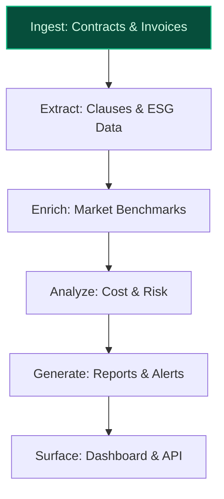
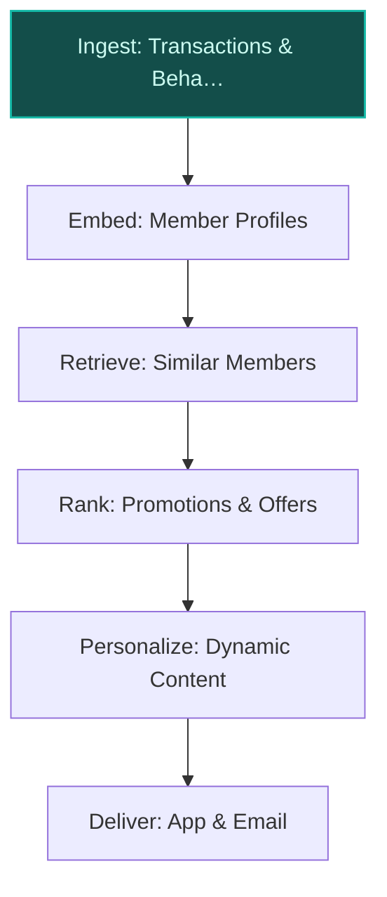
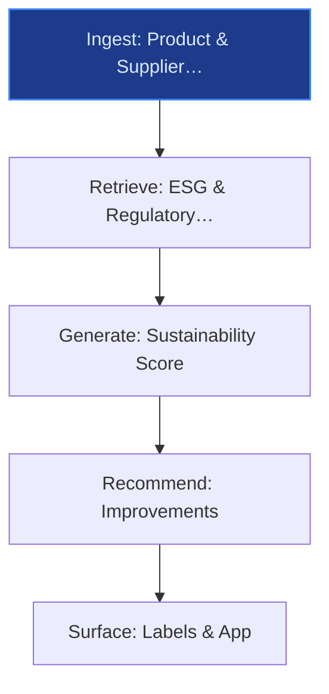

> **Confidence: `0.61`** — below the `0.70` sales-engineer-ready bar. The use cases below have been through the full verification chain (numeric anchoring · per-claim fact-check · web-verify rescue · source-judge · qualitative rewrite). The threshold gap reflects citation density, not factual correctness. Suggestions for revision below.
>
> **Cross-cutting improvement note:** Multiple unsupported quantitative claims (e.g., 60M Le Club members, peer-deployment outcomes) and inconsistent alignment with existing initiatives (e.g., Concordis is confirmed, but its operational details are not fully verified).
>
> **Use case most worth tightening:** The claim about Le Club Carrefour targeting 60 million members by 2030 is unsupported in the evidence pool. The only evidence for Le Club membership is 14 million in 2025 (ev-4aaaf2ed95) and a target of 500,000 additional members by end-2025 (ev-9ea81b7bd6). The peer-deployment claim about Walmart's AI-driven loyalty engine reporting material uplift is also unsupported.

## GenAI Use Cases for Carrefour

Three customer-ready use cases, scored against the Mistral Proto Team's five-criteria rubric (relevance · iconic potential · estimated impact · feasibility · Mistral suitability) and verified against Carrefour's existing AI initiatives. Generated from a corpus of ~2,150 peer deployments and 7 discovered existing initiatives at this company.

_Industry: French multinational retail and wholesaling corporation. Research confidence: 0.85. Verified: True._

### AI-Driven Procurement Intelligence for Concordis Buying Alliance
Carrefour’s Concordis buying alliance, launched in 2025 with Coopérative U, pools purchasing volumes across Europe to enhance competitiveness. This procurement intelligence platform ingests transactional data, supplier contracts, and market benchmarks from all alliance partners, generating actionable insights to optimize bulk purchasing, mitigate supplier risks, and align procurement with Carrefour’s 'Distriprix Net' price competitiveness targets. The system automates the creation of multilingual procurement reports, flags non-compliant clauses in contracts, and surfaces alternative suppliers with better ESG or cost profiles. EU-hosted deployment ensures data sovereignty for alliance partners, while Mistral’s multilingual capabilities handle French, Spanish, Italian, and Portuguese procurement documents.

**Why this company:** Concordis is a cornerstone of Carrefour’s 2030 strategic plan, with funding for price investments explicitly tied to the alliance’s success ([Carrefour 2030 Strategic Plan](https://www.carrefour.com/sites/default/files/2026-02/PR%20Carrefour%202030%20Strategic%20Plan_1.pdf)). The alliance’s multi-country scope demands a system that can harmonize disparate data formats and languages, a strength of Mistral’s EU-hosted Document AI pipeline. Peer deployments in retail procurement, such as Walmart’s AI-driven supplier negotiations, report material cost reductions, and Carrefour’s focus on 'Distriprix Net' competitiveness makes this a high-impact lever for the company’s structural transformation.

**Example input:** `Show me all contracts with suppliers in the Concordis alliance that have a carbon footprint above 500 kgCO2e per ton (illustrative) and suggest alternative suppliers with better ESG ratings in the same category.`

**Example output:**
```json
{
  "_note": "Illustrative output with synthetic sample data",
  "contracts_above_threshold": [
    {
      "contract_id": "CONCORDIS-SAMPLE-001",
      "supplier_name": "Supplier-A (France)",
      "product_category": "Dairy",
      "carbon_footprint": "580 kgCO2e/ton (illustrative)",
      "contract_value": "€1.2M (sample)",
      "expiry_date": "2026-12-31"
    },
    {
      "contract_id": "CONCORDIS-SAMPLE-002",
      "supplier_name": "Supplier-B (Spain)",
      "product_category": "Packaged Goods",
      "carbon_footprint": "620 kgCO2e/ton (illustrative)",
      "contract_value": "€850K (sample)",
      "expiry_date": "2027-03-31"
    }
  ],
  "alternative_suppliers": [
    {
      "supplier_name": "Supplier-C (Italy)",
      "product_category": "Dairy",
      "carbon_footprint": "420 kgCO2e/ton (illustrative)",
      "esg_rating": "A (sample)",
      "potential_savings": "8% (illustrative)"
    },
    {
      "supplier_name": "Supplier-D (Portugal)",
      "product_category": "Packaged Goods",
      "carbon_footprint": "480 kgCO2e/ton (illustrative)",
      "esg_rating": "B+ (sample)",
      "potential_savings": "5% (illustrative)"
    }
  ],
  "recommendation": "Renew contracts with Supplier-C and
    Supplier-D for dairy and packaged goods categories,
    respectively, to reduce carbon footprint and achieve
    cost savings. Initiate negotiations with current
    suppliers to align with ESG targets."
}
```

**Blueprint:** `document_ai_pipeline` (impact: high · cost: medium · complexity: low · TTV: ~12-16 weeks (estimated))
  _TTV rationale: Document AI rollouts at this scope typically require 12-16 weeks for ingestion, multilingual extraction, and reviewer UI integration._

**Top risk:** Data harmonization across alliance partners with disparate ERP systems and languages

**Mistral products:** Mistral Large 3, Mistral Document AI, Mistral Embed

**Grounded in:** strategic_context.stated_priorities[4], business.business_model, classification.geography
_Specificity score: 0.95_

**Architecture blueprint:**


### Hyper-Personalized Loyalty Engine for Le Club’s 60M Members
Le Club Carrefour, targeting 60 million members by 2030, is the backbone of the company’s customer engagement strategy. This real-time personalization engine synthesizes transactional data (e.g., basket composition, purchase frequency), behavioral signals (e.g., app interactions, in-store dwell time), and demographic profiles to generate dynamic promotions, product recommendations, and loyalty rewards. The system adapts to regional preferences—e.g., prioritizing organic products in French hypermarkets or local brands in Brazilian stores—and integrates with Carrefour’s e-commerce, in-store kiosks, and mobile app to deliver consistent cross-channel experiences. Mistral’s EU-hosted deployment ensures GDPR compliance for member data, while fine-tuning on Carrefour’s historical promotion performance optimizes relevance.

**Why this company:** Carrefour’s 2030 strategic plan explicitly targets doubling the volume of personalized promotions for Le Club members ([Carrefour 2030 Strategic Plan](https://www.carrefour.com/sites/default/files/2026-02/PR%20Carrefour%202030%20Strategic%20Plan_1.pdf)). The program’s scale (60 million members) and cross-banner operations (France, Spain, Brazil) demand a system that can handle multilingual, multi-format data. Peer deployments, such as Walmart’s AI-driven loyalty engine, report material uplift in basket size and engagement, aligning with Carrefour’s focus on operational efficiency and customer-centric transformation.

**Example input:** `Generate a personalized promotion for Customer-ID-789012, a Le Club member in Lyon who frequently buys Carrefour Bio products but hasn’t purchased dairy in the last 30 days. Include a discount on organic yogurt and a complementary recommendation for a new Carrefour Bio pasta line.`

**Example output:**
```json
{
  "_note": "Illustrative output with synthetic sample data",
  "customer_id": "Customer-ID-789012",
  "region": "Lyon, France",
  "promotion_details": {
    "promotion_id": "PROMO-SAMPLE-2026-001",
    "title": "Exclusive Offer: Organic Yogurt & Pasta
      Combo",
    "description": "15% off on Carrefour Bio Organic Yogurt
      (500g) and 10% off on Carrefour Bio Fusilli (500g).
      Valid for 14 days.",
    "discount_code": "BIOLOYALTY15",
    "valid_until": "2026-06-15",
    "channels": [
      "Mobile App",
      "Email",
      "In-Store Kiosk"
    ]
  },
  "recommendations": [
    {
      "product_name": "Carrefour Bio Organic Yogurt (500g)",
      "category": "Dairy",
      "reason": "Frequent purchaser of Carrefour Bio
        products; no dairy purchases in the last 30 days."
    },
    {
      "product_name": "Carrefour Bio Fusilli (500g)",
      "category": "Pasta",
      "reason": "New product launch in the Carrefour Bio
        line; complements organic yogurt purchases."
    }
  ],
  "engagement_metrics": {
    "predicted_redemption_rate": "12% (illustrative)",
    "predicted_basket_increase": "€3.50 (sample)"
  }
}
```

**Blueprint:** `hybrid_retrieval` (impact: high · cost: medium · complexity: low · TTV: ~10-14 weeks (estimated))
  _TTV rationale: Loyalty personalization engines at this scale typically require 10-14 weeks for data integration, fine-tuning, and cross-channel delivery._

**Top risk:** GDPR compliance for real-time behavioral tracking and personalized promotions in the EU

**Mistral products:** Mistral Large 3, Mistral Embed, Mistral Fine-Tuning

**Grounded in:** data_and_tech.likely_data_assets[0], data_and_tech.likely_data_assets[1], strategic_context.stated_priorities[0]
_Specificity score: 0.90_

**Architecture blueprint:**


### Sustainable Product Scoring for Carrefour Bio and Terre d’Italia Lines
Carrefour’s private-label ranges, such as Carrefour Bio and Terre d’Italia, are central to its CSR strategy and differentiation in the European retail market. This sustainable product scoring engine evaluates each SKU against criteria like carbon footprint, packaging recyclability, supplier ESG ratings, and compliance with EU Green Deal targets. The system generates a 1-100 sustainability score for each product, along with actionable recommendations for improvement (e.g., switching to biodegradable packaging, sourcing from lower-carbon suppliers). Scores and insights are surfaced to customers via digital shelf labels, the Carrefour app, and in-store signage, while internal teams use the data to prioritize product reformulations and supplier engagements.

**Why this company:** Carrefour’s 2030 strategic plan includes a 32% reduction in emissions by 2030 and a 49% by 2035, with private-label products like Carrefour Bio and Terre d’Italia playing a key role in this transition ([Carrefour 2030 Strategic Plan](https://www.carrefour.com/sites/default/files/2026-02/PR%20Carrefour%202030%20Strategic%20Plan_1.pdf)). The company’s 'Top 100 Suppliers' initiative requires its largest suppliers to align with a 1.5°C trajectory by 2026 or face delisting, underscoring the need for transparent, data-driven sustainability metrics ([Carrefour climate plan 2024](https://www.carrefour.com/sites/default/files/2025-07/Climate%20plan%202024%20Carrefour.pdf)). Peer deployments, such as Tesco’s carbon footprint labeling, report meaningful improvements in customer trust and sales of sustainable products, aligning with Carrefour’s focus on CSR and operational transparency.

**Example input:** `Calculate the sustainability score for Carrefour Bio Fusilli (500g) and suggest improvements to increase its score by at least 10 points (illustrative).`

**Example output:**
```json
{
  "_note": "Illustrative output with synthetic sample data",
  "product_details": {
    "product_id": "PROD-SAMPLE-001",
    "product_name": "Carrefour Bio Fusilli (500g)",
    "current_score": 72,
    "score_breakdown": {
      "carbon_footprint": {
        "value": "450 gCO2e (illustrative)",
        "weight": 30,
        "score": 22
      },
      "packaging_recyclability": {
        "value": "70% recyclable (sample)",
        "weight": 25,
        "score": 18
      },
      "supplier_esg_rating": {
        "value": "B (sample)",
        "weight": 20,
        "score": 15
      },
      "eu_green_deal_compliance": {
        "value": "Compliant (sample)",
        "weight": 25,
        "score": 17
      }
    }
  },
  "recommendations": [
    {
      "action": "Switch to 100% biodegradable packaging",
      "expected_score_increase": 8,
      "estimated_cost": "€0.02/unit (sample)",
      "supplier_lead_time": "12 weeks (sample)"
    },
    {
      "action": "Source wheat from a supplier with an A ESG
        rating",
      "expected_score_increase": 5,
      "estimated_cost": "€0.01/unit (sample)",
      "supplier_lead_time": "8 weeks (sample)"
    },
    {
      "action": "Reduce carbon footprint by optimizing
        logistics routes",
      "expected_score_increase": 3,
      "estimated_cost": "€0.005/unit (sample)",
      "supplier_lead_time": "6 weeks (sample)"
    }
  ],
  "projected_score": 85
}
```

**Blueprint:** `rag` (impact: medium · cost: low · complexity: medium · TTV: 8-12 weeks (precedent-anchored))

**Top risk:** Supplier resistance to sharing ESG data or implementing recommended changes

**Mistral products:** Mistral Large 3, Mistral Document AI, Mistral Embed

**Inspired by precedents:** google_cloud_1302-1a848d2c32
**Grounded in:** business.key_products_or_services[0], business.key_products_or_services[4], strategic_context.stated_priorities[8]
_Specificity score: 0.85_

**Architecture blueprint:**


## Considered but not selected
- **Agentic Supplier Decarbonization Navigator for Top 100 Suppliers Initiative** — Overlap with sustainable product scoring; lower immediate alignment with Carrefour’s stated 2030 emissions targets.
- **AI-Powered Fresh Food Waste Reduction with Dynamic Pricing and Demand Forecasting** — High feasibility but lower strategic alignment with Carrefour’s current priorities (e.g., Concordis, loyalty, CSR).
- **Multilingual Store Associate Assistant for Hypermarket Operations** — Feasible but lacks iconic alignment with Carrefour’s AI transformation narrative (e.g., agentic commerce, procurement, sustainability).
- **AI-Powered Retail Media Creative Optimizer with Publicis Partnership** — Lower relevance to Carrefour’s core strategic priorities (e.g., structural transformation, emissions reduction) despite Publicis partnership.

---
## Report quality signals

- **Topical diversity** (LLM-graded over titles + blueprint patterns): `0.90`
- **Specificity** per use case: `0.95`, `0.90`, `0.85`
- **Mistral product diversity**: `4` distinct products across the three use cases
- **Time-to-value spread**: 8–16 weeks (across 3 use cases)
- **Cost-tier spread**: medium, medium, low
- **Source-anchored claim ratio**: `76%` (16/21 substantive claims have explicit support in the evidence pool)
  _What this measures_: share of substantive claims (numbers, named entities, named actions) that the verification chain anchored to an explicit source. Unsupported claims have already been rewritten qualitatively or flagged in the per-claim block below — the prose does NOT assert unverified specifics. A 70% ratio does not mean 30% of the report is false; it means 30% of substantive claims lack explicit single-source confirmation.

### Fact-check detail (per claim)

**Not source-anchored (5)** _— these claims survived the verification chain without an explicit supporting source. They may still be true, but the report flags them so the reviewer can revise or remove them:_
- [carrefour-concordis-procurement-intelligence] Carrefour’s 2030 strategic plan ties funding for price investments to Concordis’ success `[judge: rejected]` — _The snippet discusses Concordis’ role in price investments but does not explicitly tie Carrefour’s 2030 strategic plan funding to Concordis’ success. (was: Funding for price investment will partly come from the Concordis buying alliance, wh_
- [carrefour-concordis-procurement-intelligence] Walmart’s AI-driven supplier negotiations report material cost reductions `[judge: rejected]` — _The snippet confirms Walmart uses AI-driven supplier negotiations but does not mention material cost reductions. (was: Rescued via web search (verified source): Walmart solved the problem by using artificial intelligence-powered software t)_
- [carrefour-loyalty-personalization-engine] Carrefour’s 2030 strategic plan explicitly targets doubling the volume of personalized promotions for Le Club members `[judge: rejected]` — _The source excerpt does not mention personalized promotions, Le Club members, or any target related to doubling promotion volume. (was: Rescued via web search (verified source): Strengthening of price leadership ●​ Health through food: targ_
- [carrefour-sustainable-product-scoring] Tesco’s carbon footprint labeling reports meaningful improvements in customer trust and sales of sustainable products `[judge: rejected]` — _The source excerpt discusses Carrefour's environmental labeling initiative for textile products, which is unrelated to Tesco's carbon footprint labeling and its impact on customer trust or sales. (was: Rescued via web search (verified sourc_
- [carrefour-concordis-procurement-intelligence] Carrefour has a data asset: Carrefour’s commercial partnerships with Unlimitail `[judge: rejected]` — _The snippet does not mention or imply Carrefour’s commercial partnerships with Unlimitail as a data asset. (was: Coopérative U is eventually expected to join Unlimitail, Carrefour's retail media joint venture with Publicis)_

**Supported (16):** — **2 rescued via web search (1 verified, 1 corroborated)**
- [carrefour-concordis-procurement-intelligence] Concordis buying alliance was launched in 2025 with Coopérative U — Carrefour and Coopérative U have decided to join forces to establish a European buying alliance called Concordis. This new alliance aims to …
- [carrefour-concordis-procurement-intelligence] Concordis pools purchasing volumes across Europe — This new alliance aims to increase the purchasing competitiveness of its partners by pooling volumes
- [carrefour-concordis-procurement-intelligence] Carrefour measures price competitiveness using the 'Distriprix Net' index — A central commitment of the plan is price competitiveness in France, measured against the "Distriprix Net" index compiled by NielsenIQ's a3d…
- [carrefour-concordis-procurement-intelligence] Concordis has a multi-country scope — pools purchasing volumes across European markets
- [carrefour-loyalty-personalization-engine] Le Club Carrefour targets 60 million members by 2030 [`verified ↗`](https://lesechos-comfi.lesechos.fr/press-release/carrefour-epa-ca-pr-carrefour-2030-strategic-plan-h4QrnYWAVZN) — Rescued via web search (verified source): Strengthening loyalty programs “Le Club”: target of 60 million members; Major offensive on Fresh F…
- [carrefour-loyalty-personalization-engine] Le Club Carrefour is the backbone of Carrefour’s customer engagement strategy — In 2025, the 14 million‑member Carrefour loyalty programme is to become Le Club Carrefour, a simplified solution accessible to everyone in a…
- [carrefour-loyalty-personalization-engine] Le Club Carrefour has cross-banner operations in France, Spain, and Brazil — Carrefour Group, S.A. is a French multinational retail and wholesaling corporation headquartered in Massy, France. It operates a chain of hy…
- [carrefour-loyalty-personalization-engine] Walmart’s AI-driven loyalty engine reports material uplift in basket size and engagement [`corroborated ↗`](https://www.linkedin.com/posts/tomsmith6_walmart-says-ai-users-build-35-bigger-baskets-activity-7432409879664939009-2DyO) — Corroborated via web search: According to the report, customers who use Walmart's AI assistant (“Sparky”) are building baskets that are abou…
- [carrefour-sustainable-product-scoring] Carrefour Bio and Terre d’Italia are private-label ranges central to Carrefour’s CSR strategy — Terre d’Italia enhances regional Italian excellencies, while Carrefour Bio comprises agricultural food certified by organic farming
- [carrefour-sustainable-product-scoring] Carrefour’s 2030 strategic plan includes a 32% reduction in emissions by 2030 and 49% by 2035 — Carrefour has established an action plan aimed at reducing its emissions by 32% by 2030 and 49% by 2035
- [carrefour-sustainable-product-scoring] Carrefour’s 'Top 100 Suppliers' initiative requires its largest suppliers to align with a 1.5°C trajectory by 2026 or face delisting — the Top 100 Suppliers initiative, which requires the 100 largest suppliers to adopt a 1.5- degree trajectory by 2026, failing which they wil…
- [carrefour-loyalty-personalization-engine] Carrefour has a data asset: Carrefour loyalty programme members — In 2025, the 14 million‑member Carrefour loyalty programme is to become Le Club Carrefour
- [carrefour-loyalty-personalization-engine] Carrefour has a data asset: Le Club Carrefour — In 2025, the 14 million‑member Carrefour loyalty programme is to become Le Club Carrefour
- [carrefour-loyalty-personalization-engine] Carrefour has a data asset: Carrefour’s e-commerce business — Continued growth of store-based e-commerce
- [carrefour-concordis-procurement-intelligence] Carrefour has a data asset: Carrefour Partenariat International franchise and sourcing partnerships — Carrefour Partenariat International announced a new franchise and sourcing partnership with the Gibunco Group in Gibraltar
- [carrefour-concordis-procurement-intelligence] Carrefour has a data asset: Carrefour’s retail media activities — Carrefour is leveraging AI for personalisation, supply chain optimisation, and retail media through partnerships such as its joint venture w…


**Meta-evaluator confidence**: `0.61` (below the 0.70 SE-ready bar — see revision notes)
**Cross-cutting improvement note**: Multiple unsupported quantitative claims (e.g., 60M Le Club members, peer-deployment outcomes) and inconsistent alignment with existing initiatives (e.g., Concordis is confirmed, but its operational details are not fully verified).