# Trace

## Execution trace — Carrefour

Started: `2026-05-11T01:59:10.286273+00:00`. Total wall time: `166.4s` across `49` recorded actions.

### Per-step time totals

| Step | Calls | Total time | Avg time |
|---|---:|---:|---:|
| `research` | 1 | 7.29s | 7287ms |
| `gap_fill` | 4 | 8.48s | 2119ms |
| `retrieve` | 2 | 0.19s | 95ms |
| `generate` | 2 | 22.02s | 11011ms |
| `generate.web_search` | 2 | 6.02s | 3012ms |
| `score` | 2 | 25.55s | 12774ms |
| `verify` | 6 | 20.14s | 3357ms |
| `enrich` | 1 | 56.99s | 56991ms |
| `polish` | 3 | 7.62s | 2541ms |
| `meta_eval` | 1 | 12.33s | 12332ms |
| `web_verify` | 1 | 3.40s | 3400ms |
| `source_judge` | 22 | 15.85s | 720ms |
| `quality_signals` | 2 | 3.86s | 1932ms |

### Chronological event log

- `01:59:10.606` **[research]** `mistral-medium-2604.chat.complete` — 7287ms
   - inputs: synthesize CompanyContext for Carrefour | depth=medium
   - outputs: industry='French multinational retail and wholesaling corporation' verified=True conf=0.75
- `01:59:17.894` **[gap_fill]** `mistral-small-2603.chat.complete` — 866ms
   - inputs: generate gap queries | fields=['business_model', 'products', 'data_assets', 'priorities']
   - outputs: queries=4
- `01:59:33.245` **[gap_fill]** `mistral-small-2603.chat.complete` — 1146ms
   - inputs: layer-2 extract field=priorities
   - outputs: items=11
- `01:59:33.253` **[gap_fill]** `mistral-small-2603.chat.complete` — 753ms
   - inputs: layer-2 extract field=data_assets
   - outputs: items=6
- `01:59:33.257` **[gap_fill]** `mistral-small-2603.chat.complete` — 5711ms
   - inputs: layer-2 extract field=products
   - outputs: items=6
- `01:59:38.969` **[retrieve]** `mistral-embed.embeddings.create` — 185ms
   - inputs: company_query | industries='French multinational retail and wholesaling corporation'
   - outputs: embedded 1024-dim query vector
- `01:59:39.154` **[retrieve]** `precedent_corpus.cosine_topk` — 5ms
   - inputs: k=8 min_depth=0.4 target='Carrefour'
   - outputs: retrieved 8 | mmr=True | top_sim=0.783
- `01:59:40.971` **[generate]** `mistral-medium-2604.chat.complete` — 1877ms
   - inputs: iteration=0 tool_calls_used=0/2 tools=on
   - outputs: tool_calls=4 | content_chars=0
- `01:59:42.867` **[generate.web_search]** `tavily.search` — 2765ms
   - inputs: query='Carrefour 2024 sustainability emissions reduction 32% 2030 49% 2035'
   - outputs: 2 raw results
- `01:59:46.025` **[generate.web_search]** `tavily.search` — 3258ms
   - inputs: query='Carrefour Le Club loyalty program data scale members'
   - outputs: 2 raw results
- `01:59:50.947` **[generate]** `mistral-medium-2604.chat.complete` — 20146ms
   - inputs: iteration=1 tool_calls_used=2/2 tools=off
   - outputs: tool_calls=0 | content_chars=14144
- `02:00:11.397` **[score]** `mistral-small-2603.chat.complete` — 13137ms
   - inputs: self-consistency pass T=0.2
   - outputs: scored 8 candidates
- `02:00:11.402` **[score]** `mistral-small-2603.chat.complete` — 12410ms
   - inputs: self-consistency pass T=0.4
   - outputs: scored 8 candidates
- `02:00:24.569` **[verify]** `tavily.search` — 2426ms
   - inputs: candidate=carrefour-supplier-decarbonization-agent | query='Carrefour Agentic Supplier Decarbonization Navigator for Top'
   - outputs: 4 results
- `02:00:24.569` **[verify]** `tavily.search` — 2382ms
   - inputs: candidate=carrefour-concordis-procurement-intelligence | query='Carrefour AI-Driven Procurement Intelligence for Concordis B'
   - outputs: 4 results
- `02:00:24.569` **[verify]** `tavily.search` — 2083ms
   - inputs: candidate=carrefour-fresh-food-waste-reduction | query='Carrefour AI-Powered Fresh Food Waste Reduction with Dynamic'
   - outputs: 4 results
- `02:00:27.627` **[verify]** `mistral-small-2603.chat.complete` — 4115ms
   - inputs: verdict for carrefour-concordis-procurement-intelligence
   - outputs: verdict='pass'
- `02:00:27.640` **[verify]** `mistral-small-2603.chat.complete` — 5215ms
   - inputs: verdict for carrefour-supplier-decarbonization-agent
   - outputs: verdict='confirmed_existing'
- `02:00:27.702` **[verify]** `mistral-small-2603.chat.complete` — 3920ms
   - inputs: verdict for carrefour-fresh-food-waste-reduction
   - outputs: verdict='confirmed_existing'
- `02:00:32.861` **[enrich]** `mistral-large-2512.chat.complete` — 56991ms
   - inputs: tier=standard parallel=False ids=['carrefour-concordis-procurement-intelligence', 'carrefour-loyalty-personalization-engine', 'carrefour-sustainable-product-scoring']
   - outputs: enriched 3 use cases
- `02:01:29.881` **[polish]** `mistral-small-2603.chat.complete` — 2559ms
   - inputs: use_case=carrefour-concordis-procurement-intelligence unanchored=True opaque_ev=False
   - outputs: polished 5 fields
- `02:01:29.886` **[polish]** `mistral-small-2603.chat.complete` — 2242ms
   - inputs: use_case=carrefour-loyalty-personalization-engine unanchored=True opaque_ev=False
   - outputs: polished 5 fields
- `02:01:29.891` **[polish]** `mistral-small-2603.chat.complete` — 2822ms
   - inputs: use_case=carrefour-sustainable-product-scoring unanchored=True opaque_ev=False
   - outputs: polished 5 fields
- `02:01:32.716` **[meta_eval]** `mistral-medium-2604.chat.complete` — 12332ms
   - inputs: reviewing 3 use cases
   - outputs: review + claims
- `02:01:45.063` **[web_verify]** `tavily.search.rescue_unsupported_claims` — 3400ms
   - inputs: company='Carrefour' unsupported=5 budget=12
   - outputs: rescued: verified=4 corroborated=1 of 5 attempted
- `02:01:48.465` **[source_judge]** `mistral-small-2603.judge_claim_sources` — 2020ms
   - inputs: pairs=21
   - outputs: judged 21 pairs
- `02:01:48.465` **[source_judge]** `mistral-small-2603.chat.complete` — 485ms
   - inputs: claim='Concordis buying alliance was launched in 2025 with Coopérat'
   - outputs: verdict=supported
- `02:01:48.469` **[source_judge]** `mistral-small-2603.chat.complete` — 729ms
   - inputs: claim='Concordis pools purchasing volumes across Europe'
   - outputs: verdict=supported
- `02:01:48.473` **[source_judge]** `mistral-small-2603.chat.complete` — 904ms
   - inputs: claim='Carrefour’s 2030 strategic plan ties funding for price inves'
   - outputs: verdict=unsupported
- `02:01:48.476` **[source_judge]** `mistral-small-2603.chat.complete` — 731ms
   - inputs: claim="Carrefour measures price competitiveness using the 'Distripr"
   - outputs: verdict=supported
- `02:01:48.482` **[source_judge]** `mistral-small-2603.chat.complete` — 834ms
   - inputs: claim='Concordis has a multi-country scope'
   - outputs: verdict=supported
- `02:01:48.485` **[source_judge]** `mistral-small-2603.chat.complete` — 702ms
   - inputs: claim='Walmart’s AI-driven supplier negotiations report material co'
   - outputs: verdict=unsupported
- `02:01:48.488` **[source_judge]** `mistral-small-2603.chat.complete` — 652ms
   - inputs: claim='Le Club Carrefour targets 60 million members by 2030'
   - outputs: verdict=supported
- `02:01:48.491` **[source_judge]** `mistral-small-2603.chat.complete` — 915ms
   - inputs: claim='Le Club Carrefour is the backbone of Carrefour’s customer en'
   - outputs: verdict=supported
- `02:01:48.950` **[source_judge]** `mistral-small-2603.chat.complete` — 510ms
   - inputs: claim='Carrefour’s 2030 strategic plan explicitly targets doubling '
   - outputs: verdict=unsupported
- `02:01:49.140` **[source_judge]** `mistral-small-2603.chat.complete` — 590ms
   - inputs: claim='Le Club Carrefour has cross-banner operations in France, Spa'
   - outputs: verdict=supported
- `02:01:49.187` **[source_judge]** `mistral-small-2603.chat.complete` — 535ms
   - inputs: claim='Walmart’s AI-driven loyalty engine reports material uplift i'
   - outputs: verdict=supported
- `02:01:49.198` **[source_judge]** `mistral-small-2603.chat.complete` — 848ms
   - inputs: claim='Carrefour Bio and Terre d’Italia are private-label ranges ce'
   - outputs: verdict=supported
- `02:01:49.207` **[source_judge]** `mistral-small-2603.chat.complete` — 529ms
   - inputs: claim='Carrefour’s 2030 strategic plan includes a 32% reduction in '
   - outputs: verdict=supported
- `02:01:49.316` **[source_judge]** `mistral-small-2603.chat.complete` — 536ms
   - inputs: claim="Carrefour’s 'Top 100 Suppliers' initiative requires its larg"
   - outputs: verdict=supported
- `02:01:49.377` **[source_judge]** `mistral-small-2603.chat.complete` — 701ms
   - inputs: claim='Tesco’s carbon footprint labeling reports meaningful improve'
   - outputs: verdict=unsupported
- `02:01:49.406` **[source_judge]** `mistral-small-2603.chat.complete` — 673ms
   - inputs: claim='Carrefour has a data asset: Carrefour loyalty programme memb'
   - outputs: verdict=supported
- `02:01:49.460` **[source_judge]** `mistral-small-2603.chat.complete` — 618ms
   - inputs: claim='Carrefour has a data asset: Le Club Carrefour'
   - outputs: verdict=supported
- `02:01:49.721` **[source_judge]** `mistral-small-2603.chat.complete` — 764ms
   - inputs: claim='Carrefour has a data asset: Carrefour’s e-commerce business'
   - outputs: verdict=supported
- `02:01:49.730` **[source_judge]** `mistral-small-2603.chat.complete` — 533ms
   - inputs: claim='Carrefour has a data asset: Carrefour Partenariat Internatio'
   - outputs: verdict=supported
- `02:01:49.736` **[source_judge]** `mistral-small-2603.chat.complete` — 524ms
   - inputs: claim='Carrefour has a data asset: Carrefour’s commercial partnersh'
   - outputs: verdict=unsupported
- `02:01:49.852` **[source_judge]** `mistral-small-2603.chat.complete` — 519ms
   - inputs: claim='Carrefour has a data asset: Carrefour’s retail media activit'
   - outputs: verdict=supported
- `02:01:52.799` **[quality_signals]** `mistral-small-2603.chat.complete` — 2372ms
   - inputs: specificity grade (3 use cases)
   - outputs: scored 3 use cases
- `02:01:55.170` **[quality_signals]** `mistral-small-2603.chat.complete` — 1493ms
   - inputs: diversity grade
   - outputs: diversity=0.9

## Mermaid sequence

```mermaid
sequenceDiagram
    autonumber
    participant pipeline as pipeline
    participant mistral_medium_2604 as mistral-medium-2604
    participant mistral_small_2603 as mistral-small-2603
    participant mistral_embed as mistral-embed
    participant precedent_corpus as precedent_corpus
    participant tavily as tavily
    participant mistral_large_2512 as mistral-large-2512
    participant tavily_search as tavily.search
    pipeline->>mistral_medium_2604: research: chat.complete (7287ms)
    mistral_medium_2604-->>pipeline: industry='French multinational retail and wholesaling corpor
    pipeline->>mistral_small_2603: gap_fill: chat.complete (866ms)
    mistral_small_2603-->>pipeline: queries=4
    pipeline->>mistral_small_2603: gap_fill: chat.complete (1146ms)
    mistral_small_2603-->>pipeline: items=11
    pipeline->>mistral_small_2603: gap_fill: chat.complete (753ms)
    mistral_small_2603-->>pipeline: items=6
    pipeline->>mistral_small_2603: gap_fill: chat.complete (5711ms)
    mistral_small_2603-->>pipeline: items=6
    pipeline->>mistral_embed: retrieve: embeddings.create (185ms)
    mistral_embed-->>pipeline: embedded 1024-dim query vector
    pipeline->>precedent_corpus: retrieve: cosine_topk (5ms)
    precedent_corpus-->>pipeline: retrieved 8 | mmr=True | top_sim=0.783
    pipeline->>mistral_medium_2604: generate: chat.complete (1877ms)
    mistral_medium_2604-->>pipeline: tool_calls=4 | content_chars=0
    pipeline->>tavily: generate.web_search: search (2765ms)
    tavily-->>pipeline: 2 raw results
    pipeline->>tavily: generate.web_search: search (3258ms)
    tavily-->>pipeline: 2 raw results
    pipeline->>mistral_medium_2604: generate: chat.complete (20146ms)
    mistral_medium_2604-->>pipeline: tool_calls=0 | content_chars=14144
    pipeline->>mistral_small_2603: score: chat.complete (13137ms)
    mistral_small_2603-->>pipeline: scored 8 candidates
    pipeline->>mistral_small_2603: score: chat.complete (12410ms)
    mistral_small_2603-->>pipeline: scored 8 candidates
    pipeline->>tavily: verify: search (2426ms)
    tavily-->>pipeline: 4 results
    pipeline->>tavily: verify: search (2382ms)
    tavily-->>pipeline: 4 results
    pipeline->>tavily: verify: search (2083ms)
    tavily-->>pipeline: 4 results
    pipeline->>mistral_small_2603: verify: chat.complete (4115ms)
    mistral_small_2603-->>pipeline: verdict='pass'
    pipeline->>mistral_small_2603: verify: chat.complete (5215ms)
    mistral_small_2603-->>pipeline: verdict='confirmed_existing'
    pipeline->>mistral_small_2603: verify: chat.complete (3920ms)
    mistral_small_2603-->>pipeline: verdict='confirmed_existing'
    pipeline->>mistral_large_2512: enrich: chat.complete (56991ms)
    mistral_large_2512-->>pipeline: enriched 3 use cases
    pipeline->>mistral_small_2603: polish: chat.complete (2559ms)
    mistral_small_2603-->>pipeline: polished 5 fields
    pipeline->>mistral_small_2603: polish: chat.complete (2242ms)
    mistral_small_2603-->>pipeline: polished 5 fields
    pipeline->>mistral_small_2603: polish: chat.complete (2822ms)
    mistral_small_2603-->>pipeline: polished 5 fields
    pipeline->>mistral_medium_2604: meta_eval: chat.complete (12332ms)
    mistral_medium_2604-->>pipeline: review + claims
    pipeline->>tavily_search: web_verify: rescue_unsupported_claims (3400ms)
    tavily_search-->>pipeline: rescued: verified=4 corroborated=1 of 5 attempted
    pipeline->>mistral_small_2603: source_judge: judge_claim_sources (2020ms)
    mistral_small_2603-->>pipeline: judged 21 pairs
    pipeline->>mistral_small_2603: source_judge: chat.complete (485ms)
    mistral_small_2603-->>pipeline: verdict=supported
    pipeline->>mistral_small_2603: source_judge: chat.complete (729ms)
    mistral_small_2603-->>pipeline: verdict=supported
    pipeline->>mistral_small_2603: source_judge: chat.complete (904ms)
    mistral_small_2603-->>pipeline: verdict=unsupported
    pipeline->>mistral_small_2603: source_judge: chat.complete (731ms)
    mistral_small_2603-->>pipeline: verdict=supported
    pipeline->>mistral_small_2603: source_judge: chat.complete (834ms)
    mistral_small_2603-->>pipeline: verdict=supported
    pipeline->>mistral_small_2603: source_judge: chat.complete (702ms)
    mistral_small_2603-->>pipeline: verdict=unsupported
    pipeline->>mistral_small_2603: source_judge: chat.complete (652ms)
    mistral_small_2603-->>pipeline: verdict=supported
    pipeline->>mistral_small_2603: source_judge: chat.complete (915ms)
    mistral_small_2603-->>pipeline: verdict=supported
    pipeline->>mistral_small_2603: source_judge: chat.complete (510ms)
    mistral_small_2603-->>pipeline: verdict=unsupported
    pipeline->>mistral_small_2603: source_judge: chat.complete (590ms)
    mistral_small_2603-->>pipeline: verdict=supported
    pipeline->>mistral_small_2603: source_judge: chat.complete (535ms)
    mistral_small_2603-->>pipeline: verdict=supported
    pipeline->>mistral_small_2603: source_judge: chat.complete (848ms)
    mistral_small_2603-->>pipeline: verdict=supported
    pipeline->>mistral_small_2603: source_judge: chat.complete (529ms)
    mistral_small_2603-->>pipeline: verdict=supported
    pipeline->>mistral_small_2603: source_judge: chat.complete (536ms)
    mistral_small_2603-->>pipeline: verdict=supported
    pipeline->>mistral_small_2603: source_judge: chat.complete (701ms)
    mistral_small_2603-->>pipeline: verdict=unsupported
    pipeline->>mistral_small_2603: source_judge: chat.complete (673ms)
    mistral_small_2603-->>pipeline: verdict=supported
    pipeline->>mistral_small_2603: source_judge: chat.complete (618ms)
    mistral_small_2603-->>pipeline: verdict=supported
    pipeline->>mistral_small_2603: source_judge: chat.complete (764ms)
    mistral_small_2603-->>pipeline: verdict=supported
    pipeline->>mistral_small_2603: source_judge: chat.complete (533ms)
    mistral_small_2603-->>pipeline: verdict=supported
    pipeline->>mistral_small_2603: source_judge: chat.complete (524ms)
    mistral_small_2603-->>pipeline: verdict=unsupported
    pipeline->>mistral_small_2603: source_judge: chat.complete (519ms)
    mistral_small_2603-->>pipeline: verdict=supported
    pipeline->>mistral_small_2603: quality_signals: chat.complete (2372ms)
    mistral_small_2603-->>pipeline: scored 3 use cases
    pipeline->>mistral_small_2603: quality_signals: chat.complete (1493ms)
    mistral_small_2603-->>pipeline: diversity=0.9
```

