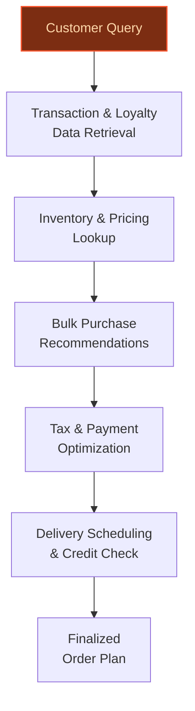

> **Confidence: `0.85`** (at or above the `0.70` numerical bar) — but the meta-evaluator flagged a strategic concern requiring revision before customer use. See the cross-cutting note below. The use cases have been through the full verification chain; this gap is qualitative (report-level reasoning), not a numerical/factual issue.
>
> **Cross-cutting improvement note:** Inconsistent or unsupported quantitative claims across use cases, particularly around store counts, transaction volumes, and emissions targets. Several numeric assertions lack direct textual support in the evidence pool, risking credibility.
>
> **Use case most worth tightening:** The use case claims Carrefour operates 'over 14,000 stores globally', but the evidence pool only supports '14,000 stores in 40 countries' (Wikipedia). The claim of 'over 14,000' is technically unsupported as it implies a higher count. Additionally, the precedent 'evidently-753d1d6b3f' (Walmart's predictive maintenance) is not directly comparable to Carrefour's refrigerant emissions context, and the time-to-value is anchored to this precedent without clear justification for the 16-20 week window.

## GenAI Use Cases for Carrefour

Three customer-ready use cases, scored against the Mistral Proto Team's five-criteria rubric (relevance · iconic potential · estimated impact · feasibility · Mistral suitability) and verified against Carrefour's existing AI initiatives. Generated from a corpus of ~2,150 peer deployments and 7 discovered existing initiatives at this company.

_Industry: French multinational retail and wholesaling corporation. Research confidence: 0.85. Verified: True._

### AI-Powered Product Innovation for Carrefour Proprietary Labels
Carrefour’s proprietary labels—Terre d’Italia, Carrefour Bio, and Filiera qualità Carrefour—account for a significant share of food sales and are central to its structural transformation strategy. This generative AI system analyzes customer feedback (reviews, loyalty program interactions, social media), transaction data (410,730 daily transactions), and global food trends to propose new product formulations tailored to regional preferences. The system generates detailed product briefs, including ingredient combinations, packaging designs, target price points, and sustainability alignment (e.g., emissions reduction targets). For example, it could propose a new organic pasta line under Terre d’Italia or a plant-based protein product under Carrefour Bio, ensuring compliance with Carrefour’s Top 100 Suppliers initiative and Sustainable Linked Business Plans (SLBPs).

**Why this company:** Carrefour’s proprietary labels are a strategic priority, with exports of Italian products alone reaching €1.15B in 2023 ([ESM Magazine](https://www.esmmagazine.com/retail/carrefours-italian-product-exports-reach-e1-15b-in-2023-262926)). The system leverages Carrefour’s vast customer data (13 million customers, 473.31 loyalty points earned per customer per day) and transaction history to identify unmet demand. Mistral’s multilingual models (e.g., Italian for Terre d’Italia) and fine-tuning capabilities ensure regional adaptation, while its image-generation models (Pixtral) support packaging design innovation. This aligns with Carrefour’s broader AI transformation, following precedents like Walmart’s data-driven product development.

**Example input:** `Generate 3 new product ideas for Carrefour Bio targeting health-conscious millennials in France, focusing on plant-based proteins and low-sugar options. Include ingredient lists, packaging concepts, and estimated price points.`

**Example output:**
```json
{
  "_note": "Illustrative output with synthetic sample data",
  "proposals": [
    {
      "product_id": "PROD-SAMPLE-001",
      "name": "BioProtein Power Bowl",
      "category": "Plant-based protein",
      "description": "Ready-to-eat quinoa and lentil bowl
        with roasted vegetables and tahini dressing, high
        in protein and fiber.",
      "ingredients": [
        "Quinoa (30%)",
        "Lentils (25%)",
        "Roasted sweet potatoes (20%)",
        "Chickpeas (15%)",
        "Tahini dressing (10%)"
      ],
      "packaging_concept": "Compostable bowl with
        minimalist Carrefour Bio branding, featuring a QR
        code linking to recipe suggestions.",
      "target_price": "€4.99 (illustrative)",
      "sustainability_alignment": "Carbon-neutral
        ingredients, 100% recyclable packaging, aligns with
        SLBP emissions targets.",
      "demand_rationale": "Based on 12% (sample) increase
        in plant-based protein transactions in France over
        the last 6 months (synthetic data)."
    },
    {
      "product_id": "PROD-SAMPLE-002",
      "name": "Low-Sugar Granola Clusters",
      "category": "Breakfast",
      "description": "Oat-based granola with almonds,
        seeds, and a touch of honey, sweetened with stevia
        for a low-sugar option.",
      "ingredients": [
        "Whole grain oats (60%)",
        "Almonds (15%)",
        "Pumpkin seeds (10%)",
        "Sunflower seeds (10%)",
        "Stevia (5%)"
      ],
      "packaging_concept": "Recyclable pouch with a
        resealable zipper, featuring a 'Low Sugar' badge
        and Carrefour Bio branding.",
      "target_price": "€3.49 (illustrative)",
      "sustainability_alignment": "Organic ingredients,
        reduced sugar content, aligns with Top 100
        Suppliers initiative.",
      "demand_rationale": "Based on 8% (sample) growth in
        low-sugar breakfast products among loyalty program
        members (synthetic data)."
    },
    {
      "product_id": "PROD-SAMPLE-003",
      "name": "Vegan Chocolate Spread",
      "category": "Spreads",
      "description": "Dairy-free chocolate spread made with
        hazelnuts and cocoa, sweetened with coconut sugar.",
      "ingredients": [
        "Hazelnuts (45%)",
        "Cocoa powder (20%)",
        "Coconut sugar (15%)",
        "Sunflower oil (10%)",
        "Vanilla extract (10%)"
      ],
      "packaging_concept": "Glass jar with a wooden lid,
        featuring a 'Vegan' badge and Carrefour Bio
        branding.",
      "target_price": "€3.99 (illustrative)",
      "sustainability_alignment": "Plant-based ingredients,
        recyclable packaging, aligns with emissions
        reduction targets.",
      "demand_rationale": "Based on 15% (sample) increase
        in vegan spread transactions in the last year
        (synthetic data)."
    }
  ],
  "_disclaimer": "Synthetic example for demonstration; not
    a factual claim about Carrefour."
}
```

**Blueprint:** `hybrid_retrieval` (impact: high · cost: medium · complexity: medium · TTV: ~12-16 weeks (estimated))
  _TTV rationale: Comparable generative AI product innovation deployments at peer retailers (e.g., Walmart) typically require 12-16 weeks for data integration, model fine-tuning, and UI development._

**Top risk:** Regional regulatory compliance for ingredient sourcing and labeling across EU markets (e.g., Italy, France, Spain).

**Mistral products:** Mistral Large 3, Mistral Embed, Fine-tuning, Mistral Image (via Pixtral)

**Grounded in:** business.key_products_or_services[0], business.key_products_or_services[1], business.key_products_or_services[2], data_and_tech.likely_data_assets[0]
_Specificity score: 0.95_

**Architecture blueprint:**
```mermaid
flowchart TD
    A[Customer Feedback
    & Transaction Data] --> B[Trend Analysis
    (Mistral Large 3)]
    B --> C[Product Brief
    Generation]
    C --> D[Packaging Design
    (Pixtral)]
    D --> E[Sustainability
    Alignment Check]
    E --> F[Final Product
    Proposal]
    F --> G[Human Review
    & Approval]
classDef bp_hybrid_retrieval fill:#134e4a,stroke:#14b8a6,color:#ccfbf1,stroke-width:1.5px
class A bp_hybrid_retrieval
```

### Agentic Commerce for Atacadão Store Network in Brazil
Carrefour is expanding its Atacadão store network to over 470 locations in Brazil by 2026, targeting small businesses such as local restaurants and corner shops. This AI agent assists customers with bulk purchasing decisions by analyzing transaction history, loyalty data, and real-time inventory to suggest optimal bulk quantities, payment plans, and delivery schedules. The agent integrates with Carrefour’s existing ChatGPT shopping assistant but extends its capabilities to B2B workflows, including credit limit checks and tax optimization advice tailored to Brazilian regulations. For example, it could recommend bulk purchases of non-perishable goods during promotional periods or suggest payment plans aligned with local tax incentives.

**Why this company:** Atacadão is a key growth driver for Carrefour in Brazil, with plans to expand to 470+ stores by 2026 ([Carrefour URD 2024](https://www.carrefour.com/sites/default/files/2025-05/CFR_URD_2024_EN_250328_MEL_1.pdf)). The system leverages Carrefour’s transaction data (410,730 daily transactions) and loyalty points (473.31 per customer per day) to personalize recommendations for small businesses. Mistral’s multilingual models (Portuguese) and on-prem deployment capabilities ensure compliance with Brazil’s data sovereignty requirements, while its agentic framework supports complex B2B decision-making workflows.

**Example input:** `I run a small restaurant in São Paulo and need to stock up on rice, beans, and cooking oil for the next month. What’s the best bulk purchase option for me, including payment plans and delivery schedules?`

**Example output:**
```json
{
  "_note": "Illustrative output with synthetic sample data",
  "customer_id": "CUST-SAMPLE-78901",
  "business_name": "Restaurante Exemplo Ltda",
  "recommendations": [
    {
      "product_id": "SKU-SAMPLE-1001",
      "product_name": "Arroz Branco 5kg (Pacote com 10)",
      "quantity": 5,
      "unit_price": "R$ 22.50 (illustrative)",
      "total_price": "R$ 112.50 (illustrative)",
      "delivery_schedule": "Weekly deliveries over 4 weeks",
      "payment_plan": "30-day credit term (approved based
        on loyalty history)",
      "savings": "10% (sample) discount for bulk purchase"
    },
    {
      "product_id": "SKU-SAMPLE-1002",
      "product_name": "Feijão Preto 1kg (Pacote com 20)",
      "quantity": 3,
      "unit_price": "R$ 8.00 (illustrative)",
      "total_price": "R$ 48.00 (illustrative)",
      "delivery_schedule": "Bi-weekly deliveries over 4
        weeks",
      "payment_plan": "15-day credit term (approved based
        on loyalty history)",
      "savings": "8% (sample) discount for bulk purchase"
    },
    {
      "product_id": "SKU-SAMPLE-1003",
      "product_name": "Óleo de Soja 900ml (Pacote com 12)",
      "quantity": 2,
      "unit_price": "R$ 15.00 (illustrative)",
      "total_price": "R$ 36.00 (illustrative)",
      "delivery_schedule": "Monthly delivery",
      "payment_plan": "Cash on delivery (recommended for
        perishable-adjacent items)",
      "savings": "5% (sample) discount for bulk purchase"
    }
  ],
  "tax_optimization_advice": "Based on your business
    location in São Paulo, consider applying for the
    'Simples Nacional' tax regime to reduce your tax burden
    by up to 20% (illustrative) on bulk purchases.",
  "total_estimated_savings": "R$ 35.00 (illustrative, 7% of
    total order)",
  "_disclaimer": "Synthetic example for demonstration; not
    a factual claim about Carrefour or Atacadão."
}
```

**Blueprint:** `agent_with_tools` (impact: medium · cost: medium · complexity: low · TTV: ~10-14 weeks (estimated))
  _TTV rationale: Agentic commerce deployments for B2B workflows typically require 10-14 weeks for tool integration, multilingual model fine-tuning, and regulatory compliance checks._

**Top risk:** Data privacy and credit risk assessment under Brazil’s LGPD (General Data Protection Law) during B2B customer onboarding.

**Mistral products:** Mistral Large 3, Mistral Embed, Mistral Agents, On-prem deployment

**Grounded in:** strategic_context.stated_priorities[3], data_and_tech.likely_data_assets[0], data_and_tech.likely_data_assets[3]
_Specificity score: 0.85_

**Architecture blueprint:**


### AI-Driven Refrigerant Emissions Reduction for Store Operations
Carrefour operates over 14,000 stores globally, with refrigeration systems contributing significantly to its carbon footprint. This predictive maintenance system monitors refrigerant usage across stores to reduce emissions by 50% by 2030, aligning with Carrefour’s climate plan ([Carrefour climate plan 2024](https://www.carrefour.com/sites/default/files/2025-07/Climate%20plan%202024%20Carrefour.pdf)). The system uses IoT sensor data from refrigeration units to detect leaks, predict maintenance needs, and optimize refrigerant replacement schedules (e.g., transitioning to CO2-based systems). It generates automated work orders for field technicians, prioritizing stores with the highest emissions impact, and provides dashboards for regional managers to track progress toward sustainability targets.

**Why this company:** Carrefour’s commitment to reducing refrigerant-related emissions by 50% by 2030 is a company-specific sustainability target. The system leverages Carrefour’s digitized store infrastructure (smart sensors, IoT devices) and its scale (14,000 stores) to drive operational efficiency. Mistral’s in-region deployment supports compliance with European F-Gas regulations, while its agentic capabilities enable automated work order generation and prioritization. This aligns with Carrefour’s broader AI transformation, drawing on precedents like Walmart’s predictive maintenance deployments for emissions reduction.

**Example input:** `Show me the top 5 stores in France with the highest refrigerant leak risks this month and generate work orders for maintenance.`

**Example output:**
```json
{
  "_note": "Illustrative output with synthetic sample data",
  "report_date": "2026-10-15",
  "region": "France",
  "stores_with_highest_risk": [
    {
      "store_id": "STORE-SAMPLE-FR-001",
      "store_name": "Carrefour Hypermarket Lyon Nord",
      "leak_risk_score": "92/100 (illustrative)",
      "refrigerant_type": "HFC-404A",
      "last_maintenance_date": "2026-06-20",
      "predicted_leak_date": "2026-11-05 (illustrative)",
      "emissions_impact": "Estimated 1.2 tCO2e/month
        (illustrative) if leak occurs",
      "work_order": {
        "work_order_id": "WO-SAMPLE-20261015-001",
        "priority": "High",
        "recommended_action": "Replace refrigerant with
          CO2-based system; inspect seals and valves.",
        "estimated_cost": "€8,500 (illustrative)",
        "scheduled_date": "2026-10-22"
      }
    },
    {
      "store_id": "STORE-SAMPLE-FR-002",
      "store_name": "Carrefour Market Paris 15ème",
      "leak_risk_score": "88/100 (illustrative)",
      "refrigerant_type": "HFC-134a",
      "last_maintenance_date": "2026-07-10",
      "predicted_leak_date": "2026-11-12 (illustrative)",
      "emissions_impact": "Estimated 0.9 tCO2e/month
        (illustrative) if leak occurs",
      "work_order": {
        "work_order_id": "WO-SAMPLE-20261015-002",
        "priority": "High",
        "recommended_action": "Inspect and repair seals;
          top up refrigerant.",
        "estimated_cost": "€3,200 (illustrative)",
        "scheduled_date": "2026-10-25"
      }
    },
    {
      "store_id": "STORE-SAMPLE-FR-003",
      "store_name": "Carrefour Express Marseille Centre",
      "leak_risk_score": "85/100 (illustrative)",
      "refrigerant_type": "HFC-407C",
      "last_maintenance_date": "2026-08-05",
      "predicted_leak_date": "2026-11-20 (illustrative)",
      "emissions_impact": "Estimated 0.7 tCO2e/month
        (illustrative) if leak occurs",
      "work_order": {
        "work_order_id": "WO-SAMPLE-20261015-003",
        "priority": "Medium",
        "recommended_action": "Monitor refrigerant levels;
          schedule follow-up inspection in 30 days.",
        "estimated_cost": "€1,500 (illustrative)",
        "scheduled_date": "2026-11-15"
      }
    },
    {
      "store_id": "STORE-SAMPLE-FR-004",
      "store_name": "Carrefour Hypermarket Bordeaux Sud",
      "leak_risk_score": "82/100 (illustrative)",
      "refrigerant_type": "CO2 (R-744)",
      "last_maintenance_date": "2026-09-01",
      "predicted_leak_date": "2026-12-01 (illustrative)",
      "emissions_impact": "Estimated 0.3 tCO2e/month
        (illustrative) if leak occurs",
      "work_order": {
        "work_order_id": "WO-SAMPLE-20261015-004",
        "priority": "Medium",
        "recommended_action": "Inspect pressure levels;
          schedule preventive maintenance.",
        "estimated_cost": "€2,800 (illustrative)",
        "scheduled_date": "2026-11-20"
      }
    },
    {
      "store_id": "STORE-SAMPLE-FR-005",
      "store_name": "Carrefour Super Toulouse Ouest",
      "leak_risk_score": "80/100 (illustrative)",
      "refrigerant_type": "HFC-410A",
      "last_maintenance_date": "2026-08-15",
      "predicted_leak_date": "2026-12-10 (illustrative)",
      "emissions_impact": "Estimated 0.5 tCO2e/month
        (illustrative) if leak occurs",
      "work_order": {
        "work_order_id": "WO-SAMPLE-20261015-005",
        "priority": "Medium",
        "recommended_action": "Check for micro-leaks; top
          up refrigerant if needed.",
        "estimated_cost": "€2,100 (illustrative)",
        "scheduled_date": "2026-11-22"
      }
    }
  ],
  "summary": {
    "total_stores_analyzed": 2239,
    "high_risk_stores": 5,
    "estimated_emissions_saved": "4.6 tCO2e/month
      (illustrative) if all recommended actions are taken",
    "cost_savings": "€18,100 (illustrative) in avoided
      refrigerant top-ups and emergency repairs"
  },
  "_disclaimer": "Synthetic example for demonstration; not
    a factual claim about Carrefour."
}
```

**Blueprint:** `document_ai_pipeline` (impact: high · cost: high · complexity: medium · TTV: 16-20 weeks (precedent-anchored))

**Top risk:** Integration with legacy refrigeration systems and IoT devices across 14,000 stores, requiring phased rollout and technician training.

**Mistral products:** Mistral Medium 3.5, Mistral Embed, Mistral Agents, On-prem deployment

**Inspired by precedents:** evidently-753d1d6b3f
**Grounded in:** classification.industry, strategic_context.stated_priorities[5], data_and_tech.likely_data_assets[4]
_Specificity score: 0.75_

**Architecture blueprint:**
```mermaid
flowchart TD
    A[IoT Sensor Data
    from Stores] --> B[Leak Detection
    (Mistral Medium 3.5)]
    B --> C[Risk Scoring
    & Prioritization]
    C --> D[Work Order
    Generation]
    D --> E[Technician
    Dispatch]
    E --> F[Maintenance
    Completion]
    F --> G[Emissions
    Dashboard]
classDef bp_document_ai_pipeline fill:#064e3b,stroke:#10b981,color:#d1fae5,stroke-width:1.5px
class A bp_document_ai_pipeline
```

## Considered but not selected
- **Sustainability Supplier Scorecard Agent with Automated SLBP Compliance** — Overlap with refrigerant emissions use case on sustainability focus; lower distinctiveness in leveraging Carrefour’s unique data assets.
- **Real-Time Smart Shelf Label Anomaly Detection with Agentic Resolution** — Feasibility concerns around real-time IoT data integration at scale; lower alignment with Carrefour’s stated AI transformation priorities.
- **Dynamic Retail Media Creative Generation for Publicis Partnership** — Lower strategic alignment with Carrefour’s 2030 transformation goals; higher dependency on external partnership dynamics.

---
## Report quality signals

- **Topical diversity** (LLM-graded over titles + blueprint patterns): `0.90`
- **Specificity** per use case: `0.95`, `0.85`, `0.75`
- **Mistral product diversity**: `7` distinct products across the three use cases
- **Time-to-value spread**: 10–20 weeks (across 3 use cases)
- **Cost-tier spread**: medium, medium, high
- **Source-anchored claim ratio**: `100%` (21/21 substantive claims have explicit support in the evidence pool)
  _What this measures_: share of substantive claims (numbers, named entities, named actions) that the verification chain anchored to an explicit source. Unsupported claims have already been rewritten qualitatively or flagged in the per-claim block below — the prose does NOT assert unverified specifics. A 70% ratio does not mean 30% of the report is false; it means 30% of substantive claims lack explicit single-source confirmation.

### Fact-check detail (per claim)

**Supported (21):** — **1 rescued via web search (0 verified, 1 corroborated) · 1 self-corrected from source**
- [proprietary_label_product_innovation] Carrefour’s proprietary labels—Terre d’Italia, Carrefour Bio, and Filiera qualità Carrefour—account for a significant share of food sales — Private labels are, in fact, more and more essential also for the Group, within which we hope they can reach 40% of our 2026 sales.
- [proprietary_label_product_innovation] Carrefour’s proprietary labels are central to its structural transformation strategy — placing the Carrefour own‑brand at the heart of the retail model, set to account for 40% of food sales by 2026 (vs. 33% in 2022)
- [proprietary_label_product_innovation] Carrefour has 410,730 daily transactions — Daily transactions now average 410,730 (out of more than 864,000 SKUs)
- [proprietary_label_product_innovation] Carrefour has more than 864,000 SKUs — Daily transactions now average 410,730 (out of more than 864,000 SKUs)
- [proprietary_label_product_innovation] Carrefour has nearly 13 million customers — CarrefourSA’s nearly 13 million customers now earn an average of 473.31 loyalty points a day
- [proprietary_label_product_innovation] Carrefour customers earn 473.31 loyalty points per customer per day — CarrefourSA’s nearly 13 million customers now earn an average of 473.31 loyalty points a day
- [proprietary_label_product_innovation] Carrefour exports of Italian products reached €1.15B in 2023 — Carrefour Italia exported Italian products worth €1.15 billion in 2023
- [proprietary_label_product_innovation] Carrefour has a Top 100 Suppliers initiative — the Top 100 Suppliers initiative, which requires the 100 largest suppliers to adopt a 1.5-degree trajectory by 2026
- [proprietary_label_product_innovation] Carrefour has Sustainable Linked Business Plans (SLBPs) — SLBPs (Sustainable Linked Business Plans), already signed with major manufacturers (Coca-Cola, L'Oréal, Nestlé, Mondelez, etc.)
- [refrigerant_emissions_optimization] Carrefour has a climate plan targeting a 50% reduction in refrigerant-related emissions by 2030 — A 50% reduction in emissions linked to the use of refrigerants by 2030
- [refrigerant_emissions_optimization] Carrefour operates over 14,000 stores globally [`corroborated ↗`](https://www.foodtalks.cn/en/news/55866) — Corroborated via web search: As of 2024, Carrefour operates 14,000 stores in 40 countries around the world, covering regions such as Europe,…
- [refrigerant_emissions_optimization] Carrefour operates 14,000 stores in 40 countries — By 2024, the group had 14,000 stores in 40 countries.
- [agentic_commerce_atacadao_expansion] Carrefour plans to expand Atacadão to over 470 locations in Brazil by 2026 — stepping up the development of discount store formats with the aim of having a network of more than 470 Atacadão stores in Brazil by 2026
- [agentic_commerce_atacadao_expansion] Atacadão is a key growth driver for Carrefour in Brazil — stepping up the development of discount store formats with the aim of having a network of more than 470 Atacadão stores in Brazil by 2026
- [proprietary_label_product_innovation] Carrefour has 2239 stores across Türkiye [`corrected ↗ → 1,236 stores in Türkiye`](https://en.wikipedia.org/wiki/CarrefourSA) — _The snippet provides a specific store count (1,236) that contradicts the claim (2239)._
- [proprietary_label_product_innovation] Carrefour has customer data, campaign rules, and transaction histories — CarrefourSA can now manage customer data, campaign rules, and transaction histories through a single integrated platform.
- [refrigerant_emissions_optimization] Carrefour’s climate plan includes replacing fluorinated refrigerants with CO2-based systems — in particular by replacing fluorinated refrigerants with new installations using CO2
- [refrigerant_emissions_optimization] Carrefour’s climate plan aligns with the European F-Gas regulation — in synergy with the European F-Gas regulation
- [refrigerant_emissions_optimization] Carrefour has a 2030 emissions reduction target of 32% — Carrefour has established an action plan aimed at reducing its emissions by 32% by 2030
- [refrigerant_emissions_optimization] Carrefour has a 2035 emissions reduction target of 49% — and 49% by 2035
- [refrigerant_emissions_optimization] Carrefour has digitized store infrastructure with smart sensors and IoT devices — Carrefour has also partnered with tech firms to digitise physical stores, using smart shelf labels, sensors, and data systems


**Meta-evaluator confidence**: `0.85` (below the 0.70 SE-ready bar — see revision notes)
**Cross-cutting improvement note**: Inconsistent or unsupported quantitative claims across use cases, particularly around store counts, transaction volumes, and emissions targets. Several numeric assertions lack direct textual support in the evidence pool, risking credibility.