# Trace

## Execution trace — Carrefour

Started: `2026-05-11T02:01:56.667256+00:00`. Total wall time: `180.9s` across `47` recorded actions.

### Per-step time totals

| Step | Calls | Total time | Avg time |
|---|---:|---:|---:|
| `research` | 1 | 9.02s | 9021ms |
| `gap_fill` | 4 | 3.27s | 818ms |
| `retrieve` | 2 | 0.22s | 108ms |
| `generate` | 2 | 26.24s | 13120ms |
| `generate.web_search` | 2 | 6.36s | 3179ms |
| `score` | 2 | 21.90s | 10952ms |
| `verify` | 6 | 22.46s | 3744ms |
| `enrich` | 1 | 78.02s | 78016ms |
| `polish` | 1 | 2.42s | 2424ms |
| `meta_eval` | 1 | 12.87s | 12872ms |
| `web_verify` | 1 | 1.59s | 1594ms |
| `source_judge` | 22 | 15.38s | 699ms |
| `quality_signals` | 2 | 3.97s | 1984ms |

### Chronological event log

- `02:01:56.990` **[research]** `mistral-medium-2604.chat.complete` — 9021ms
   - inputs: synthesize CompanyContext for Carrefour | depth=medium
   - outputs: industry='French multinational retail and wholesaling corporation' verified=True conf=0.75
- `02:02:06.013` **[gap_fill]** `mistral-small-2603.chat.complete` — 902ms
   - inputs: generate gap queries | fields=['business_model', 'products', 'data_assets', 'priorities']
   - outputs: queries=4
- `02:02:12.846` **[gap_fill]** `mistral-small-2603.chat.complete` — 1033ms
   - inputs: layer-2 extract field=priorities
   - outputs: items=12
- `02:02:12.849` **[gap_fill]** `mistral-small-2603.chat.complete` — 805ms
   - inputs: layer-2 extract field=data_assets
   - outputs: items=6
- `02:02:12.852` **[gap_fill]** `mistral-small-2603.chat.complete` — 531ms
   - inputs: layer-2 extract field=products
   - outputs: items=5
- `02:02:13.880` **[retrieve]** `mistral-embed.embeddings.create` — 212ms
   - inputs: company_query | industries='French multinational retail and wholesaling corporation'
   - outputs: embedded 1024-dim query vector
- `02:02:14.092` **[retrieve]** `precedent_corpus.cosine_topk` — 5ms
   - inputs: k=8 min_depth=0.4 target='Carrefour'
   - outputs: retrieved 8 | mmr=True | top_sim=0.810
- `02:02:15.882` **[generate]** `mistral-medium-2604.chat.complete` — 1964ms
   - inputs: iteration=0 tool_calls_used=0/2 tools=on
   - outputs: tool_calls=4 | content_chars=0
- `02:02:17.861` **[generate.web_search]** `tavily.search` — 2436ms
   - inputs: query='Carrefour 2024 sustainability emissions reduction initiatives'
   - outputs: 2 raw results
- `02:02:20.333` **[generate.web_search]** `tavily.search` — 3922ms
   - inputs: query='Carrefour proprietary brands Terre d’Italia Filiera qualità Carrefour product details'
   - outputs: 2 raw results
- `02:02:28.479` **[generate]** `mistral-medium-2604.chat.complete` — 24275ms
   - inputs: iteration=1 tool_calls_used=2/2 tools=off
   - outputs: tool_calls=0 | content_chars=16415
- `02:02:53.052` **[score]** `mistral-small-2603.chat.complete` — 11731ms
   - inputs: self-consistency pass T=0.2
   - outputs: scored 8 candidates
- `02:02:53.057` **[score]** `mistral-small-2603.chat.complete` — 10173ms
   - inputs: self-consistency pass T=0.4
   - outputs: scored 8 candidates
- `02:03:04.818` **[verify]** `tavily.search` — 4838ms
   - inputs: candidate=sustainability_supplier_scorecard_agent | query='Carrefour Agentic Supplier Sustainability Scorecard with Aut'
   - outputs: 4 results
- `02:03:04.819` **[verify]** `tavily.search` — 2136ms
   - inputs: candidate=proprietary_label_product_innovation | query='Carrefour AI-Powered Product Innovation for Carrefour Propri'
   - outputs: 4 results
- `02:03:04.819` **[verify]** `tavily.search` — 1974ms
   - inputs: candidate=agentic_commerce_atacadao_expansion | query='Carrefour Agentic Commerce for Atacadão Store Network in Bra'
   - outputs: 4 results
- `02:03:07.653` **[verify]** `mistral-small-2603.chat.complete` — 4470ms
   - inputs: verdict for proprietary_label_product_innovation
   - outputs: verdict='pass'
- `02:03:09.214` **[verify]** `mistral-small-2603.chat.complete` — 4444ms
   - inputs: verdict for agentic_commerce_atacadao_expansion
   - outputs: verdict='pass'
- `02:03:09.738` **[verify]** `mistral-small-2603.chat.complete` — 4602ms
   - inputs: verdict for sustainability_supplier_scorecard_agent
   - outputs: verdict='confirmed_existing'
- `02:03:14.343` **[enrich]** `mistral-large-2512.chat.complete` — 78016ms
   - inputs: tier=standard parallel=False ids=['proprietary_label_product_innovation', 'agentic_commerce_atacadao_expansion', 'refrigerant_emissions_optimization']
   - outputs: enriched 3 use cases
- `02:04:32.374` **[polish]** `mistral-small-2603.chat.complete` — 2424ms
   - inputs: use_case=refrigerant_emissions_optimization unanchored=True opaque_ev=False
   - outputs: polished 5 fields
- `02:04:34.803` **[meta_eval]** `mistral-medium-2604.chat.complete` — 12872ms
   - inputs: reviewing 3 use cases
   - outputs: review + claims
- `02:04:47.699` **[web_verify]** `tavily.search.rescue_unsupported_claims` — 1594ms
   - inputs: company='Carrefour' unsupported=2 budget=12
   - outputs: rescued: verified=1 corroborated=1 of 2 attempted
- `02:04:49.298` **[source_judge]** `mistral-small-2603.judge_claim_sources` — 1908ms
   - inputs: pairs=21
   - outputs: judged 21 pairs
- `02:04:49.298` **[source_judge]** `mistral-small-2603.chat.complete` — 788ms
   - inputs: claim='Carrefour’s proprietary labels—Terre d’Italia, Carrefour Bio'
   - outputs: verdict=supported
- `02:04:49.304` **[source_judge]** `mistral-small-2603.chat.complete` — 760ms
   - inputs: claim='Carrefour’s proprietary labels are central to its structural'
   - outputs: verdict=supported
- `02:04:49.313` **[source_judge]** `mistral-small-2603.chat.complete` — 715ms
   - inputs: claim='Carrefour has 410,730 daily transactions'
   - outputs: verdict=supported
- `02:04:49.317` **[source_judge]** `mistral-small-2603.chat.complete` — 716ms
   - inputs: claim='Carrefour has more than 864,000 SKUs'
   - outputs: verdict=supported
- `02:04:49.321` **[source_judge]** `mistral-small-2603.chat.complete` — 697ms
   - inputs: claim='Carrefour has nearly 13 million customers'
   - outputs: verdict=supported
- `02:04:49.324` **[source_judge]** `mistral-small-2603.chat.complete` — 586ms
   - inputs: claim='Carrefour customers earn 473.31 loyalty points per customer '
   - outputs: verdict=supported
- `02:04:49.328` **[source_judge]** `mistral-small-2603.chat.complete` — 710ms
   - inputs: claim='Carrefour exports of Italian products reached €1.15B in 2023'
   - outputs: verdict=supported
- `02:04:49.332` **[source_judge]** `mistral-small-2603.chat.complete` — 729ms
   - inputs: claim='Carrefour has a Top 100 Suppliers initiative'
   - outputs: verdict=supported
- `02:04:49.911` **[source_judge]** `mistral-small-2603.chat.complete` — 729ms
   - inputs: claim='Carrefour has Sustainable Linked Business Plans (SLBPs)'
   - outputs: verdict=supported
- `02:04:50.019` **[source_judge]** `mistral-small-2603.chat.complete` — 495ms
   - inputs: claim='Carrefour has a climate plan targeting a 50% reduction in re'
   - outputs: verdict=supported
- `02:04:50.028` **[source_judge]** `mistral-small-2603.chat.complete` — 569ms
   - inputs: claim='Carrefour operates over 14,000 stores globally'
   - outputs: verdict=supported
- `02:04:50.033` **[source_judge]** `mistral-small-2603.chat.complete` — 554ms
   - inputs: claim='Carrefour operates 14,000 stores in 40 countries'
   - outputs: verdict=supported
- `02:04:50.037` **[source_judge]** `mistral-small-2603.chat.complete` — 598ms
   - inputs: claim='Carrefour plans to expand Atacadão to over 470 locations in '
   - outputs: verdict=supported
- `02:04:50.061` **[source_judge]** `mistral-small-2603.chat.complete` — 693ms
   - inputs: claim='Atacadão is a key growth driver for Carrefour in Brazil'
   - outputs: verdict=supported
- `02:04:50.065` **[source_judge]** `mistral-small-2603.chat.complete` — 686ms
   - inputs: claim='Carrefour has 2239 stores across Türkiye'
   - outputs: verdict=corrected
- `02:04:50.086` **[source_judge]** `mistral-small-2603.chat.complete` — 516ms
   - inputs: claim='Carrefour has customer data, campaign rules, and transaction'
   - outputs: verdict=supported
- `02:04:50.514` **[source_judge]** `mistral-small-2603.chat.complete` — 669ms
   - inputs: claim='Carrefour’s climate plan includes replacing fluorinated refr'
   - outputs: verdict=supported
- `02:04:50.587` **[source_judge]** `mistral-small-2603.chat.complete` — 619ms
   - inputs: claim='Carrefour’s climate plan aligns with the European F-Gas regu'
   - outputs: verdict=supported
- `02:04:50.598` **[source_judge]** `mistral-small-2603.chat.complete` — 559ms
   - inputs: claim='Carrefour has a 2030 emissions reduction target of 32%'
   - outputs: verdict=supported
- `02:04:50.602` **[source_judge]** `mistral-small-2603.chat.complete` — 558ms
   - inputs: claim='Carrefour has a 2035 emissions reduction target of 49%'
   - outputs: verdict=supported
- `02:04:50.636` **[source_judge]** `mistral-small-2603.chat.complete` — 522ms
   - inputs: claim='Carrefour has digitized store infrastructure with smart sens'
   - outputs: verdict=supported
- `02:04:53.555` **[quality_signals]** `mistral-small-2603.chat.complete` — 2584ms
   - inputs: specificity grade (3 use cases)
   - outputs: scored 3 use cases
- `02:04:56.139` **[quality_signals]** `mistral-small-2603.chat.complete` — 1385ms
   - inputs: diversity grade
   - outputs: diversity=0.9

## Mermaid sequence

```mermaid
sequenceDiagram
    autonumber
    participant pipeline as pipeline
    participant mistral_medium_2604 as mistral-medium-2604
    participant mistral_small_2603 as mistral-small-2603
    participant mistral_embed as mistral-embed
    participant precedent_corpus as precedent_corpus
    participant tavily as tavily
    participant mistral_large_2512 as mistral-large-2512
    participant tavily_search as tavily.search
    pipeline->>mistral_medium_2604: research: chat.complete (9021ms)
    mistral_medium_2604-->>pipeline: industry='French multinational retail and wholesaling corpor
    pipeline->>mistral_small_2603: gap_fill: chat.complete (902ms)
    mistral_small_2603-->>pipeline: queries=4
    pipeline->>mistral_small_2603: gap_fill: chat.complete (1033ms)
    mistral_small_2603-->>pipeline: items=12
    pipeline->>mistral_small_2603: gap_fill: chat.complete (805ms)
    mistral_small_2603-->>pipeline: items=6
    pipeline->>mistral_small_2603: gap_fill: chat.complete (531ms)
    mistral_small_2603-->>pipeline: items=5
    pipeline->>mistral_embed: retrieve: embeddings.create (212ms)
    mistral_embed-->>pipeline: embedded 1024-dim query vector
    pipeline->>precedent_corpus: retrieve: cosine_topk (5ms)
    precedent_corpus-->>pipeline: retrieved 8 | mmr=True | top_sim=0.810
    pipeline->>mistral_medium_2604: generate: chat.complete (1964ms)
    mistral_medium_2604-->>pipeline: tool_calls=4 | content_chars=0
    pipeline->>tavily: generate.web_search: search (2436ms)
    tavily-->>pipeline: 2 raw results
    pipeline->>tavily: generate.web_search: search (3922ms)
    tavily-->>pipeline: 2 raw results
    pipeline->>mistral_medium_2604: generate: chat.complete (24275ms)
    mistral_medium_2604-->>pipeline: tool_calls=0 | content_chars=16415
    pipeline->>mistral_small_2603: score: chat.complete (11731ms)
    mistral_small_2603-->>pipeline: scored 8 candidates
    pipeline->>mistral_small_2603: score: chat.complete (10173ms)
    mistral_small_2603-->>pipeline: scored 8 candidates
    pipeline->>tavily: verify: search (4838ms)
    tavily-->>pipeline: 4 results
    pipeline->>tavily: verify: search (2136ms)
    tavily-->>pipeline: 4 results
    pipeline->>tavily: verify: search (1974ms)
    tavily-->>pipeline: 4 results
    pipeline->>mistral_small_2603: verify: chat.complete (4470ms)
    mistral_small_2603-->>pipeline: verdict='pass'
    pipeline->>mistral_small_2603: verify: chat.complete (4444ms)
    mistral_small_2603-->>pipeline: verdict='pass'
    pipeline->>mistral_small_2603: verify: chat.complete (4602ms)
    mistral_small_2603-->>pipeline: verdict='confirmed_existing'
    pipeline->>mistral_large_2512: enrich: chat.complete (78016ms)
    mistral_large_2512-->>pipeline: enriched 3 use cases
    pipeline->>mistral_small_2603: polish: chat.complete (2424ms)
    mistral_small_2603-->>pipeline: polished 5 fields
    pipeline->>mistral_medium_2604: meta_eval: chat.complete (12872ms)
    mistral_medium_2604-->>pipeline: review + claims
    pipeline->>tavily_search: web_verify: rescue_unsupported_claims (1594ms)
    tavily_search-->>pipeline: rescued: verified=1 corroborated=1 of 2 attempted
    pipeline->>mistral_small_2603: source_judge: judge_claim_sources (1908ms)
    mistral_small_2603-->>pipeline: judged 21 pairs
    pipeline->>mistral_small_2603: source_judge: chat.complete (788ms)
    mistral_small_2603-->>pipeline: verdict=supported
    pipeline->>mistral_small_2603: source_judge: chat.complete (760ms)
    mistral_small_2603-->>pipeline: verdict=supported
    pipeline->>mistral_small_2603: source_judge: chat.complete (715ms)
    mistral_small_2603-->>pipeline: verdict=supported
    pipeline->>mistral_small_2603: source_judge: chat.complete (716ms)
    mistral_small_2603-->>pipeline: verdict=supported
    pipeline->>mistral_small_2603: source_judge: chat.complete (697ms)
    mistral_small_2603-->>pipeline: verdict=supported
    pipeline->>mistral_small_2603: source_judge: chat.complete (586ms)
    mistral_small_2603-->>pipeline: verdict=supported
    pipeline->>mistral_small_2603: source_judge: chat.complete (710ms)
    mistral_small_2603-->>pipeline: verdict=supported
    pipeline->>mistral_small_2603: source_judge: chat.complete (729ms)
    mistral_small_2603-->>pipeline: verdict=supported
    pipeline->>mistral_small_2603: source_judge: chat.complete (729ms)
    mistral_small_2603-->>pipeline: verdict=supported
    pipeline->>mistral_small_2603: source_judge: chat.complete (495ms)
    mistral_small_2603-->>pipeline: verdict=supported
    pipeline->>mistral_small_2603: source_judge: chat.complete (569ms)
    mistral_small_2603-->>pipeline: verdict=supported
    pipeline->>mistral_small_2603: source_judge: chat.complete (554ms)
    mistral_small_2603-->>pipeline: verdict=supported
    pipeline->>mistral_small_2603: source_judge: chat.complete (598ms)
    mistral_small_2603-->>pipeline: verdict=supported
    pipeline->>mistral_small_2603: source_judge: chat.complete (693ms)
    mistral_small_2603-->>pipeline: verdict=supported
    pipeline->>mistral_small_2603: source_judge: chat.complete (686ms)
    mistral_small_2603-->>pipeline: verdict=corrected
    pipeline->>mistral_small_2603: source_judge: chat.complete (516ms)
    mistral_small_2603-->>pipeline: verdict=supported
    pipeline->>mistral_small_2603: source_judge: chat.complete (669ms)
    mistral_small_2603-->>pipeline: verdict=supported
    pipeline->>mistral_small_2603: source_judge: chat.complete (619ms)
    mistral_small_2603-->>pipeline: verdict=supported
    pipeline->>mistral_small_2603: source_judge: chat.complete (559ms)
    mistral_small_2603-->>pipeline: verdict=supported
    pipeline->>mistral_small_2603: source_judge: chat.complete (558ms)
    mistral_small_2603-->>pipeline: verdict=supported
    pipeline->>mistral_small_2603: source_judge: chat.complete (522ms)
    mistral_small_2603-->>pipeline: verdict=supported
    pipeline->>mistral_small_2603: quality_signals: chat.complete (2584ms)
    mistral_small_2603-->>pipeline: scored 3 use cases
    pipeline->>mistral_small_2603: quality_signals: chat.complete (1385ms)
    mistral_small_2603-->>pipeline: diversity=0.9
```

