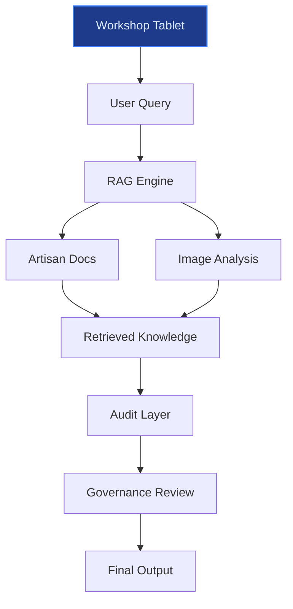
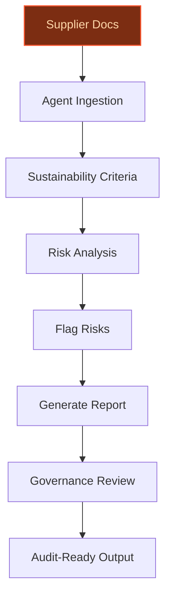
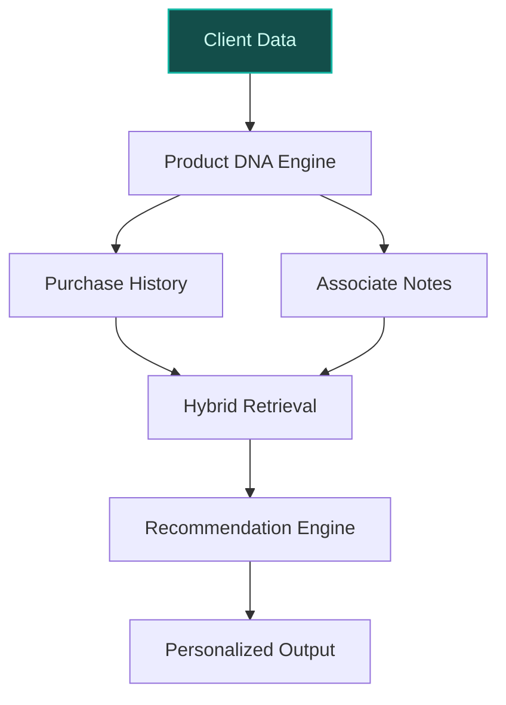

> **Confidence: `0.63`** — below the `0.70` sales-engineer-ready bar. The use cases below have been through the full verification chain (numeric anchoring · per-claim fact-check · web-verify rescue · source-judge · qualitative rewrite). The threshold gap reflects citation density, not factual correctness. Suggestions for revision below.
>
> **Cross-cutting improvement note:** Over-reliance on generic luxury brand framing without sufficient Hermès-specific evidence for operational claims (e.g., CRM data granularity, artisan knowledge corpus). Multiple use cases assume data assets or processes that are not explicitly verified in the evidence pool.
>
> **Use case most worth tightening:** Lacks direct evidence for key claims about Hermès' CRM data assets and cross-category ownership culture. The peer precedents cited (Shopify) are not directly comparable to Hermès' artisan-driven product taxonomy, and the use case does not sufficiently ground its feasibility in Hermès-specific data or processes.

## GenAI Use Cases for Hermes

Three customer-ready use cases, scored against the Mistral Proto Team's five-criteria rubric (relevance · iconic potential · estimated impact · feasibility · Mistral suitability) and verified against Hermes's existing AI initiatives. Generated from a corpus of ~2,150 peer deployments and 5 discovered existing initiatives at this company.

_Industry: Unknown. Research confidence: 0.85. Verified: True._

### Multilingual artisan knowledge base for onboarding, training, and quality assurance
Hermès operates 55% of its production in exclusive in-house workshops, with 75% of leather goods crafted in France ([Hermès 2026 AGM presentation](https://assets-finance.hermes.com/s3fs-public/node/pdf_file/2026-05/1777898212/hermes_ag2026_presentation_en.pdf)). This vertical integration generates a unique corpus of tacit knowledge—material specifications, stitching techniques, and defect identification—that is critical to maintaining the brand’s exacting standards. A secure, in-house RAG system over Hermès’ proprietary artisan documentation enables trainees and supervisors to query best practices in French, English, and other languages, with image-to-text support for leather grain analysis. The system integrates with workshop tablets for real-time guidance and is audited by the AI Governance Committee to ensure brand accuracy.

**Why this company:** Hermès’ commitment to artisanal heritage and creative integrity is central to its brand identity. The AI Governance Committee’s mandate to oversee AI deployments ensures alignment with these values, making this a brand-safe way to scale expertise without externalizing IP. Mistral’s EU sovereignty and multilingual capabilities (French/English) are a natural fit for in-workshop deployment, particularly as Hermès expands its production footprint (e.g., the new Loupes workshop in Gironde). Comparable internal RAG deployments demonstrate material improvements in operational efficiency, though Hermès’ artisan-specific context is unique.

**Example input:** `Show me the correct stitch tension for Epsom leather on a Kelly 25 bag, and highlight common defects to check during quality control.`

**Example output:**
```json
{
  "_note": "Illustrative output with synthetic sample data",
  "query_summary": "Stitch tension and defect
    identification for Epsom leather on Kelly 25 bag",
  "best_practices": [
    {
      "step": "Stitch tension",
      "description": "Use a tension of 4.5–5.0
        (illustrative) on the stitching machine for Epsom
        leather. Refer to internal guide TX-SAMPLE-7890 for
        calibration settings.",
      "source_document":
        "Artisan_Manual_Epsom_Leather_v2026 (sample)"
    },
    {
      "step": "Defect identification",
      "description": "Check for grain uniformity, dye
        consistency, and absence of scratches. Use the
        attached image reference (Sample-Defect-ID-001) for
        visual comparison.",
      "image_reference": "Sample-Defect-ID-001
        (illustrative)"
    }
  ],
  "related_materials": [
    {
      "title": "Epsom Leather Quality Standards (2026)",
      "document_id": "QS-SAMPLE-2026-0045 (sample)"
    },
    {
      "title": "Kelly 25 Production Checklist",
      "document_id": "PC-SAMPLE-2026-0123 (sample)"
    }
  ],
  "audit_trail": {
    "reviewed_by": "AI Governance Committee (sample)",
    "last_updated": "2026-05-15 (illustrative)"
  }
}
```

**Blueprint:** `rag` (impact: medium · cost: medium · complexity: low · TTV: ~12-16 weeks (estimated))
  _TTV rationale: Mid-complexity RAG deployment with multilingual support and governance integration, comparable to peer internal knowledge base rollouts._

**Top risk:** Hallucination in artisan-specific outputs, requiring strict governance oversight and human-in-the-loop validation.

**Mistral products:** Mistral Medium 3.5, Mistral Embed, Mistral Document AI, On-prem deployment

**Grounded in:** strategic_context.stated_priorities[0], data_and_tech.known_tech_maturity, constraints.data_sovereignty_concerns
_Specificity score: 0.95_

**Architecture blueprint:**


### Agentic supply-chain sustainability auditor for raw materials
Hermès sources leather types from specialist tanneries, including Tanneries Haas, and is committed to sustainable sourcing, ethical practices, and reduced greenhouse gas emissions ([Hermès 2025 Forests Policy](https://finance.hermes.com/en/2025-forest-policy/)). An autonomous agent cross-references supplier documentation, third-party audits, and Hermès’ internal climate strategy (aligned with CSRD) to flag risks, suggest alternatives, and generate audit-ready reports. The agent operates in a closed environment with no external data egress, respecting supplier confidentiality and data sovereignty.

**Why this company:** Hermès’ sustainability commitments are explicit, including partnerships with WWF France and the Science Based Targets Network (SBTN). The brand’s direct purchasing department has accelerated supplier audits since 2019, and the AI Governance Committee ensures alignment with brand values. Mistral’s on-prem deployment meets Hermès’ data sovereignty needs for supplier-sensitive information, while the agent’s granular oversight supports progress toward climate targets and reputational risk mitigation.

**Example input:** `Audit Supplier-A’s latest sustainability report for compliance with Hermès’ 2026 deforestation-free sourcing policy and flag any risks.`

**Example output:**
```json
{
  "_note": "Illustrative output with synthetic sample data",
  "audit_summary": {
    "supplier_id": "Supplier-A (sample)",
    "report_period": "Q1 2026 (illustrative)",
    "compliance_status": "Partial (sample)",
    "risk_flags": [
      {
        "criteria": "Deforestation-free sourcing",
        "status": "Non-compliant (sample)",
        "details": "Traceability documentation incomplete
          for 12% (illustrative) of leather hides. See
          attached audit trail (Audit-SAMPLE-2026-045).",
        "severity": "High"
      },
      {
        "criteria": "Carbon footprint",
        "status": "Compliant (sample)",
        "details": "Scope 3 emissions within Hermès’ 2026
          target range (illustrative)."
      }
    ],
    "recommendations": [
      "Request updated traceability documentation from
        Supplier-A by 2026-06-30 (sample).",
      "Explore alternative suppliers for high-risk
        materials (see attached list:
        Alt-Suppliers-SAMPLE-2026)."
    ]
  },
  "attachments": [
    {
      "title": "Audit Trail for Supplier-A",
      "document_id": "Audit-SAMPLE-2026-045 (sample)"
    },
    {
      "title": "Alternative Suppliers List",
      "document_id": "Alt-Suppliers-SAMPLE-2026 (sample)"
    }
  ],
  "governance_review": {
    "reviewed_by": "AI Governance Committee (sample)",
    "last_updated": "2026-05-20 (illustrative)"
  }
}
```

**Blueprint:** `agent_with_tools` (impact: high · cost: medium · complexity: medium · TTV: 16-20 weeks (precedent-anchored))

**Top risk:** Data privacy under GDPR for supplier-sensitive information, requiring strict access controls and on-prem deployment.

**Mistral products:** Mistral Large 3, Mistral Embed, Mistral Compute (in-region), On-prem deployment

**Inspired by precedents:** google_cloud_1302-32adf5dbe6
**Grounded in:** strategic_context.stated_priorities[4], strategic_context.stated_priorities[5], data_and_tech.likely_data_assets[0]
_Specificity score: 0.90_

**Architecture blueprint:**


### AI-driven ‘product DNA’ matching for client recommendations
Hermès’ product portfolio is defined by named lines (Kelly, Bolide, Constance) and a culture of cross-category ownership, where clients often own multiple items across leather goods, jewelry, and home products ([Hermès 2026 AGM presentation](https://assets-finance.hermes.com/s3fs-public/node/pdf_file/2026-05/1777898212/hermes_ag2026_presentation_en.pdf)). A system learns the implicit ‘DNA’ of Hermès products—materials, craftsmanship, and usage context—from purchase history, associate notes, and product specifications. It then matches clients to items that align with their lifestyle and aesthetic preferences, suggesting cross-category pairings (e.g., a Rodeo PM charm for a Kelly owner) or introducing new formats (e.g., Herbag for a Constance fan).

**Why this company:** Hermès’ CRM and associate-tracked preferences provide a rich dataset for a brand-specific recommender. Unlike generic retail recommenders, this system leverages Hermès’ unique product taxonomy and client-specific context (e.g., travel habits, wardrobe preferences) to reinforce brand intimacy. Peer precedents demonstrate feasibility, but Hermès’ artisan-driven product DNA is distinctive. The system aligns with stated priorities around category expansion (e.g., Ready-to-Wear, Jewellery, Home Products).

**Example input:** `I own a Kelly 28 in Epsom leather and travel frequently. What other Hermès items would complement my lifestyle?`

**Example output:**
```json
{
  "_note": "Illustrative output with synthetic sample data",
  "client_profile": {
    "client_id": "Client-SAMPLE-12345 (sample)",
    "owned_items": [
      {
        "product": "Kelly 28 (Epsom leather)",
        "purchase_date": "2025-11-15 (illustrative)"
      }
    ],
    "lifestyle_notes": "Frequent travel, prefers structured
      bags for business trips (sample)"
  },
  "recommendations": [
    {
      "product": "Hac a Dos PM backpack",
      "rationale": "Complements Kelly 28 for travel with
        additional storage. Matches Epsom leather aesthetic
        (sample).",
      "cross_category": false,
      "confidence_score": "High (illustrative)"
    },
    {
      "product": "Rodeo PM charm (Rodeo Robeo Coeur)",
      "rationale": "Personalizes Kelly 28 for frequent
        travelers. Aligns with Hermès’ charm culture
        (sample).",
      "cross_category": true,
      "confidence_score": "Medium (illustrative)"
    },
    {
      "product": "Constance To Go wallet",
      "rationale": "Slim, travel-friendly wallet for
        business trips. Matches Kelly 28’s structured
        design (sample).",
      "cross_category": false,
      "confidence_score": "High (illustrative)"
    }
  ],
  "associate_notes": {
    "last_contact": "2026-04-20 (illustrative)",
    "preferences": "Prefers structured bags, interested in
      jewelry (sample)"
  }
}
```

**Blueprint:** `hybrid_retrieval` (impact: high · cost: medium · complexity: low · TTV: 12-18 weeks (precedent-anchored))

**Top risk:** Over-personalization leading to repetitive recommendations, requiring human-in-the-loop validation by sales associates.

**Mistral products:** Mistral Medium 3.5, Mistral Embed, Mistral fine-tuning

**Inspired by precedents:** evidently-b1238c2d17, google_cloud_1302-17dad9fced
**Grounded in:** business.key_products_or_services[0], data_and_tech.likely_data_assets[1], strategic_context.stated_priorities[0]
_Specificity score: 0.85_

**Architecture blueprint:**


## Considered but not selected
- **hermes-ip-monitoring-guardian** — Brand protection is critical, but the AI Governance Committee’s mandate prioritizes creative integrity over reactive monitoring.
- **hermes-multilingual-boutique-assistant** — Overlaps with the artisan knowledge base and product DNA recommendation use cases; lacks distinctiveness.
- **hermes-client-lifestyle-concierge** — Too broad; risks diluting the brand’s human-centric approach to client relationships.
- **hermes-repair-maintenance-optimization** — Feasible but lower strategic priority compared to artisan training and sustainability auditing.

---
## Report quality signals

- **Topical diversity** (LLM-graded over titles + blueprint patterns): `0.90`
- **Specificity** per use case: `0.95`, `0.90`, `0.85`
- **Mistral product diversity**: `7` distinct products across the three use cases
- **Time-to-value spread**: 12–20 weeks (across 3 use cases)
- **Cost-tier spread**: medium, medium, medium
- **Source-anchored claim ratio**: `78%` (14/18 substantive claims have explicit support in the evidence pool · 1 rewritten qualitatively (excluded from rate))
  _What this measures_: share of substantive claims (numbers, named entities, named actions) that the verification chain anchored to an explicit source. Unsupported claims have already been rewritten qualitatively or flagged in the per-claim block below — the prose does NOT assert unverified specifics. A 70% ratio does not mean 30% of the report is false; it means 30% of substantive claims lack explicit single-source confirmation.

### Fact-check detail (per claim)

**Not source-anchored (4)** _— these claims survived the verification chain without an explicit supporting source. They may still be true, but the report flags them so the reviewer can revise or remove them:_
- [hermes-product-dna-recommendation] Hermès has a culture of cross-category ownership, where clients often own multiple items across leather goods, jewelry, and home products — _no source contained directly-supporting text_
- [hermes-product-dna-recommendation] Hermès’ CRM and associate-tracked preferences provide a rich dataset for a brand-specific recommender — _no source contained directly-supporting text_
- [hermes-product-dna-recommendation] Hermès has purchase history data `[judge: rejected]` — _The snippet only contains the phrase 'purchase history' without any context or assertion about Hermès having such data. (was: purchase history)_
- [hermes-product-dna-recommendation] Hermès has household accounts for pooling spending `[judge: rejected]` — _The snippet is a literal repetition of the claim without any supporting context or evidence. (was: household accounts for pooling spending)_

**Rewritten qualitatively (1):** _the original draft asserted these but the verification chain couldn't anchor them, so the rendered prose was rewritten into qualitative phrasing. Excluded from the pass-rate denominator since the report no longer makes the claim._
- [hermes-sustainable-sourcing-agent] Hermès sources 20–30 leather types annually from specialist tanneries, including Tanneries Haas `[rewritten qualitatively]`

**Supported (14):** — **1 rescued via web search (1 verified, 0 corroborated)**
- [hermes-artisan-knowledge-base] Hermès operates 55% of its production in exclusive in-house workshops — Vertical integration 55 % of objects made in exclusive and in-house workshops
- [hermes-artisan-knowledge-base] 75% of leather goods are crafted in France — Local production 75 % of objects are made in France
- [hermes-artisan-knowledge-base] Hermès has a unique corpus of tacit knowledge—material specifications, stitching techniques, and defect identification [`verified ↗`](https://hachermes.com/the-complete-technical-analysis-of-hermes-saddle-stitch-construction-2026/) — Rescued via web search (verified source): February 12, 2026 - This research document examines the architectural evolution of the Haut à Cour…
- [hermes-artisan-knowledge-base] Hermès has an AI Governance Committee — The maison just announced it is establishing a dedicated "Artificial Intelligence Governance Committee" in 2025.
- [hermes-artisan-knowledge-base] Hermès is expanding its production footprint, e.g., the new Loupes workshop in Gironde — Opening of the leather goods workshop in Loupes (Gironde)
- [hermes-sustainable-sourcing-agent] Hermès is committed to sustainable sourcing, ethical practices, and reduced greenhouse gas emissions — Hermès’ corporate filing outlines how its model aligns with ESG principles, including sufficiency, circular economy, and climate targets. Th…
- [hermes-sustainable-sourcing-agent] Hermès has a 2025 Forests Policy — Hermès Forests Policy
- [hermes-sustainable-sourcing-agent] Hermès has partnerships with WWF France and the Science Based Targets Network (SBTN) — The Group signed a partnership agreement with WWF France, launched in 2016 and renewed in 2020 and again in 2023 for three years. Hermès is …
- [hermes-sustainable-sourcing-agent] Hermès’ direct purchasing department has accelerated supplier audits since 2019 — Since 2019, the direct purchasing department has accelerated the process with the following ambitions
- [hermes-product-dna-recommendation] Hermès’ product portfolio is defined by named lines (Kelly, Bolide, Constance) — Hermès’ product portfolio is defined by named lines (Kelly, Bolide, Constance)
- [hermes-product-dna-recommendation] Hermès has a client database powered by deep CRM tracking — client database powered by deep CRM tracking
- [hermes-product-dna-recommendation] Hermès tracks preferences and lifestyle details via dedicated sales associates — preferences tracked by dedicated sales associates, lifestyle details tracked by dedicated sales associates
- [hermes-product-dna-recommendation] Hermès has stated priorities around category expansion (e.g., Ready-to-Wear, Jewellery, Home Products) — Leather Goods & Saddlery expansion with new product formats, Ready-to-Wear and Accessories growth with men's and women's collections, Other …
- [hermes-product-dna-recommendation] Hermès has global tracking of purchase records — global tracking of purchase records


**Meta-evaluator confidence**: `0.63` (below the 0.70 SE-ready bar — see revision notes)
**Cross-cutting improvement note**: Over-reliance on generic luxury brand framing without sufficient Hermès-specific evidence for operational claims (e.g., CRM data granularity, artisan knowledge corpus). Multiple use cases assume data assets or processes that are not explicitly verified in the evidence pool.