# Trace

## Execution trace — Hermes

Started: `2026-05-11T02:04:57.530721+00:00`. Total wall time: `192.8s` across `46` recorded actions.

### Per-step time totals

| Step | Calls | Total time | Avg time |
|---|---:|---:|---:|
| `research` | 1 | 7.51s | 7507ms |
| `gap_fill` | 4 | 4.27s | 1069ms |
| `retrieve` | 2 | 0.41s | 207ms |
| `generate` | 2 | 29.82s | 14908ms |
| `generate.web_search` | 4 | 16.66s | 4164ms |
| `score` | 2 | 30.06s | 15029ms |
| `verify` | 6 | 16.94s | 2824ms |
| `enrich` | 1 | 55.69s | 55686ms |
| `critique_revise` | 1 | 14.69s | 14690ms |
| `meta_eval` | 1 | 11.62s | 11620ms |
| `web_verify` | 1 | 6.32s | 6317ms |
| `source_judge` | 18 | 13.13s | 730ms |
| `final_qualify` | 1 | 1.89s | 1895ms |
| `quality_signals` | 2 | 3.84s | 1920ms |

### Chronological event log

- `02:05:00.046` **[research]** `mistral-medium-2604.chat.complete` — 7507ms
   - inputs: synthesize CompanyContext for Hermes | depth=medium
   - outputs: industry='Unknown' verified=True conf=0.75
- `02:05:07.555` **[gap_fill]** `mistral-small-2603.chat.complete` — 1126ms
   - inputs: generate gap queries | fields=['industry', 'geography', 'business_model', 'products', 'data_assets', 'priorities']
   - outputs: queries=6
- `02:05:16.563` **[gap_fill]** `mistral-small-2603.chat.complete` — 909ms
   - inputs: layer-2 extract field=priorities
   - outputs: items=6
- `02:05:16.568` **[gap_fill]** `mistral-small-2603.chat.complete` — 734ms
   - inputs: layer-2 extract field=data_assets
   - outputs: items=6
- `02:05:16.572` **[gap_fill]** `mistral-small-2603.chat.complete` — 1506ms
   - inputs: layer-2 extract field=products
   - outputs: items=20
- `02:05:18.079` **[retrieve]** `mistral-embed.embeddings.create` — 405ms
   - inputs: company_query | industries='Unknown'
   - outputs: embedded 1024-dim query vector
- `02:05:18.484` **[retrieve]** `precedent_corpus.cosine_topk` — 8ms
   - inputs: k=8 min_depth=0.4 target='Hermes'
   - outputs: retrieved 8 | mmr=True | top_sim=0.804
- `02:05:20.096` **[generate]** `mistral-medium-2604.chat.complete` — 1989ms
   - inputs: iteration=0 tool_calls_used=0/6 tools=on
   - outputs: tool_calls=4 | content_chars=0
- `02:05:22.107` **[generate.web_search]** `tavily.search` — 4432ms
   - inputs: query='Hermès luxury brand AI governance committee 2025'
   - outputs: 2 raw results
- `02:05:28.178` **[generate.web_search]** `tavily.search` — 3165ms
   - inputs: query='Hermès leather goods supply chain sourcing 2026'
   - outputs: 2 raw results
- `02:05:31.797` **[generate.web_search]** `tavily.search` — 4009ms
   - inputs: query='Hermès client CRM sales associate tracking 2026'
   - outputs: 2 raw results
- `02:05:36.206` **[generate.web_search]** `tavily.search` — 5050ms
   - inputs: query='Hermès sustainability greenhouse gas emissions raw materials 2026'
   - outputs: 2 raw results
- `02:05:41.872` **[generate]** `mistral-medium-2604.chat.complete` — 27827ms
   - inputs: iteration=1 tool_calls_used=4/6 tools=on
   - outputs: tool_calls=0 | content_chars=17346
- `02:06:10.018` **[score]** `mistral-small-2603.chat.complete` — 16152ms
   - inputs: self-consistency pass T=0.2
   - outputs: scored 8 candidates
- `02:06:10.034` **[score]** `mistral-small-2603.chat.complete` — 13906ms
   - inputs: self-consistency pass T=0.4
   - outputs: scored 8 candidates
- `02:06:26.204` **[verify]** `tavily.search` — 2163ms
   - inputs: candidate=hermes-artisan-knowledge-base | query='Hermes Multilingual artisan knowledge base for onboarding, t'
   - outputs: 4 results
- `02:06:26.204` **[verify]** `tavily.search` — 2506ms
   - inputs: candidate=hermes-sustainable-sourcing-agent | query='Hermes Agentic supply-chain sustainability auditor for raw m'
   - outputs: 4 results
- `02:06:26.205` **[verify]** `tavily.search` — 2009ms
   - inputs: candidate=hermes-ip-monitoring-guardian | query='Hermes AI-powered IP and counterfeit monitoring for brand pr'
   - outputs: 4 results
- `02:06:28.822` **[verify]** `mistral-small-2603.chat.complete` — 1938ms
   - inputs: verdict for hermes-artisan-knowledge-base
   - outputs: verdict='pass'
- `02:06:29.356` **[verify]** `mistral-small-2603.chat.complete` — 4477ms
   - inputs: verdict for hermes-ip-monitoring-guardian
   - outputs: verdict='confirmed_existing'
- `02:06:29.698` **[verify]** `mistral-small-2603.chat.complete` — 3847ms
   - inputs: verdict for hermes-sustainable-sourcing-agent
   - outputs: verdict='pass'
- `02:06:33.835` **[enrich]** `mistral-large-2512.chat.complete` — 55686ms
   - inputs: tier=max parallel=False ids=['hermes-artisan-knowledge-base', 'hermes-sustainable-sourcing-agent', 'hermes-product-dna-recommendation']
   - outputs: enriched 3 use cases
- `02:07:29.522` **[critique_revise]** `mistral-large-2512.chat.complete` — 14690ms
   - inputs: critiquing 3 use cases (max tier)
   - outputs: received 3 revisions
- `02:07:44.254` **[meta_eval]** `mistral-medium-2604.chat.complete` — 11620ms
   - inputs: reviewing 3 use cases
   - outputs: review + claims
- `02:07:55.898` **[web_verify]** `tavily.search.rescue_unsupported_claims` — 6317ms
   - inputs: company='Hermes' unsupported=4 budget=18
   - outputs: rescued: verified=1 corroborated=1 of 4 attempted
- `02:08:02.217` **[source_judge]** `mistral-small-2603.judge_claim_sources` — 1786ms
   - inputs: pairs=17
   - outputs: judged 17 pairs
- `02:08:02.217` **[source_judge]** `mistral-small-2603.chat.complete` — 744ms
   - inputs: claim='Hermès operates 55% of its production in exclusive in-house '
   - outputs: verdict=supported
- `02:08:02.229` **[source_judge]** `mistral-small-2603.chat.complete` — 760ms
   - inputs: claim='75% of leather goods are crafted in France'
   - outputs: verdict=supported
- `02:08:02.234` **[source_judge]** `mistral-small-2603.chat.complete` — 744ms
   - inputs: claim='Hermès has a unique corpus of tacit knowledge—material speci'
   - outputs: verdict=supported
- `02:08:02.238` **[source_judge]** `mistral-small-2603.chat.complete` — 723ms
   - inputs: claim='Hermès has an AI Governance Committee'
   - outputs: verdict=supported
- `02:08:02.241` **[source_judge]** `mistral-small-2603.chat.complete` — 714ms
   - inputs: claim='Hermès is expanding its production footprint, e.g., the new '
   - outputs: verdict=supported
- `02:08:02.244` **[source_judge]** `mistral-small-2603.chat.complete` — 717ms
   - inputs: claim='Hermès sources 20–30 leather types annually from specialist '
   - outputs: verdict=unsupported
- `02:08:02.249` **[source_judge]** `mistral-small-2603.chat.complete` — 822ms
   - inputs: claim='Hermès is committed to sustainable sourcing, ethical practic'
   - outputs: verdict=supported
- `02:08:02.252` **[source_judge]** `mistral-small-2603.chat.complete` — 795ms
   - inputs: claim='Hermès has a 2025 Forests Policy'
   - outputs: verdict=supported
- `02:08:02.955` **[source_judge]** `mistral-small-2603.chat.complete` — 822ms
   - inputs: claim='Hermès has partnerships with WWF France and the Science Base'
   - outputs: verdict=supported
- `02:08:02.962` **[source_judge]** `mistral-small-2603.chat.complete` — 815ms
   - inputs: claim='Hermès’ direct purchasing department has accelerated supplie'
   - outputs: verdict=supported
- `02:08:02.968` **[source_judge]** `mistral-small-2603.chat.complete` — 465ms
   - inputs: claim='Hermès’ product portfolio is defined by named lines (Kelly, '
   - outputs: verdict=supported
- `02:08:02.972` **[source_judge]** `mistral-small-2603.chat.complete` — 431ms
   - inputs: claim='Hermès has a client database powered by deep CRM tracking'
   - outputs: verdict=supported
- `02:08:02.978` **[source_judge]** `mistral-small-2603.chat.complete` — 592ms
   - inputs: claim='Hermès tracks preferences and lifestyle details via dedicate'
   - outputs: verdict=supported
- `02:08:02.988` **[source_judge]** `mistral-small-2603.chat.complete` — 580ms
   - inputs: claim='Hermès has stated priorities around category expansion (e.g.'
   - outputs: verdict=supported
- `02:08:03.047` **[source_judge]** `mistral-small-2603.chat.complete` — 522ms
   - inputs: claim='Hermès has purchase history data'
   - outputs: verdict=unsupported
- `02:08:03.072` **[source_judge]** `mistral-small-2603.chat.complete` — 498ms
   - inputs: claim='Hermès has global tracking of purchase records'
   - outputs: verdict=supported
- `02:08:03.402` **[source_judge]** `mistral-small-2603.chat.complete` — 601ms
   - inputs: claim='Hermès has household accounts for pooling spending'
   - outputs: verdict=unsupported
- `02:08:04.219` **[final_qualify]** `mistral-small-2603.chat.complete` — 1895ms
   - inputs: use_case=hermes-sustainable-sourcing-agent unsupported=1
   - outputs: qualified 4 fields
- `02:08:06.473` **[quality_signals]** `mistral-small-2603.chat.complete` — 2402ms
   - inputs: specificity grade (3 use cases)
   - outputs: scored 3 use cases
- `02:08:08.875` **[quality_signals]** `mistral-small-2603.chat.complete` — 1438ms
   - inputs: diversity grade
   - outputs: diversity=0.9

## Mermaid sequence

```mermaid
sequenceDiagram
    autonumber
    participant pipeline as pipeline
    participant mistral_medium_2604 as mistral-medium-2604
    participant mistral_small_2603 as mistral-small-2603
    participant mistral_embed as mistral-embed
    participant precedent_corpus as precedent_corpus
    participant tavily as tavily
    participant mistral_large_2512 as mistral-large-2512
    participant tavily_search as tavily.search
    pipeline->>mistral_medium_2604: research: chat.complete (7507ms)
    mistral_medium_2604-->>pipeline: industry='Unknown' verified=True conf=0.75
    pipeline->>mistral_small_2603: gap_fill: chat.complete (1126ms)
    mistral_small_2603-->>pipeline: queries=6
    pipeline->>mistral_small_2603: gap_fill: chat.complete (909ms)
    mistral_small_2603-->>pipeline: items=6
    pipeline->>mistral_small_2603: gap_fill: chat.complete (734ms)
    mistral_small_2603-->>pipeline: items=6
    pipeline->>mistral_small_2603: gap_fill: chat.complete (1506ms)
    mistral_small_2603-->>pipeline: items=20
    pipeline->>mistral_embed: retrieve: embeddings.create (405ms)
    mistral_embed-->>pipeline: embedded 1024-dim query vector
    pipeline->>precedent_corpus: retrieve: cosine_topk (8ms)
    precedent_corpus-->>pipeline: retrieved 8 | mmr=True | top_sim=0.804
    pipeline->>mistral_medium_2604: generate: chat.complete (1989ms)
    mistral_medium_2604-->>pipeline: tool_calls=4 | content_chars=0
    pipeline->>tavily: generate.web_search: search (4432ms)
    tavily-->>pipeline: 2 raw results
    pipeline->>tavily: generate.web_search: search (3165ms)
    tavily-->>pipeline: 2 raw results
    pipeline->>tavily: generate.web_search: search (4009ms)
    tavily-->>pipeline: 2 raw results
    pipeline->>tavily: generate.web_search: search (5050ms)
    tavily-->>pipeline: 2 raw results
    pipeline->>mistral_medium_2604: generate: chat.complete (27827ms)
    mistral_medium_2604-->>pipeline: tool_calls=0 | content_chars=17346
    pipeline->>mistral_small_2603: score: chat.complete (16152ms)
    mistral_small_2603-->>pipeline: scored 8 candidates
    pipeline->>mistral_small_2603: score: chat.complete (13906ms)
    mistral_small_2603-->>pipeline: scored 8 candidates
    pipeline->>tavily: verify: search (2163ms)
    tavily-->>pipeline: 4 results
    pipeline->>tavily: verify: search (2506ms)
    tavily-->>pipeline: 4 results
    pipeline->>tavily: verify: search (2009ms)
    tavily-->>pipeline: 4 results
    pipeline->>mistral_small_2603: verify: chat.complete (1938ms)
    mistral_small_2603-->>pipeline: verdict='pass'
    pipeline->>mistral_small_2603: verify: chat.complete (4477ms)
    mistral_small_2603-->>pipeline: verdict='confirmed_existing'
    pipeline->>mistral_small_2603: verify: chat.complete (3847ms)
    mistral_small_2603-->>pipeline: verdict='pass'
    pipeline->>mistral_large_2512: enrich: chat.complete (55686ms)
    mistral_large_2512-->>pipeline: enriched 3 use cases
    pipeline->>mistral_large_2512: critique_revise: chat.complete (14690ms)
    mistral_large_2512-->>pipeline: received 3 revisions
    pipeline->>mistral_medium_2604: meta_eval: chat.complete (11620ms)
    mistral_medium_2604-->>pipeline: review + claims
    pipeline->>tavily_search: web_verify: rescue_unsupported_claims (6317ms)
    tavily_search-->>pipeline: rescued: verified=1 corroborated=1 of 4 attempted
    pipeline->>mistral_small_2603: source_judge: judge_claim_sources (1786ms)
    mistral_small_2603-->>pipeline: judged 17 pairs
    pipeline->>mistral_small_2603: source_judge: chat.complete (744ms)
    mistral_small_2603-->>pipeline: verdict=supported
    pipeline->>mistral_small_2603: source_judge: chat.complete (760ms)
    mistral_small_2603-->>pipeline: verdict=supported
    pipeline->>mistral_small_2603: source_judge: chat.complete (744ms)
    mistral_small_2603-->>pipeline: verdict=supported
    pipeline->>mistral_small_2603: source_judge: chat.complete (723ms)
    mistral_small_2603-->>pipeline: verdict=supported
    pipeline->>mistral_small_2603: source_judge: chat.complete (714ms)
    mistral_small_2603-->>pipeline: verdict=supported
    pipeline->>mistral_small_2603: source_judge: chat.complete (717ms)
    mistral_small_2603-->>pipeline: verdict=unsupported
    pipeline->>mistral_small_2603: source_judge: chat.complete (822ms)
    mistral_small_2603-->>pipeline: verdict=supported
    pipeline->>mistral_small_2603: source_judge: chat.complete (795ms)
    mistral_small_2603-->>pipeline: verdict=supported
    pipeline->>mistral_small_2603: source_judge: chat.complete (822ms)
    mistral_small_2603-->>pipeline: verdict=supported
    pipeline->>mistral_small_2603: source_judge: chat.complete (815ms)
    mistral_small_2603-->>pipeline: verdict=supported
    pipeline->>mistral_small_2603: source_judge: chat.complete (465ms)
    mistral_small_2603-->>pipeline: verdict=supported
    pipeline->>mistral_small_2603: source_judge: chat.complete (431ms)
    mistral_small_2603-->>pipeline: verdict=supported
    pipeline->>mistral_small_2603: source_judge: chat.complete (592ms)
    mistral_small_2603-->>pipeline: verdict=supported
    pipeline->>mistral_small_2603: source_judge: chat.complete (580ms)
    mistral_small_2603-->>pipeline: verdict=supported
    pipeline->>mistral_small_2603: source_judge: chat.complete (522ms)
    mistral_small_2603-->>pipeline: verdict=unsupported
    pipeline->>mistral_small_2603: source_judge: chat.complete (498ms)
    mistral_small_2603-->>pipeline: verdict=supported
    pipeline->>mistral_small_2603: source_judge: chat.complete (601ms)
    mistral_small_2603-->>pipeline: verdict=unsupported
    pipeline->>mistral_small_2603: final_qualify: chat.complete (1895ms)
    mistral_small_2603-->>pipeline: qualified 4 fields
    pipeline->>mistral_small_2603: quality_signals: chat.complete (2402ms)
    mistral_small_2603-->>pipeline: scored 3 use cases
    pipeline->>mistral_small_2603: quality_signals: chat.complete (1438ms)
    mistral_small_2603-->>pipeline: diversity=0.9
```

