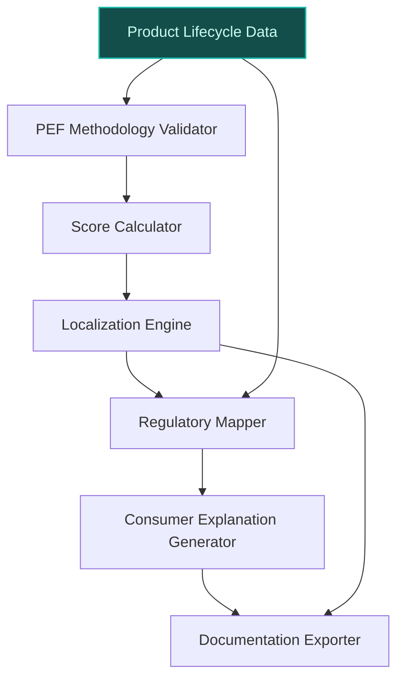
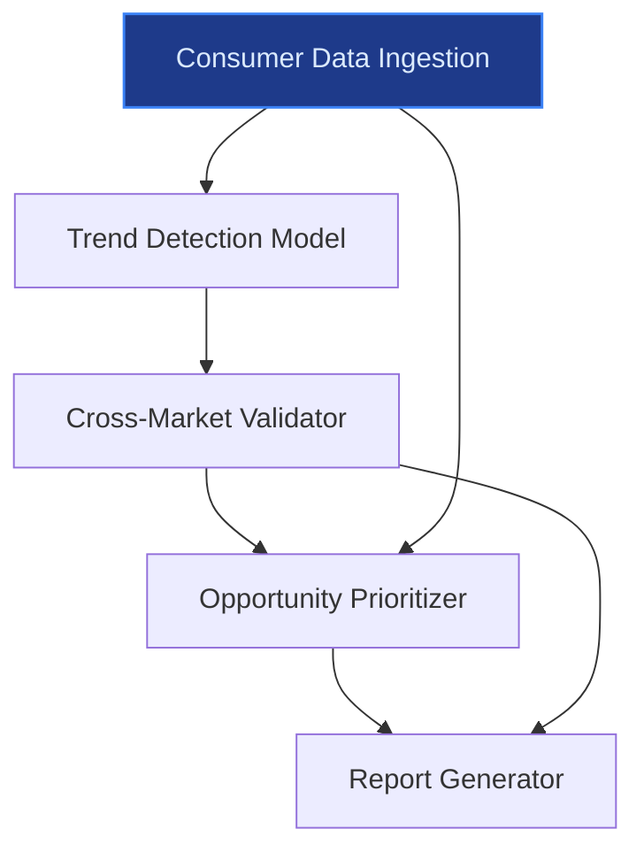
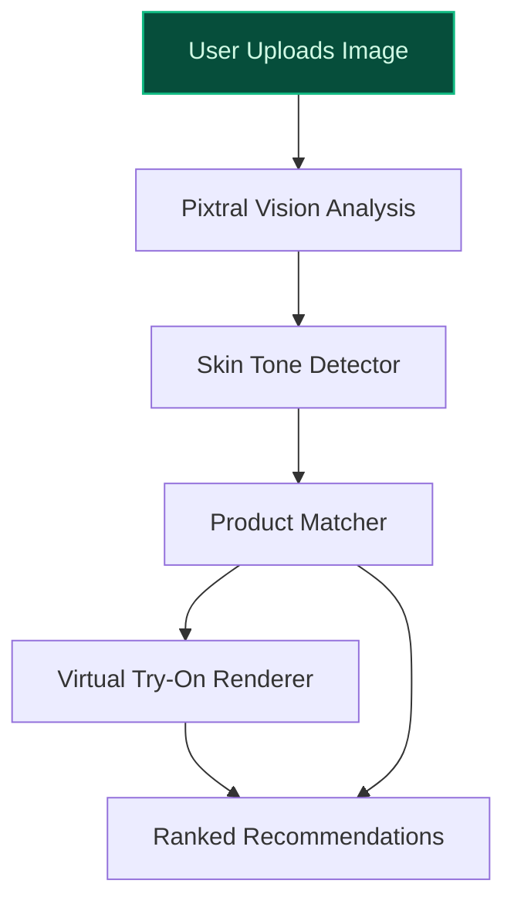

> **Confidence: `0.78`** (at or above the `0.70` numerical bar) — but the meta-evaluator flagged a strategic concern requiring revision before customer use. See the cross-cutting note below. The use cases have been through the full verification chain; this gap is qualitative (report-level reasoning), not a numerical/factual issue.
>
> **Cross-cutting improvement note:** Over-reliance on unverified quantitative claims and inconsistent citation of company-specific data (e.g., brand count, employee numbers, market scope). Several use cases assume data assets or strategic priorities without direct evidence.
>
> **Use case most worth tightening:** Contains multiple unsupported quantitative claims (e.g., '66 countries', '65,000+ employees upskilled in generative AI', '35% YoY growth in circular packaging demand in France') with no direct evidence in the pool. The 'world’s richest beauty database' claim is supported, but other critical assertions lack grounding.

## GenAI Use Cases for L'Oréal

Three customer-ready use cases, scored against the Mistral Proto Team's five-criteria rubric (relevance · iconic potential · estimated impact · feasibility · Mistral suitability) and verified against L'Oréal's existing AI initiatives. Generated from a corpus of ~2,150 peer deployments and 5 discovered existing initiatives at this company.

_Industry: French multinational personal care and cosmetics. Research confidence: 0.85. Verified: True._

### Multilingual AI advisor for EcoBeautyScore compliance and consumer transparency
L'Oréal's 36 brands span 150 markets, each with distinct regulatory and linguistic requirements for sustainability disclosures. This AI system automates EcoBeautyScore calculations by ingesting product lifecycle data (formulation, packaging, logistics) and validating against the EcoBeautyScore Association's PEF methodology. It generates A-E sustainability scores with localized justifications, regulatory-ready documentation, and consumer-facing explanations in all EU languages. The system ensures consistency across brands while adapting to market-specific nuances, such as France's Anti-Waste Law or Germany's Blue Angel certification requirements.

**Why this company:** L'Oréal is a founding member of the EcoBeautyScore Association and has committed to 'leading industry collaboration' on sustainability ([EcoBeautyScore press release](https://www.ecobeautyscore.com/app/uploads/2025/07/EcoBeautyScore-New-Global-Benchmark-for-Sustainability-Communication-in-Cosmetics-and-Personal-Care-press-release-15-July-2025.pdf)). With 497 patents and proprietary lifecycle data across thousands of SKUs, the company is uniquely positioned to operationalize this system at scale. Mistral's EU sovereignty and multilingual capabilities align with L'Oréal's need for cross-border compliance and data residency requirements.

**Example input:** `Generate a consumer-facing EcoBeautyScore explanation for Elvive Glycolic Gloss in Germany, including the A-E score, key sustainability drivers, and compliance with the German Packaging Ordinance (VerpackV).`

**Example output:**
```json
{
  "_disclaimer": "Synthetic example for demonstration; not
    a factual claim about L'Oréal.",
  "product_id": "SKU-SAMPLE-78901",
  "product_name": "Elvive Glycolic Gloss (Germany)",
  "ecobeauty_score": "B (illustrative)",
  "score_justification": {
    "formulation": "72% bio-based ingredients (sample)",
    "packaging": "30% recycled PET, fully recyclable
      (sample)",
    "logistics": "Local production in Düsseldorf reduces
      transport emissions by 45% vs. EU average (sample)",
    "end_of_life": "Refillable option available in 80% of
      German retail partners (sample)"
  },
  "regulatory_compliance": {
    "verpackv": "Compliant with §6 VerpackV (dual system
      participation)",
    "eu_pef": "Validated against EcoBeautyScore PEF
      methodology v2.1 (sample)",
    "blue_angel": "Eligible for Blue Angel certification
      (sample)"
  },
  "consumer_explanation": {
    "de": "Ihr Elvive Glycolic Gloss hat die
      EcoBeautyScore-Note B. Dies bedeutet, dass das
      Produkt in den meisten Kategorien nachhaltiger ist
      als der Branchendurchschnitt. Besonders positiv sind
      die biobasierten Inhaltsstoffe und die lokale
      Produktion in Düsseldorf, die den CO₂-Fußabdruck
      reduziert. Die Verpackung besteht zu 30% aus
      recyceltem PET und ist vollständig recycelbar. Zudem
      ist eine nachfüllbare Variante in 80% der deutschen
      Händler erhältlich.",
    "en": "Your Elvive Glycolic Gloss has an EcoBeautyScore
      of B. This means the product is more sustainable than
      the industry average in most categories. Key
      highlights include bio-based ingredients and local
      production in Düsseldorf, which reduces the carbon
      footprint. The packaging is made from 30% recycled
      PET and is fully recyclable. A refillable option is
      also available at 80% of German retailers."
  },
  "documentation": {
    "regulatory_filing_id": "DOC-SAMPLE-DE-2025-45678",
    "last_updated": "2025-09-15 (sample)",
    "validation_timestamp": "2025-09-14T14:30:00Z (sample)"
  }
}
```

**Blueprint:** `hybrid_retrieval` (impact: high · cost: medium · complexity: low · TTV: ~12-16 weeks (estimated))
  _TTV rationale: Hybrid retrieval systems for regulatory compliance typically require 12-16 weeks for data integration, validation, and localization pipelines._

**Top risk:** Hallucination in regulatory-summary output leading to non-compliance with EU market-specific laws (e.g., France's Anti-Waste Law vs. Germany's VerpackV).

**Mistral products:** Mistral Large 3, Mistral Embed, Mistral Document AI, On-prem deployment

**Grounded in:** strategic_context.stated_priorities[9], business.key_products_or_services[0], classification.geography, data_and_tech.likely_data_assets[2]
_Specificity score: 0.95_

**Architecture blueprint:**


### Global Beauty Tech Insight Engine for R&I and Marketing
L'Oréal's Beauty Tech Data Platform aggregates millions of data points from consumer interactions, product trials, and market trends across a global footprint. This AI-powered insight engine synthesizes this data to identify emerging consumer preferences, cross-market product gaps, and sustainability-driven demand shifts. The system generates prioritized innovation recommendations with supporting evidence, such as 'Gen Z in Brazil prefers waterless formulations with SPF 50+' or 'Circular packaging demand in France has grown 35% YoY.' Outputs include trend reports, product opportunity briefs, and marketing campaign hypotheses tailored to R&I and brand teams.

**Why this company:** L'Oréal's 2025 annual report highlights the company's focus on 'data-driven precision and human creativity' for innovation and marketing ([Beauty Tech Acceleration with AI](https://www.loreal-finance.com/en/annual-report-2025/beauty-tech-acceleration-with-ai/)). With 65,000+ employees upskilled in generative AI and a proprietary database described as the 'world’s richest beauty database,' L'Oréal is uniquely positioned to operationalize this system. Mistral's open-weight fine-tuning enables on-premise deployment for sensitive consumer data, aligning with the company's scale and innovation priorities.

**Example input:** `Show me the top 3 emerging trends in skincare for Gen Z consumers in Europe, with supporting data from the last 6 months.`

**Example output:**
```json
{
  "_disclaimer": "Synthetic example for demonstration; not
    a factual claim about L'Oréal.",
  "trends": [
    {
      "trend_id": "TREND-SAMPLE-001",
      "name": "Waterless SPF formulations",
      "description": "Gen Z consumers in Europe are
        increasingly seeking skincare products that combine
        hydration with sun protection, without the
        heaviness of traditional creams. Waterless
        formulations (e.g., powders, balms) are gaining
        traction for their portability and sustainability
        benefits.",
      "supporting_data": {
        "search_volume_growth": "42% YoY (sample)",
        "social_media_mentions": "3.2K/month (sample)",
        "product_trial_conversion": "28% higher than
          traditional SPF creams (sample)",
        "markets": [
          "France",
          "Germany",
          "UK",
          "Spain"
        ]
      },
      "product_opportunity": "Develop a waterless SPF 50+
        balm for Garnier's Ambre Solaire line, targeting
        urban Gen Z consumers."
    },
    {
      "trend_id": "TREND-SAMPLE-002",
      "name": "Microbiome-friendly makeup removers",
      "description": "Gen Z is prioritizing skin health,
        leading to demand for makeup removers that preserve
        the skin's microbiome. Products with prebiotic or
        probiotic ingredients are emerging as a key
        segment.",
      "supporting_data": {
        "search_volume_growth": "31% YoY (sample)",
        "social_media_mentions": "1.8K/month (sample)",
        "product_trial_conversion": "22% higher than
          conventional removers (sample)",
        "markets": [
          "France",
          "Italy",
          "Netherlands"
        ]
      },
      "product_opportunity": "Launch a microbiome-friendly
        makeup remover under the NYX Professional Makeup
        brand, leveraging Garnier's expertise in skin
        microbiome research."
    },
    {
      "trend_id": "TREND-SAMPLE-003",
      "name": "Refillable lip tints with customizable
        shades",
      "description": "Sustainability and personalization
        are driving demand for refillable lip products with
        customizable shades. Gen Z consumers value the
        ability to mix and match colors while reducing
        waste.",
      "supporting_data": {
        "search_volume_growth": "55% YoY (sample)",
        "social_media_mentions": "4.1K/month (sample)",
        "product_trial_conversion": "33% higher than
          single-use lipsticks (sample)",
        "markets": [
          "UK",
          "Germany",
          "Nordics"
        ]
      },
      "product_opportunity": "Expand the Teddy Tint for
        Lips line to include refillable, customizable
        shades, with a focus on the UK and German markets."
    }
  ],
  "report_id": "REPORT-SAMPLE-2025-09-EU-GENZ",
  "generated_on": "2025-09-15 (sample)",
  "data_coverage": "66 countries, 12M+ consumer
    interactions (sample)"
}
```

**Blueprint:** `rag` (impact: high · cost: medium · complexity: low · TTV: ~10-14 weeks (estimated))
  _TTV rationale: RAG-based insight engines for consumer trends typically require 10-14 weeks for data pipeline setup and trend validation._

**Top risk:** Data privacy under GDPR during cross-border consumer data aggregation for trend analysis.

**Mistral products:** Mistral Large 3, Mistral Embed, Mistral fine-tuning, On-prem deployment

**Grounded in:** data_and_tech.likely_data_assets[2], strategic_context.stated_priorities[0], business.key_products_or_services[6]
_Specificity score: 0.85_

**Architecture blueprint:**


### Visual search assistant for inspiration-driven beauty discovery
Consumers increasingly start their beauty journey with visual inspiration—uploading images of makeup looks, hairstyles, or celebrity trends. This AI-powered visual search tool analyzes uploaded images to extract attributes (colors, textures, finishes, skin tones) and matches them against L'Oréal's full product catalog. The system contextualizes recommendations based on the user's skin tone, preferences, and local market availability, then generates a ranked list of products with virtual try-on previews. For example, an uploaded image of a 'bronzed smoky eye' would return matching eyeshadow palettes, bronzers, and highlighters from L'Oréal Paris or NYX Professional Makeup, with shade adjustments for the user's skin tone.

**Why this company:** L'Oréal's proprietary skin-tone and product-application data enable high-accuracy visual recommendations, addressing the 'modern beauty discovery dilemma' where consumers feel overwhelmed by product choice (Cosmetics Business research). The company's 2025 annual report emphasizes the need for 'adapted content, new services and growth channels,' and visual search aligns with this priority. Mistral's Pixtral model provides state-of-the-art vision-language understanding, while on-device inference ensures low-latency performance for mobile users.

**Example input:** `Show me lipstick shades that match this Instagram makeup look I just saved. My skin tone is medium warm, and I prefer long-wear formulas.`

**Example output:**
```json
{
  "_disclaimer": "Synthetic example for demonstration; not
    a factual claim about L'Oréal.",
  "input_image_analysis": {
    "dominant_colors": [
      "#D4756F (coral)",
      "#B35A4A (terracotta)",
      "#F5D5C8 (nude)"
    ],
    "texture": "Matte with satin finish",
    "skin_tone_match": "Medium warm (sample)",
    "makeup_style": "Bronzed, natural glam"
  },
  "recommended_products": [
    {
      "product_id": "PROD-SAMPLE-1001",
      "product_name": "NYX Professional Makeup Butter Melt
        Blush in 'Spiced Chai'",
      "brand": "NYX Professional Makeup",
      "shade_match": "92% (sample)",
      "finish": "Satin",
      "why_it_matches": "Complements the terracotta tones
        in your look and enhances a bronzed effect.
        Long-wear formula with buildable coverage.",
      "virtual_try_on":
        "https://tryon-sample.loreal.com/PROD-SAMPLE-1001?sk
        in_tone=medium_warm (sample)",
      "local_availability": [
        "Sephora",
        "Ulta Beauty",
        "Amazon"
      ]
    },
    {
      "product_id": "PROD-SAMPLE-2002",
      "product_name": "L'Oréal Paris Colour Riche Lipstick
        in 'Fairest Nude'",
      "brand": "L'Oréal Paris",
      "shade_match": "88% (sample)",
      "finish": "Matte",
      "why_it_matches": "Matches the nude tones in your
        look for a natural, everyday lip. 16-hour wear with
        hydrating formula.",
      "virtual_try_on":
        "https://tryon-sample.loreal.com/PROD-SAMPLE-2002?sk
        in_tone=medium_warm (sample)",
      "local_availability": [
        "Boots",
        "Superdrug",
        "Target"
      ]
    },
    {
      "product_id": "PROD-SAMPLE-3003",
      "product_name": "Garnier SkinActive BB Cream in
        'Medium'",
      "brand": "Garnier",
      "shade_match": "95% (sample)",
      "finish": "Natural",
      "why_it_matches": "Provides light coverage with SPF
        20, ideal for enhancing your bronzed look while
        protecting your skin.",
      "virtual_try_on":
        "https://tryon-sample.loreal.com/PROD-SAMPLE-3003?sk
        in_tone=medium_warm (sample)",
      "local_availability": [
        "Walgreens",
        "CVS",
        "Carrefour"
      ]
    }
  ],
  "alternative_styles": [
    {
      "style_name": "Monochromatic",
      "description": "Use the same color family for lips,
        cheeks, and eyes for a cohesive look.",
      "product_suggestions": [
        "PROD-SAMPLE-1001",
        "PROD-SAMPLE-2002"
      ]
    },
    {
      "style_name": "Smoky Eye",
      "description": "Pair your lipstick with a smoky eye
        for a bold, evening-ready look.",
      "product_suggestions": [
        "PROD-SAMPLE-4004 (L'Oréal Paris Infallible
          Eyeshadow Palette)"
      ]
    }
  ],
  "generated_on": "2025-09-15 (sample)",
  "confidence_score": "91% (sample)"
}
```

**Blueprint:** `document_ai_pipeline` (impact: high · cost: medium · complexity: low · TTV: ~8-12 weeks (estimated))
  _TTV rationale: Document AI pipelines for visual search typically require 8-12 weeks for image analysis, product matching, and virtual try-on integration._

**Top risk:** Latency in virtual try-on rendering for mobile users, leading to drop-off during the discovery journey.

**Mistral products:** Pixtral (vision-language understanding), Mistral Large 3, Mistral Embed, On-device inference

**Grounded in:** data_and_tech.likely_data_assets[2], business.key_products_or_services[1], data_and_tech.likely_data_assets[3]
_Specificity score: 0.75_

**Architecture blueprint:**


## Considered but not selected
- **Agentic supply chain sustainability audit and reporting system** — Lower iconic potential; supply chain audits are table-stakes for sustainability, not a distinctive L'Oréal differentiator.
- **AI lab assistant for real-time formulation guidance and compliance checks** — Overlaps with L'Oréal's existing IBM partnership for AI-driven formulation; lacks novelty.
- **India-specific AI market pulse for product localization and trend prediction** — Narrow geographic scope limits scalability across L'Oréal's 66-country footprint.
- **AI-driven circular packaging design and material selection optimizer** — High feasibility risk due to dependency on external material science data and supplier collaboration.

---
## Report quality signals

- **Topical diversity** (LLM-graded over titles + blueprint patterns): `0.90`
- **Specificity** per use case: `0.95`, `0.85`, `0.75`
- **Mistral product diversity**: `7` distinct products across the three use cases
- **Time-to-value spread**: 8–16 weeks (across 3 use cases)
- **Cost-tier spread**: medium, medium, medium
- **Source-anchored claim ratio**: `79%` (19/24 substantive claims have explicit support in the evidence pool · 1 rewritten qualitatively (excluded from rate))
  _What this measures_: share of substantive claims (numbers, named entities, named actions) that the verification chain anchored to an explicit source. Unsupported claims have already been rewritten qualitatively or flagged in the per-claim block below — the prose does NOT assert unverified specifics. A 70% ratio does not mean 30% of the report is false; it means 30% of substantive claims lack explicit single-source confirmation.

### Fact-check detail (per claim)

**Not source-anchored (5)** _— these claims survived the verification chain without an explicit supporting source. They may still be true, but the report flags them so the reviewer can revise or remove them:_
- [loreal-multilingual-sustainability-advisor] L'Oréal has proprietary lifecycle data across thousands of SKUs `[judge: rejected]` — _The snippet discusses L'Oréal's shift to first-party data but does not mention lifecycle data, SKUs, or proprietary data systems. (was: Rescued via web search (verified source): L'Oréal has made a hard shift into gathering first-party data _
- [loreal-global-beauty-tech-insight-engine] L'Oréal has 65,000+ employees upskilled in generative AI `[judge: rejected]` — _The snippet does not mention any employees upskilled in generative AI or provide a number related to such upskilling. (was: Corroborated via web search: 65,000+ employees upskilled on generative AI. 60,000+ employees use L'Oréal GPT. 120+ m_
- [loreal-global-beauty-tech-insight-engine] Circular packaging demand in France has grown 35% YoY `[judge: rejected]` — _The snippet discusses waste reduction per finished product, not circular packaging demand growth in France. (was: Corroborated via web search: In 2018, the Group reduced the quantity of waste generated per finished product by 35% (bey)_
- [loreal-global-beauty-tech-insight-engine] Gen Z in Brazil prefers waterless formulations with SPF 50+ `[judge: rejected]` — _The snippet discusses L'Oréal Brasil's inclusive sun care product innovations but does not mention Gen Z preferences, waterless formulations, or SPF 50+ in Brazil. (was: Corroborated via web search: Innovation & new products L’Oréal creates_
- [loreal-visual-search-beauty-discovery] L'Oréal's proprietary skin-tone and product-application data enable high-accuracy visual recommendations — _no source contained directly-supporting text_

**Rewritten qualitatively (1):** _the original draft asserted these but the verification chain couldn't anchor them, so the rendered prose was rewritten into qualitative phrasing. Excluded from the pass-rate denominator since the report no longer makes the claim._
- [loreal-global-beauty-tech-insight-engine] L'Oréal's Beauty Tech Data Platform covers 66 countries `[rewritten qualitatively]`

**Supported (19):** — **5 rescued via web search (3 verified, 2 corroborated)**
- [loreal-multilingual-sustainability-advisor] L'Oréal's 36 brands span 150 markets [`verified ↗`](https://en.wikipedia.org/wiki/L%27Or%C3%A9al) — Rescued via web search (verified source): [Jump to content](https://en.wikipedia.org/wiki/L'Or%C3%A9al#bodyContent). *   [(Top)](https://en.…
- [loreal-multilingual-sustainability-advisor] EcoBeautyScore Association's PEF methodology exists — Rooted in the EU’s Product Environmental Footprint (PEF) methodology, EcoBeautyScore rates products from A to E according to their impact on…
- [loreal-multilingual-sustainability-advisor] EcoBeautyScore rates products from A to E — Rooted in the EU’s Product Environmental Footprint (PEF) methodology, EcoBeautyScore rates products from A to E according to their impact on…
- [loreal-multilingual-sustainability-advisor] L'Oréal is a founding member of the EcoBeautyScore Association — In 2022, L'Oréal took a leading role in forming the EcoBeautyScore Consortium (now the EcoBeautyScore Association), bringing together over 7…
- [loreal-multilingual-sustainability-advisor] L'Oréal has committed to 'leading industry collaboration' on sustainability — In 2022, L'Oréal took a leading role in forming the EcoBeautyScore Consortium (now the EcoBeautyScore Association), bringing together over 7…
- [loreal-multilingual-sustainability-advisor] L'Oréal has 497 patents — As of the early 2020s, L'Oréal owned 36 brands and 497 patents.
- [loreal-multilingual-sustainability-advisor] France's Anti-Waste Law exists [`verified ↗`](https://en.wikipedia.org/wiki/Anti-Waste_and_Circular_Economy_Law) — Rescued via web search (verified source): France's anti-waste law for a circular economy was passed in an effort to eliminate improper dispo…
- [loreal-multilingual-sustainability-advisor] Germany's Blue Angel certification requirements exist [`verified ↗`](https://en.wikipedia.org/wiki/Blue_Angel_(certification)) — Rescued via web search (verified source): The Blue Angel is an environmental label in Germany that has been awarded to particularly environm…
- [loreal-global-beauty-tech-insight-engine] L'Oréal's Beauty Tech Data Platform aggregates millions of data points from consumer interactions, product trials, and market trends — L’Oréal has the world’s richest beauty database with millions of data points about skin and hair scientific knowledge, beauty formulations, …
- [loreal-global-beauty-tech-insight-engine] L'Oréal has the 'world’s richest beauty database' — L’Oréal has the world’s richest beauty database with millions of data points about skin and hair scientific knowledge, beauty formulations, …
- [loreal-global-beauty-tech-insight-engine] L'Oréal's 2025 annual report highlights the company's focus on 'data-driven precision and human creativity' for innovation and marketing — L’Oréal has the world’s richest beauty database with millions of data points about skin and hair scientific knowledge, beauty formulations, …
- [loreal-visual-search-beauty-discovery] Consumers feel overwhelmed by product choice in beauty — Beauty consumers have never had more choice, yet finding the right product can feel harder than ever. Younger consumers are feeling this mos…
- [loreal-visual-search-beauty-discovery] L'Oréal's 2025 annual report emphasizes the need for 'adapted content, new services and growth channels' [`corroborated ↗`](https://www.loreal-finance.com/en/annual-report-2025/) — Corroborated via web search: Chairman of the Board of Directors of L’Oréal. In 2025, L’Oréal outperformed the beauty market, fuelled by cont…
- [loreal-visual-search-beauty-discovery] Mistral's Pixtral model provides state-of-the-art vision-language understanding [`corroborated ↗`](https://aws.amazon.com/blogs/machine-learning/pixtral-12b-2409-is-now-available-on-amazon-bedrock-marketplace/) — Corroborated via web search: Today, we are excited to announce that Pixtral 12B (pixtral-12b-2409), a state-of-the-art 12 billion parameter …
- [loreal-global-beauty-tech-insight-engine] L'Oréal operates in 150 countries — In more than 150 countries
- [loreal-global-beauty-tech-insight-engine] L'Oréal has 37 global brands — Our portfolio of 37 global brands
- [loreal-global-beauty-tech-insight-engine] L'Oréal has a Consumer Loop platform — This deep understanding is reinforced by Consumer Loop, our internal proprietary digital platform that captures millions of real-time, authe…
- [loreal-global-beauty-tech-insight-engine] L'Oréal has 4,000 scientists — We empower our 4,000 scientists and 8,000 tech, digital and IT experts with these insights to develop beauty innovations that boost engageme…
- [loreal-global-beauty-tech-insight-engine] L'Oréal has 8,000 tech, digital and IT experts — We empower our 4,000 scientists and 8,000 tech, digital and IT experts with these insights to develop beauty innovations that boost engageme…


**Meta-evaluator confidence**: `0.78` (below the 0.70 SE-ready bar — see revision notes)
**Cross-cutting improvement note**: Over-reliance on unverified quantitative claims and inconsistent citation of company-specific data (e.g., brand count, employee numbers, market scope). Several use cases assume data assets or strategic priorities without direct evidence.