# Trace

## Execution trace — L'Oréal

Started: `2026-05-11T01:39:49.686521+00:00`. Total wall time: `184.7s` across `51` recorded actions.

### Per-step time totals

| Step | Calls | Total time | Avg time |
|---|---:|---:|---:|
| `research` | 1 | 7.73s | 7728ms |
| `gap_fill` | 4 | 3.62s | 904ms |
| `retrieve` | 2 | 0.45s | 226ms |
| `generate` | 2 | 23.95s | 11974ms |
| `generate.web_search` | 2 | 5.17s | 2587ms |
| `score` | 2 | 25.47s | 12734ms |
| `verify` | 6 | 12.86s | 2143ms |
| `enrich` | 1 | 69.81s | 69805ms |
| `polish` | 1 | 3.82s | 3817ms |
| `meta_eval` | 1 | 13.05s | 13046ms |
| `web_verify` | 1 | 6.83s | 6832ms |
| `source_judge` | 25 | 17.19s | 688ms |
| `final_qualify` | 1 | 2.16s | 2156ms |
| `quality_signals` | 2 | 4.22s | 2109ms |

### Chronological event log

- `01:40:06.785` **[research]** `mistral-medium-2604.chat.complete` — 7728ms
   - inputs: synthesize CompanyContext for L'Oréal | depth=medium
   - outputs: industry='French multinational personal care and cosmetics' verified=True conf=0.75
- `01:40:14.514` **[gap_fill]** `mistral-small-2603.chat.complete` — 989ms
   - inputs: generate gap queries | fields=['business_model', 'products', 'data_assets', 'priorities']
   - outputs: queries=4
- `01:40:20.512` **[gap_fill]** `mistral-small-2603.chat.complete` — 1118ms
   - inputs: layer-2 extract field=priorities
   - outputs: items=19
- `01:40:20.518` **[gap_fill]** `mistral-small-2603.chat.complete` — 763ms
   - inputs: layer-2 extract field=data_assets
   - outputs: items=6
- `01:40:20.527` **[gap_fill]** `mistral-small-2603.chat.complete` — 748ms
   - inputs: layer-2 extract field=products
   - outputs: items=7
- `01:40:21.634` **[retrieve]** `mistral-embed.embeddings.create` — 203ms
   - inputs: company_query | industries='French multinational personal care and cosmetics'
   - outputs: embedded 1024-dim query vector
- `01:40:21.836` **[retrieve]** `precedent_corpus.cosine_topk` — 249ms
   - inputs: k=8 min_depth=0.4 target="L'Oréal"
   - outputs: retrieved 8 | mmr=True | top_sim=0.773
- `01:40:23.636` **[generate]** `mistral-medium-2604.chat.complete` — 1714ms
   - inputs: iteration=0 tool_calls_used=0/2 tools=on
   - outputs: tool_calls=4 | content_chars=0
- `01:40:25.371` **[generate.web_search]** `tavily.search` — 2691ms
   - inputs: query="L'Oréal Beauty Tech Data Platform details 2024 2025"
   - outputs: 2 raw results
- `01:40:28.468` **[generate.web_search]** `tavily.search` — 2483ms
   - inputs: query="L'Oréal EcoBeautyScore AI implementation 2024 2025"
   - outputs: 2 raw results
- `01:40:31.280` **[generate]** `mistral-medium-2604.chat.complete` — 22235ms
   - inputs: iteration=1 tool_calls_used=2/2 tools=off
   - outputs: tool_calls=0 | content_chars=16040
- `01:40:53.818` **[score]** `mistral-small-2603.chat.complete` — 12716ms
   - inputs: self-consistency pass T=0.2
   - outputs: scored 8 candidates
- `01:40:53.866` **[score]** `mistral-small-2603.chat.complete` — 12753ms
   - inputs: self-consistency pass T=0.4
   - outputs: scored 8 candidates
- `01:41:06.652` **[verify]** `tavily.search` — 3598ms
   - inputs: candidate=loreal-multilingual-sustainability-advisor | query="L'Oréal Multilingual AI advisor for EcoBeautyScore complianc"
   - outputs: 4 results
- `01:41:06.652` **[verify]** `tavily.search` — 2070ms
   - inputs: candidate=loreal-circular-packaging-ai-optimizer | query="L'Oréal AI-driven circular packaging design and material sel"
   - outputs: 4 results
- `01:41:06.653` **[verify]** `tavily.search` — 2063ms
   - inputs: candidate=loreal-visual-search-beauty-discovery | query="L'Oréal Visual search assistant for inspiration-driven beaut"
   - outputs: 4 results
- `01:41:09.012` **[verify]** `mistral-small-2603.chat.complete` — 1726ms
   - inputs: verdict for loreal-circular-packaging-ai-optimizer
   - outputs: verdict='pass'
- `01:41:09.734` **[verify]** `mistral-small-2603.chat.complete` — 1717ms
   - inputs: verdict for loreal-visual-search-beauty-discovery
   - outputs: verdict='pass'
- `01:41:10.494` **[verify]** `mistral-small-2603.chat.complete` — 1684ms
   - inputs: verdict for loreal-multilingual-sustainability-advisor
   - outputs: verdict='pass'
- `01:41:12.181` **[enrich]** `mistral-large-2512.chat.complete` — 69805ms
   - inputs: tier=standard parallel=False ids=['loreal-multilingual-sustainability-advisor', 'loreal-global-beauty-tech-insight-engine', 'loreal-visual-search-beauty-discovery']
   - outputs: enriched 3 use cases
- `01:42:22.018` **[polish]** `mistral-small-2603.chat.complete` — 3817ms
   - inputs: use_case=loreal-global-beauty-tech-insight-engine unanchored=True opaque_ev=False
   - outputs: polished 5 fields
- `01:42:25.839` **[meta_eval]** `mistral-medium-2604.chat.complete` — 13046ms
   - inputs: reviewing 3 use cases
   - outputs: review + claims
- `01:42:38.907` **[web_verify]** `tavily.search.rescue_unsupported_claims` — 6832ms
   - inputs: company="L'Oréal" unsupported=11 budget=12
   - outputs: rescued: verified=4 corroborated=6 of 11 attempted
- `01:42:45.741` **[source_judge]** `mistral-small-2603.judge_claim_sources` — 2017ms
   - inputs: pairs=24
   - outputs: judged 24 pairs
- `01:42:45.742` **[source_judge]** `mistral-small-2603.chat.complete` — 832ms
   - inputs: claim="L'Oréal's 36 brands span 150 markets"
   - outputs: verdict=supported
- `01:42:45.747` **[source_judge]** `mistral-small-2603.chat.complete` — 648ms
   - inputs: claim="EcoBeautyScore Association's PEF methodology exists"
   - outputs: verdict=supported
- `01:42:45.752` **[source_judge]** `mistral-small-2603.chat.complete` — 757ms
   - inputs: claim='EcoBeautyScore rates products from A to E'
   - outputs: verdict=supported
- `01:42:45.755` **[source_judge]** `mistral-small-2603.chat.complete` — 669ms
   - inputs: claim="L'Oréal is a founding member of the EcoBeautyScore Associati"
   - outputs: verdict=supported
- `01:42:45.762` **[source_judge]** `mistral-small-2603.chat.complete` — 647ms
   - inputs: claim="L'Oréal has committed to 'leading industry collaboration' on"
   - outputs: verdict=supported
- `01:42:45.766` **[source_judge]** `mistral-small-2603.chat.complete` — 755ms
   - inputs: claim="L'Oréal has 497 patents"
   - outputs: verdict=supported
- `01:42:45.769` **[source_judge]** `mistral-small-2603.chat.complete` — 745ms
   - inputs: claim="L'Oréal has proprietary lifecycle data across thousands of S"
   - outputs: verdict=unsupported
- `01:42:45.772` **[source_judge]** `mistral-small-2603.chat.complete` — 630ms
   - inputs: claim="France's Anti-Waste Law exists"
   - outputs: verdict=supported
- `01:42:46.396` **[source_judge]** `mistral-small-2603.chat.complete` — 598ms
   - inputs: claim="Germany's Blue Angel certification requirements exist"
   - outputs: verdict=supported
- `01:42:46.402` **[source_judge]** `mistral-small-2603.chat.complete` — 769ms
   - inputs: claim="L'Oréal's Beauty Tech Data Platform aggregates millions of d"
   - outputs: verdict=supported
- `01:42:46.409` **[source_judge]** `mistral-small-2603.chat.complete` — 651ms
   - inputs: claim="L'Oréal's Beauty Tech Data Platform covers 66 countries"
   - outputs: verdict=unsupported
- `01:42:46.424` **[source_judge]** `mistral-small-2603.chat.complete` — 576ms
   - inputs: claim="L'Oréal has 65,000+ employees upskilled in generative AI"
   - outputs: verdict=unsupported
- `01:42:46.509` **[source_judge]** `mistral-small-2603.chat.complete` — 611ms
   - inputs: claim="L'Oréal has the 'world’s richest beauty database'"
   - outputs: verdict=supported
- `01:42:46.514` **[source_judge]** `mistral-small-2603.chat.complete` — 624ms
   - inputs: claim="L'Oréal's 2025 annual report highlights the company's focus "
   - outputs: verdict=supported
- `01:42:46.520` **[source_judge]** `mistral-small-2603.chat.complete` — 551ms
   - inputs: claim='Circular packaging demand in France has grown 35% YoY'
   - outputs: verdict=unsupported
- `01:42:46.574` **[source_judge]** `mistral-small-2603.chat.complete` — 634ms
   - inputs: claim='Gen Z in Brazil prefers waterless formulations with SPF 50+'
   - outputs: verdict=unsupported
- `01:42:46.994` **[source_judge]** `mistral-small-2603.chat.complete` — 612ms
   - inputs: claim='Consumers feel overwhelmed by product choice in beauty'
   - outputs: verdict=supported
- `01:42:47.000` **[source_judge]** `mistral-small-2603.chat.complete` — 531ms
   - inputs: claim="L'Oréal's 2025 annual report emphasizes the need for 'adapte"
   - outputs: verdict=supported
- `01:42:47.060` **[source_judge]** `mistral-small-2603.chat.complete` — 554ms
   - inputs: claim="Mistral's Pixtral model provides state-of-the-art vision-lan"
   - outputs: verdict=supported
- `01:42:47.071` **[source_judge]** `mistral-small-2603.chat.complete` — 491ms
   - inputs: claim="L'Oréal operates in 150 countries"
   - outputs: verdict=supported
- `01:42:47.120` **[source_judge]** `mistral-small-2603.chat.complete` — 535ms
   - inputs: claim="L'Oréal has 37 global brands"
   - outputs: verdict=supported
- `01:42:47.138` **[source_judge]** `mistral-small-2603.chat.complete` — 618ms
   - inputs: claim="L'Oréal has a Consumer Loop platform"
   - outputs: verdict=supported
- `01:42:47.171` **[source_judge]** `mistral-small-2603.chat.complete` — 587ms
   - inputs: claim="L'Oréal has 4,000 scientists"
   - outputs: verdict=supported
- `01:42:47.208` **[source_judge]** `mistral-small-2603.chat.complete` — 550ms
   - inputs: claim="L'Oréal has 8,000 tech, digital and IT experts"
   - outputs: verdict=supported
- `01:42:47.760` **[final_qualify]** `mistral-small-2603.chat.complete` — 2156ms
   - inputs: use_case=loreal-global-beauty-tech-insight-engine unsupported=1
   - outputs: qualified 4 fields
- `01:42:50.130` **[quality_signals]** `mistral-small-2603.chat.complete` — 2865ms
   - inputs: specificity grade (3 use cases)
   - outputs: scored 3 use cases
- `01:42:52.994` **[quality_signals]** `mistral-small-2603.chat.complete` — 1353ms
   - inputs: diversity grade
   - outputs: diversity=0.9

## Mermaid sequence

```mermaid
sequenceDiagram
    autonumber
    participant pipeline as pipeline
    participant mistral_medium_2604 as mistral-medium-2604
    participant mistral_small_2603 as mistral-small-2603
    participant mistral_embed as mistral-embed
    participant precedent_corpus as precedent_corpus
    participant tavily as tavily
    participant mistral_large_2512 as mistral-large-2512
    participant tavily_search as tavily.search
    pipeline->>mistral_medium_2604: research: chat.complete (7728ms)
    mistral_medium_2604-->>pipeline: industry='French multinational personal care and cosmetics' 
    pipeline->>mistral_small_2603: gap_fill: chat.complete (989ms)
    mistral_small_2603-->>pipeline: queries=4
    pipeline->>mistral_small_2603: gap_fill: chat.complete (1118ms)
    mistral_small_2603-->>pipeline: items=19
    pipeline->>mistral_small_2603: gap_fill: chat.complete (763ms)
    mistral_small_2603-->>pipeline: items=6
    pipeline->>mistral_small_2603: gap_fill: chat.complete (748ms)
    mistral_small_2603-->>pipeline: items=7
    pipeline->>mistral_embed: retrieve: embeddings.create (203ms)
    mistral_embed-->>pipeline: embedded 1024-dim query vector
    pipeline->>precedent_corpus: retrieve: cosine_topk (249ms)
    precedent_corpus-->>pipeline: retrieved 8 | mmr=True | top_sim=0.773
    pipeline->>mistral_medium_2604: generate: chat.complete (1714ms)
    mistral_medium_2604-->>pipeline: tool_calls=4 | content_chars=0
    pipeline->>tavily: generate.web_search: search (2691ms)
    tavily-->>pipeline: 2 raw results
    pipeline->>tavily: generate.web_search: search (2483ms)
    tavily-->>pipeline: 2 raw results
    pipeline->>mistral_medium_2604: generate: chat.complete (22235ms)
    mistral_medium_2604-->>pipeline: tool_calls=0 | content_chars=16040
    pipeline->>mistral_small_2603: score: chat.complete (12716ms)
    mistral_small_2603-->>pipeline: scored 8 candidates
    pipeline->>mistral_small_2603: score: chat.complete (12753ms)
    mistral_small_2603-->>pipeline: scored 8 candidates
    pipeline->>tavily: verify: search (3598ms)
    tavily-->>pipeline: 4 results
    pipeline->>tavily: verify: search (2070ms)
    tavily-->>pipeline: 4 results
    pipeline->>tavily: verify: search (2063ms)
    tavily-->>pipeline: 4 results
    pipeline->>mistral_small_2603: verify: chat.complete (1726ms)
    mistral_small_2603-->>pipeline: verdict='pass'
    pipeline->>mistral_small_2603: verify: chat.complete (1717ms)
    mistral_small_2603-->>pipeline: verdict='pass'
    pipeline->>mistral_small_2603: verify: chat.complete (1684ms)
    mistral_small_2603-->>pipeline: verdict='pass'
    pipeline->>mistral_large_2512: enrich: chat.complete (69805ms)
    mistral_large_2512-->>pipeline: enriched 3 use cases
    pipeline->>mistral_small_2603: polish: chat.complete (3817ms)
    mistral_small_2603-->>pipeline: polished 5 fields
    pipeline->>mistral_medium_2604: meta_eval: chat.complete (13046ms)
    mistral_medium_2604-->>pipeline: review + claims
    pipeline->>tavily_search: web_verify: rescue_unsupported_claims (6832ms)
    tavily_search-->>pipeline: rescued: verified=4 corroborated=6 of 11 attempted
    pipeline->>mistral_small_2603: source_judge: judge_claim_sources (2017ms)
    mistral_small_2603-->>pipeline: judged 24 pairs
    pipeline->>mistral_small_2603: source_judge: chat.complete (832ms)
    mistral_small_2603-->>pipeline: verdict=supported
    pipeline->>mistral_small_2603: source_judge: chat.complete (648ms)
    mistral_small_2603-->>pipeline: verdict=supported
    pipeline->>mistral_small_2603: source_judge: chat.complete (757ms)
    mistral_small_2603-->>pipeline: verdict=supported
    pipeline->>mistral_small_2603: source_judge: chat.complete (669ms)
    mistral_small_2603-->>pipeline: verdict=supported
    pipeline->>mistral_small_2603: source_judge: chat.complete (647ms)
    mistral_small_2603-->>pipeline: verdict=supported
    pipeline->>mistral_small_2603: source_judge: chat.complete (755ms)
    mistral_small_2603-->>pipeline: verdict=supported
    pipeline->>mistral_small_2603: source_judge: chat.complete (745ms)
    mistral_small_2603-->>pipeline: verdict=unsupported
    pipeline->>mistral_small_2603: source_judge: chat.complete (630ms)
    mistral_small_2603-->>pipeline: verdict=supported
    pipeline->>mistral_small_2603: source_judge: chat.complete (598ms)
    mistral_small_2603-->>pipeline: verdict=supported
    pipeline->>mistral_small_2603: source_judge: chat.complete (769ms)
    mistral_small_2603-->>pipeline: verdict=supported
    pipeline->>mistral_small_2603: source_judge: chat.complete (651ms)
    mistral_small_2603-->>pipeline: verdict=unsupported
    pipeline->>mistral_small_2603: source_judge: chat.complete (576ms)
    mistral_small_2603-->>pipeline: verdict=unsupported
    pipeline->>mistral_small_2603: source_judge: chat.complete (611ms)
    mistral_small_2603-->>pipeline: verdict=supported
    pipeline->>mistral_small_2603: source_judge: chat.complete (624ms)
    mistral_small_2603-->>pipeline: verdict=supported
    pipeline->>mistral_small_2603: source_judge: chat.complete (551ms)
    mistral_small_2603-->>pipeline: verdict=unsupported
    pipeline->>mistral_small_2603: source_judge: chat.complete (634ms)
    mistral_small_2603-->>pipeline: verdict=unsupported
    pipeline->>mistral_small_2603: source_judge: chat.complete (612ms)
    mistral_small_2603-->>pipeline: verdict=supported
    pipeline->>mistral_small_2603: source_judge: chat.complete (531ms)
    mistral_small_2603-->>pipeline: verdict=supported
    pipeline->>mistral_small_2603: source_judge: chat.complete (554ms)
    mistral_small_2603-->>pipeline: verdict=supported
    pipeline->>mistral_small_2603: source_judge: chat.complete (491ms)
    mistral_small_2603-->>pipeline: verdict=supported
    pipeline->>mistral_small_2603: source_judge: chat.complete (535ms)
    mistral_small_2603-->>pipeline: verdict=supported
    pipeline->>mistral_small_2603: source_judge: chat.complete (618ms)
    mistral_small_2603-->>pipeline: verdict=supported
    pipeline->>mistral_small_2603: source_judge: chat.complete (587ms)
    mistral_small_2603-->>pipeline: verdict=supported
    pipeline->>mistral_small_2603: source_judge: chat.complete (550ms)
    mistral_small_2603-->>pipeline: verdict=supported
    pipeline->>mistral_small_2603: final_qualify: chat.complete (2156ms)
    mistral_small_2603-->>pipeline: qualified 4 fields
    pipeline->>mistral_small_2603: quality_signals: chat.complete (2865ms)
    mistral_small_2603-->>pipeline: scored 3 use cases
    pipeline->>mistral_small_2603: quality_signals: chat.complete (1353ms)
    mistral_small_2603-->>pipeline: diversity=0.9
```

