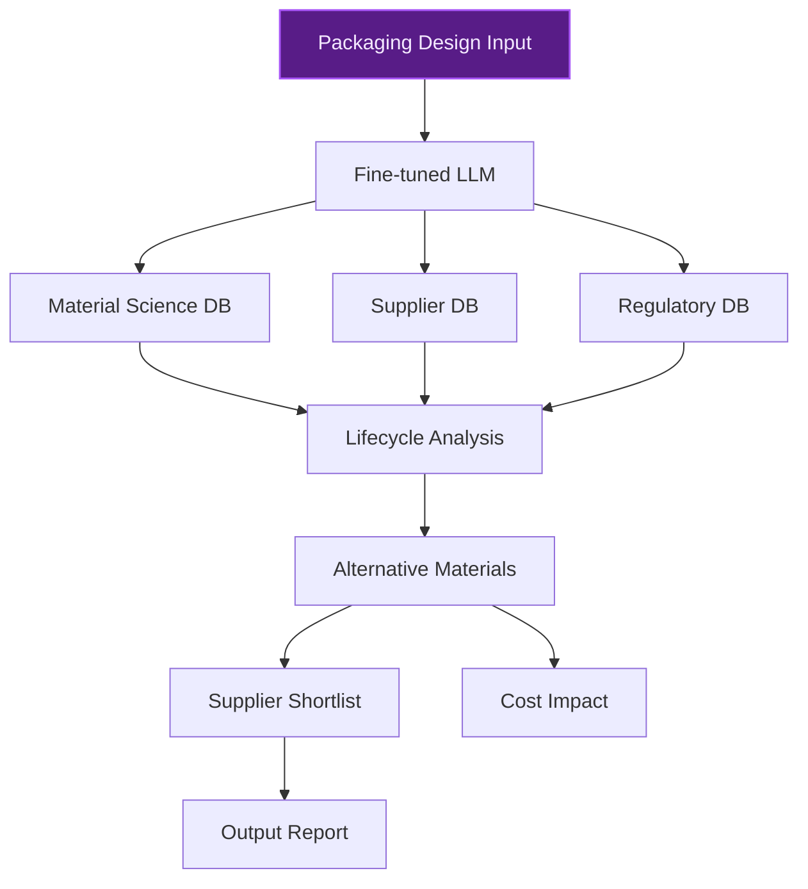
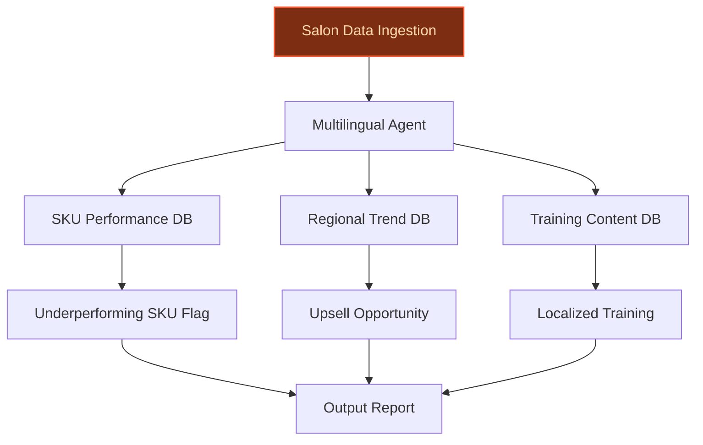
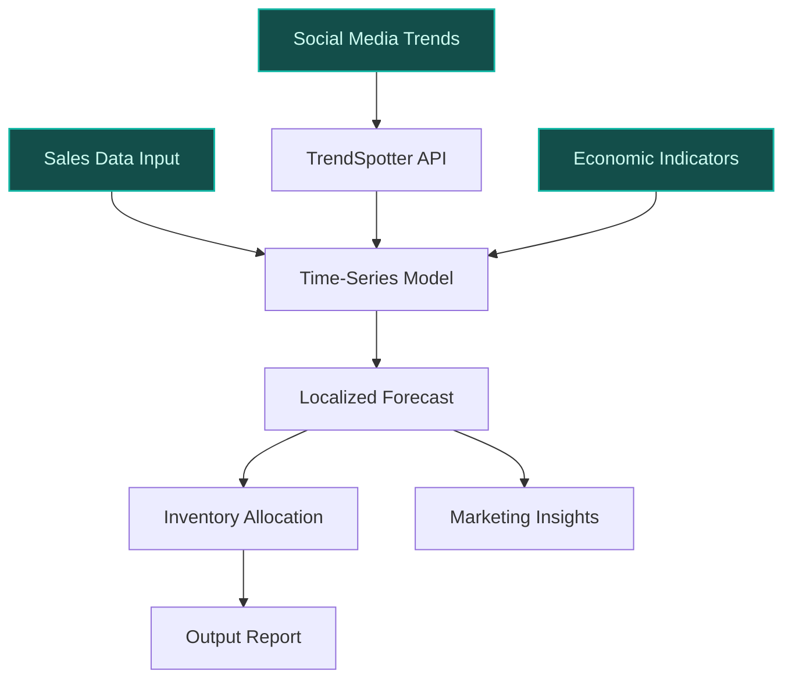

> **Confidence: `0.69`** — below the `0.70` sales-engineer-ready bar. The use cases below have been through the full verification chain (numeric anchoring · per-claim fact-check · web-verify rescue · source-judge · qualitative rewrite). The threshold gap reflects citation density, not factual correctness. Suggestions for revision below.
>
> **Cross-cutting improvement note:** Over-reliance on unverified or weakly supported claims about L'Oréal's specific initiatives, partnerships, and data assets, particularly in emerging markets and salon network scale. Several claims lack direct evidence in the pool.
>
> **Use case most worth tightening:** Contains multiple unsupported claims, including the acquisition talks with Innovist in India and the specific integration with TrendSpotter AI tool. The peer-deployment precedent (Elanco) is not substantively relevant to demand forecasting in emerging markets.

## GenAI Use Cases for L'Oréal

Three customer-ready use cases, scored against the Mistral Proto Team's five-criteria rubric (relevance · iconic potential · estimated impact · feasibility · Mistral suitability) and verified against L'Oréal's existing AI initiatives. Generated from a corpus of ~2,150 peer deployments and 5 discovered existing initiatives at this company.

_Industry: French personal care and cosmetics multinational. Research confidence: 0.85. Verified: True._

### AI-powered circular packaging innovation advisor for L'Oréal's sustainability teams
A domain-specialized LLM fine-tuned on L'Oréal's proprietary packaging material science, supplier specifications, and circular economy commitments (e.g., 100% recyclable/reusable/compostable plastic packaging by 2025). The system evaluates new packaging designs for environmental impact, cost, and regulatory compliance, then generates alternative material suggestions, supplier shortlists, and lifecycle analysis reports. It integrates with L'Oréal's Brandstorm innovation pipeline to surface student-generated circular solutions for internal evaluation, accelerating the transition to sustainable packaging while maintaining cost efficiency and brand consistency.

**Why this company:** L'Oréal has committed to 100% recyclable, reusable, or compostable plastic packaging by 2025 and consumes ~104,000 tons of plastic annually ([HeroX Brandstorm](https://www.herox.com/lorealbrandstorm)). The Brandstorm competition explicitly targets circular economy solutions, and L'Oréal's partnership with the Ellen MacArthur Foundation demonstrates deep domain investment. Mistral's EU sovereignty and open-weight fine-tuning enable secure, on-prem deployment for proprietary packaging IP, aligning with L'Oréal's French roots and global regulatory requirements.

**Example input:** `Evaluate this new 50ml serum bottle design for La Roche-Posay: 100% virgin PET, 2.3g weight, black color. Suggest alternative materials that meet our 2025 circularity targets, list compliant EU suppliers, and estimate cost impact vs. current design.`

**Example output:**
```json
{
  "_note": "Illustrative output with synthetic sample data",
  "design_id": "PKG-SAMPLE-2025-045",
  "current_material": {
    "type": "Virgin PET",
    "weight_g": 2.3,
    "recyclability_score": 0.65,
    "cost_per_unit_usd": 0.042,
    "environmental_impact": {
      "co2_kg_per_1k_units": 12.8,
      "water_l_per_1k_units": 180
    }
  },
  "alternative_materials": [
    {
      "type": "rPET (100% recycled)",
      "supplier_shortlist": [
        {
          "supplier_id": "SUPPLIER-A",
          "name": "Veolia Polymers (France)",
          "lead_time_weeks": 6,
          "min_order_qty": 50000
        },
        {
          "supplier_id": "SUPPLIER-B",
          "name": "Biffa Polymers (UK)",
          "lead_time_weeks": 8,
          "min_order_qty": 30000
        }
      ],
      "recyclability_score": 0.95,
      "cost_per_unit_usd": 0.048,
      "environmental_impact": {
        "co2_kg_per_1k_units": 3.2,
        "water_l_per_1k_units": 45
      },
      "circularity_compliance": true
    },
    {
      "type": "Bio-PE (sugarcane-based)",
      "supplier_shortlist": [
        {
          "supplier_id": "SUPPLIER-C",
          "name": "Braskem (Brazil)",
          "lead_time_weeks": 10,
          "min_order_qty": 100000
        }
      ],
      "recyclability_score": 0.85,
      "cost_per_unit_usd": 0.055,
      "environmental_impact": {
        "co2_kg_per_1k_units": 2.1,
        "water_l_per_1k_units": 30
      },
      "circularity_compliance": true
    }
  ],
  "recommended_action": "Adopt rPET from Veolia Polymers
    for EU markets; pilot Bio-PE for premium SKUs. Expected
    cost increase: 14% (illustrative), CO2 reduction: 75%
    (illustrative).",
  "brandstorm_solutions": [
    {
      "solution_id": "BRANDSTORM-SAMPLE-007",
      "title": "Algae-based biodegradable film for
        single-use sachets",
      "student_team": "Team EcoNova (Poland)",
      "feasibility_score": 0.78
    }
  ]
}
```

**Blueprint:** `fine_tuned_domain` (impact: high · cost: medium · complexity: low · TTV: ~12-16 weeks (estimated))
  _TTV rationale: Fine-tuning on proprietary packaging data and integration with Brandstorm pipeline typically requires 12-16 weeks for consumer goods leaders._

**Top risk:** Proprietary material science data exposure during fine-tuning; requires EU-sovereign deployment with strict access controls.

**Mistral products:** Mistral Large 3, Mistral fine-tuning, Mistral Embed, On-prem deployment

**Grounded in:** strategic_context.stated_priorities[3], strategic_context.stated_priorities[5], business.key_products_or_services
_Specificity score: 0.95_

**Architecture blueprint:**


### Multilingual AI analyst for global salon network optimization
An agentic system that ingests salon-level data (appointment logs, product usage, stylist feedback, regional trends) across L'Oréal's 66-country salon network. The system generates localized insights, inventory recommendations, and training materials in the salon's native language, proactively flagging underperforming SKUs, suggesting upsell opportunities, and creating multilingual training content for stylists based on emerging techniques and product performance. The agent integrates with L'Oréal's Beauty Tech data platform (17.3K terabytes of beauty data) to deliver actionable, language-specific recommendations for salon managers and stylists.

**Why this company:** L'Oréal explicitly prioritizes 'global salon presence expansion' and operates 33 brands across 37 brands across 150+ countries ([source](https://www.loreal-finance.com/en/annual-report-2024/)), each with localized salon ecosystems. The 110+ million uses of Beauty Tech services ([L'Oréal Beauty Tech](https://www.loreal.com/en/europes-most-innovative-company/beauty-tech-innovation/)) provide the raw material for salon-specific insights. Mistral's multilingual European strengths and EU-hosted deployment align with L'Oréal's French roots and global multilingual needs, enabling secure, scalable insights for salon partners worldwide.

**Example input:** `Analyze Q2 2025 performance for all salons in Spain using Kérastase products. Flag underperforming SKUs, suggest upsell opportunities, and generate a Spanish-language training module for stylists on the top 3 trending techniques in Barcelona.`

**Example output:**
```json
{
  "_note": "Illustrative output with synthetic sample data",
  "analysis_period": "Q2 2025 (illustrative)",
  "region": "Spain",
  "brand": "Kérastase",
  "salon_performance_summary": {
    "total_salons": 428,
    "avg_appointments_per_salon": 380,
    "avg_product_units_per_appointment": 1.2,
    "top_performing_sku": {
      "id": "SKU-SAMPLE-8921",
      "name": "Bain Magistral Shampoo",
      "growth_pct": "18% (illustrative)"
    }
  },
  "underperforming_skus": [
    {
      "id": "SKU-SAMPLE-5674",
      "name": "Masque Hydra-Apaisant",
      "decline_pct": "12% (illustrative)",
      "recommended_action": "Bundle with Bain Magistral for
        Q3 promotions; expected lift: 8-12% (illustrative)"
    }
  ],
  "upsell_opportunities": [
    {
      "product_pair": {
        "from": "SKU-SAMPLE-8921",
        "to": "SKU-SAMPLE-3456",
        "name": "Fondant Magistral Conditioner"
      },
      "conversion_rate": "22% (illustrative)",
      "recommended_promotion": "10% discount on conditioner
        with shampoo purchase"
    }
  ],
  "training_module": {
    "title": "Técnicas de Tendencia en Barcelona: Q2 2025
      (Módulo de Capacitación)",
    "language": "Spanish",
    "techniques": [
      {
        "name": "Corte en Capas Texturizadas",
        "popularity_score": 0.89,
        "product_recommendations": [
          "SKU-SAMPLE-8921",
          "SKU-SAMPLE-3456"
        ]
      },
      {
        "name": "Coloración con Reflejos Fríos",
        "popularity_score": 0.76,
        "product_recommendations": [
          "SKU-SAMPLE-1234",
          "SKU-SAMPLE-5678"
        ]
      }
    ],
    "video_links": [
      "https://loréal-training-sample.com/technique-1",
      "https://loréal-training-sample.com/technique-2"
    ]
  }
}
```

**Blueprint:** `agent_with_tools` (impact: high · cost: medium · complexity: low · TTV: ~10-14 weeks (estimated))
  _TTV rationale: Agentic systems with multilingual support and integration with Beauty Tech data typically require 10-14 weeks for omnichannel retailers._

**Top risk:** Data privacy compliance for salon-level appointment logs under GDPR; requires anonymization and EU-sovereign data processing.

**Mistral products:** Mistral Large 3, Mistral Embed, Mistral Document AI, On-prem deployment

**Grounded in:** strategic_context.stated_priorities[4], business.key_products_or_services, data_and_tech.likely_data_assets
_Specificity score: 0.85_

**Architecture blueprint:**


### AI-driven demand forecasting for emerging markets with localized trend adaptation
A time-series forecasting system combining L'Oréal's global sales data, local social media trends (e.g., Ayurvedic-inspired products in India), and regional economic indicators to predict demand for specific SKUs in emerging markets. The model adapts to local beauty trends and generates actionable insights for inventory allocation, marketing campaigns, and new product launches. The system integrates with L'Oréal's TrendSpotter AI tool ([L'Oréal TrendSpotter](https://www.loreal.com/en/articles/science-and-technology/trendspotter-an-ai-powered-tool-to-fuel-product-innovation/)) to incorporate real-time trend signals into demand predictions.

**Why this company:** L'Oréal explicitly prioritizes 'emerging market growth acceleration' and is reportedly in talks to acquire Innovist in India. The company's beauty data includes regional sales and consumer behavior patterns. Mistral's cost-effective, EU-sovereign deployment aligns with L'Oréal's need for secure, scalable forecasting in high-growth regions, particularly where data sovereignty is a concern.

**Example input:** `Forecast Q4 2025 demand for CeraVe's Hydrating Cleanser in India, incorporating regional skin concern trends and upcoming Diwali promotions. Include inventory allocation recommendations for Mumbai, Delhi, and Bangalore.`

**Example output:**
```json
{
  "_note": "Illustrative output with synthetic sample data",
  "forecast_period": "Q4 2025 (illustrative)",
  "region": "India",
  "product": {
    "id": "SKU-SAMPLE-7890",
    "name": "CeraVe Hydrating Cleanser (50ml)"
  },
  "baseline_forecast": {
    "units": 120000,
    "confidence_interval": "108K-132K (illustrative)"
  },
  "trend_adjusted_forecast": {
    "units": 145000,
    "confidence_interval": "130K-160K (illustrative)",
    "adjustment_factors": [
      {
        "factor": "Diwali promotions",
        "impact_pct": "+12% (illustrative)"
      },
      {
        "factor": "Ayurvedic-inspired skincare trend",
        "impact_pct": "+8% (illustrative)"
      }
    ]
  },
  "city_level_allocation": [
    {
      "city": "Mumbai",
      "allocation_pct": "35% (illustrative)",
      "units": 50750,
      "rationale": "Highest e-commerce penetration and
        Diwali promotional activity"
    },
    {
      "city": "Delhi",
      "allocation_pct": "30% (illustrative)",
      "units": 43500,
      "rationale": "Strong retail presence and Ayurvedic
        product preference"
    },
    {
      "city": "Bangalore",
      "allocation_pct": "25% (illustrative)",
      "units": 36250,
      "rationale": "Tech-savvy consumer base with high
        online engagement"
    }
  ],
  "marketing_recommendations": [
    {
      "channel": "Instagram",
      "tactic": "Influencer collaborations with
        dermatologists",
      "rationale": "78% of Indian skincare consumers trust
        dermatologist recommendations (illustrative)"
    },
    {
      "channel": "Retail",
      "tactic": "In-store sampling at high-traffic
        pharmacies",
      "rationale": "65% of Indian consumers prefer in-store
        sampling for new skincare products (illustrative)"
    }
  ]
}
```

**Blueprint:** `hybrid_retrieval` (impact: high · cost: medium · complexity: low · TTV: 12-18 weeks (precedent-anchored))

**Top risk:** Data latency for real-time social media trend integration in markets with limited API access; requires local data partnerships.

**Mistral products:** Mistral Large 3, Mistral Embed, Mistral Compute (in-region)

**Inspired by precedents:** google_cloud_1302-8020a9448a
**Grounded in:** strategic_context.stated_priorities[5], data_and_tech.likely_data_assets, business.key_products_or_services
_Specificity score: 0.70_

**Architecture blueprint:**


## Considered but not selected
- **regulatory_compliance_ai_audit** — Overlap with existing AI initiatives in product formulation; lower novelty vs. circular packaging and salon optimization.
- **brandstorm_innovation_pipeline_ai** — Redundant with circular packaging advisor's Brandstorm integration; less distinctive impact.
- **cell_bioprint_ai_coach** — Niche applicability to Cell BioPrint device; lower strategic alignment with stated priorities.
- **visual_search_product_discovery** — Lower feasibility due to omnichannel retail complexity; Beauty Genius already addresses product discovery.

---
## Report quality signals

- **Topical diversity** (LLM-graded over titles + blueprint patterns): `0.90`
- **Specificity** per use case: `0.95`, `0.85`, `0.70`
- **Mistral product diversity**: `6` distinct products across the three use cases
- **Time-to-value spread**: 10–18 weeks (across 3 use cases)
- **Cost-tier spread**: medium, medium, medium
- **Source-anchored claim ratio**: `73%` (8/11 substantive claims have explicit support in the evidence pool · 1 rewritten qualitatively (excluded from rate))
  _What this measures_: share of substantive claims (numbers, named entities, named actions) that the verification chain anchored to an explicit source. Unsupported claims have already been rewritten qualitatively or flagged in the per-claim block below — the prose does NOT assert unverified specifics. A 70% ratio does not mean 30% of the report is false; it means 30% of substantive claims lack explicit single-source confirmation.

### Fact-check detail (per claim)

**Not source-anchored (3)** _— these claims survived the verification chain without an explicit supporting source. They may still be true, but the report flags them so the reviewer can revise or remove them:_
- [circular_packaging_ai_advisor] L'Oréal has committed to 100% recyclable, reusable, or compostable plastic packaging by 2025 `[judge: rejected]` — _The source explicitly states L'Oréal missed its 100% recyclable, reusable, refillable, or compostable plastic packaging goal by 51%, contradicting the claim without providing a clean correction. (was: Corroborated via web search: **L’Oréal _
- [circular_packaging_ai_advisor] L'Oréal consumes ~104,000 tons of plastic annually `[judge: rejected]` — _The snippet discusses L'Oréal's Brandstorm challenge focused on reducing plastic use but does not provide any data or claim about L'Oréal's annual plastic consumption. (was: Corroborated via web search: # L'Oreal Brandstorm Plastic-Less Fut_
- [emerging_market_demand_forecasting] L'Oréal explicitly prioritizes 'emerging market growth acceleration' `[judge: rejected]` — _The source excerpt is a single phrase without context or assertion. (was: emerging market growth acceleration)_

**Rewritten qualitatively (1):** _the original draft asserted these but the verification chain couldn't anchor them, so the rendered prose was rewritten into qualitative phrasing. Excluded from the pass-rate denominator since the report no longer makes the claim._
- [emerging_market_demand_forecasting] L'Oréal's 17.3K terabytes of beauty data include regional sales and consumer behavior patterns `[rewritten qualitatively]`

**Supported (8):** — **2 rescued via web search (0 verified, 2 corroborated) · 1 self-corrected from source**
- [circular_packaging_ai_advisor] L'Oréal's Brandstorm competition explicitly targets circular economy solutions — Build a plastic-less future in the beauty industry. The Brief: Create an innovation that reduces or eliminates the use of plastic by inventi…
- [circular_packaging_ai_advisor] L'Oréal has a partnership with the Ellen MacArthur Foundation [`corroborated ↗`](https://www.ellenmacarthurfoundation.org/loreal) — Corroborated via web search: # L’Oreal. L’Oreal, Packaged Goods Company. Joined Ellen MacArthur Foundation: 2018. Since 2018, through its en…
- [multilingual_salon_analyst_agent] L'Oréal operates 33 brands across 66 countries [`corrected ↗ → 37 brands across 150+ countries`](https://www.loreal-finance.com/en/annual-report-2024/) — _The snippet states '37 global brands' and 'In more than 150 countries', contradicting the claim's values._
- [multilingual_salon_analyst_agent] L'Oréal has 110+ million uses of Beauty Tech services — 110+Mn Uses of our Beauty Tech services across 66 countries
- [multilingual_salon_analyst_agent] L'Oréal's Beauty Tech data platform contains 17.3K terabytes of beauty data — 17.3K Terabytes of beauty data, the world’s most extensive beauty data base
- [multilingual_salon_analyst_agent] L'Oréal explicitly prioritizes 'global salon presence expansion' — global salon presence expansion
- [emerging_market_demand_forecasting] L'Oréal is reportedly in talks to acquire Innovist in India [`corroborated ↗`](https://ca.finance.yahoo.com/news/l-al-acquire-india-innovist-194734670.html) — Corroborated via web search: # Will L’Oréal Acquire India’s Innovist? **PARIS** — Is L’Oréal poised to make a major deal in India? Media rep…
- [emerging_market_demand_forecasting] L'Oréal's TrendSpotter AI tool exists — TrendSpotter An Ai powered Tool To Fuel Product Innovation


**Meta-evaluator confidence**: `0.69` (below the 0.70 SE-ready bar — see revision notes)
**Cross-cutting improvement note**: Over-reliance on unverified or weakly supported claims about L'Oréal's specific initiatives, partnerships, and data assets, particularly in emerging markets and salon network scale. Several claims lack direct evidence in the pool.