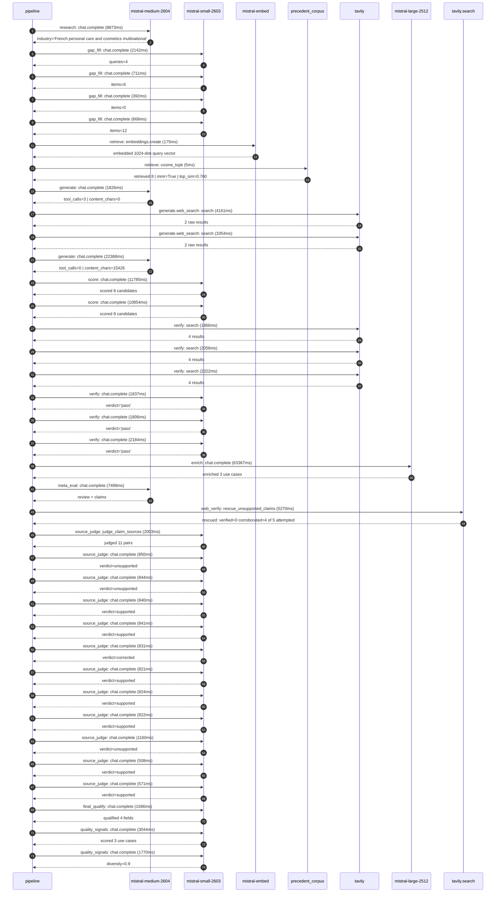

# Trace

## Execution trace — L'Oréal

Started: `2026-05-11T01:42:54.352535+00:00`. Total wall time: `155.8s` across `37` recorded actions.

### Per-step time totals

| Step | Calls | Total time | Avg time |
|---|---:|---:|---:|
| `research` | 1 | 8.87s | 8873ms |
| `gap_fill` | 4 | 3.91s | 978ms |
| `retrieve` | 2 | 0.18s | 90ms |
| `generate` | 2 | 24.19s | 12097ms |
| `generate.web_search` | 2 | 7.51s | 3757ms |
| `score` | 2 | 22.64s | 11320ms |
| `verify` | 6 | 12.17s | 2029ms |
| `enrich` | 1 | 63.37s | 63367ms |
| `meta_eval` | 1 | 7.50s | 7499ms |
| `web_verify` | 1 | 5.27s | 5270ms |
| `source_judge` | 12 | 10.91s | 910ms |
| `final_qualify` | 1 | 1.59s | 1586ms |
| `quality_signals` | 2 | 4.81s | 2407ms |

### Chronological event log

- `01:42:55.257` **[research]** `mistral-medium-2604.chat.complete` — 8873ms
   - inputs: synthesize CompanyContext for L'Oréal | depth=medium
   - outputs: industry='French personal care and cosmetics multinational' verified=True conf=0.75
- `01:43:04.133` **[gap_fill]** `mistral-small-2603.chat.complete` — 2142ms
   - inputs: generate gap queries | fields=['business_model', 'products', 'data_assets', 'priorities']
   - outputs: queries=4
- `01:43:11.531` **[gap_fill]** `mistral-small-2603.chat.complete` — 711ms
   - inputs: layer-2 extract field=priorities
   - outputs: items=6
- `01:43:11.536` **[gap_fill]** `mistral-small-2603.chat.complete` — 392ms
   - inputs: layer-2 extract field=data_assets
   - outputs: items=0
- `01:43:11.539` **[gap_fill]** `mistral-small-2603.chat.complete` — 668ms
   - inputs: layer-2 extract field=products
   - outputs: items=12
- `01:43:12.246` **[retrieve]** `mistral-embed.embeddings.create` — 175ms
   - inputs: company_query | industries='French personal care and cosmetics multinational'
   - outputs: embedded 1024-dim query vector
- `01:43:12.420` **[retrieve]** `precedent_corpus.cosine_topk` — 5ms
   - inputs: k=8 min_depth=0.4 target="L'Oréal"
   - outputs: retrieved 8 | mmr=True | top_sim=0.760
- `01:43:14.249` **[generate]** `mistral-medium-2604.chat.complete` — 1826ms
   - inputs: iteration=0 tool_calls_used=0/2 tools=on
   - outputs: tool_calls=3 | content_chars=0
- `01:43:16.096` **[generate.web_search]** `tavily.search` — 4161ms
   - inputs: query="L'Oréal proprietary skin tone product application dataset Beauty Tech"
   - outputs: 2 raw results
- `01:43:20.734` **[generate.web_search]** `tavily.search` — 3354ms
   - inputs: query="L'Oréal Brandstorm 2026 circular economy Reblooming project details"
   - outputs: 2 raw results
- `01:43:25.631` **[generate]** `mistral-medium-2604.chat.complete` — 22368ms
   - inputs: iteration=1 tool_calls_used=2/2 tools=off
   - outputs: tool_calls=0 | content_chars=15426
- `01:43:48.447` **[score]** `mistral-small-2603.chat.complete` — 11785ms
   - inputs: self-consistency pass T=0.2
   - outputs: scored 8 candidates
- `01:43:48.460` **[score]** `mistral-small-2603.chat.complete` — 10854ms
   - inputs: self-consistency pass T=0.4
   - outputs: scored 8 candidates
- `01:44:00.272` **[verify]** `tavily.search` — 1966ms
   - inputs: candidate=circular_packaging_ai_advisor | query="L'Oréal AI-powered circular packaging innovation advisor for"
   - outputs: 4 results
- `01:44:00.272` **[verify]** `tavily.search` — 2056ms
   - inputs: candidate=multilingual_salon_analyst_agent | query="L'Oréal Multilingual AI analyst for global salon network opt"
   - outputs: 4 results
- `01:44:00.272` **[verify]** `tavily.search` — 2322ms
   - inputs: candidate=emerging_market_demand_forecasting | query="L'Oréal AI-driven demand forecasting for emerging markets wi"
   - outputs: 4 results
- `01:44:02.469` **[verify]** `mistral-small-2603.chat.complete` — 1837ms
   - inputs: verdict for circular_packaging_ai_advisor
   - outputs: verdict='pass'
- `01:44:02.704` **[verify]** `mistral-small-2603.chat.complete` — 1806ms
   - inputs: verdict for multilingual_salon_analyst_agent
   - outputs: verdict='pass'
- `01:44:02.710` **[verify]** `mistral-small-2603.chat.complete` — 2184ms
   - inputs: verdict for emerging_market_demand_forecasting
   - outputs: verdict='pass'
- `01:44:04.898` **[enrich]** `mistral-large-2512.chat.complete` — 63367ms
   - inputs: tier=standard parallel=False ids=['circular_packaging_ai_advisor', 'multilingual_salon_analyst_agent', 'emerging_market_demand_forecasting']
   - outputs: enriched 3 use cases
- `01:45:08.297` **[meta_eval]** `mistral-medium-2604.chat.complete` — 7499ms
   - inputs: reviewing 3 use cases
   - outputs: review + claims
- `01:45:15.820` **[web_verify]** `tavily.search.rescue_unsupported_claims` — 5270ms
   - inputs: company="L'Oréal" unsupported=5 budget=12
   - outputs: rescued: verified=0 corroborated=4 of 5 attempted
- `01:45:21.091` **[source_judge]** `mistral-small-2603.judge_claim_sources` — 2003ms
   - inputs: pairs=11
   - outputs: judged 11 pairs
- `01:45:21.091` **[source_judge]** `mistral-small-2603.chat.complete` — 850ms
   - inputs: claim="L'Oréal has committed to 100% recyclable, reusable, or compo"
   - outputs: verdict=unsupported
- `01:45:21.096` **[source_judge]** `mistral-small-2603.chat.complete` — 844ms
   - inputs: claim="L'Oréal consumes ~104,000 tons of plastic annually"
   - outputs: verdict=unsupported
- `01:45:21.100` **[source_judge]** `mistral-small-2603.chat.complete` — 840ms
   - inputs: claim="L'Oréal's Brandstorm competition explicitly targets circular"
   - outputs: verdict=supported
- `01:45:21.106` **[source_judge]** `mistral-small-2603.chat.complete` — 841ms
   - inputs: claim="L'Oréal has a partnership with the Ellen MacArthur Foundatio"
   - outputs: verdict=supported
- `01:45:21.110` **[source_judge]** `mistral-small-2603.chat.complete` — 831ms
   - inputs: claim="L'Oréal operates 33 brands across 66 countries"
   - outputs: verdict=corrected
- `01:45:21.112` **[source_judge]** `mistral-small-2603.chat.complete` — 821ms
   - inputs: claim="L'Oréal has 110+ million uses of Beauty Tech services"
   - outputs: verdict=supported
- `01:45:21.115` **[source_judge]** `mistral-small-2603.chat.complete` — 824ms
   - inputs: claim="L'Oréal's Beauty Tech data platform contains 17.3K terabytes"
   - outputs: verdict=supported
- `01:45:21.118` **[source_judge]** `mistral-small-2603.chat.complete` — 822ms
   - inputs: claim="L'Oréal explicitly prioritizes 'global salon presence expans"
   - outputs: verdict=supported
- `01:45:21.934` **[source_judge]** `mistral-small-2603.chat.complete` — 1160ms
   - inputs: claim="L'Oréal explicitly prioritizes 'emerging market growth accel"
   - outputs: verdict=unsupported
- `01:45:21.941` **[source_judge]** `mistral-small-2603.chat.complete` — 508ms
   - inputs: claim="L'Oréal is reportedly in talks to acquire Innovist in India"
   - outputs: verdict=supported
- `01:45:21.944` **[source_judge]** `mistral-small-2603.chat.complete` — 571ms
   - inputs: claim="L'Oréal's TrendSpotter AI tool exists"
   - outputs: verdict=supported
- `01:45:23.096` **[final_qualify]** `mistral-small-2603.chat.complete` — 1586ms
   - inputs: use_case=emerging_market_demand_forecasting unsupported=1
   - outputs: qualified 4 fields
- `01:45:25.369` **[quality_signals]** `mistral-small-2603.chat.complete` — 3044ms
   - inputs: specificity grade (3 use cases)
   - outputs: scored 3 use cases
- `01:45:28.413` **[quality_signals]** `mistral-small-2603.chat.complete` — 1770ms
   - inputs: diversity grade
   - outputs: diversity=0.9

## Mermaid sequence

