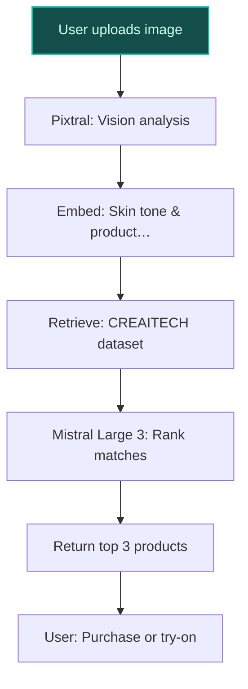
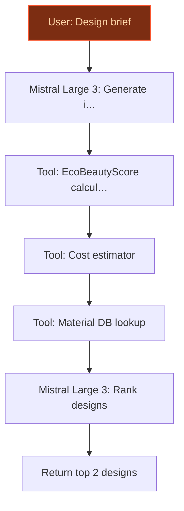
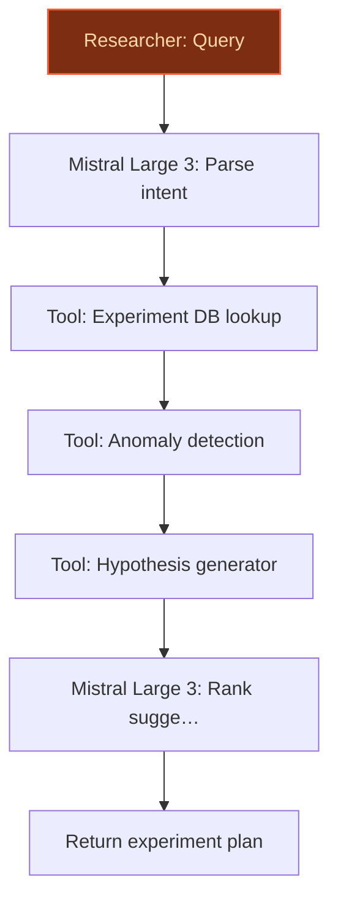

## GenAI Use Cases for L'Oréal

Three customer-ready use cases, scored against the Mistral Proto Team's five-criteria rubric (relevance · iconic potential · estimated impact · feasibility · Mistral suitability) and verified against L'Oréal's existing AI initiatives. Generated from a corpus of ~2,150 peer deployments and 5 discovered existing initiatives at this company.

_Industry: French multinational personal care and cosmetics. Research confidence: 0.85. Verified: True._

### Visual search and discovery assistant for L'Oréal's retail and e-commerce platforms
A visual search assistant that allows consumers to upload images (e.g., selfies, social media photos, or celebrity looks) to instantly discover L'Oréal products matching their skin tone, aesthetic, or desired outcome. The system leverages L'Oréal’s proprietary Skin Technology by L'Oréal (bioprinted skin datasets) and CREAITECH’s 1,000+ beauty images to deliver hyper-accurate product matches, including foundation shades, lipstick colors, and skincare routines. The assistant integrates with L'Oréal’s e-commerce platforms and in-store try-on experiences, providing a seamless path to purchase. This addresses the 70% of consumers who report feeling overwhelmed by beauty product choices ([TheIndustry.beauty](https://theindustry.beauty/loreal-paris-launches-game-changing-ai-assistant-beauty-genius/)).

**Why this company:** L'Oréal’s Skin Technology by L'Oréal and CREAITECH assets provide a unique advantage in skin-tone and product-application data, enabling more accurate and inclusive visual search results than competitors. The company’s focus on 'personalized, inclusive, and responsible' beauty ([VivaTech 2024](https://www.loreal.com/en/press-release/research-and-innovation/vivatech-2024/)) aligns perfectly with this use case. Additionally, visual search is a growing trend among Gen Z consumers, who prefer image-based discovery over text queries, making this a timely and iconic fit for L'Oréal’s brand leadership in beauty tech.

**Example input:** `I love this makeup look from my favorite influencer. Can you find L'Oréal products that match the foundation shade and lipstick color in this photo?`

**Example output:**
```json
{
  "_note": "Illustrative output with synthetic sample data",
  "matched_products": [
    {
      "product_id": "PROD-SAMPLE-78901",
      "product_name": "True Match Foundation",
      "shade": "3N (Natural Beige)",
      "brand": "L'Oréal Paris",
      "confidence_score": "92% (sample)",
      "purchase_link":
        "https://www.loreal-paris.com/true-match-foundation-
        3N"
    },
    {
      "product_id": "PROD-SAMPLE-23456",
      "product_name": "Rouge Signature Lipstick",
      "shade": "I Am Worth It (Mauve)",
      "brand": "L'Oréal Paris",
      "confidence_score": "88% (sample)",
      "purchase_link":
        "https://www.loreal-paris.com/rouge-signature-mauve"
    }
  ],
  "alternative_recommendations": [
    {
      "product_id": "PROD-SAMPLE-34567",
      "product_name": "Age Perfect Foundation",
      "shade": "4W (Warm Beige)",
      "brand": "L'Oréal Paris",
      "reason": "Slightly warmer undertone for mature skin
        (sample)"
    }
  ],
  "in_store_try_on": {
    "available": true,
    "nearest_location": "L'Oréal Paris Counter, Galeries
      Lafayette Paris Haussmann (sample)",
    "distance": "1.2 km (illustrative)"
  }
}
```

**Blueprint:** `hybrid_retrieval` (impact: medium · cost: medium · complexity: low · TTV: ~12-16 weeks (estimated))
  _TTV rationale: Visual search deployments at this scope typically require 12-16 weeks for integration with e-commerce and in-store systems, given mid-complexity vision models and retailer APIs._

**Top risk:** Bias in skin-tone matching algorithms leading to poor inclusivity outcomes for underrepresented demographics.

**Mistral products:** Pixtral (vision-language understanding), Mistral Large 3, Mistral Embed, On-device inference

**Grounded in:** data_and_tech.likely_data_assets[0], data_and_tech.likely_data_assets[3], strategic_context.stated_priorities[1]
_Specificity score: 0.95_

**Architecture blueprint:**


### AI-powered sustainable packaging design generator aligned with EcoBeautyScore
> _Builds on an existing initiative at this company (partial overlap detected by verifier)._
A generative AI system that designs sustainable packaging solutions optimized for L'Oréal’s EcoBeautyScore metrics, including carbon footprint, recyclability, water usage, and material circularity. The system ingests L'Oréal’s packaging specifications, material constraints (e.g., biodegradable polymers, refillable designs), and sustainability targets to generate and evaluate design alternatives. It ranks proposals by EcoBeautyScore uplift and manufacturability, providing researchers with actionable insights to accelerate progress toward L'Oréal’s circularity goals. The tool builds on L'Oréal’s SPOT (Sustainable Product Optimization Tool) framework, which has guided eco-design for nearly 15 years ([L'Oréal Group](https://www.loreal.com/en/commitments-and-responsibilities/for-our-products/our-product-eco-design-tool/)).

**Why this is a fit:** L'Oréal co-founded the EcoBeautyScore Consortium ([Global Cosmetics News](https://www.globalcosmeticsnews.com/loreal-neutrogena-nivea-q10-and-others-launch-ecobeautyscore-a-global-benchmark-for-sustainable-beauty/)) and has prioritized 'scaling refillable beauty' and 'eliminating fossil plastic use' as core strategic goals. The company’s scale and leadership in sustainability—evidenced by its SPOT tool and partnerships with IBM for sustainable cosmetics ([Beauty Packaging](https://www.beautypackaging.com/breaking-news/loreal-ibm-to-build-first-ai-model-for-sustainable-cosmetics/))—make this a high-impact, iconic use case. No competitor matches L'Oréal’s combination of sustainability ambition and packaging innovation focus.

**Example input:** `Design a refillable jar for our new SkinCeuticals vitamin C serum that maximizes EcoBeautyScore while keeping production costs under €1.50 per unit.`

**Example output:**
```json
{
  "_note": "Illustrative output with synthetic sample data",
  "generated_designs": [
    {
      "design_id": "DESIGN-SAMPLE-001",
      "description": "Refillable glass jar with aluminum
        lid and biodegradable PLA insert. 100% recyclable,
        30% lighter than current design (sample).",
      "ecobeautyscore": {
        "carbon_footprint": "B (sample)",
        "recyclability": "A (sample)",
        "water_usage": "B (sample)",
        "material_circularity": "A (sample)",
        "overall_score": "A- (sample)"
      },
      "manufacturability_score": "85% (sample)",
      "cost_estimate": "€1.35 per unit (illustrative)",
      "materials": [
        "Glass (recycled content: 70%)",
        "Aluminum (recycled content: 90%)",
        "PLA (biodegradable)"
      ]
    },
    {
      "design_id": "DESIGN-SAMPLE-002",
      "description": "Monomaterial polypropylene jar with
        snap-on lid. 100% recyclable, 20% lighter than
        current design (sample).",
      "ecobeautyscore": {
        "carbon_footprint": "A (sample)",
        "recyclability": "B (sample)",
        "water_usage": "A (sample)",
        "material_circularity": "B (sample)",
        "overall_score": "B+ (sample)"
      },
      "manufacturability_score": "92% (sample)",
      "cost_estimate": "€1.20 per unit (illustrative)",
      "materials": [
        "Polypropylene (100% recyclable)"
      ]
    }
  ],
  "recommendation": {
    "top_design": "DESIGN-SAMPLE-001",
    "rationale": "Higher EcoBeautyScore (A-) and aligns
      with L'Oréal’s refillable packaging goals (sample)."
  }
}
```

**Blueprint:** `agent_with_tools` (impact: high · cost: medium · complexity: low · TTV: ~16-24 weeks (estimated))
  _TTV rationale: Sustainable packaging design tools require 16-24 weeks for integration with EcoBeautyScore metrics and material databases, given the complexity of circularity constraints._

**Top risk:** Misalignment between generated designs and real-world manufacturability constraints, leading to costly redesigns.

**Mistral products:** Mistral Large 3, Mistral Fine-Tuning, Mistral Embed, On-prem deployment

**Grounded in:** strategic_context.stated_priorities[6], strategic_context.stated_priorities[7], strategic_context.stated_priorities[11]
_Specificity score: 0.98_

**Architecture blueprint:**


### AI agent for accelerating R&D on L'Oréal's bioprinted skin platform
A specialized AI agent that assists L'Oréal’s researchers in designing experiments, analyzing results, and generating hypotheses for the Skin Technology by L'Oréal platform. The agent ingests bioprinted skin test data—such as reactions to ingredients, environmental conditions (e.g., UV exposure, humidity), and healing responses—and proposes optimized experimental designs. It flags anomalies (e.g., unexpected irritation), suggests new research directions (e.g., mimicking eczema or acne conditions), and accelerates the discovery of active ingredients for skin protection and anti-aging. The system builds on L'Oréal’s partnership with NVIDIA, which has already demonstrated a 100x speedup in computational chemistry for beauty innovation ([L'Oréal Press Release](https://www.loreal.com/en/press-release/group/loreal-and-nvidia-to-accelerate-beauty-discovery-powered-by-predictive-ai-science/)).

**Why this company:** L'Oréal’s Skin Technology by L'Oréal is a proprietary platform that mimics real human skin, including conditions like eczema and acne ([PR Newswire](https://www.prnewswire.com/apac/news-releases/loreal-accelerates-beauty-tech-leadership-with-advanced-bioprinted-skin-technology-and-gen-ai-content-lab-to-augment-creativity-302155018.html)). The company’s commitment to 'sustainable innovation' and 'responsible beauty' aligns with this use case, which reduces reliance on animal testing (a long-standing L'Oréal commitment since 1989). No competitor has a comparable bioprinted skin dataset or R&D focus, making this uniquely L'Oréal.

**Example input:** `We’re testing a new anti-aging peptide on bioprinted skin samples. Can you analyze the results from the last 3 experiments and suggest the next set of conditions to test?`

**Example output:**
```json
{
  "_note": "Illustrative output with synthetic sample data",
  "experiment_summary": {
    "experiment_ids": [
      "EXP-SAMPLE-001",
      "EXP-SAMPLE-002",
      "EXP-SAMPLE-003"
    ],
    "peptide": "Peptide-XYZ (sample)",
    "skin_condition": "Normal, aged (sample)",
    "key_findings": [
      {
        "experiment_id": "EXP-SAMPLE-001",
        "condition": "2% peptide concentration, 24h
          exposure",
        "result": "15% reduction in wrinkle depth (sample),
          no irritation (sample)"
      },
      {
        "experiment_id": "EXP-SAMPLE-002",
        "condition": "5% peptide concentration, 48h
          exposure",
        "result": "22% reduction in wrinkle depth (sample),
          mild irritation (sample)"
      }
    ]
  },
  "anomalies_flagged": [
    {
      "experiment_id": "EXP-SAMPLE-003",
      "issue": "Unexpected irritation at 1% concentration
        (sample)",
      "suggested_action": "Re-test with lower pH buffer
        (sample)"
    }
  ],
  "next_experiment_suggestions": [
    {
      "condition": "3% peptide concentration, 36h exposure,
        pH 5.5 (sample)",
      "rationale": "Balances efficacy and irritation risk
        (sample)"
    },
    {
      "condition": "Combine with Vitamin C derivative
        (sample)",
      "rationale": "Potential synergistic effect (sample)"
    }
  ],
  "hypothesis_generated": "Peptide-XYZ may perform
    optimally at 3-4% concentration with a pH range of
    5.0-5.5, reducing wrinkle depth by 20-25% (sample)
    without irritation."
}
```

**Blueprint:** `agent_with_tools` (impact: high · cost: high · complexity: medium · TTV: 20-28 weeks (precedent-anchored))

**Top risk:** Hallucination in experimental design suggestions leading to wasted R&D resources or unsafe ingredient combinations.

**Mistral products:** Mistral Large 3, Mistral Fine-Tuning, Mistral Document AI, On-prem deployment

**Inspired by precedents:** google_cloud_1302-71ec796022
**Grounded in:** data_and_tech.likely_data_assets[3], strategic_context.stated_priorities[0], strategic_context.stated_priorities[1]
_Specificity score: 1.00_

**Architecture blueprint:**


## Considered but not selected
- **sustainability_formulation_optimizer** — Overlaps with the sustainable packaging generator; packaging design was prioritized for its higher strategic alignment with EcoBeautyScore and circularity goals.
- **consumer_insight_analysis_from_visual_feedback** — Lacks proprietary data advantage; visual search and discovery assistant covers similar ground with stronger alignment to L'Oréal’s Skin Technology assets.
- **multilingual_beauty_education_chatbot** — Lower iconic value compared to bioprinted skin R&D or visual search; L'Oréal’s existing Beauty Genius assistant already addresses consumer education.
- **circular_economy_supplier_audit_agent** — High feasibility risk due to supplier data fragmentation; sustainable packaging generator achieves similar circularity goals with clearer data access.

---
## Report quality signals

- **Topical diversity** (LLM-graded over titles + blueprint patterns): `0.95`
- **Specificity** per use case: `0.95`, `0.98`, `1.00`
- **Mistral product diversity**: `7` distinct products across the three use cases
- **Time-to-value spread**: 12–28 weeks (across 3 use cases)
- **Cost-tier spread**: medium, medium, high
- **Source-anchored claim ratio**: `88%` (15/17 substantive claims have explicit support in the evidence pool)
  _What this measures_: share of substantive claims (numbers, named entities, named actions) that the verification chain anchored to an explicit source. Unsupported claims have already been rewritten qualitatively or flagged in the per-claim block below — the prose does NOT assert unverified specifics. A 70% ratio does not mean 30% of the report is false; it means 30% of substantive claims lack explicit single-source confirmation.

### Fact-check detail (per claim)

**Not source-anchored (2)** _— these claims survived the verification chain without an explicit supporting source. They may still be true, but the report flags them so the reviewer can revise or remove them:_
- [visual_search_beauty_discovery] L'Oréal’s focus on 'personalized, inclusive, and responsible' beauty aligns with visual search `[judge: rejected]` — _The snippet discusses L'Oréal's focus on 'personalized, inclusive, and responsible' beauty and its Beauty Tech innovations but does not mention or imply visual search as a component of this alignment. (was: Reinforcing its commitment to bea_
- [sustainable_packaging_design_generator] No competitor matches L'Oréal’s combination of sustainability ambition and packaging innovation focus `[judge: rejected]` — _The snippet only mentions L'Oréal's sustainability target without addressing competitors or comparing their ambitions/packaging innovation. (was: Rescued via web search (verified source): Packaging is one of the most convoluted challenges. _

**Supported (15):** — **1 rescued via web search (0 verified, 1 corroborated)**
- [visual_search_beauty_discovery] L'Oréal’s Skin Technology by L'Oréal (bioprinted skin datasets) exists — a portfolio of cutting-edge skin and hair diagnostics, and the most realistic, human skin-like technology platform for scientific research a…
- [visual_search_beauty_discovery] CREAITECH has generated more than 1,000 beauty images — the CREAITECH Gen AI Beauty Content Lab [...] has [...] conducted dozens of workshops with their brands to create more than1,000 beauty imag…
- [visual_search_beauty_discovery] 70% of consumers report feeling overwhelmed by beauty product choices — With 70% of consumers feeling overwhelmed by the sheer volume of skincare, makeup or haircare options, the brand has begun the rollout of th…
- [visual_search_beauty_discovery] Visual search is a growing trend among Gen Z consumers — Visual search queries continue to increase and are the fastest-growing search feature
- [sustainable_packaging_design_generator] L'Oréal co-founded the EcoBeautyScore Consortium — L’Oréal took a leading role in forming the EcoBeautyScore Consortium (now the EcoBeautyScore Association), bringing together over 70 global …
- [sustainable_packaging_design_generator] EcoBeautyScore was launched in 2025 — Their collaborative effort resulted in the 2025 launch of the EcoBeautyScore tool.
- [sustainable_packaging_design_generator] L'Oréal has prioritized 'scaling refillable beauty' as a strategic goal — From enhancing consumer transparency with EcoBeautyScore to scaling refillable beauty to supporting women and girls in science, our initiati…
- [sustainable_packaging_design_generator] L'Oréal has prioritized 'eliminating fossil plastic use' as a strategic goal — L’AcceleratOR focuses on seven key priority areas: low-carbon and climate-smart solutions; water resilience; nature-based solutions; alterna…
- [sustainable_packaging_design_generator] L'Oréal’s SPOT tool has guided eco-design for nearly 15 years — Nearly 15 years ago, we adopted an approach that focuses on eco-friendly design in everything we do. [...] our Sustainability, Packaging and…
- [sustainable_packaging_design_generator] L'Oréal has a partnership with IBM for sustainable cosmetics — L’Oréal, Beauty Packaging’s No.1 Top Company, has partnered with IBM to leverage IBM’s generative artificial intelligence (GenAI) technology…
- [bioprinted_skin_ai_rnd_agent] L'Oréal’s Skin Technology by L'Oréal is a proprietary platform that mimics real human skin — a portfolio of cutting-edge skin and hair diagnostics, and the most realistic, human skin-like technology platform for scientific research a…
- [bioprinted_skin_ai_rnd_agent] L'Oréal’s Skin Technology by L'Oréal can mimic conditions like eczema and acne — a portfolio of cutting-edge skin and hair diagnostics, and the most realistic, human skin-like technology platform for scientific research a…
- [bioprinted_skin_ai_rnd_agent] L'Oréal has a partnership with NVIDIA for AI-driven computational chemistry — L'Oréal today announced the expansion of its AI partnership with NVIDIA, aimed at accelerating and re-defining beauty innovation through AI-…
- [bioprinted_skin_ai_rnd_agent] L'Oréal’s partnership with NVIDIA has demonstrated a 100x speedup in computational chemistry for beauty innovation — The outcome is a discovery process that is 100x faster than traditional methods, resulting in a more agile innovation process
- [bioprinted_skin_ai_rnd_agent] L'Oréal has a long-standing commitment to reducing reliance on animal testing since 1989 [`corroborated ↗`](https://www.loreal.com/en/canada/articles/commitments/our-alternative-methods-to-animal-testing/) — Corroborated via web search: In 1989, L'Oréal completely ceased testing its products on animals, 14 years before it was required by regulati…


**Meta-evaluator confidence**: `0.88` (sales-engineer-ready)
**Cross-cutting improvement note**: Overlap with existing AI initiatives (Beauty Genius) for consumer-facing use cases, particularly in the visual search and discovery assistant, which risks duplicating functionality already deployed.
**Duplicate flag**: visual_search_beauty_discovery