# Trace

## Execution trace — L'Oréal

Started: `2026-05-11T01:45:30.188211+00:00`. Total wall time: `152.7s` across `42` recorded actions.

### Per-step time totals

| Step | Calls | Total time | Avg time |
|---|---:|---:|---:|
| `research` | 1 | 7.30s | 7305ms |
| `gap_fill` | 4 | 3.63s | 908ms |
| `retrieve` | 2 | 0.25s | 127ms |
| `generate` | 2 | 26.26s | 13132ms |
| `generate.web_search` | 2 | 7.03s | 3514ms |
| `score` | 2 | 24.35s | 12177ms |
| `verify` | 6 | 25.60s | 4266ms |
| `enrich` | 1 | 58.00s | 58002ms |
| `meta_eval` | 1 | 11.27s | 11273ms |
| `web_verify` | 1 | 2.23s | 2232ms |
| `source_judge` | 18 | 13.12s | 729ms |
| `quality_signals` | 2 | 4.06s | 2032ms |

### Chronological event log

- `01:45:31.111` **[research]** `mistral-medium-2604.chat.complete` — 7305ms
   - inputs: synthesize CompanyContext for L'Oréal | depth=medium
   - outputs: industry='French multinational personal care and cosmetics' verified=True conf=0.75
- `01:45:38.417` **[gap_fill]** `mistral-small-2603.chat.complete` — 941ms
   - inputs: generate gap queries | fields=['business_model', 'products', 'data_assets', 'priorities']
   - outputs: queries=4
- `01:45:42.549` **[gap_fill]** `mistral-small-2603.chat.complete` — 1116ms
   - inputs: layer-2 extract field=priorities
   - outputs: items=19
- `01:45:42.554` **[gap_fill]** `mistral-small-2603.chat.complete` — 890ms
   - inputs: layer-2 extract field=data_assets
   - outputs: items=6
- `01:45:42.558` **[gap_fill]** `mistral-small-2603.chat.complete` — 685ms
   - inputs: layer-2 extract field=products
   - outputs: items=12
- `01:45:43.667` **[retrieve]** `mistral-embed.embeddings.create` — 250ms
   - inputs: company_query | industries='French multinational personal care and cosmetics'
   - outputs: embedded 1024-dim query vector
- `01:45:43.917` **[retrieve]** `precedent_corpus.cosine_topk` — 5ms
   - inputs: k=8 min_depth=0.4 target="L'Oréal"
   - outputs: retrieved 8 | mmr=True | top_sim=0.793
- `01:45:45.670` **[generate]** `mistral-medium-2604.chat.complete` — 1738ms
   - inputs: iteration=0 tool_calls_used=0/2 tools=on
   - outputs: tool_calls=4 | content_chars=0
- `01:45:47.429` **[generate.web_search]** `tavily.search` — 3864ms
   - inputs: query="L'Oréal CREAITECH GenAI Beauty Content Lab details 2024 2025"
   - outputs: 2 raw results
- `01:45:52.535` **[generate.web_search]** `tavily.search` — 3164ms
   - inputs: query="L'Oréal EcoBeautyScore methodology and data assets 2025"
   - outputs: 2 raw results
- `01:45:56.088` **[generate]** `mistral-medium-2604.chat.complete` — 24526ms
   - inputs: iteration=1 tool_calls_used=2/2 tools=off
   - outputs: tool_calls=0 | content_chars=16946
- `01:46:20.943` **[score]** `mistral-small-2603.chat.complete` — 11845ms
   - inputs: self-consistency pass T=0.2
   - outputs: scored 8 candidates
- `01:46:20.949` **[score]** `mistral-small-2603.chat.complete` — 12509ms
   - inputs: self-consistency pass T=0.4
   - outputs: scored 8 candidates
- `01:46:33.479` **[verify]** `tavily.search` — 3718ms
   - inputs: candidate=circular_economy_supplier_audit_agent | query="L'Oréal Agentic supplier audit system for circularity and wa"
   - outputs: 4 results
- `01:46:33.479` **[verify]** `tavily.search` — 3166ms
   - inputs: candidate=sustainable_packaging_design_generator | query="L'Oréal AI-powered sustainable packaging design generator al"
   - outputs: 4 results
- `01:46:33.480` **[verify]** `tavily.search` — 3167ms
   - inputs: candidate=bioprinted_skin_ai_rnd_agent | query="L'Oréal AI agent for accelerating R&D on L'Oréal's bioprinte"
   - outputs: 4 results
- `01:46:36.797` **[verify]** `mistral-small-2603.chat.complete` — 5505ms
   - inputs: verdict for bioprinted_skin_ai_rnd_agent
   - outputs: verdict='pass'
- `01:46:37.496` **[verify]** `mistral-small-2603.chat.complete` — 4888ms
   - inputs: verdict for circular_economy_supplier_audit_agent
   - outputs: verdict='pass'
- `01:46:37.809` **[verify]** `mistral-small-2603.chat.complete` — 5155ms
   - inputs: verdict for sustainable_packaging_design_generator
   - outputs: verdict='partial_overlap'
- `01:46:42.969` **[enrich]** `mistral-large-2512.chat.complete` — 58002ms
   - inputs: tier=standard parallel=False ids=['visual_search_beauty_discovery', 'sustainable_packaging_design_generator', 'bioprinted_skin_ai_rnd_agent']
   - outputs: enriched 3 use cases
- `01:47:41.000` **[meta_eval]** `mistral-medium-2604.chat.complete` — 11273ms
   - inputs: reviewing 3 use cases
   - outputs: review + claims
- `01:47:52.290` **[web_verify]** `tavily.search.rescue_unsupported_claims` — 2232ms
   - inputs: company="L'Oréal" unsupported=2 budget=12
   - outputs: rescued: verified=1 corroborated=1 of 2 attempted
- `01:47:54.526` **[source_judge]** `mistral-small-2603.judge_claim_sources` — 1777ms
   - inputs: pairs=17
   - outputs: judged 17 pairs
- `01:47:54.526` **[source_judge]** `mistral-small-2603.chat.complete` — 741ms
   - inputs: claim="L'Oréal’s Skin Technology by L'Oréal (bioprinted skin datase"
   - outputs: verdict=supported
- `01:47:54.532` **[source_judge]** `mistral-small-2603.chat.complete` — 736ms
   - inputs: claim='CREAITECH has generated more than 1,000 beauty images'
   - outputs: verdict=supported
- `01:47:54.540` **[source_judge]** `mistral-small-2603.chat.complete` — 711ms
   - inputs: claim='70% of consumers report feeling overwhelmed by beauty produc'
   - outputs: verdict=supported
- `01:47:54.543` **[source_judge]** `mistral-small-2603.chat.complete` — 845ms
   - inputs: claim="L'Oréal’s focus on 'personalized, inclusive, and responsible"
   - outputs: verdict=unsupported
- `01:47:54.547` **[source_judge]** `mistral-small-2603.chat.complete` — 776ms
   - inputs: claim='Visual search is a growing trend among Gen Z consumers'
   - outputs: verdict=supported
- `01:47:54.550` **[source_judge]** `mistral-small-2603.chat.complete` — 706ms
   - inputs: claim="L'Oréal co-founded the EcoBeautyScore Consortium"
   - outputs: verdict=supported
- `01:47:54.553` **[source_judge]** `mistral-small-2603.chat.complete` — 642ms
   - inputs: claim='EcoBeautyScore was launched in 2025'
   - outputs: verdict=supported
- `01:47:54.557` **[source_judge]** `mistral-small-2603.chat.complete` — 710ms
   - inputs: claim="L'Oréal has prioritized 'scaling refillable beauty' as a str"
   - outputs: verdict=supported
- `01:47:55.195` **[source_judge]** `mistral-small-2603.chat.complete` — 619ms
   - inputs: claim="L'Oréal has prioritized 'eliminating fossil plastic use' as "
   - outputs: verdict=supported
- `01:47:55.251` **[source_judge]** `mistral-small-2603.chat.complete` — 799ms
   - inputs: claim="L'Oréal’s SPOT tool has guided eco-design for nearly 15 year"
   - outputs: verdict=supported
- `01:47:55.257` **[source_judge]** `mistral-small-2603.chat.complete` — 584ms
   - inputs: claim="L'Oréal has a partnership with IBM for sustainable cosmetics"
   - outputs: verdict=supported
- `01:47:55.268` **[source_judge]** `mistral-small-2603.chat.complete` — 596ms
   - inputs: claim="No competitor matches L'Oréal’s combination of sustainabilit"
   - outputs: verdict=unsupported
- `01:47:55.272` **[source_judge]** `mistral-small-2603.chat.complete` — 621ms
   - inputs: claim="L'Oréal’s Skin Technology by L'Oréal is a proprietary platfo"
   - outputs: verdict=supported
- `01:47:55.275` **[source_judge]** `mistral-small-2603.chat.complete` — 617ms
   - inputs: claim="L'Oréal’s Skin Technology by L'Oréal can mimic conditions li"
   - outputs: verdict=supported
- `01:47:55.323` **[source_judge]** `mistral-small-2603.chat.complete` — 608ms
   - inputs: claim="L'Oréal has a partnership with NVIDIA for AI-driven computat"
   - outputs: verdict=supported
- `01:47:55.388` **[source_judge]** `mistral-small-2603.chat.complete` — 543ms
   - inputs: claim="L'Oréal’s partnership with NVIDIA has demonstrated a 100x sp"
   - outputs: verdict=supported
- `01:47:55.814` **[source_judge]** `mistral-small-2603.chat.complete` — 489ms
   - inputs: claim="L'Oréal has a long-standing commitment to reducing reliance "
   - outputs: verdict=supported
- `01:47:58.787` **[quality_signals]** `mistral-small-2603.chat.complete` — 2705ms
   - inputs: specificity grade (3 use cases)
   - outputs: scored 3 use cases
- `01:48:01.492` **[quality_signals]** `mistral-small-2603.chat.complete` — 1360ms
   - inputs: diversity grade
   - outputs: diversity=0.95

## Mermaid sequence

```mermaid
sequenceDiagram
    autonumber
    participant pipeline as pipeline
    participant mistral_medium_2604 as mistral-medium-2604
    participant mistral_small_2603 as mistral-small-2603
    participant mistral_embed as mistral-embed
    participant precedent_corpus as precedent_corpus
    participant tavily as tavily
    participant mistral_large_2512 as mistral-large-2512
    participant tavily_search as tavily.search
    pipeline->>mistral_medium_2604: research: chat.complete (7305ms)
    mistral_medium_2604-->>pipeline: industry='French multinational personal care and cosmetics' 
    pipeline->>mistral_small_2603: gap_fill: chat.complete (941ms)
    mistral_small_2603-->>pipeline: queries=4
    pipeline->>mistral_small_2603: gap_fill: chat.complete (1116ms)
    mistral_small_2603-->>pipeline: items=19
    pipeline->>mistral_small_2603: gap_fill: chat.complete (890ms)
    mistral_small_2603-->>pipeline: items=6
    pipeline->>mistral_small_2603: gap_fill: chat.complete (685ms)
    mistral_small_2603-->>pipeline: items=12
    pipeline->>mistral_embed: retrieve: embeddings.create (250ms)
    mistral_embed-->>pipeline: embedded 1024-dim query vector
    pipeline->>precedent_corpus: retrieve: cosine_topk (5ms)
    precedent_corpus-->>pipeline: retrieved 8 | mmr=True | top_sim=0.793
    pipeline->>mistral_medium_2604: generate: chat.complete (1738ms)
    mistral_medium_2604-->>pipeline: tool_calls=4 | content_chars=0
    pipeline->>tavily: generate.web_search: search (3864ms)
    tavily-->>pipeline: 2 raw results
    pipeline->>tavily: generate.web_search: search (3164ms)
    tavily-->>pipeline: 2 raw results
    pipeline->>mistral_medium_2604: generate: chat.complete (24526ms)
    mistral_medium_2604-->>pipeline: tool_calls=0 | content_chars=16946
    pipeline->>mistral_small_2603: score: chat.complete (11845ms)
    mistral_small_2603-->>pipeline: scored 8 candidates
    pipeline->>mistral_small_2603: score: chat.complete (12509ms)
    mistral_small_2603-->>pipeline: scored 8 candidates
    pipeline->>tavily: verify: search (3718ms)
    tavily-->>pipeline: 4 results
    pipeline->>tavily: verify: search (3166ms)
    tavily-->>pipeline: 4 results
    pipeline->>tavily: verify: search (3167ms)
    tavily-->>pipeline: 4 results
    pipeline->>mistral_small_2603: verify: chat.complete (5505ms)
    mistral_small_2603-->>pipeline: verdict='pass'
    pipeline->>mistral_small_2603: verify: chat.complete (4888ms)
    mistral_small_2603-->>pipeline: verdict='pass'
    pipeline->>mistral_small_2603: verify: chat.complete (5155ms)
    mistral_small_2603-->>pipeline: verdict='partial_overlap'
    pipeline->>mistral_large_2512: enrich: chat.complete (58002ms)
    mistral_large_2512-->>pipeline: enriched 3 use cases
    pipeline->>mistral_medium_2604: meta_eval: chat.complete (11273ms)
    mistral_medium_2604-->>pipeline: review + claims
    pipeline->>tavily_search: web_verify: rescue_unsupported_claims (2232ms)
    tavily_search-->>pipeline: rescued: verified=1 corroborated=1 of 2 attempted
    pipeline->>mistral_small_2603: source_judge: judge_claim_sources (1777ms)
    mistral_small_2603-->>pipeline: judged 17 pairs
    pipeline->>mistral_small_2603: source_judge: chat.complete (741ms)
    mistral_small_2603-->>pipeline: verdict=supported
    pipeline->>mistral_small_2603: source_judge: chat.complete (736ms)
    mistral_small_2603-->>pipeline: verdict=supported
    pipeline->>mistral_small_2603: source_judge: chat.complete (711ms)
    mistral_small_2603-->>pipeline: verdict=supported
    pipeline->>mistral_small_2603: source_judge: chat.complete (845ms)
    mistral_small_2603-->>pipeline: verdict=unsupported
    pipeline->>mistral_small_2603: source_judge: chat.complete (776ms)
    mistral_small_2603-->>pipeline: verdict=supported
    pipeline->>mistral_small_2603: source_judge: chat.complete (706ms)
    mistral_small_2603-->>pipeline: verdict=supported
    pipeline->>mistral_small_2603: source_judge: chat.complete (642ms)
    mistral_small_2603-->>pipeline: verdict=supported
    pipeline->>mistral_small_2603: source_judge: chat.complete (710ms)
    mistral_small_2603-->>pipeline: verdict=supported
    pipeline->>mistral_small_2603: source_judge: chat.complete (619ms)
    mistral_small_2603-->>pipeline: verdict=supported
    pipeline->>mistral_small_2603: source_judge: chat.complete (799ms)
    mistral_small_2603-->>pipeline: verdict=supported
    pipeline->>mistral_small_2603: source_judge: chat.complete (584ms)
    mistral_small_2603-->>pipeline: verdict=supported
    pipeline->>mistral_small_2603: source_judge: chat.complete (596ms)
    mistral_small_2603-->>pipeline: verdict=unsupported
    pipeline->>mistral_small_2603: source_judge: chat.complete (621ms)
    mistral_small_2603-->>pipeline: verdict=supported
    pipeline->>mistral_small_2603: source_judge: chat.complete (617ms)
    mistral_small_2603-->>pipeline: verdict=supported
    pipeline->>mistral_small_2603: source_judge: chat.complete (608ms)
    mistral_small_2603-->>pipeline: verdict=supported
    pipeline->>mistral_small_2603: source_judge: chat.complete (543ms)
    mistral_small_2603-->>pipeline: verdict=supported
    pipeline->>mistral_small_2603: source_judge: chat.complete (489ms)
    mistral_small_2603-->>pipeline: verdict=supported
    pipeline->>mistral_small_2603: quality_signals: chat.complete (2705ms)
    mistral_small_2603-->>pipeline: scored 3 use cases
    pipeline->>mistral_small_2603: quality_signals: chat.complete (1360ms)
    mistral_small_2603-->>pipeline: diversity=0.95
```

