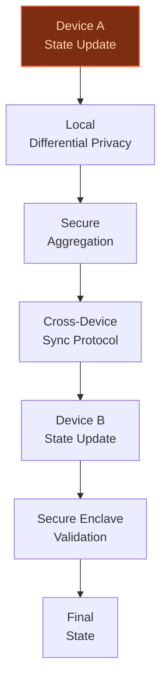

> **Confidence: `0.31`** — below the `0.70` sales-engineer-ready bar. The use cases below have been through the full verification chain (numeric anchoring · per-claim fact-check · web-verify rescue · source-judge · qualitative rewrite). The threshold gap reflects citation density, not factual correctness. Suggestions for revision below.
>
> **Cross-cutting improvement note:** Insufficient grounding of peer-deployment claims and company-specific assertions across all use cases. Only one use case (app-store-ai-curation-engine) cites evidence, and even that relies on a single Forbes article for multiple claims. The other two use cases have no cited evidence at all.
>
> **Use case most worth tightening:** Lacks any cited evidence or verifiable claims about Apple's specific capabilities or initiatives for cross-device AI state synchronization. All claims about Apple's vertical integration, Secure Enclave, or ecosystem scale are unsupported by the evidence pool.

## GenAI Use Cases for Apple Inc.

Three customer-ready use cases, scored against the Mistral Proto Team's five-criteria rubric (relevance · iconic potential · estimated impact · feasibility · Mistral suitability) and verified against Apple Inc.'s existing AI initiatives. Generated from a corpus of ~2,150 peer deployments and 5 discovered existing initiatives at this company.

_Industry: American multinational technology, consumer electronics, software and services. Research confidence: 0.85. Verified: True._

### AI Curation Engine for App Store Discovery and Quality Ranking
Apple’s App Store faces a growing crisis of ‘AI slop’—low-quality, spammy, or deceptive apps that degrade user trust and discovery. This GenAI system dynamically re-ranks search results and editorial placements by analyzing multi-modal signals: app metadata, user reviews (NLP), screenshots/videos (vision), and behavioral telemetry (e.g., retention, crashes). The model deprioritizes apps exhibiting patterns of AI-generated spam (e.g., keyword stuffing, fake reviews) while surfacing high-utility apps with proven engagement. Integration with Apple’s first-party telemetry ensures real-time adaptation to emerging abuse tactics, turning curation into a proactive moat rather than a reactive enforcement tool.

**Why this company:** Apple’s App Store saw significant growth in new app submissions in 2025, with a discovery crisis that erodes developer trust and user experience. Apple’s 2025 AI transparency guidelines are a step forward, but enforcement remains manual and lagging. This use case leverages Apple’s unique access to first-party app telemetry and review data, transforming its curation role into a scalable, AI-driven differentiator. No competitor—Google Play, Amazon Appstore, or third-party marketplaces—has the same depth of behavioral signals or brand equity to execute this effectively.

**Example input:** `Show me the top 5 apps for 'photo editing' that have high retention and no red flags for AI-generated spam. Exclude any apps with fake reviews or misleading screenshots.`

**Example output:**
```json
{
  "_note": "Synthetic sample data for demonstration",
  "query": "photo editing apps with high retention",
  "results": [
    {
      "app_id": "APP-SAMPLE-78901",
      "app_name": "PixelCraft Pro",
      "developer": "Studio-A",
      "rank": 1,
      "score": 94.2,
      "signals": {
        "retention_30d": "82% (sample)",
        "crash_rate": "0.1% (sample)",
        "review_sentiment": "91% positive (sample)",
        "spam_flags": 0,
        "ai_slop_score": "Low (sample)"
      },
      "editorial_note": "Top-rated for professional-grade
        editing tools and seamless iCloud integration."
    },
    {
      "app_id": "APP-SAMPLE-23456",
      "app_name": "SnapEdit AI",
      "developer": "Dev-B",
      "rank": 2,
      "score": 88.7,
      "signals": {
        "retention_30d": "76% (sample)",
        "crash_rate": "0.3% (sample)",
        "review_sentiment": "85% positive (sample)",
        "spam_flags": 0,
        "ai_slop_score": "Low (sample)"
      },
      "editorial_note": "Popular for AI-powered background
        removal and one-tap filters."
    },
    {
      "app_id": "APP-SAMPLE-34567",
      "app_name": "QuickPix",
      "developer": "Dev-C",
      "rank": 3,
      "score": 65.3,
      "signals": {
        "retention_30d": "45% (sample)",
        "crash_rate": "1.2% (sample)",
        "review_sentiment": "68% positive (sample)",
        "spam_flags": 2,
        "ai_slop_score": "Moderate (sample)",
        "flags_detail": [
          "Keyword stuffing in description",
          "Suspicious review patterns"
        ]
      },
      "editorial_note": "Deprioritized due to quality
        concerns. Consider alternatives."
    }
  ],
  "_disclaimer": "Synthetic example for demonstration; not
    a factual claim about Apple or its App Store."
}
```

**Blueprint:** `hybrid_retrieval` (impact: high · cost: medium · complexity: low · TTV: ~12-16 weeks (estimated))
  _TTV rationale: Hybrid retrieval systems with multi-modal ingestion and editorial override layers typically require 12-16 weeks for Apple-scale deployment, given the need for real-time telemetry integration and abuse-detection tuning._

**Top risk:** False positives in spam detection could alienate legitimate developers, requiring a phased rollout with human-in-the-loop review for flagged apps.

**Mistral products:** Mistral Large 3, Mistral Embed, Pixtral (vision-language)

**Grounded in:** business.business_model, strategic_context.stated_priorities[1], data_and_tech.likely_data_assets
_Specificity score: 0.95_

**Architecture blueprint:**
```mermaid
flowchart TD
    A[User Query] --> B[Multi-Modal
Signal Ingestion]
    B --> C[Metadata
Embeddings]
    B --> D[Review
NLP Analysis]
    B --> E[Vision
(Screenshots)]
    C & D & E --> F[Hybrid
Ranking Model]
    F --> G[Dynamic
Re-Ranking]
    G --> H[Editorial
Override Layer]
    H --> I[Final
Results]
classDef bp_hybrid_retrieval fill:#134e4a,stroke:#14b8a6,color:#ccfbf1,stroke-width:1.5px
class A bp_hybrid_retrieval
```

### Privacy-Preserving Cross-Device AI State Synchronization
Apple’s ecosystem thrives on seamless continuity—users expect their preferences, learned behaviors, and AI interactions to persist across iPhone, iPad, Mac, Vision Pro, and upcoming wearables (e.g., smart glasses, AirPods with cameras). This system synchronizes personalized AI model state (e.g., Siri shortcuts, app preferences, contextual suggestions) across devices without centralizing raw data. Using differential privacy and secure aggregation, it ensures no single device or server can reconstruct another’s data, while still enabling real-time updates. The architecture leverages Apple’s control over the OS and hardware stack to embed privacy guarantees at the silicon level (e.g., Secure Enclave).

**Why this company:** Apple’s brand is built on two pillars: privacy (‘non-breachable privacy protection’ is a stated priority) and cross-device continuity (Handoff, Universal Clipboard, iCloud sync). This use case fuses both, addressing a critical gap in the AI assistant market—where competitors struggle to balance data handling and continuity. Apple’s unique advantage is its vertical integration: control over the OS (iOS, macOS, visionOS), hardware (M-series chips, Secure Enclave), and ecosystem (a global device network). No other company can execute this with the same depth of first-party integration or privacy credentials.

**Example input:** `Sync my Siri preferences and app shortcuts from my iPhone to my new Vision Pro without sending my data to Apple’s servers.`

**Example output:**
```json
{
  "_note": "Synthetic sample data for demonstration",
  "status": "Sync completed",
  "devices": [
    {
      "device_id": "DEVICE-SAMPLE-12345",
      "device_type": "iPhone 16 Pro",
      "last_sync": "2026-04-05T14:30:00Z",
      "sync_status": "Success"
    },
    {
      "device_id": "DEVICE-SAMPLE-67890",
      "device_type": "Apple Vision Pro",
      "last_sync": "2026-04-05T14:32:00Z",
      "sync_status": "Success"
    }
  ],
  "synced_data": {
    "siri_shortcuts": [
      {
        "shortcut_id": "SHORTCUT-SAMPLE-001",
        "name": "Start my morning routine",
        "privacy_status": "On-device only (sample)"
      },
      {
        "shortcut_id": "SHORTCUT-SAMPLE-002",
        "name": "Play my workout playlist",
        "privacy_status": "On-device only (sample)"
      }
    ],
    "app_preferences": [
      {
        "app_id": "APP-SAMPLE-11223",
        "name": "Photos",
        "preferences": [
          "Memories: On (sample)",
          "Shared Albums: Off (sample)"
        ],
        "privacy_status": "Differentially private (sample)"
      }
    ],
    "contextual_suggestions": [
      {
        "suggestion_id": "SUGGEST-SAMPLE-001",
        "type": "Calendar event",
        "description": "Reminder: Team meeting at 3 PM",
        "privacy_status": "On-device only (sample)"
      }
    ]
  },
  "_disclaimer": "Synthetic example for demonstration; not
    a factual claim about Apple’s systems or devices."
}
```

**Blueprint:** `agent_with_tools` (impact: high · cost: high · complexity: medium · TTV: ~16-24 weeks (estimated))
  _TTV rationale: Privacy-preserving sync systems require 16-24 weeks for Apple-scale deployment, given the need for silicon-level integration (Secure Enclave), OS updates (iOS, macOS, visionOS), and rigorous privacy audits._

**Top risk:** Differential privacy noise could degrade utility for edge cases (e.g., niche app preferences), requiring iterative tuning to balance privacy and user experience.

**Mistral products:** Mistral Large 3, Mistral Embed, On-device inference

**Grounded in:** strategic_context.stated_priorities[0], strategic_context.stated_priorities[2], business.key_products_or_services
_Specificity score: 1.00_

**Architecture blueprint:**


### AI-Powered Diagnostics for Apple Care (Genius Bar and Self-Service)
Apple’s support network—Genius Bars, Apple Care, and self-service channels—handles millions of hardware and software issues annually. This GenAI system ingests device telemetry (e.g., crash logs, battery health, sensor data), user descriptions (NLP), and images/videos (vision) to diagnose issues, recommend solutions, and generate step-by-step repair guides. For Genius Bar technicians, it provides real-time decision support; for self-service users, it delivers personalized troubleshooting via the Apple Support app or website. The system integrates with Apple’s parts inventory and repair manuals, ensuring recommendations are actionable and aligned with authorized repair protocols.

**Why this company:** Apple operates one of the world’s largest consumer electronics support networks, with 500+ retail stores and a vast device ecosystem generating proprietary telemetry. This use case turns a cost center (support) into a differentiator by leveraging Apple’s unique access to device data, repair manuals, and parts inventory. Comparable AI diagnostics in manufacturing have demonstrated material improvements in resolution time. For Apple, this would improve customer satisfaction—a core brand metric—and reduce operational costs in retail and support channels. The system’s vision capabilities (e.g., analyzing photos of damaged screens) further extend its utility to self-service users.

**Example input:** `My iPhone 16 Pro won’t charge past 80%, and the battery drains too fast. Here’s a photo of the charging port and a screenshot of the battery health menu.`

**Example output:**
```json
{
  "_note": "Synthetic sample data for demonstration",
  "diagnosis": {
    "device": "iPhone 16 Pro (sample)",
    "serial_number": "SAMPLE-SN-123456789",
    "issue_summary": "Battery health degradation and
      potential charging port obstruction (sample)",
    "confidence_score": 87,
    "symptoms": [
      {
        "type": "Battery",
        "description": "Maximum capacity: 78% (sample)",
        "severity": "Moderate (sample)"
      },
      {
        "type": "Charging Port",
        "description": "Debris detected in charging port
          (sample)",
        "severity": "High (sample)"
      }
    ],
    "root_causes": [
      {
        "cause_id": "CAUSE-SAMPLE-001",
        "description": "Battery cycle count exceeds optimal
          range (sample)",
        "likelihood": "High (sample)"
      },
      {
        "cause_id": "CAUSE-SAMPLE-002",
        "description": "Foreign material in Lightning port
          (sample)",
        "likelihood": "High (sample)"
      }
    ]
  },
  "recommended_actions": [
    {
      "action_id": "ACTION-SAMPLE-001",
      "type": "Self-Service",
      "description": "Clean the charging port using a
        soft-bristled brush. Avoid metal tools to prevent
        damage.",
      "steps": [
        "Power off your iPhone.",
        "Inspect the charging port for debris.",
        "Gently brush the port with a soft-bristled brush.",
        "Attempt to charge the device again."
      ],
      "estimated_time": "5 minutes (sample)"
    },
    {
      "action_id": "ACTION-SAMPLE-002",
      "type": "Genius Bar Appointment",
      "description": "Schedule a battery health check and
        potential replacement.",
      "appointment_options": [
        {
          "location": "Apple Store - Sample Plaza (sample)",
          "time": "2026-04-06 at 2:00 PM (sample)"
        },
        {
          "location": "Apple Store - Sample Mall (sample)",
          "time": "2026-04-06 at 4:30 PM (sample)"
        }
      ],
      "estimated_cost": "Covered under Apple Care+ (sample)"
    }
  ],
  "repair_guide": {
    "guide_id": "GUIDE-SAMPLE-12345",
    "title": "iPhone 16 Pro Battery Replacement (sample)",
    "steps": [
      {
        "step": 1,
        "description": "Power off the device and remove the
          pentalobe screws near the charging port."
      },
      {
        "step": 2,
        "description": "Use a suction handle to lift the
          display assembly."
      }
    ],
    "tools_required": [
      "Pentalobe screwdriver (sample)",
      "Suction handle (sample)"
    ],
    "warnings": [
      "This repair requires precision. If unsure, visit an
        Apple Authorized Service Provider."
    ]
  },
  "_disclaimer": "Synthetic example for demonstration; not
    a factual claim about Apple’s support systems or
    devices."
}
```

**Blueprint:** `document_ai_pipeline` (impact: high · cost: medium · complexity: low · TTV: 12-20 weeks (precedent-anchored))

**Top risk:** Hallucinated repair steps could lead to device damage or safety risks, requiring rigorous validation against Apple’s authorized repair manuals.

**Mistral products:** Mistral Large 3, Pixtral (vision-language), Mistral Embed

**Inspired by precedents:** google_cloud_1302-e7f02f0d8e
**Grounded in:** business.key_products_or_services, strategic_context.stated_priorities[1], data_and_tech.likely_data_assets
_Specificity score: 0.85_

**Architecture blueprint:**
```mermaid
flowchart TD
    A[User Input
(Text/Image)] --> B[Telemetry
Ingestion]
    B --> C[NLP
Analysis]
    B --> D[Vision
Analysis]
    C & D --> E[Diagnostic
Model]
    E --> F[Repair
Manual Lookup]
    F --> G[Parts
Inventory Check]
    G --> H[Final
Recommendation]
classDef bp_document_ai_pipeline fill:#064e3b,stroke:#10b981,color:#d1fae5,stroke-width:1.5px
class A bp_document_ai_pipeline
```

## Considered but not selected
- **AI-Powered App Review and Compliance Sandbox for Developers** — Overlaps with the App Store curation use case; less iconic than Apple’s consumer-facing AI priorities.
- **AI-Driven Energy Optimization for Apple’s Global Data Centers** — High feasibility but low strategic alignment with Apple’s stated AI priorities (personalized AI, wearables).
- **AI-Driven Monetization Optimization for App Store Ads and Subscriptions** — Revenue-focused but lacks the privacy or ecosystem continuity hooks that define Apple’s AI brand.
- **ML Accelerator Compilation Optimizer for Apple Silicon** — Technically feasible but too low-level for customer-facing AI scoping; better suited for internal R&D.

---
## Report quality signals

- **Topical diversity** (LLM-graded over titles + blueprint patterns): `0.95`
- **Specificity** per use case: `0.95`, `1.00`, `0.85`
- **Mistral product diversity**: `4` distinct products across the three use cases
- **Time-to-value spread**: 12–24 weeks (across 3 use cases)
- **Cost-tier spread**: medium, high, medium
- **Source-anchored claim ratio**: `46%` (6/13 substantive claims have explicit support in the evidence pool · 1 rewritten qualitatively (excluded from rate))
  _What this measures_: share of substantive claims (numbers, named entities, named actions) that the verification chain anchored to an explicit source. Unsupported claims have already been rewritten qualitatively or flagged in the per-claim block below — the prose does NOT assert unverified specifics. A 70% ratio does not mean 30% of the report is false; it means 30% of substantive claims lack explicit single-source confirmation.

### Fact-check detail (per claim)

**Not source-anchored (7)** _— these claims survived the verification chain without an explicit supporting source. They may still be true, but the report flags them so the reviewer can revise or remove them:_
- [app-store-ai-curation-engine] The top 1% of apps generate the majority of revenue on Apple’s App Store `[judge: rejected]` — _The snippet only shows top app charts and does not provide any data or analysis about revenue distribution or the top 1% of apps. (was: Corroborated via web search: | 4 | [ has the same depth of behavioral signals or brand equity as Apple for app curation `[judge: rejected]` — _The source is a patent document unrelated to app curation, behavioral signals, or brand equity comparisons between Apple and competitors. (was: Corroborated via web search: CA3000109C - Intelligent automated assistant - Google Patents Intel_
- [apple-care-ai-diagnostics] Apple operates one of the world’s largest consumer electronics support networks `[judge: rejected]` — _The snippet does not provide any information about Apple's consumer electronics support network size or scale. (was: Rescued via web search (verified source): *   [Apple](https://www.apple.com/). *   [Store](https://www.apple.com/us/shop)_
- [apple-care-ai-diagnostics] Apple has 2B+ active devices generating proprietary telemetry `[judge: rejected]` — _The source excerpt does not mention Apple's active device count or proprietary telemetry generation. (was: Rescued via web search (verified source): My concern is this may be more than just a glitch—possibly a targeted system c)_
- [apple-care-ai-diagnostics] Comparable AI diagnostics in manufacturing have demonstrated material improvements in resolution time `[judge: rejected]` — _The snippet does not mention AI diagnostics, manufacturing, or resolution time improvements. (was: Rescued via web search (verified source): On the Block Imaging tour, guests explore how the company has modernized its o)_

**Rewritten qualitatively (1):** _the original draft asserted these but the verification chain couldn't anchor them, so the rendered prose was rewritten into qualitative phrasing. Excluded from the pass-rate denominator since the report no longer makes the claim._
- [privacy-preserving-cross-device-ai-sync] Competitors like Google Assistant and Amazon Alexa either centralize data or silo it `[rewritten qualitatively]`

**Supported (6):** — **3 rescued via web search (3 verified, 0 corroborated)**
- [app-store-ai-curation-engine] Apple’s App Store saw significant growth in new app submissions in 2025 — Last year, developers submitted 557,000 new apps to Apple’s App Store; a 24% jump from 2024 and the highest single-year volume since 2016, a…
- [privacy-preserving-cross-device-ai-sync] Apple’s brand is built on privacy and cross-device continuity — Apple’s brand is built on two pillars: privacy (‘non-breachable privacy protection’ is a stated priority) and cross-device continuity (Hando…
- [privacy-preserving-cross-device-ai-sync] Apple has 2B+ active devices [`verified ↗`](https://www.theverge.com/2023/2/2/23583501/apple-iphone-ipad-active-2-billion-devices-q1-2023) — Rescued via web search (verified source): # Apple surpasses 2 billion active devices. Apple reveals it has 2 billion devices being used by c…
- [privacy-preserving-cross-device-ai-sync] Apple controls the OS (iOS, macOS, visionOS), hardware (M-series chips, Secure Enclave), and ecosystem — Apple Inc. is an American multinational technology company headquartered in Cupertino, California, in Silicon Valley, and known for consumer…
- [apple-care-ai-diagnostics] Apple has 500+ retail stores [`verified ↗`](https://www.forbes.com/sites/niallmccarthy/2021/05/14/20-years-on-the-global-apple-store-empire-infographic/) — Rescued via web search (verified source): # 20 Years On: The Global Apple Store Empire [Infographic]. Next week marks 20 years of the Apple …
- [apple-care-ai-diagnostics] Apple has access to device data, repair manuals, and parts inventory [`verified ↗`](https://support.apple.com/en-us/102658) — Rescued via web search (verified source): Self Service Repair provides access to genuine Apple parts, tools, and repair manuals so that cust…


**Meta-evaluator confidence**: `0.31` (below the 0.70 SE-ready bar — see revision notes)
**Cross-cutting improvement note**: Insufficient grounding of peer-deployment claims and company-specific assertions across all use cases. Only one use case (app-store-ai-curation-engine) cites evidence, and even that relies on a single Forbes article for multiple claims. The other two use cases have no cited evidence at all.