# Trace

## Execution trace — Apple

Started: `2026-05-11T02:44:56.272123+00:00`. Total wall time: `213.1s` across `46` recorded actions.

### Per-step time totals

| Step | Calls | Total time | Avg time |
|---|---:|---:|---:|
| `resolve_entity` | 1 | 0.98s | 985ms |
| `research` | 1 | 11.51s | 11512ms |
| `gap_fill` | 4 | 3.43s | 857ms |
| `retrieve` | 2 | 0.21s | 106ms |
| `generate` | 2 | 25.54s | 12771ms |
| `generate.web_search` | 4 | 11.23s | 2809ms |
| `score` | 2 | 24.32s | 12159ms |
| `verify` | 6 | 11.91s | 1985ms |
| `enrich` | 1 | 65.17s | 65174ms |
| `critique_revise` | 1 | 18.19s | 18193ms |
| `meta_eval` | 1 | 12.11s | 12114ms |
| `web_verify` | 1 | 19.43s | 19430ms |
| `source_judge` | 15 | 21.67s | 1444ms |
| `final_qualify` | 3 | 5.52s | 1840ms |
| `quality_signals` | 2 | 4.75s | 2374ms |

### Chronological event log

- `02:44:57.747` **[resolve_entity]** `mistral-small-2603.chat.complete` — 985ms
   - inputs: user_input='Apple'
   - outputs: resolved=True → 'Apple Inc.'
- `02:45:00.712` **[research]** `mistral-medium-2604.chat.complete` — 11512ms
   - inputs: synthesize CompanyContext for Apple Inc. | depth=medium
   - outputs: industry='American multinational technology, consumer electronics, software and services' verified=True conf=0.75
- `02:45:12.226` **[gap_fill]** `mistral-small-2603.chat.complete` — 878ms
   - inputs: generate gap queries | fields=['business_model', 'products', 'data_assets', 'priorities']
   - outputs: queries=4
- `02:45:18.327` **[gap_fill]** `mistral-small-2603.chat.complete` — 622ms
   - inputs: layer-2 extract field=priorities
   - outputs: items=7
- `02:45:18.331` **[gap_fill]** `mistral-small-2603.chat.complete` — 1047ms
   - inputs: layer-2 extract field=data_assets
   - outputs: items=6
- `02:45:18.334` **[gap_fill]** `mistral-small-2603.chat.complete` — 883ms
   - inputs: layer-2 extract field=products
   - outputs: items=13
- `02:45:19.380` **[retrieve]** `mistral-embed.embeddings.create` — 207ms
   - inputs: company_query | industries='American multinational technology, consumer electronics, software and services'
   - outputs: embedded 1024-dim query vector
- `02:45:19.587` **[retrieve]** `precedent_corpus.cosine_topk` — 5ms
   - inputs: k=8 min_depth=0.4 target='Apple Inc.'
   - outputs: retrieved 8 | mmr=True | top_sim=0.798
- `02:45:21.382` **[generate]** `mistral-medium-2604.chat.complete` — 1887ms
   - inputs: iteration=0 tool_calls_used=0/6 tools=on
   - outputs: tool_calls=4 | content_chars=0
- `02:45:23.287` **[generate.web_search]** `tavily.search` — 2987ms
   - inputs: query='Apple 2026 AI smart glasses Siri camera features'
   - outputs: 2 raw results
- `02:45:27.306` **[generate.web_search]** `tavily.search` — 2155ms
   - inputs: query='Apple data center energy consumption 2025 sustainability report'
   - outputs: 2 raw results
- `02:45:33.771` **[generate.web_search]** `tavily.search` — 3942ms
   - inputs: query='Apple App Store review moderation AI 2025'
   - outputs: 2 raw results
- `02:45:39.315` **[generate.web_search]** `tavily.search` — 2150ms
   - inputs: query='Apple developer ecosystem AI tools 2026'
   - outputs: 2 raw results
- `02:45:42.372` **[generate]** `mistral-medium-2604.chat.complete` — 23654ms
   - inputs: iteration=1 tool_calls_used=4/6 tools=on
   - outputs: tool_calls=0 | content_chars=14815
- `02:46:06.306` **[score]** `mistral-small-2603.chat.complete` — 11485ms
   - inputs: self-consistency pass T=0.2
   - outputs: scored 8 candidates
- `02:46:06.310` **[score]** `mistral-small-2603.chat.complete` — 12832ms
   - inputs: self-consistency pass T=0.4
   - outputs: scored 8 candidates
- `02:46:19.174` **[verify]** `tavily.search` — 2603ms
   - inputs: candidate=app-store-ai-curation-engine | query='Apple Inc. AI Curation Engine for App Store Discovery and Qu'
   - outputs: 4 results
- `02:46:19.175` **[verify]** `tavily.search` — 2401ms
   - inputs: candidate=privacy-preserving-cross-device-ai-sync | query='Apple Inc. Privacy-Preserving Cross-Device AI State Synchron'
   - outputs: 4 results
- `02:46:19.175` **[verify]** `tavily.search` — 1898ms
   - inputs: candidate=apple-care-ai-diagnostics | query='Apple Inc. AI-Powered Diagnostics for Apple Care (Genius Bar'
   - outputs: 4 results
- `02:46:21.770` **[verify]** `mistral-small-2603.chat.complete` — 1757ms
   - inputs: verdict for apple-care-ai-diagnostics
   - outputs: verdict='pass'
- `02:46:22.068` **[verify]** `mistral-small-2603.chat.complete` — 1631ms
   - inputs: verdict for app-store-ai-curation-engine
   - outputs: verdict='pass'
- `02:46:22.486` **[verify]** `mistral-small-2603.chat.complete` — 1618ms
   - inputs: verdict for privacy-preserving-cross-device-ai-sync
   - outputs: verdict='pass'
- `02:46:24.109` **[enrich]** `mistral-large-2512.chat.complete` — 65174ms
   - inputs: tier=max parallel=False ids=['app-store-ai-curation-engine', 'privacy-preserving-cross-device-ai-sync', 'apple-care-ai-diagnostics']
   - outputs: enriched 3 use cases
- `02:47:29.285` **[critique_revise]** `mistral-large-2512.chat.complete` — 18193ms
   - inputs: critiquing 3 use cases (max tier)
   - outputs: received 3 revisions
- `02:47:47.532` **[meta_eval]** `mistral-medium-2604.chat.complete` — 12114ms
   - inputs: reviewing 3 use cases
   - outputs: review + claims
- `02:47:59.665` **[web_verify]** `tavily.search.rescue_unsupported_claims` — 19430ms
   - inputs: company='Apple Inc.' unsupported=10 budget=18
   - outputs: rescued: verified=8 corroborated=2 of 10 attempted
- `02:48:19.096` **[source_judge]** `mistral-small-2603.judge_claim_sources` — 3273ms
   - inputs: pairs=14
   - outputs: judged 14 pairs
- `02:48:19.096` **[source_judge]** `mistral-small-2603.chat.complete` — 3093ms
   - inputs: claim='Apple’s App Store saw significant growth in new app submissi'
   - outputs: verdict=supported
- `02:48:19.099` **[source_judge]** `mistral-small-2603.chat.complete` — 1879ms
   - inputs: claim='The top 1% of apps generate the majority of revenue on Apple'
   - outputs: verdict=unsupported
- `02:48:19.101` **[source_judge]** `mistral-small-2603.chat.complete` — 968ms
   - inputs: claim='Apple’s 2025 AI transparency guidelines exist'
   - outputs: verdict=unsupported
- `02:48:19.106` **[source_judge]** `mistral-small-2603.chat.complete` — 1862ms
   - inputs: claim='Apple has unique access to first-party app telemetry and rev'
   - outputs: verdict=unsupported
- `02:48:19.109` **[source_judge]** `mistral-small-2603.chat.complete` — 909ms
   - inputs: claim='No competitor (Google Play, Amazon Appstore, or third-party '
   - outputs: verdict=unsupported
- `02:48:19.111` **[source_judge]** `mistral-small-2603.chat.complete` — 2147ms
   - inputs: claim='Apple’s brand is built on privacy and cross-device continuit'
   - outputs: verdict=supported
- `02:48:19.113` **[source_judge]** `mistral-small-2603.chat.complete` — 897ms
   - inputs: claim='Apple has 2B+ active devices'
   - outputs: verdict=supported
- `02:48:19.115` **[source_judge]** `mistral-small-2603.chat.complete` — 983ms
   - inputs: claim='Apple controls the OS (iOS, macOS, visionOS), hardware (M-se'
   - outputs: verdict=supported
- `02:48:20.010` **[source_judge]** `mistral-small-2603.chat.complete` — 959ms
   - inputs: claim='Competitors like Google Assistant and Amazon Alexa either ce'
   - outputs: verdict=unsupported
- `02:48:20.017` **[source_judge]** `mistral-small-2603.chat.complete` — 952ms
   - inputs: claim='Apple operates one of the world’s largest consumer electroni'
   - outputs: verdict=unsupported
- `02:48:20.069` **[source_judge]** `mistral-small-2603.chat.complete` — 529ms
   - inputs: claim='Apple has 500+ retail stores'
   - outputs: verdict=supported
- `02:48:20.098` **[source_judge]** `mistral-small-2603.chat.complete` — 513ms
   - inputs: claim='Apple has 2B+ active devices generating proprietary telemetr'
   - outputs: verdict=unsupported
- `02:48:20.598` **[source_judge]** `mistral-small-2603.chat.complete` — 1771ms
   - inputs: claim='Apple has access to device data, repair manuals, and parts i'
   - outputs: verdict=supported
- `02:48:20.611` **[source_judge]** `mistral-small-2603.chat.complete` — 931ms
   - inputs: claim='Comparable AI diagnostics in manufacturing have demonstrated'
   - outputs: verdict=unsupported
- `02:48:22.371` **[final_qualify]** `mistral-small-2603.chat.complete` — 1844ms
   - inputs: use_case=app-store-ai-curation-engine unsupported=2
   - outputs: qualified 4 fields
- `02:48:22.376` **[final_qualify]** `mistral-small-2603.chat.complete` — 1840ms
   - inputs: use_case=privacy-preserving-cross-device-ai-sync unsupported=1
   - outputs: qualified 4 fields
- `02:48:22.379` **[final_qualify]** `mistral-small-2603.chat.complete` — 1835ms
   - inputs: use_case=apple-care-ai-diagnostics unsupported=1
   - outputs: qualified 4 fields
- `02:48:24.611` **[quality_signals]** `mistral-small-2603.chat.complete` — 3438ms
   - inputs: specificity grade (3 use cases)
   - outputs: scored 3 use cases
- `02:48:28.049` **[quality_signals]** `mistral-small-2603.chat.complete` — 1310ms
   - inputs: diversity grade
   - outputs: diversity=0.95

## Mermaid sequence

```mermaid
sequenceDiagram
    autonumber
    participant pipeline as pipeline
    participant mistral_small_2603 as mistral-small-2603
    participant mistral_medium_2604 as mistral-medium-2604
    participant mistral_embed as mistral-embed
    participant precedent_corpus as precedent_corpus
    participant tavily as tavily
    participant mistral_large_2512 as mistral-large-2512
    participant tavily_search as tavily.search
    pipeline->>mistral_small_2603: resolve_entity: chat.complete (985ms)
    mistral_small_2603-->>pipeline: resolved=True → 'Apple Inc.'
    pipeline->>mistral_medium_2604: research: chat.complete (11512ms)
    mistral_medium_2604-->>pipeline: industry='American multinational technology, consumer electr
    pipeline->>mistral_small_2603: gap_fill: chat.complete (878ms)
    mistral_small_2603-->>pipeline: queries=4
    pipeline->>mistral_small_2603: gap_fill: chat.complete (622ms)
    mistral_small_2603-->>pipeline: items=7
    pipeline->>mistral_small_2603: gap_fill: chat.complete (1047ms)
    mistral_small_2603-->>pipeline: items=6
    pipeline->>mistral_small_2603: gap_fill: chat.complete (883ms)
    mistral_small_2603-->>pipeline: items=13
    pipeline->>mistral_embed: retrieve: embeddings.create (207ms)
    mistral_embed-->>pipeline: embedded 1024-dim query vector
    pipeline->>precedent_corpus: retrieve: cosine_topk (5ms)
    precedent_corpus-->>pipeline: retrieved 8 | mmr=True | top_sim=0.798
    pipeline->>mistral_medium_2604: generate: chat.complete (1887ms)
    mistral_medium_2604-->>pipeline: tool_calls=4 | content_chars=0
    pipeline->>tavily: generate.web_search: search (2987ms)
    tavily-->>pipeline: 2 raw results
    pipeline->>tavily: generate.web_search: search (2155ms)
    tavily-->>pipeline: 2 raw results
    pipeline->>tavily: generate.web_search: search (3942ms)
    tavily-->>pipeline: 2 raw results
    pipeline->>tavily: generate.web_search: search (2150ms)
    tavily-->>pipeline: 2 raw results
    pipeline->>mistral_medium_2604: generate: chat.complete (23654ms)
    mistral_medium_2604-->>pipeline: tool_calls=0 | content_chars=14815
    pipeline->>mistral_small_2603: score: chat.complete (11485ms)
    mistral_small_2603-->>pipeline: scored 8 candidates
    pipeline->>mistral_small_2603: score: chat.complete (12832ms)
    mistral_small_2603-->>pipeline: scored 8 candidates
    pipeline->>tavily: verify: search (2603ms)
    tavily-->>pipeline: 4 results
    pipeline->>tavily: verify: search (2401ms)
    tavily-->>pipeline: 4 results
    pipeline->>tavily: verify: search (1898ms)
    tavily-->>pipeline: 4 results
    pipeline->>mistral_small_2603: verify: chat.complete (1757ms)
    mistral_small_2603-->>pipeline: verdict='pass'
    pipeline->>mistral_small_2603: verify: chat.complete (1631ms)
    mistral_small_2603-->>pipeline: verdict='pass'
    pipeline->>mistral_small_2603: verify: chat.complete (1618ms)
    mistral_small_2603-->>pipeline: verdict='pass'
    pipeline->>mistral_large_2512: enrich: chat.complete (65174ms)
    mistral_large_2512-->>pipeline: enriched 3 use cases
    pipeline->>mistral_large_2512: critique_revise: chat.complete (18193ms)
    mistral_large_2512-->>pipeline: received 3 revisions
    pipeline->>mistral_medium_2604: meta_eval: chat.complete (12114ms)
    mistral_medium_2604-->>pipeline: review + claims
    pipeline->>tavily_search: web_verify: rescue_unsupported_claims (19430ms)
    tavily_search-->>pipeline: rescued: verified=8 corroborated=2 of 10 attempted
    pipeline->>mistral_small_2603: source_judge: judge_claim_sources (3273ms)
    mistral_small_2603-->>pipeline: judged 14 pairs
    pipeline->>mistral_small_2603: source_judge: chat.complete (3093ms)
    mistral_small_2603-->>pipeline: verdict=supported
    pipeline->>mistral_small_2603: source_judge: chat.complete (1879ms)
    mistral_small_2603-->>pipeline: verdict=unsupported
    pipeline->>mistral_small_2603: source_judge: chat.complete (968ms)
    mistral_small_2603-->>pipeline: verdict=unsupported
    pipeline->>mistral_small_2603: source_judge: chat.complete (1862ms)
    mistral_small_2603-->>pipeline: verdict=unsupported
    pipeline->>mistral_small_2603: source_judge: chat.complete (909ms)
    mistral_small_2603-->>pipeline: verdict=unsupported
    pipeline->>mistral_small_2603: source_judge: chat.complete (2147ms)
    mistral_small_2603-->>pipeline: verdict=supported
    pipeline->>mistral_small_2603: source_judge: chat.complete (897ms)
    mistral_small_2603-->>pipeline: verdict=supported
    pipeline->>mistral_small_2603: source_judge: chat.complete (983ms)
    mistral_small_2603-->>pipeline: verdict=supported
    pipeline->>mistral_small_2603: source_judge: chat.complete (959ms)
    mistral_small_2603-->>pipeline: verdict=unsupported
    pipeline->>mistral_small_2603: source_judge: chat.complete (952ms)
    mistral_small_2603-->>pipeline: verdict=unsupported
    pipeline->>mistral_small_2603: source_judge: chat.complete (529ms)
    mistral_small_2603-->>pipeline: verdict=supported
    pipeline->>mistral_small_2603: source_judge: chat.complete (513ms)
    mistral_small_2603-->>pipeline: verdict=unsupported
    pipeline->>mistral_small_2603: source_judge: chat.complete (1771ms)
    mistral_small_2603-->>pipeline: verdict=supported
    pipeline->>mistral_small_2603: source_judge: chat.complete (931ms)
    mistral_small_2603-->>pipeline: verdict=unsupported
    pipeline->>mistral_small_2603: final_qualify: chat.complete (1844ms)
    mistral_small_2603-->>pipeline: qualified 4 fields
    pipeline->>mistral_small_2603: final_qualify: chat.complete (1840ms)
    mistral_small_2603-->>pipeline: qualified 4 fields
    pipeline->>mistral_small_2603: final_qualify: chat.complete (1835ms)
    mistral_small_2603-->>pipeline: qualified 4 fields
    pipeline->>mistral_small_2603: quality_signals: chat.complete (3438ms)
    mistral_small_2603-->>pipeline: scored 3 use cases
    pipeline->>mistral_small_2603: quality_signals: chat.complete (1310ms)
    mistral_small_2603-->>pipeline: diversity=0.95
```

