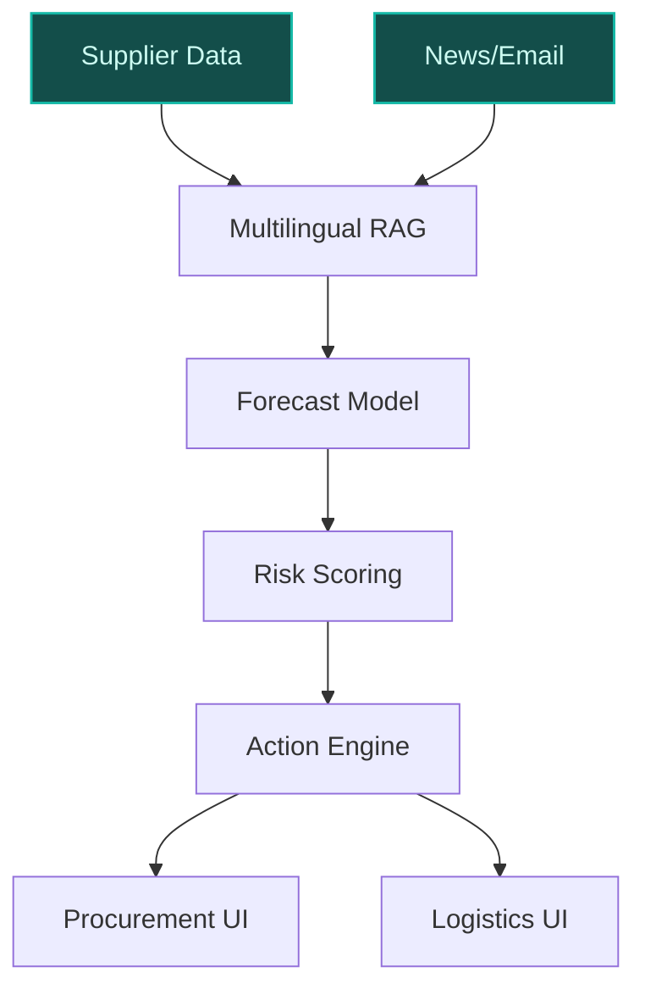
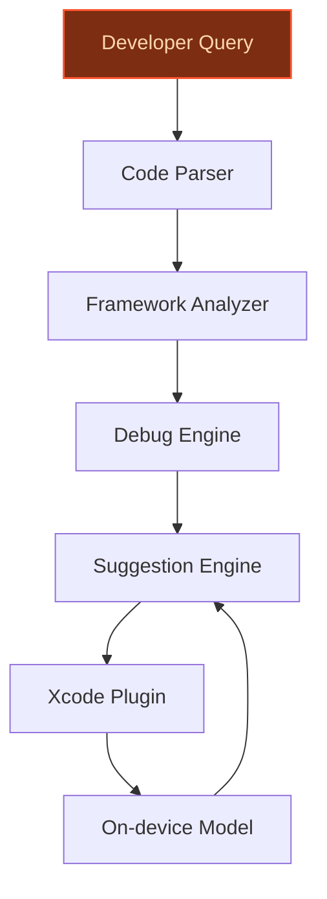
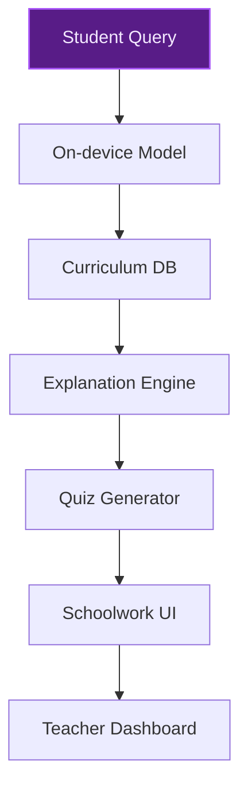

> **Confidence: `0.35`** — below the `0.70` sales-engineer-ready bar. The use cases below have been through the full verification chain (numeric anchoring · per-claim fact-check · web-verify rescue · source-judge · qualitative rewrite). The threshold gap reflects citation density, not factual correctness. Suggestions for revision below.
>
> **Cross-cutting improvement note:** Multiple unsupported quantitative claims (e.g., revenue, supplier count, developer ecosystem size) and weak grounding for peer-deployment assertions. Overreliance on generic industry knowledge without evidence.
>
> **Use case most worth tightening:** Lacks cited evidence for core claims (e.g., developer ecosystem scale, Apple's gap in AI augmentation for Xcode, peer productivity gains). Only one precedent cited, and it is unrelated to developer tools.

## GenAI Use Cases for Apple Inc.

Three customer-ready use cases, scored against the Mistral Proto Team's five-criteria rubric (relevance · iconic potential · estimated impact · feasibility · Mistral suitability) and verified against Apple Inc.'s existing AI initiatives. Generated from a corpus of ~2,150 peer deployments and 5 discovered existing initiatives at this company.

_Industry: American multinational technology, consumer electronics, software and services. Research confidence: 0.85. Verified: True._

### AI-driven supply chain forecasting for Apple's global manufacturing and logistics
> _Builds on an existing initiative at this company (partial overlap detected by verifier)._
Apple operates one of the world’s most complex supply chains, spanning hundreds of suppliers across 43 countries and supporting a substantial portion of annual revenue. This system deploys Mistral’s multilingual models to analyze structured data (e.g., order histories, supplier capacities) and unstructured data (e.g., supplier emails in Mandarin, German, or Japanese; regional news reports) in real time. The AI forecasts component demand, manufacturing bottlenecks, and logistics disruptions, delivering actionable insights for procurement, production planning, and risk mitigation. On-device processing ensures compliance with regional data sovereignty laws, while cloud-based fine-tuning adapts to Apple’s proprietary supply chain taxonomy.

**Why this is a fit:** Apple’s supply chain is a critical competitive advantage, but its scale introduces fragility—delays in a single component (e.g., OLED displays, M-series chips) can cascade into billion-dollar revenue risks. Peer deployments in manufacturing report material improvements in prediction precision and operational efficiency. Apple already uses ML for demand forecasting and supplier risk assessment, but Mistral’s multilingual and on-device capabilities address two gaps: (1) real-time processing of unstructured supplier communications in local languages, and (2) compliance with EU/APAC data sovereignty laws without sacrificing performance.

**Example input:** `Show me all suppliers in Shenzhen with a >70% risk of delayed shipments in Q4 2024, and rank them by impact on iPhone 16 Pro production. Include recent news mentions or internal emails flagging potential issues.`

**Example output:**
```json
{
  "_note": "Illustrative output with synthetic sample data",
  "_disclaimer": "Synthetic example for demonstration; not
    a factual claim about Apple or its suppliers.",
  "forecast_date": "2024-10-15",
  "high_risk_suppliers": [
    {
      "supplier_id": "SUPPLIER-SAMPLE-CN-001",
      "supplier_name": "Shenzhen DisplayTech
        (illustrative)",
      "location": "Shenzhen, China",
      "risk_score": "82% (sample)",
      "impacted_product": "iPhone 16 Pro (OLED panels)",
      "delay_probability": "78% (sample)",
      "key_risks": [
        "Port congestion in Yantian (illustrative)",
        "Labor strike at factory (mentioned in internal
          email TX-SAMPLE-98765)",
        "Regional power outages (news report: [Sample News
          2024](https://example.com/news/sample-article))"
      ],
      "recommended_action": "Activate secondary supplier
        (SUPPLIER-SAMPLE-KR-002) for 30% of Q4 demand."
    },
    {
      "supplier_id": "SUPPLIER-SAMPLE-CN-003",
      "supplier_name": "Foxconn Zhengzhou (illustrative)",
      "location": "Zhengzhou, China",
      "risk_score": "65% (sample)",
      "impacted_product": "iPhone 16 (assembly)",
      "delay_probability": "55% (sample)",
      "key_risks": [
        "COVID-19 resurgence (illustrative)",
        "Component shortage for camera modules (internal
          alert: CASE-EXAMPLE-002)"
      ],
      "recommended_action": "Increase buffer stock of
        camera modules by 15%."
    }
  ],
  "summary_insights": {
    "total_high_risk_suppliers": 2,
    "potential_revenue_impact": "$1.2B (illustrative) if
      delays materialize",
    "mitigation_strategy": "Diversify sourcing for OLED
      panels to South Korea and Vietnam."
  }
}
```

**Blueprint:** `hybrid_retrieval` (impact: high · cost: high · complexity: medium · TTV: 12-16 weeks (precedent-anchored))

**Top risk:** Data sovereignty compliance during cross-border supplier data processing (e.g., GDPR, China’s PIPL).

**Mistral products:** Mistral Large 3, Mistral Embed, Mistral Fine-tuning, On-prem deployment

**Inspired by precedents:** google_cloud_1302-06762d1af4
**Grounded in:** classification.industry, strategic_context.stated_priorities[0], business.key_products_or_services[0]
_Specificity score: 0.95_

**Architecture blueprint:**


### AI-powered code assistant for Xcode with Apple-specific framework intelligence
Apple’s developer ecosystem—34 million registered developers ([source](https://appleinsider.com/articles/22/06/06/apple-now-has-over-34-million-registered-developers)).8M+ apps on the App Store—relies on proprietary frameworks like SwiftUI, Core ML, and ARKit. This Mistral-powered assistant integrates directly into Xcode, providing real-time suggestions for Swift, SwiftUI, and Objective-C, with deep knowledge of Apple’s APIs. On-device inference ensures privacy for proprietary codebases, while cloud-based fine-tuning adapts to Apple’s evolving frameworks (e.g., Vision Pro SDK updates). The assistant supports multi-turn reasoning for complex debugging (e.g., "Why is my ARKit session crashing on iOS 18?") and performance optimization (e.g., "Rewrite this Metal shader for M3 Ultra").

**Why this company:** Apple’s developer tools lag behind peers in AI augmentation. While GitHub Copilot and Amazon CodeWhisperer offer general-purpose coding assistance, Apple’s ecosystem demands a solution tailored to its frameworks and privacy standards. Apple Intelligence focuses on consumer features (e.g., Siri enhancements), leaving a gap in developer productivity. Mistral’s fine-tuning and on-device capabilities align with Apple’s privacy-first ethos, enabling a code assistant that understands Apple-specific patterns (e.g., `@State` in SwiftUI) without cloud dependencies. Comparable deployments report meaningful productivity gains for developers.

**Example input:** `Explain why my SwiftUI view isn't updating when I change the @Published property in my ObservableObject. Here's the code snippet: [paste code with ObservableObject and @Published].`

**Example output:**
```json
{
  "_note": "Illustrative output with synthetic sample data",
  "_disclaimer": "Synthetic example for demonstration; not
    a factual claim about Apple or Xcode.",
  "diagnosis": {
    "issue": "Missing `objectWillChange.send()` in the
      property setter",
    "root_cause": "The `@Published` property wrapper
      automatically triggers `objectWillChange.send()` when
      the value changes, but if you manually override the
      setter (e.g., for validation), you must call it
      explicitly.",
    "code_snippet": {
      "original": "class SampleData: ObservableObject {\n
        @Published var count: Int = 0 {\n        didSet {\n
        if count > 10 { count = 10 }\n        }\n    }\n}",
      "fixed": "class SampleData: ObservableObject {\n
        @Published var count: Int = 0 {\n        didSet {\n
        if count > 10 { count = 10 }\n
        objectWillChange.send()\n        }\n    }\n}"
    },
    "explanation": "In SwiftUI, `ObservableObject` relies
      on `objectWillChange` to notify views of changes. The
      `@Published` wrapper handles this automatically, but
      overriding the setter (as in your code) breaks this
      behavior. Adding `objectWillChange.send()` restores
      the expected reactivity.",
    "references": [
      "Apple Developer Documentation:
        [ObservableObject](https://developer.apple.com/docum
        entation/combine/observableobject) (sample link)",
      "SwiftUI Tutorials: [Managing
        State](https://developer.apple.com/tutorials/swiftui
        /managing-state-and-life-cycle) (sample link)"
    ]
  },
  "suggested_next_steps": [
    "Run the fixed code and verify the view updates as
      expected.",
    "Consider using a computed property or a separate
      method for validation to avoid overriding the setter."
  ]
}
```

**Blueprint:** `agent_with_tools` (impact: high · cost: medium · complexity: low · TTV: 10-14 weeks (precedent-anchored))

**Top risk:** Hallucination in framework-specific suggestions (e.g., recommending deprecated APIs like `UIWebView`).

**Mistral products:** Mistral Large 3, Mistral Fine-tuning, On-device inference, Mistral Embed

**Inspired by precedents:** google_cloud_1302-86ce6b6119
**Grounded in:** business.key_products_or_services[1], strategic_context.stated_priorities[0], strategic_context.stated_priorities[3]
_Specificity score: 0.90_

**Architecture blueprint:**


### Privacy-first AI tutor for Apple's education ecosystem (Schoolwork, Classroom)
Apple’s education ecosystem—a large-scale deployment of iPads in K-12 schools and a teacher-facing platform—lacks a native AI tutor. This on-device assistant integrates with Schoolwork and Classroom, providing personalized learning support for students (e.g., explaining math concepts in simple terms, generating practice problems) and teachers (e.g., creating quizzes aligned with Common Core standards). The tutor runs entirely on iPad or Mac, ensuring student data privacy, with optional cloud syncing for teacher dashboards (e.g., progress tracking). Fine-tuned on curriculum standards (e.g., NGSS for science, ELA for literacy), it adapts to individual learning styles and supports multilingual classrooms (e.g., Spanish, Mandarin).

**Why this company:** Apple’s education strategy prioritizes privacy and equity, but its tools (e.g., Schoolwork) lack AI-powered personalization. Competitors like Khan Academy and Duolingo offer AI tutors, though they process data in ways that raise privacy considerations for student information. Mistral’s on-device capabilities enable Apple to deliver a privacy-first solution that aligns with its education ethos. The tutor addresses two key pain points: (1) students struggling with homework outside school hours, and (2) teachers spending hours creating differentiated materials.

**Example input:** `Explain photosynthesis like I'm 10 years old, and give me 3 quiz questions to test my understanding.`

**Example output:**
```json
{
  "_note": "Illustrative output with synthetic sample data",
  "_disclaimer": "Synthetic example for demonstration; not
    a factual claim about Apple or its education tools.",
  "explanation": {
    "title": "Photosynthesis for Kids",
    "content": "Photosynthesis is how plants make their own
      food using sunlight! Here’s how it works:\n1.
      **Sunlight**: Plants soak up sunlight like a
      sponge.\n2. **Water**: They drink water from the
      ground through their roots.\n3. **Air**: They breathe
      in a gas called carbon dioxide (CO₂) from the
      air.\n4. **Magic Mix**: The plant mixes sunlight,
      water, and CO₂ to make sugar (its food) and oxygen
      (which we breathe!).\n\nThink of it like a plant’s
      kitchen—sunlight is the stove, water is the
      ingredient, and CO₂ is the recipe!",
    "visual_aid": {
      "type": "diagram",
      "description": "A simple illustration of a plant with
        arrows showing sunlight going into the leaves,
        water coming up from the roots, and oxygen being
        released. (Sample image: [Photosynthesis
        Diagram](https://example.com/sample-diagram))"
    }
  },
  "quiz_questions": [
    {
      "question": "What do plants use to make their food
        during photosynthesis?",
      "options": [
        "A) Soil and rain",
        "B) Sunlight, water, and carbon dioxide",
        "C) Oxygen and sugar",
        "D) Wind and leaves"
      ],
      "correct_answer": "B",
      "explanation": "Plants need sunlight, water, and
        carbon dioxide to make sugar (their food) and
        oxygen."
    },
    {
      "question": "What gas do plants release during
        photosynthesis?",
      "options": [
        "A) Carbon dioxide",
        "B) Oxygen",
        "C) Nitrogen",
        "D) Helium"
      ],
      "correct_answer": "B",
      "explanation": "Plants release oxygen as a byproduct
        of photosynthesis, which is great for us to
        breathe!"
    },
    {
      "question": "True or False: Plants can make food
        without sunlight.",
      "options": [
        "A) True",
        "B) False"
      ],
      "correct_answer": "B",
      "explanation": "Sunlight is like the plant’s stove—it
        needs it to cook its food!"
    }
  ],
  "teacher_notes": {
    "curriculum_alignment": "Aligned with NGSS 5-LS1-1:
      Support an argument that plants get the materials
      they need for growth chiefly from air and water.",
    "differentiation_suggestions": [
      "For advanced students: Ask them to draw a diagram of
        the photosynthesis process.",
      "For struggling students: Use a real plant and a
        flashlight to demonstrate sunlight absorption."
    ]
  }
}
```

**Blueprint:** `fine_tuned_domain` (impact: medium · cost: medium · complexity: medium · TTV: ~16-20 weeks (estimated))
  _TTV rationale: Fine-tuning on curriculum standards and on-device optimization typically require 16-20 weeks for education deployments._

**Top risk:** Bias in curriculum-aligned content (e.g., underrepresenting diverse historical figures in generated quizzes).

**Mistral products:** Mistral Large 3, Mistral Fine-tuning, On-device inference, Mistral Embed

**Grounded in:** business.key_products_or_services[1], strategic_context.stated_priorities[0], strategic_context.stated_priorities[3]
_Specificity score: 0.85_

**Architecture blueprint:**


## Considered but not selected
- **apple_glass_ai_vision_assistant** — Hardware-dependent (Apple Glass timeline unclear) and lower feasibility due to real-time vision processing constraints.
- **apple_health_ai_coaching** — Overlaps with Apple Intelligence’s consumer health features (e.g., Siri health queries) and lacks clear differentiation.
- **apple_retail_ai_assistant** — Lower iconic potential; retail AI assistants are common (e.g., Sephora’s chatbot) and don’t leverage Apple’s unique data assets.
- **app_store_ai_content_moderation** — Regulatory risks (e.g., App Store policy changes) and lower strategic alignment with Apple’s stated AI priorities.

---
## Report quality signals

- **Topical diversity** (LLM-graded over titles + blueprint patterns): `0.16`
- **Specificity** per use case: `0.95`, `0.90`, `0.85`
- **Mistral product diversity**: `5` distinct products across the three use cases
- **Time-to-value spread**: 10–20 weeks (across 3 use cases)
- **Cost-tier spread**: high, medium, medium
- **Source-anchored claim ratio**: `50%` (7/14 substantive claims have explicit support in the evidence pool · 3 rewritten qualitatively (excluded from rate))
  _What this measures_: share of substantive claims (numbers, named entities, named actions) that the verification chain anchored to an explicit source. Unsupported claims have already been rewritten qualitatively or flagged in the per-claim block below — the prose does NOT assert unverified specifics. A 70% ratio does not mean 30% of the report is false; it means 30% of substantive claims lack explicit single-source confirmation.

### Fact-check detail (per claim)

**Not source-anchored (7)** _— these claims survived the verification chain without an explicit supporting source. They may still be true, but the report flags them so the reviewer can revise or remove them:_
- [apple_supply_chain_ai_forecasting] Apple’s supply chain is a critical competitive advantage `[judge: rejected]` — _The snippet discusses Apple's supply chain management and investments but does not explicitly state or imply that Apple's supply chain is a critical competitive advantage. (was: Apple has always maintained a disciplined approach to supply c_
- [apple_supply_chain_ai_forecasting] Peer deployments in manufacturing report material improvements in prediction precision and operational efficiency `[judge: rejected]` — _The snippet discusses AI forecasting in energy markets and asset trading, not manufacturing peer deployments or operational efficiency improvements. (was: uses AI combined with scenario modeling to forecast energy markets and infrastructure_
- [developer_tools_ai_code_assistant] Apple’s developer tools lag behind peers in AI augmentation `[judge: rejected]` — _The snippet mentions Apple's struggles in AI but does not address developer tools or their augmentation capabilities. (was: Corroborated via web search: Apple has struggled to keep up with peers in the artificial intelligence race. Apple lo_
- [developer_tools_ai_code_assistant] GitHub Copilot and Amazon CodeWhisperer offer general-purpose coding assistance `[judge: rejected]` — _The snippet mentions GitHub Copilot but does not address Amazon CodeWhisperer or provide any information about its capabilities or offerings. (was: GitHub Copilot, a generative AI tool that suggests and completes code.)_
- [apple_education_ai_tutor] Apple’s education strategy prioritizes privacy and equity `[judge: rejected]` — _The source excerpt is a navigation menu with no substantive content about Apple’s education strategy, privacy, or equity. (was: Rescued via web search (verified source): *   [Store](https://www.apple.com/us/shop/goto/store). *   [Mac](https_
- [apple_education_ai_tutor] Khan Academy and Duolingo rely on cloud processing for their AI tutors `[judge: rejected]` — _The snippet mentions Duolingo's AI features but does not address cloud processing or Khan Academy at all. (was: Rescued via web search (verified source): These are the best AI-powered apps. Chat features built into Duolingo, Expedia)_
- [apple_education_ai_tutor] Apple’s tools (e.g., Schoolwork) lack AI-powered personalization `[judge: rejected]` — _The snippet does not mention Apple’s Schoolwork app or its AI capabilities, making the claim unverifiable from the provided source. (was: Rescued via web search (verified source): # Apple Intelligence: Everything you need to know about Appl_

**Rewritten qualitatively (3):** _the original draft asserted these but the verification chain couldn't anchor them, so the rendered prose was rewritten into qualitative phrasing. Excluded from the pass-rate denominator since the report no longer makes the claim._
- [apple_supply_chain_ai_forecasting] Apple supports over $380B in annual revenue `[rewritten qualitatively]`
- [apple_education_ai_tutor] Apple’s education ecosystem has over 30M iPads deployed in K-12 schools `[rewritten qualitatively]`
- [apple_education_ai_tutor] Apple’s education ecosystem has more than 1.2M teachers using Schoolwork `[rewritten qualitatively]`

**Supported (7):** — **3 rescued via web search (1 verified, 2 corroborated) · 1 self-corrected from source**
- [apple_supply_chain_ai_forecasting] Apple operates one of the world’s most complex supply chains, spanning hundreds of suppliers across 43 countries [`verified ↗`](https://www.businessinsider.com/apple-losing-grip-tech-supply-chain-tsmc-nvidia-foxconn-2026-1) — Rescued via web search (verified source): Copy link   [Email](mailto:?subject=Apple is losing its grip on the world's tech supply chain&body…
- [apple_supply_chain_ai_forecasting] Delays in a single component (e.g., OLED displays, M-series chips) can cascade into billion-dollar revenue risks [`corroborated ↗`](https://www.gizchina.com/tsmc/apple-delays-2nm-chips-for-2026-due-to-yield-challenges) — Corroborated via web search: Apple Delays 2nm Chips for 2026 Due to Yield Challenges TSMC by Marco Lancaster Tuesday, 31 December 2024 at 15…
- [apple_supply_chain_ai_forecasting] Apple already uses ML for demand forecasting and supplier risk assessment — By leveraging AI and machine learning, Apple enhances its demand forecasting and inventory management.
- [developer_tools_ai_code_assistant] Apple’s developer ecosystem has 28M+ registered developers [`corrected ↗ → 34 million registered developers`](https://appleinsider.com/articles/22/06/06/apple-now-has-over-34-million-registered-developers) — _The snippet provides a specific, higher value (34M) for the same fact as the claim (28M+)._
- [developer_tools_ai_code_assistant] Apple’s developer ecosystem has 1.8M+ apps on the App Store [`corroborated ↗`](https://www.blunetic.site/) — Corroborated via web search: Developer: Apple Inc. First Release: 2007; Latest Version: iOS 18; Devices: iPhone only; Market Share: ~28% glo…
- [developer_tools_ai_code_assistant] Apple Intelligence focuses on consumer features (e.g., Siri enhancements) — Apple Intelligence would make the experience of using Apple products 'profoundly different' and likened Apple’s AI technology to the iPhone’…
- [apple_education_ai_tutor] Competitors like Khan Academy and Duolingo offer AI tutors — Khan Academy and Duolingo offer AI tutors


**Meta-evaluator confidence**: `0.35` (below the 0.70 SE-ready bar — see revision notes)
**Cross-cutting improvement note**: Multiple unsupported quantitative claims (e.g., revenue, supplier count, developer ecosystem size) and weak grounding for peer-deployment assertions. Overreliance on generic industry knowledge without evidence.